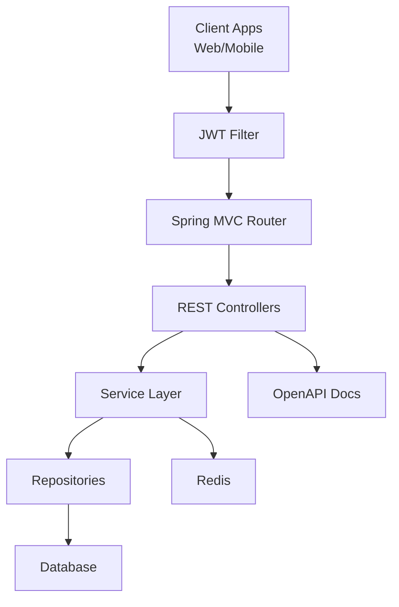
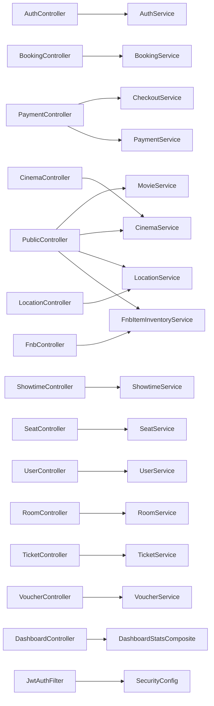

# API Reference

<cite>
**Referenced Files in This Document**
- [AuthController.java](file://backend/src/main/java/com/cinema/booking/controllers/AuthController.java)
- [BookingController.java](file://backend/src/main/java/com/cinema/booking/controllers/BookingController.java)
- [MovieController.java](file://backend/src/main/java/com/cinema/booking/controllers/MovieController.java)
- [ShowtimeController.java](file://backend/src/main/java/com/cinema/booking/controllers/ShowtimeController.java)
- [SeatController.java](file://backend/src/main/java/com/cinema/booking/controllers/SeatController.java)
- [UserController.java](file://backend/src/main/java/com/cinema/booking/controllers/UserController.java)
- [CinemaController.java](file://backend/src/main/java/com/cinema/booking/controllers/CinemaController.java)
- [RoomController.java](file://backend/src/main/java/com/cinema/booking/controllers/RoomController.java)
- [PaymentController.java](file://backend/src/main/java/com/cinema/booking/controllers/PaymentController.java)
- [TicketController.java](file://backend/src/main/java/com/cinema/booking/controllers/TicketController.java)
- [FnbController.java](file://backend/src/main/java/com/cinema/booking/controllers/FnbController.java)
- [VoucherController.java](file://backend/src/main/java/com/cinema/booking/controllers/VoucherController.java)
- [LocationController.java](file://backend/src/main/java/com/cinema/booking/controllers/LocationController.java)
- [DashboardController.java](file://backend/src/main/java/com/cinema/booking/controllers/DashboardController.java)
- [PublicController.java](file://backend/src/main/java/com/cinema/booking/controllers/PublicController.java)
- [SecurityConfig.java](file://backend/src/main/java/com/cinema/booking/config/SecurityConfig.java)
- [JwtUtils.java](file://backend/src/main/java/com/cinema/booking/security/JwtUtils.java)
- [JwtAuthFilter.java](file://backend/src/main/java/com/cinema/booking/security/JwtAuthFilter.java)
- [AuthEntryPointJwt.java](file://backend/src/main/java/com/cinema/booking/security/AuthEntryPointJwt.java)
- [UserDetailsServiceImpl.java](file://backend/src/main/java/com/cinema/booking/security/UserDetailsServiceImpl.java)
- [UserDetailsImpl.java](file://backend/src/main/java/com/cinema/booking/security/UserDetailsImpl.java)
- [SwaggerConfig.java](file://backend/src/main/java/com/cinema/booking/config/SwaggerConfig.java)
- [public_api_test.http](file://backend/public_api_test.http)
</cite>

## Table of Contents
1. [Introduction](#introduction)
2. [Project Structure](#project-structure)
3. [Core Components](#core-components)
4. [Architecture Overview](#architecture-overview)
5. [Detailed Component Analysis](#detailed-component-analysis)
6. [Dependency Analysis](#dependency-analysis)
7. [Performance Considerations](#performance-considerations)
8. [Troubleshooting Guide](#troubleshooting-guide)
9. [Conclusion](#conclusion)
10. [Appendices](#appendices)

## Introduction
This document provides a comprehensive API reference for the cinema booking system backend. It covers all REST endpoints grouped by functional areas, including authentication, booking management, movie listings, showtime scheduling, seat management, payment processing, F&B ordering, vouchers, locations, cinemas, rooms, tickets, user profiles, and administrative dashboards. For each endpoint, you will find HTTP methods, URL patterns, request/response schemas, authentication requirements, role-based access controls, error handling strategies, and practical examples sourced from the included test file.

## Project Structure
The backend is a Spring Boot application with a layered architecture:
- Controllers expose REST endpoints under the /api base path.
- Services encapsulate business logic.
- Repositories manage persistence.
- DTOs define request/response schemas.
- SecurityConfig, JwtUtils, and JwtAuthFilter handle authentication and authorization.
- SwaggerConfig enables OpenAPI documentation generation.

```mermaid
graph TB
subgraph "Controllers"
AC["AuthController"]
PC["PaymentController"]
BC["BookingController"]
MC["MovieController"]
SC["ShowtimeController"]
SEATC["SeatController"]
UC["UserController"]
CC["CinemaController"]
RC["RoomController"]
TC["TicketController"]
FC["FnbController"]
VC["VoucherController"]
LOC["LocationController"]
DC["DashboardController"]
PUB["PublicController"]
end
subgraph "Services"
AS["AuthService"]
BS["BookingService"]
MS["MovieService"]
SvcS["ShowtimeService"]
SES["SeatService"]
US["UserService"]
CS["CinemaService"]
RS["RoomService"]
TS["TicketService"]
PCS["PaymentService"]
CHS["CheckoutService"]
FIS["FnbItemInventoryService"]
VS["VoucherService"]
LS["LocationService"]
Dash["DashboardStatsComposite"]
end
AC --> AS
BC --> BS
MC --> MS
SC --> SvcS
SEATC --> SES
UC --> US
CC --> CS
RC --> RS
TC --> TS
PC --> PCS
PC --> CHS
FC --> FIS
VC --> VS
LOC --> LS
DC --> Dash
PUB --> MS
PUB --> CS
PUB --> LS
PUB --> FIS
```

**Diagram sources**
- [AuthController.java:1-54](file://backend/src/main/java/com/cinema/booking/controllers/AuthController.java#L1-L54)
- [BookingController.java:1-114](file://backend/src/main/java/com/cinema/booking/controllers/BookingController.java#L1-L114)
- [MovieController.java:1-64](file://backend/src/main/java/com/cinema/booking/controllers/MovieController.java#L1-L64)
- [ShowtimeController.java:1-54](file://backend/src/main/java/com/cinema/booking/controllers/ShowtimeController.java#L1-L54)
- [SeatController.java:1-60](file://backend/src/main/java/com/cinema/booking/controllers/SeatController.java#L1-L60)
- [UserController.java:1-36](file://backend/src/main/java/com/cinema/booking/controllers/UserController.java#L1-L36)
- [CinemaController.java:1-51](file://backend/src/main/java/com/cinema/booking/controllers/CinemaController.java#L1-L51)
- [RoomController.java:1-51](file://backend/src/main/java/com/cinema/booking/controllers/RoomController.java#L1-L51)
- [PaymentController.java:1-150](file://backend/src/main/java/com/cinema/booking/controllers/PaymentController.java#L1-L150)
- [TicketController.java:1-55](file://backend/src/main/java/com/cinema/booking/controllers/TicketController.java#L1-L55)
- [FnbController.java:1-156](file://backend/src/main/java/com/cinema/booking/controllers/FnbController.java#L1-L156)
- [VoucherController.java:1-56](file://backend/src/main/java/com/cinema/booking/controllers/VoucherController.java#L1-L56)
- [LocationController.java:1-51](file://backend/src/main/java/com/cinema/booking/controllers/LocationController.java#L1-L51)
- [DashboardController.java:1-68](file://backend/src/main/java/com/cinema/booking/controllers/DashboardController.java#L1-L68)
- [PublicController.java:1-167](file://backend/src/main/java/com/cinema/booking/controllers/PublicController.java#L1-L167)

**Section sources**
- [AuthController.java:1-54](file://backend/src/main/java/com/cinema/booking/controllers/AuthController.java#L1-L54)
- [BookingController.java:1-114](file://backend/src/main/java/com/cinema/booking/controllers/BookingController.java#L1-L114)
- [MovieController.java:1-64](file://backend/src/main/java/com/cinema/booking/controllers/MovieController.java#L1-L64)
- [ShowtimeController.java:1-54](file://backend/src/main/java/com/cinema/booking/controllers/ShowtimeController.java#L1-L54)
- [SeatController.java:1-60](file://backend/src/main/java/com/cinema/booking/controllers/SeatController.java#L1-L60)
- [UserController.java:1-36](file://backend/src/main/java/com/cinema/booking/controllers/UserController.java#L1-L36)
- [CinemaController.java:1-51](file://backend/src/main/java/com/cinema/booking/controllers/CinemaController.java#L1-L51)
- [RoomController.java:1-51](file://backend/src/main/java/com/cinema/booking/controllers/RoomController.java#L1-L51)
- [PaymentController.java:1-150](file://backend/src/main/java/com/cinema/booking/controllers/PaymentController.java#L1-L150)
- [TicketController.java:1-55](file://backend/src/main/java/com/cinema/booking/controllers/TicketController.java#L1-L55)
- [FnbController.java:1-156](file://backend/src/main/java/com/cinema/booking/controllers/FnbController.java#L1-L156)
- [VoucherController.java:1-56](file://backend/src/main/java/com/cinema/booking/controllers/VoucherController.java#L1-L56)
- [LocationController.java:1-51](file://backend/src/main/java/com/cinema/booking/controllers/LocationController.java#L1-L51)
- [DashboardController.java:1-68](file://backend/src/main/java/com/cinema/booking/controllers/DashboardController.java#L1-L68)
- [PublicController.java:1-167](file://backend/src/main/java/com/cinema/booking/controllers/PublicController.java#L1-L167)

## Core Components
- Authentication and Authorization: JWT-based authentication with role-based access control via Spring Security.
- Booking Engine: Seat rendering, Redis-based seat locking, pricing calculation, and booking state transitions.
- Payment Processing: MoMo checkout, callbacks, webhooks, and transaction history.
- Content Management: Movies, showtimes, cinemas, rooms, seats, locations, F&B items and categories, vouchers.
- Reporting and Dashboards: System statistics and weekly revenue aggregation.

**Section sources**
- [SecurityConfig.java](file://backend/src/main/java/com/cinema/booking/config/SecurityConfig.java)
- [JwtUtils.java](file://backend/src/main/java/com/cinema/booking/security/JwtUtils.java)
- [JwtAuthFilter.java](file://backend/src/main/java/com/cinema/booking/security/JwtAuthFilter.java)
- [AuthEntryPointJwt.java](file://backend/src/main/java/com/cinema/booking/security/AuthEntryPointJwt.java)
- [UserDetailsServiceImpl.java](file://backend/src/main/java/com/cinema/booking/security/UserDetailsServiceImpl.java)
- [UserDetailsImpl.java](file://backend/src/main/java/com/cinema/booking/security/UserDetailsImpl.java)

## Architecture Overview
The system follows a layered REST architecture with clear separation of concerns:
- Controllers expose endpoints and delegate to services.
- Services coordinate business logic and orchestrate repositories.
- DTOs decouple internal entities from external APIs.
- Security filters intercept requests to enforce authentication and authorization.
- SwaggerConfig enables OpenAPI documentation.

**Diagram sources**
- [JwtAuthFilter.java](file://backend/src/main/java/com/cinema/booking/security/JwtAuthFilter.java)
- [SwaggerConfig.java](file://backend/src/main/java/com/cinema/booking/config/SwaggerConfig.java)

## Detailed Component Analysis

### Authentication Endpoints
- Base Path: /api/auth
- Methods:
  - POST /api/auth/login
    - Request: LoginRequest
    - Response: JwtResponse or MessageResponse
    - Status Codes: 200 OK, 400 Bad Request
    - Description: Authenticate user by email/password.
  - POST /api/auth/register
    - Request: SignupRequest
    - Response: MessageResponse
    - Status Codes: 200 OK, 400 Bad Request
    - Description: Register a new user account.
  - POST /api/auth/google-login
    - Request: { idToken: string }
    - Response: JwtResponse or MessageResponse
    - Status Codes: 200 OK, 400 Bad Request
    - Description: Authenticate via Google ID token.

Authentication Requirements:
- No authentication required for login/register/google-login.
- Subsequent protected endpoints require a valid JWT in the Authorization header.

Common Errors:
- Invalid credentials or registration conflicts return 400 with a message body.

Example Requests (from test file):
- POST /api/auth/login
  - Headers: Content-Type: application/json
  - Body: { "email": "...", "password": "..." }
- POST /api/auth/register
  - Body: { "username": "...", "email": "...", "password": "...", "phone": "..." }
- POST /api/auth/google-login
  - Body: { "idToken": "..." }

**Section sources**
- [AuthController.java:21-52](file://backend/src/main/java/com/cinema/booking/controllers/AuthController.java#L21-L52)
- [public_api_test.http](file://backend/public_api_test.http)

### Booking Endpoints
- Base Path: /api/booking
- Methods:
  - GET /api/booking/seats/{showtimeId}
    - Path Variable: showtimeId (Integer)
    - Response: List of SeatStatusDTO
    - Status Codes: 200 OK
    - Description: Get seat layout and statuses for a showtime.
  - POST /api/booking/lock
    - Query Params: showtimeId (Integer), seatId (Integer), userId (Integer)
    - Response: Success message or error
    - Status Codes: 200 OK, 400 Bad Request
    - Description: Temporarily lock a seat using Redis SETNX for 10 minutes.
  - POST /api/booking/unlock
    - Query Params: showtimeId (Integer), seatId (Integer)
    - Response: Success message
    - Status Codes: 200 OK
    - Description: Release a previously locked seat.
  - POST /api/booking/calculate
    - Request: BookingCalculationDTO
    - Response: PriceBreakdownDTO
    - Status Codes: 200 OK
    - Description: Calculate total price including tickets and F&B with optional voucher.
  - GET /api/booking/{bookingId}
    - Path Variable: bookingId (Integer)
    - Response: BookingDTO
    - Status Codes: 200 OK
    - Description: Retrieve booking details including tickets and F&B lines.
  - GET /api/booking/search
    - Query Param: query (String)
    - Response: Search results or error
    - Status Codes: 200 OK, 500 Internal Server Error
    - Description: Staff search by ID, phone, or email.
  - POST /api/booking/{bookingId}/cancel
    - Path Variable: bookingId (Integer)
    - Response: Success or error message
    - Status Codes: 200 OK, 400 Bad Request
    - Description: Cancel booking (State Pattern).
  - POST /api/booking/{bookingId}/refund
    - Path Variable: bookingId (Integer)
    - Response: Success or error message
    - Status Codes: 200 OK, 400 Bad Request
    - Description: Refund booking (State Pattern).
  - POST /api/booking/{bookingId}/print
    - Path Variable: bookingId (Integer)
    - Response: Success or error message
    - Status Codes: 200 OK, 400 Bad Request
    - Description: Print tickets (State Pattern).

Authentication and Roles:
- Booking endpoints are generally for authenticated users; state transitions may require staff/admin privileges depending on service logic.

Common Errors:
- Seat lock failures return 400 with a descriptive message.
- State transition errors return 400 with the specific error.

Example Requests (from test file):
- POST /api/booking/lock?showtimeId=1&seatId=10&userId=1
- POST /api/booking/calculate
  - Body: { "showtimeId": 1, "seatIds": [10], "fnbs": [], "promoCode": null, "userId": 1 }

**Section sources**
- [BookingController.java:27-112](file://backend/src/main/java/com/cinema/booking/controllers/BookingController.java#L27-L112)
- [public_api_test.http](file://backend/public_api_test.http)

### Payment and Checkout Endpoints
- Base Path: /api/payment
- Methods:
  - POST /api/payment/checkout
    - Request: CheckoutRequestDTO
    - Response: { payUrl: string } or error
    - Status Codes: 200 OK, 400 Bad Request
    - Description: Create booking and obtain MoMo pay URL.
  - POST /api/payment/checkout/demo
    - Request: CheckoutRequestDTO
    - Query Params: success (boolean, default true)
    - Response: Demo checkout result
    - Status Codes: 200 OK, 400 Bad Request
    - Description: Demo checkout without real MoMo call.
  - GET /api/payment/momo/callback
    - Query Params: (MoMo callback parameters)
    - Response: RedirectView to frontend
    - Description: Handle MoMo redirect after payment.
  - POST /api/payment/momo/webhook
    - Request: MomoCallbackRequest
    - Response: 204 No Content or error
    - Status Codes: 204 OK, 400 Bad Request
    - Description: MoMo server-to-server IPN webhook.
  - GET /api/payment/payment-redirect
    - Response: RedirectView to frontend transactions page
    - Description: General result page redirection.
  - GET /api/payment/history/{userId}
    - Path Variable: userId (Integer)
    - Response: User payment history
    - Status Codes: 200 OK, 400 Bad Request
    - Description: Retrieve user’s payment history.
  - GET /api/payment/details/{paymentId}
    - Path Variable: paymentId (Integer)
    - Response: Payment entity
    - Status Codes: 200 OK, 400 Bad Request
    - Description: Retrieve payment details.
  - POST /api/payment/staff/cash-checkout
    - Request: CheckoutRequestDTO
    - Response: Immediate confirmed booking/payment
    - Status Codes: 200 OK, 400 Bad Request
    - Description: Staff cash checkout at POS.

Authentication and Roles:
- Payment endpoints are primarily for authenticated users; staff-specific endpoints may require STAFF/Admin roles.

Common Errors:
- MoMo callback/webhook processing errors return 400 with error messages.
- Payment history retrieval errors return 400 with error messages.

Example Requests (from test file):
- POST /api/payment/checkout
  - Body: { "userId": 1, "showtimeId": 1, "seatIds": [10], "fnbs": [], "promoCode": null, "paymentMethod": "MOMO" }
- GET /api/payment/momo/callback?orderId=...&resultCode=0

**Section sources**
- [PaymentController.java:33-148](file://backend/src/main/java/com/cinema/booking/controllers/PaymentController.java#L33-L148)
- [public_api_test.http](file://backend/public_api_test.http)

### Movie Endpoints
- Base Path: /api/movies
- Methods:
  - GET /api/movies
    - Query Param: status (enum: NOW_SHOWING, COMING_SOON)
    - Response: List of MovieDTO
    - Status Codes: 200 OK
    - Description: List movies filtered by status or all.
  - GET /api/movies/{id}
    - Path Variable: id (Integer)
    - Response: MovieDTO
    - Status Codes: 200 OK
    - Description: Get movie by ID.
  - POST /api/movies
    - Request: MovieDTO
    - Response: MovieDTO
    - Status Codes: 200 OK
    - Description: Create a new movie.
  - PUT /api/movies/{id}
    - Path Variable: id (Integer)
    - Request: MovieDTO
    - Response: MovieDTO
    - Status Codes: 200 OK
    - Description: Update movie details.
  - PUT /api/movies/{id}/casts
    - Path Variable: id (Integer)
    - Request: List of MovieCastDTO
    - Response: MovieDTO
    - Status Codes: 200 OK
    - Description: Replace cast list for a movie.
  - DELETE /api/movies/{id}
    - Path Variable: id (Integer)
    - Response: 200 OK
    - Status Codes: 200 OK
    - Description: Delete movie.

Pagination, Filtering, Sorting:
- Not applicable for this endpoint set.

**Section sources**
- [MovieController.java:22-62](file://backend/src/main/java/com/cinema/booking/controllers/MovieController.java#L22-L62)

### Showtime Endpoints (Admin)
- Base Path: /api/admin/showtimes
- Methods:
  - GET /api/admin/showtimes
    - Response: List of ShowtimeDTO
    - Status Codes: 200 OK
    - Description: Get all showtimes.
  - GET /api/admin/showtimes/{id}
    - Path Variable: id (Integer)
    - Response: ShowtimeDTO
    - Status Codes: 200 OK
    - Description: Get showtime by ID.
  - POST /api/admin/showtimes
    - Request: ShowtimeDTO
    - Response: ShowtimeDTO
    - Status Codes: 200 OK
    - Description: Create showtime (auto computes end time and weekend surcharge).
  - PUT /api/admin/showtimes/{id}
    - Path Variable: id (Integer)
    - Request: ShowtimeDTO
    - Response: ShowtimeDTO
    - Status Codes: 200 OK
    - Description: Update showtime.
  - DELETE /api/admin/showtimes/{id}
    - Path Variable: id (Integer)
    - Response: 200 OK
    - Status Codes: 200 OK
    - Description: Delete showtime.

Authentication and Roles:
- Requires ADMIN or STAFF role.

**Section sources**
- [ShowtimeController.java:23-52](file://backend/src/main/java/com/cinema/booking/controllers/ShowtimeController.java#L23-L52)

### Seat Endpoints
- Base Path: /api/seats
- Methods:
  - GET /api/seats
    - Query Param: roomId (Integer)
    - Response: List of SeatDTO
    - Status Codes: 200 OK
    - Description: List all seats or filter by room.
  - GET /api/seats/{id}
    - Path Variable: id (Integer)
    - Response: SeatDTO
    - Status Codes: 200 OK
    - Description: Get seat by ID.
  - POST /api/seats
    - Request: SeatDTO
    - Response: SeatDTO
    - Status Codes: 200 OK
    - Description: Create seat.
  - PUT /api/seats/{id}
    - Path Variable: id (Integer)
    - Request: SeatDTO
    - Response: SeatDTO
    - Status Codes: 200 OK
    - Description: Update seat.
  - DELETE /api/seats/{id}
    - Path Variable: id (Integer)
    - Response: 200 OK
    - Status Codes: 200 OK
    - Description: Delete seat.
  - PUT /api/seats/batch/{roomId}
    - Path Variable: roomId (Integer)
    - Request: List of SeatDTO
    - Response: List of SeatDTO
    - Status Codes: 200 OK
    - Description: Batch replace all seats in a room.

**Section sources**
- [SeatController.java:20-57](file://backend/src/main/java/com/cinema/booking/controllers/SeatController.java#L20-L57)

### User Profile Endpoints
- Base Path: /api/users
- Methods:
  - GET /api/users/me
    - Response: UserDTO
    - Status Codes: 200 OK
    - Description: Get current user profile.
    - Authentication: USER/ADMIN/STAFF
  - PUT /api/users/me
    - Request: UserUpdateRequest
    - Response: UserDTO
    - Status Codes: 200 OK
    - Description: Update current user profile.
    - Authentication: USER/ADMIN/STAFF

**Section sources**
- [UserController.java:22-34](file://backend/src/main/java/com/cinema/booking/controllers/UserController.java#L22-L34)

### Cinema Endpoints
- Base Path: /api/cinemas
- Methods:
  - GET /api/cinemas
    - Query Param: locationId (Integer)
    - Response: List of CinemaDTO
    - Status Codes: 200 OK
    - Description: List all cinemas or filter by location.
  - GET /api/cinemas/{id}
    - Path Variable: id (Integer)
    - Response: CinemaDTO
    - Status Codes: 200 OK
    - Description: Get cinema by ID.
  - POST /api/cinemas
    - Request: CinemaDTO
    - Response: CinemaDTO
    - Status Codes: 200 OK
    - Description: Create cinema.
  - PUT /api/cinemas/{id}
    - Path Variable: id (Integer)
    - Request: CinemaDTO
    - Response: CinemaDTO
    - Status Codes: 200 OK
    - Description: Update cinema.
  - DELETE /api/cinemas/{id}
    - Path Variable: id (Integer)
    - Response: 200 OK
    - Status Codes: 200 OK
    - Description: Delete cinema.

**Section sources**
- [CinemaController.java:20-49](file://backend/src/main/java/com/cinema/booking/controllers/CinemaController.java#L20-L49)

### Room Endpoints
- Base Path: /api/rooms
- Methods:
  - GET /api/rooms
    - Query Param: cinemaId (Integer)
    - Response: List of RoomDTO
    - Status Codes: 200 OK
    - Description: List all rooms or filter by cinema.
  - GET /api/rooms/{id}
    - Path Variable: id (Integer)
    - Response: RoomDTO
    - Status Codes: 200 OK
    - Description: Get room by ID.
  - POST /api/rooms
    - Request: RoomDTO
    - Response: RoomDTO
    - Status Codes: 200 OK
    - Description: Create room.
  - PUT /api/rooms/{id}
    - Path Variable: id (Integer)
    - Request: RoomDTO
    - Response: RoomDTO
    - Status Codes: 200 OK
    - Description: Update room.
  - DELETE /api/rooms/{id}
    - Path Variable: id (Integer)
    - Response: 200 OK
    - Status Codes: 200 OK
    - Description: Delete room.

**Section sources**
- [RoomController.java:20-49](file://backend/src/main/java/com/cinema/booking/controllers/RoomController.java#L20-L49)

### Ticket Endpoints
- Base Path: /api/tickets
- Methods:
  - GET /api/tickets/booking/{bookingId}
    - Path Variable: bookingId (Integer)
    - Response: List of TicketDTO
    - Status Codes: 200 OK
    - Description: Get tickets by booking ID.
  - GET /api/tickets/user/{userId}
    - Path Variable: userId (Integer)
    - Response: List of TicketDTO
    - Status Codes: 200 OK
    - Description: Get tickets by user ID.
  - GET /api/tickets/{ticketId}
    - Path Variable: ticketId (Integer)
    - Response: TicketDTO or 404
    - Status Codes: 200 OK, 404 Not Found
    - Description: Get ticket details.
  - DELETE /api/tickets/{ticketId}
    - Path Variable: ticketId (Integer)
    - Response: 204 No Content or 404
    - Status Codes: 204 No Content, 404 Not Found
    - Description: Delete ticket (for staff).

**Section sources**
- [TicketController.java:22-53](file://backend/src/main/java/com/cinema/booking/controllers/TicketController.java#L22-L53)

### F&B Endpoints
- Base Path: /api/fnb
- Methods:
  - GET /api/fnb/items
    - Response: List of FnbItemDTO (includes stock quantities)
    - Status Codes: 200 OK
    - Description: Get all F&B items with inventory.
  - POST /api/fnb/items
    - Request: FnbItemDTO
    - Response: FnbItemDTO
    - Status Codes: 200 OK
    - Description: Create F&B item.
  - PUT /api/fnb/items/{id}
    - Path Variable: id (Integer)
    - Request: FnbItemDTO
    - Response: FnbItemDTO
    - Status Codes: 200 OK
    - Description: Update F&B item.
  - DELETE /api/fnb/items/{id}
    - Path Variable: id (Integer)
    - Response: 200 OK
    - Status Codes: 200 OK
    - Description: Delete F&B item.
  - GET /api/fnb/categories
    - Response: List of FnbCategoryDTO
    - Status Codes: 200 OK
    - Description: Get all F&B categories.
  - POST /api/fnb/categories
    - Request: FnbCategoryDTO
    - Response: FnbCategoryDTO
    - Status Codes: 200 OK
    - Description: Create category.
  - PUT /api/fnb/categories/{id}
    - Path Variable: id (Integer)
    - Request: FnbCategoryDTO
    - Response: FnbCategoryDTO
    - Status Codes: 200 OK
    - Description: Update category.
  - DELETE /api/fnb/categories/{id}
    - Path Variable: id (Integer)
    - Response: 200 OK
    - Status Codes: 200 OK
    - Description: Delete category.

**Section sources**
- [FnbController.java:36-133](file://backend/src/main/java/com/cinema/booking/controllers/FnbController.java#L36-L133)

### Voucher Endpoints
- Base Path: /api/vouchers
- Methods:
  - POST /api/vouchers
    - Request: VoucherDTO
    - Response: 201 Created
    - Status Codes: 201 Created, 400 Bad Request
    - Description: Create a new voucher stored in Redis with TTL.
    - Authentication: ADMIN/STAFF
  - GET /api/vouchers
    - Response: List of VoucherDTO
    - Status Codes: 200 OK
    - Description: List active vouchers.
    - Authentication: ADMIN/STAFF
  - PUT /api/vouchers/{code}
    - Path Variable: code (String)
    - Request: VoucherDTO
    - Response: 200 OK
    - Status Codes: 200 OK, 400 Bad Request
    - Description: Update existing voucher (preserves TTL).
    - Authentication: ADMIN/STAFF
  - DELETE /api/vouchers/{code}
    - Path Variable: code (String)
    - Response: 204 No Content
    - Status Codes: 204 No Content, 404 Not Found
    - Description: Delete a voucher.
    - Authentication: ADMIN/STAFF

**Section sources**
- [VoucherController.java:24-54](file://backend/src/main/java/com/cinema/booking/controllers/VoucherController.java#L24-L54)

### Location Endpoints
- Base Path: /api/locations
- Methods:
  - GET /api/locations
    - Response: List of LocationDTO
    - Status Codes: 200 OK
    - Description: Get all locations.
  - GET /api/locations/{id}
    - Path Variable: id (Integer)
    - Response: LocationDTO
    - Status Codes: 200 OK
    - Description: Get location by ID.
  - POST /api/locations
    - Request: LocationDTO
    - Response: LocationDTO
    - Status Codes: 200 OK
    - Description: Create location.
  - PUT /api/locations/{id}
    - Path Variable: id (Integer)
    - Request: LocationDTO
    - Response: LocationDTO
    - Status Codes: 200 OK
    - Description: Update location.
  - DELETE /api/locations/{id}
    - Path Variable: id (Integer)
    - Response: 200 OK
    - Status Codes: 200 OK
    - Description: Delete location.

**Section sources**
- [LocationController.java:20-49](file://backend/src/main/java/com/cinema/booking/controllers/LocationController.java#L20-L49)

### Dashboard Endpoints (Admin)
- Base Path: /api/admin/dashboard
- Methods:
  - GET /api/admin/dashboard/stats
    - Response: Map<String, Object> aggregated stats
    - Status Codes: 200 OK
    - Description: Get system-wide statistics.
  - GET /api/admin/dashboard/revenue-weekly
    - Response: List of { day, amount }
    - Status Codes: 200 OK
    - Description: Get last 7 days revenue.

**Section sources**
- [DashboardController.java:31-66](file://backend/src/main/java/com/cinema/booking/controllers/DashboardController.java#L31-L66)

### Public API Endpoints (End-User)
- Base Path: /api/public
- Methods:
  - GET /api/public/movies/now-showing
    - Response: List of MovieDTO (NOW_SHOWING)
    - Status Codes: 200 OK
    - Description: Get currently showing movies.
  - GET /api/public/movies/coming-soon
    - Response: List of MovieDTO (COMING_SOON)
    - Status Codes: 200 OK
    - Description: Get coming soon movies.
  - GET /api/public/cinemas
    - Response: List of CinemaDTO
    - Status Codes: 200 OK
    - Description: Get all cinema chains.
  - GET /api/public/locations
    - Response: List of LocationDTO
    - Status Codes: 200 OK
    - Description: Get all locations.
  - GET /api/public/showtimes
    - Query Params: cinemaId (Integer), movieId (Integer), date (String)
    - Response: List of ShowtimeDTO
    - Status Codes: 200 OK
    - Description: Get public showtimes with basic filters.
  - GET /api/public/showtimes/filter
    - Query Params: cinemaId, movieId, date, locationId, screenType, minPrice, maxPrice
    - Response: List of ShowtimeDTO
    - Status Codes: 200 OK
    - Description: Advanced showtime filtering using builder pattern.
  - GET /api/public/fnb/categories
    - Response: List of FnbCategory
    - Status Codes: 200 OK
    - Description: Get public F&B categories.
  - GET /api/public/fnb/items
    - Response: List of FnbItemDTO (with stock quantities)
    - Status Codes: 200 OK
    - Description: Get public F&B menu.

Pagination, Filtering, Sorting:
- Pagination is not implemented for list endpoints.
- Filtering is supported via query parameters per endpoint.
- Sorting is not exposed as a query parameter.

**Section sources**
- [PublicController.java:62-165](file://backend/src/main/java/com/cinema/booking/controllers/PublicController.java#L62-L165)

## Dependency Analysis
Key runtime dependencies and interactions:
- Controllers depend on Services for business logic.
- Services depend on Repositories for persistence and on external systems (e.g., MoMo, Redis).
- Security filter enforces JWT validation and role checks.
- SwaggerConfig generates OpenAPI documentation.

**Diagram sources**
- [AuthController.java:1-54](file://backend/src/main/java/com/cinema/booking/controllers/AuthController.java#L1-L54)
- [BookingController.java:1-114](file://backend/src/main/java/com/cinema/booking/controllers/BookingController.java#L1-L114)
- [PaymentController.java:1-150](file://backend/src/main/java/com/cinema/booking/controllers/PaymentController.java#L1-L150)
- [PublicController.java:1-167](file://backend/src/main/java/com/cinema/booking/controllers/PublicController.java#L1-L167)
- [JwtAuthFilter.java](file://backend/src/main/java/com/cinema/booking/security/JwtAuthFilter.java)
- [SecurityConfig.java](file://backend/src/main/java/com/cinema/booking/config/SecurityConfig.java)

**Section sources**
- [JwtAuthFilter.java](file://backend/src/main/java/com/cinema/booking/security/JwtAuthFilter.java)
- [SecurityConfig.java](file://backend/src/main/java/com/cinema/booking/config/SecurityConfig.java)

## Performance Considerations
- Redis Seat Locking: Efficient concurrent seat reservation with short TTLs reduces contention.
- Inventory Lookup: Batch inventory queries minimize database round trips for F&B listings.
- Pagination: Not implemented; consider adding pagination for large lists (e.g., showtimes, bookings).
- Caching: Consider caching frequently accessed public lists (movies, showtimes) with cache invalidation.
- Rate Limiting: Not configured in the provided code; implement at gateway or controller level to prevent abuse.

## Troubleshooting Guide
Common Issues and Resolutions:
- Authentication Failures
  - Symptom: 401 Unauthorized or Access Denied.
  - Cause: Missing/expired JWT or insufficient roles.
  - Resolution: Obtain a new token via /api/auth/login or /api/auth/register; ensure Authorization header is present.
- Seat Locking Conflicts
  - Symptom: 400 Bad Request indicating seat already locked/sold.
  - Cause: Concurrent booking attempts.
  - Resolution: Retry after unlock or choose another seat.
- Payment Callback/Webhook Errors
  - Symptom: 400 Bad Request on MoMo callback/webhook.
  - Cause: Invalid callback parameters or internal processing failure.
  - Resolution: Verify MoMo configuration and retry; check logs for details.
- Resource Not Found
  - Symptom: 404 Not Found on GET endpoints for tickets, showtimes, etc.
  - Cause: Invalid ID or resource deleted.
  - Resolution: Validate IDs and ensure resources exist.

**Section sources**
- [AuthController.java:21-52](file://backend/src/main/java/com/cinema/booking/controllers/AuthController.java#L21-L52)
- [BookingController.java:34-55](file://backend/src/main/java/com/cinema/booking/controllers/BookingController.java#L34-L55)
- [PaymentController.java:75-100](file://backend/src/main/java/com/cinema/booking/controllers/PaymentController.java#L75-L100)
- [TicketController.java:34-53](file://backend/src/main/java/com/cinema/booking/controllers/TicketController.java#L34-L53)

## Conclusion
This API reference documents all REST endpoints across the cinema booking system, detailing HTTP methods, URL patterns, request/response schemas, authentication and authorization requirements, and error handling. Administrators and developers can use this guide to integrate clients, implement robust error handling, and maintain backward compatibility while leveraging advanced features like Redis seat locking, MoMo payment processing, and composite dashboard reporting.

## Appendices

### Authentication and Authorization
- JWT Token Usage
  - Include Authorization: Bearer {token} header for protected endpoints.
  - Tokens are validated by JwtAuthFilter and roles enforced by SecurityConfig.
- Role-Based Access
  - USER: Access to personal profile and booking-related endpoints.
  - STAFF/ADMIN: Access to administrative endpoints (e.g., showtimes, vouchers, dashboard).

**Section sources**
- [JwtAuthFilter.java](file://backend/src/main/java/com/cinema/booking/security/JwtAuthFilter.java)
- [SecurityConfig.java](file://backend/src/main/java/com/cinema/booking/config/SecurityConfig.java)
- [UserController.java:24-34](file://backend/src/main/java/com/cinema/booking/controllers/UserController.java#L24-L34)
- [VoucherController.java:26-50](file://backend/src/main/java/com/cinema/booking/controllers/VoucherController.java#L26-L50)
- [ShowtimeController.java:16-18](file://backend/src/main/java/com/cinema/booking/controllers/ShowtimeController.java#L16-L18)
- [DashboardController.java:19-21](file://backend/src/main/java/com/cinema/booking/controllers/DashboardController.java#L19-L21)

### API Versioning and Backward Compatibility
- Current State
  - No explicit version prefix in URLs.
  - Public showtimes endpoint supports both legacy and enhanced filtering to preserve backward compatibility.
- Recommendations
  - Introduce versioned base paths (e.g., /api/v1) to enable future breaking changes.
  - Maintain deprecated endpoints with warnings until sunset dates.

**Section sources**
- [PublicController.java:91-108](file://backend/src/main/java/com/cinema/booking/controllers/PublicController.java#L91-L108)
- [PublicController.java:114-135](file://backend/src/main/java/com/cinema/booking/controllers/PublicController.java#L114-L135)

### Pagination, Filtering, and Sorting
- Pagination
  - Not implemented for list endpoints; consider adding page and size parameters.
- Filtering
  - Supported via query parameters (e.g., status, cinemaId, movieId, date, locationId, screenType, price range).
- Sorting
  - Not exposed as a query parameter; implement sort=field:asc/desc if needed.

**Section sources**
- [MovieController.java:24-29](file://backend/src/main/java/com/cinema/booking/controllers/MovieController.java#L24-L29)
- [CinemaController.java:22-27](file://backend/src/main/java/com/cinema/booking/controllers/CinemaController.java#L22-L27)
- [RoomController.java:22-27](file://backend/src/main/java/com/cinema/booking/controllers/RoomController.java#L22-L27)
- [PublicController.java:95-108](file://backend/src/main/java/com/cinema/booking/controllers/PublicController.java#L95-L108)
- [PublicController.java:116-135](file://backend/src/main/java/com/cinema/booking/controllers/PublicController.java#L116-L135)

### Practical Examples
Examples are taken from the included test file and demonstrate typical request/response flows for key endpoints.

- Authentication
  - POST /api/auth/login
    - Request: { email, password }
    - Response: { accessToken, tokenType, ... }
  - POST /api/auth/register
    - Request: { username, email, password, phone }
    - Response: Message indicating success.
  - POST /api/auth/google-login
    - Request: { idToken }
    - Response: { accessToken, tokenType, ... }

- Booking
  - POST /api/booking/lock
    - Request: Query params showtimeId, seatId, userId
    - Response: Success message or error.
  - POST /api/booking/calculate
    - Request: { showtimeId, seatIds, fnbs, promoCode, userId }
    - Response: Price breakdown.

- Payment
  - POST /api/payment/checkout
    - Request: { userId, showtimeId, seatIds, fnbs, promoCode, paymentMethod }
    - Response: { payUrl }.
  - GET /api/payment/momo/callback
    - Request: MoMo callback parameters
    - Response: Redirect to frontend result page.

- Public
  - GET /api/public/showtimes
    - Request: Query params cinemaId, movieId, date
    - Response: List of showtimes.
  - GET /api/public/showtimes/filter
    - Request: Extended filter parameters
    - Response: Filtered showtimes.

**Section sources**
- [public_api_test.http](file://backend/public_api_test.http)