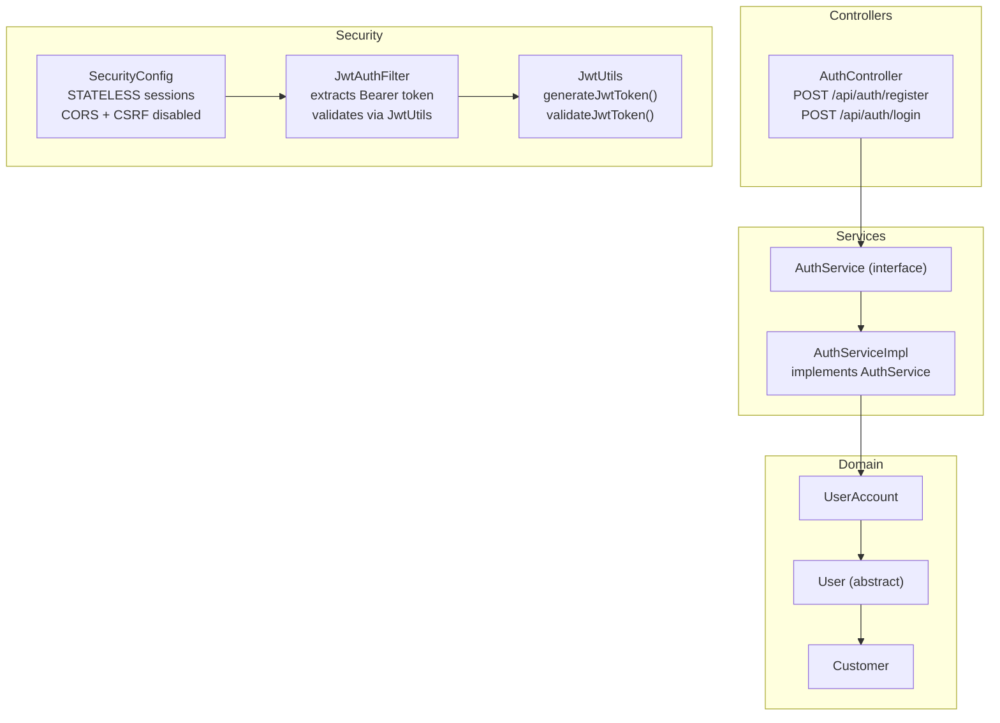
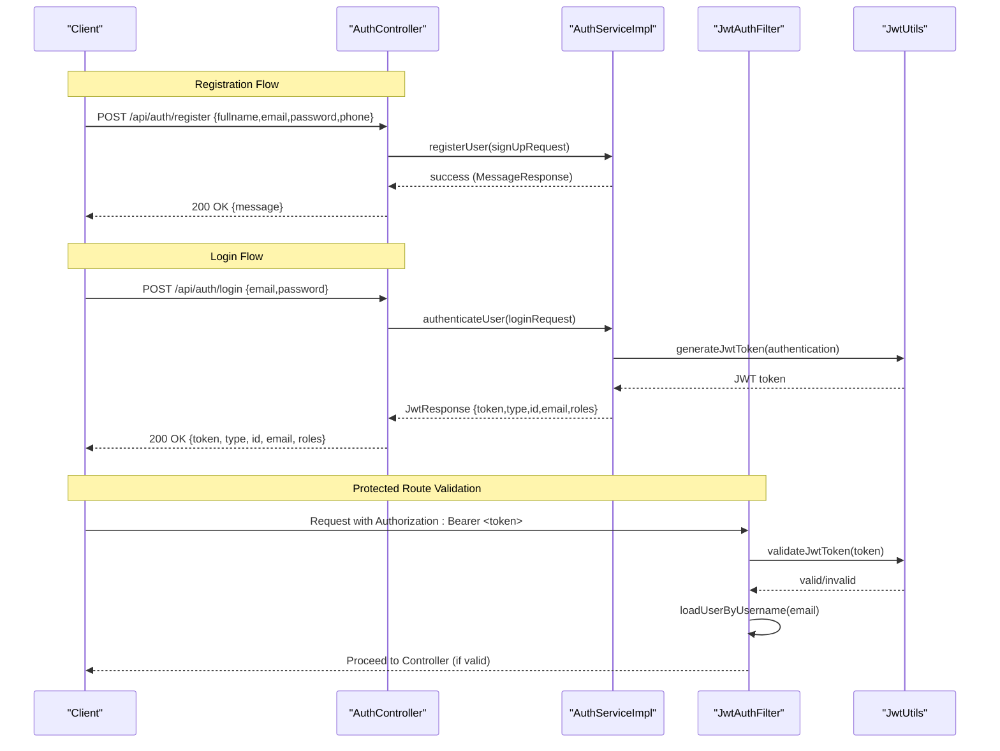
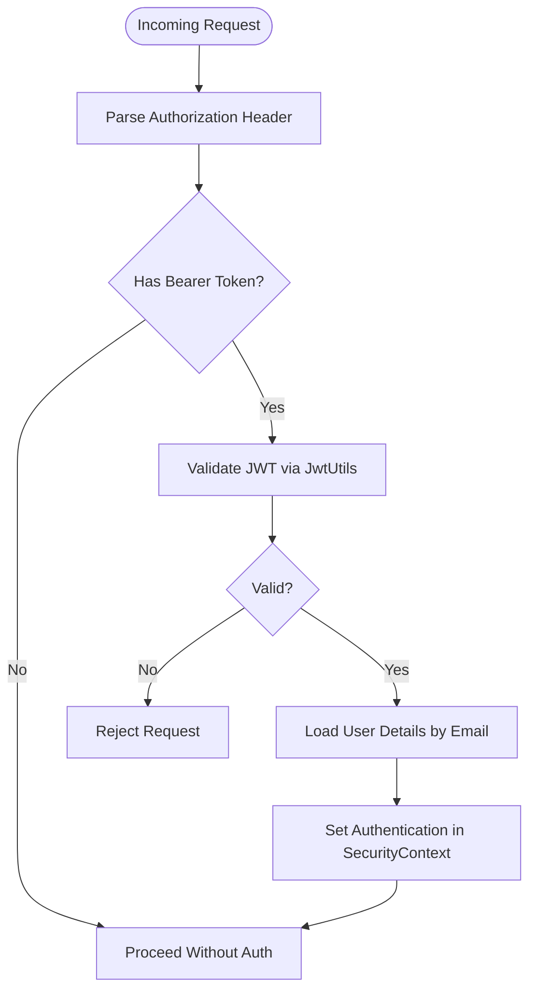
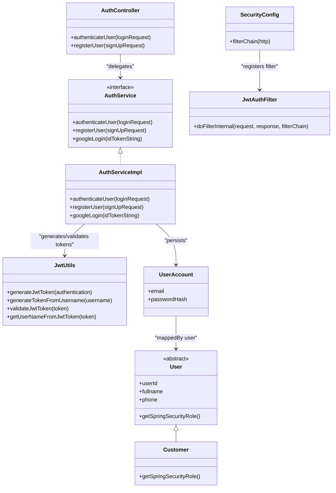

# Authentication API

<cite>
**Referenced Files in This Document**
- [AuthController.java](file://backend/src/main/java/com/cinema/booking/controllers/AuthController.java)
- [AuthService.java](file://backend/src/main/java/com/cinema/booking/services/AuthService.java)
- [AuthServiceImpl.java](file://backend/src/main/java/com/cinema/booking/services/impl/AuthServiceImpl.java)
- [JwtUtils.java](file://backend/src/main/java/com/cinema/booking/security/JwtUtils.java)
- [JwtAuthFilter.java](file://backend/src/main/java/com/cinema/booking/security/JwtAuthFilter.java)
- [SecurityConfig.java](file://backend/src/main/java/com/cinema/booking/config/SecurityConfig.java)
- [application.properties](file://backend/src/main/resources/application.properties)
- [SignupRequest.java](file://backend/src/main/java/com/cinema/booking/dtos/SignupRequest.java)
- [LoginRequest.java](file://backend/src/main/java/com/cinema/booking/dtos/LoginRequest.java)
- [JwtResponse.java](file://backend/src/main/java/com/cinema/booking/dtos/JwtResponse.java)
- [User.java](file://backend/src/main/java/com/cinema/booking/entities/User.java)
- [Customer.java](file://backend/src/main/java/com/cinema/booking/entities/Customer.java)
- [UserAccount.java](file://backend/src/main/java/com/cinema/booking/entities/UserAccount.java)
</cite>

## Table of Contents
1. [Introduction](#introduction)
2. [Project Structure](#project-structure)
3. [Core Components](#core-components)
4. [Architecture Overview](#architecture-overview)
5. [Detailed Component Analysis](#detailed-component-analysis)
6. [Dependency Analysis](#dependency-analysis)
7. [Performance Considerations](#performance-considerations)
8. [Troubleshooting Guide](#troubleshooting-guide)
9. [Conclusion](#conclusion)

## Introduction
This document provides API documentation for the authentication endpoints in the cinema booking system. It covers:
- POST /api/auth/register for customer registration with email, password, and profile fields
- POST /api/auth/login for JWT token generation using email and password
- Response schemas including JWT tokens, user roles, and account identifiers
- Authentication middleware requirements, token validation, and expiration handling
- Refresh token strategies and common error scenarios

## Project Structure
The authentication subsystem is implemented using Spring MVC controllers, service layer, Spring Security filters, and JWT utilities. The controller exposes endpoints under /api/auth, delegates to the service layer for business logic, and relies on JWT utilities and filters for token generation and validation.

**Diagram sources**
- [AuthController.java:13-54](file://backend/src/main/java/com/cinema/booking/controllers/AuthController.java#L13-L54)
- [AuthService.java:7-11](file://backend/src/main/java/com/cinema/booking/services/AuthService.java#L7-L11)
- [AuthServiceImpl.java:27-139](file://backend/src/main/java/com/cinema/booking/services/impl/AuthServiceImpl.java#L27-L139)
- [SecurityConfig.java:24-82](file://backend/src/main/java/com/cinema/booking/config/SecurityConfig.java#L24-L82)
- [JwtAuthFilter.java:18-64](file://backend/src/main/java/com/cinema/booking/security/JwtAuthFilter.java#L18-L64)
- [JwtUtils.java:15-71](file://backend/src/main/java/com/cinema/booking/security/JwtUtils.java#L15-L71)
- [UserAccount.java:6-30](file://backend/src/main/java/com/cinema/booking/entities/UserAccount.java#L6-L30)
- [User.java:6-38](file://backend/src/main/java/com/cinema/booking/entities/User.java#L6-L38)
- [Customer.java:8-31](file://backend/src/main/java/com/cinema/booking/entities/Customer.java#L8-L31)

**Section sources**
- [AuthController.java:13-54](file://backend/src/main/java/com/cinema/booking/controllers/AuthController.java#L13-L54)
- [SecurityConfig.java:50-79](file://backend/src/main/java/com/cinema/booking/config/SecurityConfig.java#L50-L79)

## Core Components
- AuthController: Exposes /api/auth/register and /api/auth/login endpoints. Wraps service responses and handles exceptions.
- AuthService and AuthServiceImpl: Define and implement authentication and registration logic, including JWT generation and user creation.
- JwtUtils: Generates and validates JWT tokens using HS256 with a configurable secret and expiration.
- JwtAuthFilter: Extracts Authorization Bearer tokens, validates them, loads user details, and sets the SecurityContext.
- SecurityConfig: Configures stateless sessions, permits unauthenticated access to /api/auth/**, and registers JwtAuthFilter.

**Section sources**
- [AuthController.java:13-54](file://backend/src/main/java/com/cinema/booking/controllers/AuthController.java#L13-L54)
- [AuthService.java:7-11](file://backend/src/main/java/com/cinema/booking/services/AuthService.java#L7-L11)
- [AuthServiceImpl.java:27-139](file://backend/src/main/java/com/cinema/booking/services/impl/AuthServiceImpl.java#L27-L139)
- [JwtUtils.java:15-71](file://backend/src/main/java/com/cinema/booking/security/JwtUtils.java#L15-L71)
- [JwtAuthFilter.java:18-64](file://backend/src/main/java/com/cinema/booking/security/JwtAuthFilter.java#L18-L64)
- [SecurityConfig.java:24-82](file://backend/src/main/java/com/cinema/booking/config/SecurityConfig.java#L24-L82)

## Architecture Overview
The authentication flow integrates HTTP endpoints, Spring Security filters, and JWT utilities to provide secure, stateless authentication.

**Diagram sources**
- [AuthController.java:21-41](file://backend/src/main/java/com/cinema/booking/controllers/AuthController.java#L21-L41)
- [AuthServiceImpl.java:44-61](file://backend/src/main/java/com/cinema/booking/services/impl/AuthServiceImpl.java#L44-L61)
- [JwtUtils.java:30-39](file://backend/src/main/java/com/cinema/booking/security/JwtUtils.java#L30-L39)
- [JwtAuthFilter.java:27-51](file://backend/src/main/java/com/cinema/booking/security/JwtAuthFilter.java#L27-L51)

## Detailed Component Analysis

### Authentication Endpoints

#### POST /api/auth/register
- Purpose: Register a new customer with profile and credentials.
- Request body: [SignupRequest:9-25](file://backend/src/main/java/com/cinema/booking/dtos/SignupRequest.java#L9-L25)
  - fullname: string, required
  - email: string, required, unique
  - password: string, required, min 6 chars
  - phone: string, optional
- Response: 200 OK with [MessageResponse:1-200](file://backend/src/main/java/com/cinema/booking/dtos/MessageResponse.java#L1-L200) on success; 400 Bad Request with error message on failure.
- Business logic: Validates uniqueness of email, creates a Customer and associated UserAccount with encoded password, persists entities, and attempts to send a welcome email.

Common errors:
- Duplicate email: thrown when email already exists in [AuthServiceImpl.registerUser:68-71](file://backend/src/main/java/com/cinema/booking/services/impl/AuthServiceImpl.java#L68-L71).

Successful response example:
- Body: {"message":"Created account successfully. Welcome to Galaxy Cinema ecosystem."}

**Section sources**
- [AuthController.java:33-41](file://backend/src/main/java/com/cinema/booking/controllers/AuthController.java#L33-L41)
- [SignupRequest.java:9-25](file://backend/src/main/java/com/cinema/booking/dtos/SignupRequest.java#L9-L25)
- [AuthServiceImpl.java:66-92](file://backend/src/main/java/com/cinema/booking/services/impl/AuthServiceImpl.java#L66-L92)

#### POST /api/auth/login
- Purpose: Authenticate user and return a JWT access token.
- Request body: [LoginRequest:7-13](file://backend/src/main/java/com/cinema/booking/dtos/LoginRequest.java#L7-L13)
  - email: string, required
  - password: string, required
- Response: 200 OK with [JwtResponse:10-23](file://backend/src/main/java/com/cinema/booking/dtos/JwtResponse.java#L10-L23) on success; 400 Bad Request with error message on failure.
- Business logic: Authenticates via AuthenticationManager, generates JWT using [JwtUtils.generateJwtToken:30-39](file://backend/src/main/java/com/cinema/booking/security/JwtUtils.java#L30-L39), extracts roles from UserDetails, and returns token with user info.

JwtResponse fields:
- token: string (JWT access token)
- type: string ("Bearer")
- id: integer (user identifier)
- email: string (user email)
- roles: array of strings (e.g., ["ROLE_USER"])

**Section sources**
- [AuthController.java:21-31](file://backend/src/main/java/com/cinema/booking/controllers/AuthController.java#L21-L31)
- [LoginRequest.java:7-13](file://backend/src/main/java/com/cinema/booking/dtos/LoginRequest.java#L7-L13)
- [JwtResponse.java:10-23](file://backend/src/main/java/com/cinema/booking/dtos/JwtResponse.java#L10-L23)
- [AuthServiceImpl.java:44-61](file://backend/src/main/java/com/cinema/booking/services/impl/AuthServiceImpl.java#L44-L61)
- [JwtUtils.java:30-39](file://backend/src/main/java/com/cinema/booking/security/JwtUtils.java#L30-L39)

### Authentication Middleware and Token Management

#### Authentication Filter Chain
- JwtAuthFilter extracts Authorization: Bearer <token>, validates the token via [JwtUtils.validateJwtToken:55-69](file://backend/src/main/java/com/cinema/booking/security/JwtUtils.java#L55-L69), loads user details, and sets SecurityContext for subsequent controllers.
- SecurityConfig configures stateless sessions, permits /api/auth/**, and registers JwtAuthFilter before UsernamePasswordAuthenticationFilter.

**Diagram sources**
- [JwtAuthFilter.java:27-51](file://backend/src/main/java/com/cinema/booking/security/JwtAuthFilter.java#L27-L51)
- [JwtUtils.java:55-69](file://backend/src/main/java/com/cinema/booking/security/JwtUtils.java#L55-L69)
- [SecurityConfig.java:50-79](file://backend/src/main/java/com/cinema/booking/config/SecurityConfig.java#L50-L79)

#### Token Expiration and Secrets
- Expiration: Configured via [application.properties](file://backend/src/main/resources/application.properties#L46) as 86400000 ms (24 hours).
- Secret: Configured via [application.properties](file://backend/src/main/resources/application.properties#L45) as cinema.app.jwtSecret.
- Token generation uses HS256 with the configured secret and sets issued-at and expiration timestamps.

**Section sources**
- [JwtUtils.java:19-28](file://backend/src/main/java/com/cinema/booking/security/JwtUtils.java#L19-L28)
- [JwtUtils.java:30-48](file://backend/src/main/java/com/cinema/booking/security/JwtUtils.java#L30-L48)
- [application.properties:45-46](file://backend/src/main/resources/application.properties#L45-L46)

#### Role Model and Account Status
- Roles: Derived from the User hierarchy. [Customer:27-29](file://backend/src/main/java/com/cinema/booking/entities/Customer.java#L27-L29) returns "USER". Roles are prefixed with "ROLE_" in [AuthServiceImpl.googleLogin:129-130](file://backend/src/main/java/com/cinema/booking/services/impl/AuthServiceImpl.java#L129-L130).
- Account status: Not explicitly exposed in JwtResponse; presence of a valid JWT implies authenticated session.

**Section sources**
- [User.java:32-37](file://backend/src/main/java/com/cinema/booking/entities/User.java#L32-L37)
- [Customer.java:27-29](file://backend/src/main/java/com/cinema/booking/entities/Customer.java#L27-L29)
- [AuthServiceImpl.java:129-130](file://backend/src/main/java/com/cinema/booking/services/impl/AuthServiceImpl.java#L129-L130)

### Logout Strategy
- Stateless JWT: No server-side session storage; logout is achieved by discarding the client-side token. Revocation is not supported without a blacklist or short-lived tokens with refresh tokens.
- Recommendation: Implement refresh token rotation and maintain a revocation list if logout-on-demand is required.

[No sources needed since this section provides general guidance]

## Dependency Analysis

**Diagram sources**
- [AuthController.java:13-54](file://backend/src/main/java/com/cinema/booking/controllers/AuthController.java#L13-L54)
- [AuthService.java:7-11](file://backend/src/main/java/com/cinema/booking/services/AuthService.java#L7-L11)
- [AuthServiceImpl.java:27-139](file://backend/src/main/java/com/cinema/booking/services/impl/AuthServiceImpl.java#L27-L139)
- [JwtUtils.java:15-71](file://backend/src/main/java/com/cinema/booking/security/JwtUtils.java#L15-L71)
- [JwtAuthFilter.java:18-64](file://backend/src/main/java/com/cinema/booking/security/JwtAuthFilter.java#L18-L64)
- [SecurityConfig.java:24-82](file://backend/src/main/java/com/cinema/booking/config/SecurityConfig.java#L24-L82)
- [UserAccount.java:6-30](file://backend/src/main/java/com/cinema/booking/entities/UserAccount.java#L6-L30)
- [User.java:6-38](file://backend/src/main/java/com/cinema/booking/entities/User.java#L6-L38)
- [Customer.java:8-31](file://backend/src/main/java/com/cinema/booking/entities/Customer.java#L8-L31)

**Section sources**
- [AuthController.java:13-54](file://backend/src/main/java/com/cinema/booking/controllers/AuthController.java#L13-L54)
- [AuthService.java:7-11](file://backend/src/main/java/com/cinema/booking/services/AuthService.java#L7-L11)
- [AuthServiceImpl.java:27-139](file://backend/src/main/java/com/cinema/booking/services/impl/AuthServiceImpl.java#L27-L139)
- [JwtUtils.java:15-71](file://backend/src/main/java/com/cinema/booking/security/JwtUtils.java#L15-L71)
- [JwtAuthFilter.java:18-64](file://backend/src/main/java/com/cinema/booking/security/JwtAuthFilter.java#L18-L64)
- [SecurityConfig.java:24-82](file://backend/src/main/java/com/cinema/booking/config/SecurityConfig.java#L24-L82)
- [UserAccount.java:6-30](file://backend/src/main/java/com/cinema/booking/entities/UserAccount.java#L6-L30)
- [User.java:6-38](file://backend/src/main/java/com/cinema/booking/entities/User.java#L6-L38)
- [Customer.java:8-31](file://backend/src/main/java/com/cinema/booking/entities/Customer.java#L8-L31)

## Performance Considerations
- Stateless design: Reduces server memory footprint and simplifies scaling.
- Token validation cost: HS256 signature verification is lightweight; avoid excessive token parsing overhead by reusing validated tokens until expiration.
- Password hashing: Uses BCrypt encoder; ensure appropriate work factor tuning in production.
- CORS and CSRF disabled: Suitable for SPA; ensure frontend enforces HTTPS and secure cookie policies if applicable.

[No sources needed since this section provides general guidance]

## Troubleshooting Guide
Common error scenarios and resolutions:
- Invalid credentials during login:
  - Symptom: 400 Bad Request with localized message indicating invalid login details.
  - Cause: AuthenticationManager fails to authenticate username/password.
  - Reference: [AuthController.authenticateUser:22-30](file://backend/src/main/java/com/cinema/booking/controllers/AuthController.java#L22-L30), [AuthServiceImpl.authenticateUser:44-61](file://backend/src/main/java/com/cinema/booking/services/impl/AuthServiceImpl.java#L44-L61).
- Duplicate email during registration:
  - Symptom: 400 Bad Request with message indicating email is already used.
  - Cause: Unique constraint violation on UserAccount.email.
  - Reference: [AuthServiceImpl.registerUser:68-71](file://backend/src/main/java/com/cinema/booking/services/impl/AuthServiceImpl.java#L68-L71).
- Expired JWT token:
  - Symptom: Subsequent requests fail with unauthorized responses after token expiration.
  - Cause: JwtUtils.validateJwtToken returns false for expired tokens.
  - Reference: [JwtUtils.validateJwtToken:55-69](file://backend/src/main/java/com/cinema/booking/security/JwtUtils.java#L55-L69).
- Missing or malformed Authorization header:
  - Symptom: Requests bypass JWT validation and proceed without authentication.
  - Cause: JwtAuthFilter.parseJwt returns null for missing/invalid headers.
  - Reference: [JwtAuthFilter.parseJwt:53-62](file://backend/src/main/java/com/cinema/booking/security/JwtAuthFilter.java#L53-L62).

**Section sources**
- [AuthController.java:22-30](file://backend/src/main/java/com/cinema/booking/controllers/AuthController.java#L22-L30)
- [AuthServiceImpl.java:68-71](file://backend/src/main/java/com/cinema/booking/services/impl/AuthServiceImpl.java#L68-L71)
- [JwtUtils.java:55-69](file://backend/src/main/java/com/cinema/booking/security/JwtUtils.java#L55-L69)
- [JwtAuthFilter.java:53-62](file://backend/src/main/java/com/cinema/booking/security/JwtAuthFilter.java#L53-L62)

## Conclusion
The authentication subsystem provides secure, stateless login and registration using JWT. Registration creates a Customer and UserAccount with hashed passwords, while login returns a signed JWT with user roles. Token validation occurs via JwtAuthFilter, and SecurityConfig enforces stateless sessions and permissive access to authentication endpoints. For production, consider implementing refresh tokens and token revocation strategies to support logout and improved security.