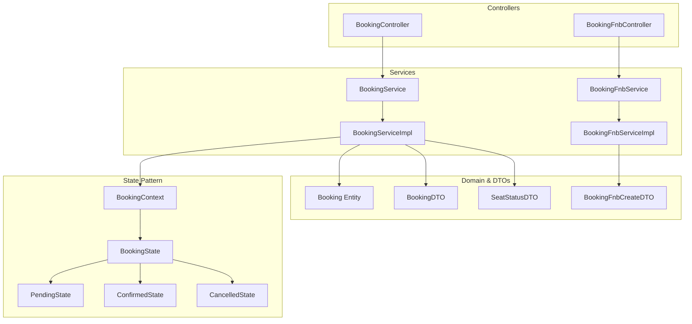
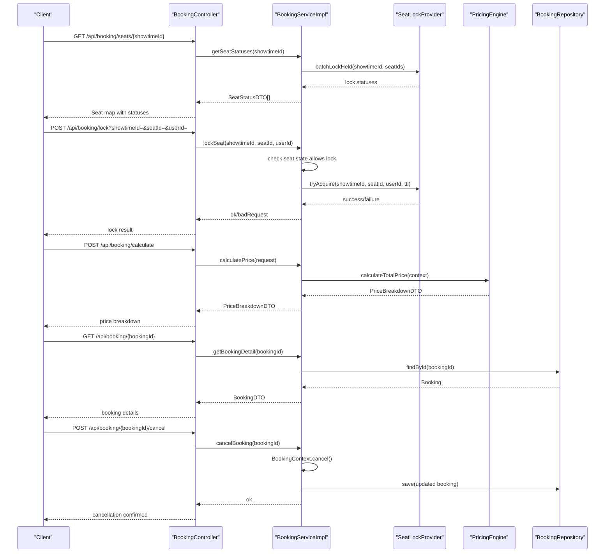
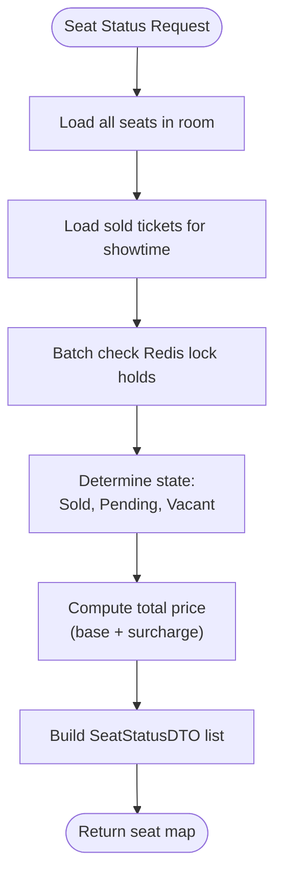
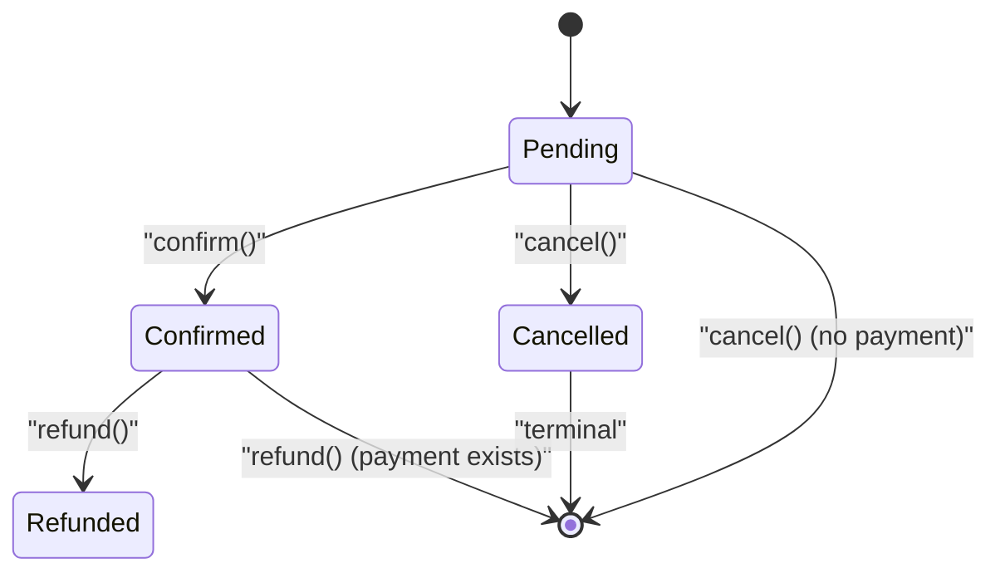
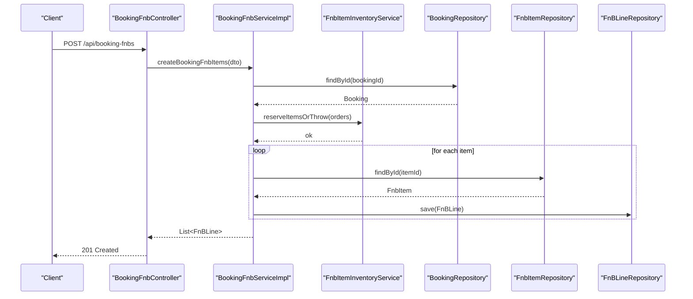
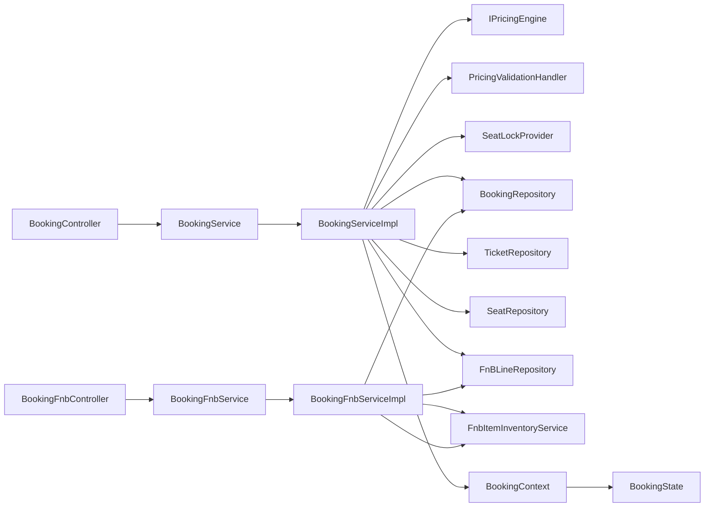

# Booking Management API

<cite>
**Referenced Files in This Document**
- [BookingController.java](file://backend/src/main/java/com/cinema/booking/controllers/BookingController.java)
- [BookingFnbController.java](file://backend/src/main/java/com/cinema/booking/controllers/BookingFnbController.java)
- [BookingService.java](file://backend/src/main/java/com/cinema/booking/services/BookingService.java)
- [BookingServiceImpl.java](file://backend/src/main/java/com/cinema/booking/services/impl/BookingServiceImpl.java)
- [BookingFnbService.java](file://backend/src/main/java/com/cinema/booking/services/BookingFnbService.java)
- [BookingFnbServiceImpl.java](file://backend/src/main/java/com/cinema/booking/services/impl/BookingFnbServiceImpl.java)
- [Booking.java](file://backend/src/main/java/com/cinema/booking/entities/Booking.java)
- [BookingDTO.java](file://backend/src/main/java/com/cinema/booking/dtos/BookingDTO.java)
- [BookingFnbCreateDTO.java](file://backend/src/main/java/com/cinema/booking/dtos/BookingFnbCreateDTO.java)
- [SeatStatusDTO.java](file://backend/src/main/java/com/cinema/booking/dtos/SeatStatusDTO.java)
- [BookingContext.java](file://backend/src/main/java/com/cinema/booking/patterns/state/BookingContext.java)
- [BookingState.java](file://backend/src/main/java/com/cinema/booking/patterns/state/BookingState.java)
- [PendingState.java](file://backend/src/main/java/com/cinema/booking/patterns/state/PendingState.java)
- [ConfirmedState.java](file://backend/src/main/java/com/cinema/booking/patterns/state/ConfirmedState.java)
- [CancelledState.java](file://backend/src/main/java/com/cinema/booking/patterns/state/CancelledState.java)
</cite>

## Table of Contents
1. [Introduction](#introduction)
2. [Project Structure](#project-structure)
3. [Core Components](#core-components)
4. [Architecture Overview](#architecture-overview)
5. [Detailed Component Analysis](#detailed-component-analysis)
6. [Dependency Analysis](#dependency-analysis)
7. [Performance Considerations](#performance-considerations)
8. [Troubleshooting Guide](#troubleshooting-guide)
9. [Conclusion](#conclusion)
10. [Appendices](#appendices)

## Introduction
This document provides comprehensive API documentation for the booking management system, focusing on the complete booking workflow. It covers seat availability and locking, booking retrieval, cancellation/refund/printing operations, and Food & Beverage (F&B) order management. The documentation includes endpoint definitions, request/response schemas, state transitions, seat validation, and real-time availability checks.

## Project Structure
The booking management APIs are implemented under the backend module with dedicated controllers, services, DTOs, entities, and state pattern implementations.

**Diagram sources**
- [BookingController.java:16-114](file://backend/src/main/java/com/cinema/booking/controllers/BookingController.java#L16-L114)
- [BookingFnbController.java:15-48](file://backend/src/main/java/com/cinema/booking/controllers/BookingFnbController.java#L15-L48)
- [BookingService.java:9-22](file://backend/src/main/java/com/cinema/booking/services/BookingService.java#L9-L22)
- [BookingServiceImpl.java:32-260](file://backend/src/main/java/com/cinema/booking/services/impl/BookingServiceImpl.java#L32-L260)
- [BookingFnbService.java:7-13](file://backend/src/main/java/com/cinema/booking/services/BookingFnbService.java#L7-L13)
- [BookingFnbServiceImpl.java:19-81](file://backend/src/main/java/com/cinema/booking/services/impl/BookingFnbServiceImpl.java#L19-L81)
- [Booking.java:16-65](file://backend/src/main/java/com/cinema/booking/entities/Booking.java#L16-L65)
- [BookingDTO.java:14-55](file://backend/src/main/java/com/cinema/booking/dtos/BookingDTO.java#L14-L55)
- [SeatStatusDTO.java:13-26](file://backend/src/main/java/com/cinema/booking/dtos/SeatStatusDTO.java#L13-L26)
- [BookingFnbCreateDTO.java:7-17](file://backend/src/main/java/com/cinema/booking/dtos/BookingFnbCreateDTO.java#L7-L17)
- [BookingContext.java:7-38](file://backend/src/main/java/com/cinema/booking/patterns/state/BookingContext.java#L7-L38)
- [BookingState.java:3-12](file://backend/src/main/java/com/cinema/booking/patterns/state/BookingState.java#L3-L12)
- [PendingState.java:3-30](file://backend/src/main/java/com/cinema/booking/patterns/state/PendingState.java#L3-L30)
- [ConfirmedState.java:3-31](file://backend/src/main/java/com/cinema/booking/patterns/state/ConfirmedState.java#L3-L31)
- [CancelledState.java:3-30](file://backend/src/main/java/com/cinema/booking/patterns/state/CancelledState.java#L3-L30)

**Section sources**
- [BookingController.java:16-114](file://backend/src/main/java/com/cinema/booking/controllers/BookingController.java#L16-L114)
- [BookingFnbController.java:15-48](file://backend/src/main/java/com/cinema/booking/controllers/BookingFnbController.java#L15-L48)
- [BookingService.java:9-22](file://backend/src/main/java/com/cinema/booking/services/BookingService.java#L9-L22)
- [BookingServiceImpl.java:32-260](file://backend/src/main/java/com/cinema/booking/services/impl/BookingServiceImpl.java#L32-L260)
- [BookingFnbService.java:7-13](file://backend/src/main/java/com/cinema/booking/services/BookingFnbService.java#L7-L13)
- [BookingFnbServiceImpl.java:19-81](file://backend/src/main/java/com/cinema/booking/services/impl/BookingFnbServiceImpl.java#L19-L81)
- [Booking.java:16-65](file://backend/src/main/java/com/cinema/booking/entities/Booking.java#L16-L65)
- [BookingDTO.java:14-55](file://backend/src/main/java/com/cinema/booking/dtos/BookingDTO.java#L14-L55)
- [SeatStatusDTO.java:13-26](file://backend/src/main/java/com/cinema/booking/dtos/SeatStatusDTO.java#L13-L26)
- [BookingFnbCreateDTO.java:7-17](file://backend/src/main/java/com/cinema/booking/dtos/BookingFnbCreateDTO.java#L7-L17)
- [BookingContext.java:7-38](file://backend/src/main/java/com/cinema/booking/patterns/state/BookingContext.java#L7-L38)
- [BookingState.java:3-12](file://backend/src/main/java/com/cinema/booking/patterns/state/BookingState.java#L3-L12)
- [PendingState.java:3-30](file://backend/src/main/java/com/cinema/booking/patterns/state/PendingState.java#L3-L30)
- [ConfirmedState.java:3-31](file://backend/src/main/java/com/cinema/booking/patterns/state/ConfirmedState.java#L3-L31)
- [CancelledState.java:3-30](file://backend/src/main/java/com/cinema/booking/patterns/state/CancelledState.java#L3-L30)

## Core Components
- BookingController: Exposes seat status retrieval, seat locking/unlocking, price calculation, booking detail retrieval, booking search, and state transition endpoints (cancel, refund, print).
- BookingFnbController: Manages F&B orders linked to a booking, including creation, listing, and deletion of F&B lines.
- BookingService/Impl: Implements seat availability rendering, Redis-based seat locking, price calculation via pricing engine/validation chain, booking detail mapping, and state transitions.
- BookingFnbService/Impl: Handles F&B inventory reservations and persistence for booking-linked orders.
- Entities and DTOs: Define booking structure, ticket/F&B line composition, seat status representation, and F&B creation payload.
- State Pattern: Enforces valid state transitions and guards actions based on current booking state.

**Section sources**
- [BookingController.java:16-114](file://backend/src/main/java/com/cinema/booking/controllers/BookingController.java#L16-L114)
- [BookingFnbController.java:15-48](file://backend/src/main/java/com/cinema/booking/controllers/BookingFnbController.java#L15-L48)
- [BookingService.java:9-22](file://backend/src/main/java/com/cinema/booking/services/BookingService.java#L9-L22)
- [BookingServiceImpl.java:32-260](file://backend/src/main/java/com/cinema/booking/services/impl/BookingServiceImpl.java#L32-L260)
- [BookingFnbService.java:7-13](file://backend/src/main/java/com/cinema/booking/services/BookingFnbService.java#L7-L13)
- [BookingFnbServiceImpl.java:19-81](file://backend/src/main/java/com/cinema/booking/services/impl/BookingFnbServiceImpl.java#L19-L81)
- [Booking.java:16-65](file://backend/src/main/java/com/cinema/booking/entities/Booking.java#L16-L65)
- [BookingDTO.java:14-55](file://backend/src/main/java/com/cinema/booking/dtos/BookingDTO.java#L14-L55)
- [SeatStatusDTO.java:13-26](file://backend/src/main/java/com/cinema/booking/dtos/SeatStatusDTO.java#L13-L26)
- [BookingFnbCreateDTO.java:7-17](file://backend/src/main/java/com/cinema/booking/dtos/BookingFnbCreateDTO.java#L7-L17)
- [BookingContext.java:7-38](file://backend/src/main/java/com/cinema/booking/patterns/state/BookingContext.java#L7-L38)
- [BookingState.java:3-12](file://backend/src/main/java/com/cinema/booking/patterns/state/BookingState.java#L3-L12)
- [PendingState.java:3-30](file://backend/src/main/java/com/cinema/booking/patterns/state/PendingState.java#L3-L30)
- [ConfirmedState.java:3-31](file://backend/src/main/java/com/cinema/booking/patterns/state/ConfirmedState.java#L3-L31)
- [CancelledState.java:3-30](file://backend/src/main/java/com/cinema/booking/patterns/state/CancelledState.java#L3-L30)

## Architecture Overview
The booking workflow integrates seat availability rendering, Redis-based locking, pricing calculation, and state transitions. F&B orders are managed separately but linked to a booking.

**Diagram sources**
- [BookingController.java:26-112](file://backend/src/main/java/com/cinema/booking/controllers/BookingController.java#L26-L112)
- [BookingServiceImpl.java:77-198](file://backend/src/main/java/com/cinema/booking/services/impl/BookingServiceImpl.java#L77-L198)
- [BookingContext.java:22-36](file://backend/src/main/java/com/cinema/booking/patterns/state/BookingContext.java#L22-L36)

## Detailed Component Analysis

### BookingController Endpoints
- GET /api/booking/seats/{showtimeId}
  - Description: Returns seat matrix with statuses (Vacant, Sold, Pending) for a given showtime.
  - Response: List of SeatStatusDTO entries.
- POST /api/booking/lock
  - Description: Temporarily locks a seat using Redis SETNX for a fixed TTL.
  - Query params: showtimeId, seatId, userId.
  - Response: Success message or bad request if seat cannot be locked.
- POST /api/booking/unlock
  - Description: Releases a previously held seat lock.
  - Query params: showtimeId, seatId.
  - Response: Success message.
- POST /api/booking/calculate
  - Description: Calculates total price including tickets and F&B with promotions applied.
  - Request body: BookingCalculationDTO.
  - Response: PriceBreakdownDTO.
- GET /api/booking/{bookingId}
  - Description: Retrieves booking details including tickets and F&B lines.
  - Response: BookingDTO.
- GET /api/booking/search
  - Description: Searches bookings by ID, phone, or email (staff).
  - Query param: query.
  - Response: List of BookingDTO or error.
- POST /api/booking/{bookingId}/cancel
  - Description: Cancels a booking; releases reservations if payment not successful.
  - Response: Success message or error.
- POST /api/booking/{bookingId}/refund
  - Description: Refunds a confirmed booking.
  - Response: Success message or error.
- POST /api/booking/{bookingId}/print
  - Description: Prints tickets for a booking (state-dependent).
  - Response: Success message or error.

**Section sources**
- [BookingController.java:26-112](file://backend/src/main/java/com/cinema/booking/controllers/BookingController.java#L26-L112)

### BookingFnbController Endpoints
- POST /api/booking-fnbs
  - Description: Creates F&B items for a booking.
  - Request body: BookingFnbCreateDTO.
  - Response: List of FnBLine entities (HTTP 201).
- GET /api/booking-fnbs
  - Description: Lists all booking F&B items.
  - Response: List of FnBLine.
- GET /api/booking-fnbs/booking/{bookingId}
  - Description: Lists F&B items associated with a booking.
  - Response: List of FnBLine.
- DELETE /api/booking-fnbs/booking/{bookingId}
  - Description: Deletes all F&B items for a booking and releases inventory.
  - Response: No content.

**Section sources**
- [BookingFnbController.java:23-46](file://backend/src/main/java/com/cinema/booking/controllers/BookingFnbController.java#L23-L46)

### Seat Availability and Validation
- Seat rendering:
  - Fetches all seats in the room and determines sold vs pending vs vacant using ticket records and Redis lock holdings.
  - Computes seat surcharge and base price to derive total price per seat.
- Seat locking:
  - Validates seat state prior to lock attempt; uses Redis SETNX with TTL.
  - Unlock endpoint removes lock early.
- Real-time availability:
  - Batch lock status queries enable immediate seat map updates.

**Diagram sources**
- [BookingServiceImpl.java:77-115](file://backend/src/main/java/com/cinema/booking/services/impl/BookingServiceImpl.java#L77-L115)

**Section sources**
- [BookingServiceImpl.java:77-131](file://backend/src/main/java/com/cinema/booking/services/impl/BookingServiceImpl.java#L77-L131)
- [SeatStatusDTO.java:13-26](file://backend/src/main/java/com/cinema/booking/dtos/SeatStatusDTO.java#L13-L26)

### Booking State Transitions
The state machine enforces valid transitions and guards actions based on current state.

**Diagram sources**
- [BookingContext.java:22-36](file://backend/src/main/java/com/cinema/booking/patterns/state/BookingContext.java#L22-L36)
- [PendingState.java:6-23](file://backend/src/main/java/com/cinema/booking/patterns/state/PendingState.java#L6-L23)
- [ConfirmedState.java:16-24](file://backend/src/main/java/com/cinema/booking/patterns/state/ConfirmedState.java#L16-L24)
- [CancelledState.java:15-23](file://backend/src/main/java/com/cinema/booking/patterns/state/CancelledState.java#L15-L23)

**Section sources**
- [BookingContext.java:7-38](file://backend/src/main/java/com/cinema/booking/patterns/state/BookingContext.java#L7-L38)
- [BookingState.java:3-12](file://backend/src/main/java/com/cinema/booking/patterns/state/BookingState.java#L3-L12)
- [PendingState.java:3-30](file://backend/src/main/java/com/cinema/booking/patterns/state/PendingState.java#L3-L30)
- [ConfirmedState.java:3-31](file://backend/src/main/java/com/cinema/booking/patterns/state/ConfirmedState.java#L3-L31)
- [CancelledState.java:3-30](file://backend/src/main/java/com/cinema/booking/patterns/state/CancelledState.java#L3-L30)

### F&B Order Management
- Creation:
  - Validates item existence and reserves inventory via FnbItemInventoryService.
  - Persists FnBLine entries linked to the booking at current unit prices.
- Retrieval:
  - Lists all F&B lines or filters by booking ID.
- Deletion:
  - Releases inventory and deletes all lines for a booking.

**Diagram sources**
- [BookingFnbController.java:23-27](file://backend/src/main/java/com/cinema/booking/controllers/BookingFnbController.java#L23-L27)
- [BookingFnbServiceImpl.java:44-71](file://backend/src/main/java/com/cinema/booking/services/impl/BookingFnbServiceImpl.java#L44-L71)

**Section sources**
- [BookingFnbController.java:23-46](file://backend/src/main/java/com/cinema/booking/controllers/BookingFnbController.java#L23-L46)
- [BookingFnbServiceImpl.java:44-81](file://backend/src/main/java/com/cinema/booking/services/impl/BookingFnbServiceImpl.java#L44-L81)
- [BookingFnbCreateDTO.java:7-17](file://backend/src/main/java/com/cinema/booking/dtos/BookingFnbCreateDTO.java#L7-L17)

### Request/Response Schemas

- SeatStatusDTO
  - Fields: seatId, seatCode, seatRow, seatNumber, seatType, totalPrice, status (Vacant, Sold, Pending).
- BookingDTO
  - Fields: bookingId, customerId, showtimeId, promoCode, totalPrice, status, createdAt, tickets[], fnbs[].
  - Nested TicketLineDTO: ticketId, seatId, seatCode, seatRow, seatNumber, seatType, seatSurcharge, price.
  - Nested FnBLineDTO: id, itemId, itemName, quantity, unitPrice, lineTotal.
- BookingFnbCreateDTO
  - Fields: bookingId, items[].
  - Nested FnbItemDTO: itemId, quantity.

**Section sources**
- [SeatStatusDTO.java:13-26](file://backend/src/main/java/com/cinema/booking/dtos/SeatStatusDTO.java#L13-L26)
- [BookingDTO.java:14-55](file://backend/src/main/java/com/cinema/booking/dtos/BookingDTO.java#L14-L55)
- [BookingFnbCreateDTO.java:7-17](file://backend/src/main/java/com/cinema/booking/dtos/BookingFnbCreateDTO.java#L7-L17)

## Dependency Analysis
The controllers depend on services, which in turn depend on repositories, pricing engines, and inventory services. State transitions are encapsulated within the state pattern classes.

**Diagram sources**
- [BookingController.java:22-23](file://backend/src/main/java/com/cinema/booking/controllers/BookingController.java#L22-L23)
- [BookingFnbController.java:20-21](file://backend/src/main/java/com/cinema/booking/controllers/BookingFnbController.java#L20-L21)
- [BookingServiceImpl.java:36-76](file://backend/src/main/java/com/cinema/booking/services/impl/BookingServiceImpl.java#L36-L76)
- [BookingFnbServiceImpl.java:22-33](file://backend/src/main/java/com/cinema/booking/services/impl/BookingFnbServiceImpl.java#L22-L33)
- [BookingContext.java:11-14](file://backend/src/main/java/com/cinema/booking/patterns/state/BookingContext.java#L11-L14)

**Section sources**
- [BookingServiceImpl.java:32-76](file://backend/src/main/java/com/cinema/booking/services/impl/BookingServiceImpl.java#L32-L76)
- [BookingFnbServiceImpl.java:19-33](file://backend/src/main/java/com/cinema/booking/services/impl/BookingFnbServiceImpl.java#L19-L33)
- [BookingContext.java:7-20](file://backend/src/main/java/com/cinema/booking/patterns/state/BookingContext.java#L7-L20)

## Performance Considerations
- Redis-based seat locking minimizes contention and enables fast lock checks via batch operations.
- Seat status computation aggregates sold tickets and lock holdings efficiently using collections and streams.
- Pricing calculation leverages a validation chain and caching proxy to avoid repeated computations.
- Transaction boundaries ensure atomicity for state transitions and inventory adjustments.

## Troubleshooting Guide
- Seat lock failures:
  - Occur when a seat is already sold or currently locked; verify seat status before attempting to lock.
- Cancellation errors:
  - Attempting to cancel a booking after payment may fail; use refund instead.
- Refund errors:
  - Refunding is only valid for confirmed bookings; ensure the booking is in the correct state.
- F&B reservation errors:
  - Creating F&B items fails if inventory is insufficient or items do not exist; validate item IDs and quantities.

**Section sources**
- [BookingServiceImpl.java:117-131](file://backend/src/main/java/com/cinema/booking/services/impl/BookingServiceImpl.java#L117-L131)
- [PendingState.java:16-23](file://backend/src/main/java/com/cinema/booking/patterns/state/PendingState.java#L16-L23)
- [ConfirmedState.java:10-13](file://backend/src/main/java/com/cinema/booking/patterns/state/ConfirmedState.java#L10-L13)
- [BookingFnbServiceImpl.java:44-71](file://backend/src/main/java/com/cinema/booking/services/impl/BookingFnbServiceImpl.java#L44-L71)

## Conclusion
The booking management system provides a robust set of APIs for seat availability, locking, pricing, booking retrieval, and state transitions. F&B order management is tightly integrated with inventory controls and booking linkage. The state pattern ensures consistent and safe state transitions, while Redis-based seat locking guarantees real-time availability checks.

## Appendices

### Endpoint Reference Summary
- GET /api/booking/seats/{showtimeId}: Retrieve seat map with statuses.
- POST /api/booking/lock: Lock a seat with showtimeId, seatId, userId.
- POST /api/booking/unlock: Unlock a seat with showtimeId, seatId.
- POST /api/booking/calculate: Calculate total price with promotions.
- GET /api/booking/{bookingId}: Get booking details.
- GET /api/booking/search: Search bookings (staff).
- POST /api/booking/{bookingId}/cancel: Cancel booking.
- POST /api/booking/{bookingId}/refund: Refund booking.
- POST /api/booking/{bookingId}/print: Print tickets.
- POST /api/booking-fnbs: Create F&B items for a booking.
- GET /api/booking-fnbs: List all F&B items.
- GET /api/booking-fnbs/booking/{bookingId}: List F&B items by booking.
- DELETE /api/booking-fnbs/booking/{bookingId}: Delete all F&B items for a booking.