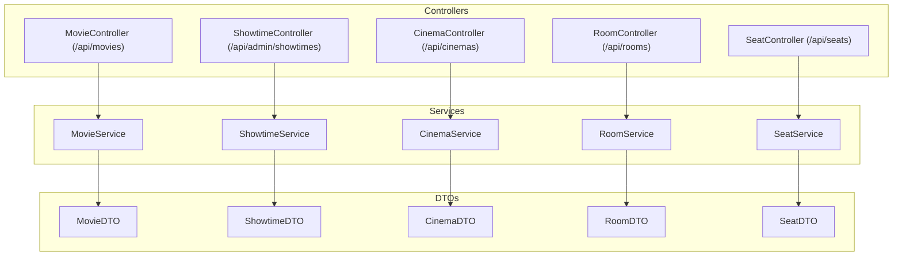
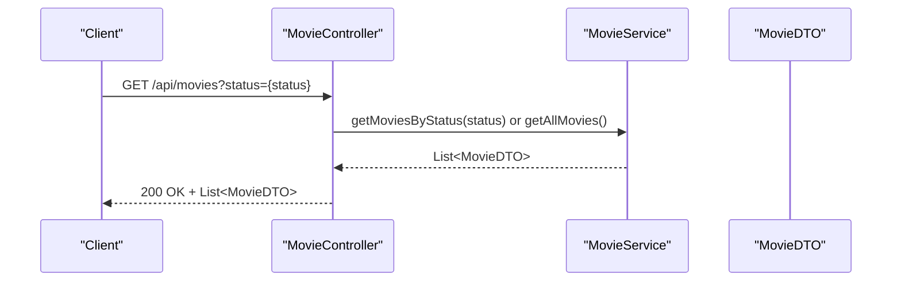
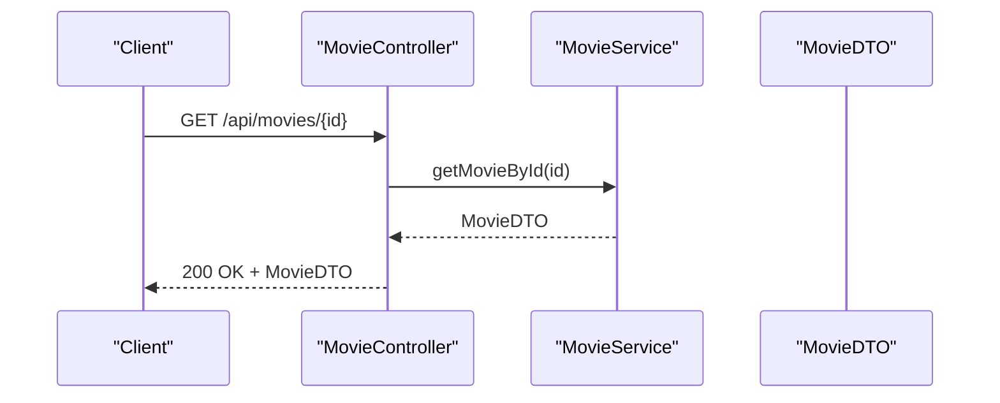
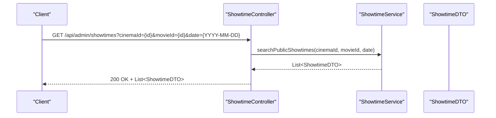
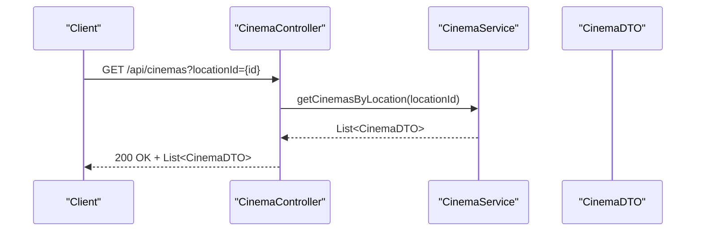
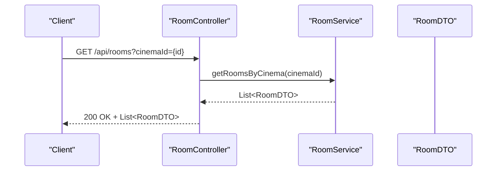
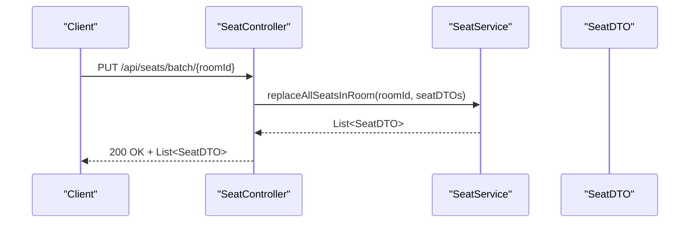
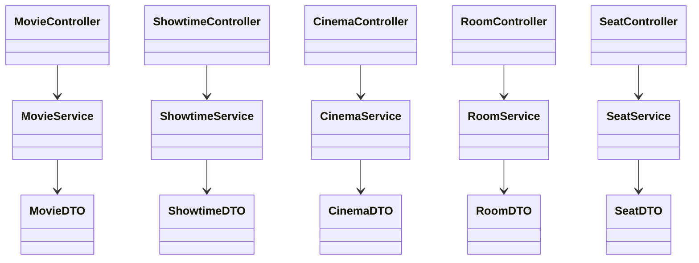

# Movie and Showtime API

<cite>
**Referenced Files in This Document**
- [MovieController.java](file://backend/src/main/java/com/cinema/booking/controllers/MovieController.java)
- [ShowtimeController.java](file://backend/src/main/java/com/cinema/booking/controllers/ShowtimeController.java)
- [CinemaController.java](file://backend/src/main/java/com/cinema/booking/controllers/CinemaController.java)
- [RoomController.java](file://backend/src/main/java/com/cinema/booking/controllers/RoomController.java)
- [SeatController.java](file://backend/src/main/java/com/cinema/booking/controllers/SeatController.java)
- [MovieDTO.java](file://backend/src/main/java/com/cinema/booking/dtos/MovieDTO.java)
- [ShowtimeDTO.java](file://backend/src/main/java/com/cinema/booking/dtos/ShowtimeDTO.java)
- [CinemaDTO.java](file://backend/src/main/java/com/cinema/booking/dtos/CinemaDTO.java)
- [RoomDTO.java](file://backend/src/main/java/com/cinema/booking/dtos/RoomDTO.java)
- [SeatDTO.java](file://backend/src/main/java/com/cinema/booking/dtos/SeatDTO.java)
- [MovieService.java](file://backend/src/main/java/com/cinema/booking/services/MovieService.java)
- [ShowtimeService.java](file://backend/src/main/java/com/cinema/booking/services/ShowtimeService.java)
- [CinemaService.java](file://backend/src/main/java/com/cinema/booking/services/CinemaService.java)
- [RoomService.java](file://backend/src/main/java/com/cinema/booking/services/RoomService.java)
- [SeatService.java](file://backend/src/main/java/com/cinema/booking/services/SeatService.java)
</cite>

## Table of Contents
1. [Introduction](#introduction)
2. [Project Structure](#project-structure)
3. [Core Components](#core-components)
4. [Architecture Overview](#architecture-overview)
5. [Detailed Component Analysis](#detailed-component-analysis)
6. [Dependency Analysis](#dependency-analysis)
7. [Performance Considerations](#performance-considerations)
8. [Troubleshooting Guide](#troubleshooting-guide)
9. [Conclusion](#conclusion)
10. [Appendices](#appendices)

## Introduction
This document provides API documentation for movie and showtime management endpoints in the cinema booking system. It covers:
- Listing movies with optional status filtering
- Retrieving movie details including cast and enriched metadata
- Showtime schedules discovery with cinema and date filters
- Venue and auditorium management endpoints
- Seat availability lookup per showtime
It also documents request parameters, response schemas, and integration points between controllers, services, and DTOs.

## Project Structure
The relevant backend modules are organized by domain and layered by concerns:
- Controllers expose REST endpoints under /api/*
- Services define business operations and filtering/search capabilities
- DTOs model request/response payloads
- Entities and repositories are used by services but are not covered here

**Diagram sources**
- [MovieController.java:1-64](file://backend/src/main/java/com/cinema/booking/controllers/MovieController.java#L1-L64)
- [ShowtimeController.java:1-54](file://backend/src/main/java/com/cinema/booking/controllers/ShowtimeController.java#L1-L54)
- [CinemaController.java:1-51](file://backend/src/main/java/com/cinema/booking/controllers/CinemaController.java#L1-L51)
- [RoomController.java:1-51](file://backend/src/main/java/com/cinema/booking/controllers/RoomController.java#L1-L51)
- [SeatController.java:1-60](file://backend/src/main/java/com/cinema/booking/controllers/SeatController.java#L1-L60)
- [MovieService.java:1-15](file://backend/src/main/java/com/cinema/booking/services/MovieService.java#L1-L15)
- [ShowtimeService.java:1-15](file://backend/src/main/java/com/cinema/booking/services/ShowtimeService.java#L1-L15)
- [CinemaService.java:1-14](file://backend/src/main/java/com/cinema/booking/services/CinemaService.java#L1-L14)
- [RoomService.java:1-14](file://backend/src/main/java/com/cinema/booking/services/RoomService.java#L1-L14)
- [SeatService.java:1-15](file://backend/src/main/java/com/cinema/booking/services/SeatService.java#L1-L15)
- [MovieDTO.java:1-50](file://backend/src/main/java/com/cinema/booking/dtos/MovieDTO.java#L1-L50)
- [ShowtimeDTO.java:1-38](file://backend/src/main/java/com/cinema/booking/dtos/ShowtimeDTO.java#L1-L38)
- [CinemaDTO.java:1-25](file://backend/src/main/java/com/cinema/booking/dtos/CinemaDTO.java#L1-L25)
- [RoomDTO.java:1-21](file://backend/src/main/java/com/cinema/booking/dtos/RoomDTO.java#L1-L21)
- [SeatDTO.java:1-27](file://backend/src/main/java/com/cinema/booking/dtos/SeatDTO.java#L1-L27)

**Section sources**
- [MovieController.java:1-64](file://backend/src/main/java/com/cinema/booking/controllers/MovieController.java#L1-L64)
- [ShowtimeController.java:1-54](file://backend/src/main/java/com/cinema/booking/controllers/ShowtimeController.java#L1-L54)
- [CinemaController.java:1-51](file://backend/src/main/java/com/cinema/booking/controllers/CinemaController.java#L1-L51)
- [RoomController.java:1-51](file://backend/src/main/java/com/cinema/booking/controllers/RoomController.java#L1-L51)
- [SeatController.java:1-60](file://backend/src/main/java/com/cinema/booking/controllers/SeatController.java#L1-L60)

## Core Components
- MovieController: Lists movies with optional status filter; retrieves movie details; manages cast assignments; supports CRUD operations.
- ShowtimeController: Admin endpoint to manage showtimes; does not expose public schedule search.
- CinemaController: Manages venues with optional location filter.
- RoomController: Manages auditoriums with optional cinema filter.
- SeatController: Manages seats with batch replacement capability.

Key request/response schemas:
- MovieDTO: Includes metadata, cast list, and status.
- ShowtimeDTO: Includes movie and room enrichment fields.
- CinemaDTO: Includes location linkage and contact info.
- RoomDTO: Links to cinema and screen type.
- SeatDTO: Seat identity, room linkage, type surcharge, and activity flag.

**Section sources**
- [MovieController.java:1-64](file://backend/src/main/java/com/cinema/booking/controllers/MovieController.java#L1-L64)
- [ShowtimeController.java:1-54](file://backend/src/main/java/com/cinema/booking/controllers/ShowtimeController.java#L1-L54)
- [CinemaController.java:1-51](file://backend/src/main/java/com/cinema/booking/controllers/CinemaController.java#L1-L51)
- [RoomController.java:1-51](file://backend/src/main/java/com/cinema/booking/controllers/RoomController.java#L1-L51)
- [SeatController.java:1-60](file://backend/src/main/java/com/cinema/booking/controllers/SeatController.java#L1-L60)
- [MovieDTO.java:1-50](file://backend/src/main/java/com/cinema/booking/dtos/MovieDTO.java#L1-L50)
- [ShowtimeDTO.java:1-38](file://backend/src/main/java/com/cinema/booking/dtos/ShowtimeDTO.java#L1-L38)
- [CinemaDTO.java:1-25](file://backend/src/main/java/com/cinema/booking/dtos/CinemaDTO.java#L1-L25)
- [RoomDTO.java:1-21](file://backend/src/main/java/com/cinema/booking/dtos/RoomDTO.java#L1-L21)
- [SeatDTO.java:1-27](file://backend/src/main/java/com/cinema/booking/dtos/SeatDTO.java#L1-L27)

## Architecture Overview
The API follows a clean architecture with controllers delegating to services, which encapsulate business logic and data transformations via DTOs.

**Diagram sources**
- [MovieController.java:22-30](file://backend/src/main/java/com/cinema/booking/controllers/MovieController.java#L22-L30)
- [MovieService.java:8-9](file://backend/src/main/java/com/cinema/booking/services/MovieService.java#L8-L9)
- [MovieDTO.java:1-50](file://backend/src/main/java/com/cinema/booking/dtos/MovieDTO.java#L1-L50)

## Detailed Component Analysis

### Movie Endpoints
- GET /api/movies
  - Purpose: Retrieve movie listings.
  - Query parameters:
    - status: Optional. Filters by movie status (e.g., NOW_SHOWING).
  - Response: Array of MovieDTO.
  - Notes: When status is omitted, returns all movies.

- GET /api/movies/{id}
  - Purpose: Retrieve detailed movie information.
  - Path parameter: id (Integer).
  - Response: MovieDTO with enriched metadata and cast list.

- PUT /api/movies/{id}/casts
  - Purpose: Replace the entire cast list for a movie.
  - Path parameter: id (Integer).
  - Request body: Array of MovieCastDTO entries.
  - Response: Updated MovieDTO.

- POST /api/movies, PUT /api/movies/{id}, DELETE /api/movies/{id}
  - Purpose: Manage movies (create, update, delete).
  - Responses: MovieDTO for create/update; empty 200 OK for delete.

**Diagram sources**
- [MovieController.java:32-35](file://backend/src/main/java/com/cinema/booking/controllers/MovieController.java#L32-L35)
- [MovieService.java](file://backend/src/main/java/com/cinema/booking/services/MovieService.java#L10)
- [MovieDTO.java:1-50](file://backend/src/main/java/com/cinema/booking/dtos/MovieDTO.java#L1-L50)

**Section sources**
- [MovieController.java:22-62](file://backend/src/main/java/com/cinema/booking/controllers/MovieController.java#L22-L62)
- [MovieService.java:7-14](file://backend/src/main/java/com/cinema/booking/services/MovieService.java#L7-L14)
- [MovieDTO.java:14-48](file://backend/src/main/java/com/cinema/booking/dtos/MovieDTO.java#L14-L48)

### Showtime Endpoints
- GET /api/admin/showtimes
  - Purpose: Admin endpoint to list all showtimes.
  - Response: Array of ShowtimeDTO with enriched fields (movie title, poster, age rating, duration; room name, screen type; cinema id/name).

- GET /api/admin/showtimes/{id}
  - Purpose: Retrieve a specific showtime by id.
  - Response: ShowtimeDTO.

- POST /api/admin/showtimes, PUT /api/admin/showtimes/{id}, DELETE /api/admin/showtimes/{id}
  - Purpose: Manage showtimes (create, update, delete).
  - Response: ShowtimeDTO for create/update; empty 200 OK for delete.

- Public showtime search capability
  - Service method: searchPublicShowtimes(cinemaId, movieId, date)
  - Purpose: Discover showtimes for public consumption by cinema, movie, and date.
  - Availability: Exposed via service interface; controller endpoint is admin-scoped.

**Diagram sources**
- [ShowtimeController.java:24-27](file://backend/src/main/java/com/cinema/booking/controllers/ShowtimeController.java#L24-L27)
- [ShowtimeService.java](file://backend/src/main/java/com/cinema/booking/services/ShowtimeService.java#L13)
- [ShowtimeDTO.java:10-37](file://backend/src/main/java/com/cinema/booking/dtos/ShowtimeDTO.java#L10-L37)

**Section sources**
- [ShowtimeController.java:23-52](file://backend/src/main/java/com/cinema/booking/controllers/ShowtimeController.java#L23-L52)
- [ShowtimeService.java:7-14](file://backend/src/main/java/com/cinema/booking/services/ShowtimeService.java#L7-L14)
- [ShowtimeDTO.java:10-37](file://backend/src/main/java/com/cinema/booking/dtos/ShowtimeDTO.java#L10-L37)

### Cinema Endpoints
- GET /api/cinemas
  - Purpose: Retrieve venues.
  - Query parameters:
    - locationId: Optional. Filter cinemas by location id.
  - Response: Array of CinemaDTO.

- GET /api/cinemas/{id}
  - Purpose: Retrieve a specific cinema by id.
  - Response: CinemaDTO.

- POST /api/cinemas, PUT /api/cinemas/{id}, DELETE /api/cinemas/{id}
  - Purpose: Manage cinemas (create, update, delete).
  - Response: CinemaDTO for create/update; empty 200 OK for delete.

**Diagram sources**
- [CinemaController.java:21-28](file://backend/src/main/java/com/cinema/booking/controllers/CinemaController.java#L21-L28)
- [CinemaService.java:7-8](file://backend/src/main/java/com/cinema/booking/services/CinemaService.java#L7-L8)
- [CinemaDTO.java:8-24](file://backend/src/main/java/com/cinema/booking/dtos/CinemaDTO.java#L8-L24)

**Section sources**
- [CinemaController.java:20-49](file://backend/src/main/java/com/cinema/booking/controllers/CinemaController.java#L20-L49)
- [CinemaService.java:6-12](file://backend/src/main/java/com/cinema/booking/services/CinemaService.java#L6-L12)
- [CinemaDTO.java:8-24](file://backend/src/main/java/com/cinema/booking/dtos/CinemaDTO.java#L8-L24)

### Room Endpoints
- GET /api/rooms
  - Purpose: Retrieve auditoriums.
  - Query parameters:
    - cinemaId: Optional. Filter rooms by cinema id.
  - Response: Array of RoomDTO.

- GET /api/rooms/{id}
  - Purpose: Retrieve a specific room by id.
  - Response: RoomDTO.

- POST /api/rooms, PUT /api/rooms/{id}, DELETE /api/rooms/{id}
  - Purpose: Manage rooms (create, update, delete).
  - Response: RoomDTO for create/update; empty 200 OK for delete.

**Diagram sources**
- [RoomController.java:20-28](file://backend/src/main/java/com/cinema/booking/controllers/RoomController.java#L20-L28)
- [RoomService.java:7-8](file://backend/src/main/java/com/cinema/booking/services/RoomService.java#L7-L8)
- [RoomDTO.java:8-20](file://backend/src/main/java/com/cinema/booking/dtos/RoomDTO.java#L8-L20)

**Section sources**
- [RoomController.java:20-49](file://backend/src/main/java/com/cinema/booking/controllers/RoomController.java#L20-L49)
- [RoomService.java:6-12](file://backend/src/main/java/com/cinema/booking/services/RoomService.java#L6-L12)
- [RoomDTO.java:8-20](file://backend/src/main/java/com/cinema/booking/dtos/RoomDTO.java#L8-L20)

### Seat Endpoints
- GET /api/seats
  - Purpose: Retrieve seat inventory.
  - Query parameters:
    - roomId: Optional. Filter seats by room id.
  - Response: Array of SeatDTO.

- GET /api/seats/{id}
  - Purpose: Retrieve a specific seat by id.
  - Response: SeatDTO.

- PUT /api/seats/{id}, DELETE /api/seats/{id}
  - Purpose: Manage individual seats (update, delete).
  - Response: SeatDTO for update; empty 200 OK for delete.

- PUT /api/seats/batch/{roomId}
  - Purpose: Batch replace all seats in a room.
  - Path parameter: roomId (Integer).
  - Request body: Array of SeatDTO.
  - Response: Updated list of SeatDTO for the room.

**Diagram sources**
- [SeatController.java:52-57](file://backend/src/main/java/com/cinema/booking/controllers/SeatController.java#L52-L57)
- [SeatService.java](file://backend/src/main/java/com/cinema/booking/services/SeatService.java#L13)
- [SeatDTO.java:9-26](file://backend/src/main/java/com/cinema/booking/dtos/SeatDTO.java#L9-L26)

**Section sources**
- [SeatController.java:20-58](file://backend/src/main/java/com/cinema/booking/controllers/SeatController.java#L20-L58)
- [SeatService.java:6-14](file://backend/src/main/java/com/cinema/booking/services/SeatService.java#L6-L14)
- [SeatDTO.java:9-26](file://backend/src/main/java/com/cinema/booking/dtos/SeatDTO.java#L9-L26)

## Dependency Analysis
- Controllers depend on services for business operations.
- Services depend on repositories (not shown) to fetch and persist data.
- DTOs decouple controller responses from entity internals.

**Diagram sources**
- [MovieController.java:1-64](file://backend/src/main/java/com/cinema/booking/controllers/MovieController.java#L1-L64)
- [ShowtimeController.java:1-54](file://backend/src/main/java/com/cinema/booking/controllers/ShowtimeController.java#L1-L54)
- [CinemaController.java:1-51](file://backend/src/main/java/com/cinema/booking/controllers/CinemaController.java#L1-L51)
- [RoomController.java:1-51](file://backend/src/main/java/com/cinema/booking/controllers/RoomController.java#L1-L51)
- [SeatController.java:1-60](file://backend/src/main/java/com/cinema/booking/controllers/SeatController.java#L1-L60)
- [MovieService.java:1-15](file://backend/src/main/java/com/cinema/booking/services/MovieService.java#L1-L15)
- [ShowtimeService.java:1-15](file://backend/src/main/java/com/cinema/booking/services/ShowtimeService.java#L1-L15)
- [CinemaService.java:1-14](file://backend/src/main/java/com/cinema/booking/services/CinemaService.java#L1-L14)
- [RoomService.java:1-14](file://backend/src/main/java/com/cinema/booking/services/RoomService.java#L1-L14)
- [SeatService.java:1-15](file://backend/src/main/java/com/cinema/booking/services/SeatService.java#L1-L15)
- [MovieDTO.java:1-50](file://backend/src/main/java/com/cinema/booking/dtos/MovieDTO.java#L1-L50)
- [ShowtimeDTO.java:1-38](file://backend/src/main/java/com/cinema/booking/dtos/ShowtimeDTO.java#L1-L38)
- [CinemaDTO.java:1-25](file://backend/src/main/java/com/cinema/booking/dtos/CinemaDTO.java#L1-L25)
- [RoomDTO.java:1-21](file://backend/src/main/java/com/cinema/booking/dtos/RoomDTO.java#L1-L21)
- [SeatDTO.java:1-27](file://backend/src/main/java/com/cinema/booking/dtos/SeatDTO.java#L1-L27)

**Section sources**
- [MovieController.java:1-64](file://backend/src/main/java/com/cinema/booking/controllers/MovieController.java#L1-L64)
- [ShowtimeController.java:1-54](file://backend/src/main/java/com/cinema/booking/controllers/ShowtimeController.java#L1-L54)
- [CinemaController.java:1-51](file://backend/src/main/java/com/cinema/booking/controllers/CinemaController.java#L1-L51)
- [RoomController.java:1-51](file://backend/src/main/java/com/cinema/booking/controllers/RoomController.java#L1-L51)
- [SeatController.java:1-60](file://backend/src/main/java/com/cinema/booking/controllers/SeatController.java#L1-L60)
- [MovieService.java:1-15](file://backend/src/main/java/com/cinema/booking/services/MovieService.java#L1-L15)
- [ShowtimeService.java:1-15](file://backend/src/main/java/com/cinema/booking/services/ShowtimeService.java#L1-L15)
- [CinemaService.java:1-14](file://backend/src/main/java/com/cinema/booking/services/CinemaService.java#L1-L14)
- [RoomService.java:1-14](file://backend/src/main/java/com/cinema/booking/services/RoomService.java#L1-L14)
- [SeatService.java:1-15](file://backend/src/main/java/com/cinema/booking/services/SeatService.java#L1-L15)

## Performance Considerations
- Filtering by status, location, cinema, and movie ids reduces dataset size early in the service layer.
- Batch seat replacement minimizes round trips when reconfiguring auditorium layouts.
- Enriched DTOs (e.g., movie title, poster, room/screen type, cinema name) reduce downstream joins and improve client rendering performance.

## Troubleshooting Guide
- Validation errors:
  - Missing required fields in request bodies trigger validation exceptions. Ensure all required fields are present according to DTO constraints.
- Not found errors:
  - Requests for non-existent ids return appropriate HTTP 404 semantics via service exceptions.
- Parameter misuse:
  - Passing invalid types for numeric ids or unsupported enums will cause binding/validation failures.

Common DTO validation constraints:
- MovieDTO: title, durationMinutes, status are required; poster/trailer optional.
- ShowtimeDTO: movieId, roomId, startTime, basePrice are required; endTime derived.
- CinemaDTO: locationId, name, address are required.
- RoomDTO: cinemaId, name are required.
- SeatDTO: roomId, seatCode, seatTypeId are required.

**Section sources**
- [MovieDTO.java:17-30](file://backend/src/main/java/com/cinema/booking/dtos/MovieDTO.java#L17-L30)
- [ShowtimeDTO.java:13-26](file://backend/src/main/java/com/cinema/booking/dtos/ShowtimeDTO.java#L13-L26)
- [CinemaDTO.java:11-22](file://backend/src/main/java/com/cinema/booking/dtos/CinemaDTO.java#L11-L22)
- [RoomDTO.java:11-19](file://backend/src/main/java/com/cinema/booking/dtos/RoomDTO.java#L11-L19)
- [SeatDTO.java:12-20](file://backend/src/main/java/com/cinema/booking/dtos/SeatDTO.java#L12-L20)

## Conclusion
The API provides a cohesive set of endpoints for managing movies, showtimes, venues, auditoriums, and seats. Controllers expose straightforward CRUD and filtered retrieval operations, while services encapsulate business logic and public search capabilities. DTOs standardize request/response payloads and enrich data for clients.

## Appendices

### Request Parameters Reference
- Movies
  - status: Enum-like string for movie status (e.g., NOW_SHOWING).
- Cinemas
  - locationId: Integer id of the location.
- Rooms
  - cinemaId: Integer id of the cinema.
- Seats
  - roomId: Integer id of the room.
- Showtimes (public search)
  - cinemaId: Integer id of the cinema.
  - movieId: Integer id of the movie.
  - date: Date string (YYYY-MM-DD).

### Response Schemas Reference
- MovieDTO
  - Fields: movieId, title, description, durationMinutes, releaseDate, language, ageRating, posterUrl, trailerUrl, status, casts (array of MovieCastDTO).
  - MovieCastDTO: id, castMemberId, castMemberName, castMemberBio, castMemberImageUrl, roleName, roleType.
- ShowtimeDTO
  - Fields: showtimeId, movieId, roomId, startTime, endTime, basePrice, surcharge, movieTitle, moviePosterUrl, movieAgeRating, movieDurationMinutes, roomName, screenType, cinemaId, cinemaName.
- CinemaDTO
  - Fields: cinemaId, locationId, locationName, name, address, hotline.
- RoomDTO
  - Fields: roomId, cinemaId, cinemaName, name, screenType.
- SeatDTO
  - Fields: seatId, roomId, seatCode, seatRow, seatNumber, seatTypeId, seatTypeName, seatTypeSurcharge, isActive.

**Section sources**
- [MovieDTO.java:14-48](file://backend/src/main/java/com/cinema/booking/dtos/MovieDTO.java#L14-L48)
- [ShowtimeDTO.java:10-37](file://backend/src/main/java/com/cinema/booking/dtos/ShowtimeDTO.java#L10-L37)
- [CinemaDTO.java:8-24](file://backend/src/main/java/com/cinema/booking/dtos/CinemaDTO.java#L8-L24)
- [RoomDTO.java:8-20](file://backend/src/main/java/com/cinema/booking/dtos/RoomDTO.java#L8-L20)
- [SeatDTO.java:9-26](file://backend/src/main/java/com/cinema/booking/dtos/SeatDTO.java#L9-L26)