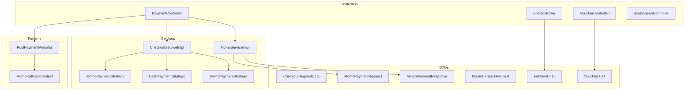
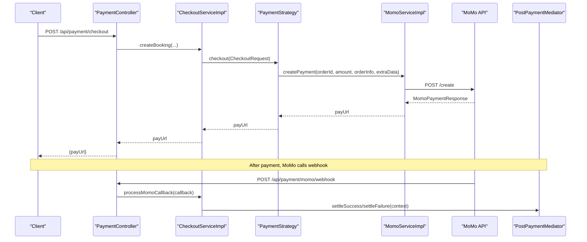
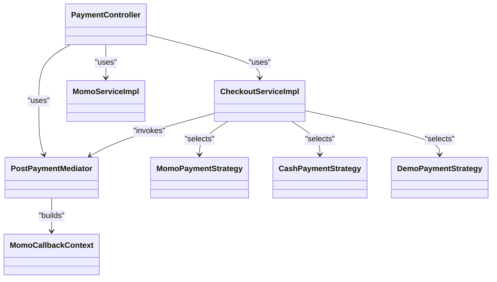
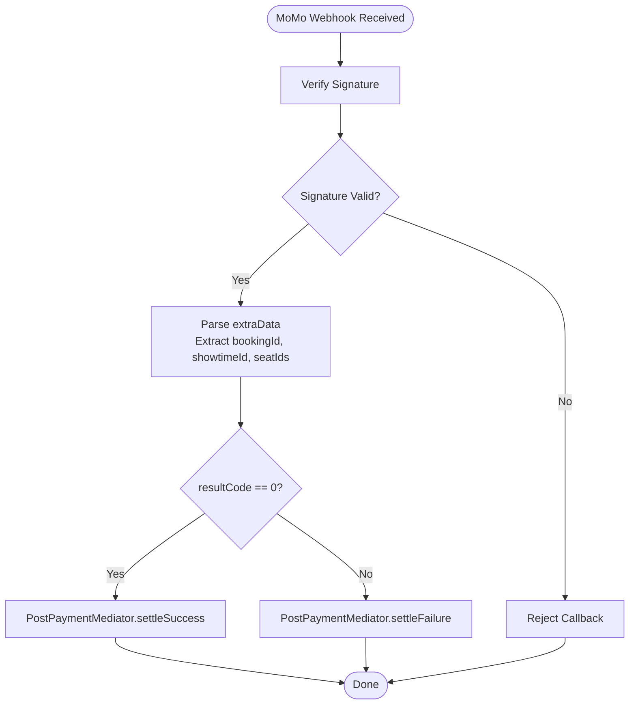

# Payment and F&B API

<cite>
**Referenced Files in This Document**
- [PaymentController.java](file://backend/src/main/java/com/cinema/booking/controllers/PaymentController.java)
- [FnbController.java](file://backend/src/main/java/com/cinema/booking/controllers/FnbController.java)
- [VoucherController.java](file://backend/src/main/java/com/cinema/booking/controllers/VoucherController.java)
- [BookingFnbController.java](file://backend/src/main/java/com/cinema/booking/controllers/BookingFnbController.java)
- [CheckoutServiceImpl.java](file://backend/src/main/java/com/cinema/booking/services/impl/CheckoutServiceImpl.java)
- [MomoServiceImpl.java](file://backend/src/main/java/com/cinema/booking/services/impl/MomoServiceImpl.java)
- [PostPaymentMediator.java](file://backend/src/main/java/com/cinema/booking/patterns/mediator/PostPaymentMediator.java)
- [MomoCallbackContext.java](file://backend/src/main/java/com/cinema/booking/patterns/mediator/MomoCallbackContext.java)
- [MomoPaymentStrategy.java](file://backend/src/main/java/com/cinema/booking/services/payment/MomoPaymentStrategy.java)
- [CashPaymentStrategy.java](file://backend/src/main/java/com/cinema/booking/services/payment/CashPaymentStrategy.java)
- [DemoPaymentStrategy.java](file://backend/src/main/java/com/cinema/booking/services/payment/DemoPaymentStrategy.java)
- [MomoPaymentRequest.java](file://backend/src/main/java/com/cinema/booking/dtos/MomoPaymentRequest.java)
- [MomoPaymentResponse.java](file://backend/src/main/java/com/cinema/booking/dtos/MomoPaymentResponse.java)
- [MomoCallbackRequest.java](file://backend/src/main/java/com/cinema/booking/dtos/MomoCallbackRequest.java)
- [CheckoutRequestDTO.java](file://backend/src/main/java/com/cinema/booking/dtos/CheckoutRequestDTO.java)
- [FnbItemDTO.java](file://backend/src/main/java/com/cinema/booking/dtos/FnbItemDTO.java)
- [VoucherDTO.java](file://backend/src/main/java/com/cinema/booking/dtos/VoucherDTO.java)
- [PromoValidHandler.java](file://backend/src/main/java/com/cinema/booking/services/strategy_decorator/pricing/validation/PromoValidHandler.java)
- [PromotionInventoryRollback.java](file://backend/src/main/java/com/cinema/booking/patterns/mediator/PromotionInventoryRollback.java)
- [UserSpendingUpdater.java](file://backend/src/main/java/com/cinema/booking/patterns/mediator/UserSpendingUpdater.java)
</cite>

## Table of Contents
1. [Introduction](#introduction)
2. [Project Structure](#project-structure)
3. [Core Components](#core-components)
4. [Architecture Overview](#architecture-overview)
5. [Detailed Component Analysis](#detailed-component-analysis)
6. [Dependency Analysis](#dependency-analysis)
7. [Performance Considerations](#performance-considerations)
8. [Troubleshooting Guide](#troubleshooting-guide)
9. [Conclusion](#conclusion)
10. [Appendices](#appendices)

## Introduction
This document provides API documentation for payment processing and food & beverage (F&B) management endpoints. It covers:
- Payment transaction history retrieval
- MoMo payment initiation and callbacks
- F&B menu and inventory management
- Promotional discount management and validation
- Payment status callbacks, refund processing, and inventory update mechanisms
- Request/response schemas and error handling

## Project Structure
The relevant backend modules are organized under controllers, services, DTOs, and patterns:
- Controllers expose REST endpoints for payments, F&B, and vouchers
- Services encapsulate business logic for checkout, MoMo integration, and inventory
- DTOs define request/response schemas
- Patterns (Mediator, Strategy, Template Method) orchestrate post-payment actions and checkout flows

**Diagram sources**
- [PaymentController.java:16-149](file://backend/src/main/java/com/cinema/booking/controllers/PaymentController.java#L16-L149)
- [FnbController.java:19-155](file://backend/src/main/java/com/cinema/booking/controllers/FnbController.java#L19-L155)
- [VoucherController.java:15-55](file://backend/src/main/java/com/cinema/booking/controllers/VoucherController.java#L15-L55)
- [BookingFnbController.java:15-47](file://backend/src/main/java/com/cinema/booking/controllers/BookingFnbController.java#L15-L47)
- [CheckoutServiceImpl.java:25-184](file://backend/src/main/java/com/cinema/booking/services/impl/CheckoutServiceImpl.java#L25-L184)
- [MomoServiceImpl.java:14-94](file://backend/src/main/java/com/cinema/booking/services/impl/MomoServiceImpl.java#L14-L94)
- [PostPaymentMediator.java:9-46](file://backend/src/main/java/com/cinema/booking/patterns/mediator/PostPaymentMediator.java#L9-L46)
- [MomoCallbackContext.java:10-18](file://backend/src/main/java/com/cinema/booking/patterns/mediator/MomoCallbackContext.java#L10-L18)
- [MomoPaymentStrategy.java:8-26](file://backend/src/main/java/com/cinema/booking/services/payment/MomoPaymentStrategy.java#L8-L26)
- [CashPaymentStrategy.java:17-39](file://backend/src/main/java/com/cinema/booking/services/payment/CashPaymentStrategy.java#L17-L39)
- [DemoPaymentStrategy.java:13-35](file://backend/src/main/java/com/cinema/booking/services/payment/DemoPaymentStrategy.java#L13-L35)
- [CheckoutRequestDTO.java:6-15](file://backend/src/main/java/com/cinema/booking/dtos/CheckoutRequestDTO.java#L6-L15)
- [MomoPaymentRequest.java:6-22](file://backend/src/main/java/com/cinema/booking/dtos/MomoPaymentRequest.java#L6-L22)
- [MomoPaymentResponse.java:5-17](file://backend/src/main/java/com/cinema/booking/dtos/MomoPaymentResponse.java#L5-L17)
- [MomoCallbackRequest.java:5-20](file://backend/src/main/java/com/cinema/booking/dtos/MomoCallbackRequest.java#L5-L20)
- [FnbItemDTO.java:6-17](file://backend/src/main/java/com/cinema/booking/dtos/FnbItemDTO.java#L6-L17)
- [VoucherDTO.java:10-20](file://backend/src/main/java/com/cinema/booking/dtos/VoucherDTO.java#L10-L20)

**Section sources**
- [PaymentController.java:16-149](file://backend/src/main/java/com/cinema/booking/controllers/PaymentController.java#L16-L149)
- [FnbController.java:19-155](file://backend/src/main/java/com/cinema/booking/controllers/FnbController.java#L19-L155)
- [VoucherController.java:15-55](file://backend/src/main/java/com/cinema/booking/controllers/VoucherController.java#L15-L55)
- [BookingFnbController.java:15-47](file://backend/src/main/java/com/cinema/booking/controllers/BookingFnbController.java#L15-L47)

## Core Components
- PaymentController: Exposes endpoints for checkout, MoMo callbacks, payment history, and staff cash checkout
- FnbController: Manages F&B items and categories, integrates inventory queries
- VoucherController: Manages promotional discount codes stored in Redis
- CheckoutServiceImpl: Orchestrates checkout via payment strategies and handles MoMo callbacks
- MomoServiceImpl: Builds and sends MoMo payment requests and verifies signatures
- PostPaymentMediator: Coordinates post-payment actions (booking status, inventory, emails)
- Strategy implementations: MomoPaymentStrategy, CashPaymentStrategy, DemoPaymentStrategy

**Section sources**
- [PaymentController.java:16-149](file://backend/src/main/java/com/cinema/booking/controllers/PaymentController.java#L16-L149)
- [CheckoutServiceImpl.java:25-184](file://backend/src/main/java/com/cinema/booking/services/impl/CheckoutServiceImpl.java#L25-L184)
- [MomoServiceImpl.java:14-94](file://backend/src/main/java/com/cinema/booking/services/impl/MomoServiceImpl.java#L14-L94)
- [PostPaymentMediator.java:9-46](file://backend/src/main/java/com/cinema/booking/patterns/mediator/PostPaymentMediator.java#L9-L46)
- [MomoPaymentStrategy.java:8-26](file://backend/src/main/java/com/cinema/booking/services/payment/MomoPaymentStrategy.java#L8-L26)
- [CashPaymentStrategy.java:17-39](file://backend/src/main/java/com/cinema/booking/services/payment/CashPaymentStrategy.java#L17-L39)
- [DemoPaymentStrategy.java:13-35](file://backend/src/main/java/com/cinema/booking/services/payment/DemoPaymentStrategy.java#L13-L35)

## Architecture Overview
The payment flow leverages Strategy and Mediator patterns:
- CheckoutServiceImpl selects a payment strategy based on method
- MoMo callback triggers PostPaymentMediator to update booking, inventory, and notifications
- F&B and voucher systems integrate via separate controllers and services

**Diagram sources**
- [PaymentController.java:32-100](file://backend/src/main/java/com/cinema/booking/controllers/PaymentController.java#L32-L100)
- [CheckoutServiceImpl.java:43-130](file://backend/src/main/java/com/cinema/booking/services/impl/CheckoutServiceImpl.java#L43-L130)
- [MomoServiceImpl.java:42-86](file://backend/src/main/java/com/cinema/booking/services/impl/MomoServiceImpl.java#L42-L86)
- [PostPaymentMediator.java:35-45](file://backend/src/main/java/com/cinema/booking/patterns/mediator/PostPaymentMediator.java#L35-L45)

## Detailed Component Analysis

### Payment Endpoints

#### GET /api/payment/history/{userId}
- Purpose: Retrieve user payment history
- Path parameters:
  - userId: integer
- Responses:
  - 200 OK: List of payment history entries
  - 400 Bad Request: Error message string
- Notes: Delegates to PaymentService.getUserPaymentHistory(userId)

**Section sources**
- [PaymentController.java:110-119](file://backend/src/main/java/com/cinema/booking/controllers/PaymentController.java#L110-L119)

#### POST /api/payment/checkout
- Purpose: Initiate checkout and obtain MoMo pay URL
- Request body: CheckoutRequestDTO
- Responses:
  - 200 OK: { payUrl }
  - 400 Bad Request: Error message string
- Validation:
  - Only supports paymentMethod=MOMO for this endpoint
  - Throws error for other methods
- Notes: Creates a pending booking and delegates to selected payment strategy

**Section sources**
- [PaymentController.java:31-51](file://backend/src/main/java/com/cinema/booking/controllers/PaymentController.java#L31-L51)
- [CheckoutServiceImpl.java:43-64](file://backend/src/main/java/com/cinema/booking/services/impl/CheckoutServiceImpl.java#L43-L64)
- [CheckoutRequestDTO.java:6-15](file://backend/src/main/java/com/cinema/booking/dtos/CheckoutRequestDTO.java#L6-L15)

#### GET /api/payment/momo/callback
- Purpose: Handle MoMo redirect after payment
- Query parameters: MomoCallbackRequest fields
- Behavior:
  - Processes callback via CheckoutServiceImpl
  - Redirects to frontend with payment result or error code

**Section sources**
- [PaymentController.java:73-88](file://backend/src/main/java/com/cinema/booking/controllers/PaymentController.java#L73-L88)
- [CheckoutServiceImpl.java:66-130](file://backend/src/main/java/com/cinema/booking/services/impl/CheckoutServiceImpl.java#L66-L130)
- [MomoCallbackRequest.java:5-20](file://backend/src/main/java/com/cinema/booking/dtos/MomoCallbackRequest.java#L5-L20)

#### POST /api/payment/momo/webhook
- Purpose: MoMo server-to-server IPN notification
- Request body: MomoCallbackRequest
- Responses:
  - 204 No Content on success
  - 400 Bad Request: Error message string
- Processing:
  - Verifies signature
  - Extracts bookingId from extraData
  - Invokes PostPaymentMediator for success or failure

**Section sources**
- [PaymentController.java:89-100](file://backend/src/main/java/com/cinema/booking/controllers/PaymentController.java#L89-L100)
- [CheckoutServiceImpl.java:66-130](file://backend/src/main/java/com/cinema/booking/services/impl/CheckoutServiceImpl.java#L66-L130)
- [MomoCallbackRequest.java:5-20](file://backend/src/main/java/com/cinema/booking/dtos/MomoCallbackRequest.java#L5-L20)

#### GET /api/payment/details/{paymentId}
- Purpose: Retrieve detailed payment information
- Path parameters:
  - paymentId: integer
- Responses:
  - 200 OK: Payment entity
  - 400 Bad Request: Error message string

**Section sources**
- [PaymentController.java:121-131](file://backend/src/main/java/com/cinema/booking/controllers/PaymentController.java#L121-L131)

#### POST /api/payment/staff/cash-checkout
- Purpose: Staff cash checkout (POS)
- Request body: CheckoutRequestDTO
- Responses:
  - 200 OK: Result map
  - 400 Bad Request: Error message string
- Notes: Uses CashPaymentStrategy to immediately confirm booking and payment

**Section sources**
- [PaymentController.java:133-148](file://backend/src/main/java/com/cinema/booking/controllers/PaymentController.java#L133-L148)
- [CashPaymentStrategy.java:17-39](file://backend/src/main/java/com/cinema/booking/services/payment/CashPaymentStrategy.java#L17-L39)

### F&B Management Endpoints

#### GET /api/fnb/items
- Purpose: Retrieve all F&B items with current stock quantities
- Responses:
  - 200 OK: List of FnbItemDTO
- Notes: Stock quantities are fetched via FnbItemInventoryService

**Section sources**
- [FnbController.java:36-44](file://backend/src/main/java/com/cinema/booking/controllers/FnbController.java#L36-L44)
- [FnbItemDTO.java:6-17](file://backend/src/main/java/com/cinema/booking/dtos/FnbItemDTO.java#L6-L17)

#### POST /api/fnb/items
- Purpose: Create a new F&B item
- Request body: FnbItemDTO
- Responses:
  - 201 Created: FnbItemDTO
- Notes: Category association optional; stock quantity upserted via inventory service

**Section sources**
- [FnbController.java:46-66](file://backend/src/main/java/com/cinema/booking/controllers/FnbController.java#L46-L66)

#### PUT /api/fnb/items/{id}
- Purpose: Update an existing F&B item
- Path parameters:
  - id: integer
- Request body: FnbItemDTO
- Responses:
  - 200 OK: FnbItemDTO
- Notes: Category can be removed by omitting categoryId

**Section sources**
- [FnbController.java:68-91](file://backend/src/main/java/com/cinema/booking/controllers/FnbController.java#L68-L91)

#### DELETE /api/fnb/items/{id}
- Purpose: Delete an F&B item
- Path parameters:
  - id: integer
- Responses:
  - 200 OK: Empty body

**Section sources**
- [FnbController.java:93-98](file://backend/src/main/java/com/cinema/booking/controllers/FnbController.java#L93-L98)

#### GET /api/fnb/categories
- Purpose: Retrieve all F&B categories
- Responses:
  - 200 OK: List of category DTOs

**Section sources**
- [FnbController.java:102-106](file://backend/src/main/java/com/cinema/booking/controllers/FnbController.java#L102-L106)

#### POST /api/fnb/categories
- Purpose: Create a new category
- Request body: Category DTO
- Responses:
  - 201 Created: Category DTO

**Section sources**
- [FnbController.java:108-116](file://backend/src/main/java/com/cinema/booking/controllers/FnbController.java#L108-L116)

#### PUT /api/fnb/categories/{id}
- Purpose: Update a category
- Path parameters:
  - id: integer
- Request body: Category DTO
- Responses:
  - 200 OK: Category DTO

**Section sources**
- [FnbController.java:118-126](file://backend/src/main/java/com/cinema/booking/controllers/FnbController.java#L118-L126)

#### DELETE /api/fnb/categories/{id}
- Purpose: Delete a category
- Path parameters:
  - id: integer
- Responses:
  - 200 OK: Empty body

**Section sources**
- [FnbController.java:128-133](file://backend/src/main/java/com/cinema/booking/controllers/FnbController.java#L128-L133)

### Voucher Management Endpoints

#### POST /api/vouchers
- Purpose: Create a new voucher
- Request body: VoucherDTO
- Responses:
  - 201 Created: Empty body
- Authorization: ADMIN or STAFF

**Section sources**
- [VoucherController.java:24-30](file://backend/src/main/java/com/cinema/booking/controllers/VoucherController.java#L24-L30)
- [VoucherDTO.java:10-20](file://backend/src/main/java/com/cinema/booking/dtos/VoucherDTO.java#L10-L20)

#### GET /api/vouchers
- Purpose: List all active vouchers
- Responses:
  - 200 OK: List of VoucherDTO
- Authorization: ADMIN or STAFF

**Section sources**
- [VoucherController.java:32-37](file://backend/src/main/java/com/cinema/booking/controllers/VoucherController.java#L32-L37)

#### PUT /api/vouchers/{code}
- Purpose: Update an existing voucher (retains TTL)
- Path parameters:
  - code: string
- Request body: VoucherDTO
- Responses:
  - 200 OK: Empty body
- Authorization: ADMIN or STAFF

**Section sources**
- [VoucherController.java:39-46](file://backend/src/main/java/com/cinema/booking/controllers/VoucherController.java#L39-L46)

#### DELETE /api/vouchers/{code}
- Purpose: Delete a voucher
- Path parameters:
  - code: string
- Responses:
  - 204 No Content
- Authorization: ADMIN or STAFF

**Section sources**
- [VoucherController.java:48-54](file://backend/src/main/java/com/cinema/booking/controllers/VoucherController.java#L48-L54)

### Booking F&B Endpoints

#### POST /api/booking-fnbs
- Purpose: Create booking F&B items
- Request body: BookingFnbCreateDTO
- Responses:
  - 201 Created: List of FnBLine entities

**Section sources**
- [BookingFnbController.java:23-27](file://backend/src/main/java/com/cinema/booking/controllers/BookingFnbController.java#L23-L27)

#### GET /api/booking-fnbs
- Purpose: Get all booking F&B items
- Responses:
  - 200 OK: List of FnBLine entities

**Section sources**
- [BookingFnbController.java:29-33](file://backend/src/main/java/com/cinema/booking/controllers/BookingFnbController.java#L29-L33)

#### GET /api/booking-fnbs/booking/{bookingId}
- Purpose: Get booking F&B items by booking ID
- Path parameters:
  - bookingId: integer
- Responses:
  - 200 OK: List of FnBLine entities

**Section sources**
- [BookingFnbController.java:35-39](file://backend/src/main/java/com/cinema/booking/controllers/BookingFnbController.java#L35-L39)

#### DELETE /api/booking-fnbs/booking/{bookingId}
- Purpose: Delete booking F&B items by booking ID
- Path parameters:
  - bookingId: integer
- Responses:
  - 204 No Content

**Section sources**
- [BookingFnbController.java:41-46](file://backend/src/main/java/com/cinema/booking/controllers/BookingFnbController.java#L41-L46)

## Dependency Analysis
- PaymentController depends on CheckoutService and PaymentService
- CheckoutServiceImpl depends on PaymentStrategyFactory, MomoService, and PostPaymentMediator
- MomoPaymentStrategy delegates to MomoCheckoutProcess; CashPaymentStrategy and DemoPaymentStrategy delegate to respective checkout processes
- PostPaymentMediator coordinates multiple colleagues (booking status, promotion inventory, F&B inventory, user spending, tickets, payment status, email notifications)

**Diagram sources**
- [PaymentController.java:20-29](file://backend/src/main/java/com/cinema/booking/controllers/PaymentController.java#L20-L29)
- [CheckoutServiceImpl.java:25-42](file://backend/src/main/java/com/cinema/booking/services/impl/CheckoutServiceImpl.java#L25-L42)
- [MomoServiceImpl.java:14-40](file://backend/src/main/java/com/cinema/booking/services/impl/MomoServiceImpl.java#L14-L40)
- [PostPaymentMediator.java:9-33](file://backend/src/main/java/com/cinema/booking/patterns/mediator/PostPaymentMediator.java#L9-L33)
- [MomoPaymentStrategy.java:8-26](file://backend/src/main/java/com/cinema/booking/services/payment/MomoPaymentStrategy.java#L8-L26)
- [CashPaymentStrategy.java:17-39](file://backend/src/main/java/com/cinema/booking/services/payment/CashPaymentStrategy.java#L17-L39)
- [DemoPaymentStrategy.java:13-35](file://backend/src/main/java/com/cinema/booking/services/payment/DemoPaymentStrategy.java#L13-L35)
- [MomoCallbackContext.java:10-18](file://backend/src/main/java/com/cinema/booking/patterns/mediator/MomoCallbackContext.java#L10-L18)

**Section sources**
- [CheckoutServiceImpl.java:25-184](file://backend/src/main/java/com/cinema/booking/services/impl/CheckoutServiceImpl.java#L25-L184)
- [PostPaymentMediator.java:9-46](file://backend/src/main/java/com/cinema/booking/patterns/mediator/PostPaymentMediator.java#L9-L46)

## Performance Considerations
- MoMo payment creation uses a single HTTP call per checkout; consider batching or async processing for high throughput
- Inventory checks and updates are performed during callbacks; ensure database indexing on bookingId and item IDs
- Signature verification and URL decoding occur in callback processing; cache decoded extraData if repeated access is needed
- Redis-based voucher storage enables fast reads and TTL-based expiration; monitor key expiration and memory usage

## Troubleshooting Guide
Common issues and resolutions:
- MoMo signature verification fails
  - Ensure secret key alignment and correct parameter ordering
  - Verify IPN URL matches configured value
- Missing extraData in callback
  - Confirm extraData format includes bookingId and optional seat IDs
  - Decode URL-encoded extraData if needed
- Payment success but booking not confirmed
  - Check PostPaymentMediator execution order and individual colleague implementations
- Insufficient inventory errors
  - Validate F&B stock before checkout; rollback on failure
- Invalid promotion
  - PromoValidHandler gracefully ignores invalid codes; ensure pricing validation chain is configured correctly

**Section sources**
- [CheckoutServiceImpl.java:66-130](file://backend/src/main/java/com/cinema/booking/services/impl/CheckoutServiceImpl.java#L66-L130)
- [PromoValidHandler.java:24-34](file://backend/src/main/java/com/cinema/booking/services/strategy_decorator/pricing/validation/PromoValidHandler.java#L24-L34)
- [PromotionInventoryRollback.java:9-22](file://backend/src/main/java/com/cinema/booking/patterns/mediator/PromotionInventoryRollback.java#L9-L22)
- [UserSpendingUpdater.java:31-58](file://backend/src/main/java/com/cinema/booking/patterns/mediator/UserSpendingUpdater.java#L31-L58)

## Conclusion
The system provides robust payment processing with MoMo integration, comprehensive F&B management, and promotional discount handling. The Strategy and Mediator patterns enable clean separation of concerns and reliable post-payment workflows. Proper error handling and inventory management ensure reliability under various failure scenarios.

## Appendices

### Request/Response Schemas

- CheckoutRequestDTO
  - Fields: userId, showtimeId, seatIds, fnbs, promoCode, paymentMethod
  - Used by: POST /api/payment/checkout

- MomoPaymentRequest
  - Fields: partnerCode, partnerName, storeId, requestId, amount, orderId, orderInfo, redirectUrl, ipnUrl, lang, extraData, requestType, signature

- MomoPaymentResponse
  - Fields: partnerCode, orderId, requestId, amount, responseTime, message, resultCode, payUrl, deeplink, qrCodeUrl

- MomoCallbackRequest
  - Fields: partnerCode, orderId, requestId, amount, orderInfo, orderType, transId, resultCode, message, payType, responseTime, extraData, signature

- FnbItemDTO
  - Fields: itemId, name, description, price, stockQuantity, isActive, imageUrl, categoryId

- VoucherDTO
  - Fields: code, discountPercentage, maxDiscountAmount, minPurchaseAmount, ttlSeconds

**Section sources**
- [CheckoutRequestDTO.java:6-15](file://backend/src/main/java/com/cinema/booking/dtos/CheckoutRequestDTO.java#L6-L15)
- [MomoPaymentRequest.java:6-22](file://backend/src/main/java/com/cinema/booking/dtos/MomoPaymentRequest.java#L6-L22)
- [MomoPaymentResponse.java:5-17](file://backend/src/main/java/com/cinema/booking/dtos/MomoPaymentResponse.java#L5-L17)
- [MomoCallbackRequest.java:5-20](file://backend/src/main/java/com/cinema/booking/dtos/MomoCallbackRequest.java#L5-L20)
- [FnbItemDTO.java:6-17](file://backend/src/main/java/com/cinema/booking/dtos/FnbItemDTO.java#L6-L17)
- [VoucherDTO.java:10-20](file://backend/src/main/java/com/cinema/booking/dtos/VoucherDTO.java#L10-L20)

### Payment Status Callback Flow

**Diagram sources**
- [CheckoutServiceImpl.java:66-130](file://backend/src/main/java/com/cinema/booking/services/impl/CheckoutServiceImpl.java#L66-L130)
- [PostPaymentMediator.java:35-45](file://backend/src/main/java/com/cinema/booking/patterns/mediator/PostPaymentMediator.java#L35-L45)