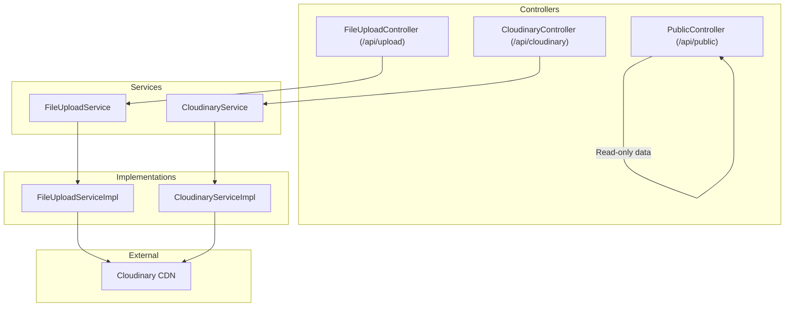
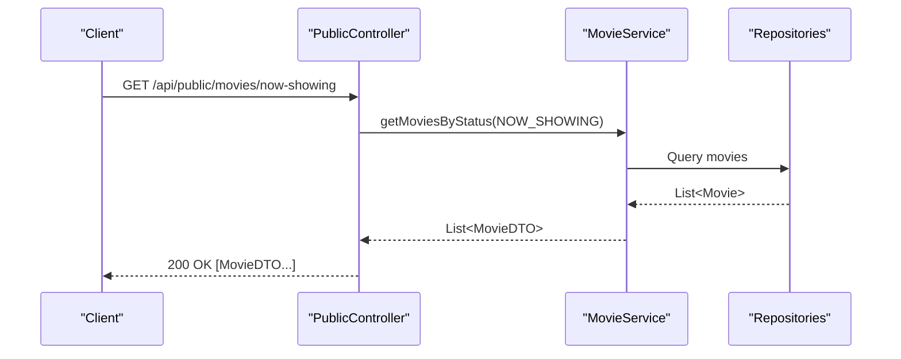
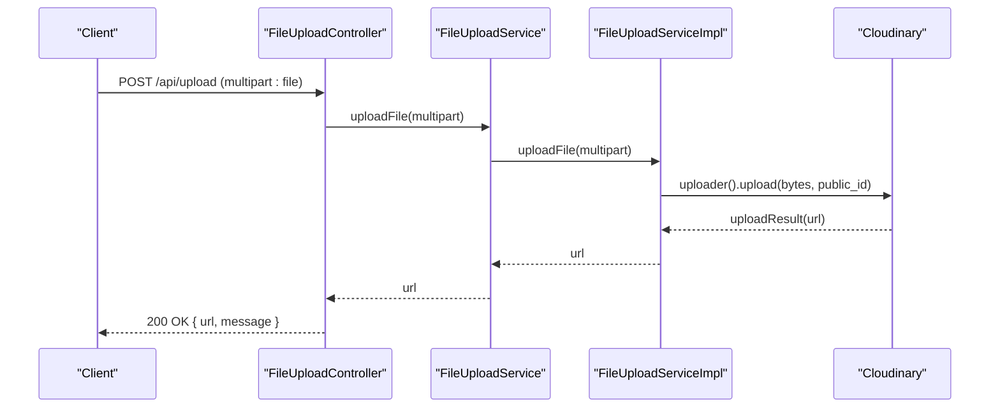
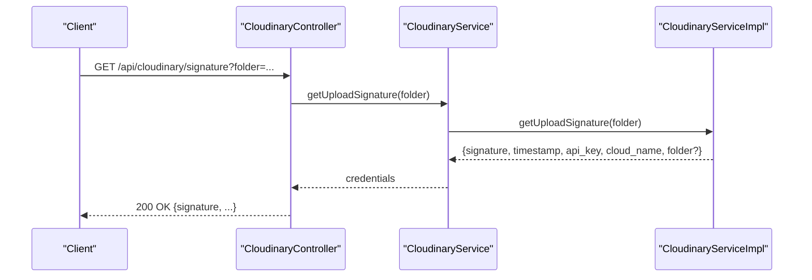
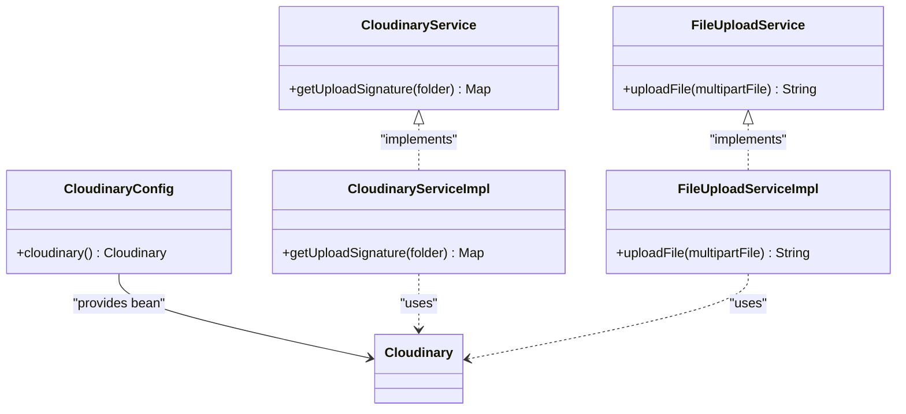
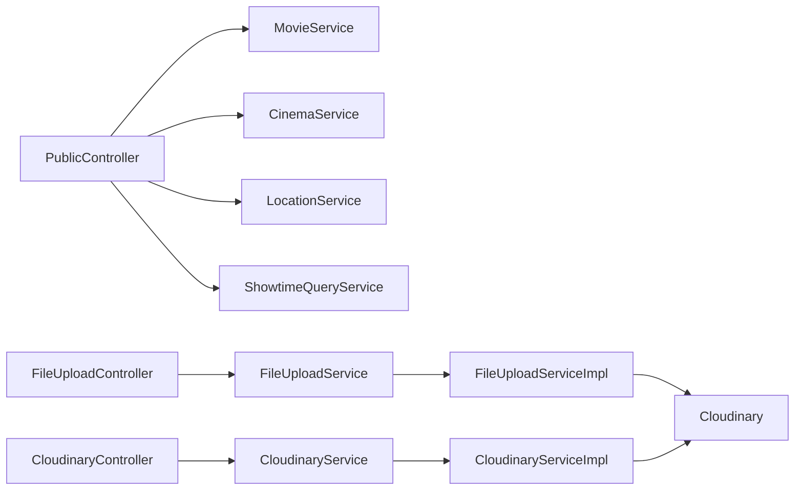

# System Integration API

<cite>
**Referenced Files in This Document**
- [PublicController.java](file://backend/src/main/java/com/cinema/booking/controllers/PublicController.java)
- [FileUploadController.java](file://backend/src/main/java/com/cinema/booking/controllers/FileUploadController.java)
- [CloudinaryController.java](file://backend/src/main/java/com/cinema/booking/controllers/CloudinaryController.java)
- [CloudinaryConfig.java](file://backend/src/main/java/com/cinema/booking/config/CloudinaryConfig.java)
- [CloudinaryService.java](file://backend/src/main/java/com/cinema/booking/services/CloudinaryService.java)
- [CloudinaryServiceImpl.java](file://backend/src/main/java/com/cinema/booking/services/impl/CloudinaryServiceImpl.java)
- [FileUploadService.java](file://backend/src/main/java/com/cinema/booking/services/FileUploadService.java)
- [FileUploadServiceImpl.java](file://backend/src/main/java/com/cinema/booking/services/impl/FileUploadServiceImpl.java)
- [application.properties](file://backend/src/main/resources/application.properties)
- [MovieDTO.java](file://backend/src/main/java/com/cinema/booking/dtos/MovieDTO.java)
- [ShowtimeDTO.java](file://backend/src/main/java/com/cinema/booking/dtos/ShowtimeDTO.java)
</cite>

## Table of Contents
1. [Introduction](#introduction)
2. [Project Structure](#project-structure)
3. [Core Components](#core-components)
4. [Architecture Overview](#architecture-overview)
5. [Detailed Component Analysis](#detailed-component-analysis)
6. [Dependency Analysis](#dependency-analysis)
7. [Performance Considerations](#performance-considerations)
8. [Troubleshooting Guide](#troubleshooting-guide)
9. [Conclusion](#conclusion)
10. [Appendices](#appendices)

## Introduction
This document describes the system integration APIs for public data access and external service integrations. It focuses on:
- Public read-only endpoints under /api/public
- File upload endpoints for general file uploads and Cloudinary image management
- Media management and CDN integration via Cloudinary
- Multipart/form-data handling, file size limits, supported formats, and security considerations
- Examples of consuming public data and performing file uploads

## Project Structure
The backend is a Spring Boot application with controllers exposing REST endpoints, services implementing business logic, and configuration for external integrations such as Cloudinary.

**Diagram sources**
- [PublicController.java:33-35](file://backend/src/main/java/com/cinema/booking/controllers/PublicController.java#L33-L35)
- [FileUploadController.java:15-16](file://backend/src/main/java/com/cinema/booking/controllers/FileUploadController.java#L15-L16)
- [CloudinaryController.java:14-15](file://backend/src/main/java/com/cinema/booking/controllers/CloudinaryController.java#L14-L15)
- [FileUploadService.java:6-9](file://backend/src/main/java/com/cinema/booking/services/FileUploadService.java#L6-L9)
- [CloudinaryService.java:5-7](file://backend/src/main/java/com/cinema/booking/services/CloudinaryService.java#L5-L7)
- [FileUploadServiceImpl.java:15-38](file://backend/src/main/java/com/cinema/booking/services/impl/FileUploadServiceImpl.java#L15-L38)
- [CloudinaryServiceImpl.java:14-48](file://backend/src/main/java/com/cinema/booking/services/impl/CloudinaryServiceImpl.java#L14-L48)

**Section sources**
- [PublicController.java:33-35](file://backend/src/main/java/com/cinema/booking/controllers/PublicController.java#L33-L35)
- [FileUploadController.java:15-16](file://backend/src/main/java/com/cinema/booking/controllers/FileUploadController.java#L15-L16)
- [CloudinaryController.java:14-15](file://backend/src/main/java/com/cinema/booking/controllers/CloudinaryController.java#L14-L15)

## Core Components
- PublicController: Exposes read-only endpoints for movies, cinemas, locations, showtimes, and F&B items.
- FileUploadController: Accepts multipart/form-data and delegates upload to FileUploadService.
- CloudinaryController: Provides signed upload parameters and credentials for client-side uploads.
- CloudinaryConfig: Registers Cloudinary bean using configured credentials.
- FileUploadService and CloudinaryService: Interfaces for upload operations.
- FileUploadServiceImpl and CloudinaryServiceImpl: Implementations leveraging Cloudinary SDK.

**Section sources**
- [PublicController.java:63-165](file://backend/src/main/java/com/cinema/booking/controllers/PublicController.java#L63-L165)
- [FileUploadController.java:21-39](file://backend/src/main/java/com/cinema/booking/controllers/FileUploadController.java#L21-L39)
- [CloudinaryController.java:21-32](file://backend/src/main/java/com/cinema/booking/controllers/CloudinaryController.java#L21-L32)
- [CloudinaryConfig.java:23-31](file://backend/src/main/java/com/cinema/booking/config/CloudinaryConfig.java#L23-L31)
- [FileUploadService.java:6-9](file://backend/src/main/java/com/cinema/booking/services/FileUploadService.java#L6-L9)
- [CloudinaryService.java:5-7](file://backend/src/main/java/com/cinema/booking/services/CloudinaryService.java#L5-L7)
- [FileUploadServiceImpl.java:21-38](file://backend/src/main/java/com/cinema/booking/services/impl/FileUploadServiceImpl.java#L21-L38)
- [CloudinaryServiceImpl.java:25-48](file://backend/src/main/java/com/cinema/booking/services/impl/CloudinaryServiceImpl.java#L25-L48)

## Architecture Overview
The public API layer retrieves data from services and repositories. Uploads are processed through dedicated controllers and services that integrate with Cloudinary for storage and delivery.

**Diagram sources**
- [PublicController.java:63-66](file://backend/src/main/java/com/cinema/booking/controllers/PublicController.java#L63-L66)
- [MovieDTO.java:14-37](file://backend/src/main/java/com/cinema/booking/dtos/MovieDTO.java#L14-L37)

**Section sources**
- [PublicController.java:63-66](file://backend/src/main/java/com/cinema/booking/controllers/PublicController.java#L63-L66)
- [MovieDTO.java:14-37](file://backend/src/main/java/com/cinema/booking/dtos/MovieDTO.java#L14-L37)

## Detailed Component Analysis

### Public Endpoints
Public endpoints are exposed under /api/public and return read-only data without requiring authentication.

- GET /api/public/movies/now-showing
  - Returns a list of movies with status NOW_SHOWING.
  - Implementation: Calls MovieService.getMoviesByStatus with NOW_SHOWING.
  - Response: 200 OK with array of MovieDTO.

- GET /api/public/movies/coming-soon
  - Returns a list of movies with status COMING_SOON.
  - Implementation: Calls MovieService.getMoviesByStatus with COMING_SOON.
  - Response: 200 OK with array of MovieDTO.

- GET /api/public/cinemas
  - Returns a list of cinema DTOs.
  - Implementation: Calls CinemaService.getAllCinemas.
  - Response: 200 OK with array of Cinema DTOs.

- GET /api/public/locations
  - Returns a list of locations.
  - Implementation: Calls LocationService.getAllLocations.
  - Response: 200 OK with array of Location DTOs.

- GET /api/public/showtimes
  - Filters showtimes by optional parameters: cinemaId, movieId, date.
  - Uses ShowtimeFilterBuilder to construct filters and ShowtimeQueryService to query.
  - Response: 200 OK with array of ShowtimeDTO.

- GET /api/public/showtimes/filter
  - Extended filtering with additional criteria: locationId, screenType, minPrice, maxPrice.
  - Same filter construction and query pipeline as above.
  - Response: 200 OK with array of ShowtimeDTO.

- GET /api/public/fnb/categories
  - Returns public food & beverage categories.
  - Implementation: Reads from FnbCategoryRepository.
  - Response: 200 OK with array of FnbCategory.

- GET /api/public/fnb/items
  - Returns public F&B items with stock quantities derived from inventory service.
  - Implementation: Reads items, computes stock map via FnbItemInventoryService, maps to FnbItemDTO.
  - Response: 200 OK with array of FnbItemDTO.

Security considerations:
- These endpoints are public and do not require authentication.
- CORS is enabled globally for "*" with maxAge 3600.

**Section sources**
- [PublicController.java:63-165](file://backend/src/main/java/com/cinema/booking/controllers/PublicController.java#L63-L165)
- [ShowtimeDTO.java:10-37](file://backend/src/main/java/com/cinema/booking/dtos/ShowtimeDTO.java#L10-L37)
- [MovieDTO.java:14-37](file://backend/src/main/java/com/cinema/booking/dtos/MovieDTO.java#L14-L37)

### File Upload Endpoints
Two upload pathways are available:
- POST /api/upload: Server-side upload via multipart/form-data.
- POST /api/cloudinary/credentials and GET /api/cloudinary/signature: Client-side upload to Cloudinary using signed parameters.

#### POST /api/upload
- Request: multipart/form-data with field "file" of type MultipartFile.
- Processing: FileUploadController delegates to FileUploadService.uploadFile.
- Behavior: Generates a safe public_id, uploads to Cloudinary, returns the image URL.
- Response: 200 OK with JSON containing url and message; on error returns 400 with error message.

**Diagram sources**
- [FileUploadController.java:23-34](file://backend/src/main/java/com/cinema/booking/controllers/FileUploadController.java#L23-L34)
- [FileUploadServiceImpl.java:21-38](file://backend/src/main/java/com/cinema/booking/services/impl/FileUploadServiceImpl.java#L21-L38)

**Section sources**
- [FileUploadController.java:21-39](file://backend/src/main/java/com/cinema/booking/controllers/FileUploadController.java#L21-L39)
- [FileUploadServiceImpl.java:21-38](file://backend/src/main/java/com/cinema/booking/services/impl/FileUploadServiceImpl.java#L21-L38)

#### POST /api/cloudinary/credentials
- Request: JSON body with optional folder field.
- Processing: CloudinaryController delegates to CloudinaryService.getUploadSignature.
- Response: 200 OK with signature, timestamp, api_key, cloud_name, and optionally folder.

#### GET /api/cloudinary/signature
- Request: Query parameter folder (optional).
- Processing: Same as above.
- Response: 200 OK with signature, timestamp, api_key, cloud_name, and optionally folder.

**Diagram sources**
- [CloudinaryController.java:22-25](file://backend/src/main/java/com/cinema/booking/controllers/CloudinaryController.java#L22-L25)
- [CloudinaryServiceImpl.java:25-48](file://backend/src/main/java/com/cinema/booking/services/impl/CloudinaryServiceImpl.java#L25-L48)

**Section sources**
- [CloudinaryController.java:21-32](file://backend/src/main/java/com/cinema/booking/controllers/CloudinaryController.java#L21-L32)
- [CloudinaryServiceImpl.java:25-48](file://backend/src/main/java/com/cinema/booking/services/impl/CloudinaryServiceImpl.java#L25-L48)

### Media Management and CDN Integration
- Cloudinary bean is configured using application properties for cloud_name, api_key, and api_secret.
- FileUploadServiceImpl uses Cloudinary uploader to store files and returns the delivered URL.
- CloudinaryServiceImpl generates signed upload parameters (signature, timestamp, api_key, cloud_name) for client-side uploads.

**Diagram sources**
- [CloudinaryConfig.java:23-31](file://backend/src/main/java/com/cinema/booking/config/CloudinaryConfig.java#L23-L31)
- [CloudinaryService.java:5-7](file://backend/src/main/java/com/cinema/booking/services/CloudinaryService.java#L5-L7)
- [CloudinaryServiceImpl.java:14-48](file://backend/src/main/java/com/cinema/booking/services/impl/CloudinaryServiceImpl.java#L14-L48)
- [FileUploadService.java:6-9](file://backend/src/main/java/com/cinema/booking/services/FileUploadService.java#L6-L9)
- [FileUploadServiceImpl.java:15-38](file://backend/src/main/java/com/cinema/booking/services/impl/FileUploadServiceImpl.java#L15-L38)

**Section sources**
- [CloudinaryConfig.java:23-31](file://backend/src/main/java/com/cinema/booking/config/CloudinaryConfig.java#L23-L31)
- [CloudinaryService.java:5-7](file://backend/src/main/java/com/cinema/booking/services/CloudinaryService.java#L5-L7)
- [CloudinaryServiceImpl.java:14-48](file://backend/src/main/java/com/cinema/booking/services/impl/CloudinaryServiceImpl.java#L14-L48)
- [FileUploadService.java:6-9](file://backend/src/main/java/com/cinema/booking/services/FileUploadService.java#L6-L9)
- [FileUploadServiceImpl.java:15-38](file://backend/src/main/java/com/cinema/booking/services/impl/FileUploadServiceImpl.java#L15-L38)

## Dependency Analysis
- Controllers depend on services for business logic.
- Services depend on Cloudinary SDK for uploads.
- Configuration wires Cloudinary credentials from environment properties.

**Diagram sources**
- [PublicController.java:37-59](file://backend/src/main/java/com/cinema/booking/controllers/PublicController.java#L37-L59)
- [FileUploadController.java:18-19](file://backend/src/main/java/com/cinema/booking/controllers/FileUploadController.java#L18-L19)
- [CloudinaryController.java:18-19](file://backend/src/main/java/com/cinema/booking/controllers/CloudinaryController.java#L18-L19)
- [FileUploadServiceImpl.java:18-19](file://backend/src/main/java/com/cinema/booking/services/impl/FileUploadServiceImpl.java#L18-L19)
- [CloudinaryServiceImpl.java:16-17](file://backend/src/main/java/com/cinema/booking/services/impl/CloudinaryServiceImpl.java#L16-L17)

**Section sources**
- [PublicController.java:37-59](file://backend/src/main/java/com/cinema/booking/controllers/PublicController.java#L37-L59)
- [FileUploadController.java:18-19](file://backend/src/main/java/com/cinema/booking/controllers/FileUploadController.java#L18-L19)
- [CloudinaryController.java:18-19](file://backend/src/main/java/com/cinema/booking/controllers/CloudinaryController.java#L18-L19)
- [FileUploadServiceImpl.java:18-19](file://backend/src/main/java/com/cinema/booking/services/impl/FileUploadServiceImpl.java#L18-L19)
- [CloudinaryServiceImpl.java:16-17](file://backend/src/main/java/com/cinema/booking/services/impl/CloudinaryServiceImpl.java#L16-L17)

## Performance Considerations
- File size limit: Both single file and total request sizes are set to 5 MB via application properties.
- Network-bound operations: Uploads traverse the server (for /api/upload) or rely on client-to-Cloudinary direct uploads (for /api/cloudinary/*).
- Filtering: Showtime queries leverage a builder pattern to minimize conditional branching and optimize query composition.

[No sources needed since this section provides general guidance]

## Troubleshooting Guide
Common issues and resolutions:
- Upload failures (HTTP 400): Verify multipart field name is "file" and content type is appropriate. Check server logs for underlying exceptions.
- Signature errors: Ensure Cloudinary credentials are present in environment variables and application properties.
- CORS errors: Confirm frontend origin matches allowed origins and that preflight requests are permitted.
- Large files rejected: Reduce file size below 5 MB limit.

**Section sources**
- [application.properties:51-52](file://backend/src/main/resources/application.properties#L51-L52)
- [FileUploadController.java:36-38](file://backend/src/main/java/com/cinema/booking/controllers/FileUploadController.java#L36-L38)
- [CloudinaryConfig.java:14-21](file://backend/src/main/java/com/cinema/booking/config/CloudinaryConfig.java#L14-L21)

## Conclusion
The system exposes a comprehensive set of public endpoints for browsing movies, showtimes, and F&B offerings, alongside robust file upload capabilities integrated with Cloudinary. Client-side uploads are secured via signed parameters, while server-side uploads provide a straightforward multipart upload path. Configuration enforces practical limits and integrates seamlessly with Cloudinary for scalable media delivery.

[No sources needed since this section summarizes without analyzing specific files]

## Appendices

### API Reference Summary

- Public Data Access
  - GET /api/public/movies/now-showing
  - GET /api/public/movies/coming-soon
  - GET /api/public/cinemas
  - GET /api/public/locations
  - GET /api/public/showtimes?cinemaId=&movieId=&date=
  - GET /api/public/showtimes/filter?cinemaId=&movieId=&date=&locationId=&screenType=&minPrice=&maxPrice=
  - GET /api/public/fnb/categories
  - GET /api/public/fnb/items

- File Upload
  - POST /api/upload (multipart/form-data: file)
  - GET /api/cloudinary/signature?folder=
  - POST /api/cloudinary/credentials (JSON: { folder })

Security and configuration highlights:
- Public endpoints: No authentication required; CORS enabled.
- Upload limits: 5 MB per file and total request size.
- Cloudinary credentials: Provided via environment variables and application properties.

**Section sources**
- [PublicController.java:63-165](file://backend/src/main/java/com/cinema/booking/controllers/PublicController.java#L63-L165)
- [FileUploadController.java:21-39](file://backend/src/main/java/com/cinema/booking/controllers/FileUploadController.java#L21-L39)
- [CloudinaryController.java:21-32](file://backend/src/main/java/com/cinema/booking/controllers/CloudinaryController.java#L21-L32)
- [application.properties:51-56](file://backend/src/main/resources/application.properties#L51-L56)
- [CloudinaryConfig.java:14-21](file://backend/src/main/java/com/cinema/booking/config/CloudinaryConfig.java#L14-L21)