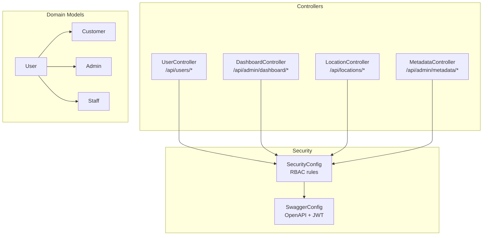
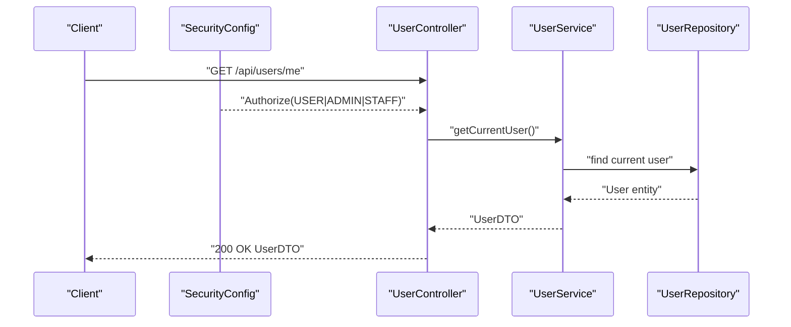
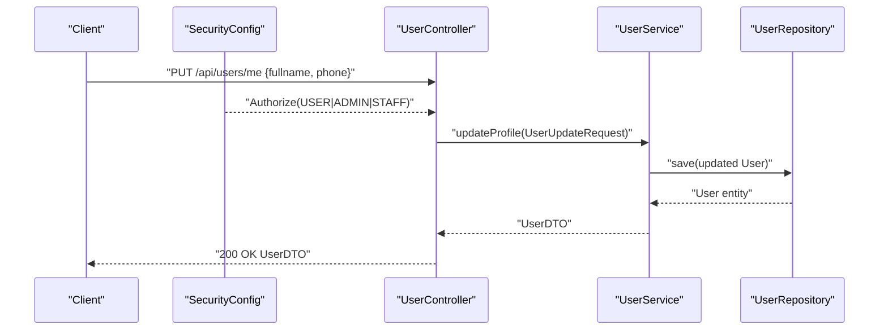
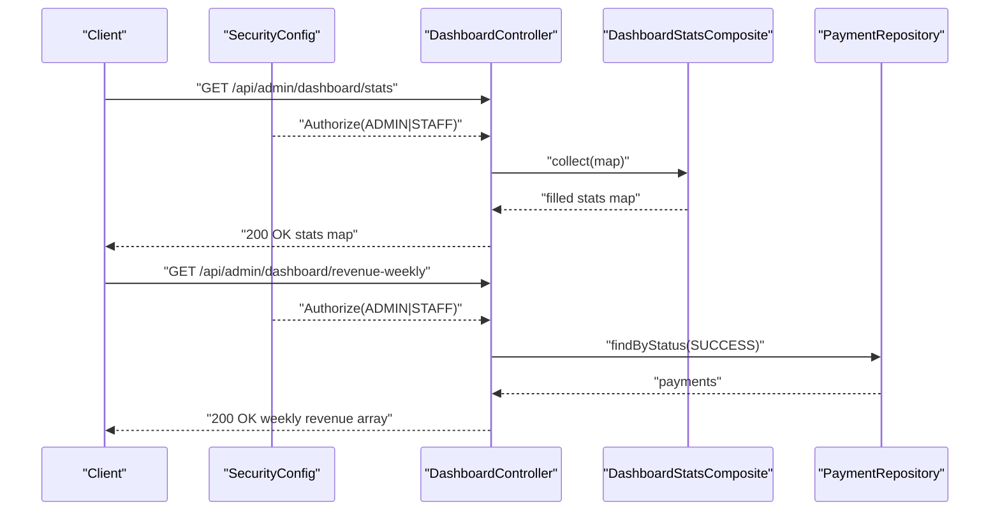
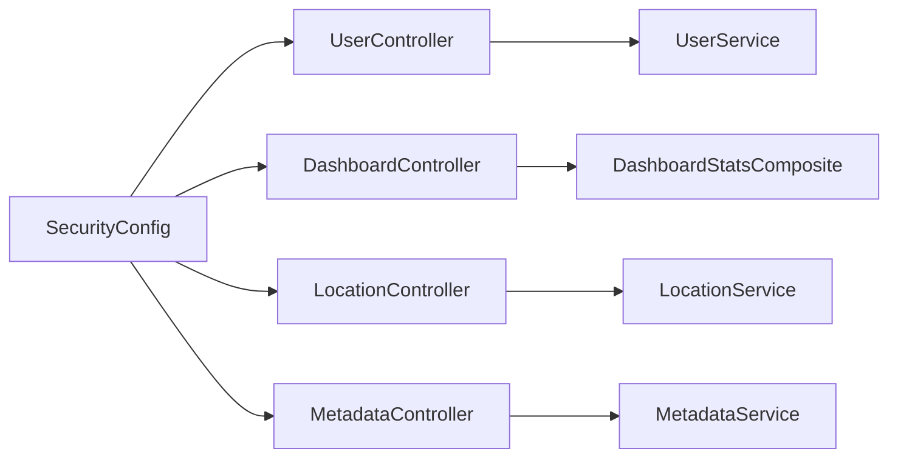

# User and Admin API

<cite>
**Referenced Files in This Document**
- [UserController.java](file://backend/src/main/java/com/cinema/booking/controllers/UserController.java)
- [DashboardController.java](file://backend/src/main/java/com/cinema/booking/controllers/DashboardController.java)
- [LocationController.java](file://backend/src/main/java/com/cinema/booking/controllers/LocationController.java)
- [MetadataController.java](file://backend/src/main/java/com/cinema/booking/controllers/MetadataController.java)
- [SecurityConfig.java](file://backend/src/main/java/com/cinema/booking/config/SecurityConfig.java)
- [SwaggerConfig.java](file://backend/src/main/java/com/cinema/booking/config/SwaggerConfig.java)
- [UserDTO.java](file://backend/src/main/java/com/cinema/booking/dtos/UserDTO.java)
- [UserUpdateRequest.java](file://backend/src/main/java/com/cinema/booking/dtos/UserUpdateRequest.java)
- [LocationDTO.java](file://backend/src/main/java/com/cinema/booking/dtos/LocationDTO.java)
- [User.java](file://backend/src/main/java/com/cinema/booking/entities/User.java)
- [Customer.java](file://backend/src/main/java/com/cinema/booking/entities/Customer.java)
- [Admin.java](file://backend/src/main/java/com/cinema/booking/entities/Admin.java)
- [Staff.java](file://backend/src/main/java/com/cinema/booking/entities/Staff.java)
- [DashboardStatsComposite.java](file://backend/src/main/java/com/cinema/booking/patterns/composite/DashboardStatsComposite.java)
</cite>

## Table of Contents
1. [Introduction](#introduction)
2. [Project Structure](#project-structure)
3. [Core Components](#core-components)
4. [Architecture Overview](#architecture-overview)
5. [Detailed Component Analysis](#detailed-component-analysis)
6. [Dependency Analysis](#dependency-analysis)
7. [Performance Considerations](#performance-considerations)
8. [Troubleshooting Guide](#troubleshooting-guide)
9. [Conclusion](#conclusion)
10. [Appendices](#appendices)

## Introduction
This document provides API documentation for user management and administrative endpoints in the cinema booking system. It covers:
- User profile retrieval and updates
- Administrative dashboard analytics
- Geographic data management
- System metadata management
- Role-based access control (RBAC) requirements
- Request/response schemas for key operations

Endpoints documented here are implemented in the backend controllers and protected by method-level security configured via Spring Security.

## Project Structure
The relevant API surface is organized under controllers grouped by domain:
- User management: UserController
- Administration: DashboardController, MetadataController
- Geographic data: LocationController
- Security and documentation: SecurityConfig, SwaggerConfig

**Diagram sources**
- [UserController.java:1-36](file://backend/src/main/java/com/cinema/booking/controllers/UserController.java#L1-L36)
- [DashboardController.java:1-68](file://backend/src/main/java/com/cinema/booking/controllers/DashboardController.java#L1-L68)
- [LocationController.java:1-51](file://backend/src/main/java/com/cinema/booking/controllers/LocationController.java#L1-L51)
- [MetadataController.java:1-123](file://backend/src/main/java/com/cinema/booking/controllers/MetadataController.java#L1-L123)
- [SecurityConfig.java:1-82](file://backend/src/main/java/com/cinema/booking/config/SecurityConfig.java#L1-L82)
- [SwaggerConfig.java:1-37](file://backend/src/main/java/com/cinema/booking/config/SwaggerConfig.java#L1-L37)
- [User.java:1-38](file://backend/src/main/java/com/cinema/booking/entities/User.java#L1-L38)
- [Customer.java:1-31](file://backend/src/main/java/com/cinema/booking/entities/Customer.java#L1-L31)
- [Admin.java:1-19](file://backend/src/main/java/com/cinema/booking/entities/Admin.java#L1-L19)
- [Staff.java:1-19](file://backend/src/main/java/com/cinema/booking/entities/Staff.java#L1-L19)

**Section sources**
- [UserController.java:1-36](file://backend/src/main/java/com/cinema/booking/controllers/UserController.java#L1-L36)
- [DashboardController.java:1-68](file://backend/src/main/java/com/cinema/booking/controllers/DashboardController.java#L1-L68)
- [LocationController.java:1-51](file://backend/src/main/java/com/cinema/booking/controllers/LocationController.java#L1-L51)
- [MetadataController.java:1-123](file://backend/src/main/java/com/cinema/booking/controllers/MetadataController.java#L1-L123)
- [SecurityConfig.java:1-82](file://backend/src/main/java/com/cinema/booking/config/SecurityConfig.java#L1-L82)
- [SwaggerConfig.java:1-37](file://backend/src/main/java/com/cinema/booking/config/SwaggerConfig.java#L1-L37)

## Core Components
- UserController: Provides GET /api/users/me and PUT /api/users/me for current user profile retrieval and updates.
- DashboardController: Provides administrative statistics and weekly revenue data under /api/admin/dashboard.
- LocationController: Manages geographic locations with full CRUD endpoints under /api/locations.
- MetadataController: Admin-only CRUD endpoints for genres, cast members, and artists under /api/admin/metadata.

Access control is enforced via method security annotations and global HTTP security rules.

**Section sources**
- [UserController.java:1-36](file://backend/src/main/java/com/cinema/booking/controllers/UserController.java#L1-L36)
- [DashboardController.java:1-68](file://backend/src/main/java/com/cinema/booking/controllers/DashboardController.java#L1-L68)
- [LocationController.java:1-51](file://backend/src/main/java/com/cinema/booking/controllers/LocationController.java#L1-L51)
- [MetadataController.java:1-123](file://backend/src/main/java/com/cinema/booking/controllers/MetadataController.java#L1-L123)
- [SecurityConfig.java:66-74](file://backend/src/main/java/com/cinema/booking/config/SecurityConfig.java#L66-L74)

## Architecture Overview
The APIs are secured with JWT bearer tokens and method-level @PreAuthorize checks. Controllers delegate to services and repositories, returning ResponseEntity-wrapped DTOs.

**Diagram sources**
- [SecurityConfig.java:66-74](file://backend/src/main/java/com/cinema/booking/config/SecurityConfig.java#L66-L74)
- [UserController.java:22-27](file://backend/src/main/java/com/cinema/booking/controllers/UserController.java#L22-L27)
- [UserDTO.java:1-53](file://backend/src/main/java/com/cinema/booking/dtos/UserDTO.java#L1-L53)

**Section sources**
- [SecurityConfig.java:1-82](file://backend/src/main/java/com/cinema/booking/config/SecurityConfig.java#L1-L82)
- [UserController.java:1-36](file://backend/src/main/java/com/cinema/booking/controllers/UserController.java#L1-L36)
- [UserDTO.java:1-53](file://backend/src/main/java/com/cinema/booking/dtos/UserDTO.java#L1-L53)

## Detailed Component Analysis

### User Profile Endpoints
- GET /api/users/me
  - Description: Retrieve the current authenticated user’s profile.
  - Authorization: USER, ADMIN, or STAFF.
  - Response: UserDTO containing user identifiers, contact info, role, spending, loyalty points, membership tier, and creation timestamp.
  - Notes: The endpoint delegates to UserService.getCurrentUser.

- PUT /api/users/me
  - Description: Update personal details (full name, phone number).
  - Authorization: USER, ADMIN, or STAFF.
  - Request body: UserUpdateRequest with fields fullname and phone.
  - Response: Updated UserDTO.

**Diagram sources**
- [SecurityConfig.java:66-74](file://backend/src/main/java/com/cinema/booking/config/SecurityConfig.java#L66-L74)
- [UserController.java:29-34](file://backend/src/main/java/com/cinema/booking/controllers/UserController.java#L29-L34)
- [UserUpdateRequest.java:1-10](file://backend/src/main/java/com/cinema/booking/dtos/UserUpdateRequest.java#L1-L10)
- [UserDTO.java:1-53](file://backend/src/main/java/com/cinema/booking/dtos/UserDTO.java#L1-L53)

**Section sources**
- [UserController.java:1-36](file://backend/src/main/java/com/cinema/booking/controllers/UserController.java#L1-L36)
- [UserDTO.java:1-53](file://backend/src/main/java/com/cinema/booking/dtos/UserDTO.java#L1-L53)
- [UserUpdateRequest.java:1-10](file://backend/src/main/java/com/cinema/booking/dtos/UserUpdateRequest.java#L1-L10)
- [SecurityConfig.java:66-74](file://backend/src/main/java/com/cinema/booking/config/SecurityConfig.java#L66-L74)

### Administrative Dashboard Endpoints
- GET /api/admin/dashboard/stats
  - Description: Aggregate system metrics (movies, users, showtimes, F&B, vouchers, revenue).
  - Authorization: ADMIN or STAFF.
  - Response: Map<String, Object> built by DashboardStatsComposite collecting leaf statistics.

- GET /api/admin/dashboard/revenue-weekly
  - Description: Weekly revenue breakdown for the last 7 days (Monday to Sunday).
  - Authorization: ADMIN or STAFF.
  - Response: Array of objects with day label and amount.

**Diagram sources**
- [SecurityConfig.java:66-74](file://backend/src/main/java/com/cinema/booking/config/SecurityConfig.java#L66-L74)
- [DashboardController.java:31-66](file://backend/src/main/java/com/cinema/booking/controllers/DashboardController.java#L31-L66)
- [DashboardStatsComposite.java:1-44](file://backend/src/main/java/com/cinema/booking/patterns/composite/DashboardStatsComposite.java#L1-L44)

**Section sources**
- [DashboardController.java:1-68](file://backend/src/main/java/com/cinema/booking/controllers/DashboardController.java#L1-L68)
- [DashboardStatsComposite.java:1-44](file://backend/src/main/java/com/cinema/booking/patterns/composite/DashboardStatsComposite.java#L1-L44)
- [SecurityConfig.java:66-74](file://backend/src/main/java/com/cinema/booking/config/SecurityConfig.java#L66-L74)

### Geographic Data Management Endpoints
- GET /api/locations
  - Description: List all locations.
  - Response: Array of LocationDTO with locationId and name.

- GET /api/locations/{id}
  - Description: Get a location by ID.
  - Response: LocationDTO.

- POST /api/locations
  - Description: Create a new location.
  - Request body: LocationDTO with name.
  - Response: Created LocationDTO.

- PUT /api/locations/{id}
  - Description: Update a location by ID.
  - Request body: LocationDTO with name.
  - Response: Updated LocationDTO.

- DELETE /api/locations/{id}
  - Description: Delete a location by ID.
  - Response: 200 OK empty body.

Authorization: ADMIN or STAFF.

**Section sources**
- [LocationController.java:1-51](file://backend/src/main/java/com/cinema/booking/controllers/LocationController.java#L1-L51)
- [LocationDTO.java:1-13](file://backend/src/main/java/com/cinema/booking/dtos/LocationDTO.java#L1-L13)
- [SecurityConfig.java:66-74](file://backend/src/main/java/com/cinema/booking/config/SecurityConfig.java#L66-L74)

### System Metadata Management Endpoints
- GET /api/admin/metadata/genres
  - Response: List of genres.

- POST /api/admin/metadata/genres
  - Request body: Genre entity.
  - Response: Saved Genre.

- PUT /api/admin/metadata/genres/{id}
  - Request body: Partial Genre details.
  - Response: Updated Genre.

- DELETE /api/admin/metadata/genres/{id}
  - Response: 200 OK empty body.

- GET /api/admin/metadata/cast-members
  - Response: List of cast members.

- POST /api/admin/metadata/cast-members
  - Request body: CastMember entity.
  - Response: Saved CastMember.

- PUT /api/admin/metadata/cast-members/{id}
  - Request body: CastMember details.
  - Response: Updated CastMember.

- DELETE /api/admin/metadata/cast-members/{id}
  - Response: 200 OK empty body.

- GET /api/admin/metadata/artists
  - Response: List of artists.

- POST /api/admin/metadata/artists
  - Request body: Artist entity.
  - Response: Saved Artist.

- PUT /api/admin/metadata/artists/{id}
  - Request body: Artist details.
  - Response: Updated Artist.

- DELETE /api/admin/metadata/artists/{id}
  - Response: 200 OK empty body.

Authorization: ADMIN or STAFF.

**Section sources**
- [MetadataController.java:1-123](file://backend/src/main/java/com/cinema/booking/controllers/MetadataController.java#L1-L123)
- [SecurityConfig.java:66-74](file://backend/src/main/java/com/cinema/booking/config/SecurityConfig.java#L66-L74)

## Dependency Analysis
- Controllers depend on services and repositories.
- DashboardController uses DashboardStatsComposite to aggregate statistics.
- SecurityConfig enforces RBAC for admin endpoints and method-level @PreAuthorize on controllers.

**Diagram sources**
- [UserController.java:1-36](file://backend/src/main/java/com/cinema/booking/controllers/UserController.java#L1-L36)
- [DashboardController.java:1-68](file://backend/src/main/java/com/cinema/booking/controllers/DashboardController.java#L1-L68)
- [LocationController.java:1-51](file://backend/src/main/java/com/cinema/booking/controllers/LocationController.java#L1-L51)
- [MetadataController.java:1-123](file://backend/src/main/java/com/cinema/booking/controllers/MetadataController.java#L1-L123)
- [SecurityConfig.java:1-82](file://backend/src/main/java/com/cinema/booking/config/SecurityConfig.java#L1-L82)
- [DashboardStatsComposite.java:1-44](file://backend/src/main/java/com/cinema/booking/patterns/composite/DashboardStatsComposite.java#L1-L44)

**Section sources**
- [SecurityConfig.java:1-82](file://backend/src/main/java/com/cinema/booking/config/SecurityConfig.java#L1-L82)
- [DashboardStatsComposite.java:1-44](file://backend/src/main/java/com/cinema/booking/patterns/composite/DashboardStatsComposite.java#L1-L44)

## Performance Considerations
- Dashboard aggregation uses a composite pattern to minimize multiple repository calls and improve maintainability.
- Weekly revenue endpoint filters successful payments and computes daily totals; ensure appropriate indexing on payment status and timestamps for scalability.
- DTO mapping avoids loading unnecessary relations, reducing payload sizes.

[No sources needed since this section provides general guidance]

## Troubleshooting Guide
- 401 Unauthorized: Ensure a valid Bearer JWT is included in the Authorization header.
- 403 Forbidden: Verify the user has the required role (USER, ADMIN, or STAFF) for the endpoint.
- Validation errors: Requests to location creation/update must include a non-blank name.

**Section sources**
- [SwaggerConfig.java:13-37](file://backend/src/main/java/com/cinema/booking/config/SwaggerConfig.java#L13-L37)
- [LocationDTO.java:10-11](file://backend/src/main/java/com/cinema/booking/dtos/LocationDTO.java#L10-L11)
- [SecurityConfig.java:57-74](file://backend/src/main/java/com/cinema/booking/config/SecurityConfig.java#L57-L74)

## Conclusion
The user and admin APIs provide a clear separation between user self-service and administrative capabilities. RBAC ensures secure access, while DTOs standardize request/response schemas. The dashboard endpoints leverage a composite pattern to consolidate metrics efficiently.

[No sources needed since this section summarizes without analyzing specific files]

## Appendices

### Role-Based Access Control (RBAC)
- USER: Can access GET /api/users/me and PUT /api/users/me.
- ADMIN: Can access admin endpoints including /api/admin/dashboard and /api/admin/metadata.
- STAFF: Equivalent permissions to ADMIN for administrative routes.

**Section sources**
- [SecurityConfig.java:66-74](file://backend/src/main/java/com/cinema/booking/config/SecurityConfig.java#L66-L74)
- [UserController.java:24-32](file://backend/src/main/java/com/cinema/booking/controllers/UserController.java#L24-L32)
- [DashboardController.java:31-66](file://backend/src/main/java/com/cinema/booking/controllers/DashboardController.java#L31-L66)
- [MetadataController.java:33-57](file://backend/src/main/java/com/cinema/booking/controllers/MetadataController.java#L33-L57)

### Request/Response Schemas

- User Profile (GET /api/users/me)
  - Response fields: userId, fullname, email, phone, role, totalSpending, loyaltyPoints, createdAt, tierName.
  - Schema reference: [UserDTO.java:14-24](file://backend/src/main/java/com/cinema/booking/dtos/UserDTO.java#L14-L24)

- Update Profile (PUT /api/users/me)
  - Request fields: fullname, phone.
  - Schema reference: [UserUpdateRequest.java:6-9](file://backend/src/main/java/com/cinema/booking/dtos/UserUpdateRequest.java#L6-L9)
  - Response: UserDTO.

- Dashboard Statistics (GET /api/admin/dashboard/stats)
  - Response: Map<String, Object> containing aggregated metrics.
  - Schema reference: [DashboardStatsComposite.java:38-42](file://backend/src/main/java/com/cinema/booking/patterns/composite/DashboardStatsComposite.java#L38-L42)

- Weekly Revenue (GET /api/admin/dashboard/revenue-weekly)
  - Response: Array of objects with day and amount.
  - Example item: {"day": "T2", "amount": 0}.

- Locations (GET /api/locations)
  - Response: Array of LocationDTO with fields locationId and name.
  - Schema reference: [LocationDTO.java:7-12](file://backend/src/main/java/com/cinema/booking/dtos/LocationDTO.java#L7-L12)

- Metadata (GET /api/admin/metadata/genres, /api/admin/metadata/cast-members, /api/admin/metadata/artists)
  - Response: Array of entities (Genre, CastMember, Artist).

**Section sources**
- [UserDTO.java:1-53](file://backend/src/main/java/com/cinema/booking/dtos/UserDTO.java#L1-L53)
- [UserUpdateRequest.java:1-10](file://backend/src/main/java/com/cinema/booking/dtos/UserUpdateRequest.java#L1-L10)
- [DashboardStatsComposite.java:1-44](file://backend/src/main/java/com/cinema/booking/patterns/composite/DashboardStatsComposite.java#L1-L44)
- [LocationDTO.java:1-13](file://backend/src/main/java/com/cinema/booking/dtos/LocationDTO.java#L1-L13)
- [DashboardController.java:31-66](file://backend/src/main/java/com/cinema/booking/controllers/DashboardController.java#L31-L66)
- [MetadataController.java:33-121](file://backend/src/main/java/com/cinema/booking/controllers/MetadataController.java#L33-L121)