# Backend Development

<cite>
**Referenced Files in This Document**
- [FilmBookingBackendApplication.java](file://backend/src/main/java/com/cinema/booking/FilmBookingBackendApplication.java)
- [application.properties](file://backend/src/main/resources/application.properties)
- [pom.xml](file://backend/pom.xml)
- [SecurityConfig.java](file://backend/src/main/java/com/cinema/booking/config/SecurityConfig.java)
- [CorsConfig.java](file://backend/src/main/java/com/cinema/booking/config/CorsConfig.java)
- [RedisConfig.java](file://backend/src/main/java/com/cinema/booking/config/RedisConfig.java)
- [SwaggerConfig.java](file://backend/src/main/java/com/cinema/booking/config/SwaggerConfig.java)
- [JwtAuthFilter.java](file://backend/src/main/java/com/cinema/booking/security/JwtAuthFilter.java)
- [AuthController.java](file://backend/src/main/java/com/cinema/booking/controllers/AuthController.java)
- [AuthServiceImpl.java](file://backend/src/main/java/com/cinema/booking/services/impl/AuthServiceImpl.java)
- [UserRepository.java](file://backend/src/main/java/com/cinema/booking/repositories/UserRepository.java)
- [User.java](file://backend/src/main/java/com/cinema/booking/entities/User.java)
- [LoginRequest.java](file://backend/src/main/java/com/cinema/booking/dtos/LoginRequest.java)
</cite>

## Table of Contents
1. [Introduction](#introduction)
2. [Project Structure](#project-structure)
3. [Core Components](#core-components)
4. [Architecture Overview](#architecture-overview)
5. [Detailed Component Analysis](#detailed-component-analysis)
6. [Dependency Analysis](#dependency-analysis)
7. [Performance Considerations](#performance-considerations)
8. [Troubleshooting Guide](#troubleshooting-guide)
9. [Conclusion](#conclusion)
10. [Appendices](#appendices)

## Introduction
This document provides comprehensive backend development documentation for the Spring Boot application. It explains the layered architecture (controllers, services, repositories), the MVC pattern implementation, dependency injection via Spring, and RESTful API design. It also covers security configuration with JWT authentication and role-based access control, error handling, exception management, API documentation with Swagger, configuration management, CORS setup, and Redis integration for caching. Practical examples are provided through file references to controllers, services, and repositories.

## Project Structure
The backend follows a conventional Spring Boot layout with clear separation of concerns:
- Application entry point
- Configuration classes for security, CORS, Redis, and Swagger
- Controllers exposing REST endpoints
- Services implementing business logic
- Repositories extending Spring Data JPA
- Entities modeling the domain
- DTOs for request/response transfer
- Pattern implementations (chain of responsibility, mediator, proxy, specification, composite, state, strategy/decorator, factory, template method)

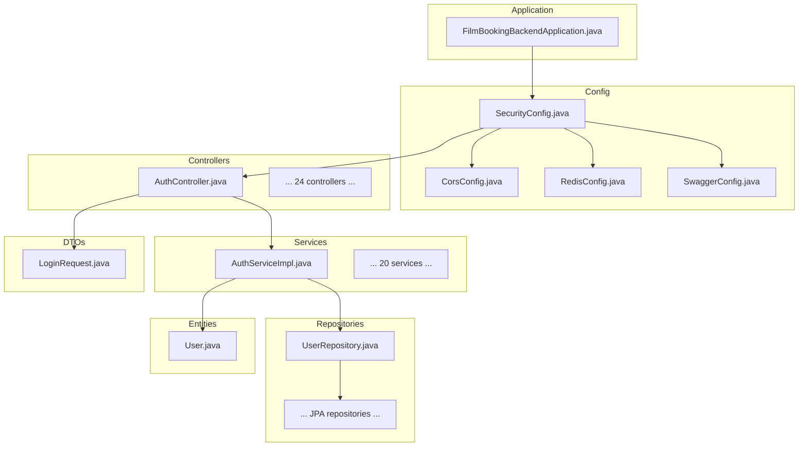

**Diagram sources**
- [FilmBookingBackendApplication.java:1-14](file://backend/src/main/java/com/cinema/booking/FilmBookingBackendApplication.java#L1-L14)
- [SecurityConfig.java:1-82](file://backend/src/main/java/com/cinema/booking/config/SecurityConfig.java#L1-L82)
- [CorsConfig.java:1-39](file://backend/src/main/java/com/cinema/booking/config/CorsConfig.java#L1-L39)
- [RedisConfig.java:1-55](file://backend/src/main/java/com/cinema/booking/config/RedisConfig.java#L1-L55)
- [SwaggerConfig.java:1-37](file://backend/src/main/java/com/cinema/booking/config/SwaggerConfig.java#L1-L37)
- [AuthController.java:1-54](file://backend/src/main/java/com/cinema/booking/controllers/AuthController.java#L1-L54)
- [AuthServiceImpl.java:1-139](file://backend/src/main/java/com/cinema/booking/services/impl/AuthServiceImpl.java#L1-L139)
- [UserRepository.java:1-16](file://backend/src/main/java/com/cinema/booking/repositories/UserRepository.java#L1-L16)
- [User.java:1-38](file://backend/src/main/java/com/cinema/booking/entities/User.java#L1-L38)
- [LoginRequest.java:1-14](file://backend/src/main/java/com/cinema/booking/dtos/LoginRequest.java#L1-L14)

**Section sources**
- [FilmBookingBackendApplication.java:1-14](file://backend/src/main/java/com/cinema/booking/FilmBookingBackendApplication.java#L1-L14)
- [pom.xml:1-108](file://backend/pom.xml#L1-L108)
- [application.properties:1-97](file://backend/src/main/resources/application.properties#L1-L97)

## Core Components
- Layered architecture:
  - Controller layer: REST endpoints exposed via @RestController classes under controllers/.
  - Service layer: Business logic encapsulated in @Service classes under services/impl/.
  - Repository layer: Data access via Spring Data JPA repositories under repositories/.
- MVC pattern: Controllers handle HTTP requests, delegate to services, and return ResponseEntity. Services orchestrate domain operations and coordinate repositories. Repositories abstract persistence.
- Dependency injection: Spring manages components and injects dependencies via @Autowired.
- RESTful design: Resource-based URLs, appropriate HTTP methods, standardized responses, and DTOs for request/response.

Practical examples:
- Controller method: [AuthController.java:21-31](file://backend/src/main/java/com/cinema/booking/controllers/AuthController.java#L21-L31)
- Service implementation: [AuthServiceImpl.java:44-61](file://backend/src/main/java/com/cinema/booking/services/impl/AuthServiceImpl.java#L44-L61)
- Repository query: [UserRepository.java:10-15](file://backend/src/main/java/com/cinema/booking/repositories/UserRepository.java#L10-L15)

**Section sources**
- [AuthController.java:1-54](file://backend/src/main/java/com/cinema/booking/controllers/AuthController.java#L1-L54)
- [AuthServiceImpl.java:1-139](file://backend/src/main/java/com/cinema/booking/services/impl/AuthServiceImpl.java#L1-L139)
- [UserRepository.java:1-16](file://backend/src/main/java/com/cinema/booking/repositories/UserRepository.java#L1-L16)

## Architecture Overview
The backend enforces stateless JWT authentication, permissive CORS for development, and method-level security annotations. Controllers are grouped by domain (authentication, bookings, movies, rooms, seats, showtimes, tickets, users, vouchers, payments, locations, metadata, cloudinary, dashboard, file upload, FNBS). Services encapsulate business rules, and repositories provide CRUD and custom queries.

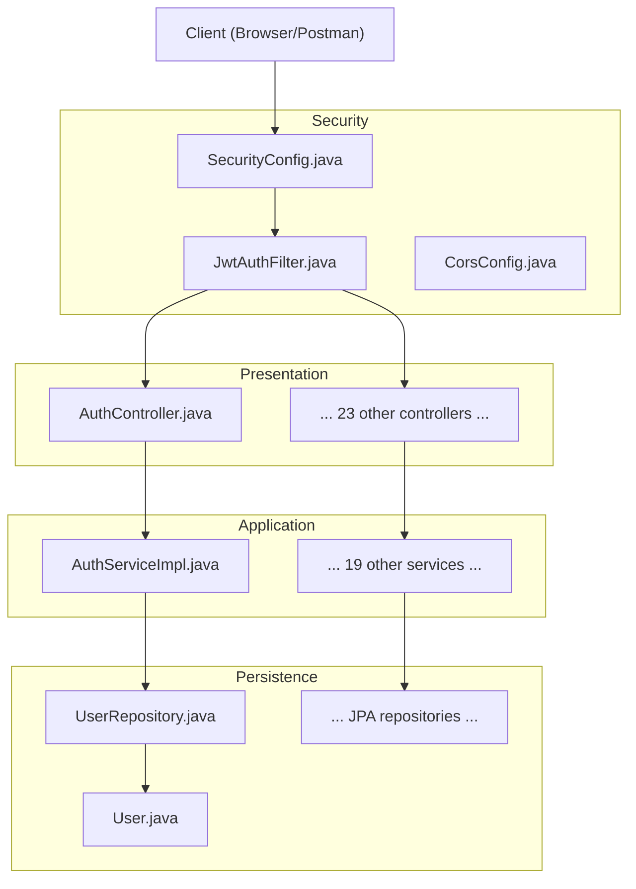

**Diagram sources**
- [JwtAuthFilter.java:1-64](file://backend/src/main/java/com/cinema/booking/security/JwtAuthFilter.java#L1-L64)
- [SecurityConfig.java:1-82](file://backend/src/main/java/com/cinema/booking/config/SecurityConfig.java#L1-L82)
- [CorsConfig.java:1-39](file://backend/src/main/java/com/cinema/booking/config/CorsConfig.java#L1-L39)
- [AuthController.java:1-54](file://backend/src/main/java/com/cinema/booking/controllers/AuthController.java#L1-L54)
- [AuthServiceImpl.java:1-139](file://backend/src/main/java/com/cinema/booking/services/impl/AuthServiceImpl.java#L1-L139)
- [UserRepository.java:1-16](file://backend/src/main/java/com/cinema/booking/repositories/UserRepository.java#L1-L16)
- [User.java:1-38](file://backend/src/main/java/com/cinema/booking/entities/User.java#L1-L38)

## Detailed Component Analysis

### Security Configuration and JWT Authentication
- SecurityConfig:
  - Disables CSRF, enables CORS, sets stateless sessions, and defines permitAll and role-based rules for specific endpoints.
  - Registers JwtAuthFilter before UsernamePasswordAuthenticationFilter.
- JwtAuthFilter:
  - Extracts Bearer token from Authorization header.
  - Validates token and loads UserDetails to set Authentication in SecurityContext.
- Roles and RBAC:
  - Uses @PreAuthorize annotations implicitly via method security enabling.
  - Admin-only endpoints require ADMIN or STAFF roles.

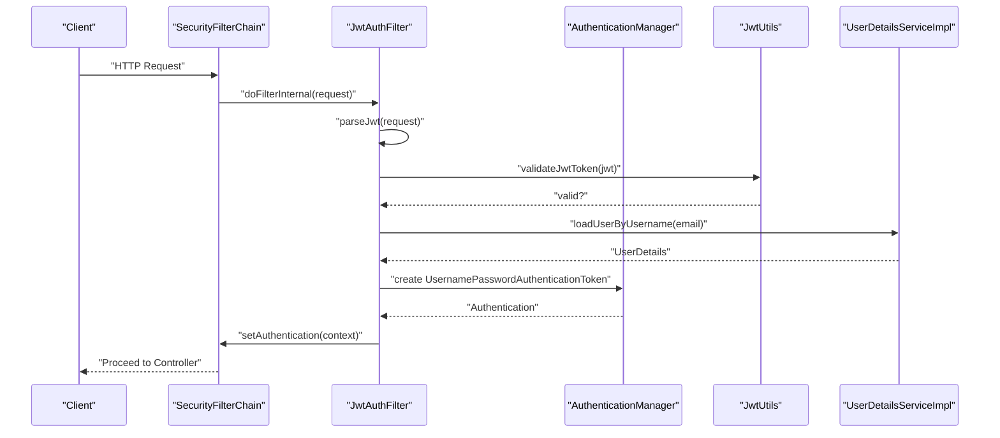

**Diagram sources**
- [SecurityConfig.java:50-79](file://backend/src/main/java/com/cinema/booking/config/SecurityConfig.java#L50-L79)
- [JwtAuthFilter.java:27-51](file://backend/src/main/java/com/cinema/booking/security/JwtAuthFilter.java#L27-L51)

**Section sources**
- [SecurityConfig.java:1-82](file://backend/src/main/java/com/cinema/booking/config/SecurityConfig.java#L1-L82)
- [JwtAuthFilter.java:1-64](file://backend/src/main/java/com/cinema/booking/security/JwtAuthFilter.java#L1-L64)

### CORS Setup
- CorsConfig defines allowed origins (configured frontend URL plus localhost patterns), methods, headers, credentials, and preflight cache duration.

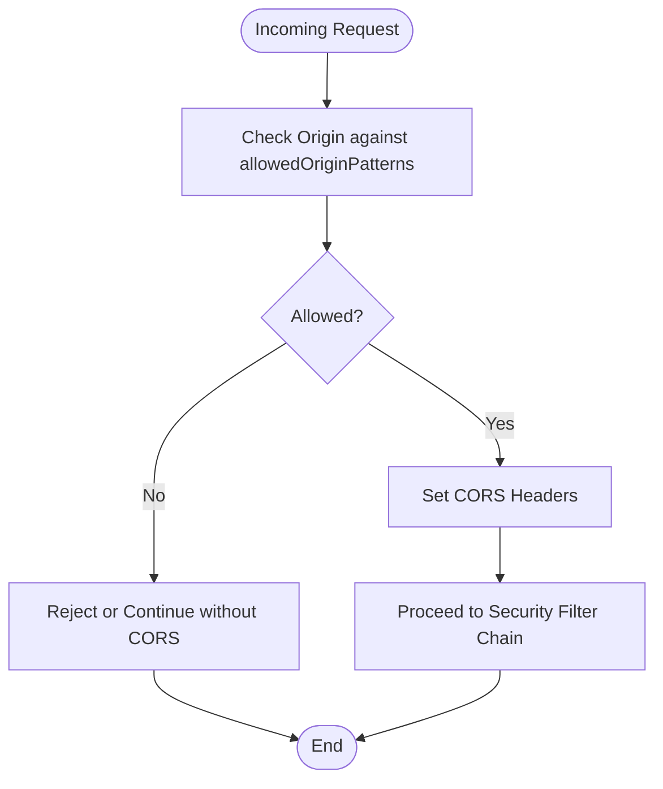

**Diagram sources**
- [CorsConfig.java:18-36](file://backend/src/main/java/com/cinema/booking/config/CorsConfig.java#L18-L36)

**Section sources**
- [CorsConfig.java:1-39](file://backend/src/main/java/com/cinema/booking/config/CorsConfig.java#L1-L39)

### Redis Integration for Caching
- RedisConfig configures Lettuce connection factory and Jackson JSON serializer for RedisTemplate to support caching and seat locking.

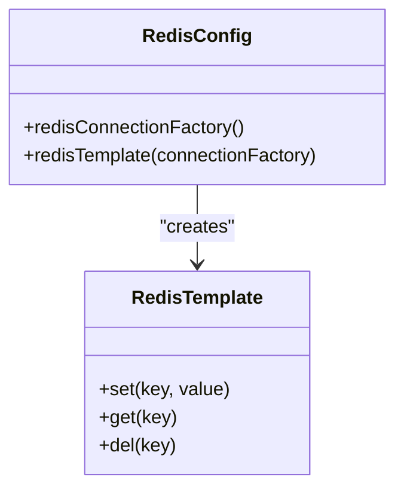

**Diagram sources**
- [RedisConfig.java:31-53](file://backend/src/main/java/com/cinema/booking/config/RedisConfig.java#L31-L53)

**Section sources**
- [RedisConfig.java:1-55](file://backend/src/main/java/com/cinema/booking/config/RedisConfig.java#L1-L55)

### Swagger/OpenAPI Documentation
- SwaggerConfig registers bearer token security scheme and info for API documentation.

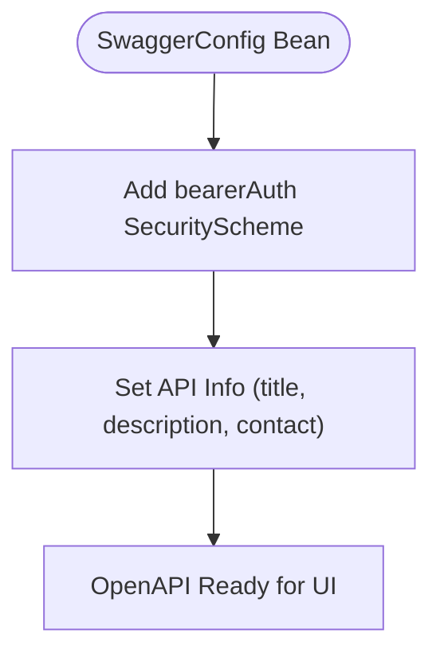

**Diagram sources**
- [SwaggerConfig.java:17-35](file://backend/src/main/java/com/cinema/booking/config/SwaggerConfig.java#L17-L35)

**Section sources**
- [SwaggerConfig.java:1-37](file://backend/src/main/java/com/cinema/booking/config/SwaggerConfig.java#L1-L37)

### Authentication Controller and Service
- AuthController:
  - Exposes /api/auth/login, /api/auth/register, and /api/auth/google-login.
  - Returns ResponseEntity with JwtResponse or MessageResponse.
- AuthServiceImpl:
  - Authenticates via AuthenticationManager, generates JWT via JwtUtils, and builds JwtResponse with roles.
  - Handles user registration with password encoding and welcome email.
  - Implements Google login with GoogleIdToken verification and dynamic account creation.

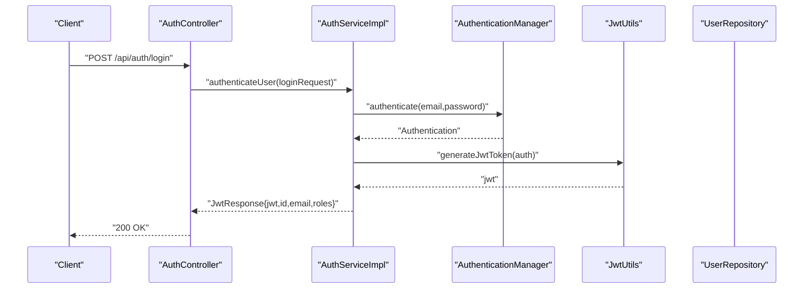

**Diagram sources**
- [AuthController.java:21-31](file://backend/src/main/java/com/cinema/booking/controllers/AuthController.java#L21-L31)
- [AuthServiceImpl.java:44-61](file://backend/src/main/java/com/cinema/booking/services/impl/AuthServiceImpl.java#L44-L61)

**Section sources**
- [AuthController.java:1-54](file://backend/src/main/java/com/cinema/booking/controllers/AuthController.java#L1-L54)
- [AuthServiceImpl.java:1-139](file://backend/src/main/java/com/cinema/booking/services/impl/AuthServiceImpl.java#L1-L139)
- [UserRepository.java:1-16](file://backend/src/main/java/com/cinema/booking/repositories/UserRepository.java#L1-L16)
- [User.java:1-38](file://backend/src/main/java/com/cinema/booking/entities/User.java#L1-L38)
- [LoginRequest.java:1-14](file://backend/src/main/java/com/cinema/booking/dtos/LoginRequest.java#L1-L14)

### Repository Pattern and JPA
- UserRepository demonstrates Spring Data JPA with custom methods for existence checks and lookup by phone.
- Entities like User define inheritance and relationships used by repositories.

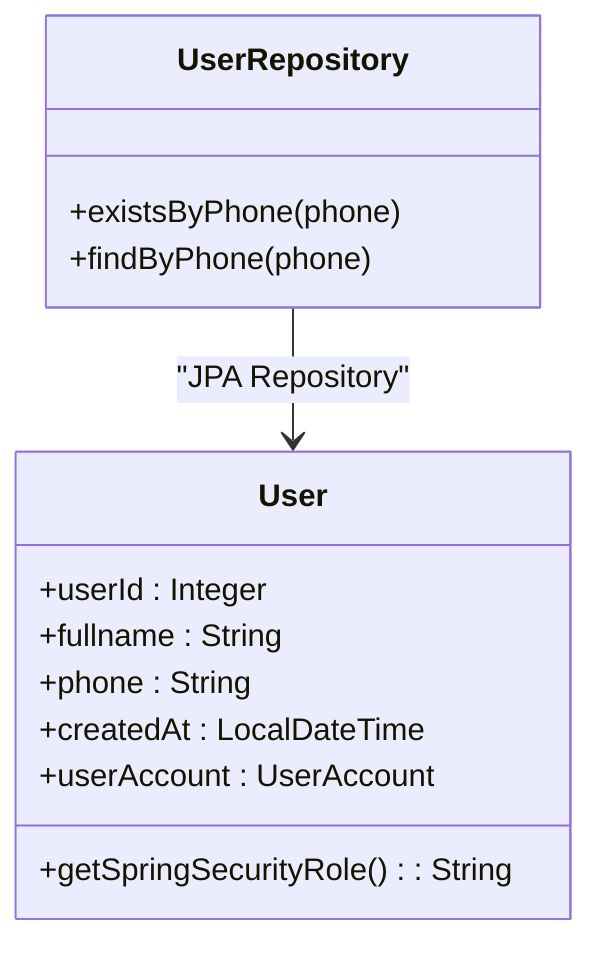

**Diagram sources**
- [UserRepository.java:10-15](file://backend/src/main/java/com/cinema/booking/repositories/UserRepository.java#L10-L15)
- [User.java:13-36](file://backend/src/main/java/com/cinema/booking/entities/User.java#L13-L36)

**Section sources**
- [UserRepository.java:1-16](file://backend/src/main/java/com/cinema/booking/repositories/UserRepository.java#L1-L16)
- [User.java:1-38](file://backend/src/main/java/com/cinema/booking/entities/User.java#L1-L38)

### Configuration Management
- application.properties centralizes:
  - Database connection and Hibernate dialect/formatting.
  - Frontend URL for CORS.
  - JWT secret and expiration.
  - Cloudinary image upload limits and credentials.
  - Redis host/port/credentials/TTL.
  - MoMo payment endpoints and keys.
  - Dynamic pricing engine parameters.
  - Mail server settings for email notifications.

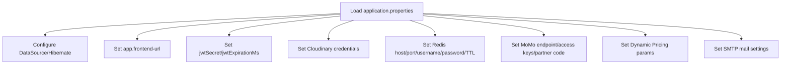

**Diagram sources**
- [application.properties:1-97](file://backend/src/main/resources/application.properties#L1-L97)

**Section sources**
- [application.properties:1-97](file://backend/src/main/resources/application.properties#L1-L97)

### Dependency Injection and Spring Boot
- FilmBookingBackendApplication is the Spring Boot entry point.
- Dependencies declared in pom.xml include Spring Web, Security, Data JPA, Redis, Mail, Swagger, JWT, Cloudinary, and testing libraries.

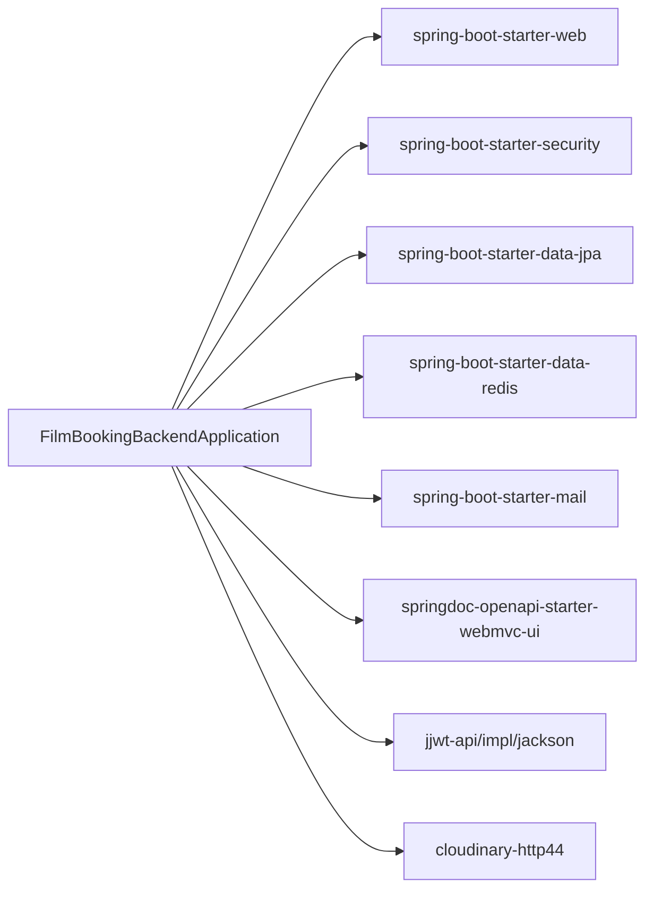

**Diagram sources**
- [FilmBookingBackendApplication.java:1-14](file://backend/src/main/java/com/cinema/booking/FilmBookingBackendApplication.java#L1-L14)
- [pom.xml:18-89](file://backend/pom.xml#L18-L89)

**Section sources**
- [FilmBookingBackendApplication.java:1-14](file://backend/src/main/java/com/cinema/booking/FilmBookingBackendApplication.java#L1-L14)
- [pom.xml:1-108](file://backend/pom.xml#L1-L108)

## Dependency Analysis
- External dependencies:
  - Spring Security for authentication and authorization.
  - Spring Data JPA for ORM and repositories.
  - Redis for caching and seat locking.
  - JWT for stateless authentication.
  - Cloudinary for image uploads.
  - Swagger for API documentation.
  - Mail for email notifications.
- Internal dependencies:
  - Controllers depend on Services.
  - Services depend on Repositories and external integrations (JWT, Redis, Mail, Cloudinary).
  - Repositories depend on JPA/Hibernate and database connectivity.

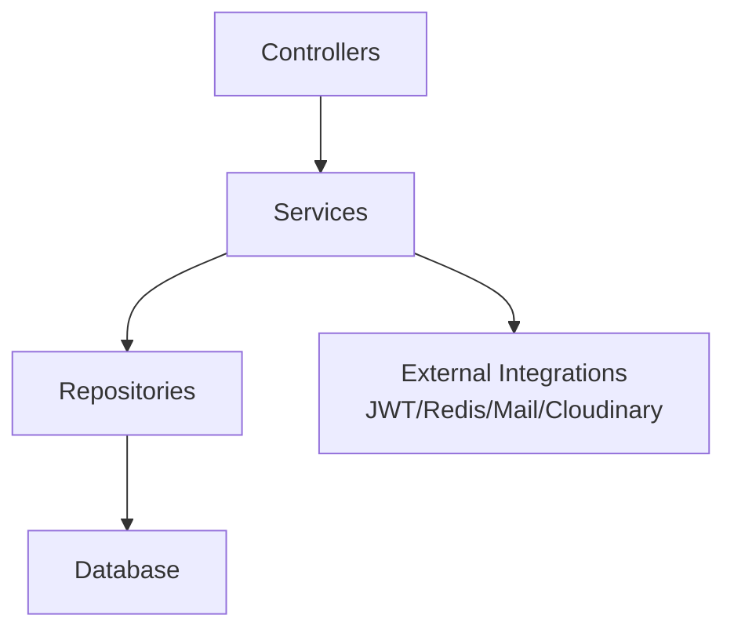

[No sources needed since this diagram shows conceptual relationships]

**Section sources**
- [pom.xml:18-89](file://backend/pom.xml#L18-L89)

## Performance Considerations
- Enable SQL logging during development for debugging but disable in production for performance.
- Use Redis TTL appropriately to avoid memory pressure.
- Limit file upload sizes as configured to prevent resource exhaustion.
- Leverage method-level security to minimize unnecessary processing for unauthenticated requests.
- Use pagination and projections for large datasets in repositories.

[No sources needed since this section provides general guidance]

## Troubleshooting Guide
- CORS errors:
  - Verify app.frontend-url matches client origin and allowedOriginPatterns.
- JWT authentication failures:
  - Confirm Authorization header format ("Bearer <token>") and token validity.
  - Check jwtSecret and expiration settings.
- Database connectivity:
  - Validate DB_URL, DB_USERNAME, DB_PASSWORD and driver configuration.
- Redis connectivity:
  - Confirm host, port, username, password, and TTL settings.
- MoMo payment callbacks:
  - Ensure endpoint URLs and keys match environment variables.
- Swagger UI:
  - Access /swagger-ui/index.html and apply bearer token for secured endpoints.

**Section sources**
- [CorsConfig.java:15-36](file://backend/src/main/java/com/cinema/booking/config/CorsConfig.java#L15-L36)
- [JwtAuthFilter.java:53-62](file://backend/src/main/java/com/cinema/booking/security/JwtAuthFilter.java#L53-L62)
- [application.properties:8-76](file://backend/src/main/resources/application.properties#L8-L76)
- [SwaggerConfig.java:13-35](file://backend/src/main/java/com/cinema/booking/config/SwaggerConfig.java#L13-L35)

## Conclusion
The backend implements a clean layered architecture with explicit separation between controllers, services, and repositories. Security is enforced via JWT with method-level RBAC, CORS is configurable for development, and Redis is integrated for caching. Swagger documents the APIs, while application.properties centralizes configuration. The design supports scalability and maintainability through Spring’s dependency injection and established patterns.

[No sources needed since this section summarizes without analyzing specific files]

## Appendices
- Controllers overview:
  - Authentication: [AuthController.java:1-54](file://backend/src/main/java/com/cinema/booking/controllers/AuthController.java#L1-L54)
  - Additional controllers include: BookingController, BookingFnbController, CinemaController, CloudinaryController, DashboardController, FileUploadController, FnbController, LocationController, MetadataController, MovieController, MovieGenreController, PaymentController, PublicController, RoomController, SeatController, ShowtimeController, TicketController, UserController, VoucherController.
- Services overview:
  - Authentication: [AuthServiceImpl.java:1-139](file://backend/src/main/java/com/cinema/booking/services/impl/AuthServiceImpl.java#L1-L139)
  - Additional services include: BookingService, BookingFnbService, CheckoutService, CinemaService, CloudinaryService, EmailService, FileUploadService, FnbItemInventoryService, LocationService, MomoService, MovieService, PaymentService, PromotionInventoryService, RoomService, SeatService, ShowtimeService, TicketService, UserService, VoucherService.
- Repositories overview:
  - Example: [UserRepository.java:1-16](file://backend/src/main/java/com/cinema/booking/repositories/UserRepository.java#L1-L16)
  - Full set includes: ArtistRepository, BookingRepository, CastMemberRepository, CinemaRepository, CustomerRepository, FnBLineRepository, FnbCategoryRepository, FnbItemInventoryRepository, FnbItemRepository, GenreRepository, LocationRepository, MovieCastRepository, MovieGenreRepository, MovieRepository, PaymentRepository, PromotionInventoryRepository, PromotionRepository, RoomRepository, SeatRepository, SeatTypeRepository, ShowtimeRepository, TicketRepository, UserAccountRepository, UserRepository.

[No sources needed since this section lists references without analyzing specific files]