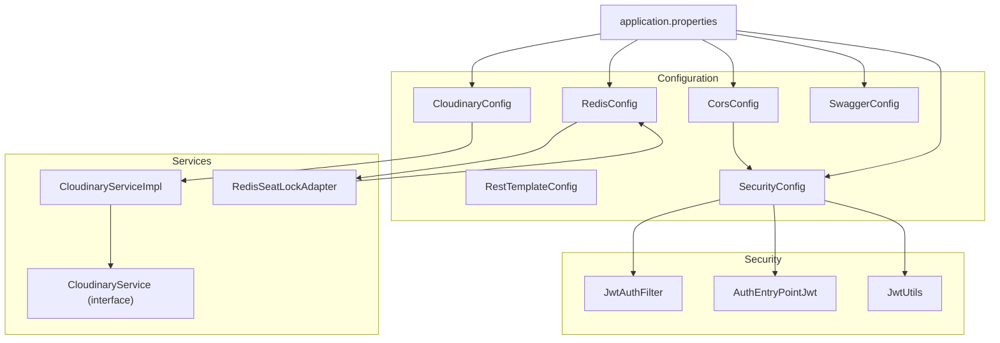
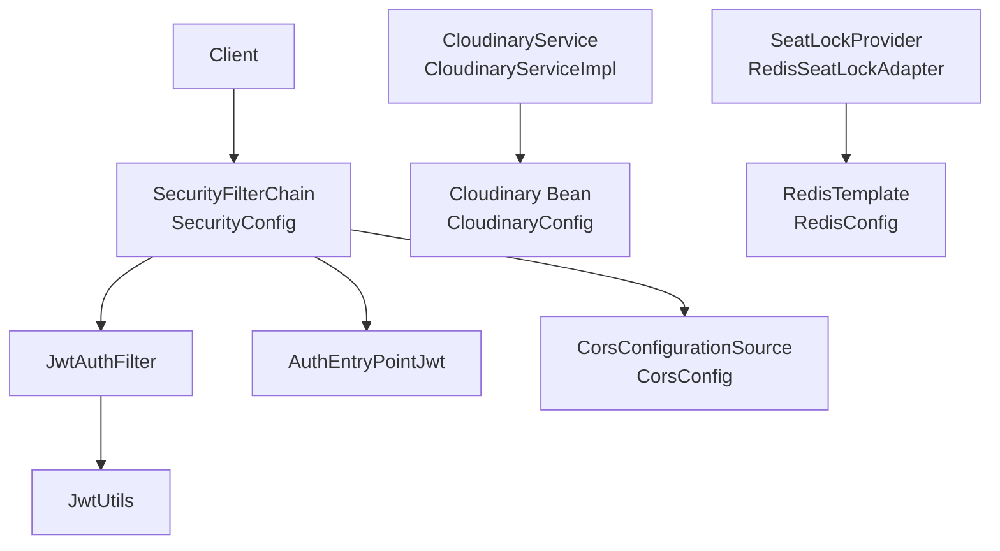
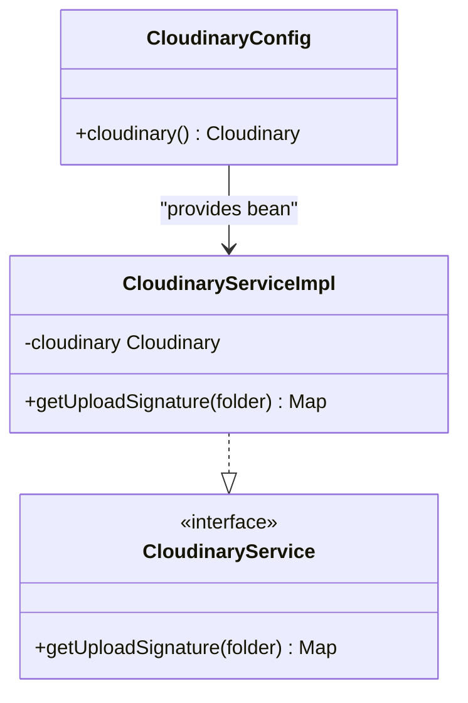
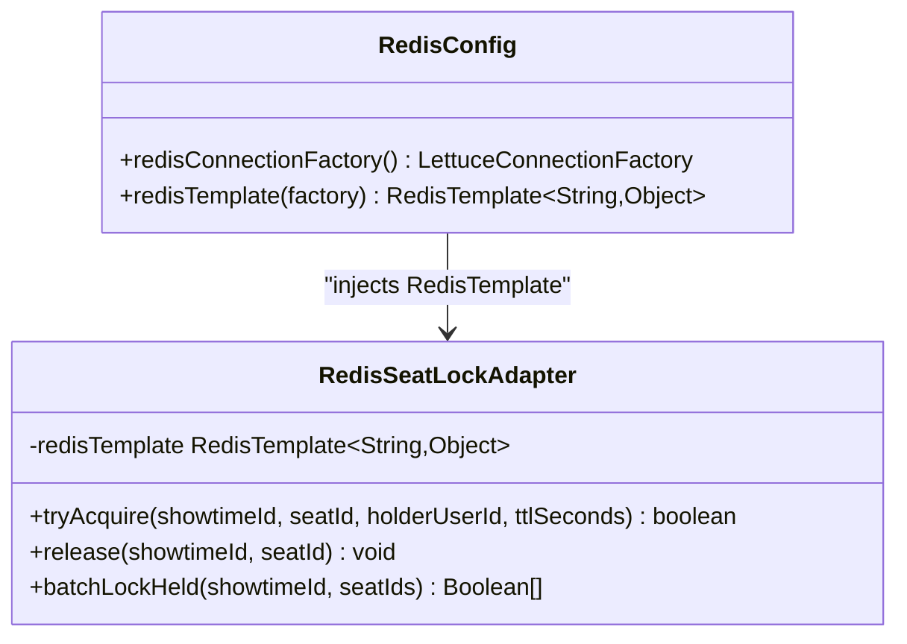
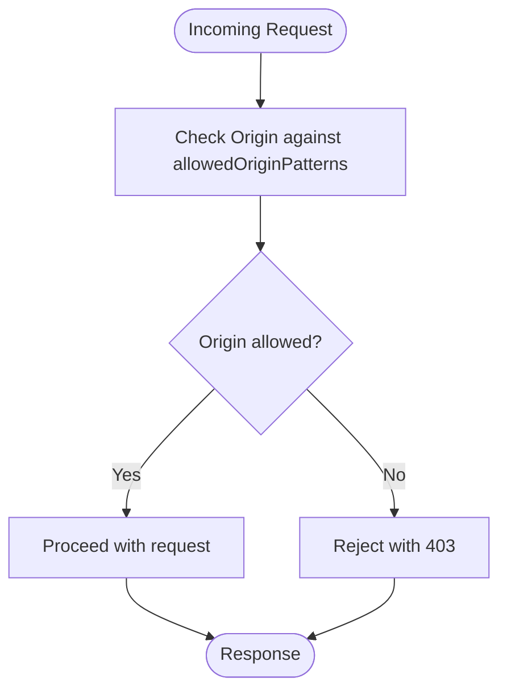
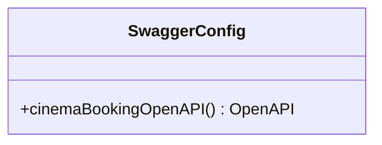
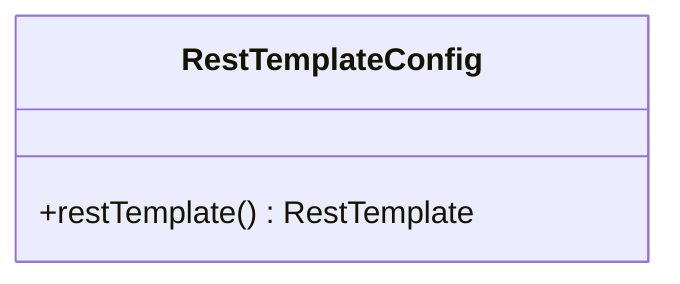
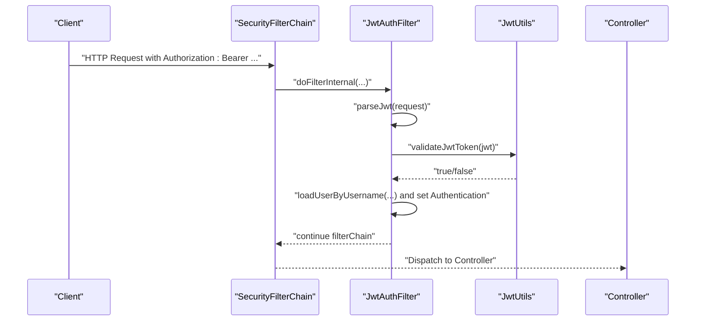
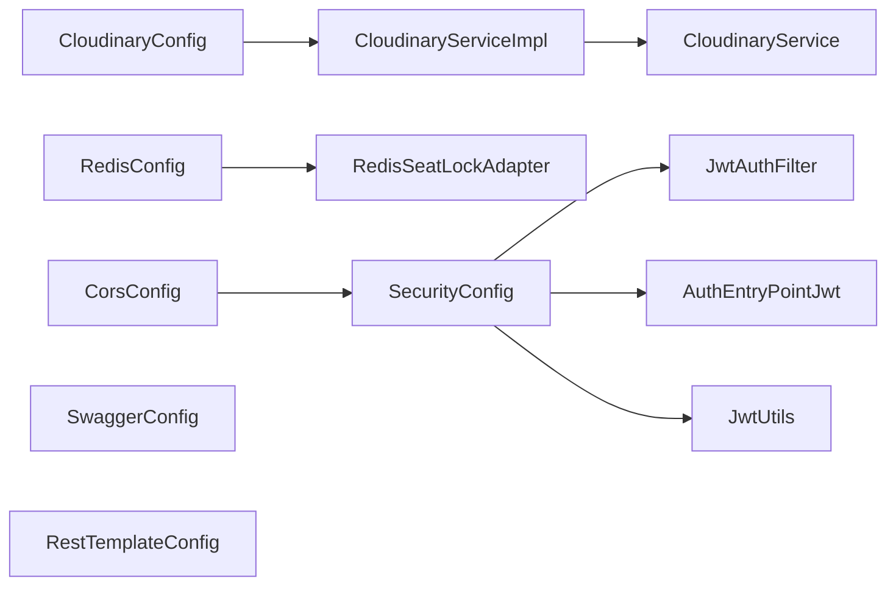

# Configuration and Services

<cite>
**Referenced Files in This Document**
- [CloudinaryConfig.java](file://backend/src/main/java/com/cinema/booking/config/CloudinaryConfig.java)
- [RedisConfig.java](file://backend/src/main/java/com/cinema/booking/config/RedisConfig.java)
- [CorsConfig.java](file://backend/src/main/java/com/cinema/booking/config/CorsConfig.java)
- [RestTemplateConfig.java](file://backend/src/main/java/com/cinema/booking/config/RestTemplateConfig.java)
- [SwaggerConfig.java](file://backend/src/main/java/com/cinema/booking/config/SwaggerConfig.java)
- [SecurityConfig.java](file://backend/src/main/java/com/cinema/booking/config/SecurityConfig.java)
- [application.properties](file://backend/src/main/resources/application.properties)
- [CloudinaryService.java](file://backend/src/main/java/com/cinema/booking/services/CloudinaryService.java)
- [CloudinaryServiceImpl.java](file://backend/src/main/java/com/cinema/booking/services/impl/CloudinaryServiceImpl.java)
- [RedisSeatLockAdapter.java](file://backend/src/main/java/com/cinema/booking/services/seatlock/RedisSeatLockAdapter.java)
- [JwtAuthFilter.java](file://backend/src/main/java/com/cinema/booking/security/JwtAuthFilter.java)
- [AuthEntryPointJwt.java](file://backend/src/main/java/com/cinema/booking/security/AuthEntryPointJwt.java)
- [JwtUtils.java](file://backend/src/main/java/com/cinema/booking/security/JwtUtils.java)
</cite>

## Table of Contents
1. [Introduction](#introduction)
2. [Project Structure](#project-structure)
3. [Core Components](#core-components)
4. [Architecture Overview](#architecture-overview)
5. [Detailed Component Analysis](#detailed-component-analysis)
6. [Dependency Analysis](#dependency-analysis)
7. [Performance Considerations](#performance-considerations)
8. [Troubleshooting Guide](#troubleshooting-guide)
9. [Conclusion](#conclusion)
10. [Appendices](#appendices)

## Introduction
This document explains the application’s configuration classes and external service integrations. It covers:
- Cloudinary configuration for image upload and signature generation
- Redis configuration for caching and seat locking
- CORS configuration for cross-origin requests
- Swagger/OpenAPI configuration for API documentation
- RestTemplate configuration for HTTP client services
- Security configuration aspects including JWT authentication and authorization
It also provides practical examples of configuration properties, bean definitions, service registration, environment-specific configurations, property overrides, validation, best practices, security considerations, and testing strategies.

## Project Structure
The configuration and services are organized under the backend module:
- Configuration classes reside in the config package
- Application-wide properties live in application.properties
- External service integrations are exposed via interfaces and implementations
- Security components are under the security package

**Diagram sources**
- [CloudinaryConfig.java:1-33](file://backend/src/main/java/com/cinema/booking/config/CloudinaryConfig.java#L1-L33)
- [RedisConfig.java:1-55](file://backend/src/main/java/com/cinema/booking/config/RedisConfig.java#L1-L55)
- [CorsConfig.java:1-39](file://backend/src/main/java/com/cinema/booking/config/CorsConfig.java#L1-L39)
- [RestTemplateConfig.java:1-19](file://backend/src/main/java/com/cinema/booking/config/RestTemplateConfig.java#L1-L19)
- [SwaggerConfig.java:1-37](file://backend/src/main/java/com/cinema/booking/config/SwaggerConfig.java#L1-L37)
- [SecurityConfig.java:1-82](file://backend/src/main/java/com/cinema/booking/config/SecurityConfig.java#L1-L82)
- [application.properties:1-97](file://backend/src/main/resources/application.properties#L1-L97)
- [CloudinaryService.java:1-8](file://backend/src/main/java/com/cinema/booking/services/CloudinaryService.java#L1-L8)
- [CloudinaryServiceImpl.java:1-50](file://backend/src/main/java/com/cinema/booking/services/impl/CloudinaryServiceImpl.java#L1-L50)
- [RedisSeatLockAdapter.java:1-56](file://backend/src/main/java/com/cinema/booking/services/seatlock/RedisSeatLockAdapter.java#L1-L56)
- [JwtAuthFilter.java:1-64](file://backend/src/main/java/com/cinema/booking/security/JwtAuthFilter.java#L1-L64)
- [AuthEntryPointJwt.java:1-39](file://backend/src/main/java/com/cinema/booking/security/AuthEntryPointJwt.java#L1-L39)
- [JwtUtils.java:1-71](file://backend/src/main/java/com/cinema/booking/security/JwtUtils.java#L1-L71)

**Section sources**
- [application.properties:1-97](file://backend/src/main/resources/application.properties#L1-L97)

## Core Components
- Cloudinary configuration: Provides a Cloudinary bean using properties from application.properties and exposes a service to generate upload signatures.
- Redis configuration: Configures Lettuce connection and a typed RedisTemplate with JSON serialization for caching and seat locking.
- CORS configuration: Defines allowed origins, methods, headers, credentials, and preflight caching.
- Swagger/OpenAPI configuration: Declares bearer JWT security scheme and API metadata for interactive documentation.
- RestTemplate configuration: Registers a singleton RestTemplate bean for HTTP clients.
- Security configuration: Enables stateless sessions, disables CSRF, integrates CORS, sets up JWT filter chain, and defines role-based authorization.

**Section sources**
- [CloudinaryConfig.java:1-33](file://backend/src/main/java/com/cinema/booking/config/CloudinaryConfig.java#L1-L33)
- [RedisConfig.java:1-55](file://backend/src/main/java/com/cinema/booking/config/RedisConfig.java#L1-L55)
- [CorsConfig.java:1-39](file://backend/src/main/java/com/cinema/booking/config/CorsConfig.java#L1-L39)
- [SwaggerConfig.java:1-37](file://backend/src/main/java/com/cinema/booking/config/SwaggerConfig.java#L1-L37)
- [RestTemplateConfig.java:1-19](file://backend/src/main/java/com/cinema/booking/config/RestTemplateConfig.java#L1-L19)
- [SecurityConfig.java:1-82](file://backend/src/main/java/com/cinema/booking/config/SecurityConfig.java#L1-L82)

## Architecture Overview
The configuration classes integrate with Spring Boot’s autoconfiguration and external services. The security filter chain intercepts requests to enforce JWT validation and authorization. Redis and Cloudinary are wired via Spring-managed beans and used by services.

**Diagram sources**
- [SecurityConfig.java:50-79](file://backend/src/main/java/com/cinema/booking/config/SecurityConfig.java#L50-L79)
- [JwtAuthFilter.java:27-51](file://backend/src/main/java/com/cinema/booking/security/JwtAuthFilter.java#L27-L51)
- [JwtUtils.java:55-69](file://backend/src/main/java/com/cinema/booking/security/JwtUtils.java#L55-L69)
- [AuthEntryPointJwt.java:22-36](file://backend/src/main/java/com/cinema/booking/security/AuthEntryPointJwt.java#L22-L36)
- [CorsConfig.java:18-36](file://backend/src/main/java/com/cinema/booking/config/CorsConfig.java#L18-L36)
- [CloudinaryConfig.java:23-31](file://backend/src/main/java/com/cinema/booking/config/CloudinaryConfig.java#L23-L31)
- [RedisConfig.java:31-53](file://backend/src/main/java/com/cinema/booking/config/RedisConfig.java#L31-L53)
- [CloudinaryServiceImpl.java:13-48](file://backend/src/main/java/com/cinema/booking/services/impl/CloudinaryServiceImpl.java#L13-L48)
- [RedisSeatLockAdapter.java:14-54](file://backend/src/main/java/com/cinema/booking/services/seatlock/RedisSeatLockAdapter.java#L14-L54)

## Detailed Component Analysis

### Cloudinary Configuration
- Purpose: Provide a Cloudinary bean and enable client-side signed uploads.
- Properties:
  - cloudinary.cloud_name
  - cloudinary.api_key
  - cloudinary.api_secret
  - spring.servlet.multipart.max-file-size
  - spring.servlet.multipart.max-request-size
- Bean definition:
  - A Cloudinary bean is created using injected properties.
- Service integration:
  - CloudinaryService interface and CloudinaryServiceImpl implementation use the Cloudinary bean to compute upload signatures server-side and return them to the client.

**Diagram sources**
- [CloudinaryConfig.java:23-31](file://backend/src/main/java/com/cinema/booking/config/CloudinaryConfig.java#L23-L31)
- [CloudinaryService.java:5-7](file://backend/src/main/java/com/cinema/booking/services/CloudinaryService.java#L5-L7)
- [CloudinaryServiceImpl.java:13-48](file://backend/src/main/java/com/cinema/booking/services/impl/CloudinaryServiceImpl.java#L13-L48)

Practical examples:
- Property overrides: Set cloudinary.cloud_name, cloudinary.api_key, cloudinary.api_secret via environment variables or .env file.
- Service registration: CloudinaryServiceImpl is a Spring service and depends on the Cloudinary bean.

**Section sources**
- [CloudinaryConfig.java:1-33](file://backend/src/main/java/com/cinema/booking/config/CloudinaryConfig.java#L1-L33)
- [application.properties:54-56](file://backend/src/main/resources/application.properties#L54-L56)
- [application.properties:51-52](file://backend/src/main/resources/application.properties#L51-L52)
- [CloudinaryService.java:1-8](file://backend/src/main/java/com/cinema/booking/services/CloudinaryService.java#L1-L8)
- [CloudinaryServiceImpl.java:1-50](file://backend/src/main/java/com/cinema/booking/services/impl/CloudinaryServiceImpl.java#L1-L50)

### Redis Configuration
- Purpose: Configure Redis connection and a typed RedisTemplate for caching and seat locking.
- Properties:
  - spring.data.redis.host
  - spring.data.redis.port
  - spring.data.redis.username
  - spring.data.redis.password
  - cinema.app.redisTtlSeconds
- Beans:
  - LettuceConnectionFactory configured with host/port/credentials.
  - RedisTemplate with String key serializer and JSON value/hash serializers using Jackson.

**Diagram sources**
- [RedisConfig.java:31-53](file://backend/src/main/java/com/cinema/booking/config/RedisConfig.java#L31-L53)
- [RedisSeatLockAdapter.java:14-54](file://backend/src/main/java/com/cinema/booking/services/seatlock/RedisSeatLockAdapter.java#L14-L54)

Practical examples:
- Property overrides: Set spring.data.redis.host, spring.data.redis.port, spring.data.redis.username, spring.data.redis.password via environment variables.
- TTL usage: redisTtlSeconds controls seat lock expiration.

**Section sources**
- [RedisConfig.java:1-55](file://backend/src/main/java/com/cinema/booking/config/RedisConfig.java#L1-L55)
- [application.properties:61-65](file://backend/src/main/resources/application.properties#L61-L65)
- [RedisSeatLockAdapter.java:1-56](file://backend/src/main/java/com/cinema/booking/services/seatlock/RedisSeatLockAdapter.java#L1-L56)

### CORS Configuration
- Purpose: Allow cross-origin requests from the configured frontend origin plus typical development origins.
- Properties:
  - app.frontend-url
- Behavior:
  - Allowed origins include the configured URL and localhost patterns.
  - Credentials are allowed; preflight requests cached for 1 hour.

**Diagram sources**
- [CorsConfig.java:18-36](file://backend/src/main/java/com/cinema/booking/config/CorsConfig.java#L18-L36)

Practical examples:
- Property overrides: Set app.frontend-url to your production frontend URL.
- Development flexibility: Localhost patterns accommodate various dev servers.

**Section sources**
- [CorsConfig.java:1-39](file://backend/src/main/java/com/cinema/booking/config/CorsConfig.java#L1-L39)
- [application.properties](file://backend/src/main/resources/application.properties#L37)

### Swagger/OpenAPI Configuration
- Purpose: Expose interactive API documentation with bearer JWT security.
- Behavior:
  - Adds a bearerAuth security scheme named “bearerAuth”.
  - Sets API info including title, description, version, contact, and license.

**Diagram sources**
- [SwaggerConfig.java:17-35](file://backend/src/main/java/com/cinema/booking/config/SwaggerConfig.java#L17-L35)

Practical examples:
- Access: Navigate to the documented Swagger UI endpoint to explore APIs.
- Security: Requires a valid JWT in Authorization header.

**Section sources**
- [SwaggerConfig.java:1-37](file://backend/src/main/java/com/cinema/booking/config/SwaggerConfig.java#L1-L37)

### RestTemplate Configuration
- Purpose: Provide a singleton RestTemplate bean for outbound HTTP calls.
- Behavior:
  - Returns a default RestTemplate instance suitable for synchronous HTTP operations.

**Diagram sources**
- [RestTemplateConfig.java:14-17](file://backend/src/main/java/com/cinema/booking/config/RestTemplateConfig.java#L14-L17)

Practical examples:
- Usage: Inject RestTemplate into services that need to call external APIs.

**Section sources**
- [RestTemplateConfig.java:1-19](file://backend/src/main/java/com/cinema/booking/config/RestTemplateConfig.java#L1-L19)

### Security Configuration
- Purpose: Enforce JWT-based authentication and authorization with stateless sessions.
- Key aspects:
  - Stateless session policy
  - Disabled CSRF
  - CORS integration
  - JWT filter chain:
    - JwtAuthFilter extracts and validates JWT
    - JwtUtils performs signing and parsing
    - AuthEntryPointJwt handles unauthorized access
  - Authorization rules:
    - Public endpoints for auth and public resources
    - GET endpoints for discovery endpoints permitted
    - Payment callbacks/webhooks permitted
    - Swagger endpoints permitted
    - Admin/staff-only endpoints require roles ADMIN or STAFF
    - Other endpoints require authentication

**Diagram sources**
- [SecurityConfig.java:50-79](file://backend/src/main/java/com/cinema/booking/config/SecurityConfig.java#L50-L79)
- [JwtAuthFilter.java:27-51](file://backend/src/main/java/com/cinema/booking/security/JwtAuthFilter.java#L27-L51)
- [JwtUtils.java:55-69](file://backend/src/main/java/com/cinema/booking/security/JwtUtils.java#L55-L69)

Practical examples:
- Property overrides: Set cinema.app.jwtSecret and cinema.app.jwtExpirationMs via environment variables.
- Authorization: Use method-level annotations or controller-level matchers to restrict access.

**Section sources**
- [SecurityConfig.java:1-82](file://backend/src/main/java/com/cinema/booking/config/SecurityConfig.java#L1-L82)
- [JwtAuthFilter.java:1-64](file://backend/src/main/java/com/cinema/booking/security/JwtAuthFilter.java#L1-L64)
- [AuthEntryPointJwt.java:1-39](file://backend/src/main/java/com/cinema/booking/security/AuthEntryPointJwt.java#L1-L39)
- [JwtUtils.java:1-71](file://backend/src/main/java/com/cinema/booking/security/JwtUtils.java#L1-L71)
- [application.properties:45-46](file://backend/src/main/resources/application.properties#L45-L46)

## Dependency Analysis
- Cloudinary:
  - CloudinaryConfig provides a Cloudinary bean used by CloudinaryServiceImpl.
  - CloudinaryServiceImpl implements CloudinaryService.
- Redis:
  - RedisConfig provides LettuceConnectionFactory and RedisTemplate.
  - RedisSeatLockAdapter depends on RedisTemplate for seat locking.
- Security:
  - SecurityConfig depends on JwtAuthFilter, JwtUtils, and AuthEntryPointJwt.
  - JwtAuthFilter depends on JwtUtils and user details service.
- CORS:
  - SecurityConfig integrates CorsConfigurationSource from CorsConfig.
- Swagger:
  - SwaggerConfig does not depend on other configs; it registers OpenAPI bean.
- RestTemplate:
  - RestTemplateConfig registers a singleton RestTemplate bean.

**Diagram sources**
- [CloudinaryConfig.java:23-31](file://backend/src/main/java/com/cinema/booking/config/CloudinaryConfig.java#L23-L31)
- [CloudinaryServiceImpl.java:13-48](file://backend/src/main/java/com/cinema/booking/services/impl/CloudinaryServiceImpl.java#L13-L48)
- [RedisConfig.java:31-53](file://backend/src/main/java/com/cinema/booking/config/RedisConfig.java#L31-L53)
- [RedisSeatLockAdapter.java:14-54](file://backend/src/main/java/com/cinema/booking/services/seatlock/RedisSeatLockAdapter.java#L14-L54)
- [SecurityConfig.java:50-79](file://backend/src/main/java/com/cinema/booking/config/SecurityConfig.java#L50-L79)
- [JwtAuthFilter.java:18-25](file://backend/src/main/java/com/cinema/booking/security/JwtAuthFilter.java#L18-L25)
- [AuthEntryPointJwt.java:17-18](file://backend/src/main/java/com/cinema/booking/security/AuthEntryPointJwt.java#L17-L18)
- [JwtUtils.java:15-23](file://backend/src/main/java/com/cinema/booking/security/JwtUtils.java#L15-L23)
- [CorsConfig.java:18-36](file://backend/src/main/java/com/cinema/booking/config/CorsConfig.java#L18-L36)
- [SwaggerConfig.java:17-35](file://backend/src/main/java/com/cinema/booking/config/SwaggerConfig.java#L17-L35)
- [RestTemplateConfig.java:14-17](file://backend/src/main/java/com/cinema/booking/config/RestTemplateConfig.java#L14-L17)

**Section sources**
- [CloudinaryConfig.java:1-33](file://backend/src/main/java/com/cinema/booking/config/CloudinaryConfig.java#L1-L33)
- [RedisConfig.java:1-55](file://backend/src/main/java/com/cinema/booking/config/RedisConfig.java#L1-L55)
- [CorsConfig.java:1-39](file://backend/src/main/java/com/cinema/booking/config/CorsConfig.java#L1-L39)
- [RestTemplateConfig.java:1-19](file://backend/src/main/java/com/cinema/booking/config/RestTemplateConfig.java#L1-L19)
- [SwaggerConfig.java:1-37](file://backend/src/main/java/com/cinema/booking/config/SwaggerConfig.java#L1-L37)
- [SecurityConfig.java:1-82](file://backend/src/main/java/com/cinema/booking/config/SecurityConfig.java#L1-L82)
- [CloudinaryServiceImpl.java:1-50](file://backend/src/main/java/com/cinema/booking/services/impl/CloudinaryServiceImpl.java#L1-L50)
- [RedisSeatLockAdapter.java:1-56](file://backend/src/main/java/com/cinema/booking/services/seatlock/RedisSeatLockAdapter.java#L1-L56)
- [JwtAuthFilter.java:1-64](file://backend/src/main/java/com/cinema/booking/security/JwtAuthFilter.java#L1-L64)
- [AuthEntryPointJwt.java:1-39](file://backend/src/main/java/com/cinema/booking/security/AuthEntryPointJwt.java#L1-L39)
- [JwtUtils.java:1-71](file://backend/src/main/java/com/cinema/booking/security/JwtUtils.java#L1-L71)

## Performance Considerations
- Redis:
  - Use JSON serialization for complex objects stored in RedisTemplate to reduce conversion overhead.
  - Choose appropriate TTL values to balance seat lock fairness and memory usage.
- Cloudinary:
  - Keep multipart limits reasonable to prevent large payload consumption.
  - Generate signatures server-side to avoid exposing secrets on the client.
- Security:
  - Stateless sessions reduce server-side state but require robust JWT handling.
  - Minimize per-request validations by leveraging method-level security judiciously.
- CORS:
  - Limit allowed origins and headers to reduce preflight complexity.

[No sources needed since this section provides general guidance]

## Troubleshooting Guide
- Cloudinary:
  - Verify cloudinary.cloud_name, cloudinary.api_key, cloudinary.api_secret are set and correct.
  - Ensure multipart limits are sufficient for uploads.
- Redis:
  - Confirm host, port, username, and password are correct.
  - Check TTL values and network connectivity.
- CORS:
  - Ensure app.frontend-url matches the origin making requests.
  - Confirm allowed methods/headers align with client requests.
- Security:
  - Validate JWT secret and expiration settings.
  - Check that AuthEntryPointJwt returns appropriate 401 responses.
- Swagger:
  - Confirm bearerAuth security scheme is present and accessible.

**Section sources**
- [application.properties:54-56](file://backend/src/main/resources/application.properties#L54-L56)
- [application.properties:61-65](file://backend/src/main/resources/application.properties#L61-L65)
- [application.properties](file://backend/src/main/resources/application.properties#L37)
- [application.properties:45-46](file://backend/src/main/resources/application.properties#L45-L46)
- [AuthEntryPointJwt.java:22-36](file://backend/src/main/java/com/cinema/booking/security/AuthEntryPointJwt.java#L22-L36)

## Conclusion
The configuration classes establish a robust foundation for external integrations and security:
- Cloudinary and Redis are configured via Spring beans and consumed by services.
- CORS and Swagger enhance developer experience and cross-origin support.
- Security is enforced with JWT-based authentication and authorization, integrated with CORS and stateless sessions.
Adhering to environment-specific property overrides, validation, and best practices ensures reliable operation across environments.

[No sources needed since this section summarizes without analyzing specific files]

## Appendices

### Environment-Specific Configuration and Property Overrides
- Import order and precedence:
  - application.properties imports an optional .env file for environment variables.
- Example overrides:
  - Database: DB_URL, DB_USERNAME, DB_PASSWORD
  - Frontend URL: FRONTEND_URL
  - JWT: JWT_SECRET
  - Cloudinary: CLOUDINARY_CLOUD_NAME, CLOUDINARY_API_KEY, CLOUDINARY_API_SECRET
  - Redis: REDIS_HOST, REDIS_PORT, REDIS_USERNAME, REDIS_PASSWORD, REDIS_TTL_SECONDS
  - Momo: DEV_MOMO_ENDPOINT, DEV_ACCESS_KEY, DEV_PARTNER_CODE, DEV_SECRET_KEY, MOMO_RETURN_URL, MOMO_NOTIFY_URL, MOMO_DEV_PAYMENT_OPTION_ALL_PAYMENT_SUCCESS
  - Dynamic pricing: cinema.pricing.* properties
  - Mail: spring.mail.* properties

**Section sources**
- [application.properties](file://backend/src/main/resources/application.properties#L3)
- [application.properties:8-10](file://backend/src/main/resources/application.properties#L8-L10)
- [application.properties](file://backend/src/main/resources/application.properties#L37)
- [application.properties](file://backend/src/main/resources/application.properties#L45)
- [application.properties:54-56](file://backend/src/main/resources/application.properties#L54-L56)
- [application.properties:61-65](file://backend/src/main/resources/application.properties#L61-L65)
- [application.properties:70-76](file://backend/src/main/resources/application.properties#L70-L76)
- [application.properties:81-86](file://backend/src/main/resources/application.properties#L81-L86)
- [application.properties:91-96](file://backend/src/main/resources/application.properties#L91-L96)

### Configuration Validation Checklist
- Cloudinary:
  - Properties present and non-empty
  - Multipart limits adequate
- Redis:
  - Connection parameters valid
  - TTL configured appropriately
- CORS:
  - Allowed origins include production and dev origins
  - Methods and headers aligned with client needs
- Security:
  - JWT secret and expiration set
  - AuthEntryPointJwt configured
  - Authorization rules match intended access control
- Swagger:
  - OpenAPI bean registered
  - Security scheme present

[No sources needed since this section provides general guidance]

### Testing Strategies
- Unit tests for services using configuration beans:
  - Mock Cloudinary bean for signature generation tests
  - Mock RedisTemplate for seat lock adapter tests
- Integration tests:
  - Verify CORS behavior across origins
  - Validate JWT filter chain and unauthorized responses
- Property override tests:
  - Run with environment variables set to different values and confirm runtime behavior changes

[No sources needed since this section provides general guidance]