# Admin, Staff, and Public Controller

<cite>
**Referenced Files in This Document**
- [PublicController.java](file://backend/src/main/java/com/cinema/booking/controllers/PublicController.java)
- [MovieController.java](file://backend/src/main/java/com/cinema/booking/controllers/MovieController.java)
- [ShowtimeController.java](file://backend/src/main/java/com/cinema/booking/controllers/ShowtimeController.java)
- [DashboardController.java](file://backend/src/main/java/com/cinema/booking/controllers/DashboardController.java)
- [MetadataController.java](file://backend/src/main/java/com/cinema/booking/controllers/MetadataController.java)
- [CloudinaryController.java](file://backend/src/main/java/com/cinema/booking/controllers/CloudinaryController.java)
- [FileUploadController.java](file://backend/src/main/java/com/cinema/booking/controllers/FileUploadController.java)
- [UserController.java](file://backend/src/main/java/com/cinema/booking/controllers/UserController.java)
- [SecurityConfig.java](file://backend/src/main/java/com/cinema/booking/config/SecurityConfig.java)
- [CloudinaryConfig.java](file://backend/src/main/java/com/cinema/booking/config/CloudinaryConfig.java)
- [AuthController.java](file://backend/src/main/java/com/cinema/booking/controllers/AuthController.java)
- [CinemaController.java](file://backend/src/main/java/com/cinema/booking/controllers/CinemaController.java)
- [RoomController.java](file://backend/src/main/java/com/cinema/booking/controllers/RoomController.java)
- [SeatController.java](file://backend/src/main/java/com/cinema/booking/controllers/SeatController.java)
- [FnbController.java](file://backend/src/main/java/com/cinema/booking/controllers/FnbController.java)
</cite>

## Table of Contents
1. [Introduction](#introduction)
2. [Project Structure](#project-structure)
3. [Core Components](#core-components)
4. [Architecture Overview](#architecture-overview)
5. [Detailed Component Analysis](#detailed-component-analysis)
6. [Dependency Analysis](#dependency-analysis)
7. [Performance Considerations](#performance-considerations)
8. [Troubleshooting Guide](#troubleshooting-guide)
9. [Conclusion](#conclusion)

## Introduction
This document explains the Admin, Staff, and Public Controllers responsible for content management, file operations, and public-facing endpoints. It covers:
- Public endpoints for movie listings, showtime schedules, locations, cinemas, and F&B menus.
- Admin endpoints for content management, user administration, metadata management, dashboard statistics, and system configuration.
- File upload operations via Cloudinary integration and metadata management endpoints.
- Role-based access control (RBAC), content moderation workflows, and public API exposure.
- Integration patterns with external services and content delivery mechanisms.

## Project Structure
Controllers are grouped under a single package and organized by responsibility:
- Public-facing APIs: PublicController
- Content management (Admin): MovieController, ShowtimeController, MetadataController, DashboardController
- File operations: CloudinaryController, FileUploadController
- User and system: AuthController, UserController, CinemaController, RoomController, SeatController, FnbController
- Security and integrations: SecurityConfig, CloudinaryConfig

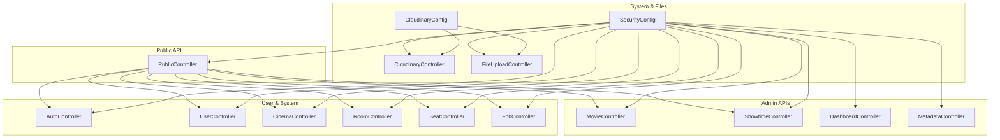

**Diagram sources**
- [PublicController.java:31-167](file://backend/src/main/java/com/cinema/booking/controllers/PublicController.java#L31-L167)
- [MovieController.java:14-64](file://backend/src/main/java/com/cinema/booking/controllers/MovieController.java#L14-L64)
- [ShowtimeController.java:14-54](file://backend/src/main/java/com/cinema/booking/controllers/ShowtimeController.java#L14-L54)
- [DashboardController.java:17-68](file://backend/src/main/java/com/cinema/booking/controllers/DashboardController.java#L17-L68)
- [MetadataController.java:16-123](file://backend/src/main/java/com/cinema/booking/controllers/MetadataController.java#L16-L123)
- [CloudinaryController.java:12-34](file://backend/src/main/java/com/cinema/booking/controllers/CloudinaryController.java#L12-L34)
- [FileUploadController.java:13-41](file://backend/src/main/java/com/cinema/booking/controllers/FileUploadController.java#L13-L41)
- [SecurityConfig.java:24-82](file://backend/src/main/java/com/cinema/booking/config/SecurityConfig.java#L24-L82)
- [CloudinaryConfig.java:11-33](file://backend/src/main/java/com/cinema/booking/config/CloudinaryConfig.java#L11-L33)
- [AuthController.java:13-54](file://backend/src/main/java/com/cinema/booking/controllers/AuthController.java#L13-L54)
- [UserController.java:13-36](file://backend/src/main/java/com/cinema/booking/controllers/UserController.java#L13-L36)
- [CinemaController.java:12-51](file://backend/src/main/java/com/cinema/booking/controllers/CinemaController.java#L12-L51)
- [RoomController.java:12-51](file://backend/src/main/java/com/cinema/booking/controllers/RoomController.java#L12-L51)
- [SeatController.java:12-60](file://backend/src/main/java/com/cinema/booking/controllers/SeatController.java#L12-L60)
- [FnbController.java:19-156](file://backend/src/main/java/com/cinema/booking/controllers/FnbController.java#L19-L156)

**Section sources**
- [PublicController.java:31-167](file://backend/src/main/java/com/cinema/booking/controllers/PublicController.java#L31-L167)
- [SecurityConfig.java:24-82](file://backend/src/main/java/com/cinema/booking/config/SecurityConfig.java#L24-L82)

## Core Components
- PublicController: Exposes public endpoints for movies (now showing, coming soon), locations, cinemas, showtimes (with filters), and F&B categories/items.
- MovieController: Admin CRUD for movies and cast replacement.
- ShowtimeController: Admin CRUD for showtimes.
- DashboardController: Admin dashboard statistics and weekly revenue aggregation.
- MetadataController: Admin CRUD for genres, cast members, and artists.
- CloudinaryController: Provides signed upload credentials for client-side uploads.
- FileUploadController: Server-side upload handler to Cloudinary.
- SecurityConfig: RBAC and method-level authorization rules.
- CloudinaryConfig: External Cloudinary integration configuration.
- AuthController and UserController: Authentication and profile management.
- Supporting controllers: CinemaController, RoomController, SeatController, FnbController.

**Section sources**
- [PublicController.java:31-167](file://backend/src/main/java/com/cinema/booking/controllers/PublicController.java#L31-L167)
- [MovieController.java:14-64](file://backend/src/main/java/com/cinema/booking/controllers/MovieController.java#L14-L64)
- [ShowtimeController.java:14-54](file://backend/src/main/java/com/cinema/booking/controllers/ShowtimeController.java#L14-L54)
- [DashboardController.java:17-68](file://backend/src/main/java/com/cinema/booking/controllers/DashboardController.java#L17-L68)
- [MetadataController.java:16-123](file://backend/src/main/java/com/cinema/booking/controllers/MetadataController.java#L16-L123)
- [CloudinaryController.java:12-34](file://backend/src/main/java/com/cinema/booking/controllers/CloudinaryController.java#L12-L34)
- [FileUploadController.java:13-41](file://backend/src/main/java/com/cinema/booking/controllers/FileUploadController.java#L13-L41)
- [SecurityConfig.java:24-82](file://backend/src/main/java/com/cinema/booking/config/SecurityConfig.java#L24-L82)
- [CloudinaryConfig.java:11-33](file://backend/src/main/java/com/cinema/booking/config/CloudinaryConfig.java#L11-L33)
- [AuthController.java:13-54](file://backend/src/main/java/com/cinema/booking/controllers/AuthController.java#L13-L54)
- [UserController.java:13-36](file://backend/src/main/java/com/cinema/booking/controllers/UserController.java#L13-L36)
- [CinemaController.java:12-51](file://backend/src/main/java/com/cinema/booking/controllers/CinemaController.java#L12-L51)
- [RoomController.java:12-51](file://backend/src/main/java/com/cinema/booking/controllers/RoomController.java#L12-L51)
- [SeatController.java:12-60](file://backend/src/main/java/com/cinema/booking/controllers/SeatController.java#L12-L60)
- [FnbController.java:19-156](file://backend/src/main/java/com/cinema/booking/controllers/FnbController.java#L19-L156)

## Architecture Overview
The system separates concerns into Public, Admin, and System layers:
- Public layer exposes read-only endpoints for customers.
- Admin layer handles content and configuration management with role-based restrictions.
- System layer manages authentication, authorization, and external integrations (Cloudinary).

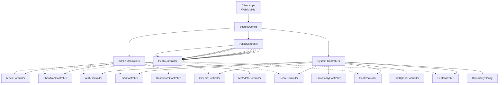

**Diagram sources**
- [SecurityConfig.java:51-79](file://backend/src/main/java/com/cinema/booking/config/SecurityConfig.java#L51-L79)
- [PublicController.java:31-167](file://backend/src/main/java/com/cinema/booking/controllers/PublicController.java#L31-L167)
- [MovieController.java:14-64](file://backend/src/main/java/com/cinema/booking/controllers/MovieController.java#L14-L64)
- [ShowtimeController.java:14-54](file://backend/src/main/java/com/cinema/booking/controllers/ShowtimeController.java#L14-L54)
- [DashboardController.java:17-68](file://backend/src/main/java/com/cinema/booking/controllers/DashboardController.java#L17-L68)
- [MetadataController.java:16-123](file://backend/src/main/java/com/cinema/booking/controllers/MetadataController.java#L16-L123)
- [CloudinaryController.java:12-34](file://backend/src/main/java/com/cinema/booking/controllers/CloudinaryController.java#L12-L34)
- [FileUploadController.java:13-41](file://backend/src/main/java/com/cinema/booking/controllers/FileUploadController.java#L13-L41)
- [CloudinaryConfig.java:11-33](file://backend/src/main/java/com/cinema/booking/config/CloudinaryConfig.java#L11-L33)
- [AuthController.java:13-54](file://backend/src/main/java/com/cinema/booking/controllers/AuthController.java#L13-L54)
- [UserController.java:13-36](file://backend/src/main/java/com/cinema/booking/controllers/UserController.java#L13-L36)
- [CinemaController.java:12-51](file://backend/src/main/java/com/cinema/booking/controllers/CinemaController.java#L12-L51)
- [RoomController.java:12-51](file://backend/src/main/java/com/cinema/booking/controllers/RoomController.java#L12-L51)
- [SeatController.java:12-60](file://backend/src/main/java/com/cinema/booking/controllers/SeatController.java#L12-L60)
- [FnbController.java:19-156](file://backend/src/main/java/com/cinema/booking/controllers/FnbController.java#L19-L156)

## Detailed Component Analysis

### PublicController: Public-Facing Endpoints
- Purpose: Serve customer-facing data for browsing movies, showtimes, locations, cinemas, and F&B.
- Key endpoints:
  - Movies: now showing and coming soon lists.
  - Locations and Cinemas: lists for filtering.
  - Showtimes: basic filter by cinema/movie/date and advanced filter with location, screen type, and price range.
  - F&B: categories and items with stock quantities.
- Design patterns:
  - Builder pattern for constructing filters for showtime queries.
- Access control:
  - Public endpoints are permitted without authentication.

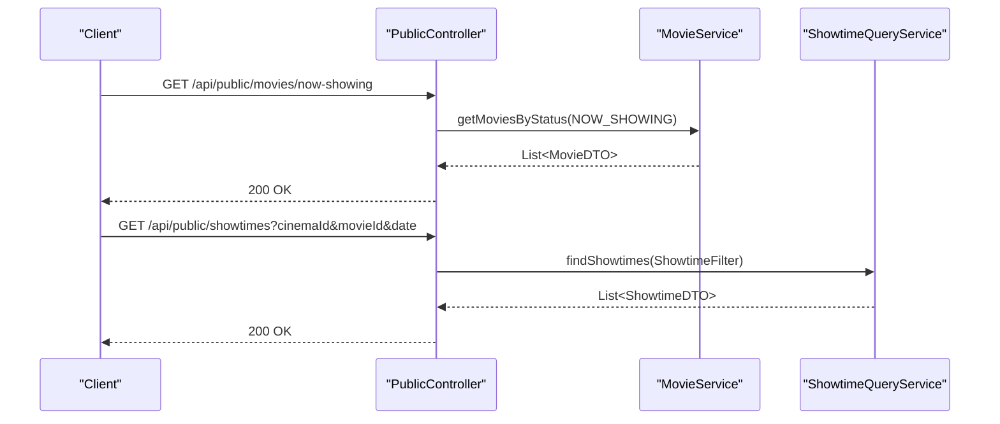

**Diagram sources**
- [PublicController.java:61-108](file://backend/src/main/java/com/cinema/booking/controllers/PublicController.java#L61-L108)
- [MovieController.java:22-30](file://backend/src/main/java/com/cinema/booking/controllers/MovieController.java#L22-L30)
- [ShowtimeController.java:23-27](file://backend/src/main/java/com/cinema/booking/controllers/ShowtimeController.java#L23-L27)

**Section sources**
- [PublicController.java:61-165](file://backend/src/main/java/com/cinema/booking/controllers/PublicController.java#L61-L165)

### MovieController: Admin Content Management (Movies)
- Purpose: Admin CRUD for movies and replacing cast lists.
- Endpoints:
  - Get all movies or filtered by status.
  - Get/update/delete a movie by ID.
  - Replace cast list for a movie.

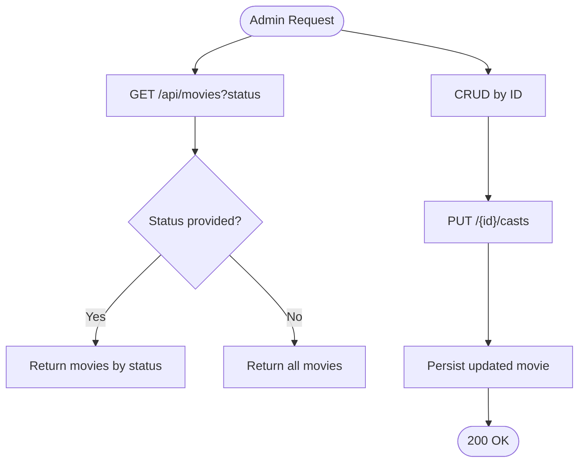

**Diagram sources**
- [MovieController.java:22-56](file://backend/src/main/java/com/cinema/booking/controllers/MovieController.java#L22-L56)

**Section sources**
- [MovieController.java:22-62](file://backend/src/main/java/com/cinema/booking/controllers/MovieController.java#L22-L62)

### ShowtimeController: Admin Content Management (Showtimes)
- Purpose: Admin CRUD for showtimes, including creation with automatic end time calculation and weekend surcharge.
- Endpoints:
  - Get all showtimes and by ID.
  - Create, update, and delete showtimes.

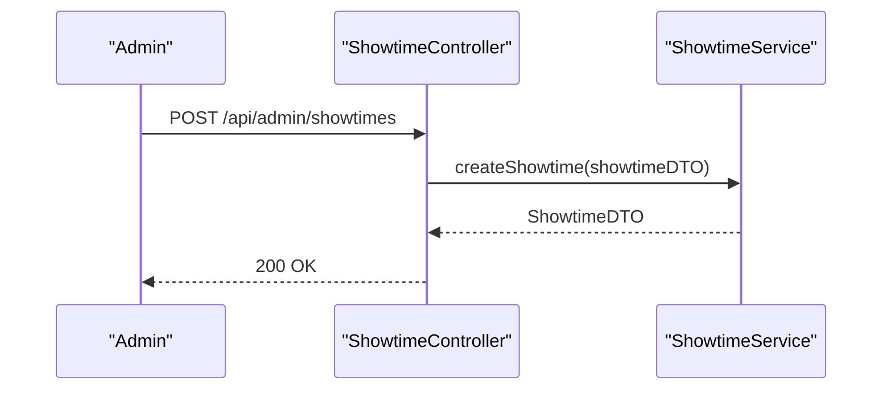

**Diagram sources**
- [ShowtimeController.java:35-39](file://backend/src/main/java/com/cinema/booking/controllers/ShowtimeController.java#L35-L39)

**Section sources**
- [ShowtimeController.java:23-52](file://backend/src/main/java/com/cinema/booking/controllers/ShowtimeController.java#L23-L52)

### DashboardController: Admin Analytics
- Purpose: Provide aggregated statistics and weekly revenue chart.
- Endpoints:
  - Aggregated stats via composite pattern.
  - Weekly revenue breakdown by day of week.

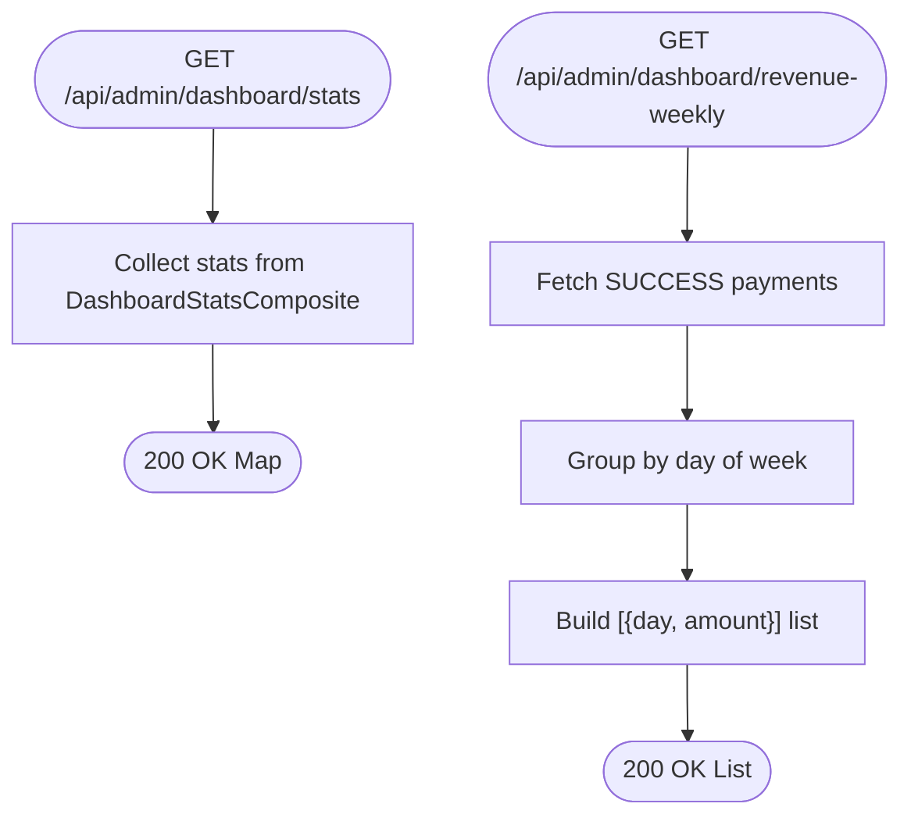

**Diagram sources**
- [DashboardController.java:31-66](file://backend/src/main/java/com/cinema/booking/controllers/DashboardController.java#L31-L66)

**Section sources**
- [DashboardController.java:31-66](file://backend/src/main/java/com/cinema/booking/controllers/DashboardController.java#L31-L66)

### MetadataController: Admin Metadata Management
- Purpose: Admin CRUD for genres, cast members, and artists.
- Endpoints:
  - Genres: list, create, update, delete.
  - Cast Members: list, create, update, delete.
  - Artists: list, create, update, delete.

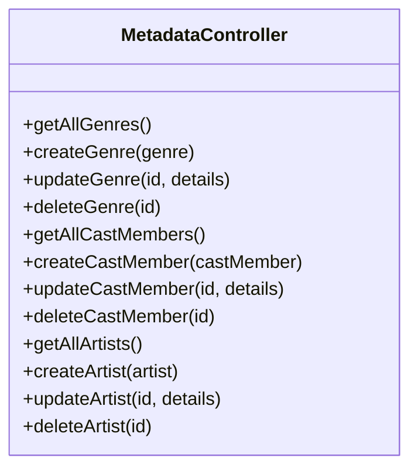

**Diagram sources**
- [MetadataController.java:31-122](file://backend/src/main/java/com/cinema/booking/controllers/MetadataController.java#L31-L122)

**Section sources**
- [MetadataController.java:31-122](file://backend/src/main/java/com/cinema/booking/controllers/MetadataController.java#L31-L122)

### CloudinaryController and FileUploadController: File Operations
- CloudinaryController:
  - Provides signed upload signature for client-side uploads.
  - Supports both GET and POST credential retrieval.
- FileUploadController:
  - Accepts multipart/form-data and uploads to Cloudinary via service.
  - Returns URL and message upon success.

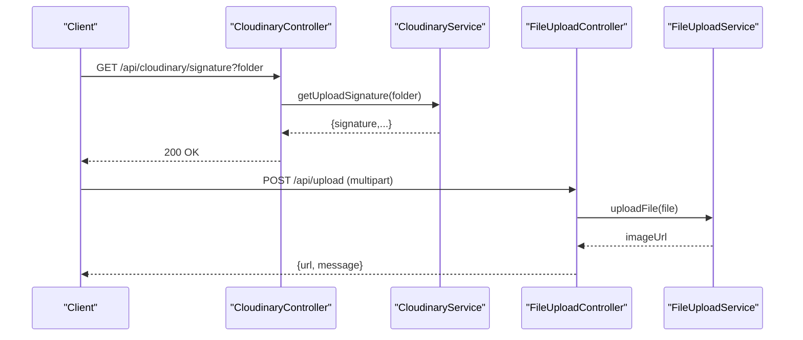

**Diagram sources**
- [CloudinaryController.java:21-32](file://backend/src/main/java/com/cinema/booking/controllers/CloudinaryController.java#L21-L32)
- [FileUploadController.java:21-39](file://backend/src/main/java/com/cinema/booking/controllers/FileUploadController.java#L21-L39)
- [CloudinaryConfig.java:23-31](file://backend/src/main/java/com/cinema/booking/config/CloudinaryConfig.java#L23-L31)

**Section sources**
- [CloudinaryController.java:21-32](file://backend/src/main/java/com/cinema/booking/controllers/CloudinaryController.java#L21-L32)
- [FileUploadController.java:21-39](file://backend/src/main/java/com/cinema/booking/controllers/FileUploadController.java#L21-L39)
- [CloudinaryConfig.java:11-33](file://backend/src/main/java/com/cinema/booking/config/CloudinaryConfig.java#L11-L33)

### SecurityConfig: Role-Based Access Control (RBAC)
- Public endpoints are permitted without authentication.
- Admin endpoints require ADMIN or STAFF roles.
- Method-level security enabled via PreAuthorize annotations on controllers.
- CORS and JWT filter configured globally.

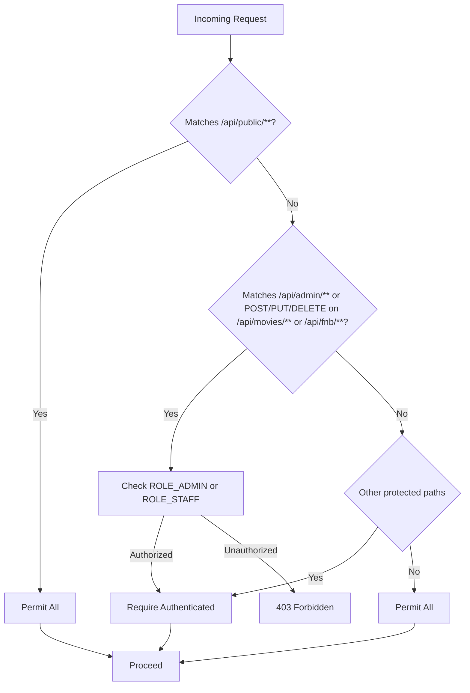

**Diagram sources**
- [SecurityConfig.java:57-74](file://backend/src/main/java/com/cinema/booking/config/SecurityConfig.java#L57-L74)
- [UserController.java:22-34](file://backend/src/main/java/com/cinema/booking/controllers/UserController.java#L22-L34)

**Section sources**
- [SecurityConfig.java:57-74](file://backend/src/main/java/com/cinema/booking/config/SecurityConfig.java#L57-L74)
- [UserController.java:22-34](file://backend/src/main/java/com/cinema/booking/controllers/UserController.java#L22-L34)

### Supporting Controllers: User, System, and Content
- AuthController: Login, registration, and Google login.
- UserController: Current user info and profile update with broad role permissions.
- CinemaController, RoomController, SeatController: CRUD for venues, rooms, and seats.
- FnbController: Full CRUD for F&B items and categories, including inventory mapping.

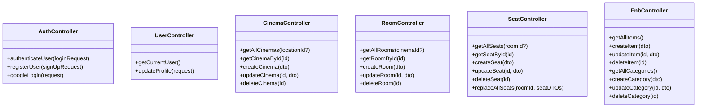

**Diagram sources**
- [AuthController.java:21-52](file://backend/src/main/java/com/cinema/booking/controllers/AuthController.java#L21-L52)
- [UserController.java:22-34](file://backend/src/main/java/com/cinema/booking/controllers/UserController.java#L22-L34)
- [CinemaController.java:20-49](file://backend/src/main/java/com/cinema/booking/controllers/CinemaController.java#L20-L49)
- [RoomController.java:20-49](file://backend/src/main/java/com/cinema/booking/controllers/RoomController.java#L20-L49)
- [SeatController.java:20-57](file://backend/src/main/java/com/cinema/booking/controllers/SeatController.java#L20-L57)
- [FnbController.java:34-133](file://backend/src/main/java/com/cinema/booking/controllers/FnbController.java#L34-L133)

**Section sources**
- [AuthController.java:21-52](file://backend/src/main/java/com/cinema/booking/controllers/AuthController.java#L21-L52)
- [UserController.java:22-34](file://backend/src/main/java/com/cinema/booking/controllers/UserController.java#L22-L34)
- [CinemaController.java:20-49](file://backend/src/main/java/com/cinema/booking/controllers/CinemaController.java#L20-L49)
- [RoomController.java:20-49](file://backend/src/main/java/com/cinema/booking/controllers/RoomController.java#L20-L49)
- [SeatController.java:20-57](file://backend/src/main/java/com/cinema/booking/controllers/SeatController.java#L20-L57)
- [FnbController.java:34-133](file://backend/src/main/java/com/cinema/booking/controllers/FnbController.java#L34-L133)

## Dependency Analysis
- Controllers depend on services and repositories for business logic and persistence.
- SecurityConfig centralizes authorization rules and integrates JWT filter.
- CloudinaryConfig provides Cloudinary client bean for controllers requiring external upload capabilities.

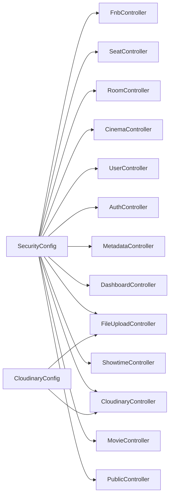

**Diagram sources**
- [SecurityConfig.java:51-79](file://backend/src/main/java/com/cinema/booking/config/SecurityConfig.java#L51-L79)
- [CloudinaryConfig.java:23-31](file://backend/src/main/java/com/cinema/booking/config/CloudinaryConfig.java#L23-L31)

**Section sources**
- [SecurityConfig.java:51-79](file://backend/src/main/java/com/cinema/booking/config/SecurityConfig.java#L51-L79)
- [CloudinaryConfig.java:23-31](file://backend/src/main/java/com/cinema/booking/config/CloudinaryConfig.java#L23-L31)

## Performance Considerations
- Public showtime filtering leverages a builder pattern to construct efficient queries, reducing conditional branching and enabling scalable filtering.
- Inventory mapping for F&B items is batched to minimize round trips.
- Dashboard statistics aggregation uses a composite pattern to consolidate multiple metrics efficiently.
- Cloudinary integration supports client-side direct uploads to reduce server bandwidth and improve perceived performance.

[No sources needed since this section provides general guidance]

## Troubleshooting Guide
- Authentication failures:
  - Verify JWT filter and entry point behavior.
  - Confirm credentials and roles for protected endpoints.
- Authorization errors:
  - Ensure requests match expected roles (ADMIN/STAFF) for admin endpoints.
  - Check method-level security annotations.
- Cloudinary upload issues:
  - Validate Cloudinary configuration properties and bean initialization.
  - Confirm signature generation and upload credentials.
- Public endpoint errors:
  - Validate query parameters for showtime filters and ensure correct date formats.
  - Confirm repository-backed DTO mapping for F&B items and inventory.

**Section sources**
- [SecurityConfig.java:51-79](file://backend/src/main/java/com/cinema/booking/config/SecurityConfig.java#L51-L79)
- [CloudinaryConfig.java:11-33](file://backend/src/main/java/com/cinema/booking/config/CloudinaryConfig.java#L11-L33)
- [CloudinaryController.java:21-32](file://backend/src/main/java/com/cinema/booking/controllers/CloudinaryController.java#L21-L32)
- [FileUploadController.java:21-39](file://backend/src/main/java/com/cinema/booking/controllers/FileUploadController.java#L21-L39)
- [PublicController.java:93-135](file://backend/src/main/java/com/cinema/booking/controllers/PublicController.java#L93-L135)

## Conclusion
The Admin, Staff, and Public Controllers implement a clear separation of concerns:
- Public endpoints expose curated content for customers.
- Admin endpoints manage content, metadata, and system analytics with robust RBAC.
- File operations integrate seamlessly with Cloudinary for secure, scalable uploads.
- SecurityConfig enforces method-level authorization, while supporting controllers handle user and venue operations.

[No sources needed since this section summarizes without analyzing specific files]