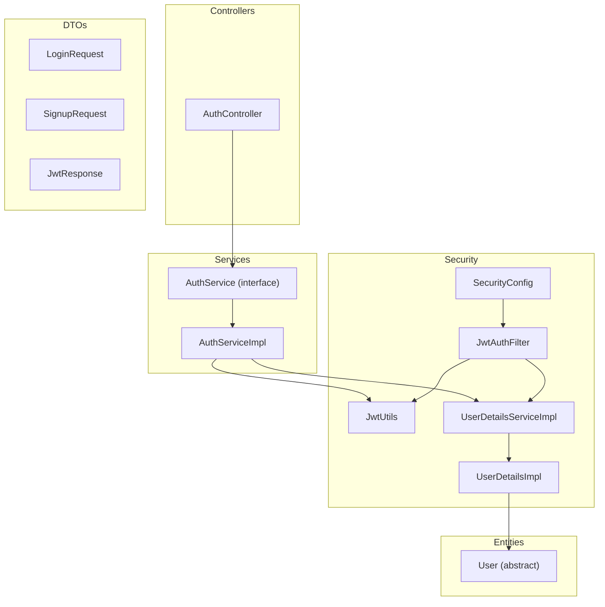
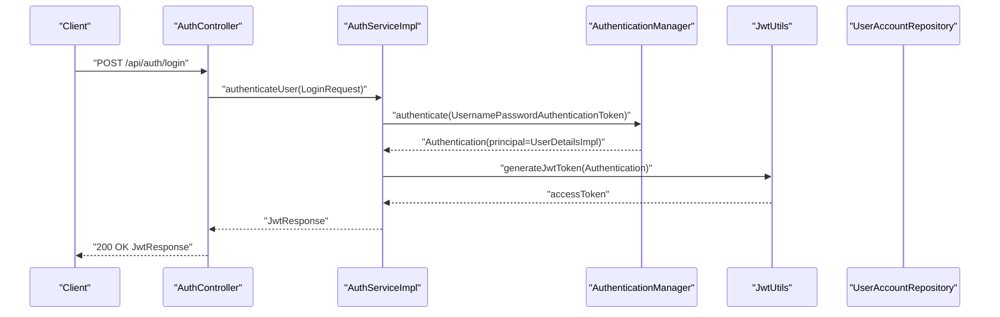
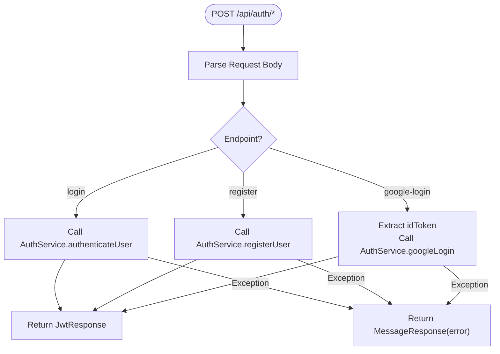
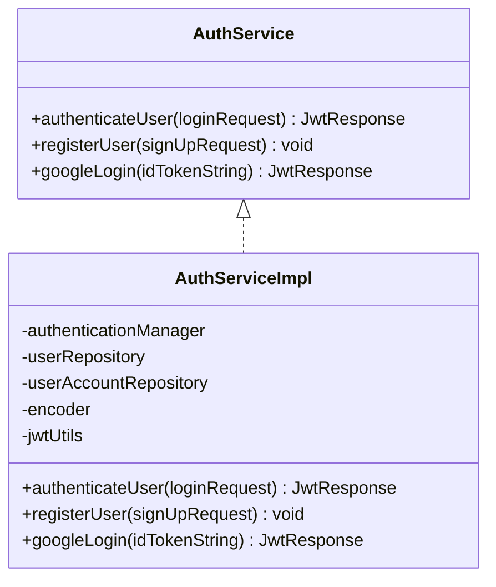
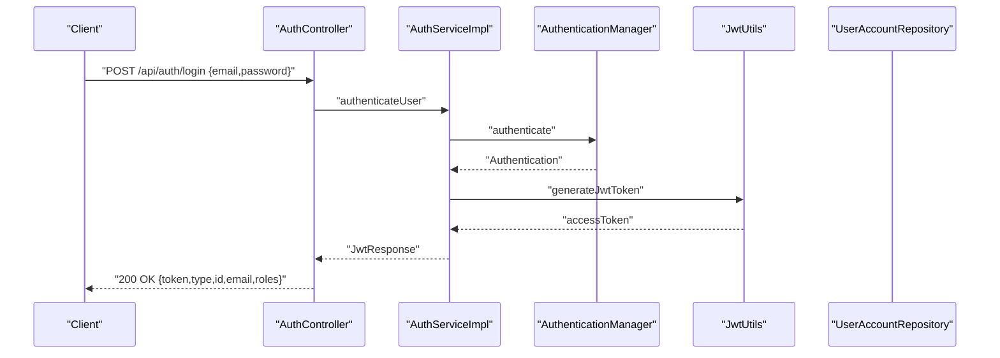
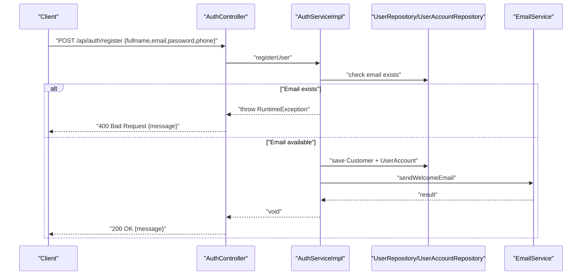
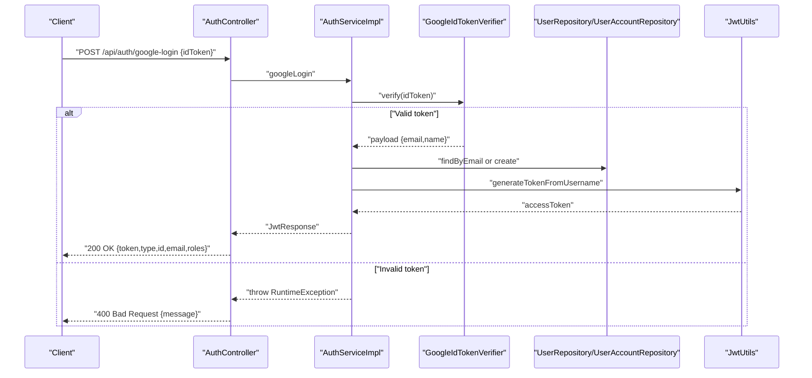
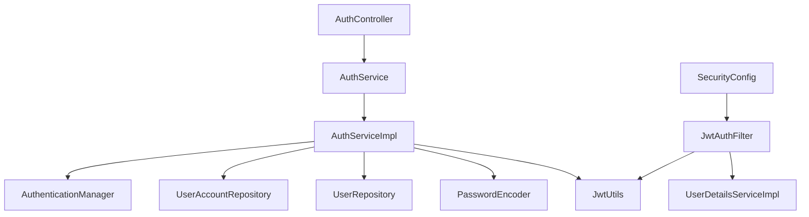

# Authentication Controller

<cite>
**Referenced Files in This Document**
- [AuthController.java](file://backend/src/main/java/com/cinema/booking/controllers/AuthController.java)
- [AuthService.java](file://backend/src/main/java/com/cinema/booking/services/AuthService.java)
- [AuthServiceImpl.java](file://backend/src/main/java/com/cinema/booking/services/impl/AuthServiceImpl.java)
- [LoginRequest.java](file://backend/src/main/java/com/cinema/booking/dtos/LoginRequest.java)
- [SignupRequest.java](file://backend/src/main/java/com/cinema/booking/dtos/SignupRequest.java)
- [JwtResponse.java](file://backend/src/main/java/com/cinema/booking/dtos/JwtResponse.java)
- [JwtUtils.java](file://backend/src/main/java/com/cinema/booking/security/JwtUtils.java)
- [JwtAuthFilter.java](file://backend/src/main/java/com/cinema/booking/security/JwtAuthFilter.java)
- [SecurityConfig.java](file://backend/src/main/java/com/cinema/booking/config/SecurityConfig.java)
- [UserDetailsServiceImpl.java](file://backend/src/main/java/com/cinema/booking/security/UserDetailsServiceImpl.java)
- [UserDetailsImpl.java](file://backend/src/main/java/com/cinema/booking/security/UserDetailsImpl.java)
- [User.java](file://backend/src/main/java/com/cinema/booking/entities/User.java)
- [application.properties](file://backend/src/main/resources/application.properties)
- [public_api_test.http](file://backend/public_api_test.http)
</cite>

## Table of Contents
1. [Introduction](#introduction)
2. [Project Structure](#project-structure)
3. [Core Components](#core-components)
4. [Architecture Overview](#architecture-overview)
5. [Detailed Component Analysis](#detailed-component-analysis)
6. [Dependency Analysis](#dependency-analysis)
7. [Performance Considerations](#performance-considerations)
8. [Troubleshooting Guide](#troubleshooting-guide)
9. [Conclusion](#conclusion)

## Introduction
This document provides comprehensive documentation for the Authentication Controller implementation. It covers the three primary authentication endpoints:
- POST /api/auth/login for email/password authentication
- POST /api/auth/register for user registration
- POST /api/auth/google-login for Google OAuth authentication

It explains the request/response DTOs (LoginRequest, SignupRequest, JwtResponse), JWT token generation and validation, error handling strategies, integration with AuthService and Spring Security configuration, and practical examples of authentication flows and security considerations.

## Project Structure
The authentication subsystem is organized around a controller, service layer, DTOs, and Spring Security integration:
- Controllers: AuthController exposes authentication endpoints
- Services: AuthService interface and AuthServiceImpl implementation
- DTOs: LoginRequest, SignupRequest, JwtResponse
- Security: JwtUtils, JwtAuthFilter, SecurityConfig, UserDetailsServiceImpl, UserDetailsImpl
- Entities: User hierarchy and UserAccount
- Configuration: application.properties for JWT and other settings

**Diagram sources**
- [AuthController.java:16-53](file://backend/src/main/java/com/cinema/booking/controllers/AuthController.java#L16-L53)
- [AuthService.java:7-11](file://backend/src/main/java/com/cinema/booking/services/AuthService.java#L7-L11)
- [AuthServiceImpl.java:27-138](file://backend/src/main/java/com/cinema/booking/services/impl/AuthServiceImpl.java#L27-L138)
- [JwtUtils.java:16-70](file://backend/src/main/java/com/cinema/booking/security/JwtUtils.java#L16-L70)
- [JwtAuthFilter.java:19-63](file://backend/src/main/java/com/cinema/booking/security/JwtAuthFilter.java#L19-L63)
- [SecurityConfig.java:27-79](file://backend/src/main/java/com/cinema/booking/config/SecurityConfig.java#L27-L79)
- [UserDetailsServiceImpl.java:13-26](file://backend/src/main/java/com/cinema/booking/security/UserDetailsServiceImpl.java#L13-L26)
- [UserDetailsImpl.java:17-39](file://backend/src/main/java/com/cinema/booking/security/UserDetailsImpl.java#L17-L39)
- [User.java:13-36](file://backend/src/main/java/com/cinema/booking/entities/User.java#L13-L36)

**Section sources**
- [AuthController.java:16-53](file://backend/src/main/java/com/cinema/booking/controllers/AuthController.java#L16-L53)
- [AuthService.java:7-11](file://backend/src/main/java/com/cinema/booking/services/AuthService.java#L7-L11)
- [AuthServiceImpl.java:27-138](file://backend/src/main/java/com/cinema/booking/services/impl/AuthServiceImpl.java#L27-L138)
- [JwtUtils.java:16-70](file://backend/src/main/java/com/cinema/booking/security/JwtUtils.java#L16-L70)
- [JwtAuthFilter.java:19-63](file://backend/src/main/java/com/cinema/booking/security/JwtAuthFilter.java#L19-L63)
- [SecurityConfig.java:27-79](file://backend/src/main/java/com/cinema/booking/config/SecurityConfig.java#L27-L79)
- [UserDetailsServiceImpl.java:13-26](file://backend/src/main/java/com/cinema/booking/security/UserDetailsServiceImpl.java#L13-L26)
- [UserDetailsImpl.java:17-39](file://backend/src/main/java/com/cinema/booking/security/UserDetailsImpl.java#L17-L39)
- [User.java:13-36](file://backend/src/main/java/com/cinema/booking/entities/User.java#L13-L36)

## Core Components
- AuthController: Exposes three endpoints under /api/auth and delegates to AuthService. It handles exceptions and returns standardized messages via MessageResponse.
- AuthService and AuthServiceImpl: Define and implement authentication logic including email/password login, registration, and Google OAuth login.
- DTOs:
  - LoginRequest: Validates email and password for login
  - SignupRequest: Validates registration fields including email, password, fullname, and optional phone
  - JwtResponse: Encapsulates JWT token, token type, user identity, and roles
- Security:
  - JwtUtils: Generates and validates JWT tokens using HS256 with a configurable secret and expiration
  - JwtAuthFilter: Extracts Bearer token from Authorization header, validates it, loads user details, and sets authentication in SecurityContext
  - SecurityConfig: Configures stateless sessions, permits unauthenticated access to /api/auth/**, and registers JwtAuthFilter
  - UserDetailsServiceImpl and UserDetailsImpl: Load user details from persistence and adapt to Spring Security’s UserDetails contract

**Section sources**
- [AuthController.java:21-52](file://backend/src/main/java/com/cinema/booking/controllers/AuthController.java#L21-L52)
- [AuthService.java:7-11](file://backend/src/main/java/com/cinema/booking/services/AuthService.java#L7-L11)
- [AuthServiceImpl.java:44-137](file://backend/src/main/java/com/cinema/booking/services/impl/AuthServiceImpl.java#L44-L137)
- [LoginRequest.java:7-12](file://backend/src/main/java/com/cinema/booking/dtos/LoginRequest.java#L7-L12)
- [SignupRequest.java:9-23](file://backend/src/main/java/com/cinema/booking/dtos/SignupRequest.java#L9-L23)
- [JwtResponse.java:10-22](file://backend/src/main/java/com/cinema/booking/dtos/JwtResponse.java#L10-L22)
- [JwtUtils.java:30-69](file://backend/src/main/java/com/cinema/booking/security/JwtUtils.java#L30-L69)
- [JwtAuthFilter.java:27-51](file://backend/src/main/java/com/cinema/booking/security/JwtAuthFilter.java#L27-L51)
- [SecurityConfig.java:51-76](file://backend/src/main/java/com/cinema/booking/config/SecurityConfig.java#L51-L76)
- [UserDetailsServiceImpl.java:18-25](file://backend/src/main/java/com/cinema/booking/security/UserDetailsServiceImpl.java#L18-L25)
- [UserDetailsImpl.java:29-39](file://backend/src/main/java/com/cinema/booking/security/UserDetailsImpl.java#L29-L39)

## Architecture Overview
The authentication flow integrates HTTP endpoints, service layer, and Spring Security:
- AuthController receives requests and delegates to AuthService
- AuthServiceImpl orchestrates Spring Security’s AuthenticationManager, JWT utilities, and persistence
- JwtAuthFilter enforces JWT-based authentication for protected routes
- SecurityConfig defines global security policy and permits unauthenticated access to authentication endpoints

**Diagram sources**
- [AuthController.java:21-31](file://backend/src/main/java/com/cinema/booking/controllers/AuthController.java#L21-L31)
- [AuthServiceImpl.java:44-61](file://backend/src/main/java/com/cinema/booking/services/impl/AuthServiceImpl.java#L44-L61)
- [JwtUtils.java:30-39](file://backend/src/main/java/com/cinema/booking/security/JwtUtils.java#L30-L39)

**Section sources**
- [AuthController.java:21-31](file://backend/src/main/java/com/cinema/booking/controllers/AuthController.java#L21-L31)
- [AuthServiceImpl.java:44-61](file://backend/src/main/java/com/cinema/booking/services/impl/AuthServiceImpl.java#L44-L61)
- [JwtUtils.java:30-39](file://backend/src/main/java/com/cinema/booking/security/JwtUtils.java#L30-L39)

## Detailed Component Analysis

### AuthController
- Endpoints:
  - POST /api/auth/login: Accepts LoginRequest, calls AuthService.authenticateUser, returns JwtResponse or error message
  - POST /api/auth/register: Accepts SignupRequest, calls AuthService.registerUser, returns success or error message
  - POST /api/auth/google-login: Accepts JSON with idToken, calls AuthService.googleLogin, returns JwtResponse or error message
- Error handling: Catches exceptions and returns ResponseEntity.badRequest with localized messages

**Diagram sources**
- [AuthController.java:21-52](file://backend/src/main/java/com/cinema/booking/controllers/AuthController.java#L21-L52)

**Section sources**
- [AuthController.java:21-52](file://backend/src/main/java/com/cinema/booking/controllers/AuthController.java#L21-L52)

### DTOs

#### LoginRequest
- Fields: email, password
- Validation: Both fields are required

**Section sources**
- [LoginRequest.java:7-12](file://backend/src/main/java/com/cinema/booking/dtos/LoginRequest.java#L7-L12)

#### SignupRequest
- Fields: fullname, email, password, phone
- Validation: Email constraints, password length bounds, fullname and email max length

**Section sources**
- [SignupRequest.java:9-23](file://backend/src/main/java/com/cinema/booking/dtos/SignupRequest.java#L9-L23)

#### JwtResponse
- Fields: token, type, id, email, roles
- Constructors: Full constructor and convenience constructor

**Section sources**
- [JwtResponse.java:10-22](file://backend/src/main/java/com/cinema/booking/dtos/JwtResponse.java#L10-L22)

### AuthService and AuthServiceImpl
- authenticateUser:
  - Authenticates using AuthenticationManager with UsernamePasswordAuthenticationToken
  - Sets SecurityContext and generates JWT via JwtUtils
  - Builds JwtResponse with principal’s id, email, and roles
- registerUser:
  - Checks uniqueness of email
  - Creates Customer and UserAccount, encodes password
  - Persists and attempts to send welcome email
- googleLogin:
  - Verifies Google ID token against configured client ID
  - Loads or creates UserAccount for the email
  - Generates JWT and returns JwtResponse with derived role

**Diagram sources**
- [AuthService.java:7-11](file://backend/src/main/java/com/cinema/booking/services/AuthService.java#L7-L11)
- [AuthServiceImpl.java:27-138](file://backend/src/main/java/com/cinema/booking/services/impl/AuthServiceImpl.java#L27-L138)

**Section sources**
- [AuthService.java:7-11](file://backend/src/main/java/com/cinema/booking/services/AuthService.java#L7-L11)
- [AuthServiceImpl.java:44-137](file://backend/src/main/java/com/cinema/booking/services/impl/AuthServiceImpl.java#L44-L137)

### JWT Utilities and Security Filters

#### JwtUtils
- generateJwtToken: Builds HS256-signed JWT with subject, issued at, and expiration from application properties
- generateTokenFromUsername: Alternative generator for username-based tokens
- getUserNameFromJwtToken: Parses subject from JWT
- validateJwtToken: Validates signature, expiration, support, and claims presence

**Section sources**
- [JwtUtils.java:30-69](file://backend/src/main/java/com/cinema/booking/security/JwtUtils.java#L30-L69)

#### JwtAuthFilter
- Extracts Bearer token from Authorization header
- Validates token via JwtUtils
- Loads UserDetails via UserDetailsServiceImpl
- Sets Authentication in SecurityContext

**Section sources**
- [JwtAuthFilter.java:27-51](file://backend/src/main/java/com/cinema/booking/security/JwtAuthFilter.java#L27-L51)

#### SecurityConfig
- Stateless session management
- Permits unauthenticated access to /api/auth/**
- Registers JwtAuthFilter before UsernamePasswordAuthenticationFilter
- Defines role-based access for admin endpoints

**Section sources**
- [SecurityConfig.java:51-76](file://backend/src/main/java/com/cinema/booking/config/SecurityConfig.java#L51-L76)

#### UserDetailsServiceImpl and UserDetailsImpl
- UserDetailsServiceImpl loads UserAccount with associated User and builds UserDetailsImpl
- UserDetailsImpl adapts User entity role to Spring Security authority with “ROLE_” prefix

**Section sources**
- [UserDetailsServiceImpl.java:18-25](file://backend/src/main/java/com/cinema/booking/security/UserDetailsServiceImpl.java#L18-L25)
- [UserDetailsImpl.java:29-39](file://backend/src/main/java/com/cinema/booking/security/UserDetailsImpl.java#L29-L39)
- [User.java:32-36](file://backend/src/main/java/com/cinema/booking/entities/User.java#L32-L36)

### Authentication Flows

#### Email/Password Login Flow

**Diagram sources**
- [AuthController.java:21-31](file://backend/src/main/java/com/cinema/booking/controllers/AuthController.java#L21-L31)
- [AuthServiceImpl.java:44-61](file://backend/src/main/java/com/cinema/booking/services/impl/AuthServiceImpl.java#L44-L61)
- [JwtUtils.java:30-39](file://backend/src/main/java/com/cinema/booking/security/JwtUtils.java#L30-L39)

#### Registration Flow

**Diagram sources**
- [AuthController.java:33-41](file://backend/src/main/java/com/cinema/booking/controllers/AuthController.java#L33-L41)
- [AuthServiceImpl.java:66-92](file://backend/src/main/java/com/cinema/booking/services/impl/AuthServiceImpl.java#L66-L92)

#### Google OAuth Login Flow

**Diagram sources**
- [AuthController.java:43-52](file://backend/src/main/java/com/cinema/booking/controllers/AuthController.java#L43-L52)
- [AuthServiceImpl.java:97-137](file://backend/src/main/java/com/cinema/booking/services/impl/AuthServiceImpl.java#L97-L137)
- [JwtUtils.java:41-47](file://backend/src/main/java/com/cinema/booking/security/JwtUtils.java#L41-L47)

### Token Refresh Mechanism
- Current implementation does not expose a dedicated token refresh endpoint
- JWT expiration is configured via application properties
- Recommended approach: Introduce a POST /api/auth/refreshtoken endpoint that accepts a valid refresh token and issues a new access token after validating the refresh token

[No sources needed since this section provides general guidance]

### Security Considerations
- Secret and expiration: JWT secret and expiration are configured via application properties
- Stateless: Session policy is set to STATELESS
- CORS: Cross-origin requests are permitted for development
- Role-based access: Admin endpoints require specific roles
- Password encoding: BCryptPasswordEncoder is used for password hashing

**Section sources**
- [application.properties:45-46](file://backend/src/main/resources/application.properties#L45-L46)
- [SecurityConfig.java:56-76](file://backend/src/main/java/com/cinema/booking/config/SecurityConfig.java#L56-L76)
- [SecurityConfig.java:41-43](file://backend/src/main/java/com/cinema/booking/config/SecurityConfig.java#L41-L43)

## Dependency Analysis
The authentication subsystem exhibits clear separation of concerns:
- AuthController depends on AuthService
- AuthServiceImpl depends on AuthenticationManager, repositories, PasswordEncoder, JwtUtils, and EmailService
- JwtAuthFilter depends on JwtUtils and UserDetailsServiceImpl
- SecurityConfig wires JwtAuthFilter and configures permitAll for authentication endpoints

**Diagram sources**
- [AuthController.java:18-19](file://backend/src/main/java/com/cinema/booking/controllers/AuthController.java#L18-L19)
- [AuthServiceImpl.java:29-42](file://backend/src/main/java/com/cinema/booking/services/impl/AuthServiceImpl.java#L29-L42)
- [JwtAuthFilter.java:21-25](file://backend/src/main/java/com/cinema/booking/security/JwtAuthFilter.java#L21-L25)
- [SecurityConfig.java:35-38](file://backend/src/main/java/com/cinema/booking/config/SecurityConfig.java#L35-L38)

**Section sources**
- [AuthController.java:18-19](file://backend/src/main/java/com/cinema/booking/controllers/AuthController.java#L18-L19)
- [AuthServiceImpl.java:29-42](file://backend/src/main/java/com/cinema/booking/services/impl/AuthServiceImpl.java#L29-L42)
- [JwtAuthFilter.java:21-25](file://backend/src/main/java/com/cinema/booking/security/JwtAuthFilter.java#L21-L25)
- [SecurityConfig.java:35-38](file://backend/src/main/java/com/cinema/booking/config/SecurityConfig.java#L35-L38)

## Performance Considerations
- JWT generation and validation are lightweight operations; ensure secret and expiration are appropriately sized
- Avoid excessive logging of sensitive data in production
- Consider rate-limiting for authentication endpoints to mitigate brute-force attacks
- Use HTTPS in production to protect tokens in transit

[No sources needed since this section provides general guidance]

## Troubleshooting Guide
- Login failures: Controller catches exceptions and returns a user-friendly message; inspect server logs for underlying causes
- Registration errors: Duplicate email triggers a runtime exception; verify email uniqueness
- Google login errors: Token verification failures or missing client ID cause runtime exceptions; confirm Google client ID configuration
- JWT validation errors: JwtUtils logs specific error categories (invalid, expired, unsupported, empty); adjust token lifecycle accordingly
- Protected route access denied: Ensure Authorization header contains a valid Bearer token; verify role assignment and SecurityConfig permit rules

**Section sources**
- [AuthController.java:26-30](file://backend/src/main/java/com/cinema/booking/controllers/AuthController.java#L26-L30)
- [AuthController.java:38-40](file://backend/src/main/java/com/cinema/booking/controllers/AuthController.java#L38-L40)
- [AuthController.java:49-51](file://backend/src/main/java/com/cinema/booking/controllers/AuthController.java#L49-L51)
- [JwtUtils.java:55-69](file://backend/src/main/java/com/cinema/booking/security/JwtUtils.java#L55-L69)
- [SecurityConfig.java:57-76](file://backend/src/main/java/com/cinema/booking/config/SecurityConfig.java#L57-L76)

## Conclusion
The Authentication Controller provides a robust foundation for email/password, registration, and Google OAuth authentication. It leverages Spring Security for authentication and JWT for stateless authorization, with clear DTOs and error handling. The design supports future enhancements such as token refresh and improved resilience through rate limiting and secure transport.