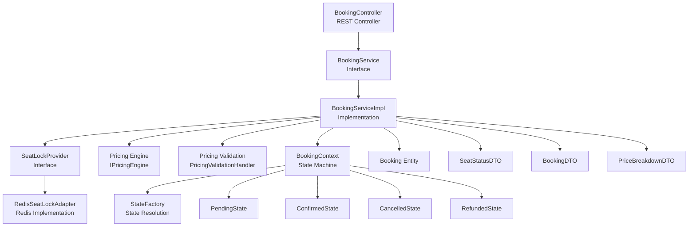
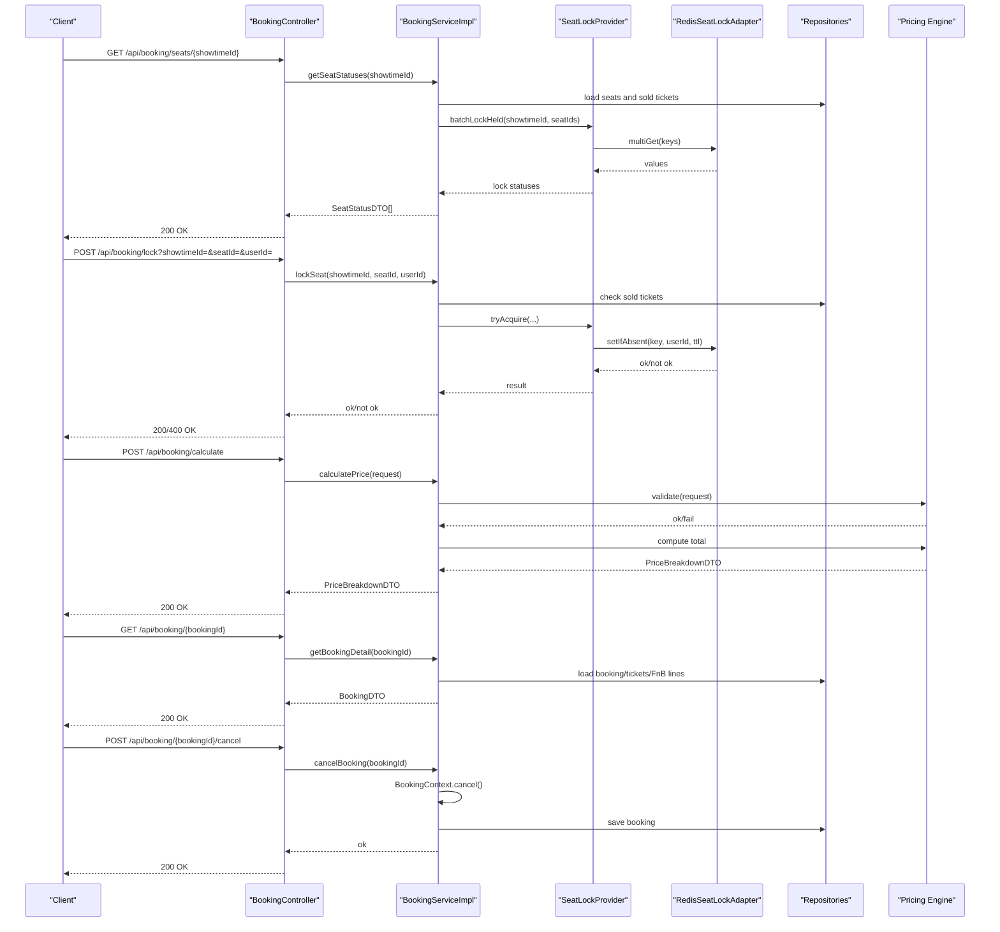
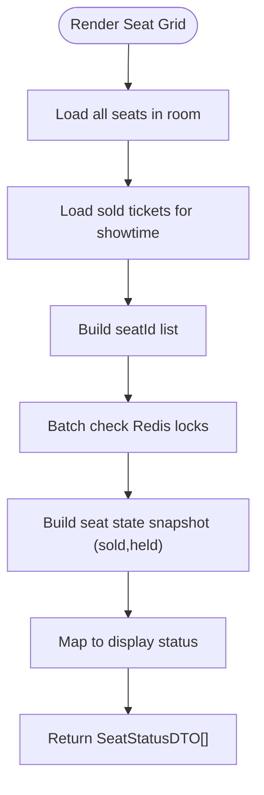
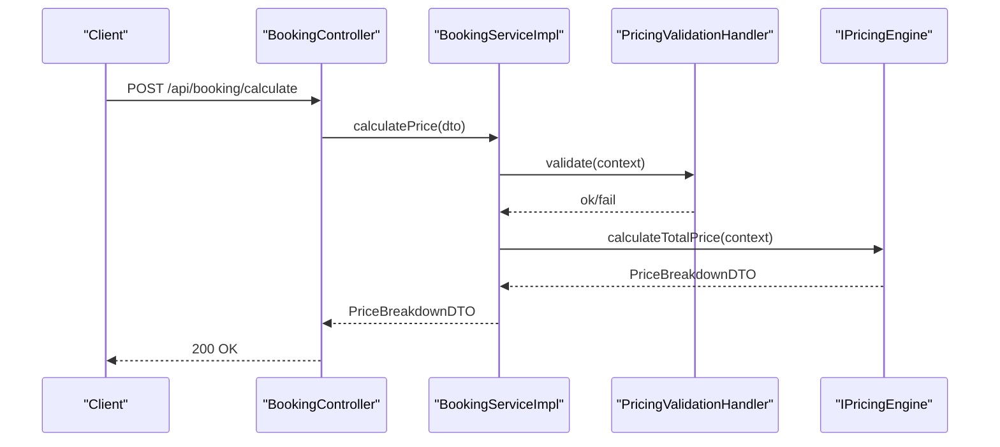
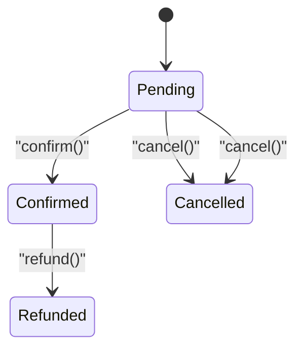
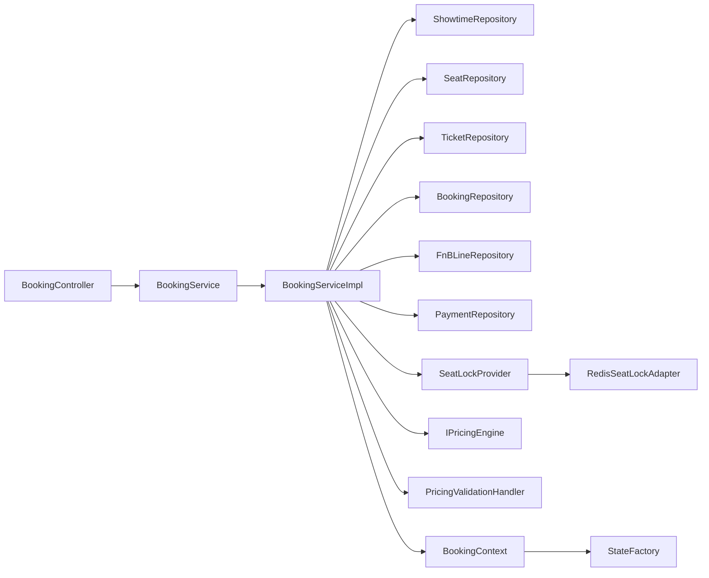

# Booking Controller

<cite>
**Referenced Files in This Document**
- [BookingController.java](file://backend/src/main/java/com/cinema/booking/controllers/BookingController.java)
- [BookingService.java](file://backend/src/main/java/com/cinema/booking/services/BookingService.java)
- [BookingServiceImpl.java](file://backend/src/main/java/com/cinema/booking/services/impl/BookingServiceImpl.java)
- [SeatLockProvider.java](file://backend/src/main/java/com/cinema/booking/services/seatlock/SeatLockProvider.java)
- [RedisSeatLockAdapter.java](file://backend/src/main/java/com/cinema/booking/services/seatlock/RedisSeatLockAdapter.java)
- [BookingContext.java](file://backend/src/main/java/com/cinema/booking/patterns/state/BookingContext.java)
- [StateFactory.java](file://backend/src/main/java/com/cinema/booking/patterns/state/StateFactory.java)
- [BookingState.java](file://backend/src/main/java/com/cinema/booking/patterns/state/BookingState.java)
- [Booking.java](file://backend/src/main/java/com/cinema/booking/entities/Booking.java)
- [SeatStatusDTO.java](file://backend/src/main/java/com/cinema/booking/dtos/SeatStatusDTO.java)
- [BookingDTO.java](file://backend/src/main/java/com/cinema/booking/dtos/BookingDTO.java)
- [BookingCalculationDTO.java](file://backend/src/main/java/com/cinema/booking/dtos/BookingCalculationDTO.java)
- [PriceBreakdownDTO.java](file://backend/src/main/java/com/cinema/booking/dtos/PriceBreakdownDTO.java)
- [IPricingEngine.java](file://backend/src/main/java/com/cinema/booking/services/strategy_decorator/pricing/IPricingEngine.java)
- [PricingValidationHandler.java](file://backend/src/main/java/com/cinema/booking/services/strategy_decorator/pricing/validation/PricingValidationHandler.java)
</cite>

## Table of Contents
1. [Introduction](#introduction)
2. [Project Structure](#project-structure)
3. [Core Components](#core-components)
4. [Architecture Overview](#architecture-overview)
5. [Detailed Component Analysis](#detailed-component-analysis)
6. [Dependency Analysis](#dependency-analysis)
7. [Performance Considerations](#performance-considerations)
8. [Troubleshooting Guide](#troubleshooting-guide)
9. [Conclusion](#conclusion)
10. [Appendices](#appendices)

## Introduction
This document provides comprehensive documentation for the Booking Controller and its integrated booking workflow. It covers endpoints for seat status retrieval, seat locking/unlocking, price calculation, booking retrieval, and state transitions (cancel/refund/print). It also explains how the controller integrates with seat selection, payment processing, and ticket generation, along with request/response schemas, validation rules, and error handling patterns.

## Project Structure
The booking subsystem is organized around a REST controller that delegates to a service layer. The service layer coordinates with repositories, pricing strategies, seat locking via Redis, and state machines for booking lifecycle management.

**Diagram sources**
- [BookingController.java:1-114](file://backend/src/main/java/com/cinema/booking/controllers/BookingController.java#L1-L114)
- [BookingService.java:1-22](file://backend/src/main/java/com/cinema/booking/services/BookingService.java#L1-L22)
- [BookingServiceImpl.java:1-260](file://backend/src/main/java/com/cinema/booking/services/impl/BookingServiceImpl.java#L1-L260)
- [SeatLockProvider.java:1-19](file://backend/src/main/java/com/cinema/booking/services/seatlock/SeatLockProvider.java#L1-L19)
- [RedisSeatLockAdapter.java:1-56](file://backend/src/main/java/com/cinema/booking/services/seatlock/RedisSeatLockAdapter.java#L1-L56)
- [BookingContext.java:1-38](file://backend/src/main/java/com/cinema/booking/patterns/state/BookingContext.java#L1-L38)
- [StateFactory.java:1-17](file://backend/src/main/java/com/cinema/booking/patterns/state/StateFactory.java#L1-L17)
- [BookingState.java:1-12](file://backend/src/main/java/com/cinema/booking/patterns/state/BookingState.java#L1-L12)
- [Booking.java:1-65](file://backend/src/main/java/com/cinema/booking/entities/Booking.java#L1-L65)
- [SeatStatusDTO.java:1-26](file://backend/src/main/java/com/cinema/booking/dtos/SeatStatusDTO.java#L1-L26)
- [BookingDTO.java:1-55](file://backend/src/main/java/com/cinema/booking/dtos/BookingDTO.java#L1-L55)
- [PriceBreakdownDTO.java:1-22](file://backend/src/main/java/com/cinema/booking/dtos/PriceBreakdownDTO.java#L1-L22)
- [IPricingEngine.java:1-12](file://backend/src/main/java/com/cinema/booking/services/strategy_decorator/pricing/IPricingEngine.java#L1-L12)
- [PricingValidationHandler.java:1-13](file://backend/src/main/java/com/cinema/booking/services/strategy_decorator/pricing/validation/PricingValidationHandler.java#L1-L13)

**Section sources**
- [BookingController.java:1-114](file://backend/src/main/java/com/cinema/booking/controllers/BookingController.java#L1-L114)
- [BookingServiceImpl.java:1-260](file://backend/src/main/java/com/cinema/booking/services/impl/BookingServiceImpl.java#L1-L260)

## Core Components
- BookingController: Exposes REST endpoints for seat status, seat locking/unlocking, price calculation, booking retrieval/search, and state transitions.
- BookingService and BookingServiceImpl: Orchestrates seat availability checks, seat locking, pricing calculation, booking retrieval, and state transitions.
- SeatLockProvider and RedisSeatLockAdapter: Abstracts seat locking using Redis SETNX with TTL and batch lock checks.
- Pricing Engine and Validation: Validates pricing preconditions and computes totals using a pluggable pricing strategy.
- State Machine: Manages booking lifecycle transitions (pending → confirmed → cancelled/refunded) with explicit rules.

**Section sources**
- [BookingController.java:1-114](file://backend/src/main/java/com/cinema/booking/controllers/BookingController.java#L1-L114)
- [BookingService.java:1-22](file://backend/src/main/java/com/cinema/booking/services/BookingService.java#L1-L22)
- [BookingServiceImpl.java:1-260](file://backend/src/main/java/com/cinema/booking/services/impl/BookingServiceImpl.java#L1-L260)
- [SeatLockProvider.java:1-19](file://backend/src/main/java/com/cinema/booking/services/seatlock/SeatLockProvider.java#L1-L19)
- [RedisSeatLockAdapter.java:1-56](file://backend/src/main/java/com/cinema/booking/services/seatlock/RedisSeatLockAdapter.java#L1-L56)
- [IPricingEngine.java:1-12](file://backend/src/main/java/com/cinema/booking/services/strategy_decorator/pricing/IPricingEngine.java#L1-L12)
- [PricingValidationHandler.java:1-13](file://backend/src/main/java/com/cinema/booking/services/strategy_decorator/pricing/validation/PricingValidationHandler.java#L1-L13)
- [BookingContext.java:1-38](file://backend/src/main/java/com/cinema/booking/patterns/state/BookingContext.java#L1-L38)
- [StateFactory.java:1-17](file://backend/src/main/java/com/cinema/booking/patterns/state/StateFactory.java#L1-L17)
- [BookingState.java:1-12](file://backend/src/main/java/com/cinema/booking/patterns/state/BookingState.java#L1-L12)

## Architecture Overview
The Booking Controller acts as the API boundary. Requests are validated and processed by the service implementation, which interacts with repositories, Redis-backed seat locks, and the pricing engine. State transitions are enforced by a state machine.

**Diagram sources**
- [BookingController.java:25-114](file://backend/src/main/java/com/cinema/booking/controllers/BookingController.java#L25-L114)
- [BookingServiceImpl.java:77-180](file://backend/src/main/java/com/cinema/booking/services/impl/BookingServiceImpl.java#L77-L180)
- [SeatLockProvider.java:8-18](file://backend/src/main/java/com/cinema/booking/services/seatlock/SeatLockProvider.java#L8-L18)
- [RedisSeatLockAdapter.java:27-54](file://backend/src/main/java/com/cinema/booking/services/seatlock/RedisSeatLockAdapter.java#L27-L54)
- [IPricingEngine.java:9-11](file://backend/src/main/java/com/cinema/booking/services/strategy_decorator/pricing/IPricingEngine.java#L9-L11)
- [PricingValidationHandler.java:9-12](file://backend/src/main/java/com/cinema/booking/services/strategy_decorator/pricing/validation/PricingValidationHandler.java#L9-L12)
- [BookingContext.java:22-36](file://backend/src/main/java/com/cinema/booking/patterns/state/BookingContext.java#L22-L36)

## Detailed Component Analysis

### Endpoints and Workflows

- Get Seat Statuses
  - Method: GET
  - Path: /api/booking/seats/{showtimeId}
  - Description: Returns seat matrix with statuses (vacant, sold, pending lock).
  - Validation: Showtime existence checked via repository.
  - Real-time availability: Combines sold tickets and Redis-held locks.
  - Response: SeatStatusDTO[]

- Lock Seat
  - Method: POST
  - Path: /api/booking/lock
  - Query params: showtimeId, seatId, userId
  - Description: Attempts to lock a seat using Redis SETNX with TTL.
  - Validation: Seat state snapshot (sold/pending) determines if lock attempt is allowed.
  - Response: 200 OK with message or 400 Bad Request on failure.

- Unlock Seat
  - Method: POST
  - Path: /api/booking/unlock
  - Query params: showtimeId, seatId
  - Description: Releases a seat lock before TTL expires.
  - Response: 200 OK with message.

- Calculate Price
  - Method: POST
  - Path: /api/booking/calculate
  - Body: BookingCalculationDTO
  - Description: Computes ticket total, time surcharge, FnB total, membership discount, and voucher discount.
  - Validation: Pricing validation chain ensures conditions (e.g., showtime exists, seats available, future showtime).
  - Response: PriceBreakdownDTO

- Get Booking Detail
  - Method: GET
  - Path: /api/booking/{bookingId}
  - Description: Returns booking with tickets and FnB lines, prices are finalized.
  - Response: BookingDTO

- Search Bookings
  - Method: GET
  - Path: /api/booking/search
  - Query param: query
  - Description: Searches bookings by ID, phone, or email using specifications.
  - Response: List of BookingDTO

- Cancel Booking
  - Method: POST
  - Path: /api/booking/{bookingId}/cancel
  - Description: Transitions booking to CANCELLED via state machine. If payment was not successful, releases promotions and FnB inventory.
  - Response: 200 OK with message or 400 Bad Request on error.

- Refund Booking
  - Method: POST
  - Path: /api/booking/{bookingId}/refund
  - Description: Transitions booking to REFUNDED via state machine.
  - Response: 200 OK with message or 400 Bad Request on error.

- Print Tickets
  - Method: POST
  - Path: /api/booking/{bookingId}/print
  - Description: Enforces print permission via state machine.
  - Response: 200 OK with message or 400 Bad Request on error.

**Section sources**
- [BookingController.java:25-114](file://backend/src/main/java/com/cinema/booking/controllers/BookingController.java#L25-L114)
- [BookingServiceImpl.java:77-180](file://backend/src/main/java/com/cinema/booking/services/impl/BookingServiceImpl.java#L77-L180)
- [BookingServiceImpl.java:191-198](file://backend/src/main/java/com/cinema/booking/services/impl/BookingServiceImpl.java#L191-L198)

### Seat Selection and Real-time Availability
- Seat availability is computed from:
  - Sold tickets for the showtime.
  - Redis-held locks for the showtime.
- SeatStateFactory maps sold/held snapshots to display statuses.
- Batch lock checks enable efficient seat grid rendering.

**Diagram sources**
- [BookingServiceImpl.java:77-115](file://backend/src/main/java/com/cinema/booking/services/impl/BookingServiceImpl.java#L77-L115)
- [SeatLockProvider.java:14-17](file://backend/src/main/java/com/cinema/booking/services/seatlock/SeatLockProvider.java#L14-L17)
- [RedisSeatLockAdapter.java:40-54](file://backend/src/main/java/com/cinema/booking/services/seatlock/RedisSeatLockAdapter.java#L40-L54)

**Section sources**
- [BookingServiceImpl.java:77-115](file://backend/src/main/java/com/cinema/booking/services/impl/BookingServiceImpl.java#L77-L115)
- [SeatStatusDTO.java:22-24](file://backend/src/main/java/com/cinema/booking/dtos/SeatStatusDTO.java#L22-L24)

### Pricing Workflow and Validation
- Validation chain checks prerequisites before pricing.
- Promotion resolution uses promotion inventory.
- Pricing engine computes totals and returns a breakdown.

**Diagram sources**
- [BookingController.java:57-62](file://backend/src/main/java/com/cinema/booking/controllers/BookingController.java#L57-L62)
- [BookingServiceImpl.java:133-149](file://backend/src/main/java/com/cinema/booking/services/impl/BookingServiceImpl.java#L133-L149)
- [PricingValidationHandler.java:9-12](file://backend/src/main/java/com/cinema/booking/services/strategy_decorator/pricing/validation/PricingValidationHandler.java#L9-L12)
- [IPricingEngine.java:9-11](file://backend/src/main/java/com/cinema/booking/services/strategy_decorator/pricing/IPricingEngine.java#L9-L11)

**Section sources**
- [BookingServiceImpl.java:133-149](file://backend/src/main/java/com/cinema/booking/services/impl/BookingServiceImpl.java#L133-L149)
- [BookingCalculationDTO.java:1-19](file://backend/src/main/java/com/cinema/booking/dtos/BookingCalculationDTO.java#L1-L19)
- [PriceBreakdownDTO.java:1-22](file://backend/src/main/java/com/cinema/booking/dtos/PriceBreakdownDTO.java#L1-L22)

### Booking State Management
- State transitions are enforced by a context that delegates to concrete states.
- On cancellation, if payment was not successful, promotions and FnB inventory are released.

**Diagram sources**
- [BookingContext.java:22-36](file://backend/src/main/java/com/cinema/booking/patterns/state/BookingContext.java#L22-L36)
- [StateFactory.java:5-16](file://backend/src/main/java/com/cinema/booking/patterns/state/StateFactory.java#L5-L16)
- [BookingState.java:3-11](file://backend/src/main/java/com/cinema/booking/patterns/state/BookingState.java#L3-L11)
- [BookingServiceImpl.java:167-180](file://backend/src/main/java/com/cinema/booking/services/impl/BookingServiceImpl.java#L167-L180)

**Section sources**
- [BookingContext.java:1-38](file://backend/src/main/java/com/cinema/booking/patterns/state/BookingContext.java#L1-L38)
- [StateFactory.java:1-17](file://backend/src/main/java/com/cinema/booking/patterns/state/StateFactory.java#L1-L17)
- [BookingServiceImpl.java:167-180](file://backend/src/main/java/com/cinema/booking/services/impl/BookingServiceImpl.java#L167-L180)

### Data Models and Schemas

- SeatStatusDTO
  - Fields: seatId, seatCode, seatRow, seatNumber, seatType, totalPrice, status
  - Enum: SeatStatus (VACANT, SOLD, PENDING)

- BookingCalculationDTO
  - Fields: showtimeId, seatIds, fnbs[], promoCode
  - Nested: FnbOrderDTO(itemId, quantity)

- PriceBreakdownDTO
  - Fields: ticketTotal, timeBasedSurcharge, fnbTotal, membershipDiscount, discountAmount, appliedStrategy, finalTotal

- BookingDTO
  - Fields: bookingId, customerId, showtimeId, promoCode, totalPrice, status, createdAt, tickets[], fnbs[]
  - Nested: TicketLineDTO, FnBLineDTO

**Section sources**
- [SeatStatusDTO.java:1-26](file://backend/src/main/java/com/cinema/booking/dtos/SeatStatusDTO.java#L1-L26)
- [BookingCalculationDTO.java:1-19](file://backend/src/main/java/com/cinema/booking/dtos/BookingCalculationDTO.java#L1-L19)
- [PriceBreakdownDTO.java:1-22](file://backend/src/main/java/com/cinema/booking/dtos/PriceBreakdownDTO.java#L1-L22)
- [BookingDTO.java:1-55](file://backend/src/main/java/com/cinema/booking/dtos/BookingDTO.java#L1-L55)

### Validation Rules
- Seat locking:
  - Prevents locking sold or already-pending seats.
  - Uses Redis SETNX with TTL to ensure temporary locks.
- Pricing calculation:
  - Validates showtime existence, seats availability, and future timing.
  - Resolves promotion via inventory before computing totals.
- State transitions:
  - Enforced by state machine; actions are permitted only in allowed states.

**Section sources**
- [BookingServiceImpl.java:117-126](file://backend/src/main/java/com/cinema/booking/services/impl/BookingServiceImpl.java#L117-L126)
- [BookingServiceImpl.java:133-149](file://backend/src/main/java/com/cinema/booking/services/impl/BookingServiceImpl.java#L133-L149)
- [BookingContext.java:22-36](file://backend/src/main/java/com/cinema/booking/patterns/state/BookingContext.java#L22-L36)

### Error Handling Patterns
- Seat lock/unlock:
  - Returns 400 with a descriptive message when a seat cannot be locked (e.g., already sold or locked).
- Booking state operations:
  - Catches exceptions during state transitions and returns 400 with the error message.
- Search:
  - Catches exceptions and returns 500 with error and cause details.

**Section sources**
- [BookingController.java:34-55](file://backend/src/main/java/com/cinema/booking/controllers/BookingController.java#L34-L55)
- [BookingController.java:82-101](file://backend/src/main/java/com/cinema/booking/controllers/BookingController.java#L82-L101)
- [BookingController.java:70-79](file://backend/src/main/java/com/cinema/booking/controllers/BookingController.java#L70-L79)

### Examples

- Creating a Booking (conceptual flow)
  - Step 1: GET seat statuses to render seat map.
  - Step 2: POST lock selected seats to reserve them temporarily.
  - Step 3: POST calculate price to compute totals with promotions.
  - Step 4: Proceed to payment processing (outside scope here).
  - Step 5: After payment success, confirm booking via state machine (not exposed as a public endpoint here).
  - Step 6: Print tickets after confirmation.

- Updating Booking Status (conceptual flow)
  - Step 1: POST cancel or refund depending on current state.
  - Step 2: If cancellation occurs before payment success, promotions and FnB inventory are released.

[No sources needed since this section provides conceptual examples]

## Dependency Analysis
The controller depends on the service interface; the service implementation depends on repositories, seat lock provider, pricing engine, and state machinery. Seat locking is abstracted behind an interface and implemented with Redis.

**Diagram sources**
- [BookingController.java:20-24](file://backend/src/main/java/com/cinema/booking/controllers/BookingController.java#L20-L24)
- [BookingServiceImpl.java:36-76](file://backend/src/main/java/com/cinema/booking/services/impl/BookingServiceImpl.java#L36-L76)
- [SeatLockProvider.java:8-18](file://backend/src/main/java/com/cinema/booking/services/seatlock/SeatLockProvider.java#L8-L18)
- [RedisSeatLockAdapter.java:14-37](file://backend/src/main/java/com/cinema/booking/services/seatlock/RedisSeatLockAdapter.java#L14-L37)
- [BookingContext.java:7-20](file://backend/src/main/java/com/cinema/booking/patterns/state/BookingContext.java#L7-L20)
- [StateFactory.java:5-16](file://backend/src/main/java/com/cinema/booking/patterns/state/StateFactory.java#L5-L16)

**Section sources**
- [BookingServiceImpl.java:36-76](file://backend/src/main/java/com/cinema/booking/services/impl/BookingServiceImpl.java#L36-L76)
- [BookingContext.java:1-38](file://backend/src/main/java/com/cinema/booking/patterns/state/BookingContext.java#L1-L38)

## Performance Considerations
- Redis batch lock checks reduce round trips when rendering seat grids.
- Pricing engine is cached via a proxy to minimize repeated computations.
- Avoid N+1 queries by loading related entities in bulk (e.g., tickets and FnB lines per booking).

[No sources needed since this section provides general guidance]

## Troubleshooting Guide
- Seat not lockable:
  - Verify seat is not already sold or locked.
  - Confirm Redis connectivity and TTL settings.
- Price calculation errors:
  - Ensure showtime exists and seats are available.
  - Check promotion validity and availability.
- State transition failures:
  - Confirm booking exists and is in an allowed state for the requested operation.
- Search failures:
  - Inspect server logs for stack traces and causes.

**Section sources**
- [BookingServiceImpl.java:117-126](file://backend/src/main/java/com/cinema/booking/services/impl/BookingServiceImpl.java#L117-L126)
- [BookingServiceImpl.java:133-149](file://backend/src/main/java/com/cinema/booking/services/impl/BookingServiceImpl.java#L133-L149)
- [BookingController.java:82-101](file://backend/src/main/java/com/cinema/booking/controllers/BookingController.java#L82-L101)
- [BookingController.java:70-79](file://backend/src/main/java/com/cinema/booking/controllers/BookingController.java#L70-L79)

## Conclusion
The Booking Controller provides a cohesive API for seat selection, pricing, booking retrieval, and state transitions. Its integration with Redis-based seat locking, a validation-driven pricing engine, and a state machine ensures robust, real-time booking operations with clear error handling and extensibility.

[No sources needed since this section summarizes without analyzing specific files]

## Appendices

### Endpoint Reference

- GET /api/booking/seats/{showtimeId}
  - Description: Retrieve seat statuses for a showtime.
  - Response: SeatStatusDTO[]

- POST /api/booking/lock
  - Query params: showtimeId, seatId, userId
  - Response: 200 OK or 400 Bad Request

- POST /api/booking/unlock
  - Query params: showtimeId, seatId
  - Response: 200 OK

- POST /api/booking/calculate
  - Body: BookingCalculationDTO
  - Response: PriceBreakdownDTO

- GET /api/booking/{bookingId}
  - Response: BookingDTO

- GET /api/booking/search?query={query}
  - Response: List<BookingDTO>

- POST /api/booking/{bookingId}/cancel
  - Response: 200 OK or 400 Bad Request

- POST /api/booking/{bookingId}/refund
  - Response: 200 OK or 400 Bad Request

- POST /api/booking/{bookingId}/print
  - Response: 200 OK or 400 Bad Request

**Section sources**
- [BookingController.java:25-114](file://backend/src/main/java/com/cinema/booking/controllers/BookingController.java#L25-L114)