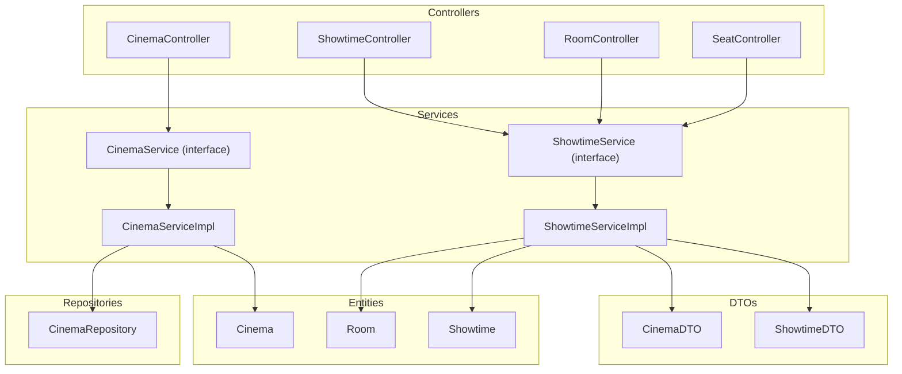
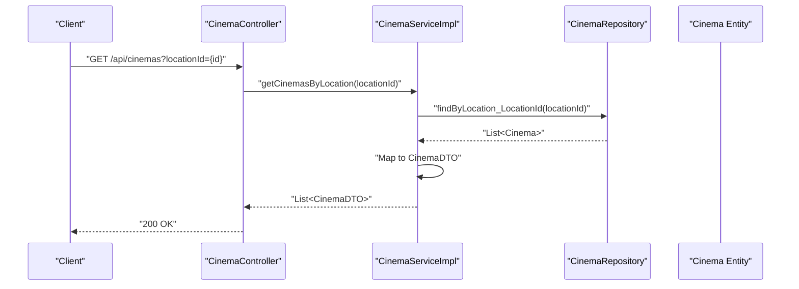
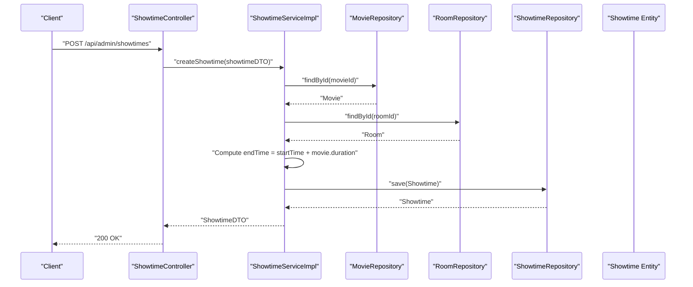
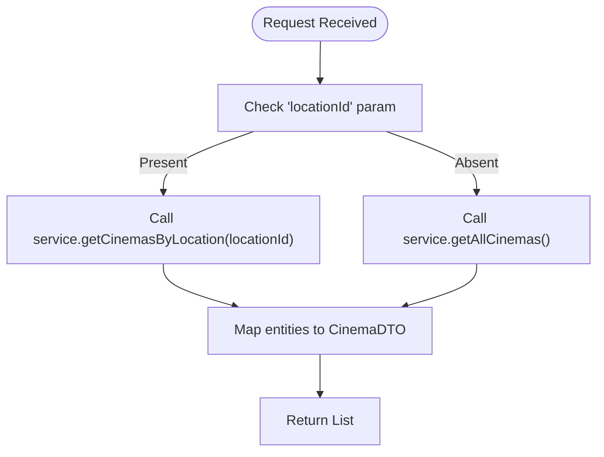
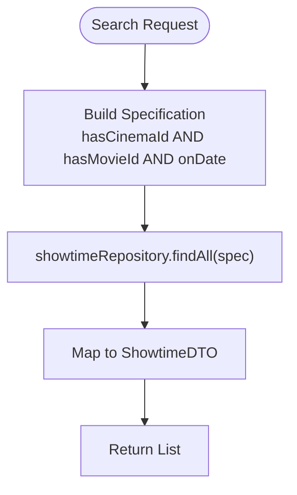
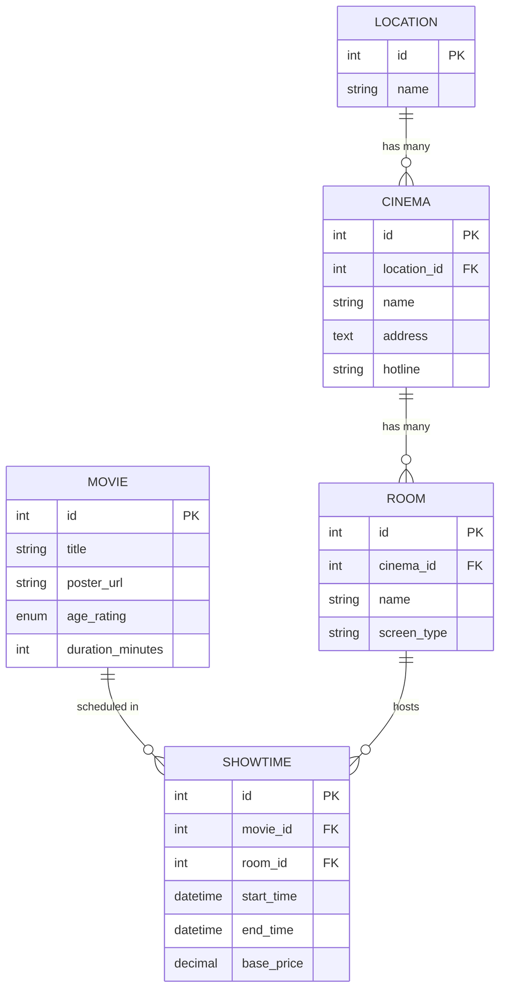
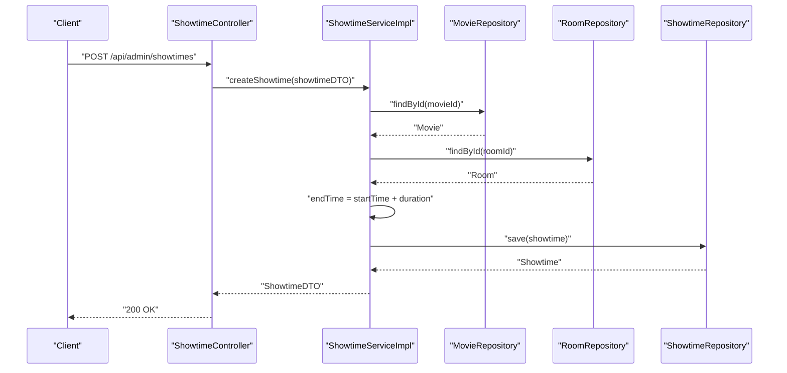
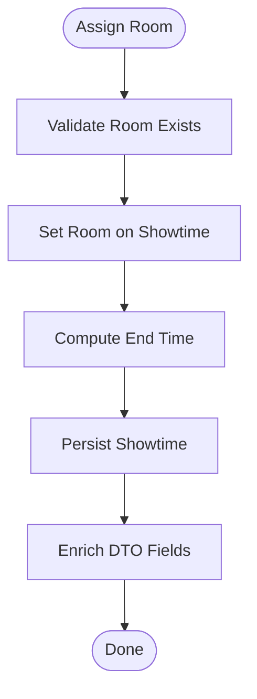
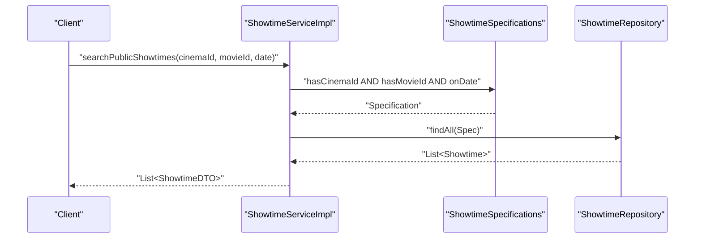
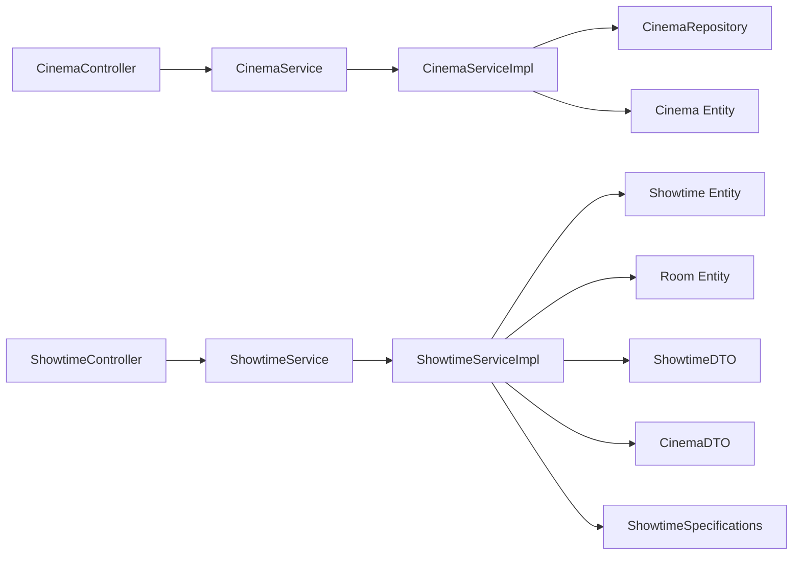

# Cinema and Showtime Controller

<cite>
**Referenced Files in This Document**
- [CinemaController.java](file://backend/src/main/java/com/cinema/booking/controllers/CinemaController.java)
- [ShowtimeController.java](file://backend/src/main/java/com/cinema/booking/controllers/ShowtimeController.java)
- [CinemaService.java](file://backend/src/main/java/com/cinema/booking/services/CinemaService.java)
- [ShowtimeService.java](file://backend/src/main/java/com/cinema/booking/services/ShowtimeService.java)
- [CinemaServiceImpl.java](file://backend/src/main/java/com/cinema/booking/services/impl/CinemaServiceImpl.java)
- [ShowtimeServiceImpl.java](file://backend/src/main/java/com/cinema/booking/services/impl/ShowtimeServiceImpl.java)
- [CinemaDTO.java](file://backend/src/main/java/com/cinema/booking/dtos/CinemaDTO.java)
- [ShowtimeDTO.java](file://backend/src/main/java/com/cinema/booking/dtos/ShowtimeDTO.java)
- [Cinema.java](file://backend/src/main/java/com/cinema/booking/entities/Cinema.java)
- [Room.java](file://backend/src/main/java/com/cinema/booking/entities/Room.java)
- [Showtime.java](file://backend/src/main/java/com/cinema/booking/entities/Showtime.java)
- [CinemaRepository.java](file://backend/src/main/java/com/cinema/booking/repositories/CinemaRepository.java)
- [RoomController.java](file://backend/src/main/java/com/cinema/booking/controllers/RoomController.java)
- [SeatController.java](file://backend/src/main/java/com/cinema/booking/controllers/SeatController.java)
- [ShowtimeSpecifications.java](file://backend/src/main/java/com/cinema/booking/patterns/specification/ShowtimeSpecifications.java)
</cite>

## Table of Contents
1. [Introduction](#introduction)
2. [Project Structure](#project-structure)
3. [Core Components](#core-components)
4. [Architecture Overview](#architecture-overview)
5. [Detailed Component Analysis](#detailed-component-analysis)
6. [Dependency Analysis](#dependency-analysis)
7. [Performance Considerations](#performance-considerations)
8. [Troubleshooting Guide](#troubleshooting-guide)
9. [Conclusion](#conclusion)

## Introduction
This document provides comprehensive documentation for the Cinema and Showtime Controllers responsible for managing venues and scheduling operations. It covers:
- Cinema endpoints for venue management, room allocation, and facility administration
- Showtime endpoints for movie scheduling, seat configuration, and availability management
- The relationships among cinemas, rooms, and showtimes, including capacity constraints and scheduling conflict prevention
- Filtering and search capabilities for showtimes and cinema availability
- Practical workflows for showtime creation, room assignment, and schedule management

## Project Structure
The relevant components are organized around Spring MVC controllers, service interfaces and implementations, DTOs, JPA entities, and repositories. The controllers expose REST endpoints under dedicated paths, delegating business logic to services and persistence via repositories.

**Diagram sources**
- [CinemaController.java:1-51](file://backend/src/main/java/com/cinema/booking/controllers/CinemaController.java#L1-L51)
- [ShowtimeController.java:1-54](file://backend/src/main/java/com/cinema/booking/controllers/ShowtimeController.java#L1-L54)
- [RoomController.java:1-51](file://backend/src/main/java/com/cinema/booking/controllers/RoomController.java#L1-L51)
- [SeatController.java:1-60](file://backend/src/main/java/com/cinema/booking/controllers/SeatController.java#L1-L60)
- [CinemaService.java:1-14](file://backend/src/main/java/com/cinema/booking/services/CinemaService.java#L1-L14)
- [ShowtimeService.java:1-15](file://backend/src/main/java/com/cinema/booking/services/ShowtimeService.java#L1-L15)
- [CinemaServiceImpl.java:1-92](file://backend/src/main/java/com/cinema/booking/services/impl/CinemaServiceImpl.java#L1-L92)
- [ShowtimeServiceImpl.java:1-126](file://backend/src/main/java/com/cinema/booking/services/impl/ShowtimeServiceImpl.java#L1-L126)
- [CinemaDTO.java:1-25](file://backend/src/main/java/com/cinema/booking/dtos/CinemaDTO.java#L1-L25)
- [ShowtimeDTO.java:1-38](file://backend/src/main/java/com/cinema/booking/dtos/ShowtimeDTO.java#L1-L38)
- [Cinema.java:1-32](file://backend/src/main/java/com/cinema/booking/entities/Cinema.java#L1-L32)
- [Room.java:1-28](file://backend/src/main/java/com/cinema/booking/entities/Room.java#L1-L28)
- [Showtime.java:1-38](file://backend/src/main/java/com/cinema/booking/entities/Showtime.java#L1-L38)
- [CinemaRepository.java:1-14](file://backend/src/main/java/com/cinema/booking/repositories/CinemaRepository.java#L1-L14)

**Section sources**
- [CinemaController.java:1-51](file://backend/src/main/java/com/cinema/booking/controllers/CinemaController.java#L1-L51)
- [ShowtimeController.java:1-54](file://backend/src/main/java/com/cinema/booking/controllers/ShowtimeController.java#L1-L54)
- [RoomController.java:1-51](file://backend/src/main/java/com/cinema/booking/controllers/RoomController.java#L1-L51)
- [SeatController.java:1-60](file://backend/src/main/java/com/cinema/booking/controllers/SeatController.java#L1-L60)

## Core Components
- CinemaController: Exposes endpoints to list, retrieve, create, update, and delete cinemas. Supports filtering by location.
- ShowtimeController: Exposes endpoints to list, retrieve, create, update, and delete showtimes. Includes public search by cinema, movie, and date.
- CinemaService and CinemaServiceImpl: Encapsulate business logic for cinema CRUD operations and location-based queries.
- ShowtimeService and ShowtimeServiceImpl: Encapsulate showtime CRUD, automatic end-time calculation, and public search using specifications.
- DTOs: CinemaDTO and ShowtimeDTO define request/response shapes and enriched fields for UI rendering.
- Entities: Cinema, Room, and Showtime define the core domain model and relationships.
- Repositories: Access layer for persistence; CinemaRepository adds a location-based finder.

Key responsibilities:
- CinemaController delegates to CinemaService for venue management.
- ShowtimeController delegates to ShowtimeService for scheduling operations.
- ShowtimeServiceImpl computes end times based on movie duration and applies search filters via ShowtimeSpecifications.

**Section sources**
- [CinemaController.java:1-51](file://backend/src/main/java/com/cinema/booking/controllers/CinemaController.java#L1-L51)
- [ShowtimeController.java:1-54](file://backend/src/main/java/com/cinema/booking/controllers/ShowtimeController.java#L1-L54)
- [CinemaService.java:1-14](file://backend/src/main/java/com/cinema/booking/services/CinemaService.java#L1-L14)
- [ShowtimeService.java:1-15](file://backend/src/main/java/com/cinema/booking/services/ShowtimeService.java#L1-L15)
- [CinemaServiceImpl.java:1-92](file://backend/src/main/java/com/cinema/booking/services/impl/CinemaServiceImpl.java#L1-L92)
- [ShowtimeServiceImpl.java:1-126](file://backend/src/main/java/com/cinema/booking/services/impl/ShowtimeServiceImpl.java#L1-L126)
- [CinemaDTO.java:1-25](file://backend/src/main/java/com/cinema/booking/dtos/CinemaDTO.java#L1-L25)
- [ShowtimeDTO.java:1-38](file://backend/src/main/java/com/cinema/booking/dtos/ShowtimeDTO.java#L1-L38)
- [CinemaRepository.java:1-14](file://backend/src/main/java/com/cinema/booking/repositories/CinemaRepository.java#L1-L14)

## Architecture Overview
The system follows a layered architecture:
- Presentation Layer: Controllers handle HTTP requests and responses.
- Application Layer: Services define business operations and orchestrate data transformations.
- Persistence Layer: Repositories provide data access; entities represent domain objects.

**Diagram sources**
- [CinemaController.java:20-28](file://backend/src/main/java/com/cinema/booking/controllers/CinemaController.java#L20-L28)
- [CinemaServiceImpl.java:46-48](file://backend/src/main/java/com/cinema/booking/services/impl/CinemaServiceImpl.java#L46-L48)
- [CinemaRepository.java:11-13](file://backend/src/main/java/com/cinema/booking/repositories/CinemaRepository.java#L11-L13)
- [Cinema.java:1-32](file://backend/src/main/java/com/cinema/booking/entities/Cinema.java#L1-L32)

**Diagram sources**
- [ShowtimeController.java:35-39](file://backend/src/main/java/com/cinema/booking/controllers/ShowtimeController.java#L35-L39)
- [ShowtimeServiceImpl.java:72-89](file://backend/src/main/java/com/cinema/booking/services/impl/ShowtimeServiceImpl.java#L72-L89)
- [Showtime.java:1-38](file://backend/src/main/java/com/cinema/booking/entities/Showtime.java#L1-L38)

## Detailed Component Analysis

### Cinema Management Endpoints
Endpoints:
- GET /api/cinemas: Retrieve all cinemas or filter by locationId.
- GET /api/cinemas/{id}: Retrieve a cinema by ID.
- POST /api/cinemas: Create a new cinema.
- PUT /api/cinemas/{id}: Update an existing cinema.
- DELETE /api/cinemas/{id}: Delete a cinema.

Operational behavior:
- Filtering by locationId is supported; otherwise, all cinemas are returned.
- Validation ensures required fields are present in requests.
- Service maps entities to DTOs, enriching with location metadata.

**Diagram sources**
- [CinemaController.java:21-28](file://backend/src/main/java/com/cinema/booking/controllers/CinemaController.java#L21-L28)
- [CinemaServiceImpl.java:40-48](file://backend/src/main/java/com/cinema/booking/services/impl/CinemaServiceImpl.java#L40-L48)

**Section sources**
- [CinemaController.java:20-49](file://backend/src/main/java/com/cinema/booking/controllers/CinemaController.java#L20-L49)
- [CinemaServiceImpl.java:40-55](file://backend/src/main/java/com/cinema/booking/services/impl/CinemaServiceImpl.java#L40-L55)
- [CinemaDTO.java:1-25](file://backend/src/main/java/com/cinema/booking/dtos/CinemaDTO.java#L1-L25)
- [CinemaRepository.java:11-13](file://backend/src/main/java/com/cinema/booking/repositories/CinemaRepository.java#L11-L13)

### Showtime Management Endpoints
Endpoints:
- GET /api/admin/showtimes: Retrieve all showtimes.
- GET /api/admin/showtimes/{id}: Retrieve a showtime by ID.
- POST /api/admin/showtimes: Create a new showtime.
- PUT /api/admin/showtimes/{id}: Update an existing showtime.
- DELETE /api/admin/showtimes/{id}: Delete a showtime.

Public search:
- GET /api/public/showtimes?cinemaId={id}&movieId={id}&date={YYYY-MM-DD}: Filter showtimes by cinema, movie, and date.

Behavior:
- Automatic end time computation using movie duration.
- DTO enrichment with movie and room details for UI rendering.
- Public search uses JPA Specifications to combine conditions.

**Diagram sources**
- [ShowtimeController.java:23-27](file://backend/src/main/java/com/cinema/booking/controllers/ShowtimeController.java#L23-L27)
- [ShowtimeServiceImpl.java:115-124](file://backend/src/main/java/com/cinema/booking/services/impl/ShowtimeServiceImpl.java#L115-L124)
- [ShowtimeSpecifications.java:18-51](file://backend/src/main/java/com/cinema/booking/patterns/specification/ShowtimeSpecifications.java#L18-L51)

**Section sources**
- [ShowtimeController.java:23-52](file://backend/src/main/java/com/cinema/booking/controllers/ShowtimeController.java#L23-L52)
- [ShowtimeService.java:7-14](file://backend/src/main/java/com/cinema/booking/services/ShowtimeService.java#L7-L14)
- [ShowtimeServiceImpl.java:71-108](file://backend/src/main/java/com/cinema/booking/services/impl/ShowtimeServiceImpl.java#L71-L108)
- [ShowtimeDTO.java:1-38](file://backend/src/main/java/com/cinema/booking/dtos/ShowtimeDTO.java#L1-L38)
- [ShowtimeSpecifications.java:1-53](file://backend/src/main/java/com/cinema/booking/patterns/specification/ShowtimeSpecifications.java#L1-L53)

### Room and Seat Management (Supporting Infrastructure)
Rooms:
- GET /api/rooms: List all rooms or filter by cinemaId.
- GET /api/rooms/{id}, POST /api/rooms, PUT /api/rooms/{id}, DELETE /api/rooms/{id}.

Seats:
- GET /api/seats: List all seats or filter by roomId.
- GET /api/seats/{id}, POST /api/seats, PUT /api/seats/{id}, DELETE /api/seats/{id}.
- PUT /api/seats/batch/{roomId}: Batch replace all seats in a room.

These endpoints support seat configuration and availability management, complementing showtime scheduling.

**Section sources**
- [RoomController.java:20-49](file://backend/src/main/java/com/cinema/booking/controllers/RoomController.java#L20-L49)
- [SeatController.java:20-58](file://backend/src/main/java/com/cinema/booking/controllers/SeatController.java#L20-L58)

### Data Model and Relationships
The domain model connects cinemas, rooms, movies, and showtimes. Showtime links a movie and a room, storing start and end times and base price.

**Diagram sources**
- [Cinema.java:1-32](file://backend/src/main/java/com/cinema/booking/entities/Cinema.java#L1-L32)
- [Room.java:1-28](file://backend/src/main/java/com/cinema/booking/entities/Room.java#L1-L28)
- [Showtime.java:1-38](file://backend/src/main/java/com/cinema/booking/entities/Showtime.java#L1-L38)

**Section sources**
- [Cinema.java:18-29](file://backend/src/main/java/com/cinema/booking/entities/Cinema.java#L18-L29)
- [Room.java:18-26](file://backend/src/main/java/com/cinema/booking/entities/Room.java#L18-L26)
- [Showtime.java:20-35](file://backend/src/main/java/com/cinema/booking/entities/Showtime.java#L20-L35)

### Capacity Constraints and Scheduling Conflicts
Current implementation highlights:
- End time calculation: The service computes end time as start time plus movie duration, ensuring logical continuity.
- Room assignment: Showtime creation requires a valid room; updates enforce room existence.
- Date-based filtering: Public search narrows results to a specific calendar day using a half-open interval.

Limitations and considerations:
- No explicit conflict detection exists for overlapping showtimes in the same room. This could lead to scheduling conflicts if not managed externally.
- Capacity constraints are not enforced at the showtime level; seat inventory and occupancy are handled separately via seat management endpoints.

Recommendations:
- Add a uniqueness constraint or pre-check for overlapping showtimes per room within a time window.
- Integrate seat inventory checks during showtime creation/update to prevent over-booking scenarios.

**Section sources**
- [ShowtimeServiceImpl.java:83-84](file://backend/src/main/java/com/cinema/booking/services/impl/ShowtimeServiceImpl.java#L83-L84)
- [ShowtimeSpecifications.java:41-51](file://backend/src/main/java/com/cinema/booking/patterns/specification/ShowtimeSpecifications.java#L41-L51)

### Workflows

#### Showtime Creation Workflow
Steps:
1. Client sends a request to create a showtime with movieId, roomId, startTime, and basePrice.
2. Service validates movie and room existence.
3. End time is computed as start time plus movie duration.
4. Showtime is persisted and returned as DTO with enriched fields.

**Diagram sources**
- [ShowtimeController.java:35-39](file://backend/src/main/java/com/cinema/booking/controllers/ShowtimeController.java#L35-L39)
- [ShowtimeServiceImpl.java:72-89](file://backend/src/main/java/com/cinema/booking/services/impl/ShowtimeServiceImpl.java#L72-L89)

#### Room Assignment Workflow
Steps:
1. Create or update a showtime with a valid roomId.
2. The service fetches the room and movie to ensure validity.
3. Enrichment populates cinema and room details in the DTO.

**Diagram sources**
- [ShowtimeServiceImpl.java:75-104](file://backend/src/main/java/com/cinema/booking/services/impl/ShowtimeServiceImpl.java#L75-L104)

#### Schedule Management Workflow (Public Search)
Steps:
1. Client requests showtimes filtered by cinemaId, movieId, and date.
2. Service constructs a Specification combining all three predicates.
3. Results are mapped to DTOs for UI consumption.

**Diagram sources**
- [ShowtimeService.java](file://backend/src/main/java/com/cinema/booking/services/ShowtimeService.java#L13)
- [ShowtimeServiceImpl.java:115-124](file://backend/src/main/java/com/cinema/booking/services/impl/ShowtimeServiceImpl.java#L115-L124)
- [ShowtimeSpecifications.java:18-51](file://backend/src/main/java/com/cinema/booking/patterns/specification/ShowtimeSpecifications.java#L18-L51)

## Dependency Analysis
- Controllers depend on services for business logic.
- Services depend on repositories for persistence and entities for domain modeling.
- ShowtimeServiceImpl uses ShowtimeSpecifications to build dynamic queries.
- DTOs decouple presentation from entities, enabling controlled exposure of fields.

**Diagram sources**
- [CinemaController.java:1-51](file://backend/src/main/java/com/cinema/booking/controllers/CinemaController.java#L1-L51)
- [ShowtimeController.java:1-54](file://backend/src/main/java/com/cinema/booking/controllers/ShowtimeController.java#L1-L54)
- [CinemaServiceImpl.java:1-92](file://backend/src/main/java/com/cinema/booking/services/impl/CinemaServiceImpl.java#L1-L92)
- [ShowtimeServiceImpl.java:1-126](file://backend/src/main/java/com/cinema/booking/services/impl/ShowtimeServiceImpl.java#L1-L126)
- [ShowtimeSpecifications.java:1-53](file://backend/src/main/java/com/cinema/booking/patterns/specification/ShowtimeSpecifications.java#L1-L53)

**Section sources**
- [CinemaServiceImpl.java:1-92](file://backend/src/main/java/com/cinema/booking/services/impl/CinemaServiceImpl.java#L1-L92)
- [ShowtimeServiceImpl.java:1-126](file://backend/src/main/java/com/cinema/booking/services/impl/ShowtimeServiceImpl.java#L1-L126)
- [ShowtimeSpecifications.java:1-53](file://backend/src/main/java/com/cinema/booking/patterns/specification/ShowtimeSpecifications.java#L1-L53)

## Performance Considerations
- Use pagination for large datasets when listing cinemas and showtimes.
- Indexes on frequently queried columns (e.g., location_id, cinema_id, movie_id, start_time) improve query performance.
- DTO projection can reduce payload sizes by selecting only required fields.
- Consider caching for read-heavy operations like listing all cinemas or rooms.

## Troubleshooting Guide
Common issues and resolutions:
- Resource not found errors: Controllers and services throw runtime exceptions when entities are missing (e.g., cinema, room, movie, showtime). Ensure IDs are valid before invoking endpoints.
- Validation failures: DTOs enforce non-null and non-blank constraints. Verify request payloads meet validation criteria.
- End time mismatches: End time is derived from start time and movie duration. If discrepancies occur, check movie duration and start time values.
- Date filtering edge cases: Public search uses a half-open interval [date 00:00, date+1 00:00). Confirm client-side date formatting and timezone handling.

**Section sources**
- [CinemaServiceImpl.java:52-54](file://backend/src/main/java/com/cinema/booking/services/impl/CinemaServiceImpl.java#L52-L54)
- [ShowtimeServiceImpl.java:66-68](file://backend/src/main/java/com/cinema/booking/services/impl/ShowtimeServiceImpl.java#L66-L68)
- [ShowtimeSpecifications.java:42-49](file://backend/src/main/java/com/cinema/booking/patterns/specification/ShowtimeSpecifications.java#L42-L49)

## Conclusion
The Cinema and Showtime Controllers provide a robust foundation for venue and scheduling operations. They support venue management, room allocation, and showtime creation with automatic end time computation and public search capabilities. While current implementations focus on basic CRUD and filtering, enhancements such as conflict detection and capacity enforcement would further strengthen operational reliability and user experience.