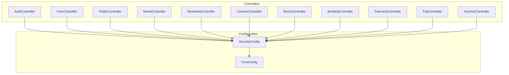
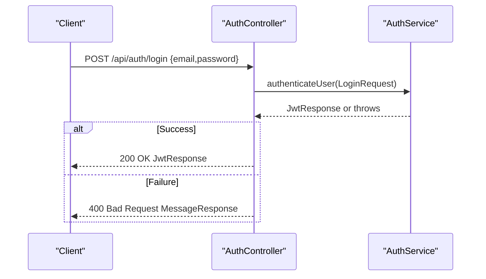
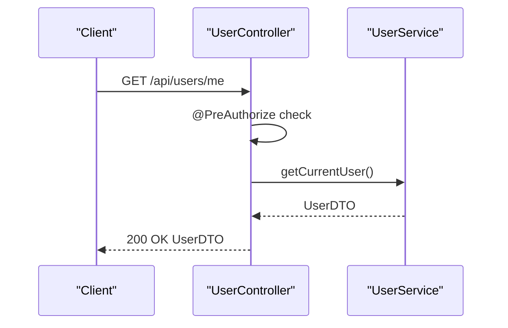
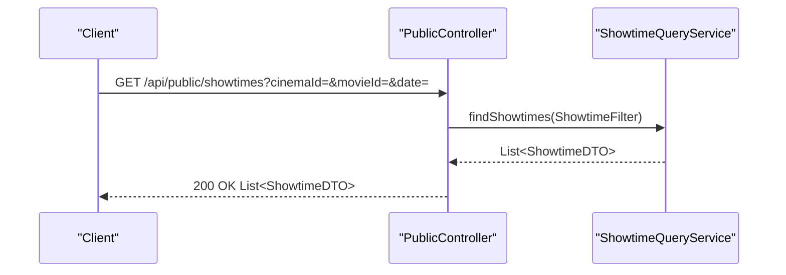
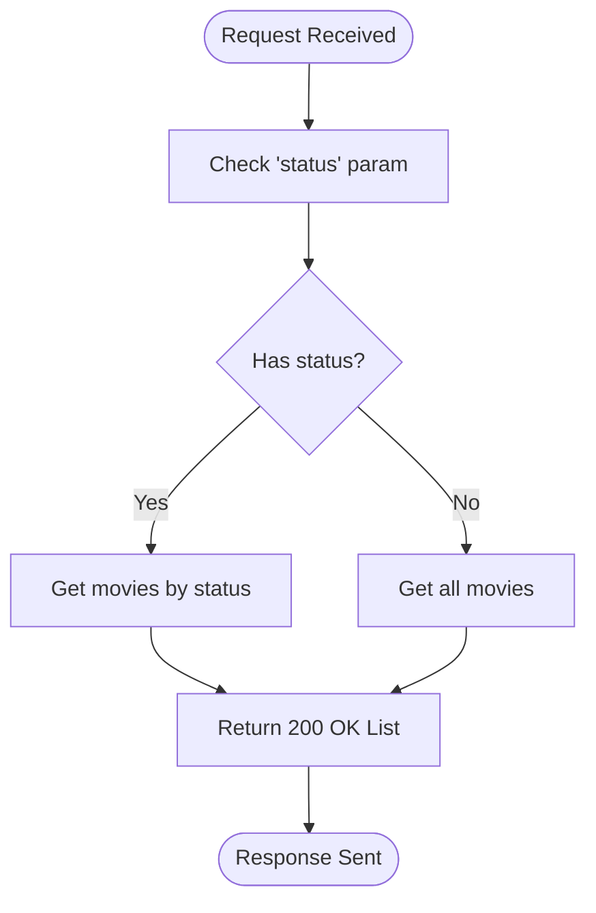
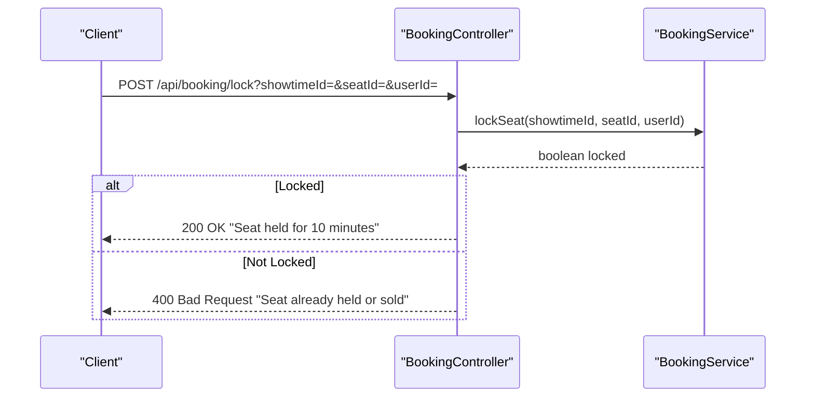
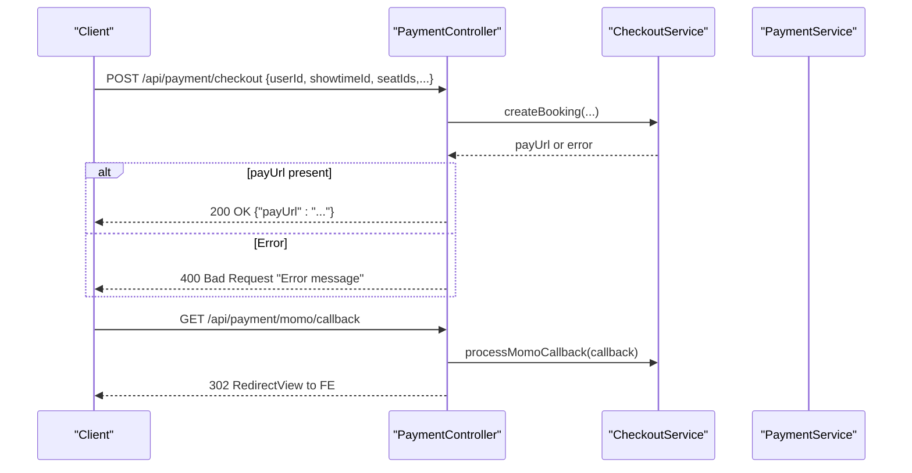
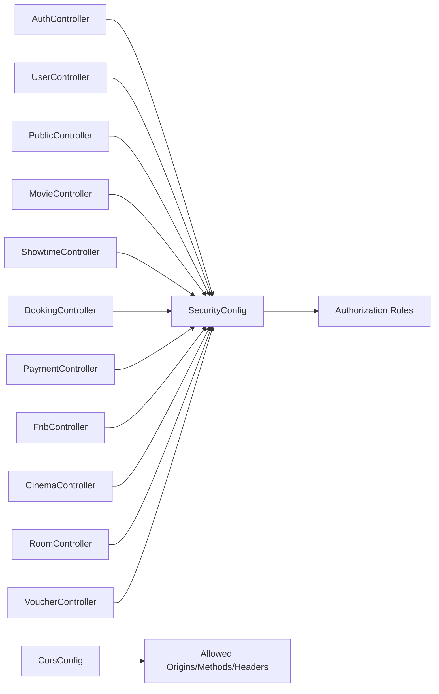

# Controller Layer Implementation

<cite>
**Referenced Files in This Document**
- [AuthController.java](file://backend/src/main/java/com/cinema/booking/controllers/AuthController.java)
- [UserController.java](file://backend/src/main/java/com/cinema/booking/controllers/UserController.java)
- [MovieController.java](file://backend/src/main/java/com/cinema/booking/controllers/MovieController.java)
- [BookingController.java](file://backend/src/main/java/com/cinema/booking/controllers/BookingController.java)
- [PaymentController.java](file://backend/src/main/java/com/cinema/booking/controllers/PaymentController.java)
- [ShowtimeController.java](file://backend/src/main/java/com/cinema/booking/controllers/ShowtimeController.java)
- [CinemaController.java](file://backend/src/main/java/com/cinema/booking/controllers/CinemaController.java)
- [RoomController.java](file://backend/src/main/java/com/cinema/booking/controllers/RoomController.java)
- [FnbController.java](file://backend/src/main/java/com/cinema/booking/controllers/FnbController.java)
- [VoucherController.java](file://backend/src/main/java/com/cinema/booking/controllers/VoucherController.java)
- [PublicController.java](file://backend/src/main/java/com/cinema/booking/controllers/PublicController.java)
- [SecurityConfig.java](file://backend/src/main/java/com/cinema/booking/config/SecurityConfig.java)
- [CorsConfig.java](file://backend/src/main/java/com/cinema/booking/config/CorsConfig.java)
- [LoginRequest.java](file://backend/src/main/java/com/cinema/booking/dtos/LoginRequest.java)
- [SignupRequest.java](file://backend/src/main/java/com/cinema/booking/dtos/SignupRequest.java)
</cite>

## Table of Contents
1. [Introduction](#introduction)
2. [Project Structure](#project-structure)
3. [Core Components](#core-components)
4. [Architecture Overview](#architecture-overview)
5. [Detailed Component Analysis](#detailed-component-analysis)
6. [Dependency Analysis](#dependency-analysis)
7. [Performance Considerations](#performance-considerations)
8. [Troubleshooting Guide](#troubleshooting-guide)
9. [Conclusion](#conclusion)
10. [Appendices](#appendices)

## Introduction
This document provides a comprehensive guide to the Spring MVC controller layer of the cinema booking system. It explains RESTful API design principles, HTTP method mappings, endpoint organization, controller responsibilities, parameter binding, request validation, response formatting, authentication decorators, role-based endpoint protection, and CORS configuration. Practical examples of controller methods are included for each major resource (authentication, users, movies, bookings, payments, showtimes, cinemas, rooms, F&B, vouchers, and public endpoints). Error handling strategies, exception mapping, and API documentation patterns are documented alongside controller testing approaches, mock implementations, and integration testing strategies.

## Project Structure
The controller layer is organized by feature domains under the controllers package. Controllers are grouped by responsibility:
- Authentication and user profile management
- Public-facing endpoints for browsing movies, showtimes, and F&B
- Administrative endpoints for managing movies, showtimes, and F&B categories/items
- Booking engine endpoints for seat rendering, locking, pricing calculation, and state transitions
- Payment endpoints for checkout, MoMo callbacks, webhooks, and transaction history
- Supporting resource controllers for cinemas, rooms, and vouchers

**Diagram sources**
- [AuthController.java:13-52](file://backend/src/main/java/com/cinema/booking/controllers/AuthController.java#L13-L52)
- [UserController.java:13-35](file://backend/src/main/java/com/cinema/booking/controllers/UserController.java#L13-L35)
- [PublicController.java:31-166](file://backend/src/main/java/com/cinema/booking/controllers/PublicController.java#L31-L166)
- [MovieController.java:14-63](file://backend/src/main/java/com/cinema/booking/controllers/MovieController.java#L14-L63)
- [ShowtimeController.java:14-53](file://backend/src/main/java/com/cinema/booking/controllers/ShowtimeController.java#L14-L53)
- [CinemaController.java:12-50](file://backend/src/main/java/com/cinema/booking/controllers/CinemaController.java#L12-L50)
- [RoomController.java:12-50](file://backend/src/main/java/com/cinema/booking/controllers/RoomController.java#L12-L50)
- [BookingController.java:16-113](file://backend/src/main/java/com/cinema/booking/controllers/BookingController.java#L16-L113)
- [PaymentController.java:16-149](file://backend/src/main/java/com/cinema/booking/controllers/PaymentController.java#L16-L149)
- [FnbController.java:19-155](file://backend/src/main/java/com/cinema/booking/controllers/FnbController.java#L19-L155)
- [VoucherController.java:15-55](file://backend/src/main/java/com/cinema/booking/controllers/VoucherController.java#L15-L55)
- [SecurityConfig.java:24-79](file://backend/src/main/java/com/cinema/booking/config/SecurityConfig.java#L24-L79)
- [CorsConfig.java:13-37](file://backend/src/main/java/com/cinema/booking/config/CorsConfig.java#L13-L37)

**Section sources**
- [AuthController.java:13-52](file://backend/src/main/java/com/cinema/booking/controllers/AuthController.java#L13-L52)
- [UserController.java:13-35](file://backend/src/main/java/com/cinema/booking/controllers/UserController.java#L13-L35)
- [PublicController.java:31-166](file://backend/src/main/java/com/cinema/booking/controllers/PublicController.java#L31-L166)
- [MovieController.java:14-63](file://backend/src/main/java/com/cinema/booking/controllers/MovieController.java#L14-L63)
- [ShowtimeController.java:14-53](file://backend/src/main/java/com/cinema/booking/controllers/ShowtimeController.java#L14-L53)
- [CinemaController.java:12-50](file://backend/src/main/java/com/cinema/booking/controllers/CinemaController.java#L12-L50)
- [RoomController.java:12-50](file://backend/src/main/java/com/cinema/booking/controllers/RoomController.java#L12-L50)
- [BookingController.java:16-113](file://backend/src/main/java/com/cinema/booking/controllers/BookingController.java#L16-L113)
- [PaymentController.java:16-149](file://backend/src/main/java/com/cinema/booking/controllers/PaymentController.java#L16-L149)
- [FnbController.java:19-155](file://backend/src/main/java/com/cinema/booking/controllers/FnbController.java#L19-L155)
- [VoucherController.java:15-55](file://backend/src/main/java/com/cinema/booking/controllers/VoucherController.java#L15-L55)
- [SecurityConfig.java:24-79](file://backend/src/main/java/com/cinema/booking/config/SecurityConfig.java#L24-L79)
- [CorsConfig.java:13-37](file://backend/src/main/java/com/cinema/booking/config/CorsConfig.java#L13-L37)

## Core Components
- RESTful controllers annotated with @RestController and @RequestMapping define base paths per domain.
- @CrossOrigin enables CORS for all endpoints in each controller.
- Parameter binding via @RequestParam, @PathVariable, @RequestBody, and @ModelAttribute supports diverse request shapes.
- Validation via @Valid on DTOs ensures request integrity.
- Response formatting via ResponseEntity wraps HTTP responses consistently.
- Role-based access control via @PreAuthorize and global method security via @EnableMethodSecurity enforce authorization.
- Swagger annotations (@Operation, @Tag) document endpoints for OpenAPI/Swagger UI.

Key examples:
- Authentication endpoints for login, registration, and Google login.
- User profile retrieval and updates with role-based protection.
- Public endpoints for browsing movies, showtimes, locations, and F&B.
- Admin endpoints for managing movies and F&B.
- Booking engine endpoints for seat status, locking/unlocking, price calculation, and state transitions.
- Payment endpoints for checkout, MoMo redirect/callback/webhook, and transaction history.
- Resource endpoints for cinemas, rooms, and vouchers.

**Section sources**
- [AuthController.java:21-52](file://backend/src/main/java/com/cinema/booking/controllers/AuthController.java#L21-L52)
- [UserController.java:22-34](file://backend/src/main/java/com/cinema/booking/controllers/UserController.java#L22-L34)
- [PublicController.java:62-165](file://backend/src/main/java/com/cinema/booking/controllers/PublicController.java#L62-L165)
- [MovieController.java:22-62](file://backend/src/main/java/com/cinema/booking/controllers/MovieController.java#L22-L62)
- [BookingController.java:25-112](file://backend/src/main/java/com/cinema/booking/controllers/BookingController.java#L25-L112)
- [PaymentController.java:33-148](file://backend/src/main/java/com/cinema/booking/controllers/PaymentController.java#L33-L148)
- [ShowtimeController.java:23-51](file://backend/src/main/java/com/cinema/booking/controllers/ShowtimeController.java#L23-L51)
- [FnbController.java:36-133](file://backend/src/main/java/com/cinema/booking/controllers/FnbController.java#L36-L133)
- [CinemaController.java:20-49](file://backend/src/main/java/com/cinema/booking/controllers/CinemaController.java#L20-L49)
- [RoomController.java:20-49](file://backend/src/main/java/com/cinema/booking/controllers/RoomController.java#L20-L49)
- [VoucherController.java:24-54](file://backend/src/main/java/com/cinema/booking/controllers/VoucherController.java#L24-L54)

## Architecture Overview
The controller layer adheres to layered architecture:
- Controllers expose REST endpoints and delegate to service layer.
- Services encapsulate business logic and orchestrate repositories and external integrations.
- DTOs model request/response payloads and decouple persistence entities from APIs.
- Global security configuration enforces authentication and authorization policies.
- CORS configuration allows cross-origin requests from the configured frontend origin(s).

```mermaid
graph TB
Client["Client (Browser/FE)"] --> C_Auth["AuthController"]
Client --> C_User["UserController"]
Client --> C_Public["PublicController"]
Client --> C_Movie["MovieController"]
Client --> C_Showtime["ShowtimeController"]
Client --> C_Booking["BookingController"]
Client --> C_Payment["PaymentController"]
Client --> C_Fnb["FnbController"]
Client --> C_Cinema["CinemaController"]
Client --> C_Room["RoomController"]
Client --> C_Voucher["VoucherController"]
C_Auth --> S_Auth["AuthService"]
C_User --> S_User["UserService"]
C_Public --> S_Movie["MovieService"]
C_Public --> S_Cinema["CinemaService"]
C_Public --> S_Location["LocationService"]
C_Public --> S_Showtime["ShowtimeQueryService"]
C_Public --> S_FnbInv["FnbItemInventoryService"]
C_Movie --> S_Movie["MovieService"]
C_Showtime --> S_Showtime["ShowtimeService"]
C_Booking --> S_Booking["BookingService"]
C_Payment --> S_Checkout["CheckoutService"]
C_Payment --> S_Payment["PaymentService"]
C_Fnb --> Repo_Item["FnbItemRepository"]
C_Fnb --> Repo_Cat["FnbCategoryRepository"]
C_Fnb --> S_FnbInv
C_Cinema --> S_Cinema["CinemaService"]
C_Room --> S_Room["RoomService"]
C_Voucher --> S_Voucher["VoucherService"]
Sec["SecurityConfig"] --> Client
Cors["CorsConfig"] --> Client
```

**Diagram sources**
- [AuthController.java:13-52](file://backend/src/main/java/com/cinema/booking/controllers/AuthController.java#L13-L52)
- [UserController.java:13-35](file://backend/src/main/java/com/cinema/booking/controllers/UserController.java#L13-L35)
- [PublicController.java:31-166](file://backend/src/main/java/com/cinema/booking/controllers/PublicController.java#L31-L166)
- [MovieController.java:14-63](file://backend/src/main/java/com/cinema/booking/controllers/MovieController.java#L14-L63)
- [ShowtimeController.java:14-53](file://backend/src/main/java/com/cinema/booking/controllers/ShowtimeController.java#L14-L53)
- [BookingController.java:16-113](file://backend/src/main/java/com/cinema/booking/controllers/BookingController.java#L16-L113)
- [PaymentController.java:16-149](file://backend/src/main/java/com/cinema/booking/controllers/PaymentController.java#L16-L149)
- [FnbController.java:19-155](file://backend/src/main/java/com/cinema/booking/controllers/FnbController.java#L19-L155)
- [CinemaController.java:12-50](file://backend/src/main/java/com/cinema/booking/controllers/CinemaController.java#L12-L50)
- [RoomController.java:12-50](file://backend/src/main/java/com/cinema/booking/controllers/RoomController.java#L12-L50)
- [VoucherController.java:15-55](file://backend/src/main/java/com/cinema/booking/controllers/VoucherController.java#L15-L55)
- [SecurityConfig.java:24-79](file://backend/src/main/java/com/cinema/booking/config/SecurityConfig.java#L24-L79)
- [CorsConfig.java:13-37](file://backend/src/main/java/com/cinema/booking/config/CorsConfig.java#L13-L37)

## Detailed Component Analysis

### Authentication Controller
Responsibilities:
- Authenticate users with email/password.
- Register new users.
- Google login using ID token.
- Return JWT-based authentication responses or error messages.

HTTP Methods and Endpoints:
- POST /api/auth/login
- POST /api/auth/register
- POST /api/auth/google-login

Parameter Binding and Validation:
- @Valid @RequestBody for LoginRequest and SignupRequest DTOs.
- Map-based request for Google login payload.

Response Formatting:
- ResponseEntity.ok(...) for successful operations.
- ResponseEntity.badRequest(...) for validation or authentication failures.

Error Handling:
- Try/catch blocks wrap service calls and return structured error messages.

**Diagram sources**
- [AuthController.java:21-31](file://backend/src/main/java/com/cinema/booking/controllers/AuthController.java#L21-L31)
- [LoginRequest.java:7-12](file://backend/src/main/java/com/cinema/booking/dtos/LoginRequest.java#L7-L12)

**Section sources**
- [AuthController.java:21-52](file://backend/src/main/java/com/cinema/booking/controllers/AuthController.java#L21-L52)
- [LoginRequest.java:7-12](file://backend/src/main/java/com/cinema/booking/dtos/LoginRequest.java#L7-L12)
- [SignupRequest.java:9-24](file://backend/src/main/java/com/cinema/booking/dtos/SignupRequest.java#L9-L24)

### User Controller
Responsibilities:
- Retrieve current user profile.
- Update current user profile.

HTTP Methods and Endpoints:
- GET /api/users/me
- PUT /api/users/me

Authorization Decorators:
- @PreAuthorize("hasRole('USER') or hasRole('ADMIN') or hasRole('STAFF')")

Response Formatting:
- ResponseEntity.ok(...) returns UserDTO.

**Diagram sources**
- [UserController.java:22-27](file://backend/src/main/java/com/cinema/booking/controllers/UserController.java#L22-L27)

**Section sources**
- [UserController.java:22-34](file://backend/src/main/java/com/cinema/booking/controllers/UserController.java#L22-L34)

### Public Controller
Responsibilities:
- Expose public endpoints for browsing movies, showtimes, locations, and F&B.
- Support filtering showtimes using a builder pattern.

HTTP Methods and Endpoints:
- GET /api/public/movies/now-showing
- GET /api/public/movies/coming-soon
- GET /api/public/cinemas
- GET /api/public/locations
- GET /api/public/showtimes
- GET /api/public/showtimes/filter
- GET /api/public/fnb/categories
- GET /api/public/fnb/items

Filtering and Query Parameters:
- Supports cinemaId, movieId, date, locationId, screenType, minPrice, maxPrice.

Response Formatting:
- ResponseEntity.ok(...) returns lists or DTOs.

**Diagram sources**
- [PublicController.java:94-108](file://backend/src/main/java/com/cinema/booking/controllers/PublicController.java#L94-L108)

**Section sources**
- [PublicController.java:62-165](file://backend/src/main/java/com/cinema/booking/controllers/PublicController.java#L62-L165)

### Movie Controller
Responsibilities:
- Manage movies: list, retrieve by ID, create, update, delete.
- Replace cast list for a movie.

HTTP Methods and Endpoints:
- GET /api/movies
- GET /api/movies/{id}
- POST /api/movies
- PUT /api/movies/{id}
- PUT /api/movies/{id}/casts
- DELETE /api/movies/{id}

Query Parameters:
- status for filtering by MovieStatus.

Response Formatting:
- ResponseEntity.ok(...) returns MovieDTO or lists.

Authorization:
- Admin/Staff roles required for POST/PUT/DELETE on movies.

**Diagram sources**
- [MovieController.java:22-30](file://backend/src/main/java/com/cinema/booking/controllers/MovieController.java#L22-L30)

**Section sources**
- [MovieController.java:22-62](file://backend/src/main/java/com/cinema/booking/controllers/MovieController.java#L22-L62)

### Showtime Controller
Responsibilities:
- Manage showtimes: list, retrieve by ID, create, update, delete.

HTTP Methods and Endpoints:
- GET /api/admin/showtimes
- GET /api/admin/showtimes/{id}
- POST /api/admin/showtimes
- PUT /api/admin/showtimes/{id}
- DELETE /api/admin/showtimes/{id}

Authorization:
- Admin/Staff roles required.

Response Formatting:
- ResponseEntity.ok(...) returns ShowtimeDTO or empty with 200.

**Section sources**
- [ShowtimeController.java:23-51](file://backend/src/main/java/com/cinema/booking/controllers/ShowtimeController.java#L23-L51)

### Booking Controller
Responsibilities:
- Seat rendering and status retrieval.
- Redis-based seat locking/unlocking.
- Price calculation for tickets and F&B.
- Booking detail retrieval.
- Search bookings (staff).
- Booking state transitions: cancel, refund, print.

HTTP Methods and Endpoints:
- GET /api/booking/seats/{showtimeId}
- POST /api/booking/lock
- POST /api/booking/unlock
- POST /api/booking/calculate
- GET /api/booking/{bookingId}
- GET /api/booking/search
- POST /api/booking/{bookingId}/cancel
- POST /api/booking/{bookingId}/refund
- POST /api/booking/{bookingId}/print

Response Formatting:
- ResponseEntity.ok(...) or ResponseEntity.badRequest(...) with messages.

**Diagram sources**
- [BookingController.java:34-46](file://backend/src/main/java/com/cinema/booking/controllers/BookingController.java#L34-L46)

**Section sources**
- [BookingController.java:25-112](file://backend/src/main/java/com/cinema/booking/controllers/BookingController.java#L25-L112)

### Payment Controller
Responsibilities:
- Checkout and MoMo payment link generation.
- Demo checkout for testing.
- MoMo redirect callback and webhook processing.
- Payment result redirection.
- Payment history and details retrieval.
- Staff cash checkout.

HTTP Methods and Endpoints:
- POST /api/payment/checkout
- POST /api/payment/checkout/demo
- GET /api/payment/momo/callback
- POST /api/payment/momo/webhook
- GET /api/payment/payment-redirect
- GET /api/payment/history/{userId}
- GET /api/payment/details/{paymentId}
- POST /api/payment/staff/cash-checkout

Response Formatting:
- ResponseEntity.ok(...) for success payloads.
- RedirectView for frontend redirects.

**Diagram sources**
- [PaymentController.java:33-88](file://backend/src/main/java/com/cinema/booking/controllers/PaymentController.java#L33-L88)

**Section sources**
- [PaymentController.java:31-148](file://backend/src/main/java/com/cinema/booking/controllers/PaymentController.java#L31-L148)

### F&B Controller
Responsibilities:
- Manage F&B items: list, create, update, delete.
- Manage F&B categories: list, create, update, delete.
- Inventory integration for stock quantities.

HTTP Methods and Endpoints:
- GET /api/fnb/items
- POST /api/fnb/items
- PUT /api/fnb/items/{id}
- DELETE /api/fnb/items/{id}
- GET /api/fnb/categories
- POST /api/fnb/categories
- PUT /api/fnb/categories/{id}
- DELETE /api/fnb/categories/{id}

Response Formatting:
- ResponseEntity.ok(...) returns DTOs or empty with 200.

**Section sources**
- [FnbController.java:36-133](file://backend/src/main/java/com/cinema/booking/controllers/FnbController.java#L36-L133)

### Cinemas Controller
Responsibilities:
- Manage cinemas: list, retrieve by ID, create, update, delete.
- Optional filtering by locationId.

HTTP Methods and Endpoints:
- GET /api/cinemas
- GET /api/cinemas/{id}
- POST /api/cinemas
- PUT /api/cinemas/{id}
- DELETE /api/cinemas/{id}

Query Parameters:
- locationId for filtering.

**Section sources**
- [CinemaController.java:20-49](file://backend/src/main/java/com/cinema/booking/controllers/CinemaController.java#L20-L49)

### Rooms Controller
Responsibilities:
- Manage rooms: list, retrieve by ID, create, update, delete.
- Optional filtering by cinemaId.

HTTP Methods and Endpoints:
- GET /api/rooms
- GET /api/rooms/{id}
- POST /api/rooms
- PUT /api/rooms/{id}
- DELETE /api/rooms/{id}

Query Parameters:
- cinemaId for filtering.

**Section sources**
- [RoomController.java:20-49](file://backend/src/main/java/com/cinema/booking/controllers/RoomController.java#L20-L49)

### Vouchers Controller
Responsibilities:
- Manage vouchers: create, list, update, delete.
- Vouchers stored in Redis with TTL.

HTTP Methods and Endpoints:
- POST /api/vouchers
- GET /api/vouchers
- PUT /api/vouchers/{code}
- DELETE /api/vouchers/{code}

Authorization:
- Admin/Staff roles required.

**Section sources**
- [VoucherController.java:24-54](file://backend/src/main/java/com/cinema/booking/controllers/VoucherController.java#L24-L54)

## Dependency Analysis
- Controllers depend on services for business logic and repositories for persistence.
- SecurityConfig defines global authorization rules and permits public endpoints.
- CorsConfig defines allowed origins, methods, headers, credentials, and preflight caching.
- DTOs encapsulate request/response payloads and are validated via @Valid.

**Diagram sources**
- [SecurityConfig.java:57-74](file://backend/src/main/java/com/cinema/booking/config/SecurityConfig.java#L57-L74)
- [CorsConfig.java:18-36](file://backend/src/main/java/com/cinema/booking/config/CorsConfig.java#L18-L36)

**Section sources**
- [SecurityConfig.java:57-74](file://backend/src/main/java/com/cinema/booking/config/SecurityConfig.java#L57-L74)
- [CorsConfig.java:18-36](file://backend/src/main/java/com/cinema/booking/config/CorsConfig.java#L18-L36)

## Performance Considerations
- Prefer streaming or pagination for large lists where applicable.
- Use selective field projection via DTOs to minimize payload sizes.
- Cache frequently accessed public data (e.g., movies, showtimes) at the service layer.
- Minimize round trips by combining related operations where feasible.
- Use Redis for seat locking and temporary data to avoid database contention.

## Troubleshooting Guide
Common issues and resolutions:
- Authentication failures: Verify LoginRequest fields and ensure passwords are encoded. Check AuthService logs for detailed error messages.
- Authorization errors: Confirm user roles and @PreAuthorize expressions. Review SecurityConfig permitAll vs. role-based rules.
- CORS errors: Validate allowed origins and credentials in CorsConfig. Ensure frontend URL matches configured origin patterns.
- Payment callback/webhook failures: Inspect MoMo callback processing and ensure proper error logging and redirects.
- Booking seat locking conflicts: Implement retry logic and clear stale locks after timeout.

**Section sources**
- [AuthController.java:23-30](file://backend/src/main/java/com/cinema/booking/controllers/AuthController.java#L23-L30)
- [SecurityConfig.java:57-74](file://backend/src/main/java/com/cinema/booking/config/SecurityConfig.java#L57-L74)
- [CorsConfig.java:23-31](file://backend/src/main/java/com/cinema/booking/config/CorsConfig.java#L23-L31)
- [PaymentController.java:75-88](file://backend/src/main/java/com/cinema/booking/controllers/PaymentController.java#L75-L88)
- [BookingController.java:34-46](file://backend/src/main/java/com/cinema/booking/controllers/BookingController.java#L34-L46)

## Conclusion
The controller layer follows RESTful principles with clear separation of concerns, robust parameter binding and validation, consistent response formatting, and strong security enforcement. Endpoints are organized by domain, documented with Swagger annotations, and protected via method-level security. The design supports scalable enhancements and maintains maintainability through DTOs and service-layer abstraction.

## Appendices

### Authentication Decorators and Role-Based Protection
- @PreAuthorize("hasRole('USER') or hasRole('ADMIN') or hasRole('STAFF')") for user profile endpoints.
- @PreAuthorize("hasRole('ADMIN') or hasRole('STAFF')") for administrative endpoints.
- Global method security enabled via @EnableMethodSecurity(prePostEnabled = true).

**Section sources**
- [UserController.java:24-32](file://backend/src/main/java/com/cinema/booking/controllers/UserController.java#L24-L32)
- [VoucherController.java:26-50](file://backend/src/main/java/com/cinema/booking/controllers/VoucherController.java#L26-L50)
- [SecurityConfig.java:26](file://backend/src/main/java/com/cinema/booking/config/SecurityConfig.java#L26)

### CORS Configuration
- Allowed origins include configured frontend URL and typical local development origins.
- Methods, headers, and credentials are permitted with preflight cached for 1 hour.

**Section sources**
- [CorsConfig.java:23-31](file://backend/src/main/java/com/cinema/booking/config/CorsConfig.java#L23-L31)

### API Documentation Patterns
- @Operation and @Tag annotate endpoints for OpenAPI/Swagger UI.
- Descriptions explain purpose, parameters, and expected outcomes.

**Section sources**
- [BookingController.java:26-112](file://backend/src/main/java/com/cinema/booking/controllers/BookingController.java#L26-L112)
- [PaymentController.java:32-148](file://backend/src/main/java/com/cinema/booking/controllers/PaymentController.java#L32-L148)
- [PublicController.java:62-165](file://backend/src/main/java/com/cinema/booking/controllers/PublicController.java#L62-L165)

### Controller Testing Approaches
- Unit tests for controllers can mock service dependencies and assert ResponseEntity statuses and bodies.
- Integration tests can validate end-to-end flows using @WebMvcTest for controller layers and @DataJpaTest for repositories.
- For payment and booking controllers, simulate external integrations (e.g., MoMo) using stubs or test doubles.
- Use @WithMockUser and @WithUserDetails to test role-based access controls.

[No sources needed since this section provides general guidance]