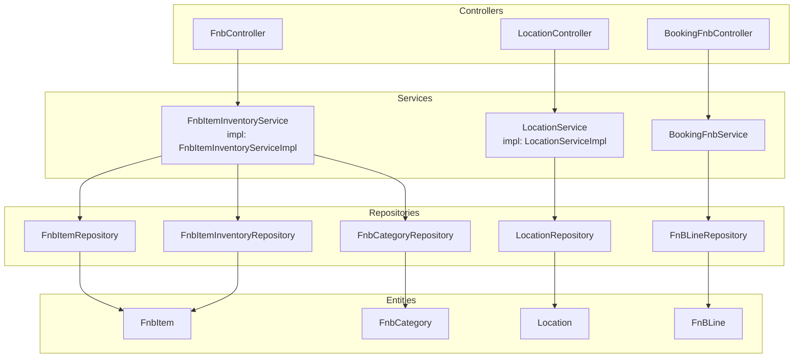
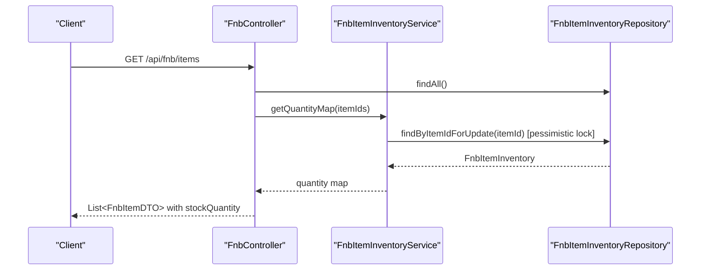
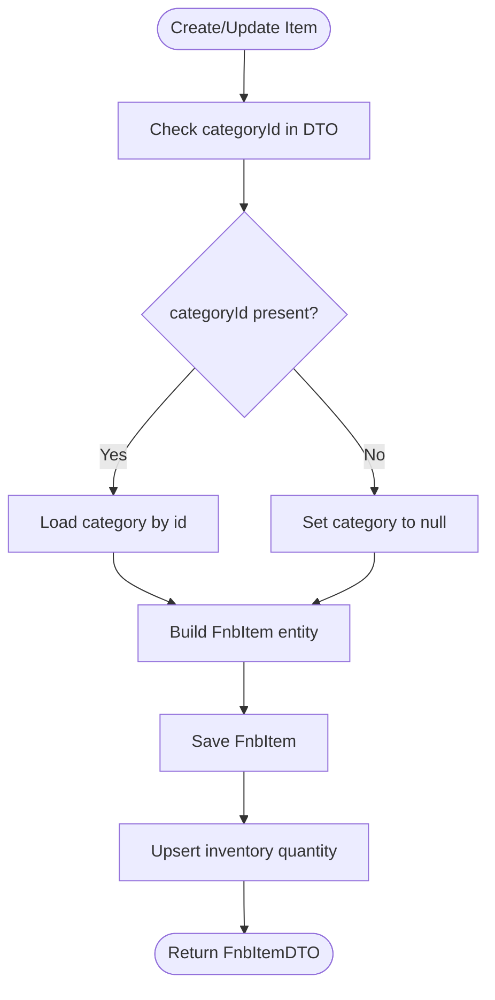
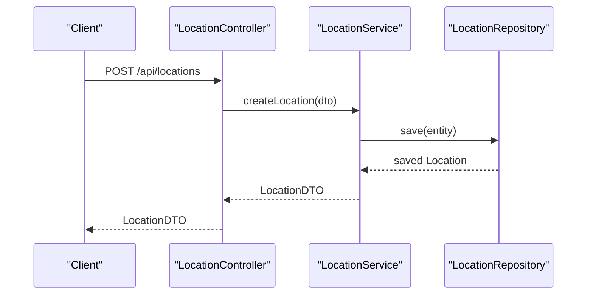
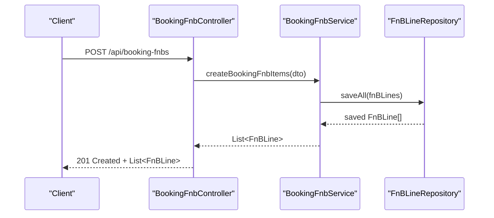
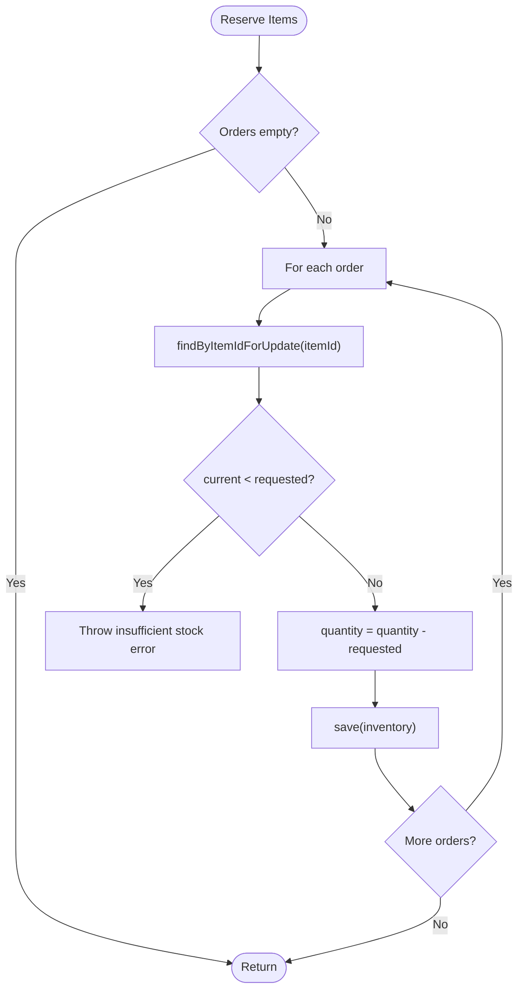
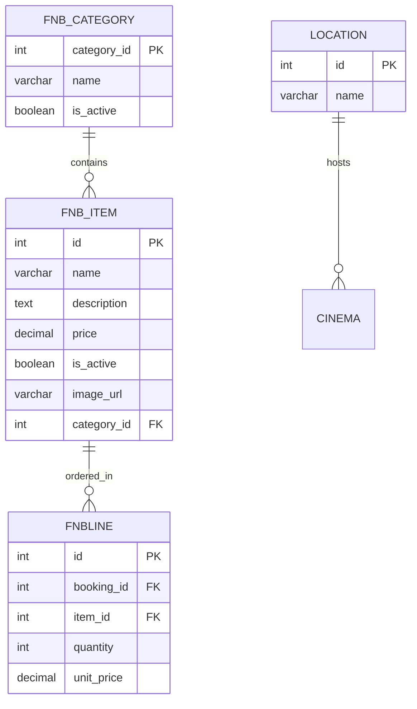
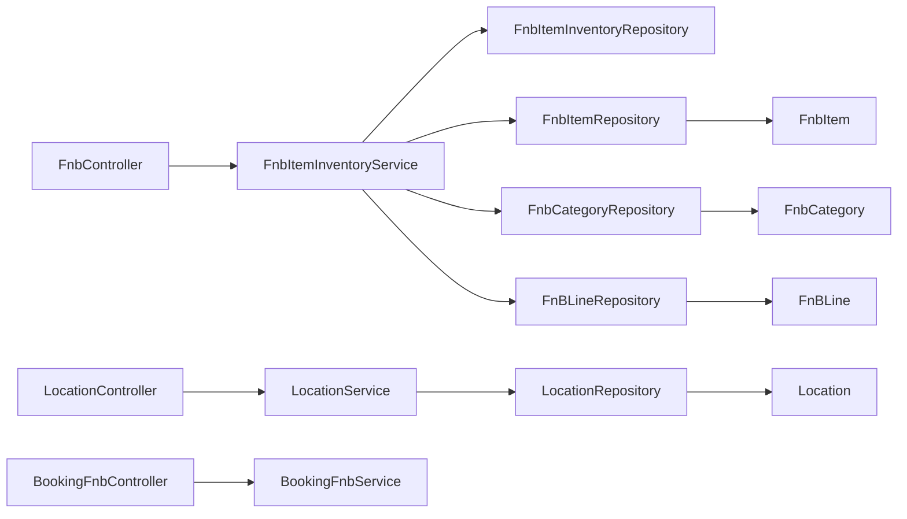

# Food & Beverage and Location Controller

<cite>
**Referenced Files in This Document**
- [FnbController.java](file://backend/src/main/java/com/cinema/booking/controllers/FnbController.java)
- [LocationController.java](file://backend/src/main/java/com/cinema/booking/controllers/LocationController.java)
- [BookingFnbController.java](file://backend/src/main/java/com/cinema/booking/controllers/BookingFnbController.java)
- [FnbItemInventoryServiceImpl.java](file://backend/src/main/java/com/cinema/booking/services/impl/FnbItemInventoryServiceImpl.java)
- [LocationServiceImpl.java](file://backend/src/main/java/com/cinema/booking/services/impl/LocationServiceImpl.java)
- [FnbItemDTO.java](file://backend/src/main/java/com/cinema/booking/dtos/FnbItemDTO.java)
- [FnbCategoryDTO.java](file://backend/src/main/java/com/cinema/booking/dtos/FnbCategoryDTO.java)
- [LocationDTO.java](file://backend/src/main/java/com/cinema/booking/dtos/LocationDTO.java)
- [BookingFnbCreateDTO.java](file://backend/src/main/java/com/cinema/booking/dtos/BookingFnbCreateDTO.java)
- [FnbItem.java](file://backend/src/main/java/com/cinema/booking/entities/FnbItem.java)
- [FnbCategory.java](file://backend/src/main/java/com/cinema/booking/entities/FnbCategory.java)
- [Location.java](file://backend/src/main/java/com/cinema/booking/entities/Location.java)
- [FnBLine.java](file://backend/src/main/java/com/cinema/booking/entities/FnBLine.java)
- [FnbItemRepository.java](file://backend/src/main/java/com/cinema/booking/repositories/FnbItemRepository.java)
- [FnbCategoryRepository.java](file://backend/src/main/java/com/cinema/booking/repositories/FnbCategoryRepository.java)
- [LocationRepository.java](file://backend/src/main/java/com/cinema/booking/repositories/LocationRepository.java)
- [FnBLineRepository.java](file://backend/src/main/java/com/cinema/booking/repositories/FnBLineRepository.java)
- [FnbItemInventoryRepository.java](file://backend/src/main/java/com/cinema/booking/repositories/FnbItemInventoryRepository.java)
- [FnbItemInventoryService.java](file://backend/src/main/java/com/cinema/booking/services/FnbItemInventoryService.java)
- [LocationService.java](file://backend/src/main/java/com/cinema/booking/services/LocationService.java)
- [BookingFnbService.java](file://backend/src/main/java/com/cinema/booking/services/BookingFnbService.java)
</cite>

## Table of Contents
1. [Introduction](#introduction)
2. [Project Structure](#project-structure)
3. [Core Components](#core-components)
4. [Architecture Overview](#architecture-overview)
5. [Detailed Component Analysis](#detailed-component-analysis)
6. [Dependency Analysis](#dependency-analysis)
7. [Performance Considerations](#performance-considerations)
8. [Troubleshooting Guide](#troubleshooting-guide)
9. [Conclusion](#conclusion)

## Introduction
This document provides comprehensive documentation for the Food & Beverage (F&B) and Location Controllers that manage concession operations and geographic data. It covers:
- F&B endpoints for menu management, item categories, pricing, and inventory tracking
- Location endpoints for administrative regions
- The relationship between F&B items, inventory management, and order processing
- Examples of menu administration, stock tracking workflows, and location-based service operations
- Integration points with booking and payment systems

## Project Structure
The F&B and Location subsystems are organized around Spring MVC controllers, service implementations, JPA repositories, DTOs, and entities. The controllers expose REST endpoints, while services encapsulate business logic and repositories handle persistence.

**Diagram sources**
- [FnbController.java:23-155](file://backend/src/main/java/com/cinema/booking/controllers/FnbController.java#L23-L155)
- [LocationController.java:15-50](file://backend/src/main/java/com/cinema/booking/controllers/LocationController.java#L15-L50)
- [BookingFnbController.java:18-47](file://backend/src/main/java/com/cinema/booking/controllers/BookingFnbController.java#L18-L47)
- [FnbItemInventoryServiceImpl.java:24-112](file://backend/src/main/java/com/cinema/booking/services/impl/FnbItemInventoryServiceImpl.java#L24-L112)
- [LocationServiceImpl.java:15-59](file://backend/src/main/java/com/cinema/booking/services/impl/LocationServiceImpl.java#L15-L59)
- [FnbItemRepository.java:8-9](file://backend/src/main/java/com/cinema/booking/repositories/FnbItemRepository.java#L8-L9)
- [FnbCategoryRepository.java:8-9](file://backend/src/main/java/com/cinema/booking/repositories/FnbCategoryRepository.java#L8-L9)
- [LocationRepository.java:8-10](file://backend/src/main/java/com/cinema/booking/repositories/LocationRepository.java#L8-L10)
- [FnBLineRepository.java:10-12](file://backend/src/main/java/com/cinema/booking/repositories/FnBLineRepository.java#L10-L12)
- [FnbItemInventoryRepository.java:14-20](file://backend/src/main/java/com/cinema/booking/repositories/FnbItemInventoryRepository.java#L14-L20)
- [FnbItem.java:13-40](file://backend/src/main/java/com/cinema/booking/entities/FnbItem.java#L13-L40)
- [FnbCategory.java:12-23](file://backend/src/main/java/com/cinema/booking/entities/FnbCategory.java#L12-L23)
- [Location.java:12-20](file://backend/src/main/java/com/cinema/booking/entities/Location.java#L12-L20)
- [FnBLine.java:17-38](file://backend/src/main/java/com/cinema/booking/entities/FnBLine.java#L17-L38)

**Section sources**
- [FnbController.java:23-155](file://backend/src/main/java/com/cinema/booking/controllers/FnbController.java#L23-L155)
- [LocationController.java:15-50](file://backend/src/main/java/com/cinema/booking/controllers/LocationController.java#L15-L50)
- [BookingFnbController.java:18-47](file://backend/src/main/java/com/cinema/booking/controllers/BookingFnbController.java#L18-L47)

## Core Components
- FnbController: Exposes CRUD endpoints for F&B items and categories, integrates inventory quantities into item listings.
- LocationController: Manages administrative regions (provinces/cities) with full CRUD operations.
- BookingFnbController: Manages F&B line items attached to bookings, enabling creation, retrieval, and cleanup per booking.

Key responsibilities:
- Menu management: create/update/delete items and categories; maintain pricing and availability.
- Inventory tracking: reserve/release stock during booking checkout; expose current quantities.
- Order processing: associate F&B items with bookings via FnBLine entries.
- Geographic data: CRUD for locations used in cinema/address context.

**Section sources**
- [FnbController.java:36-98](file://backend/src/main/java/com/cinema/booking/controllers/FnbController.java#L36-L98)
- [FnbController.java:102-133](file://backend/src/main/java/com/cinema/booking/controllers/FnbController.java#L102-L133)
- [LocationController.java:21-49](file://backend/src/main/java/com/cinema/booking/controllers/LocationController.java#L21-L49)
- [BookingFnbController.java:24-46](file://backend/src/main/java/com/cinema/booking/controllers/BookingFnbController.java#L24-L46)

## Architecture Overview
The controllers delegate to service interfaces implemented by service classes. Services coordinate repositories and entities to enforce business rules such as inventory reservations and releases. DTOs decouple external APIs from internal entity structures.

**Diagram sources**
- [FnbController.java:36-44](file://backend/src/main/java/com/cinema/booking/controllers/FnbController.java#L36-L44)
- [FnbItemInventoryServiceImpl.java:40-48](file://backend/src/main/java/com/cinema/booking/services/impl/FnbItemInventoryServiceImpl.java#L40-L48)
- [FnbItemInventoryRepository.java:17-19](file://backend/src/main/java/com/cinema/booking/repositories/FnbItemInventoryRepository.java#L17-L19)

**Section sources**
- [FnbController.java:36-44](file://backend/src/main/java/com/cinema/booking/controllers/FnbController.java#L36-L44)
- [FnbItemInventoryServiceImpl.java:30-48](file://backend/src/main/java/com/cinema/booking/services/impl/FnbItemInventoryServiceImpl.java#L30-L48)
- [FnbItemInventoryRepository.java:14-20](file://backend/src/main/java/com/cinema/booking/repositories/FnbItemInventoryRepository.java#L14-L20)

## Detailed Component Analysis

### F&B Controller
Endpoints:
- GET /api/fnb/items: Returns all F&B items enriched with current stock quantities.
- POST /api/fnb/items: Creates a new item and initializes inventory quantity.
- PUT /api/fnb/items/{id}: Updates item metadata and inventory quantity.
- DELETE /api/fnb/items/{id}: Removes an item.
- GET /api/fnb/categories: Lists all categories.
- POST /api/fnb/categories: Creates a category.
- PUT /api/fnb/categories/{id}: Updates a category.
- DELETE /api/fnb/categories/{id}: Removes a category.

Processing logic:
- Item listing merges inventory quantities via a quantity map returned by the inventory service.
- Creation and updates set item availability to active by default if not provided.
- Category association is optional; null category clears association.

**Diagram sources**
- [FnbController.java:46-91](file://backend/src/main/java/com/cinema/booking/controllers/FnbController.java#L46-L91)
- [FnbItemInventoryServiceImpl.java:50-58](file://backend/src/main/java/com/cinema/booking/services/impl/FnbItemInventoryServiceImpl.java#L50-L58)

**Section sources**
- [FnbController.java:36-98](file://backend/src/main/java/com/cinema/booking/controllers/FnbController.java#L36-L98)
- [FnbController.java:102-133](file://backend/src/main/java/com/cinema/booking/controllers/FnbController.java#L102-L133)

### Location Controller
Endpoints:
- GET /api/locations: Lists all locations.
- GET /api/locations/{id}: Retrieves a location by ID.
- POST /api/locations: Creates a new location.
- PUT /api/locations/{id}: Updates a location.
- DELETE /api/locations/{id}: Deletes a location.

Validation:
- LocationDTO enforces non-blank name validation.

**Diagram sources**
- [LocationController.java:32-36](file://backend/src/main/java/com/cinema/booking/controllers/LocationController.java#L32-L36)
- [LocationServiceImpl.java:41-44](file://backend/src/main/java/com/cinema/booking/services/impl/LocationServiceImpl.java#L41-L44)
- [LocationRepository.java:8-10](file://backend/src/main/java/com/cinema/booking/repositories/LocationRepository.java#L8-L10)

**Section sources**
- [LocationController.java:21-49](file://backend/src/main/java/com/cinema/booking/controllers/LocationController.java#L21-L49)
- [LocationServiceImpl.java:28-58](file://backend/src/main/java/com/cinema/booking/services/impl/LocationServiceImpl.java#L28-L58)
- [LocationDTO.java:10](file://backend/src/main/java/com/cinema/booking/dtos/LocationDTO.java#L10)

### Booking F&B Controller
Endpoints:
- POST /api/booking-fnbs: Creates FnBLine entries for a booking.
- GET /api/booking-fnbs: Lists all FnBLine entries.
- GET /api/booking-fnbs/booking/{bookingId}: Lists FnBLine entries for a booking.
- DELETE /api/booking-fnbs/booking/{bookingId}: Removes all FnBLine entries for a booking.

Integration:
- FnBLine links a booking to specific F&B items with quantities and unit prices.

**Diagram sources**
- [BookingFnbController.java:24-27](file://backend/src/main/java/com/cinema/booking/controllers/BookingFnbController.java#L24-L27)
- [FnBLineRepository.java:10-12](file://backend/src/main/java/com/cinema/booking/repositories/FnBLineRepository.java#L10-L12)

**Section sources**
- [BookingFnbController.java:24-46](file://backend/src/main/java/com/cinema/booking/controllers/BookingFnbController.java#L24-L46)
- [FnBLine.java:17-38](file://backend/src/main/java/com/cinema/booking/entities/FnBLine.java#L17-L38)

### Inventory Management Service
Responsibilities:
- Retrieve single and batch inventory quantities.
- Upsert inventory quantities when items are created or updated.
- Reserve items for checkout; throws if insufficient stock.
- Release reserved items when a booking is canceled/refunded.

Concurrency control:
- Pessimistic write locks are used when reserving or releasing items to prevent race conditions.

**Diagram sources**
- [FnbItemInventoryServiceImpl.java:62-83](file://backend/src/main/java/com/cinema/booking/services/impl/FnbItemInventoryServiceImpl.java#L62-L83)
- [FnbItemInventoryRepository.java:17-19](file://backend/src/main/java/com/cinema/booking/repositories/FnbItemInventoryRepository.java#L17-L19)

**Section sources**
- [FnbItemInventoryServiceImpl.java:30-83](file://backend/src/main/java/com/cinema/booking/services/impl/FnbItemInventoryServiceImpl.java#L30-L83)
- [FnbItemInventoryRepository.java:14-20](file://backend/src/main/java/com/cinema/booking/repositories/FnbItemInventoryRepository.java#L14-L20)

### Data Model Relationships

**Diagram sources**
- [Location.java:12-20](file://backend/src/main/java/com/cinema/booking/entities/Location.java#L12-L20)
- [FnbCategory.java:12-23](file://backend/src/main/java/com/cinema/booking/entities/FnbCategory.java#L12-L23)
- [FnbItem.java:13-40](file://backend/src/main/java/com/cinema/booking/entities/FnbItem.java#L13-L40)
- [FnBLine.java:17-38](file://backend/src/main/java/com/cinema/booking/entities/FnBLine.java#L17-L38)

**Section sources**
- [FnbItem.java:13-40](file://backend/src/main/java/com/cinema/booking/entities/FnbItem.java#L13-L40)
- [FnbCategory.java:12-23](file://backend/src/main/java/com/cinema/booking/entities/FnbCategory.java#L12-L23)
- [Location.java:12-20](file://backend/src/main/java/com/cinema/booking/entities/Location.java#L12-L20)
- [FnBLine.java:17-38](file://backend/src/main/java/com/cinema/booking/entities/FnBLine.java#L17-L38)

## Dependency Analysis
- Controllers depend on services for business operations.
- Services depend on repositories for persistence.
- Entities define relationships; DTOs decouple API contracts from entities.
- Inventory service coordinates with booking and FnBLine repositories to manage stock lifecycle.

**Diagram sources**
- [FnbController.java:25-32](file://backend/src/main/java/com/cinema/booking/controllers/FnbController.java#L25-L32)
- [LocationController.java:17-18](file://backend/src/main/java/com/cinema/booking/controllers/LocationController.java#L17-L18)
- [BookingFnbController.java:20-21](file://backend/src/main/java/com/cinema/booking/controllers/BookingFnbController.java#L20-L21)
- [FnbItemInventoryServiceImpl.java:26-28](file://backend/src/main/java/com/cinema/booking/services/impl/FnbItemInventoryServiceImpl.java#L26-L28)
- [LocationServiceImpl.java:17-18](file://backend/src/main/java/com/cinema/booking/services/impl/LocationServiceImpl.java#L17-L18)
- [FnbItemRepository.java:8-9](file://backend/src/main/java/com/cinema/booking/repositories/FnbItemRepository.java#L8-L9)
- [FnbCategoryRepository.java:8-9](file://backend/src/main/java/com/cinema/booking/repositories/FnbCategoryRepository.java#L8-L9)
- [LocationRepository.java:8-10](file://backend/src/main/java/com/cinema/booking/repositories/LocationRepository.java#L8-L10)
- [FnBLineRepository.java:10-12](file://backend/src/main/java/com/cinema/booking/repositories/FnBLineRepository.java#L10-L12)

**Section sources**
- [FnbController.java:25-32](file://backend/src/main/java/com/cinema/booking/controllers/FnbController.java#L25-L32)
- [LocationController.java:17-18](file://backend/src/main/java/com/cinema/booking/controllers/LocationController.java#L17-L18)
- [BookingFnbController.java:20-21](file://backend/src/main/java/com/cinema/booking/controllers/BookingFnbController.java#L20-L21)

## Performance Considerations
- Batch inventory queries: The inventory service retrieves quantities for multiple item IDs efficiently using a single stream operation.
- Locking strategy: Pessimistic write locks ensure atomicity during stock reservations and releases, preventing overselling under concurrent load.
- Lazy loading: Category association on FnbItem is lazy to avoid unnecessary joins when listing items.

Recommendations:
- Index item_id on the inventory table to speed up findByItemIdForUpdate queries.
- Consider caching frequently accessed categories and items for read-heavy workloads.
- Monitor transaction durations for reservation/release operations to detect contention.

**Section sources**
- [FnbItemInventoryServiceImpl.java:40-48](file://backend/src/main/java/com/cinema/booking/services/impl/FnbItemInventoryServiceImpl.java#L40-L48)
- [FnbItemInventoryRepository.java:17-19](file://backend/src/main/java/com/cinema/booking/repositories/FnbItemInventoryRepository.java#L17-L19)

## Troubleshooting Guide
Common issues and resolutions:
- Insufficient stock during checkout:
  - Symptom: Reservation fails with an insufficient stock message.
  - Cause: Requested quantity exceeds current inventory.
  - Resolution: Update inventory quantity for the item or reduce order quantity.
  - Reference: [FnbItemInventoryServiceImpl.java:77-79](file://backend/src/main/java/com/cinema/booking/services/impl/FnbItemInventoryServiceImpl.java#L77-L79)

- Category not found when updating item:
  - Symptom: Exception thrown indicating category not found.
  - Cause: Provided categoryId does not exist.
  - Resolution: Verify categoryId exists or omit categoryId to clear association.
  - Reference: [FnbController.java:74-80](file://backend/src/main/java/com/cinema/booking/controllers/FnbController.java#L74-L80)

- Location not found:
  - Symptom: Exception thrown indicating location not found.
  - Cause: Provided locationId does not exist.
  - Resolution: Use a valid locationId or create the location first.
  - Reference: [LocationServiceImpl.java:35-37](file://backend/src/main/java/com/cinema/booking/services/impl/LocationServiceImpl.java#L35-L37)

- Inventory not configured for an item:
  - Symptom: Reservation fails with a message indicating missing inventory configuration.
  - Cause: An inventory record was not initialized for the item.
  - Resolution: Initialize inventory quantity for the item via item creation or update.
  - Reference: [FnbItemInventoryServiceImpl.java:75](file://backend/src/main/java/com/cinema/booking/services/impl/FnbItemInventoryServiceImpl.java#L75)

**Section sources**
- [FnbItemInventoryServiceImpl.java:75-79](file://backend/src/main/java/com/cinema/booking/services/impl/FnbItemInventoryServiceImpl.java#L75-L79)
- [FnbController.java:74-80](file://backend/src/main/java/com/cinema/booking/controllers/FnbController.java#L74-L80)
- [LocationServiceImpl.java:35-37](file://backend/src/main/java/com/cinema/booking/services/impl/LocationServiceImpl.java#L35-L37)

## Conclusion
The F&B and Location subsystems provide robust APIs for managing concession menus, categories, inventory, and geographic regions. The controllers, services, repositories, and entities form a cohesive architecture supporting accurate stock management and seamless integration with booking workflows. Proper use of pessimistic locking ensures data consistency during high-concurrency scenarios, while DTOs maintain clean separation between API contracts and internal models.