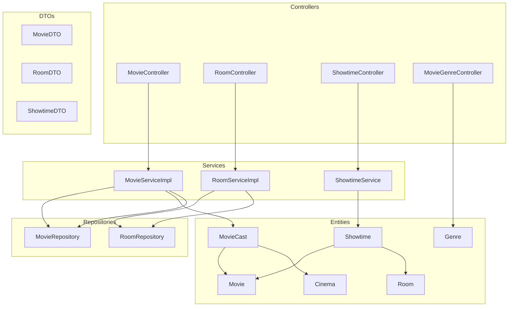
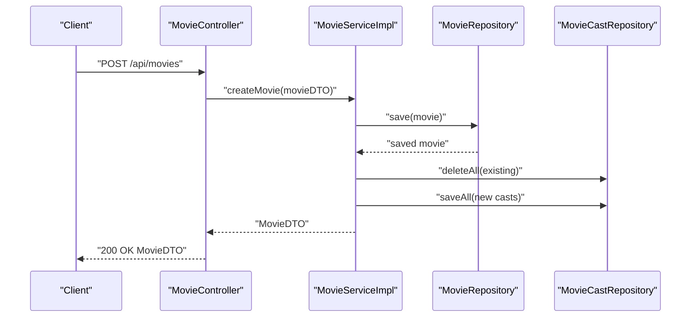
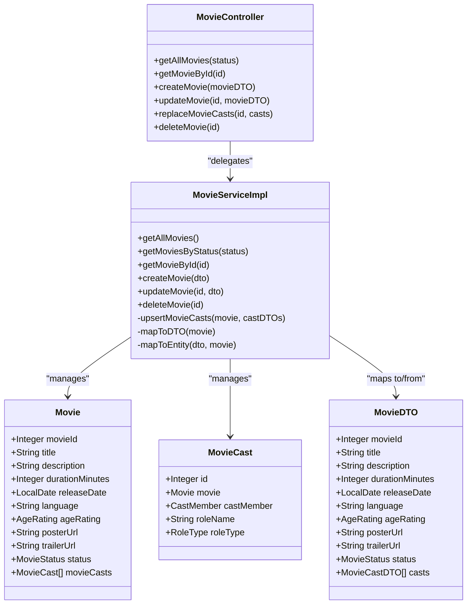
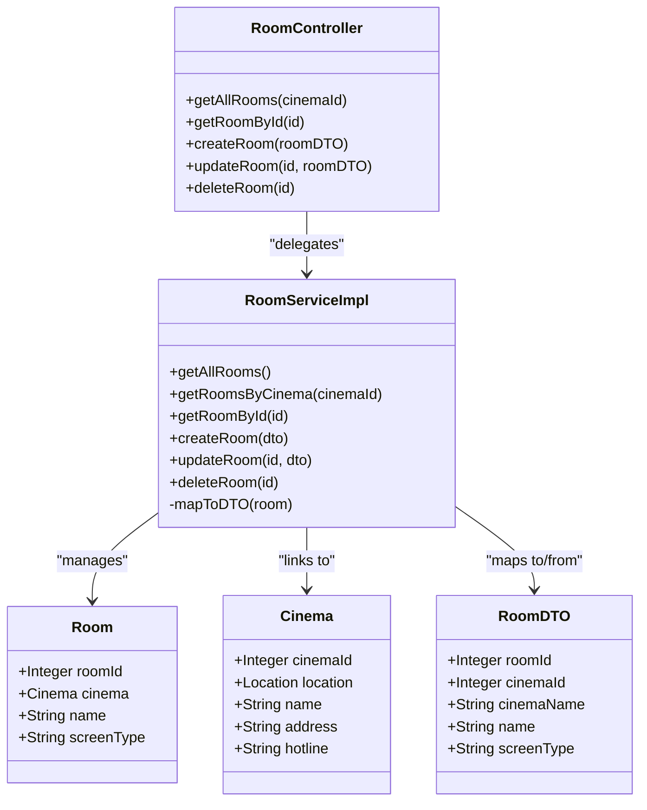
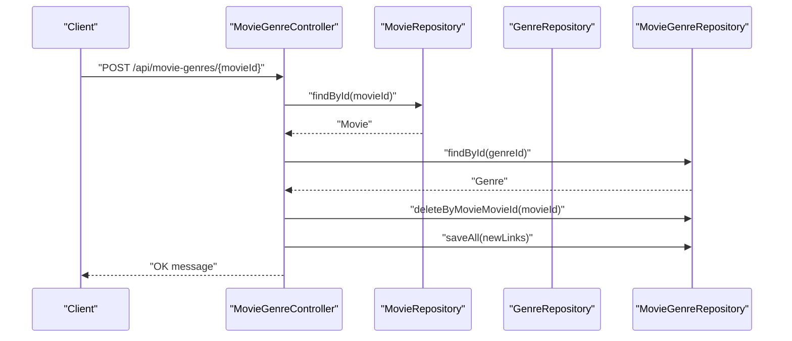
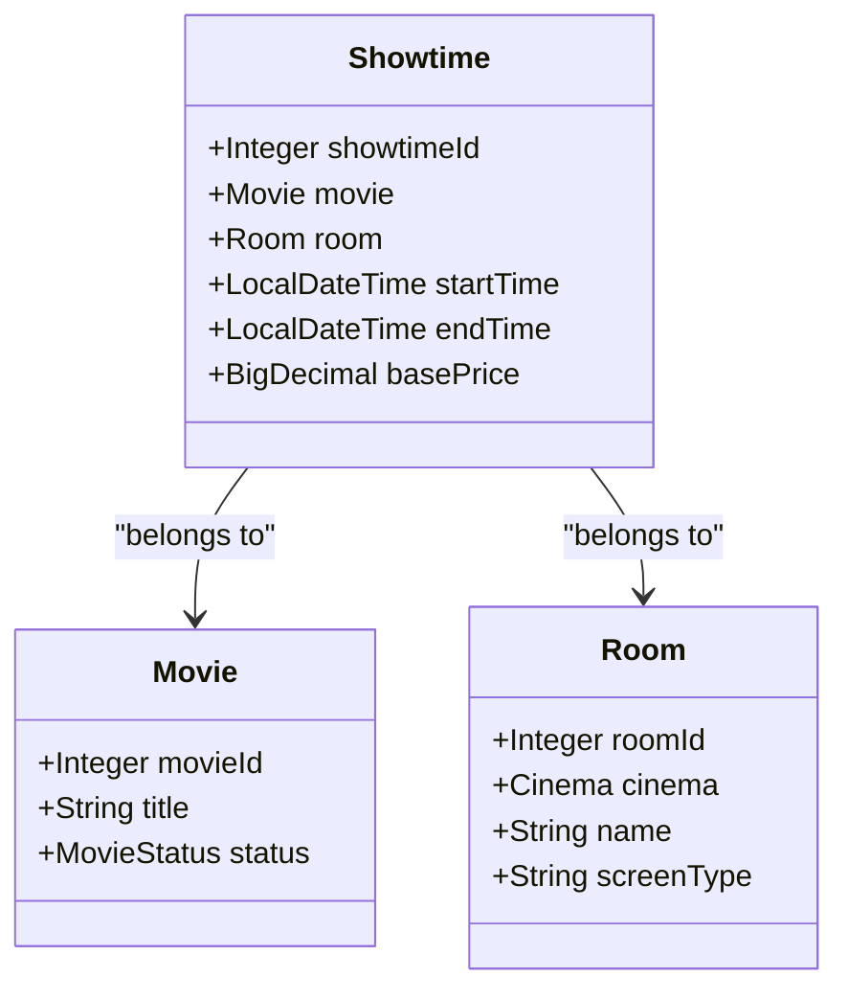
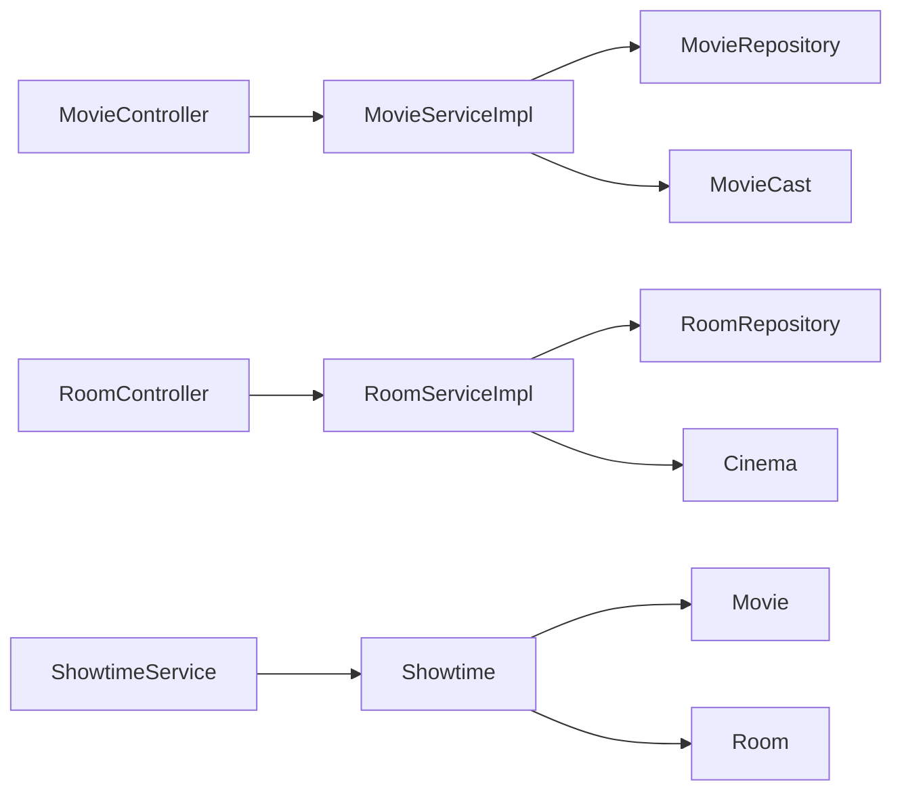

# Movie and Room Controller

<cite>
**Referenced Files in This Document**
- [MovieController.java](file://backend/src/main/java/com/cinema/booking/controllers/MovieController.java)
- [RoomController.java](file://backend/src/main/java/com/cinema/booking/controllers/RoomController.java)
- [MovieServiceImpl.java](file://backend/src/main/java/com/cinema/booking/services/impl/MovieServiceImpl.java)
- [RoomServiceImpl.java](file://backend/src/main/java/com/cinema/booking/services/impl/RoomServiceImpl.java)
- [MovieDTO.java](file://backend/src/main/java/com/cinema/booking/dtos/MovieDTO.java)
- [RoomDTO.java](file://backend/src/main/java/com/cinema/booking/dtos/RoomDTO.java)
- [Movie.java](file://backend/src/main/java/com/cinema/booking/entities/Movie.java)
- [Room.java](file://backend/src/main/java/com/cinema/booking/entities/Room.java)
- [Cinema.java](file://backend/src/main/java/com/cinema/booking/entities/Cinema.java)
- [MovieCast.java](file://backend/src/main/java/com/cinema/booking/entities/MovieCast.java)
- [MovieRepository.java](file://backend/src/main/java/com/cinema/booking/repositories/MovieRepository.java)
- [RoomRepository.java](file://backend/src/main/java/com/cinema/booking/repositories/RoomRepository.java)
- [ShowtimeController.java](file://backend/src/main/java/com/cinema/booking/controllers/ShowtimeController.java)
- [Showtime.java](file://backend/src/main/java/com/cinema/booking/entities/Showtime.java)
- [MovieGenreController.java](file://backend/src/main/java/com/cinema/booking/controllers/MovieGenreController.java)
- [Genre.java](file://backend/src/main/java/com/cinema/booking/entities/Genre.java)
</cite>

## Table of Contents
1. [Introduction](#introduction)
2. [Project Structure](#project-structure)
3. [Core Components](#core-components)
4. [Architecture Overview](#architecture-overview)
5. [Detailed Component Analysis](#detailed-component-analysis)
6. [Dependency Analysis](#dependency-analysis)
7. [Performance Considerations](#performance-considerations)
8. [Troubleshooting Guide](#troubleshooting-guide)
9. [Conclusion](#conclusion)
10. [Appendices](#appendices)

## Introduction
This document provides comprehensive documentation for the Movie and Room Controllers responsible for content and venue management in the cinema booking system. It covers:
- Movie endpoints for CRUD operations, metadata management, genre associations, and cast information
- Room endpoints for seat configuration, room types, and capacity management
- The relationship between movies, rooms, and showtimes in the scheduling system
- Examples of movie creation workflows, room setup procedures, and content management operations
- Search and filtering capabilities for movies and room configurations

## Project Structure
The relevant components are organized into controllers, services, DTOs, entities, and repositories under the backend module. Controllers expose REST endpoints, services encapsulate business logic, DTOs define request/response contracts, and entities represent the persistence model.

**Diagram sources**
- [MovieController.java:1-64](file://backend/src/main/java/com/cinema/booking/controllers/MovieController.java#L1-L64)
- [RoomController.java:1-51](file://backend/src/main/java/com/cinema/booking/controllers/RoomController.java#L1-L51)
- [ShowtimeController.java:1-54](file://backend/src/main/java/com/cinema/booking/controllers/ShowtimeController.java#L1-L54)
- [MovieGenreController.java:1-92](file://backend/src/main/java/com/cinema/booking/controllers/MovieGenreController.java#L1-L92)
- [MovieServiceImpl.java:1-150](file://backend/src/main/java/com/cinema/booking/services/impl/MovieServiceImpl.java#L1-L150)
- [RoomServiceImpl.java:1-89](file://backend/src/main/java/com/cinema/booking/services/impl/RoomServiceImpl.java#L1-L89)
- [MovieDTO.java:1-50](file://backend/src/main/java/com/cinema/booking/dtos/MovieDTO.java#L1-L50)
- [RoomDTO.java:1-21](file://backend/src/main/java/com/cinema/booking/dtos/RoomDTO.java#L1-L21)
- [Movie.java:1-65](file://backend/src/main/java/com/cinema/booking/entities/Movie.java#L1-L65)
- [Room.java:1-28](file://backend/src/main/java/com/cinema/booking/entities/Room.java#L1-L28)
- [Cinema.java:1-32](file://backend/src/main/java/com/cinema/booking/entities/Cinema.java#L1-L32)
- [MovieCast.java:1-43](file://backend/src/main/java/com/cinema/booking/entities/MovieCast.java#L1-L43)
- [Genre.java:1-78](file://backend/src/main/java/com/cinema/booking/entities/Genre.java#L1-L78)
- [Showtime.java:1-38](file://backend/src/main/java/com/cinema/booking/entities/Showtime.java#L1-L38)
- [MovieRepository.java:1-15](file://backend/src/main/java/com/cinema/booking/repositories/MovieRepository.java#L1-L15)
- [RoomRepository.java:1-14](file://backend/src/main/java/com/cinema/booking/repositories/RoomRepository.java#L1-L14)

**Section sources**
- [MovieController.java:1-64](file://backend/src/main/java/com/cinema/booking/controllers/MovieController.java#L1-L64)
- [RoomController.java:1-51](file://backend/src/main/java/com/cinema/booking/controllers/RoomController.java#L1-L51)
- [MovieServiceImpl.java:1-150](file://backend/src/main/java/com/cinema/booking/services/impl/MovieServiceImpl.java#L1-L150)
- [RoomServiceImpl.java:1-89](file://backend/src/main/java/com/cinema/booking/services/impl/RoomServiceImpl.java#L1-L89)
- [MovieDTO.java:1-50](file://backend/src/main/java/com/cinema/booking/dtos/MovieDTO.java#L1-L50)
- [RoomDTO.java:1-21](file://backend/src/main/java/com/cinema/booking/dtos/RoomDTO.java#L1-L21)
- [Movie.java:1-65](file://backend/src/main/java/com/cinema/booking/entities/Movie.java#L1-L65)
- [Room.java:1-28](file://backend/src/main/java/com/cinema/booking/entities/Room.java#L1-L28)
- [Cinema.java:1-32](file://backend/src/main/java/com/cinema/booking/entities/Cinema.java#L1-L32)
- [MovieCast.java:1-43](file://backend/src/main/java/com/cinema/booking/entities/MovieCast.java#L1-L43)
- [Genre.java:1-78](file://backend/src/main/java/com/cinema/booking/entities/Genre.java#L1-L78)
- [Showtime.java:1-38](file://backend/src/main/java/com/cinema/booking/entities/Showtime.java#L1-L38)
- [MovieRepository.java:1-15](file://backend/src/main/java/com/cinema/booking/repositories/MovieRepository.java#L1-L15)
- [RoomRepository.java:1-14](file://backend/src/main/java/com/cinema/booking/repositories/RoomRepository.java#L1-L14)

## Core Components
- MovieController: Exposes endpoints for listing, retrieving, creating, updating, deleting movies, and replacing cast lists.
- RoomController: Exposes endpoints for listing, retrieving, creating, updating, and deleting rooms with optional filtering by cinema.
- MovieServiceImpl: Implements business logic for movies including mapping to/from DTOs, managing cast associations, and status-based queries.
- RoomServiceImpl: Implements business logic for rooms including mapping to/from DTOs, linking to cinemas, and filtering by cinema.

Key responsibilities:
- Validation via DTO constraints
- Status-based filtering for movies
- Cast replacement strategy
- Cinema linkage for rooms

**Section sources**
- [MovieController.java:1-64](file://backend/src/main/java/com/cinema/booking/controllers/MovieController.java#L1-L64)
- [RoomController.java:1-51](file://backend/src/main/java/com/cinema/booking/controllers/RoomController.java#L1-L51)
- [MovieServiceImpl.java:1-150](file://backend/src/main/java/com/cinema/booking/services/impl/MovieServiceImpl.java#L1-L150)
- [RoomServiceImpl.java:1-89](file://backend/src/main/java/com/cinema/booking/services/impl/RoomServiceImpl.java#L1-L89)

## Architecture Overview
The controllers delegate to service implementations, which manage persistence via repositories. Entities define the data model, while DTOs decouple API contracts from persistence models.

**Diagram sources**
- [MovieController.java:37-40](file://backend/src/main/java/com/cinema/booking/controllers/MovieController.java#L37-L40)
- [MovieServiceImpl.java:127-133](file://backend/src/main/java/com/cinema/booking/services/impl/MovieServiceImpl.java#L127-L133)
- [MovieRepository.java:1-15](file://backend/src/main/java/com/cinema/booking/repositories/MovieRepository.java#L1-L15)
- [MovieCast.java:1-43](file://backend/src/main/java/com/cinema/booking/entities/MovieCast.java#L1-L43)

**Section sources**
- [MovieController.java:1-64](file://backend/src/main/java/com/cinema/booking/controllers/MovieController.java#L1-L64)
- [MovieServiceImpl.java:1-150](file://backend/src/main/java/com/cinema/booking/services/impl/MovieServiceImpl.java#L1-L150)
- [MovieRepository.java:1-15](file://backend/src/main/java/com/cinema/booking/repositories/MovieRepository.java#L1-L15)

## Detailed Component Analysis

### Movie Controller and Service
Endpoints:
- GET /api/movies: List all movies or filter by status
- GET /api/movies/{id}: Retrieve a movie by ID
- POST /api/movies: Create a movie
- PUT /api/movies/{id}: Update a movie
- PUT /api/movies/{id}/casts: Replace cast list for a movie
- DELETE /api/movies/{id}: Delete a movie

Processing logic:
- Status filtering is supported via query parameter
- Cast replacement follows a replace-all strategy for consistency
- DTO mapping handles cast details and role metadata

**Diagram sources**
- [MovieController.java:1-64](file://backend/src/main/java/com/cinema/booking/controllers/MovieController.java#L1-L64)
- [MovieServiceImpl.java:1-150](file://backend/src/main/java/com/cinema/booking/services/impl/MovieServiceImpl.java#L1-L150)
- [MovieDTO.java:1-50](file://backend/src/main/java/com/cinema/booking/dtos/MovieDTO.java#L1-L50)
- [Movie.java:1-65](file://backend/src/main/java/com/cinema/booking/entities/Movie.java#L1-L65)
- [MovieCast.java:1-43](file://backend/src/main/java/com/cinema/booking/entities/MovieCast.java#L1-L43)

**Section sources**
- [MovieController.java:22-62](file://backend/src/main/java/com/cinema/booking/controllers/MovieController.java#L22-L62)
- [MovieServiceImpl.java:109-148](file://backend/src/main/java/com/cinema/booking/services/impl/MovieServiceImpl.java#L109-L148)
- [MovieDTO.java:14-48](file://backend/src/main/java/com/cinema/booking/dtos/MovieDTO.java#L14-L48)
- [Movie.java:19-63](file://backend/src/main/java/com/cinema/booking/entities/Movie.java#L19-L63)
- [MovieCast.java:14-41](file://backend/src/main/java/com/cinema/booking/entities/MovieCast.java#L14-L41)

### Room Controller and Service
Endpoints:
- GET /api/rooms: List all rooms or filter by cinemaId
- GET /api/rooms/{id}: Retrieve a room by ID
- POST /api/rooms: Create a room linked to a cinema
- PUT /api/rooms/{id}: Update a room and optionally reassign cinema
- DELETE /api/rooms/{id}: Delete a room

Processing logic:
- Optional filtering by cinemaId via query parameter
- Room DTO includes cinemaId and cinemaName for convenience
- Validation ensures a valid cinema association during create/update

**Diagram sources**
- [RoomController.java:1-51](file://backend/src/main/java/com/cinema/booking/controllers/RoomController.java#L1-L51)
- [RoomServiceImpl.java:1-89](file://backend/src/main/java/com/cinema/booking/services/impl/RoomServiceImpl.java#L1-L89)
- [RoomDTO.java:1-21](file://backend/src/main/java/com/cinema/booking/dtos/RoomDTO.java#L1-L21)
- [Room.java:1-28](file://backend/src/main/java/com/cinema/booking/entities/Room.java#L1-L28)
- [Cinema.java:1-32](file://backend/src/main/java/com/cinema/booking/entities/Cinema.java#L1-L32)

**Section sources**
- [RoomController.java:20-49](file://backend/src/main/java/com/cinema/booking/controllers/RoomController.java#L20-L49)
- [RoomServiceImpl.java:39-87](file://backend/src/main/java/com/cinema/booking/services/impl/RoomServiceImpl.java#L39-L87)
- [RoomDTO.java:8-20](file://backend/src/main/java/com/cinema/booking/dtos/RoomDTO.java#L8-L20)
- [Room.java:12-27](file://backend/src/main/java/com/cinema/booking/entities/Room.java#L12-L27)
- [Cinema.java:12-31](file://backend/src/main/java/com/cinema/booking/entities/Cinema.java#L12-L31)

### Genre Management for Movies
- Endpoint to retrieve genres associated with a movie
- Bulk assignment of genres to a movie (replace-all)
- Add/remove individual genres from a movie

**Diagram sources**
- [MovieGenreController.java:44-63](file://backend/src/main/java/com/cinema/booking/controllers/MovieGenreController.java#L44-L63)
- [MovieRepository.java:1-15](file://backend/src/main/java/com/cinema/booking/repositories/MovieRepository.java#L1-L15)
- [Genre.java:1-78](file://backend/src/main/java/com/cinema/booking/entities/Genre.java#L1-L78)
- [MovieGenreRepository.java:1-50](file://backend/src/main/java/com/cinema/booking/repositories/MovieGenreRepository.java#L1-L50)

**Section sources**
- [MovieGenreController.java:34-63](file://backend/src/main/java/com/cinema/booking/controllers/MovieGenreController.java#L34-L63)
- [Genre.java:17-78](file://backend/src/main/java/com/cinema/booking/entities/Genre.java#L17-L78)

### Relationship Between Movies, Rooms, and Showtimes
Showtimes tie movies and rooms together, defining screening schedules with start/end times and pricing.

**Diagram sources**
- [Showtime.java:1-38](file://backend/src/main/java/com/cinema/booking/entities/Showtime.java#L1-L38)
- [Movie.java:1-65](file://backend/src/main/java/com/cinema/booking/entities/Movie.java#L1-L65)
- [Room.java:1-28](file://backend/src/main/java/com/cinema/booking/entities/Room.java#L1-L28)

**Section sources**
- [ShowtimeController.java:1-54](file://backend/src/main/java/com/cinema/booking/controllers/ShowtimeController.java#L1-L54)
- [Showtime.java:14-37](file://backend/src/main/java/com/cinema/booking/entities/Showtime.java#L14-L37)

## Dependency Analysis
- Controllers depend on services for business logic
- Services depend on repositories for persistence
- Entities define relationships and constraints
- DTOs decouple API contracts from entities

**Diagram sources**
- [MovieController.java:1-64](file://backend/src/main/java/com/cinema/booking/controllers/MovieController.java#L1-L64)
- [RoomController.java:1-51](file://backend/src/main/java/com/cinema/booking/controllers/RoomController.java#L1-L51)
- [MovieServiceImpl.java:1-150](file://backend/src/main/java/com/cinema/booking/services/impl/MovieServiceImpl.java#L1-L150)
- [RoomServiceImpl.java:1-89](file://backend/src/main/java/com/cinema/booking/services/impl/RoomServiceImpl.java#L1-L89)
- [MovieRepository.java:1-15](file://backend/src/main/java/com/cinema/booking/repositories/MovieRepository.java#L1-L15)
- [RoomRepository.java:1-14](file://backend/src/main/java/com/cinema/booking/repositories/RoomRepository.java#L1-L14)
- [Showtime.java:1-38](file://backend/src/main/java/com/cinema/booking/entities/Showtime.java#L1-L38)
- [Movie.java:1-65](file://backend/src/main/java/com/cinema/booking/entities/Movie.java#L1-L65)
- [Room.java:1-28](file://backend/src/main/java/com/cinema/booking/entities/Room.java#L1-L28)

**Section sources**
- [MovieController.java:1-64](file://backend/src/main/java/com/cinema/booking/controllers/MovieController.java#L1-L64)
- [RoomController.java:1-51](file://backend/src/main/java/com/cinema/booking/controllers/RoomController.java#L1-L51)
- [MovieServiceImpl.java:1-150](file://backend/src/main/java/com/cinema/booking/services/impl/MovieServiceImpl.java#L1-L150)
- [RoomServiceImpl.java:1-89](file://backend/src/main/java/com/cinema/booking/services/impl/RoomServiceImpl.java#L1-L89)

## Performance Considerations
- DTO mapping: Minimize unnecessary entity loading; fetch related collections only when required
- Cast replacement: Replace-all strategy simplifies consistency but may incur higher write overhead; consider incremental updates if performance becomes a concern
- Filtering: Use repository-derived methods for status and cinema-based queries to leverage database indexing
- Cascading operations: Ensure cascade types are configured appropriately to avoid excessive deletes or orphan removal costs

## Troubleshooting Guide
Common issues and resolutions:
- Movie not found: Ensure the movie ID exists before update/delete operations
- Invalid cast entries: Verify castMemberId and roleType are provided for each cast entry
- Invalid cinema association: Confirm cinemaId references an existing cinema during room creation/update
- Genre assignment errors: Validate genreIds exist before bulk assignment

**Section sources**
- [MovieServiceImpl.java:120-124](file://backend/src/main/java/com/cinema/booking/services/impl/MovieServiceImpl.java#L120-L124)
- [MovieServiceImpl.java:88-96](file://backend/src/main/java/com/cinema/booking/services/impl/MovieServiceImpl.java#L88-L96)
- [RoomServiceImpl.java:59-60](file://backend/src/main/java/com/cinema/booking/services/impl/RoomServiceImpl.java#L59-L60)
- [RoomServiceImpl.java:71-72](file://backend/src/main/java/com/cinema/booking/services/impl/RoomServiceImpl.java#L71-L72)

## Conclusion
The Movie and Room Controllers provide a robust foundation for content and venue management. They support comprehensive CRUD operations, metadata handling, genre associations, cast management, and room configuration with cinema linkage. The integration with showtimes enables a complete scheduling system. Following the outlined workflows and best practices ensures reliable operation and maintainable code.

## Appendices

### API Endpoints Summary
- Movies
  - GET /api/movies?status={NOW_SHOWING|COMING_SOON|STOPPED}
  - GET /api/movies/{id}
  - POST /api/movies
  - PUT /api/movies/{id}
  - PUT /api/movies/{id}/casts
  - DELETE /api/movies/{id}

- Rooms
  - GET /api/rooms?cinemaId={id}
  - GET /api/rooms/{id}
  - POST /api/rooms
  - PUT /api/rooms/{id}
  - DELETE /api/rooms/{id}

- Genres
  - GET /api/movie-genres/{movieId}
  - POST /api/movie-genres/{movieId}
  - POST /api/movie-genres/{movieId}/add/{genreId}
  - DELETE /api/movie-genres/{movieId}/remove/{genreId}

- Showtimes
  - GET /api/admin/showtimes
  - GET /api/admin/showtimes/{id}
  - POST /api/admin/showtimes
  - PUT /api/admin/showtimes/{id}
  - DELETE /api/admin/showtimes/{id}

**Section sources**
- [MovieController.java:22-62](file://backend/src/main/java/com/cinema/booking/controllers/MovieController.java#L22-L62)
- [RoomController.java:20-49](file://backend/src/main/java/com/cinema/booking/controllers/RoomController.java#L20-L49)
- [MovieGenreController.java:34-90](file://backend/src/main/java/com/cinema/booking/controllers/MovieGenreController.java#L34-L90)
- [ShowtimeController.java:23-52](file://backend/src/main/java/com/cinema/booking/controllers/ShowtimeController.java#L23-L52)