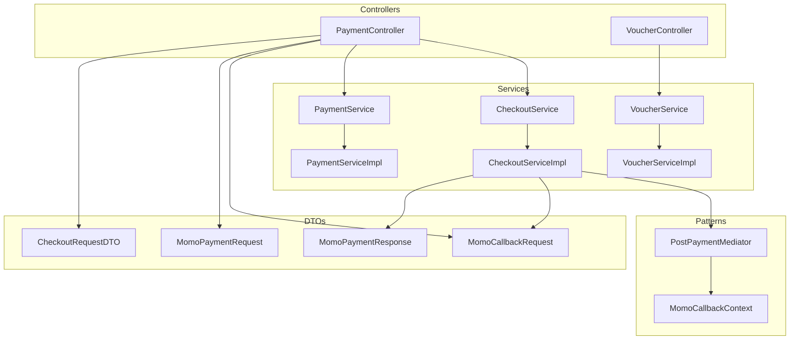
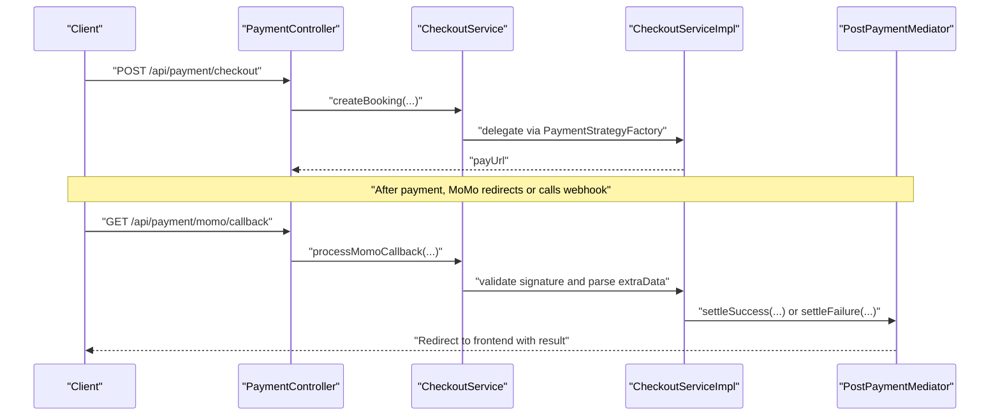
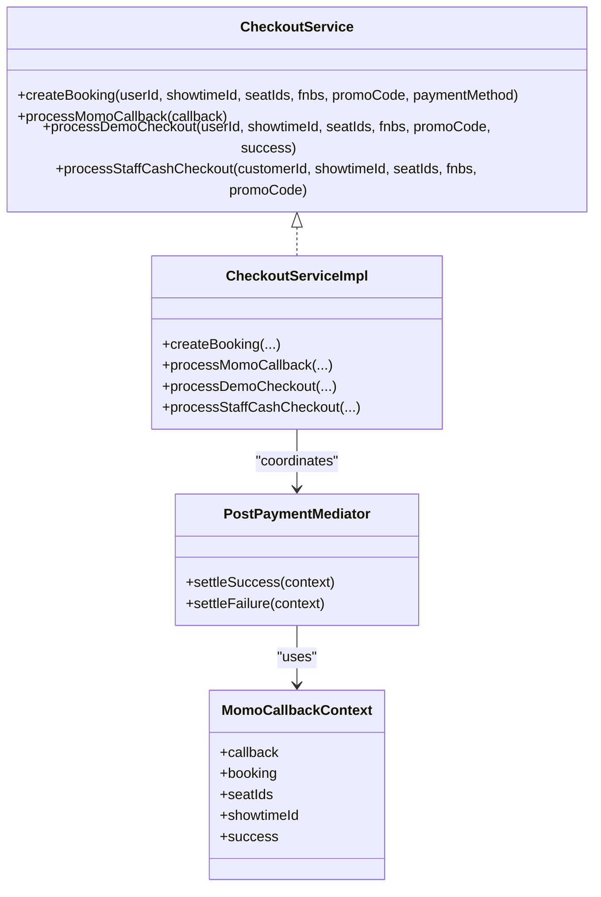
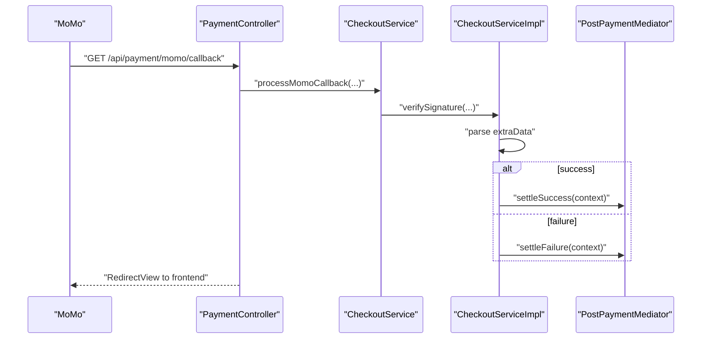
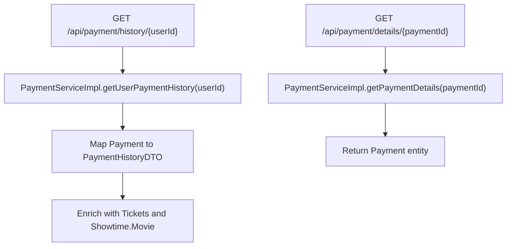
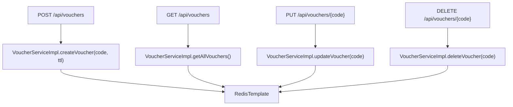
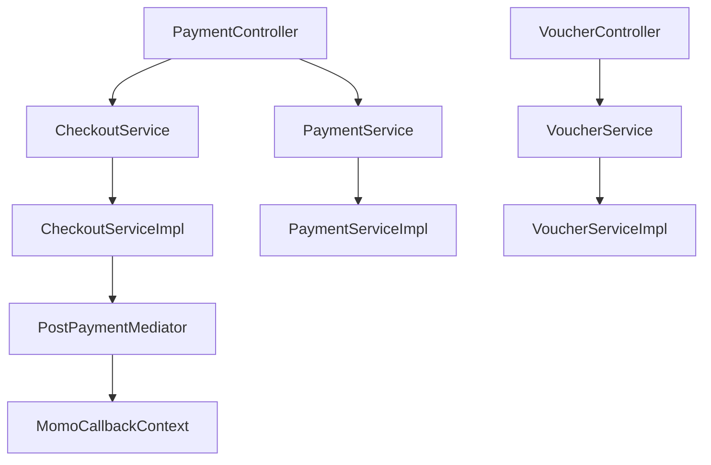

# Payment and Voucher Controller

<cite>
**Referenced Files in This Document**
- [PaymentController.java](file://backend/src/main/java/com/cinema/booking/controllers/PaymentController.java)
- [VoucherController.java](file://backend/src/main/java/com/cinema/booking/controllers/VoucherController.java)
- [CheckoutService.java](file://backend/src/main/java/com/cinema/booking/services/CheckoutService.java)
- [CheckoutServiceImpl.java](file://backend/src/main/java/com/cinema/booking/services/impl/CheckoutServiceImpl.java)
- [PaymentServiceImpl.java](file://backend/src/main/java/com/cinema/booking/services/impl/PaymentServiceImpl.java)
- [VoucherServiceImpl.java](file://backend/src/main/java/com/cinema/booking/services/impl/VoucherServiceImpl.java)
- [MomoCallbackRequest.java](file://backend/src/main/java/com/cinema/booking/dtos/MomoCallbackRequest.java)
- [MomoPaymentRequest.java](file://backend/src/main/java/com/cinema/booking/dtos/MomoPaymentRequest.java)
- [MomoPaymentResponse.java](file://backend/src/main/java/com/cinema/booking/dtos/MomoPaymentResponse.java)
- [CheckoutRequestDTO.java](file://backend/src/main/java/com/cinema/booking/dtos/CheckoutRequestDTO.java)
- [PostPaymentMediator.java](file://backend/src/main/java/com/cinema/booking/patterns/mediator/PostPaymentMediator.java)
- [MomoCallbackContext.java](file://backend/src/main/java/com/cinema/booking/patterns/mediator/MomoCallbackContext.java)
</cite>

## Table of Contents
1. [Introduction](#introduction)
2. [Project Structure](#project-structure)
3. [Core Components](#core-components)
4. [Architecture Overview](#architecture-overview)
5. [Detailed Component Analysis](#detailed-component-analysis)
6. [Dependency Analysis](#dependency-analysis)
7. [Performance Considerations](#performance-considerations)
8. [Troubleshooting Guide](#troubleshooting-guide)
9. [Conclusion](#conclusion)

## Introduction
This document provides comprehensive documentation for the Payment and Voucher Controllers responsible for financial transactions and promotional offer management. It covers payment endpoints for processing payments via MoMo, cash, and demo modes, payment validation, and callback handling. It also documents voucher endpoints for discount management, promotion application, and inventory tracking. The document explains the payment processing pipeline, refund operations, and financial reconciliation, along with examples of payment workflows, voucher application processes, and error handling for failed transactions.

## Project Structure
The payment and voucher functionality spans controllers, services, DTOs, and supporting patterns:
- Controllers expose REST endpoints for payment and voucher operations
- Services encapsulate business logic for checkout, payment history retrieval, and voucher management
- DTOs define request/response contracts for MoMo and checkout operations
- Patterns (Strategy, Mediator) orchestrate payment processing and post-payment actions



**Diagram sources**
- [PaymentController.java:16-149](file://backend/src/main/java/com/cinema/booking/controllers/PaymentController.java#L16-L149)
- [VoucherController.java:15-55](file://backend/src/main/java/com/cinema/booking/controllers/VoucherController.java#L15-L55)
- [CheckoutService.java:3-11](file://backend/src/main/java/com/cinema/booking/services/CheckoutService.java#L3-L11)
- [CheckoutServiceImpl.java:25-184](file://backend/src/main/java/com/cinema/booking/services/impl/CheckoutServiceImpl.java#L25-L184)
- [PaymentServiceImpl.java:14-68](file://backend/src/main/java/com/cinema/booking/services/impl/PaymentServiceImpl.java#L14-L68)
- [VoucherServiceImpl.java:16-82](file://backend/src/main/java/com/cinema/booking/services/impl/VoucherServiceImpl.java#L16-L82)
- [PostPaymentMediator.java:9-46](file://backend/src/main/java/com/cinema/booking/patterns/mediator/PostPaymentMediator.java#L9-L46)
- [MomoCallbackContext.java:10-18](file://backend/src/main/java/com/cinema/booking/patterns/mediator/MomoCallbackContext.java#L10-L18)
- [MomoCallbackRequest.java:6-20](file://backend/src/main/java/com/cinema/booking/dtos/MomoCallbackRequest.java#L6-L20)
- [MomoPaymentRequest.java:8-22](file://backend/src/main/java/com/cinema/booking/dtos/MomoPaymentRequest.java#L8-L22)
- [MomoPaymentResponse.java:6-17](file://backend/src/main/java/com/cinema/booking/dtos/MomoPaymentResponse.java#L6-L17)
- [CheckoutRequestDTO.java:7-15](file://backend/src/main/java/com/cinema/booking/dtos/CheckoutRequestDTO.java#L7-L15)

**Section sources**
- [PaymentController.java:16-149](file://backend/src/main/java/com/cinema/booking/controllers/PaymentController.java#L16-L149)
- [VoucherController.java:15-55](file://backend/src/main/java/com/cinema/booking/controllers/VoucherController.java#L15-L55)

## Core Components
- PaymentController: Exposes endpoints for checkout, demo checkout, MoMo callbacks (redirect and webhook), payment history retrieval, payment details, and staff cash checkout.
- VoucherController: Manages voucher lifecycle (create, update, delete, list) with role-based access control.
- CheckoutService and CheckoutServiceImpl: Implement payment processing using Strategy pattern and coordinate post-payment actions via Mediator pattern.
- PaymentServiceImpl: Retrieves user payment history and payment details.
- VoucherServiceImpl: Stores and retrieves vouchers in Redis with TTL support.

**Section sources**
- [PaymentController.java:31-148](file://backend/src/main/java/com/cinema/booking/controllers/PaymentController.java#L31-L148)
- [VoucherController.java:24-54](file://backend/src/main/java/com/cinema/booking/controllers/VoucherController.java#L24-L54)
- [CheckoutService.java:3-11](file://backend/src/main/java/com/cinema/booking/services/CheckoutService.java#L3-L11)
- [CheckoutServiceImpl.java:43-183](file://backend/src/main/java/com/cinema/booking/services/impl/CheckoutServiceImpl.java#L43-L183)
- [PaymentServiceImpl.java:23-67](file://backend/src/main/java/com/cinema/booking/services/impl/PaymentServiceImpl.java#L23-L67)
- [VoucherServiceImpl.java:43-81](file://backend/src/main/java/com/cinema/booking/services/impl/VoucherServiceImpl.java#L43-L81)

## Architecture Overview
The payment architecture integrates REST controllers, service layer, payment strategies, and a mediator for post-payment actions. MoMo callbacks trigger validation and settlement through the mediator, which coordinates multiple collaborators (booking updates, inventory rollbacks, user spending updates, ticket issuance, and notifications).



**Diagram sources**
- [PaymentController.java:33-88](file://backend/src/main/java/com/cinema/booking/controllers/PaymentController.java#L33-L88)
- [CheckoutServiceImpl.java:67-130](file://backend/src/main/java/com/cinema/booking/services/impl/CheckoutServiceImpl.java#L67-L130)
- [PostPaymentMediator.java:35-45](file://backend/src/main/java/com/cinema/booking/patterns/mediator/PostPaymentMediator.java#L35-L45)

## Detailed Component Analysis

### PaymentController Endpoints
- POST /api/payment/checkout: Creates a booking and returns a MoMo pay URL for the customer.
- POST /api/payment/checkout/demo: Demo checkout without real MoMo calls.
- GET /api/payment/momo/callback: Redirect callback handler that validates MoMo response and redirects to frontend.
- POST /api/payment/momo/webhook: Server-to-server IPN endpoint for MoMo notifications.
- GET /api/payment/payment-redirect: Generic redirect endpoint to frontend transaction page.
- GET /api/payment/history/{userId}: Retrieves user payment history.
- GET /api/payment/details/{paymentId}: Retrieves payment details.
- POST /api/payment/staff/cash-checkout: Staff POS cash checkout for immediate confirmation.

```mermaid
flowchart TD
Start(["Request Received"]) --> Route{"Endpoint"}
Route --> |/checkout| CreateBooking["Call createBooking()"]
Route --> |/checkout/demo| DemoCheckout["Call processDemoCheckout()"]
Route --> |/momo/callback| Callback["Validate signature<br/>Parse extraData<br/>Redirect to frontend"]
Route --> |/momo/webhook| Webhook["Validate signature<br/>Trigger settleSuccess/settleFailure"]
Route --> |/history/{userId}| History["Fetch user payment history"]
Route --> |/details/{paymentId}| Details["Fetch payment details"]
Route --> |/staff/cash-checkout| CashCheckout["Call processStaffCashCheckout()"]
CreateBooking --> ReturnPayUrl["Return payUrl"]
DemoCheckout --> ReturnDemoResult["Return demo result"]
Callback --> Redirect["RedirectView to frontend"]
Webhook --> NoContent["204 No Content"]
History --> ReturnHistory["Return list"]
Details --> ReturnPayment["Return payment entity"]
CashCheckout --> ReturnCashResult["Return POS result"]
ReturnPayUrl --> End(["Response Sent"])
ReturnDemoResult --> End
Redirect --> End
NoContent --> End
ReturnHistory --> End
ReturnPayment --> End
ReturnCashResult --> End
```

**Diagram sources**
- [PaymentController.java:33-148](file://backend/src/main/java/com/cinema/booking/controllers/PaymentController.java#L33-L148)

**Section sources**
- [PaymentController.java:31-148](file://backend/src/main/java/com/cinema/booking/controllers/PaymentController.java#L31-L148)

### Payment Processing Pipeline
The pipeline integrates Strategy pattern for payment methods and Mediator pattern for post-payment actions:
- Strategy selection based on payment method (MOMO, CASH, DEMO)
- Validation of MoMo signature and parsing of extraData containing booking context
- Success/failure branches invoking mediator colleagues for coordinated actions



**Diagram sources**
- [CheckoutService.java:3-11](file://backend/src/main/java/com/cinema/booking/services/CheckoutService.java#L3-L11)
- [CheckoutServiceImpl.java:26-184](file://backend/src/main/java/com/cinema/booking/services/impl/CheckoutServiceImpl.java#L26-L184)
- [PostPaymentMediator.java:9-46](file://backend/src/main/java/com/cinema/booking/patterns/mediator/PostPaymentMediator.java#L9-L46)
- [MomoCallbackContext.java:10-18](file://backend/src/main/java/com/cinema/booking/patterns/mediator/MomoCallbackContext.java#L10-L18)

**Section sources**
- [CheckoutServiceImpl.java:43-183](file://backend/src/main/java/com/cinema/booking/services/impl/CheckoutServiceImpl.java#L43-L183)
- [PostPaymentMediator.java:35-45](file://backend/src/main/java/com/cinema/booking/patterns/mediator/PostPaymentMediator.java#L35-L45)

### MoMo Callback Handling
MoMo callbacks are validated and processed to either confirm or rollback the booking. The extraData field carries booking context and is parsed to extract seat IDs and showtime information. The mediator ensures all related systems are synchronized.



**Diagram sources**
- [PaymentController.java:75-88](file://backend/src/main/java/com/cinema/booking/controllers/PaymentController.java#L75-L88)
- [CheckoutServiceImpl.java:67-130](file://backend/src/main/java/com/cinema/booking/services/impl/CheckoutServiceImpl.java#L67-L130)
- [PostPaymentMediator.java:35-45](file://backend/src/main/java/com/cinema/booking/patterns/mediator/PostPaymentMediator.java#L35-L45)

**Section sources**
- [PaymentController.java:73-100](file://backend/src/main/java/com/cinema/booking/controllers/PaymentController.java#L73-L100)
- [CheckoutServiceImpl.java:67-130](file://backend/src/main/java/com/cinema/booking/services/impl/CheckoutServiceImpl.java#L67-L130)

### Payment History and Details
PaymentServiceImpl provides user-centric payment history and detailed payment records, enriching data with movie and showtime information.



**Diagram sources**
- [PaymentServiceImpl.java:23-67](file://backend/src/main/java/com/cinema/booking/services/impl/PaymentServiceImpl.java#L23-L67)

**Section sources**
- [PaymentServiceImpl.java:23-67](file://backend/src/main/java/com/cinema/booking/services/impl/PaymentServiceImpl.java#L23-L67)

### Voucher Management
VoucherController exposes endpoints for creating, updating, deleting, and listing vouchers. VoucherServiceImpl stores and retrieves vouchers in Redis with TTL support, normalizing legacy payloads to DTOs.



**Diagram sources**
- [VoucherController.java:24-54](file://backend/src/main/java/com/cinema/booking/controllers/VoucherController.java#L24-L54)
- [VoucherServiceImpl.java:43-81](file://backend/src/main/java/com/cinema/booking/services/impl/VoucherServiceImpl.java#L43-L81)

**Section sources**
- [VoucherController.java:24-54](file://backend/src/main/java/com/cinema/booking/controllers/VoucherController.java#L24-L54)
- [VoucherServiceImpl.java:43-81](file://backend/src/main/java/com/cinema/booking/services/impl/VoucherServiceImpl.java#L43-L81)

### Payment Workflows and Examples
- MoMo Checkout Workflow:
  - Client submits a checkout request with seats, showtime, and promo code.
  - Server creates a booking and returns a pay URL.
  - After payment, MoMo redirects to the callback endpoint or calls the webhook.
  - Server validates the callback, parses extraData, and triggers mediator to confirm or rollback.
  - Client is redirected to the frontend transaction page with success or failure status.

- Demo Checkout Workflow:
  - Client invokes the demo endpoint with a success flag.
  - Server simulates payment processing and returns a demo result payload.

- Staff Cash Checkout Workflow:
  - Staff submits a cash checkout request via the POS endpoint.
  - Server immediately confirms the booking and records a cash payment.

**Section sources**
- [PaymentController.java:31-148](file://backend/src/main/java/com/cinema/booking/controllers/PaymentController.java#L31-L148)
- [CheckoutServiceImpl.java:43-183](file://backend/src/main/java/com/cinema/booking/services/impl/CheckoutServiceImpl.java#L43-L183)

### Voucher Application Process
- Vouchers are stored in Redis with TTL and normalized to DTOs upon retrieval.
- VoucherController endpoints enforce role-based access control for administrative operations.
- VoucherServiceImpl handles creation, updates (preserving TTL), deletion, and listing.

**Section sources**
- [VoucherController.java:24-54](file://backend/src/main/java/com/cinema/booking/controllers/VoucherController.java#L24-L54)
- [VoucherServiceImpl.java:43-81](file://backend/src/main/java/com/cinema/booking/services/impl/VoucherServiceImpl.java#L43-L81)

### Error Handling for Failed Transactions
- PaymentController returns structured error messages for invalid requests and exceptions.
- CheckoutServiceImpl validates MoMo signatures and extraData, throwing descriptive errors on mismatch or missing fields.
- PaymentServiceImpl throws runtime exceptions for non-existent payment IDs.
- VoucherServiceImpl throws runtime exceptions for non-existent or expired vouchers during updates.

**Section sources**
- [PaymentController.java:48-118](file://backend/src/main/java/com/cinema/booking/controllers/PaymentController.java#L48-L118)
- [CheckoutServiceImpl.java:67-130](file://backend/src/main/java/com/cinema/booking/services/impl/CheckoutServiceImpl.java#L67-L130)
- [PaymentServiceImpl.java:31-34](file://backend/src/main/java/com/cinema/booking/services/impl/PaymentServiceImpl.java#L31-L34)
- [VoucherServiceImpl.java:55-57](file://backend/src/main/java/com/cinema/booking/services/impl/VoucherServiceImpl.java#L55-L57)

## Dependency Analysis
The controllers depend on services, which in turn rely on repositories, external integrations (MoMo), and internal patterns. The mediator pattern decouples post-payment actions among multiple collaborators.



**Diagram sources**
- [PaymentController.java:22-26](file://backend/src/main/java/com/cinema/booking/controllers/PaymentController.java#L22-L26)
- [VoucherController.java:21-22](file://backend/src/main/java/com/cinema/booking/controllers/VoucherController.java#L21-L22)
- [CheckoutServiceImpl.java:31-41](file://backend/src/main/java/com/cinema/booking/services/impl/CheckoutServiceImpl.java#L31-L41)
- [PostPaymentMediator.java:14-32](file://backend/src/main/java/com/cinema/booking/patterns/mediator/PostPaymentMediator.java#L14-L32)

**Section sources**
- [CheckoutServiceImpl.java:31-41](file://backend/src/main/java/com/cinema/booking/services/impl/CheckoutServiceImpl.java#L31-L41)
- [PostPaymentMediator.java:14-32](file://backend/src/main/java/com/cinema/booking/patterns/mediator/PostPaymentMediator.java#L14-L32)

## Performance Considerations
- Redis operations for voucher management are efficient with TTL-based expiration.
- Payment history queries leverage repository projections mapped to DTOs to minimize payload size.
- Mediator pattern ensures ordered execution of post-payment actions; maintain minimal overhead in colleague implementations.
- MoMo callback processing includes URL decoding and parsing; ensure robustness against malformed extraData.

## Troubleshooting Guide
Common issues and resolutions:
- MoMo signature verification fails: Verify shared secrets and signing algorithm alignment.
- Missing extraData in callback: Ensure client passes booking context in extraData during payment initiation.
- Non-existent payment ID: Validate payment identifiers and ensure proper transaction persistence.
- Voucher update failures: Confirm voucher exists and is not expired; updates preserve TTL.

**Section sources**
- [CheckoutServiceImpl.java:67-130](file://backend/src/main/java/com/cinema/booking/services/impl/CheckoutServiceImpl.java#L67-L130)
- [PaymentServiceImpl.java:31-34](file://backend/src/main/java/com/cinema/booking/services/impl/PaymentServiceImpl.java#L31-L34)
- [VoucherServiceImpl.java:55-57](file://backend/src/main/java/com/cinema/booking/services/impl/VoucherServiceImpl.java#L55-L57)

## Conclusion
The Payment and Voucher Controllers provide a robust foundation for financial transactions and promotional offer management. The Strategy and Mediator patterns enable scalable payment processing and coordinated post-payment actions, while Redis-backed voucher storage supports dynamic discount management. The documented endpoints, workflows, and error handling facilitate reliable integration and maintenance.