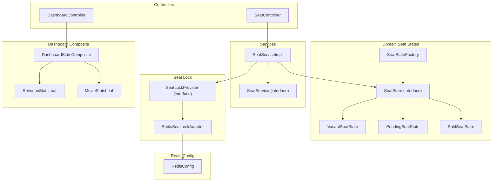
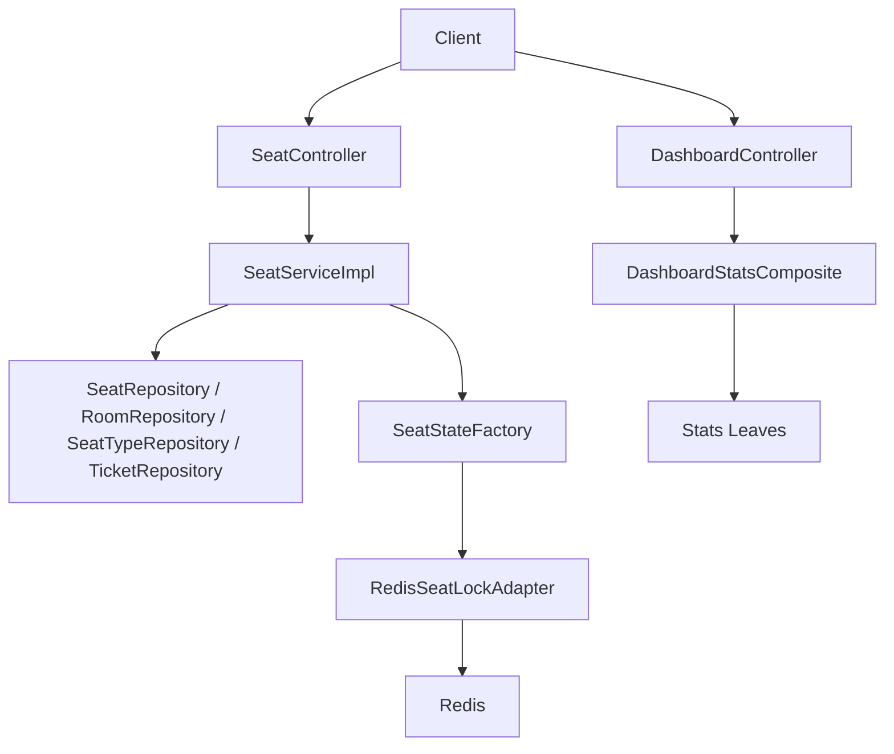
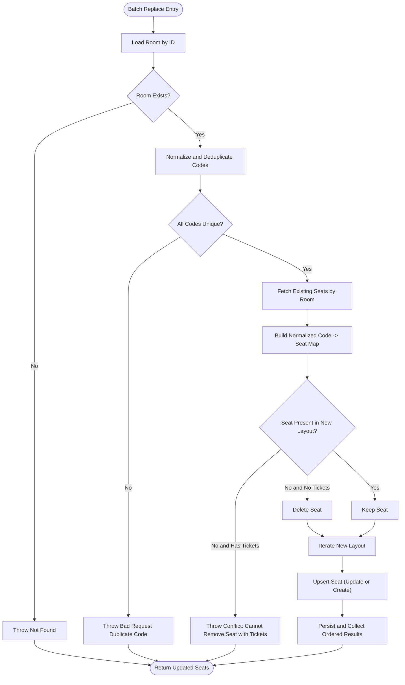
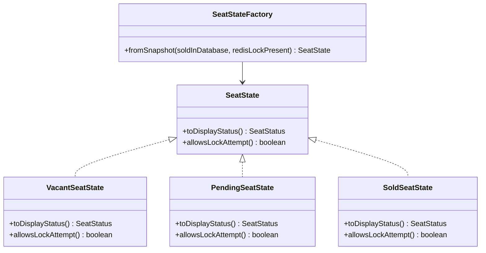
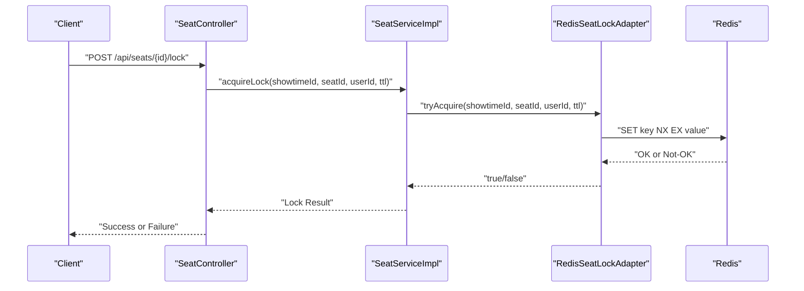
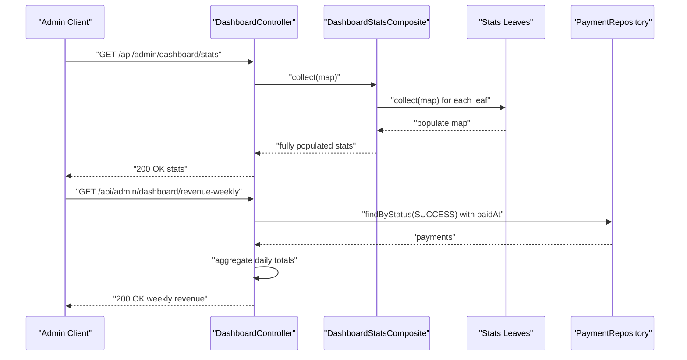
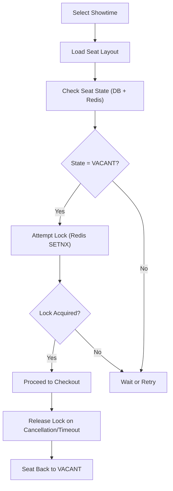
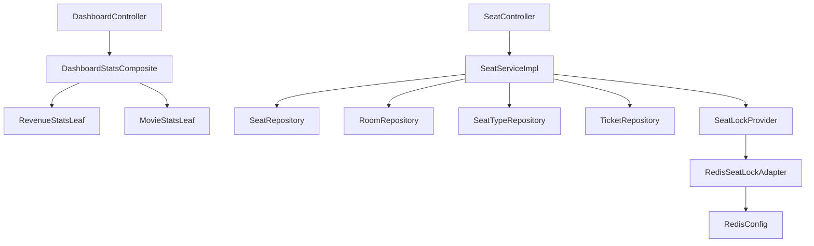

# Seat and Dashboard Controller

<cite>
**Referenced Files in This Document**
- [SeatController.java](file://backend/src/main/java/com/cinema/booking/controllers/SeatController.java)
- [DashboardController.java](file://backend/src/main/java/com/cinema/booking/controllers/DashboardController.java)
- [SeatServiceImpl.java](file://backend/src/main/java/com/cinema/booking/services/impl/SeatServiceImpl.java)
- [SeatService.java](file://backend/src/main/java/com/cinema/booking/services/SeatService.java)
- [SeatState.java](file://backend/src/main/java/com/cinema/booking/domain/seat/SeatState.java)
- [VacantSeatState.java](file://backend/src/main/java/com/cinema/booking/domain/seat/VacantSeatState.java)
- [PendingSeatState.java](file://backend/src/main/java/com/cinema/booking/domain/seat/PendingSeatState.java)
- [SoldSeatState.java](file://backend/src/main/java/com/cinema/booking/domain/seat/SoldSeatState.java)
- [SeatStateFactory.java](file://backend/src/main/java/com/cinema/booking/domain/seat/SeatStateFactory.java)
- [SeatLockProvider.java](file://backend/src/main/java/com/cinema/booking/services/seatlock/SeatLockProvider.java)
- [RedisSeatLockAdapter.java](file://backend/src/main/java/com/cinema/booking/services/seatlock/RedisSeatLockAdapter.java)
- [RedisConfig.java](file://backend/src/main/java/com/cinema/booking/config/RedisConfig.java)
- [SeatStatusDTO.java](file://backend/src/main/java/com/cinema/booking/dtos/SeatStatusDTO.java)
- [DashboardStatsComposite.java](file://backend/src/main/java/com/cinema/booking/patterns/composite/DashboardStatsComposite.java)
- [StatsComponent.java](file://backend/src/main/java/com/cinema/booking/patterns/composite/StatsComponent.java)
- [RevenueStatsLeaf.java](file://backend/src/main/java/com/cinema/booking/patterns/composite/RevenueStatsLeaf.java)
- [MovieStatsLeaf.java](file://backend/src/main/java/com/cinema/booking/patterns/composite/MovieStatsLeaf.java)
</cite>

## Table of Contents
1. [Introduction](#introduction)
2. [Project Structure](#project-structure)
3. [Core Components](#core-components)
4. [Architecture Overview](#architecture-overview)
5. [Detailed Component Analysis](#detailed-component-analysis)
6. [Dependency Analysis](#dependency-analysis)
7. [Performance Considerations](#performance-considerations)
8. [Troubleshooting Guide](#troubleshooting-guide)
9. [Conclusion](#conclusion)
10. [Appendices](#appendices)

## Introduction
This document provides comprehensive documentation for the Seat and Dashboard Controllers responsible for seat management and administrative analytics. It covers seat endpoints for seat configuration, availability checking, and seat type management; dashboard endpoints for system analytics, revenue reporting, and performance metrics. It also explains the seat locking mechanism, real-time availability updates, and capacity management, along with integration with Redis caching and real-time data updates. Examples of seat selection workflows, dashboard reporting queries, and administrative monitoring operations are included to guide both developers and administrators.

## Project Structure
The seat and dashboard controllers reside in the backend module under the controllers package. Supporting services, domain seat states, seat lock providers, and composite dashboard statistics are organized under services, domain, and patterns packages respectively. Redis configuration and DTOs support real-time availability and status reporting.

**Diagram sources**
- [SeatController.java:1-60](file://backend/src/main/java/com/cinema/booking/controllers/SeatController.java#L1-L60)
- [DashboardController.java:1-68](file://backend/src/main/java/com/cinema/booking/controllers/DashboardController.java#L1-L68)
- [SeatService.java:1-15](file://backend/src/main/java/com/cinema/booking/services/SeatService.java#L1-L15)
- [SeatServiceImpl.java:1-203](file://backend/src/main/java/com/cinema/booking/services/impl/SeatServiceImpl.java#L1-L203)
- [SeatState.java:1-18](file://backend/src/main/java/com/cinema/booking/domain/seat/SeatState.java#L1-L18)
- [VacantSeatState.java:1-22](file://backend/src/main/java/com/cinema/booking/domain/seat/VacantSeatState.java#L1-L22)
- [PendingSeatState.java:1-22](file://backend/src/main/java/com/cinema/booking/domain/seat/PendingSeatState.java#L1-L22)
- [SoldSeatState.java:1-22](file://backend/src/main/java/com/cinema/booking/domain/seat/SoldSeatState.java#L1-L22)
- [SeatStateFactory.java:1-21](file://backend/src/main/java/com/cinema/booking/domain/seat/SeatStateFactory.java#L1-L21)
- [SeatLockProvider.java:1-19](file://backend/src/main/java/com/cinema/booking/services/seatlock/SeatLockProvider.java#L1-L19)
- [RedisSeatLockAdapter.java:1-56](file://backend/src/main/java/com/cinema/booking/services/seatlock/RedisSeatLockAdapter.java#L1-L56)
- [DashboardStatsComposite.java:1-44](file://backend/src/main/java/com/cinema/booking/patterns/composite/DashboardStatsComposite.java#L1-L44)
- [RevenueStatsLeaf.java:1-32](file://backend/src/main/java/com/cinema/booking/patterns/composite/RevenueStatsLeaf.java#L1-L32)
- [MovieStatsLeaf.java:1-20](file://backend/src/main/java/com/cinema/booking/patterns/composite/MovieStatsLeaf.java#L1-L20)
- [RedisConfig.java:1-55](file://backend/src/main/java/com/cinema/booking/config/RedisConfig.java#L1-L55)

**Section sources**
- [SeatController.java:1-60](file://backend/src/main/java/com/cinema/booking/controllers/SeatController.java#L1-L60)
- [DashboardController.java:1-68](file://backend/src/main/java/com/cinema/booking/controllers/DashboardController.java#L1-L68)

## Core Components
- SeatController: Exposes REST endpoints for seat CRUD operations, batch replacement by room, and retrieval by room or ID.
- SeatService and SeatServiceImpl: Implement business logic for seat management, including seat code normalization, seat type validation, and batch replacement with conflict checks against existing tickets.
- Seat Domain States: SeatState interface and implementations (Vacant, Pending, Sold) define display status and lock eligibility based on database and Redis lock presence.
- Seat Lock Provider: SeatLockProvider abstracts seat locking; RedisSeatLockAdapter implements Redis-based locking with TTL and batch lock checks.
- DashboardController: Provides system-wide statistics via a composite pattern and weekly revenue aggregation.
- Composite Dashboard Statistics: DashboardStatsComposite orchestrates multiple leaf statistics (movies, users, showtimes, food & beverage, vouchers, revenue).
- Redis Configuration: RedisConfig sets up Lettuce connection and JSON serialization for RedisTemplate.

**Section sources**
- [SeatController.java:1-60](file://backend/src/main/java/com/cinema/booking/controllers/SeatController.java#L1-L60)
- [SeatService.java:1-15](file://backend/src/main/java/com/cinema/booking/services/SeatService.java#L1-L15)
- [SeatServiceImpl.java:1-203](file://backend/src/main/java/com/cinema/booking/services/impl/SeatServiceImpl.java#L1-L203)
- [SeatState.java:1-18](file://backend/src/main/java/com/cinema/booking/domain/seat/SeatState.java#L1-L18)
- [VacantSeatState.java:1-22](file://backend/src/main/java/com/cinema/booking/domain/seat/VacantSeatState.java#L1-L22)
- [PendingSeatState.java:1-22](file://backend/src/main/java/com/cinema/booking/domain/seat/PendingSeatState.java#L1-L22)
- [SoldSeatState.java:1-22](file://backend/src/main/java/com/cinema/booking/domain/seat/SoldSeatState.java#L1-L22)
- [SeatStateFactory.java:1-21](file://backend/src/main/java/com/cinema/booking/domain/seat/SeatStateFactory.java#L1-L21)
- [SeatLockProvider.java:1-19](file://backend/src/main/java/com/cinema/booking/services/seatlock/SeatLockProvider.java#L1-L19)
- [RedisSeatLockAdapter.java:1-56](file://backend/src/main/java/com/cinema/booking/services/seatlock/RedisSeatLockAdapter.java#L1-L56)
- [DashboardController.java:1-68](file://backend/src/main/java/com/cinema/booking/controllers/DashboardController.java#L1-L68)
- [DashboardStatsComposite.java:1-44](file://backend/src/main/java/com/cinema/booking/patterns/composite/DashboardStatsComposite.java#L1-L44)
- [StatsComponent.java:1-12](file://backend/src/main/java/com/cinema/booking/patterns/composite/StatsComponent.java#L1-L12)
- [RevenueStatsLeaf.java:1-32](file://backend/src/main/java/com/cinema/booking/patterns/composite/RevenueStatsLeaf.java#L1-L32)
- [MovieStatsLeaf.java:1-20](file://backend/src/main/java/com/cinema/booking/patterns/composite/MovieStatsLeaf.java#L1-L20)
- [RedisConfig.java:1-55](file://backend/src/main/java/com/cinema/booking/config/RedisConfig.java#L1-L55)

## Architecture Overview
The system integrates controllers, services, domain seat states, and Redis-backed seat locks. Dashboard analytics leverage a composite pattern to aggregate statistics efficiently.

**Diagram sources**
- [SeatController.java:1-60](file://backend/src/main/java/com/cinema/booking/controllers/SeatController.java#L1-L60)
- [DashboardController.java:1-68](file://backend/src/main/java/com/cinema/booking/controllers/DashboardController.java#L1-L68)
- [SeatServiceImpl.java:1-203](file://backend/src/main/java/com/cinema/booking/services/impl/SeatServiceImpl.java#L1-L203)
- [SeatStateFactory.java:1-21](file://backend/src/main/java/com/cinema/booking/domain/seat/SeatStateFactory.java#L1-L21)
- [RedisSeatLockAdapter.java:1-56](file://backend/src/main/java/com/cinema/booking/services/seatlock/RedisSeatLockAdapter.java#L1-L56)
- [DashboardStatsComposite.java:1-44](file://backend/src/main/java/com/cinema/booking/patterns/composite/DashboardStatsComposite.java#L1-L44)

## Detailed Component Analysis

### Seat Controller Endpoints
- Retrieve all seats or filter by room:
  - GET /api/seats?roomId={id}
  - GET /api/seats/{id}
- Create, update, and delete seats:
  - POST /api/seats
  - PUT /api/seats/{id}
  - DELETE /api/seats/{id}
- Batch replace seats in a room:
  - PUT /api/seats/batch/{roomId}

These endpoints delegate to SeatService for business logic and persistence.

**Section sources**
- [SeatController.java:20-57](file://backend/src/main/java/com/cinema/booking/controllers/SeatController.java#L20-L57)
- [SeatService.java:6-14](file://backend/src/main/java/com/cinema/booking/services/SeatService.java#L6-L14)

### Seat Management Business Logic
- Seat code resolution and normalization:
  - Accepts either seatCode or seatRow + seatNumber; normalizes to uppercase and trims whitespace.
- Seat type validation:
  - Ensures seatTypeId exists before creating/updating a seat.
- Room validation:
  - Validates roomId exists before creating/updating a seat.
- Batch replacement with conflict checks:
  - Validates uniqueness of seat codes within the layout.
  - Prevents deletion of seats that have associated tickets.
  - Updates existing seats and creates new ones while preserving order.

**Diagram sources**
- [SeatServiceImpl.java:125-187](file://backend/src/main/java/com/cinema/booking/services/impl/SeatServiceImpl.java#L125-L187)

**Section sources**
- [SeatServiceImpl.java:125-201](file://backend/src/main/java/com/cinema/booking/services/impl/SeatServiceImpl.java#L125-L201)

### Seat Availability and Status
- Seat status enumeration includes VACANT, SOLD, and PENDING.
- SeatStateFactory determines current state from two snapshots:
  - Database: whether the seat is sold.
  - Redis: whether a lock exists for the seat during a showtime.
- SeatState defines:
  - Display status mapping.
  - Whether a lock attempt is allowed (locks are disallowed for SOLD seats).

**Diagram sources**
- [SeatState.java:1-18](file://backend/src/main/java/com/cinema/booking/domain/seat/SeatState.java#L1-L18)
- [VacantSeatState.java:1-22](file://backend/src/main/java/com/cinema/booking/domain/seat/VacantSeatState.java#L1-L22)
- [PendingSeatState.java:1-22](file://backend/src/main/java/com/cinema/booking/domain/seat/PendingSeatState.java#L1-L22)
- [SoldSeatState.java:1-22](file://backend/src/main/java/com/cinema/booking/domain/seat/SoldSeatState.java#L1-L22)
- [SeatStateFactory.java:1-21](file://backend/src/main/java/com/cinema/booking/domain/seat/SeatStateFactory.java#L1-L21)

**Section sources**
- [SeatState.java:8-17](file://backend/src/main/java/com/cinema/booking/domain/seat/SeatState.java#L8-L17)
- [SeatStateFactory.java:11-19](file://backend/src/main/java/com/cinema/booking/domain/seat/SeatStateFactory.java#L11-L19)
- [SeatStatusDTO.java:22-24](file://backend/src/main/java/com/cinema/booking/dtos/SeatStatusDTO.java#L22-L24)

### Seat Locking Mechanism and Real-Time Availability
- SeatLockProvider abstracts seat locking with:
  - tryAcquire(showtimeId, seatId, holderUserId, ttlSeconds)
  - release(showtimeId, seatId)
  - batchLockHeld(showtimeId, seatIds)
- RedisSeatLockAdapter implements Redis-based locking:
  - Uses SETNX semantics with TTL.
  - Generates keys per showtime and seat.
  - Supports batch lock checks via multiGet.
- Seat availability:
  - PENDING indicates a temporary lock by a user.
  - VACANT indicates available for selection.
  - SOLD indicates unavailable.

**Diagram sources**
- [SeatLockProvider.java:10-17](file://backend/src/main/java/com/cinema/booking/services/seatlock/SeatLockProvider.java#L10-L17)
- [RedisSeatLockAdapter.java:27-37](file://backend/src/main/java/com/cinema/booking/services/seatlock/RedisSeatLockAdapter.java#L27-L37)
- [SeatController.java:20-57](file://backend/src/main/java/com/cinema/booking/controllers/SeatController.java#L20-L57)

**Section sources**
- [SeatLockProvider.java:8-18](file://backend/src/main/java/com/cinema/booking/services/seatlock/SeatLockProvider.java#L8-L18)
- [RedisSeatLockAdapter.java:23-54](file://backend/src/main/java/com/cinema/booking/services/seatlock/RedisSeatLockAdapter.java#L23-L54)
- [RedisConfig.java:39-53](file://backend/src/main/java/com/cinema/booking/config/RedisConfig.java#L39-L53)

### Dashboard Analytics Endpoints
- System statistics:
  - GET /api/admin/dashboard/stats
  - Aggregates counts and totals via DashboardStatsComposite.
- Weekly revenue:
  - GET /api/admin/dashboard/revenue-weekly
  - Returns daily revenue for the last 7 days based on successful payments.

**Diagram sources**
- [DashboardController.java:32-66](file://backend/src/main/java/com/cinema/booking/controllers/DashboardController.java#L32-L66)
- [DashboardStatsComposite.java:37-42](file://backend/src/main/java/com/cinema/booking/patterns/composite/DashboardStatsComposite.java#L37-L42)
- [RevenueStatsLeaf.java:20-30](file://backend/src/main/java/com/cinema/booking/patterns/composite/RevenueStatsLeaf.java#L20-L30)

**Section sources**
- [DashboardController.java:31-66](file://backend/src/main/java/com/cinema/booking/controllers/DashboardController.java#L31-L66)
- [DashboardStatsComposite.java:14-43](file://backend/src/main/java/com/cinema/booking/patterns/composite/DashboardStatsComposite.java#L14-L43)
- [StatsComponent.java:9-11](file://backend/src/main/java/com/cinema/booking/patterns/composite/StatsComponent.java#L9-L11)
- [RevenueStatsLeaf.java:15-31](file://backend/src/main/java/com/cinema/booking/patterns/composite/RevenueStatsLeaf.java#L15-L31)
- [MovieStatsLeaf.java:11-19](file://backend/src/main/java/com/cinema/booking/patterns/composite/MovieStatsLeaf.java#L11-L19)

### Seat Selection Workflow Example
- User selects a showtime and views seat layout.
- The client requests seat statuses (display status and lock state).
- For available seats:
  - Client attempts to acquire a lock via the seat lock provider.
  - On success, the seat transitions to PENDING; the client proceeds to checkout.
- For locked seats:
  - The client waits or retries until the lock TTL expires or another user releases the lock.
- After checkout completion or cancellation:
  - The lock is released; the seat becomes VACANT again.

[No sources needed since this diagram shows conceptual workflow, not actual code structure]

### Administrative Monitoring Operations
- Use GET /api/admin/dashboard/stats to retrieve aggregated system metrics.
- Use GET /api/admin/dashboard/revenue-weekly to monitor daily revenue trends.
- Use batch seat replacement to reconfigure layouts efficiently without individual requests.

**Section sources**
- [DashboardController.java:32-66](file://backend/src/main/java/com/cinema/booking/controllers/DashboardController.java#L32-L66)
- [SeatController.java:51-57](file://backend/src/main/java/com/cinema/booking/controllers/SeatController.java#L51-L57)

## Dependency Analysis
The controllers depend on services and repositories. Services encapsulate business logic and coordinate with domain states and seat locks. The dashboard composite pattern reduces controller dependencies by delegating statistics collection to specialized leaves.

**Diagram sources**
- [SeatController.java:1-60](file://backend/src/main/java/com/cinema/booking/controllers/SeatController.java#L1-L60)
- [DashboardController.java:1-68](file://backend/src/main/java/com/cinema/booking/controllers/DashboardController.java#L1-L68)
- [SeatServiceImpl.java:1-203](file://backend/src/main/java/com/cinema/booking/services/impl/SeatServiceImpl.java#L1-L203)
- [DashboardStatsComposite.java:1-44](file://backend/src/main/java/com/cinema/booking/patterns/composite/DashboardStatsComposite.java#L1-L44)
- [RedisSeatLockAdapter.java:1-56](file://backend/src/main/java/com/cinema/booking/services/seatlock/RedisSeatLockAdapter.java#L1-L56)
- [RedisConfig.java:1-55](file://backend/src/main/java/com/cinema/booking/config/RedisConfig.java#L1-L55)

**Section sources**
- [SeatServiceImpl.java:30-40](file://backend/src/main/java/com/cinema/booking/services/impl/SeatServiceImpl.java#L30-L40)
- [DashboardStatsComposite.java:19-35](file://backend/src/main/java/com/cinema/booking/patterns/composite/DashboardStatsComposite.java#L19-L35)

## Performance Considerations
- Batch seat replacement minimizes database round trips and enforces uniqueness and ticket constraints in-memory before persistence.
- Redis-based seat locks use atomic SETNX with TTL, enabling low-latency lock acquisition and release.
- Composite dashboard statistics reduce controller complexity and enable efficient aggregation of multiple metrics in a single request.
- RedisTemplate is configured with JSON serialization for efficient caching and real-time updates.

[No sources needed since this section provides general guidance]

## Troubleshooting Guide
- Seat code conflicts during batch replacement:
  - Symptom: Error indicating duplicate seat codes.
  - Resolution: Ensure unique seat codes within the layout.
- Attempting to remove seats with existing tickets:
  - Symptom: Conflict error when deleting seats.
  - Resolution: Retain seat positions or process ticket cancellations first.
- Seat lock acquisition failures:
  - Symptom: Lock attempts fail due to existing locks.
  - Resolution: Wait for TTL expiration or release by the holder; avoid long-running locks.
- Redis connectivity issues:
  - Symptom: Lock operations fail or timeouts.
  - Resolution: Verify Redis host, port, credentials, and network connectivity; confirm JSON serializer configuration.

**Section sources**
- [SeatServiceImpl.java:133-158](file://backend/src/main/java/com/cinema/booking/services/impl/SeatServiceImpl.java#L133-L158)
- [RedisSeatLockAdapter.java:27-37](file://backend/src/main/java/com/cinema/booking/services/seatlock/RedisSeatLockAdapter.java#L27-L37)
- [RedisConfig.java:39-53](file://backend/src/main/java/com/cinema/booking/config/RedisConfig.java#L39-L53)

## Conclusion
The Seat and Dashboard Controllers provide a robust foundation for seat management and administrative analytics. Seat endpoints support flexible configuration and batch operations, while the seat state machine and Redis-backed locking ensure accurate, real-time availability. The dashboard composite pattern simplifies analytics and enables scalable reporting. Together, these components deliver a maintainable and performant solution for cinema seat booking and administration.

[No sources needed since this section summarizes without analyzing specific files]

## Appendices
- Seat status enumeration and DTO structure support consistent status reporting across clients and services.
- Redis configuration ensures reliable caching and real-time updates for seat locks and analytics.

**Section sources**
- [SeatStatusDTO.java:1-26](file://backend/src/main/java/com/cinema/booking/dtos/SeatStatusDTO.java#L1-L26)
- [RedisConfig.java:39-53](file://backend/src/main/java/com/cinema/booking/config/RedisConfig.java#L39-L53)