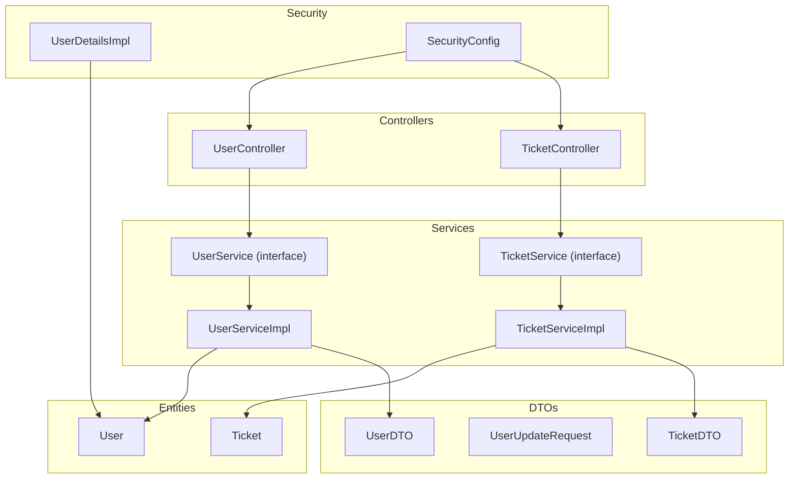
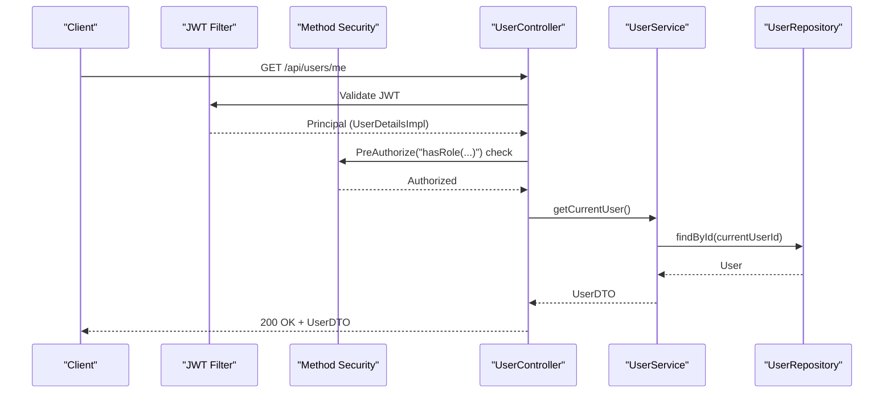
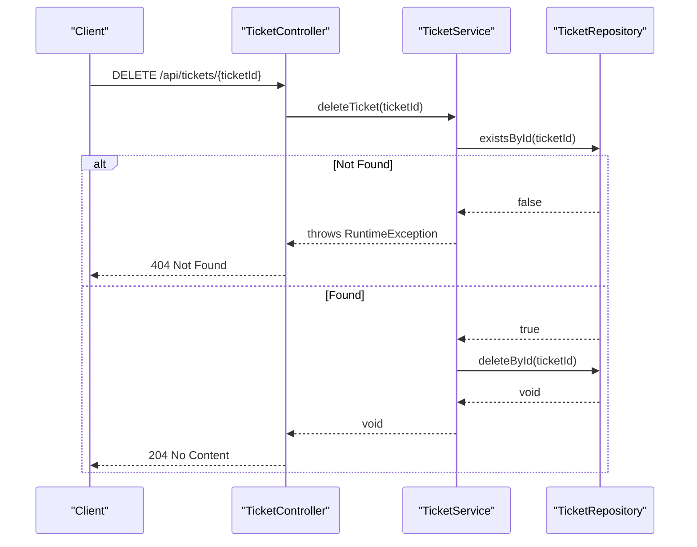
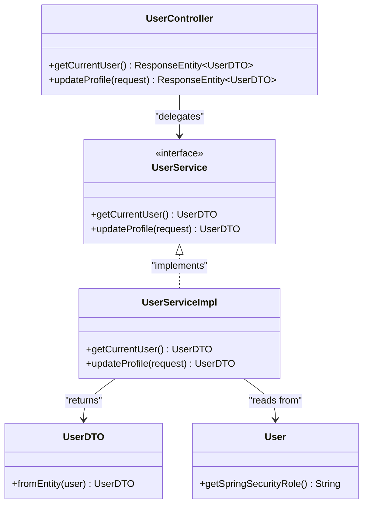
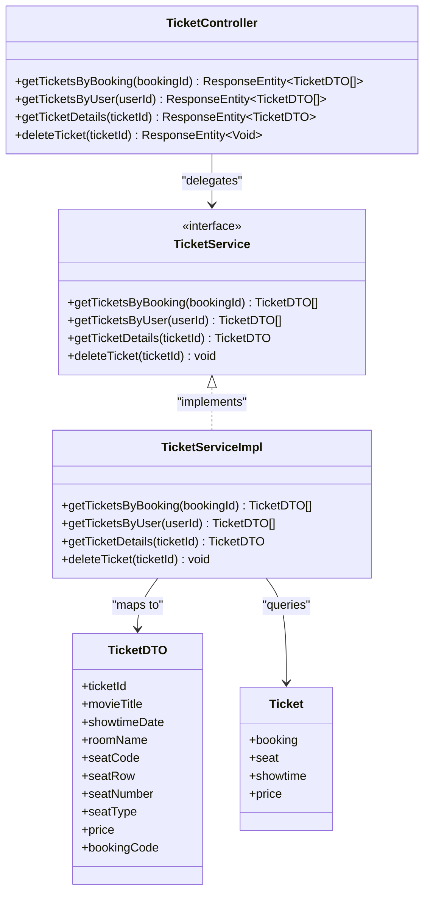
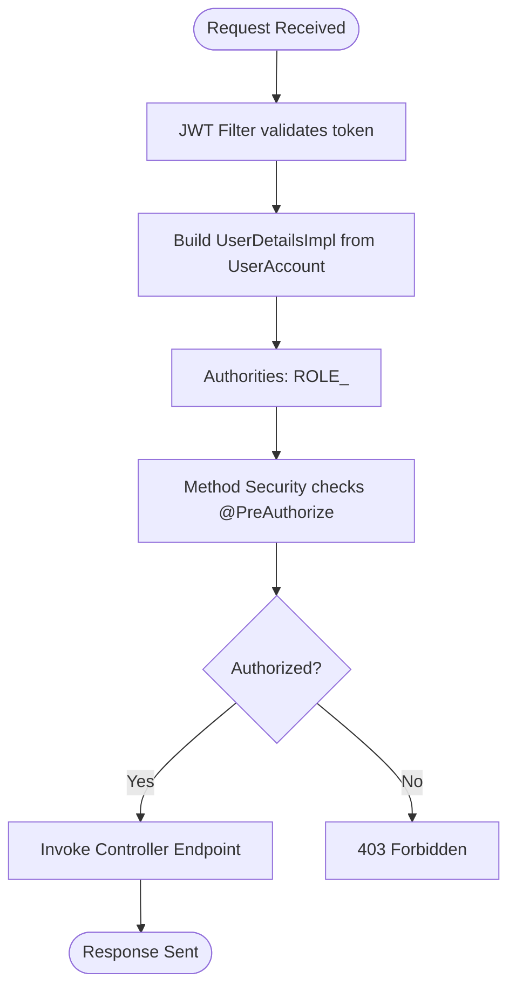
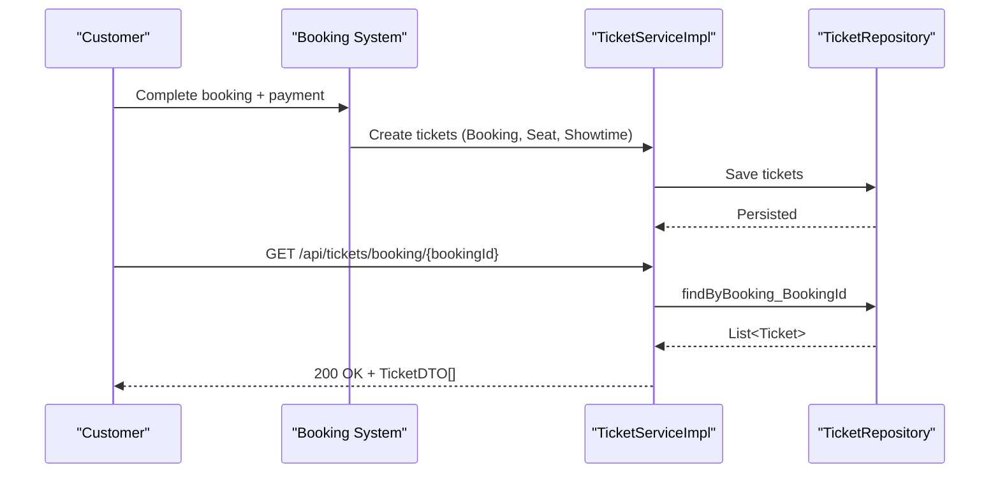
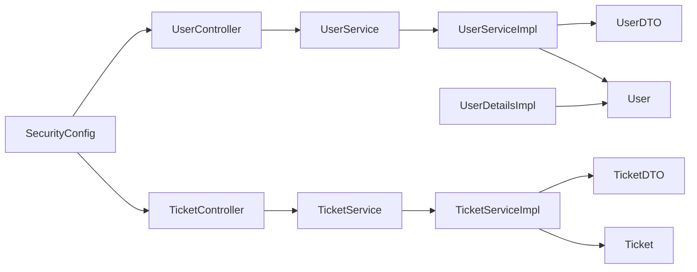

# Ticket and User Controller

<cite>
**Referenced Files in This Document**
- [UserController.java](file://backend/src/main/java/com/cinema/booking/controllers/UserController.java)
- [TicketController.java](file://backend/src/main/java/com/cinema/booking/controllers/TicketController.java)
- [UserService.java](file://backend/src/main/java/com/cinema/booking/services/UserService.java)
- [TicketService.java](file://backend/src/main/java/com/cinema/booking/services/TicketService.java)
- [UserServiceImpl.java](file://backend/src/main/java/com/cinema/booking/services/impl/UserServiceImpl.java)
- [TicketServiceImpl.java](file://backend/src/main/java/com/cinema/booking/services/impl/TicketServiceImpl.java)
- [UserDTO.java](file://backend/src/main/java/com/cinema/booking/dtos/UserDTO.java)
- [UserUpdateRequest.java](file://backend/src/main/java/com/cinema/booking/dtos/UserUpdateRequest.java)
- [TicketDTO.java](file://backend/src/main/java/com/cinema/booking/dtos/TicketDTO.java)
- [User.java](file://backend/src/main/java/com/cinema/booking/entities/User.java)
- [Ticket.java](file://backend/src/main/java/com/cinema/booking/entities/Ticket.java)
- [UserDetailsImpl.java](file://backend/src/main/java/com/cinema/booking/security/UserDetailsImpl.java)
- [SecurityConfig.java](file://backend/src/main/java/com/cinema/booking/config/SecurityConfig.java)
</cite>

## Table of Contents
1. [Introduction](#introduction)
2. [Project Structure](#project-structure)
3. [Core Components](#core-components)
4. [Architecture Overview](#architecture-overview)
5. [Detailed Component Analysis](#detailed-component-analysis)
6. [Dependency Analysis](#dependency-analysis)
7. [Performance Considerations](#performance-considerations)
8. [Troubleshooting Guide](#troubleshooting-guide)
9. [Conclusion](#conclusion)

## Introduction
This document provides comprehensive documentation for the Ticket and User Controllers that manage customer and transaction operations. It covers:
- User endpoints for profile management, account updates, and user administration
- Ticket endpoints for e-ticket generation, validation, and management
- The relationship between users, bookings, and tickets, including ticket lifecycle management
- Examples of user profile updates, ticket issuance workflows, and customer service operations
- User role management and permission systems

## Project Structure
The relevant components for this documentation are organized under the backend module:
- Controllers: expose REST endpoints for user and ticket operations
- Services: encapsulate business logic and orchestrate data access
- DTOs: define request/response data structures
- Entities: model domain objects and relationships
- Security: configure method-level permissions and JWT-based authentication

**Diagram sources**
- [UserController.java:1-36](file://backend/src/main/java/com/cinema/booking/controllers/UserController.java#L1-L36)
- [TicketController.java:1-55](file://backend/src/main/java/com/cinema/booking/controllers/TicketController.java#L1-L55)
- [UserService.java:1-10](file://backend/src/main/java/com/cinema/booking/services/UserService.java#L1-L10)
- [UserServiceImpl.java:1-52](file://backend/src/main/java/com/cinema/booking/services/impl/UserServiceImpl.java#L1-L52)
- [TicketService.java:1-12](file://backend/src/main/java/com/cinema/booking/services/TicketService.java#L1-L12)
- [TicketServiceImpl.java:1-81](file://backend/src/main/java/com/cinema/booking/services/impl/TicketServiceImpl.java#L1-L81)
- [UserDTO.java:1-53](file://backend/src/main/java/com/cinema/booking/dtos/UserDTO.java#L1-L53)
- [UserUpdateRequest.java:1-10](file://backend/src/main/java/com/cinema/booking/dtos/UserUpdateRequest.java#L1-L10)
- [TicketDTO.java:1-28](file://backend/src/main/java/com/cinema/booking/dtos/TicketDTO.java#L1-L28)
- [User.java:1-38](file://backend/src/main/java/com/cinema/booking/entities/User.java#L1-L38)
- [Ticket.java:1-38](file://backend/src/main/java/com/cinema/booking/entities/Ticket.java#L1-L38)
- [UserDetailsImpl.java:1-76](file://backend/src/main/java/com/cinema/booking/security/UserDetailsImpl.java#L1-L76)
- [SecurityConfig.java:1-82](file://backend/src/main/java/com/cinema/booking/config/SecurityConfig.java#L1-L82)

**Section sources**
- [UserController.java:1-36](file://backend/src/main/java/com/cinema/booking/controllers/UserController.java#L1-L36)
- [TicketController.java:1-55](file://backend/src/main/java/com/cinema/booking/controllers/TicketController.java#L1-L55)
- [UserService.java:1-10](file://backend/src/main/java/com/cinema/booking/services/UserService.java#L1-L10)
- [TicketService.java:1-12](file://backend/src/main/java/com/cinema/booking/services/TicketService.java#L1-L12)
- [UserServiceImpl.java:1-52](file://backend/src/main/java/com/cinema/booking/services/impl/UserServiceImpl.java#L1-L52)
- [TicketServiceImpl.java:1-81](file://backend/src/main/java/com/cinema/booking/services/impl/TicketServiceImpl.java#L1-L81)
- [UserDTO.java:1-53](file://backend/src/main/java/com/cinema/booking/dtos/UserDTO.java#L1-L53)
- [UserUpdateRequest.java:1-10](file://backend/src/main/java/com/cinema/booking/dtos/UserUpdateRequest.java#L1-L10)
- [TicketDTO.java:1-28](file://backend/src/main/java/com/cinema/booking/dtos/TicketDTO.java#L1-L28)
- [User.java:1-38](file://backend/src/main/java/com/cinema/booking/entities/User.java#L1-L38)
- [Ticket.java:1-38](file://backend/src/main/java/com/cinema/booking/entities/Ticket.java#L1-L38)
- [UserDetailsImpl.java:1-76](file://backend/src/main/java/com/cinema/booking/security/UserDetailsImpl.java#L1-L76)
- [SecurityConfig.java:1-82](file://backend/src/main/java/com/cinema/booking/config/SecurityConfig.java#L1-L82)

## Core Components
- UserController: Exposes endpoints for retrieving current user profile and updating personal information. It enforces role-based access control for profile operations.
- TicketController: Provides endpoints to fetch tickets by booking, by user, to retrieve ticket details, and to delete tickets (used by customer service/staff roles).
- UserService/UserServiceImpl: Implements retrieval and update of user profiles using the authenticated principal’s identity.
- TicketService/TicketServiceImpl: Implements queries for tickets by booking/user, detailed ticket retrieval, and deletion with proper error handling.
- DTOs: Encapsulate data transfer for user and ticket information, including derived fields such as seat row/number and movie/room metadata.
- Entities: Define the domain model for User and Ticket, including relationships to Booking, Seat, and Showtime.
- Security: Configures method-level security and role-based authorization for protected endpoints.

**Section sources**
- [UserController.java:22-34](file://backend/src/main/java/com/cinema/booking/controllers/UserController.java#L22-L34)
- [TicketController.java:22-53](file://backend/src/main/java/com/cinema/booking/controllers/TicketController.java#L22-L53)
- [UserServiceImpl.java:25-50](file://backend/src/main/java/com/cinema/booking/services/impl/UserServiceImpl.java#L25-L50)
- [TicketServiceImpl.java:19-46](file://backend/src/main/java/com/cinema/booking/services/impl/TicketServiceImpl.java#L19-L46)
- [UserDTO.java:25-51](file://backend/src/main/java/com/cinema/booking/dtos/UserDTO.java#L25-L51)
- [TicketDTO.java:48-65](file://backend/src/main/java/com/cinema/booking/dtos/TicketDTO.java#L48-L65)
- [User.java:32-36](file://backend/src/main/java/com/cinema/booking/entities/User.java#L32-L36)
- [Ticket.java:22-36](file://backend/src/main/java/com/cinema/booking/entities/Ticket.java#L22-L36)
- [SecurityConfig.java:66-74](file://backend/src/main/java/com/cinema/booking/config/SecurityConfig.java#L66-L74)

## Architecture Overview
The system follows a layered architecture:
- Presentation Layer: Controllers handle HTTP requests and responses.
- Application Layer: Services define business operations and coordinate data access.
- Persistence Layer: Repositories and entities manage data storage and relationships.
- Security Layer: Method-level authorization and JWT filters enforce permissions.

**Diagram sources**
- [UserController.java:23-27](file://backend/src/main/java/com/cinema/booking/controllers/UserController.java#L23-L27)
- [UserServiceImpl.java:25-32](file://backend/src/main/java/com/cinema/booking/services/impl/UserServiceImpl.java#L25-L32)
- [UserDetailsImpl.java:29-39](file://backend/src/main/java/com/cinema/booking/security/UserDetailsImpl.java#L29-L39)
- [SecurityConfig.java:26-27](file://backend/src/main/java/com/cinema/booking/config/SecurityConfig.java#L26-L27)

**Diagram sources**
- [TicketController.java:44-53](file://backend/src/main/java/com/cinema/booking/controllers/TicketController.java#L44-L53)
- [TicketServiceImpl.java:40-46](file://backend/src/main/java/com/cinema/booking/services/impl/TicketServiceImpl.java#L40-L46)

## Detailed Component Analysis

### User Controller and Profile Management
- Endpoints:
  - GET /api/users/me: Retrieves the current user’s profile. Requires USER, ADMIN, or STAFF roles.
  - PUT /api/users/me: Updates the current user’s profile (full name and/or phone). Requires USER, ADMIN, or STAFF roles.
- Implementation highlights:
  - Uses method-level security via @PreAuthorize to restrict access to authenticated users with appropriate roles.
  - Extracts the authenticated user’s ID from the security context and delegates to UserService.
  - Returns UserDTO for serialization, which includes derived fields such as role, spending, and tier information.

**Diagram sources**
- [UserController.java:1-36](file://backend/src/main/java/com/cinema/booking/controllers/UserController.java#L1-L36)
- [UserService.java:1-10](file://backend/src/main/java/com/cinema/booking/services/UserService.java#L1-L10)
- [UserServiceImpl.java:1-52](file://backend/src/main/java/com/cinema/booking/services/impl/UserServiceImpl.java#L1-L52)
- [UserDTO.java:1-53](file://backend/src/main/java/com/cinema/booking/dtos/UserDTO.java#L1-L53)
- [User.java:1-38](file://backend/src/main/java/com/cinema/booking/entities/User.java#L1-L38)

**Section sources**
- [UserController.java:22-34](file://backend/src/main/java/com/cinema/booking/controllers/UserController.java#L22-L34)
- [UserServiceImpl.java:25-50](file://backend/src/main/java/com/cinema/booking/services/impl/UserServiceImpl.java#L25-L50)
- [UserDTO.java:25-51](file://backend/src/main/java/com/cinema/booking/dtos/UserDTO.java#L25-L51)
- [User.java:32-36](file://backend/src/main/java/com/cinema/booking/entities/User.java#L32-L36)

### Ticket Controller and Lifecycle Management
- Endpoints:
  - GET /api/tickets/booking/{bookingId}: Lists tickets associated with a booking.
  - GET /api/tickets/user/{userId}: Lists tickets associated with a user.
  - GET /api/tickets/{ticketId}: Retrieves detailed information for a single ticket.
  - DELETE /api/tickets/{ticketId}: Deletes a ticket (customer service/staff operation).
- Implementation highlights:
  - Uses repository queries to fetch tickets by booking or user, mapping results to TicketDTO.
  - Includes robust error handling: throws runtime exceptions for missing tickets and returns appropriate HTTP status codes.
  - TicketDTO derives display-friendly fields such as movie title, room name, seat row/number, and seat type.

**Diagram sources**
- [TicketController.java:1-55](file://backend/src/main/java/com/cinema/booking/controllers/TicketController.java#L1-L55)
- [TicketService.java:1-12](file://backend/src/main/java/com/cinema/booking/services/TicketService.java#L1-L12)
- [TicketServiceImpl.java:1-81](file://backend/src/main/java/com/cinema/booking/services/impl/TicketServiceImpl.java#L1-L81)
- [TicketDTO.java:1-28](file://backend/src/main/java/com/cinema/booking/dtos/TicketDTO.java#L1-L28)
- [Ticket.java:1-38](file://backend/src/main/java/com/cinema/booking/entities/Ticket.java#L1-L38)

**Section sources**
- [TicketController.java:22-53](file://backend/src/main/java/com/cinema/booking/controllers/TicketController.java#L22-L53)
- [TicketServiceImpl.java:19-46](file://backend/src/main/java/com/cinema/booking/services/impl/TicketServiceImpl.java#L19-L46)
- [TicketDTO.java:48-65](file://backend/src/main/java/com/cinema/booking/dtos/TicketDTO.java#L48-L65)
- [Ticket.java:22-36](file://backend/src/main/java/com/cinema/booking/entities/Ticket.java#L22-L36)

### Role Management and Permission Systems
- Roles:
  - Users can be CUSTOMER (via inheritance), STAFF, ADMIN, or others. The base User class defines an abstract method to supply the Spring Security role name.
  - UserDetailsImpl constructs authorities by prefixing the role with "ROLE_".
- Authorization:
  - Method-level security is enabled globally, allowing fine-grained control over endpoints.
  - UserController endpoints require USER, ADMIN, or STAFF roles.
  - Administrative routes are restricted to ADMIN or STAFF roles.

**Diagram sources**
- [UserDetailsImpl.java:29-39](file://backend/src/main/java/com/cinema/booking/security/UserDetailsImpl.java#L29-L39)
- [User.java:32-36](file://backend/src/main/java/com/cinema/booking/entities/User.java#L32-L36)
- [SecurityConfig.java:26-27](file://backend/src/main/java/com/cinema/booking/config/SecurityConfig.java#L26-L27)
- [UserController.java:24-32](file://backend/src/main/java/com/cinema/booking/controllers/UserController.java#L24-L32)

**Section sources**
- [User.java:32-36](file://backend/src/main/java/com/cinema/booking/entities/User.java#L32-L36)
- [UserDetailsImpl.java:29-39](file://backend/src/main/java/com/cinema/booking/security/UserDetailsImpl.java#L29-L39)
- [SecurityConfig.java:66-74](file://backend/src/main/java/com/cinema/booking/config/SecurityConfig.java#L66-L74)
- [UserController.java:24-32](file://backend/src/main/java/com/cinema/booking/controllers/UserController.java#L24-L32)

### Ticket Issuance Workflow (Customer Service Operations)
- Steps:
  1. Customer completes booking and payment.
  2. System persists Booking and related entities.
  3. Ticket entities are created referencing Booking, Seat, and Showtime.
  4. Customer or staff can retrieve tickets via TicketController endpoints.
  5. Customer service can delete tickets if necessary (e.g., invalid entries).

**Diagram sources**
- [TicketServiceImpl.java:19-24](file://backend/src/main/java/com/cinema/booking/services/impl/TicketServiceImpl.java#L19-L24)
- [Ticket.java:22-36](file://backend/src/main/java/com/cinema/booking/entities/Ticket.java#L22-L36)

## Dependency Analysis
- Controllers depend on Services for business logic.
- Services depend on Repositories and Entities for persistence and modeling.
- DTOs are produced by Services from Entities.
- Security depends on UserDetailsImpl and SecurityConfig for role resolution and authorization.

**Diagram sources**
- [UserController.java:1-36](file://backend/src/main/java/com/cinema/booking/controllers/UserController.java#L1-L36)
- [TicketController.java:1-55](file://backend/src/main/java/com/cinema/booking/controllers/TicketController.java#L1-L55)
- [UserServiceImpl.java:1-52](file://backend/src/main/java/com/cinema/booking/services/impl/UserServiceImpl.java#L1-L52)
- [TicketServiceImpl.java:1-81](file://backend/src/main/java/com/cinema/booking/services/impl/TicketServiceImpl.java#L1-L81)
- [UserDTO.java:1-53](file://backend/src/main/java/com/cinema/booking/dtos/UserDTO.java#L1-L53)
- [TicketDTO.java:1-28](file://backend/src/main/java/com/cinema/booking/dtos/TicketDTO.java#L1-L28)
- [User.java:1-38](file://backend/src/main/java/com/cinema/booking/entities/User.java#L1-L38)
- [Ticket.java:1-38](file://backend/src/main/java/com/cinema/booking/entities/Ticket.java#L1-L38)
- [UserDetailsImpl.java:1-76](file://backend/src/main/java/com/cinema/booking/security/UserDetailsImpl.java#L1-L76)
- [SecurityConfig.java:1-82](file://backend/src/main/java/com/cinema/booking/config/SecurityConfig.java#L1-L82)

**Section sources**
- [UserServiceImpl.java:17-18](file://backend/src/main/java/com/cinema/booking/services/impl/UserServiceImpl.java#L17-L18)
- [TicketServiceImpl.java:16-17](file://backend/src/main/java/com/cinema/booking/services/impl/TicketServiceImpl.java#L16-L17)
- [UserDTO.java:25-51](file://backend/src/main/java/com/cinema/booking/dtos/UserDTO.java#L25-L51)
- [TicketDTO.java:48-65](file://backend/src/main/java/com/cinema/booking/dtos/TicketDTO.java#L48-L65)

## Performance Considerations
- DTO mapping: TicketServiceImpl maps entities to DTOs with derived fields; avoid unnecessary joins by selecting only required fields in repositories if performance becomes a concern.
- Lazy loading: Ticket entity references are lazy-loaded; ensure proper fetching strategies to prevent N+1 issues in bulk queries.
- Caching: Consider caching frequently accessed user or ticket data where applicable, especially for read-heavy operations.
- Pagination: For large lists of tickets per user or booking, introduce pagination to reduce payload sizes.

## Troubleshooting Guide
- 401 Unauthorized: Ensure a valid JWT is included in the Authorization header for protected endpoints.
- 403 Forbidden: Verify the authenticated user’s role matches the endpoint’s @PreAuthorize requirement.
- 404 Not Found:
  - Ticket retrieval fails if the ticket ID does not exist.
  - Ticket deletion fails if the ticket ID is not present.
- Validation errors:
  - User profile update accepts partial fields; ensure only provided fields are updated.
  - Ticket queries rely on existing relationships; missing booking/user/ticket associations will cause lookup failures.

**Section sources**
- [TicketController.java:37-52](file://backend/src/main/java/com/cinema/booking/controllers/TicketController.java#L37-L52)
- [TicketServiceImpl.java:34-46](file://backend/src/main/java/com/cinema/booking/services/impl/TicketServiceImpl.java#L34-L46)
- [UserServiceImpl.java:36-50](file://backend/src/main/java/com/cinema/booking/services/impl/UserServiceImpl.java#L36-L50)

## Conclusion
The Ticket and User Controllers provide a clear, secure, and maintainable foundation for customer and transaction operations. With method-level security, DTO-driven responses, and well-defined service boundaries, the system supports user profile management, ticket lifecycle operations, and customer service workflows. Extending roles and permissions is straightforward due to the centralized role resolution and authorization configuration.