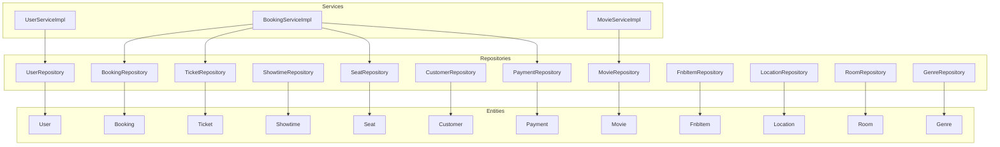
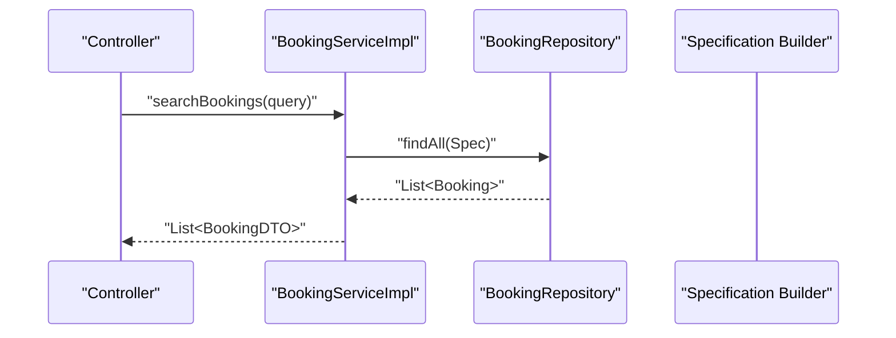
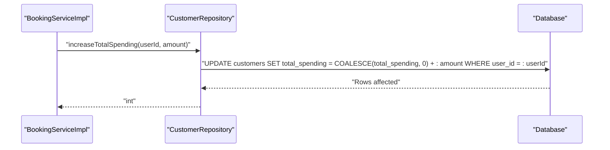
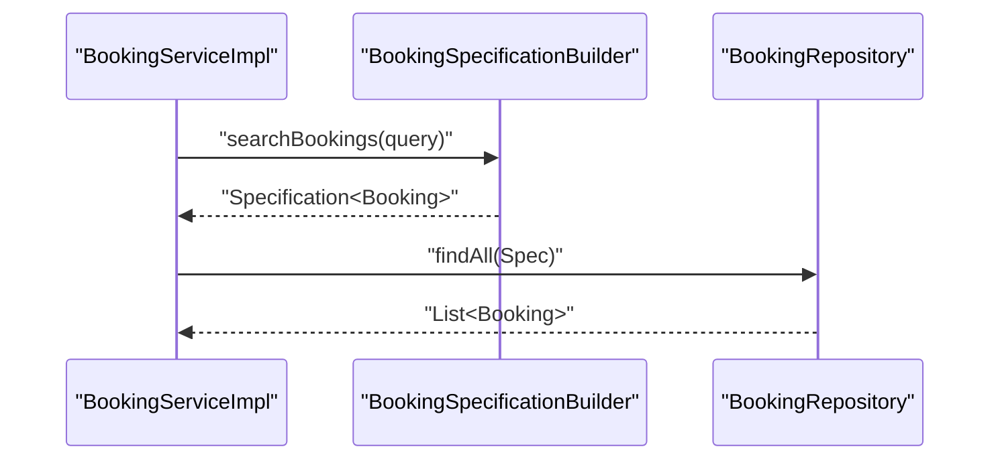
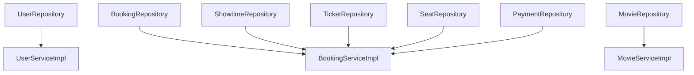

# Repository Layer Implementation

<cite>
**Referenced Files in This Document**
- [UserRepository.java](file://backend/src/main/java/com/cinema/booking/repositories/UserRepository.java)
- [BookingRepository.java](file://backend/src/main/java/com/cinema/booking/repositories/BookingRepository.java)
- [MovieRepository.java](file://backend/src/main/java/com/cinema/booking/repositories/MovieRepository.java)
- [ShowtimeRepository.java](file://backend/src/main/java/com/cinema/booking/repositories/ShowtimeRepository.java)
- [TicketRepository.java](file://backend/src/main/java/com/cinema/booking/repositories/TicketRepository.java)
- [CustomerRepository.java](file://backend/src/main/java/com/cinema/booking/repositories/CustomerRepository.java)
- [SeatRepository.java](file://backend/src/main/java/com/cinema/booking/repositories/SeatRepository.java)
- [PaymentRepository.java](file://backend/src/main/java/com/cinema/booking/repositories/PaymentRepository.java)
- [FnbItemRepository.java](file://backend/src/main/java/com/cinema/booking/repositories/FnbItemRepository.java)
- [LocationRepository.java](file://backend/src/main/java/com/cinema/booking/repositories/LocationRepository.java)
- [RoomRepository.java](file://backend/src/main/java/com/cinema/booking/repositories/RoomRepository.java)
- [GenreRepository.java](file://backend/src/main/java/com/cinema/booking/repositories/GenreRepository.java)
- [UserServiceImpl.java](file://backend/src/main/java/com/cinema/booking/services/impl/UserServiceImpl.java)
- [BookingServiceImpl.java](file://backend/src/main/java/com/cinema/booking/services/impl/BookingServiceImpl.java)
- [MovieServiceImpl.java](file://backend/src/main/java/com/cinema/booking/services/impl/MovieServiceImpl.java)
- [application.properties](file://backend/src/main/resources/application.properties)
</cite>

## Table of Contents
1. [Introduction](#introduction)
2. [Project Structure](#project-structure)
3. [Core Components](#core-components)
4. [Architecture Overview](#architecture-overview)
5. [Detailed Component Analysis](#detailed-component-analysis)
6. [Dependency Analysis](#dependency-analysis)
7. [Performance Considerations](#performance-considerations)
8. [Troubleshooting Guide](#troubleshooting-guide)
9. [Conclusion](#conclusion)
10. [Appendices](#appendices)

## Introduction
This document explains the Spring Data JPA repository layer implementation in the cinema booking system. It covers repository interface design patterns, derived query creation, custom query methods using @Query, and the relationship with JPA entities and transactions. It also documents pagination and sorting capabilities, complex query implementations, CRUD and bulk operation examples, query optimization techniques, indexing strategies, performance tuning, testing approaches, and the repository-to-service pattern with dependency injection.

## Project Structure
The repository layer resides under the package com.cinema.booking.repositories and is complemented by service implementations under com.cinema.booking.services.impl. Entities are located under com.cinema.booking.entities. Configuration for the persistence layer is defined in application.properties.

**Diagram sources**
- [UserRepository.java:1-16](file://backend/src/main/java/com/cinema/booking/repositories/UserRepository.java#L1-L16)
- [BookingRepository.java:1-11](file://backend/src/main/java/com/cinema/booking/repositories/BookingRepository.java#L1-L11)
- [MovieRepository.java:1-15](file://backend/src/main/java/com/cinema/booking/repositories/MovieRepository.java#L1-L15)
- [ShowtimeRepository.java:1-15](file://backend/src/main/java/com/cinema/booking/repositories/ShowtimeRepository.java#L1-L15)
- [TicketRepository.java:1-19](file://backend/src/main/java/com/cinema/booking/repositories/TicketRepository.java#L1-L19)
- [CustomerRepository.java:1-19](file://backend/src/main/java/com/cinema/booking/repositories/CustomerRepository.java#L1-L19)
- [SeatRepository.java:1-16](file://backend/src/main/java/com/cinema/booking/repositories/SeatRepository.java#L1-L16)
- [PaymentRepository.java:1-22](file://backend/src/main/java/com/cinema/booking/repositories/PaymentRepository.java#L1-L22)
- [FnbItemRepository.java:1-10](file://backend/src/main/java/com/cinema/booking/repositories/FnbItemRepository.java#L1-L10)
- [LocationRepository.java:1-11](file://backend/src/main/java/com/cinema/booking/repositories/LocationRepository.java#L1-L11)
- [RoomRepository.java:1-14](file://backend/src/main/java/com/cinema/booking/repositories/RoomRepository.java#L1-L14)
- [GenreRepository.java:1-10](file://backend/src/main/java/com/cinema/booking/repositories/GenreRepository.java#L1-L10)
- [UserServiceImpl.java:1-52](file://backend/src/main/java/com/cinema/booking/services/impl/UserServiceImpl.java#L1-L52)
- [BookingServiceImpl.java:1-260](file://backend/src/main/java/com/cinema/booking/services/impl/BookingServiceImpl.java#L1-L260)
- [MovieServiceImpl.java:1-150](file://backend/src/main/java/com/cinema/booking/services/impl/MovieServiceImpl.java#L1-L150)

**Section sources**
- [UserRepository.java:1-16](file://backend/src/main/java/com/cinema/booking/repositories/UserRepository.java#L1-L16)
- [application.properties](file://backend/src/main/resources/application.properties)

## Core Components
This section outlines the repository interfaces and their roles in the data access layer.

- UserRepository
  - Extends JpaRepository<User, Integer>.
  - Provides derived queries: existsByPhone, findByPhone.
  - Supports standard CRUD operations via JpaRepository.

- BookingRepository
  - Extends JpaRepository<Booking, Integer> and JpaSpecificationExecutor<Booking>.
  - Enables dynamic, programmatic queries using Specifications.

- MovieRepository
  - Extends JpaRepository<Movie, Integer>.
  - Derived query: findByStatus to filter movies by status.

- ShowtimeRepository
  - Extends JpaRepository<Showtime, Integer> and JpaSpecificationExecutor<Showtime>.
  - Derived query: findByRoom_RoomIdAndStartTimeBetween to filter showtimes by room and time range.

- TicketRepository
  - Extends JpaRepository<Ticket, Integer>.
  - Derived queries:
    - findByShowtime_ShowtimeId
    - findByBooking_BookingId
    - findByBooking_Customer_UserId
    - existsByShowtime_ShowtimeIdAndSeat_SeatId
    - countBySeat_SeatId
    - countByShowtime_ShowtimeId

- CustomerRepository
  - Extends JpaRepository<Customer, Integer>.
  - Custom JPQL query using @Query and @Modifying to update total spending.

- SeatRepository
  - Extends JpaRepository<Seat, Integer>.
  - Derived queries:
    - findByRoom_RoomId
    - countByRoom_RoomId

- PaymentRepository
  - Extends JpaRepository<Payment, Integer>.
  - Derived queries:
    - findByBookingAndPaymentMethodAndStatus
    - existsByBookingAndStatus
    - findByStatus
  - Custom JPQL query using @Query with JOIN FETCH to optimize loading of associated entities.

- FnbItemRepository, LocationRepository, RoomRepository, GenreRepository
  - Minimal interfaces extending JpaRepository<Entity, Integer> to inherit standard CRUD operations.

Practical examples of repository usage:
- CRUD operations: findById, save, deleteById, findAll inherited from JpaRepository.
- Derived queries: findByStatus, findByRoom_RoomId, findByShowtime_ShowtimeId.
- Custom queries: @Query with JPQL and native SQL updates.
- Bulk operations: saveAll, deleteAll (inherited from JpaRepository).

**Section sources**
- [UserRepository.java:1-16](file://backend/src/main/java/com/cinema/booking/repositories/UserRepository.java#L1-L16)
- [BookingRepository.java:1-11](file://backend/src/main/java/com/cinema/booking/repositories/BookingRepository.java#L1-L11)
- [MovieRepository.java:1-15](file://backend/src/main/java/com/cinema/booking/repositories/MovieRepository.java#L1-L15)
- [ShowtimeRepository.java:1-15](file://backend/src/main/java/com/cinema/booking/repositories/ShowtimeRepository.java#L1-L15)
- [TicketRepository.java:1-19](file://backend/src/main/java/com/cinema/booking/repositories/TicketRepository.java#L1-L19)
- [CustomerRepository.java:1-19](file://backend/src/main/java/com/cinema/booking/repositories/CustomerRepository.java#L1-L19)
- [SeatRepository.java:1-16](file://backend/src/main/java/com/cinema/booking/repositories/SeatRepository.java#L1-L16)
- [PaymentRepository.java:1-22](file://backend/src/main/java/com/cinema/booking/repositories/PaymentRepository.java#L1-L22)
- [FnbItemRepository.java:1-10](file://backend/src/main/java/com/cinema/booking/repositories/FnbItemRepository.java#L1-L10)
- [LocationRepository.java:1-11](file://backend/src/main/java/com/cinema/booking/repositories/LocationRepository.java#L1-L11)
- [RoomRepository.java:1-14](file://backend/src/main/java/com/cinema/booking/repositories/RoomRepository.java#L1-L14)
- [GenreRepository.java:1-10](file://backend/src/main/java/com/cinema/booking/repositories/GenreRepository.java#L1-L10)

## Architecture Overview
The repository layer sits below the service layer and encapsulates data access logic. Services orchestrate business operations, invoking repositories for data retrieval and persistence. Transactions are declared at the service layer boundaries to ensure atomicity and consistency.

**Diagram sources**
- [BookingServiceImpl.java:160-165](file://backend/src/main/java/com/cinema/booking/services/impl/BookingServiceImpl.java#L160-L165)
- [BookingRepository.java:1-11](file://backend/src/main/java/com/cinema/booking/repositories/BookingRepository.java#L1-L11)

**Section sources**
- [BookingServiceImpl.java:1-260](file://backend/src/main/java/com/cinema/booking/services/impl/BookingServiceImpl.java#L1-L260)
- [BookingRepository.java:1-11](file://backend/src/main/java/com/cinema/booking/repositories/BookingRepository.java#L1-L11)

## Detailed Component Analysis

### Repository Interfaces and Derived Queries
Derived query methods follow Spring Data JPA naming conventions to automatically generate JPQL or SQL. Examples include:
- existsByPhone and findByPhone in UserRepository.
- findByStatus in MovieRepository.
- findByRoom_RoomIdAndStartTimeBetween in ShowtimeRepository.
- findByShowtime_ShowtimeId, findByBooking_BookingId, findByBooking_Customer_UserId, existsByShowtime_ShowtimeIdAndSeat_SeatId, countBySeat_SeatId, countByShowtime_ShowtimeId in TicketRepository.
- findByRoom_RoomId and countByRoom_RoomId in SeatRepository.

These methods eliminate boilerplate SQL while remaining expressive and type-safe.

**Section sources**
- [UserRepository.java:1-16](file://backend/src/main/java/com/cinema/booking/repositories/UserRepository.java#L1-L16)
- [MovieRepository.java:1-15](file://backend/src/main/java/com/cinema/booking/repositories/MovieRepository.java#L1-L15)
- [ShowtimeRepository.java:1-15](file://backend/src/main/java/com/cinema/booking/repositories/ShowtimeRepository.java#L1-L15)
- [TicketRepository.java:1-19](file://backend/src/main/java/com/cinema/booking/repositories/TicketRepository.java#L1-L19)
- [SeatRepository.java:1-16](file://backend/src/main/java/com/cinema/booking/repositories/SeatRepository.java#L1-L16)

### Custom Queries with @Query and @Modifying
Custom queries enable precise control over SQL or JPQL. Notable examples:
- CustomerRepository.increaseTotalSpending uses @Modifying with a native SQL UPDATE to increment total spending.
- PaymentRepository.findUserPaymentHistory uses @Query with JOIN FETCH to eagerly load associated booking and customer entities, reducing N+1 query risks.

**Diagram sources**
- [CustomerRepository.java:15-17](file://backend/src/main/java/com/cinema/booking/repositories/CustomerRepository.java#L15-L17)
- [BookingServiceImpl.java:1-260](file://backend/src/main/java/com/cinema/booking/services/impl/BookingServiceImpl.java#L1-L260)

**Section sources**
- [CustomerRepository.java:1-19](file://backend/src/main/java/com/cinema/booking/repositories/CustomerRepository.java#L1-L19)
- [PaymentRepository.java:1-22](file://backend/src/main/java/com/cinema/booking/repositories/PaymentRepository.java#L1-L22)

### Pagination and Sorting
JpaRepository provides built-in support for pagination and sorting:
- Pageable and Sort parameters can be passed to methods like findAll to enable server-side pagination and ordering.
- For derived queries, add Pageable or Sort parameters to repository method signatures to leverage pagination and sorting.

[No sources needed since this section provides general guidance]

### Complex Query Implementations Using Specifications
BookingRepository extends JpaSpecificationExecutor, enabling dynamic query construction. In BookingServiceImpl, a Specification builder is used to construct filters based on a textual query, demonstrating flexible, runtime query building.

**Diagram sources**
- [BookingServiceImpl.java:160-165](file://backend/src/main/java/com/cinema/booking/services/impl/BookingServiceImpl.java#L160-L165)
- [BookingRepository.java:1-11](file://backend/src/main/java/com/cinema/booking/repositories/BookingRepository.java#L1-L11)

**Section sources**
- [BookingServiceImpl.java:160-165](file://backend/src/main/java/com/cinema/booking/services/impl/BookingServiceImpl.java#L160-L165)
- [BookingRepository.java:1-11](file://backend/src/main/java/com/cinema/booking/repositories/BookingRepository.java#L1-L11)

### Entity Lifecycle Management and Transaction Boundaries
- Entity lifecycle: Repositories manage entity persistence, updates, and deletions. Services define transaction boundaries to coordinate multiple repository calls atomically.
- Transactional annotations:
  - @Transactional(readOnly = true) on read-only service methods ensures read consistency and performance.
  - @Transactional on mutating methods ensures rollback on exceptions and maintains data integrity.

Examples:
- UserServiceImpl.getCurrentUser and updateProfile demonstrate read and write transactions.
- BookingServiceImpl.searchBookings uses read-only transaction; cancelBooking, refundBooking, and printTickets use write transactions.

**Section sources**
- [UserServiceImpl.java:1-52](file://backend/src/main/java/com/cinema/booking/services/impl/UserServiceImpl.java#L1-L52)
- [BookingServiceImpl.java:1-260](file://backend/src/main/java/com/cinema/booking/services/impl/BookingServiceImpl.java#L1-L260)

### Repository-to-Service Pattern and Dependency Injection
- Services depend on repositories via constructor or field injection.
- Example dependencies:
  - BookingServiceImpl depends on ShowtimeRepository, SeatRepository, TicketRepository, BookingRepository, FnBLineRepository, PaymentRepository.
  - MovieServiceImpl depends on MovieRepository, CastMemberRepository, MovieCastRepository.
  - UserServiceImpl depends on UserRepository.

This pattern promotes separation of concerns, testability, and maintainability.

**Section sources**
- [BookingServiceImpl.java:36-76](file://backend/src/main/java/com/cinema/booking/services/impl/BookingServiceImpl.java#L36-L76)
- [MovieServiceImpl.java:23-31](file://backend/src/main/java/com/cinema/booking/services/impl/MovieServiceImpl.java#L23-L31)
- [UserServiceImpl.java:17-18](file://backend/src/main/java/com/cinema/booking/services/impl/UserServiceImpl.java#L17-L18)

## Dependency Analysis
The following diagram shows repository-to-service dependencies and highlights key relationships.

**Diagram sources**
- [UserRepository.java:1-16](file://backend/src/main/java/com/cinema/booking/repositories/UserRepository.java#L1-L16)
- [BookingRepository.java:1-11](file://backend/src/main/java/com/cinema/booking/repositories/BookingRepository.java#L1-L11)
- [ShowtimeRepository.java:1-15](file://backend/src/main/java/com/cinema/booking/repositories/ShowtimeRepository.java#L1-L15)
- [TicketRepository.java:1-19](file://backend/src/main/java/com/cinema/booking/repositories/TicketRepository.java#L1-L19)
- [SeatRepository.java:1-16](file://backend/src/main/java/com/cinema/booking/repositories/SeatRepository.java#L1-L16)
- [PaymentRepository.java:1-22](file://backend/src/main/java/com/cinema/booking/repositories/PaymentRepository.java#L1-L22)
- [MovieRepository.java:1-15](file://backend/src/main/java/com/cinema/booking/repositories/MovieRepository.java#L1-L15)
- [UserServiceImpl.java:1-52](file://backend/src/main/java/com/cinema/booking/services/impl/UserServiceImpl.java#L1-L52)
- [BookingServiceImpl.java:1-260](file://backend/src/main/java/com/cinema/booking/services/impl/BookingServiceImpl.java#L1-L260)
- [MovieServiceImpl.java:1-150](file://backend/src/main/java/com/cinema/booking/services/impl/MovieServiceImpl.java#L1-L150)

**Section sources**
- [BookingServiceImpl.java:36-76](file://backend/src/main/java/com/cinema/booking/services/impl/BookingServiceImpl.java#L36-L76)
- [MovieServiceImpl.java:23-31](file://backend/src/main/java/com/cinema/booking/services/impl/MovieServiceImpl.java#L23-L31)
- [UserServiceImpl.java:17-18](file://backend/src/main/java/com/cinema/booking/services/impl/UserServiceImpl.java#L17-L18)

## Performance Considerations
- Prefer derived queries for simple conditions to leverage generated SQL.
- Use @Query with JOIN FETCH to avoid lazy loading pitfalls and reduce round trips.
- For complex filtering, use JpaSpecificationExecutor to build efficient Specifications.
- Leverage Pageable and Sort for pagination to limit result sets.
- Optimize frequently accessed associations with proper indexing on foreign keys and commonly filtered columns.
- Batch operations: use saveAll and deleteAll for bulk updates to minimize round trips.
- Native queries: use @Modifying with @Query for bulk updates when JPQL is inefficient.

[No sources needed since this section provides general guidance]

## Troubleshooting Guide
Common issues and resolutions:
- LazyInitializationException: Use @Query with JOIN FETCH or initialize collections in the repository layer.
- N+1 query problem: Eagerly fetch associations in custom queries or use projections.
- Transaction rollback: Ensure mutating operations are annotated with @Transactional and exceptions propagate to trigger rollback.
- Incorrect pagination/sorting: Verify Pageable and Sort parameters are applied consistently across repository and service layers.
- Specification misuse: Validate predicate composition and ensure predicates are combined correctly.

[No sources needed since this section provides general guidance]

## Conclusion
The repository layer in this project follows Spring Data JPA best practices with derived queries, custom JPQL/native queries, and Specifications for dynamic filtering. Services define transaction boundaries and coordinate repository calls, ensuring clean separation of concerns. Proper indexing, pagination, and eager fetching strategies contribute to robust performance. Testing can leverage repository mocks in unit tests and integration tests to validate end-to-end flows.

[No sources needed since this section summarizes without analyzing specific files]

## Appendices

### Practical Examples Index
- CRUD operations: findById, save, deleteById, findAll (inherited from JpaRepository).
- Derived queries: findByStatus, findByRoom_RoomId, findByShowtime_ShowtimeId.
- Custom queries: @Query with JPQL and @Modifying with native SQL.
- Bulk operations: saveAll, deleteAll (inherited from JpaRepository).

[No sources needed since this section provides general guidance]