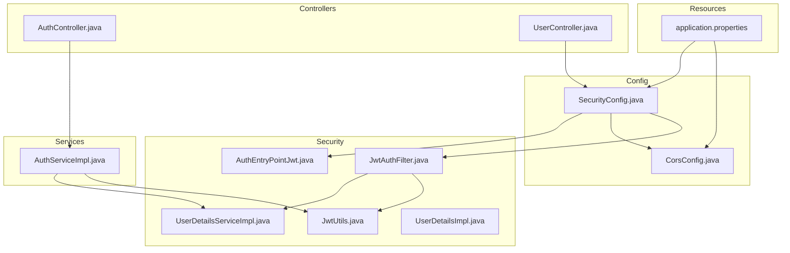
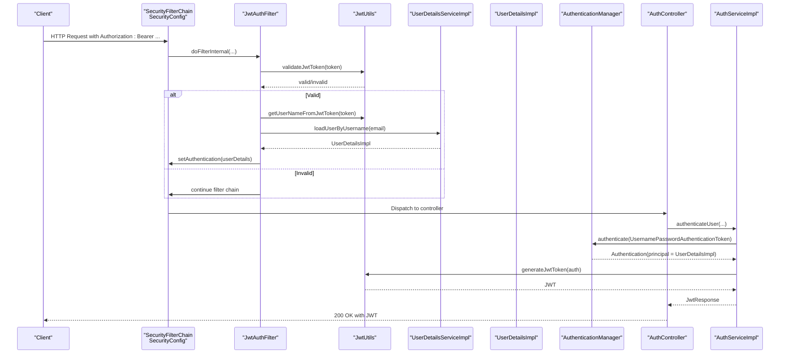
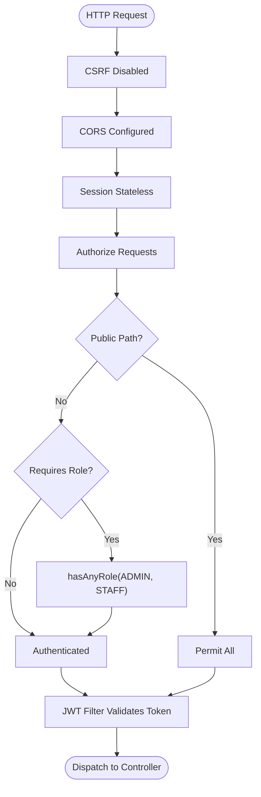
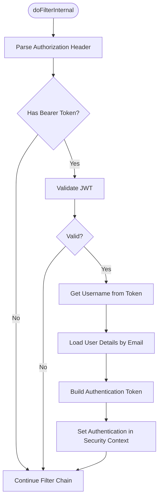
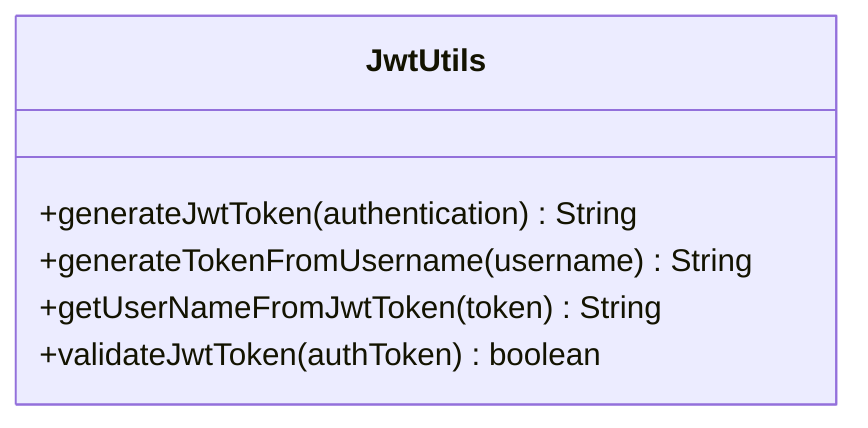
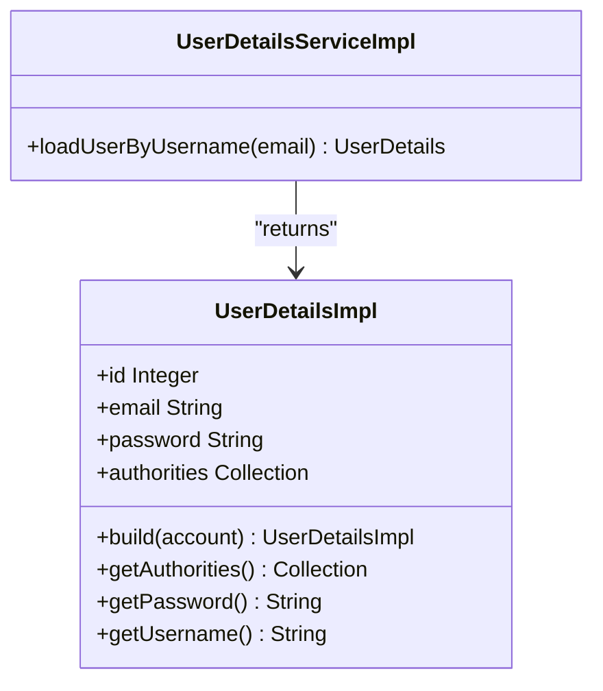
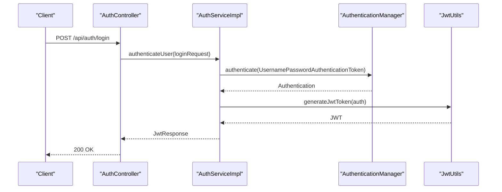
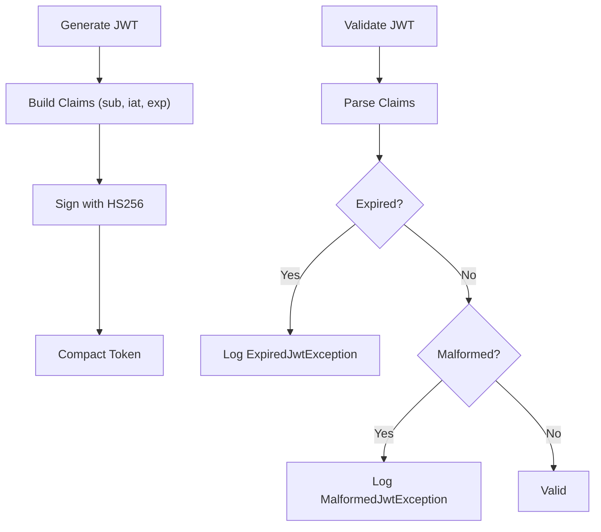
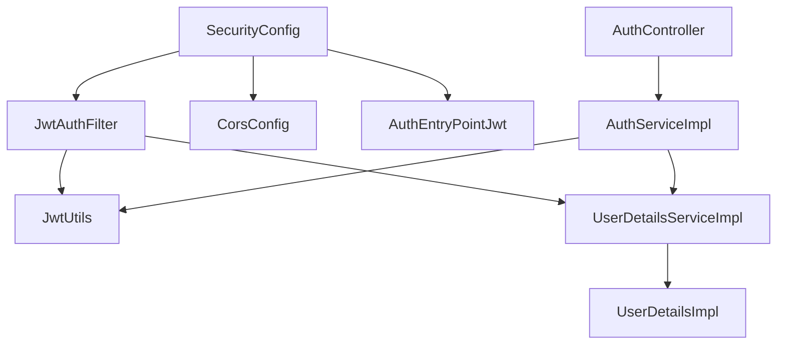

# Security Configuration

<cite>
**Referenced Files in This Document**
- [SecurityConfig.java](file://backend/src/main/java/com/cinema/booking/config/SecurityConfig.java)
- [CorsConfig.java](file://backend/src/main/java/com/cinema/booking/config/CorsConfig.java)
- [JwtAuthFilter.java](file://backend/src/main/java/com/cinema/booking/security/JwtAuthFilter.java)
- [JwtUtils.java](file://backend/src/main/java/com/cinema/booking/security/JwtUtils.java)
- [UserDetailsServiceImpl.java](file://backend/src/main/java/com/cinema/booking/security/UserDetailsServiceImpl.java)
- [UserDetailsImpl.java](file://backend/src/main/java/com/cinema/booking/security/UserDetailsImpl.java)
- [AuthEntryPointJwt.java](file://backend/src/main/java/com/cinema/booking/security/AuthEntryPointJwt.java)
- [AuthController.java](file://backend/src/main/java/com/cinema/booking/controllers/AuthController.java)
- [AuthServiceImpl.java](file://backend/src/main/java/com/cinema/booking/services/impl/AuthServiceImpl.java)
- [application.properties](file://backend/src/main/resources/application.properties)
- [UserController.java](file://backend/src/main/java/com/cinema/booking/controllers/UserController.java)
</cite>

## Table of Contents
1. [Introduction](#introduction)
2. [Project Structure](#project-structure)
3. [Core Components](#core-components)
4. [Architecture Overview](#architecture-overview)
5. [Detailed Component Analysis](#detailed-component-analysis)
6. [Dependency Analysis](#dependency-analysis)
7. [Performance Considerations](#performance-considerations)
8. [Troubleshooting Guide](#troubleshooting-guide)
9. [Conclusion](#conclusion)
10. [Appendices](#appendices)

## Introduction
This document explains the Spring Security configuration and authentication system for the cinema booking application. It covers JWT token-based authentication, role-based access control (RBAC), security filter chains, CORS setup, CSRF protection, user details loading, password encoding, authentication providers, method-level security with Spring Security’s expression language, and practical examples of secured endpoints and role annotations. It also documents JWT generation, validation, and refresh mechanisms, along with security best practices and secure coding guidelines.

## Project Structure
Security-related components are organized under dedicated packages:
- config: Global security configuration and CORS setup
- security: JWT utilities, filters, user details services, and entry point
- controllers: Public and authenticated endpoints, including authentication endpoints
- services: Authentication service implementation integrating with JWT and user details
- resources: Application properties containing JWT secrets and CORS origin configuration

**Diagram sources**
- [SecurityConfig.java:24-80](file://backend/src/main/java/com/cinema/booking/config/SecurityConfig.java#L24-L80)
- [CorsConfig.java:12-39](file://backend/src/main/java/com/cinema/booking/config/CorsConfig.java#L12-L39)
- [JwtAuthFilter.java:18-64](file://backend/src/main/java/com/cinema/booking/security/JwtAuthFilter.java#L18-L64)
- [JwtUtils.java:15-71](file://backend/src/main/java/com/cinema/booking/security/JwtUtils.java#L15-L71)
- [UserDetailsServiceImpl.java:12-27](file://backend/src/main/java/com/cinema/booking/security/UserDetailsServiceImpl.java#L12-L27)
- [UserDetailsImpl.java:15-76](file://backend/src/main/java/com/cinema/booking/security/UserDetailsImpl.java#L15-L76)
- [AuthEntryPointJwt.java:17-39](file://backend/src/main/java/com/cinema/booking/security/AuthEntryPointJwt.java#L17-L39)
- [AuthController.java:13-54](file://backend/src/main/java/com/cinema/booking/controllers/AuthController.java#L13-L54)
- [AuthServiceImpl.java:26-139](file://backend/src/main/java/com/cinema/booking/services/impl/AuthServiceImpl.java#L26-L139)
- [application.properties:35-47](file://backend/src/main/resources/application.properties#L35-L47)
- [UserController.java:10-36](file://backend/src/main/java/com/cinema/booking/controllers/UserController.java#L10-L36)

**Section sources**
- [SecurityConfig.java:24-80](file://backend/src/main/java/com/cinema/booking/config/SecurityConfig.java#L24-L80)
- [CorsConfig.java:12-39](file://backend/src/main/java/com/cinema/booking/config/CorsConfig.java#L12-L39)
- [application.properties:35-47](file://backend/src/main/resources/application.properties#L35-L47)

## Core Components
- SecurityConfig: Central security configuration enabling web security, method security, disabling CSRF, configuring CORS, session management, and request authorization rules. It registers the JWT filter before the default username/password filter and exposes beans for password encoding, authentication manager, and the JWT filter.
- JwtAuthFilter: A once-per-request filter that extracts a Bearer token from the Authorization header, validates it via JwtUtils, loads user details via UserDetailsServiceImpl, and sets the authentication in the security context.
- JwtUtils: Utility for generating JWT tokens, extracting usernames, validating tokens, and handling exceptions for malformed/expired/unsupported/empty tokens.
- UserDetailsServiceImpl: Loads user accounts by email, returning a UserDetailsImpl wrapper with authorities derived from the user’s role.
- UserDetailsImpl: Implements Spring Security’s UserDetails, exposing user identity, credentials, and granted authorities.
- AuthEntryPointJwt: Handles unauthorized access attempts by writing a JSON error response with HTTP 401.
- AuthController: Exposes authentication endpoints for login, registration, and Google login, delegating to AuthService.
- AuthServiceImpl: Authenticates users via AuthenticationManager, generates JWT tokens, encodes passwords, and supports Google OAuth login.
- application.properties: Contains JWT secret and expiration, CORS frontend URL, and other environment-specific settings.

**Section sources**
- [SecurityConfig.java:24-80](file://backend/src/main/java/com/cinema/booking/config/SecurityConfig.java#L24-L80)
- [JwtAuthFilter.java:18-64](file://backend/src/main/java/com/cinema/booking/security/JwtAuthFilter.java#L18-L64)
- [JwtUtils.java:15-71](file://backend/src/main/java/com/cinema/booking/security/JwtUtils.java#L15-L71)
- [UserDetailsServiceImpl.java:12-27](file://backend/src/main/java/com/cinema/booking/security/UserDetailsServiceImpl.java#L12-L27)
- [UserDetailsImpl.java:15-76](file://backend/src/main/java/com/cinema/booking/security/UserDetailsImpl.java#L15-L76)
- [AuthEntryPointJwt.java:17-39](file://backend/src/main/java/com/cinema/booking/security/AuthEntryPointJwt.java#L17-L39)
- [AuthController.java:13-54](file://backend/src/main/java/com/cinema/booking/controllers/AuthController.java#L13-L54)
- [AuthServiceImpl.java:26-139](file://backend/src/main/java/com/cinema/booking/services/impl/AuthServiceImpl.java#L26-L139)
- [application.properties:35-47](file://backend/src/main/resources/application.properties#L35-L47)

## Architecture Overview
The security architecture enforces stateless JWT authentication across HTTP requests. Requests pass through a custom JWT filter that validates tokens and populates the security context. Authorization is enforced both at the HTTP request level and at the method level using Spring Security’s expression language.

**Diagram sources**
- [SecurityConfig.java:50-79](file://backend/src/main/java/com/cinema/booking/config/SecurityConfig.java#L50-L79)
- [JwtAuthFilter.java:27-51](file://backend/src/main/java/com/cinema/booking/security/JwtAuthFilter.java#L27-L51)
- [JwtUtils.java:30-53](file://backend/src/main/java/com/cinema/booking/security/JwtUtils.java#L30-L53)
- [UserDetailsServiceImpl.java:18-25](file://backend/src/main/java/com/cinema/booking/security/UserDetailsServiceImpl.java#L18-L25)
- [AuthController.java:21-31](file://backend/src/main/java/com/cinema/booking/controllers/AuthController.java#L21-L31)
- [AuthServiceImpl.java:44-61](file://backend/src/main/java/com/cinema/booking/services/impl/AuthServiceImpl.java#L44-L61)

## Detailed Component Analysis

### Security Configuration (SecurityConfig)
- CSRF disabled for stateless JWT APIs.
- CORS configured via CorsConfigurationSource bean.
- Session management set to STATELESS.
- Request authorization:
  - Public endpoints: authentication, public data, GET endpoints for listings, payment callbacks/webhooks, and Swagger.
  - Admin/staff endpoints require ADMIN or STAFF roles.
  - Other requests require authentication.
- Method security enabled with prePostEnabled to support @PreAuthorize and related annotations.
- Registers JwtAuthFilter before UsernamePasswordAuthenticationFilter.

**Diagram sources**
- [SecurityConfig.java:50-79](file://backend/src/main/java/com/cinema/booking/config/SecurityConfig.java#L50-L79)

**Section sources**
- [SecurityConfig.java:24-80](file://backend/src/main/java/com/cinema/booking/config/SecurityConfig.java#L24-L80)

### JWT Authentication Filter (JwtAuthFilter)
- Extracts Bearer token from Authorization header.
- Validates token via JwtUtils.
- Loads user details by email and constructs UsernamePasswordAuthenticationToken.
- Sets authentication in SecurityContextHolder.

**Diagram sources**
- [JwtAuthFilter.java:27-51](file://backend/src/main/java/com/cinema/booking/security/JwtAuthFilter.java#L27-L51)
- [JwtUtils.java:50-53](file://backend/src/main/java/com/cinema/booking/security/JwtUtils.java#L50-L53)
- [UserDetailsServiceImpl.java:18-25](file://backend/src/main/java/com/cinema/booking/security/UserDetailsServiceImpl.java#L18-L25)

**Section sources**
- [JwtAuthFilter.java:18-64](file://backend/src/main/java/com/cinema/booking/security/JwtAuthFilter.java#L18-L64)

### JWT Utilities (JwtUtils)
- Generates JWT with subject, issued at, expiration, and HS256 signature.
- Extracts username from token subject.
- Validates tokens and logs specific exceptions for malformed/expired/unsupported/empty cases.

**Diagram sources**
- [JwtUtils.java:15-71](file://backend/src/main/java/com/cinema/booking/security/JwtUtils.java#L15-L71)

**Section sources**
- [JwtUtils.java:15-71](file://backend/src/main/java/com/cinema/booking/security/JwtUtils.java#L15-L71)

### User Details Services
- UserDetailsServiceImpl: Loads UserAccount by email and builds UserDetailsImpl with authorities.
- UserDetailsImpl: Implements UserDetails, exposing user ID, email, password hash, and authorities. Authorities are derived from the user’s role with a ROLE_ prefix.

**Diagram sources**
- [UserDetailsServiceImpl.java:12-27](file://backend/src/main/java/com/cinema/booking/security/UserDetailsServiceImpl.java#L12-L27)
- [UserDetailsImpl.java:15-76](file://backend/src/main/java/com/cinema/booking/security/UserDetailsImpl.java#L15-L76)

**Section sources**
- [UserDetailsServiceImpl.java:12-27](file://backend/src/main/java/com/cinema/booking/security/UserDetailsServiceImpl.java#L12-L27)
- [UserDetailsImpl.java:15-76](file://backend/src/main/java/com/cinema/booking/security/UserDetailsImpl.java#L15-L76)

### Authentication Entry Point (AuthEntryPointJwt)
- Handles unauthorized access attempts by logging and responding with a JSON body and HTTP 401.

**Section sources**
- [AuthEntryPointJwt.java:17-39](file://backend/src/main/java/com/cinema/booking/security/AuthEntryPointJwt.java#L17-L39)

### Authentication Controller and Service
- AuthController: Provides endpoints for login, registration, and Google login.
- AuthServiceImpl: Authenticates via AuthenticationManager, generates JWT, encodes passwords, and supports Google OAuth verification.

**Diagram sources**
- [AuthController.java:21-31](file://backend/src/main/java/com/cinema/booking/controllers/AuthController.java#L21-L31)
- [AuthServiceImpl.java:44-61](file://backend/src/main/java/com/cinema/booking/services/impl/AuthServiceImpl.java#L44-L61)
- [JwtUtils.java:30-39](file://backend/src/main/java/com/cinema/booking/security/JwtUtils.java#L30-L39)

**Section sources**
- [AuthController.java:13-54](file://backend/src/main/java/com/cinema/booking/controllers/AuthController.java#L13-L54)
- [AuthServiceImpl.java:26-139](file://backend/src/main/java/com/cinema/booking/services/impl/AuthServiceImpl.java#L26-L139)

### CORS Configuration
- CORS allows configured frontend URL plus localhost patterns, credentials enabled, and preflight cached for 1 hour.

**Section sources**
- [CorsConfig.java:12-39](file://backend/src/main/java/com/cinema/booking/config/CorsConfig.java#L12-L39)
- [application.properties:35-37](file://backend/src/main/resources/application.properties#L35-L37)

### CSRF Protection
- CSRF is disabled because the application uses stateless JWT authentication and REST endpoints.

**Section sources**
- [SecurityConfig.java:52-54](file://backend/src/main/java/com/cinema/booking/config/SecurityConfig.java#L52-L54)

### Password Encoding
- BCryptPasswordEncoder is configured as the PasswordEncoder bean.

**Section sources**
- [SecurityConfig.java:40-43](file://backend/src/main/java/com/cinema/booking/config/SecurityConfig.java#L40-L43)
- [AuthServiceImpl.java:77-79](file://backend/src/main/java/com/cinema/booking/services/impl/AuthServiceImpl.java#L77-L79)

### Authentication Providers
- AuthenticationManager is exposed via AuthenticationConfiguration and used by AuthServiceImpl to authenticate users with UsernamePasswordAuthenticationToken.

**Section sources**
- [SecurityConfig.java:45-48](file://backend/src/main/java/com/cinema/booking/config/SecurityConfig.java#L45-L48)
- [AuthServiceImpl.java:44-50](file://backend/src/main/java/com/cinema/booking/services/impl/AuthServiceImpl.java#L44-L50)

### Role-Based Access Control (RBAC)
- HTTP-level RBAC: SecurityConfig defines role requirements for admin/staff endpoints.
- Method-level RBAC: @PreAuthorize annotations on controllers enforce roles per endpoint.

Examples:
- UserController endpoints require USER, ADMIN, or STAFF roles.
- VoucherController endpoints require ADMIN or STAFF roles.

**Section sources**
- [SecurityConfig.java:65-74](file://backend/src/main/java/com/cinema/booking/config/SecurityConfig.java#L65-L74)
- [UserController.java:23-32](file://backend/src/main/java/com/cinema/booking/controllers/UserController.java#L23-L32)

### JWT Token Generation, Validation, and Refresh
- Generation: JwtUtils builds JWT with subject, issued at, expiration, and HS256 signature.
- Validation: JwtUtils parses and verifies tokens, catching specific exceptions.
- Refresh: No explicit refresh endpoint is present in the codebase; clients typically re-authenticate after expiration.

**Diagram sources**
- [JwtUtils.java:30-69](file://backend/src/main/java/com/cinema/booking/security/JwtUtils.java#L30-L69)

**Section sources**
- [JwtUtils.java:15-71](file://backend/src/main/java/com/cinema/booking/security/JwtUtils.java#L15-L71)
- [application.properties:42-47](file://backend/src/main/resources/application.properties#L42-L47)

### Integration with Method Security and Expression Language
- SecurityConfig enables method security with prePostEnabled = true.
- Controllers use @PreAuthorize to restrict access by roles.

**Section sources**
- [SecurityConfig.java:26-26](file://backend/src/main/java/com/cinema/booking/config/SecurityConfig.java#L26-L26)
- [UserController.java:23-32](file://backend/src/main/java/com/cinema/booking/controllers/UserController.java#L23-L32)

## Dependency Analysis
The security subsystem exhibits low coupling and clear separation of concerns:
- SecurityConfig orchestrates HTTP security, CORS, and filter registration.
- JwtAuthFilter depends on JwtUtils and UserDetailsServiceImpl.
- AuthServiceImpl depends on AuthenticationManager, JwtUtils, and user repositories.
- UserDetailsImpl depends on User entity and UserAccount repository via UserDetailsServiceImpl.

**Diagram sources**
- [SecurityConfig.java:24-80](file://backend/src/main/java/com/cinema/booking/config/SecurityConfig.java#L24-L80)
- [JwtAuthFilter.java:18-64](file://backend/src/main/java/com/cinema/booking/security/JwtAuthFilter.java#L18-L64)
- [JwtUtils.java:15-71](file://backend/src/main/java/com/cinema/booking/security/JwtUtils.java#L15-L71)
- [UserDetailsServiceImpl.java:12-27](file://backend/src/main/java/com/cinema/booking/security/UserDetailsServiceImpl.java#L12-L27)
- [AuthController.java:13-54](file://backend/src/main/java/com/cinema/booking/controllers/AuthController.java#L13-L54)
- [AuthServiceImpl.java:26-139](file://backend/src/main/java/com/cinema/booking/services/impl/AuthServiceImpl.java#L26-L139)

**Section sources**
- [SecurityConfig.java:24-80](file://backend/src/main/java/com/cinema/booking/config/SecurityConfig.java#L24-L80)
- [JwtAuthFilter.java:18-64](file://backend/src/main/java/com/cinema/booking/security/JwtAuthFilter.java#L18-L64)
- [AuthServiceImpl.java:26-139](file://backend/src/main/java/com/cinema/booking/services/impl/AuthServiceImpl.java#L26-L139)

## Performance Considerations
- Stateless JWT eliminates server-side session storage, reducing memory footprint.
- Token validation is lightweight; ensure JwtUtils.validateJwtToken is efficient and avoid unnecessary retries.
- Consider caching validated tokens or using short-lived access tokens with a separate refresh mechanism if needed.
- Keep CORS configuration minimal and precise to reduce preflight overhead.

## Troubleshooting Guide
Common issues and resolutions:
- Unauthorized errors: AuthEntryPointJwt logs unauthorized attempts and returns HTTP 401 with JSON. Verify Authorization header format and token validity.
- Invalid/expired JWT: JwtUtils catches specific exceptions during parsing; check token expiration and signing key.
- Role-based access denied: Ensure user authorities match expected roles (ROLE_ADMIN, ROLE_STAFF, ROLE_USER). Confirm UserDetailsImpl builds authorities correctly.
- CORS failures: Verify app.frontend-url property and allowed origin patterns in CorsConfig.
- CSRF-related errors: CSRF is disabled; ensure clients do not send CSRF tokens for stateless APIs.

**Section sources**
- [AuthEntryPointJwt.java:22-37](file://backend/src/main/java/com/cinema/booking/security/AuthEntryPointJwt.java#L22-L37)
- [JwtUtils.java:55-69](file://backend/src/main/java/com/cinema/booking/security/JwtUtils.java#L55-L69)
- [CorsConfig.java:18-36](file://backend/src/main/java/com/cinema/booking/config/CorsConfig.java#L18-L36)
- [application.properties:35-37](file://backend/src/main/resources/application.properties#L35-L37)

## Conclusion
The application implements a robust, stateless JWT-based authentication system with comprehensive RBAC at both HTTP and method levels. SecurityConfig centralizes policy enforcement, JwtAuthFilter integrates token validation seamlessly, and method security annotations provide fine-grained access control. With proper configuration of secrets, origins, and authorities, the system offers strong security posture suitable for REST APIs.

## Appendices

### Practical Examples of Secured Endpoints and Role Annotations
- Authentication endpoints: /api/auth/login, /api/auth/register, /api/auth/google-login
- Protected user endpoints: /api/users/me (requires USER, ADMIN, or STAFF)
- Admin/staff endpoints: /api/admin/** and related POST/PUT/DELETE routes for movies and fnb (require ADMIN or STAFF)

**Section sources**
- [AuthController.java:13-54](file://backend/src/main/java/com/cinema/booking/controllers/AuthController.java#L13-L54)
- [UserController.java:23-32](file://backend/src/main/java/com/cinema/booking/controllers/UserController.java#L23-L32)
- [SecurityConfig.java:57-74](file://backend/src/main/java/com/cinema/booking/config/SecurityConfig.java#L57-L74)

### Security Best Practices and Secure Coding Guidelines
- Use HTTPS in production to protect tokens in transit.
- Store JWT secret securely via environment variables and rotate periodically.
- Enforce least privilege: grant only required roles.
- Validate and sanitize all inputs; avoid exposing sensitive internals.
- Monitor and log security events without leaking sensitive data.
- Consider implementing rate limiting and circuit breakers for authentication endpoints.
- Use short-lived access tokens and implement a secure refresh strategy if needed.