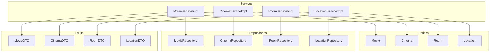
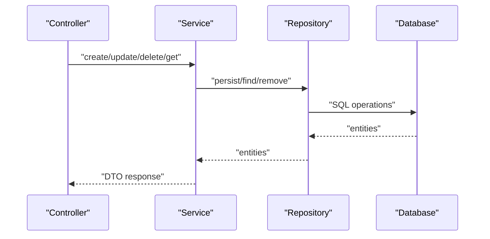
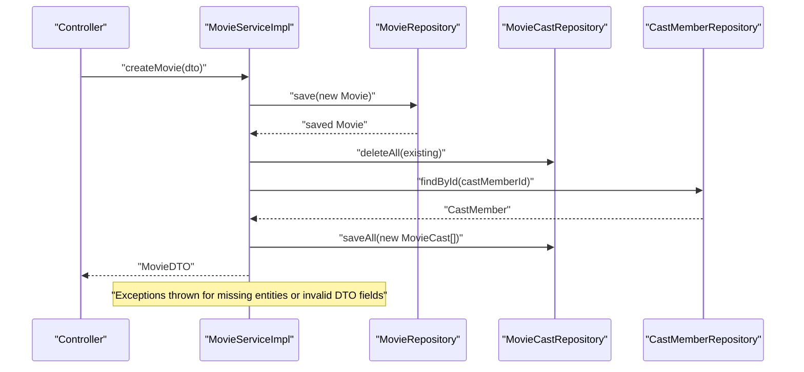
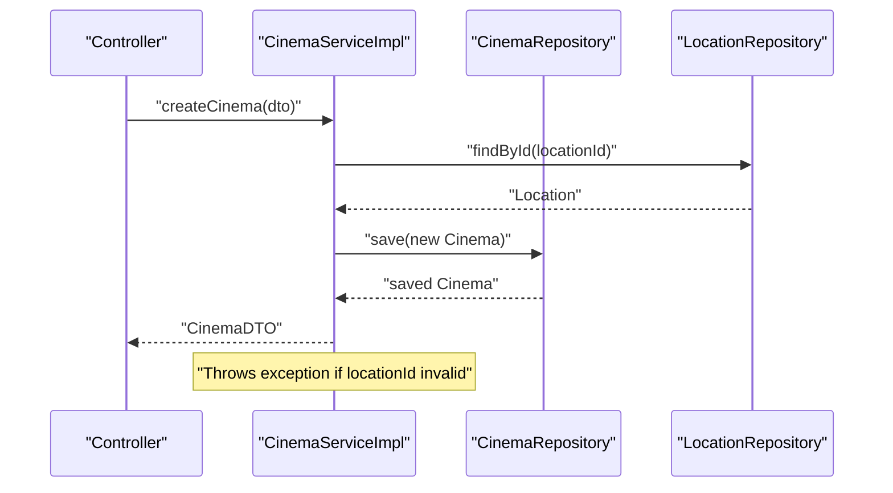
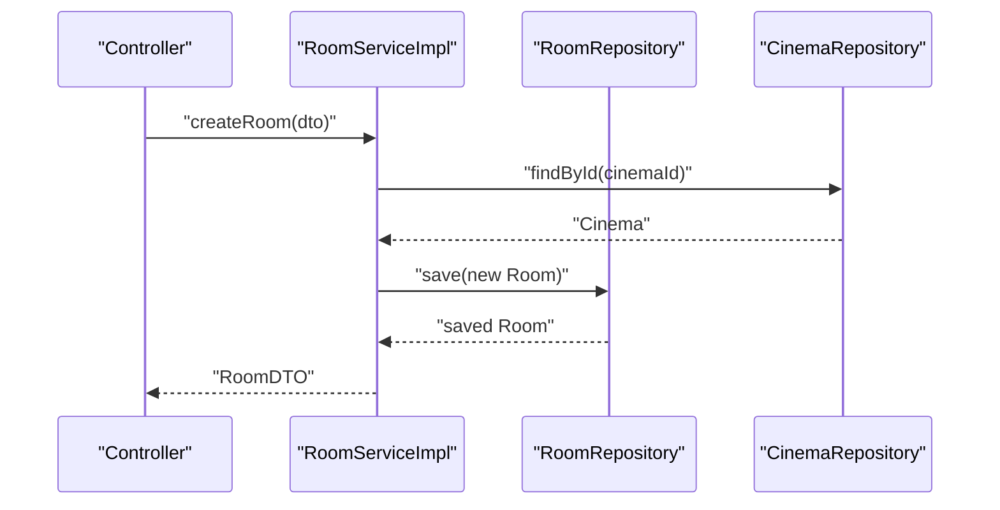
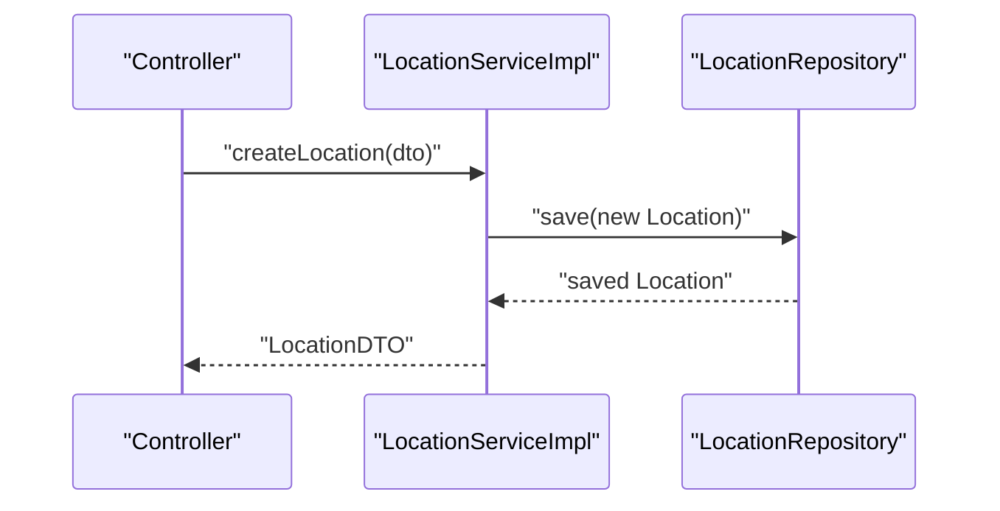
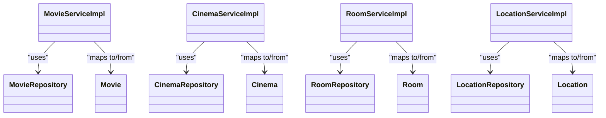

# Content Management Services

<cite>
**Referenced Files in This Document**
- [MovieServiceImpl.java](file://backend/src/main/java/com/cinema/booking/services/impl/MovieServiceImpl.java)
- [CinemaServiceImpl.java](file://backend/src/main/java/com/cinema/booking/services/impl/CinemaServiceImpl.java)
- [RoomServiceImpl.java](file://backend/src/main/java/com/cinema/booking/services/impl/RoomServiceImpl.java)
- [LocationServiceImpl.java](file://backend/src/main/java/com/cinema/booking/services/impl/LocationServiceImpl.java)
- [Movie.java](file://backend/src/main/java/com/cinema/booking/entities/Movie.java)
- [Cinema.java](file://backend/src/main/java/com/cinema/booking/entities/Cinema.java)
- [Room.java](file://backend/src/main/java/com/cinema/booking/entities/Room.java)
- [Location.java](file://backend/src/main/java/com/cinema/booking/entities/Location.java)
- [MovieDTO.java](file://backend/src/main/java/com/cinema/booking/dtos/MovieDTO.java)
- [CinemaDTO.java](file://backend/src/main/java/com/cinema/booking/dtos/CinemaDTO.java)
- [RoomDTO.java](file://backend/src/main/java/com/cinema/booking/dtos/RoomDTO.java)
- [LocationDTO.java](file://backend/src/main/java/com/cinema/booking/dtos/LocationDTO.java)
- [MovieRepository.java](file://backend/src/main/java/com/cinema/booking/repositories/MovieRepository.java)
- [CinemaRepository.java](file://backend/src/main/java/com/cinema/booking/repositories/CinemaRepository.java)
- [RoomRepository.java](file://backend/src/main/java/com/cinema/booking/repositories/RoomRepository.java)
- [LocationRepository.java](file://backend/src/main/java/com/cinema/booking/repositories/LocationRepository.java)
</cite>

## Table of Contents
1. [Introduction](#introduction)
2. [Project Structure](#project-structure)
3. [Core Components](#core-components)
4. [Architecture Overview](#architecture-overview)
5. [Detailed Component Analysis](#detailed-component-analysis)
6. [Dependency Analysis](#dependency-analysis)
7. [Performance Considerations](#performance-considerations)
8. [Troubleshooting Guide](#troubleshooting-guide)
9. [Conclusion](#conclusion)

## Introduction
This document describes the content management services responsible for managing movies, cinemas, rooms, and locations within a cinema booking system. It focuses on:
- Movie catalog management, metadata handling, and status-based retrieval
- Cinema venue management, facility administration, and location-based queries
- Room configuration, screen types, and cinema linkage
- Geographic location management for venues

It also documents CRUD operations, data validation, and business rule enforcement across these services.

## Project Structure
The content management services are implemented as Spring-managed services with JPA repositories backing persistence. Entities define the data model, while DTOs encapsulate transfer objects for controllers and clients.

**Diagram sources**
- [MovieServiceImpl.java:20-149](file://backend/src/main/java/com/cinema/booking/services/impl/MovieServiceImpl.java#L20-L149)
- [CinemaServiceImpl.java:16-91](file://backend/src/main/java/com/cinema/booking/services/impl/CinemaServiceImpl.java#L16-L91)
- [RoomServiceImpl.java:16-88](file://backend/src/main/java/com/cinema/booking/services/impl/RoomServiceImpl.java#L16-L88)
- [LocationServiceImpl.java:14-59](file://backend/src/main/java/com/cinema/booking/services/impl/LocationServiceImpl.java#L14-L59)
- [Movie.java:11-64](file://backend/src/main/java/com/cinema/booking/entities/Movie.java#L11-L64)
- [Cinema.java:6-31](file://backend/src/main/java/com/cinema/booking/entities/Cinema.java#L6-L31)
- [Room.java:6-27](file://backend/src/main/java/com/cinema/booking/entities/Room.java#L6-L27)
- [Location.java:6-20](file://backend/src/main/java/com/cinema/booking/entities/Location.java#L6-L20)
- [MovieRepository.java:10-14](file://backend/src/main/java/com/cinema/booking/repositories/MovieRepository.java#L10-L14)
- [CinemaRepository.java:9-13](file://backend/src/main/java/com/cinema/booking/repositories/CinemaRepository.java#L9-L13)
- [RoomRepository.java:9-13](file://backend/src/main/java/com/cinema/booking/repositories/RoomRepository.java#L9-L13)
- [LocationRepository.java:7-10](file://backend/src/main/java/com/cinema/booking/repositories/LocationRepository.java#L7-L10)

**Section sources**
- [MovieServiceImpl.java:20-149](file://backend/src/main/java/com/cinema/booking/services/impl/MovieServiceImpl.java#L20-L149)
- [CinemaServiceImpl.java:16-91](file://backend/src/main/java/com/cinema/booking/services/impl/CinemaServiceImpl.java#L16-L91)
- [RoomServiceImpl.java:16-88](file://backend/src/main/java/com/cinema/booking/services/impl/RoomServiceImpl.java#L16-L88)
- [LocationServiceImpl.java:14-59](file://backend/src/main/java/com/cinema/booking/services/impl/LocationServiceImpl.java#L14-L59)

## Core Components
- MovieServiceImpl: Manages movie lifecycle, metadata, and cast associations. Supports listing by status, full listing, retrieval by ID, creation, updates, and deletion. Casts are upserted via a replace-all strategy.
- CinemaServiceImpl: Manages cinema venues linked to locations. Provides listing by location, retrieval by ID, creation, updates, and deletion.
- RoomServiceImpl: Manages rooms within cinemas. Supports listing by cinema, retrieval by ID, creation, updates, and deletion.
- LocationServiceImpl: Manages geographic locations used for venue grouping. Supports listing, retrieval by ID, creation, updates, and deletion.

Key validations and business rules:
- DTO-level validation ensures required fields are present during create/update.
- Service-level validation throws explicit exceptions for missing entities or invalid relations.
- Cast association updates replace existing entries to maintain consistency.

**Section sources**
- [MovieServiceImpl.java:109-148](file://backend/src/main/java/com/cinema/booking/services/impl/MovieServiceImpl.java#L109-L148)
- [CinemaServiceImpl.java:40-89](file://backend/src/main/java/com/cinema/booking/services/impl/CinemaServiceImpl.java#L40-L89)
- [RoomServiceImpl.java:39-87](file://backend/src/main/java/com/cinema/booking/services/impl/RoomServiceImpl.java#L39-L87)
- [LocationServiceImpl.java:28-58](file://backend/src/main/java/com/cinema/booking/services/impl/LocationServiceImpl.java#L28-L58)

## Architecture Overview
The services follow a layered architecture:
- Controllers receive requests and delegate to services
- Services orchestrate business logic, validate inputs, and coordinate repositories
- Repositories provide JPA-backed persistence
- Entities represent domain data; DTOs decouple transport from persistence

[No sources needed since this diagram shows conceptual workflow, not actual code structure]

## Detailed Component Analysis

### MovieServiceImpl
Responsibilities:
- Convert between Movie entity and MovieDTO
- Manage movie metadata (title, description, duration, release date, language, age rating, poster/trailer URLs, status)
- Upsert cast members per movie using a replace-all strategy
- Support listing by status, full listing, retrieval by ID, creation, updates, and deletion

Processing logic highlights:
- Cast upsert strategy deletes existing MovieCast records for the movie and re-inserts based on incoming DTO list
- Validation errors are surfaced as runtime exceptions when required fields or related entities are missing

**Diagram sources**
- [MovieServiceImpl.java:127-133](file://backend/src/main/java/com/cinema/booking/services/impl/MovieServiceImpl.java#L127-L133)
- [MovieServiceImpl.java:76-107](file://backend/src/main/java/com/cinema/booking/services/impl/MovieServiceImpl.java#L76-L107)
- [MovieRepository.java:10-14](file://backend/src/main/java/com/cinema/booking/repositories/MovieRepository.java#L10-L14)

**Section sources**
- [MovieServiceImpl.java:32-61](file://backend/src/main/java/com/cinema/booking/services/impl/MovieServiceImpl.java#L32-L61)
- [MovieServiceImpl.java:76-107](file://backend/src/main/java/com/cinema/booking/services/impl/MovieServiceImpl.java#L76-L107)
- [MovieServiceImpl.java:109-148](file://backend/src/main/java/com/cinema/booking/services/impl/MovieServiceImpl.java#L109-L148)
- [MovieDTO.java:14-48](file://backend/src/main/java/com/cinema/booking/dtos/MovieDTO.java#L14-L48)
- [Movie.java:19-63](file://backend/src/main/java/com/cinema/booking/entities/Movie.java#L19-L63)

### CinemaServiceImpl
Responsibilities:
- Convert between Cinema entity and CinemaDTO
- Link cinemas to locations via foreign key
- Retrieve cinemas by location ID, by ID, and manage full CRUD lifecycle

Business rules:
- Throws exceptions when requested location or cinema does not exist
- Enforces non-null location ID and required fields for create/update

**Diagram sources**
- [CinemaServiceImpl.java:58-69](file://backend/src/main/java/com/cinema/booking/services/impl/CinemaServiceImpl.java#L58-L69)
- [CinemaRepository.java:9-13](file://backend/src/main/java/com/cinema/booking/repositories/CinemaRepository.java#L9-L13)
- [LocationRepository.java:7-10](file://backend/src/main/java/com/cinema/booking/repositories/LocationRepository.java#L7-L10)

**Section sources**
- [CinemaServiceImpl.java:25-38](file://backend/src/main/java/com/cinema/booking/services/impl/CinemaServiceImpl.java#L25-L38)
- [CinemaServiceImpl.java:40-89](file://backend/src/main/java/com/cinema/booking/services/impl/CinemaServiceImpl.java#L40-L89)
- [CinemaDTO.java:8-24](file://backend/src/main/java/com/cinema/booking/dtos/CinemaDTO.java#L8-L24)
- [Cinema.java:12-30](file://backend/src/main/java/com/cinema/booking/entities/Cinema.java#L12-L30)

### RoomServiceImpl
Responsibilities:
- Convert between Room entity and RoomDTO
- Link rooms to cinemas via foreign key
- Retrieve rooms by cinema ID, by ID, and manage full CRUD lifecycle

Business rules:
- Throws exceptions when requested cinema or room does not exist
- Enforces non-null cinema ID and required fields for create/update

**Diagram sources**
- [RoomServiceImpl.java:57-67](file://backend/src/main/java/com/cinema/booking/services/impl/RoomServiceImpl.java#L57-L67)
- [RoomRepository.java:9-13](file://backend/src/main/java/com/cinema/booking/repositories/RoomRepository.java#L9-L13)
- [CinemaRepository.java:9-13](file://backend/src/main/java/com/cinema/booking/repositories/CinemaRepository.java#L9-L13)

**Section sources**
- [RoomServiceImpl.java:25-37](file://backend/src/main/java/com/cinema/booking/services/impl/RoomServiceImpl.java#L25-L37)
- [RoomServiceImpl.java:39-87](file://backend/src/main/java/com/cinema/booking/services/impl/RoomServiceImpl.java#L39-L87)
- [RoomDTO.java:8-20](file://backend/src/main/java/com/cinema/booking/dtos/RoomDTO.java#L8-L20)
- [Room.java:12-27](file://backend/src/main/java/com/cinema/booking/entities/Room.java#L12-L27)

### LocationServiceImpl
Responsibilities:
- Convert between Location entity and LocationDTO
- Manage geographic locations used as venue containers
- Full CRUD lifecycle with basic validation

**Diagram sources**
- [LocationServiceImpl.java:41-45](file://backend/src/main/java/com/cinema/booking/services/impl/LocationServiceImpl.java#L41-L45)
- [LocationRepository.java:7-10](file://backend/src/main/java/com/cinema/booking/repositories/LocationRepository.java#L7-L10)

**Section sources**
- [LocationServiceImpl.java:21-26](file://backend/src/main/java/com/cinema/booking/services/impl/LocationServiceImpl.java#L21-L26)
- [LocationServiceImpl.java:28-58](file://backend/src/main/java/com/cinema/booking/services/impl/LocationServiceImpl.java#L28-L58)
- [LocationDTO.java:7-12](file://backend/src/main/java/com/cinema/booking/dtos/LocationDTO.java#L7-L12)
- [Location.java:12-20](file://backend/src/main/java/com/cinema/booking/entities/Location.java#L12-L20)

## Dependency Analysis
The services depend on repositories for persistence and on DTOs for data transfer. Entities define the domain model and relationships.

**Diagram sources**
- [MovieServiceImpl.java:20-149](file://backend/src/main/java/com/cinema/booking/services/impl/MovieServiceImpl.java#L20-L149)
- [CinemaServiceImpl.java:16-91](file://backend/src/main/java/com/cinema/booking/services/impl/CinemaServiceImpl.java#L16-L91)
- [RoomServiceImpl.java:16-88](file://backend/src/main/java/com/cinema/booking/services/impl/RoomServiceImpl.java#L16-L88)
- [LocationServiceImpl.java:14-59](file://backend/src/main/java/com/cinema/booking/services/impl/LocationServiceImpl.java#L14-L59)
- [MovieRepository.java:10-14](file://backend/src/main/java/com/cinema/booking/repositories/MovieRepository.java#L10-L14)
- [CinemaRepository.java:9-13](file://backend/src/main/java/com/cinema/booking/repositories/CinemaRepository.java#L9-L13)
- [RoomRepository.java:9-13](file://backend/src/main/java/com/cinema/booking/repositories/RoomRepository.java#L9-L13)
- [LocationRepository.java:7-10](file://backend/src/main/java/com/cinema/booking/repositories/LocationRepository.java#L7-L10)
- [Movie.java:19-63](file://backend/src/main/java/com/cinema/booking/entities/Movie.java#L19-L63)
- [Cinema.java:12-30](file://backend/src/main/java/com/cinema/booking/entities/Cinema.java#L12-L30)
- [Room.java:12-27](file://backend/src/main/java/com/cinema/booking/entities/Room.java#L12-L27)
- [Location.java:12-20](file://backend/src/main/java/com/cinema/booking/entities/Location.java#L12-L20)

**Section sources**
- [MovieServiceImpl.java:23-30](file://backend/src/main/java/com/cinema/booking/services/impl/MovieServiceImpl.java#L23-L30)
- [CinemaServiceImpl.java:19-23](file://backend/src/main/java/com/cinema/booking/services/impl/CinemaServiceImpl.java#L19-L23)
- [RoomServiceImpl.java:19-23](file://backend/src/main/java/com/cinema/booking/services/impl/RoomServiceImpl.java#L19-L23)
- [LocationServiceImpl.java:17-18](file://backend/src/main/java/com/cinema/booking/services/impl/LocationServiceImpl.java#L17-L18)

## Performance Considerations
- Batch operations: Cast upsert in MovieServiceImpl replaces all existing associations per update, which is efficient but may trigger cascading deletes; ensure DTO lists are reasonably sized.
- Lazy loading: Entities use lazy fetch for relationships; avoid N+1 selects by leveraging repository-derived queries and DTO projections where appropriate.
- Validation overhead: DTO-level validation occurs before repository calls; keep validation concise and centralized in services to reduce redundant checks.
- Indexing: Ensure foreign keys (location_id, cinema_id) are indexed in the database to optimize joins and filters.

[No sources needed since this section provides general guidance]

## Troubleshooting Guide
Common issues and resolutions:
- Missing related entities
  - Symptoms: Exceptions indicating missing cast members, locations, cinemas, or rooms
  - Resolution: Verify foreign key IDs in DTOs; ensure referenced entities exist before create/update
- Invalid DTO fields
  - Symptoms: Validation errors for blank or null required fields
  - Resolution: Ensure DTOs conform to constraints defined in DTO classes
- Cast association inconsistencies
  - Symptoms: Unexpected cast lists after updates
  - Resolution: Understand the replace-all strategy; provide complete cast list for accurate synchronization

**Section sources**
- [MovieServiceImpl.java:88-96](file://backend/src/main/java/com/cinema/booking/services/impl/MovieServiceImpl.java#L88-L96)
- [MovieServiceImpl.java:121-123](file://backend/src/main/java/com/cinema/booking/services/impl/MovieServiceImpl.java#L121-L123)
- [CinemaServiceImpl.java:60-61](file://backend/src/main/java/com/cinema/booking/services/impl/CinemaServiceImpl.java#L60-L61)
- [CinemaServiceImpl.java:76-77](file://backend/src/main/java/com/cinema/booking/services/impl/CinemaServiceImpl.java#L76-L77)
- [RoomServiceImpl.java:62-64](file://backend/src/main/java/com/cinema/booking/services/impl/RoomServiceImpl.java#L62-L64)
- [RoomServiceImpl.java:74-76](file://backend/src/main/java/com/cinema/booking/services/impl/RoomServiceImpl.java#L74-L76)
- [LocationServiceImpl.java:43-44](file://backend/src/main/java/com/cinema/booking/services/impl/LocationServiceImpl.java#L43-L44)
- [LocationServiceImpl.java:50-52](file://backend/src/main/java/com/cinema/booking/services/impl/LocationServiceImpl.java#L50-L52)

## Conclusion
The content management services provide a robust foundation for managing movies, cinemas, rooms, and locations. They enforce strong validation, maintain clear separation of concerns, and offer straightforward CRUD operations with explicit business rules. By understanding the DTO-to-entity mapping, repository-backed persistence, and service-level validations, developers can extend or integrate these services effectively.