# Booking Service

<cite>
**Referenced Files in This Document**
- [SeatState.java](file://backend/src/main/java/com/cinema/booking/domain/seat/SeatState.java)
- [PendingSeatState.java](file://backend/src/main/java/com/cinema/booking/domain/seat/PendingSeatState.java)
- [VacantSeatState.java](file://backend/src/main/java/com/cinema/booking/domain/seat/VacantSeatState.java)
- [SoldSeatState.java](file://backend/src/main/java/com/cinema/booking/domain/seat/SoldSeatState.java)
- [SeatStateFactory.java](file://backend/src/main/java/com/cinema/booking/domain/seat/SeatStateFactory.java)
- [SeatLockProvider.java](file://backend/src/main/java/com/cinema/booking/services/seatlock/SeatLockProvider.java)
- [RedisSeatLockAdapter.java](file://backend/src/main/java/com/cinema/booking/services/seatlock/RedisSeatLockAdapter.java)
- [BookingContext.java](file://backend/src/main/java/com/cinema/booking/patterns/state/BookingContext.java)
- [BookingState.java](file://backend/src/main/java/com/cinema/booking/patterns/state/BookingState.java)
- [PendingState.java](file://backend/src/main/java/com/cinema/booking/patterns/state/PendingState.java)
- [ConfirmedState.java](file://backend/src/main/java/com/cinema/booking/patterns/state/ConfirmedState.java)
- [CancelledState.java](file://backend/src/main/java/com/cinema/booking/patterns/state/CancelledState.java)
- [RefundedState.java](file://backend/src/main/java/com/cinema/booking/patterns/state/RefundedState.java)
- [StateFactory.java](file://backend/src/main/java/com/cinema/booking/patterns/state/StateFactory.java)
- [IPricingEngine.java](file://backend/src/main/java/com/cinema/booking/services/strategy_decorator/pricing/IPricingEngine.java)
- [PricingContext.java](file://backend/src/main/java/com/cinema/booking/services/strategy_decorator/pricing/PricingContext.java)
- [PricingContextBuilder.java](file://backend/src/main/java/com/cinema/booking/services/strategy_decorator/pricing/PricingContextBuilder.java)
- [TicketPricingStrategy.java](file://backend/src/main/java/com/cinema/booking/services/strategy_decorator/pricing/TicketPricingStrategy.java)
- [FnbPricingStrategy.java](file://backend/src/main/java/com/cinema/booking/services/strategy_decorator/pricing/FnbPricingStrategy.java)
- [TimeBasedPricingStrategy.java](file://backend/src/main/java/com/cinema/booking/services/strategy_decorator/pricing/TimeBasedPricingStrategy.java)
- [BaseDiscountDecorator.java](file://backend/src/main/java/com/cinema/booking/services/strategy_decorator/pricing/BaseDiscountDecorator.java)
- [MemberDiscountDecorator.java](file://backend/src/main/java/com/cinema/booking/services/strategy_decorator/pricing/MemberDiscountDecorator.java)
- [PromotionDiscountDecorator.java](file://backend/src/main/java/com/cinema/booking/services/strategy_decorator/pricing/PromotionDiscountDecorator.java)
- [CachingPricingEngineProxy.java](file://backend/src/main/java/com/cinema/booking/services/strategy_decorator/pricing/CachingPricingEngineProxy.java)
- [PricingValidationHandler.java](file://backend/src/main/java/com/cinema/booking/services/strategy_decorator/pricing/validation/PricingValidationHandler.java)
- [SeatsAvailableHandler.java](file://backend/src/main/java/com/cinema/booking/services/strategy_decorator/pricing/validation/SeatsAvailableHandler.java)
- [ShowtimeFutureHandler.java](file://backend/src/main/java/com/cinema/booking/services/strategy_decorator/pricing/validation/ShowtimeFutureHandler.java)
- [PromoValidHandler.java](file://backend/src/main/java/com/cinema/booking/services/strategy_decorator/pricing/validation/PromoValidHandler.java)
- [AbstractPricingValidationHandler.java](file://backend/src/main/java/com/cinema/booking/services/strategy_decorator/pricing/validation/AbstractPricingValidationHandler.java)
- [PricingValidationContext.java](file://backend/src/main/java/com/cinema/booking/services/strategy_decorator/pricing/validation/PricingValidationContext.java)
- [PricingValidationConfig.java](file://backend/src/main/java/com/cinema/booking/services/strategy_decorator/pricing/validation/PricingValidationConfig.java)
- [BookingServiceImpl.java](file://backend/src/main/java/com/cinema/booking/services/impl/BookingServiceImpl.java)
- [SeatServiceImpl.java](file://backend/src/main/java/com/cinema/booking/services/impl/SeatServiceImpl.java)
- [BookingController.java](file://backend/src/main/java/com/cinema/booking/controllers/BookingController.java)
- [SeatController.java](file://backend/src/main/java/com/cinema/booking/controllers/SeatController.java)
- [Seat.java](file://backend/src/main/java/com/cinema/booking/entities/Seat.java)
- [Booking.java](file://backend/src/main/java/com/cinema/booking/entities/Booking.java)
- [SeatDTO.java](file://backend/src/main/java/com/cinema/booking/dtos/SeatDTO.java)
- [SeatStatusDTO.java](file://backend/src/main/java/com/cinema/booking/dtos/SeatStatusDTO.java)
- [PriceBreakdownDTO.java](file://backend/src/main/java/com/cinema/booking/dtos/PriceBreakdownDTO.java)
- [application.properties](file://backend/src/main/resources/application.properties)
</cite>

## Table of Contents
1. [Introduction](#introduction)
2. [Project Structure](#project-structure)
3. [Core Components](#core-components)
4. [Architecture Overview](#architecture-overview)
5. [Detailed Component Analysis](#detailed-component-analysis)
6. [Dependency Analysis](#dependency-analysis)
7. [Performance Considerations](#performance-considerations)
8. [Troubleshooting Guide](#troubleshooting-guide)
9. [Conclusion](#conclusion)
10. [Appendices](#appendices)

## Introduction
This document provides comprehensive documentation for the Booking Service implementation. It focuses on:
- Seat status management: availability checking, real-time seat locking via Redis, and seat state transitions.
- Price calculation workflow using the dynamic pricing engine and validation chain.
- Booking state management using the State pattern across the booking lifecycle (pending, confirmed, cancelled, refunded).
- Cancellation and refund processes, inventory release mechanisms, and transaction boundaries.
- Concrete examples of seat locking/unlocking operations, price breakdown calculations, and booking state transitions.
- Error handling strategies for concurrent seat reservations and invalid booking operations.

## Project Structure
The Booking Service resides under the backend module and follows a layered architecture:
- Domain layer: seat state models and factories.
- Services layer: seat locking, pricing engine, and booking orchestration.
- Controllers: REST endpoints for seat and booking operations.
- Entities and DTOs: persistence and transfer models.
- Validation and configuration: pricing and checkout validation handlers.

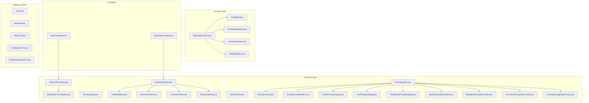

**Diagram sources**
- [SeatState.java:1-18](file://backend/src/main/java/com/cinema/booking/domain/seat/SeatState.java#L1-L18)
- [SeatStateFactory.java:1-21](file://backend/src/main/java/com/cinema/booking/domain/seat/SeatStateFactory.java#L1-L21)
- [SeatLockProvider.java:1-19](file://backend/src/main/java/com/cinema/booking/services/seatlock/SeatLockProvider.java#L1-L19)
- [RedisSeatLockAdapter.java:1-56](file://backend/src/main/java/com/cinema/booking/services/seatlock/RedisSeatLockAdapter.java#L1-L56)
- [BookingContext.java:1-38](file://backend/src/main/java/com/cinema/booking/patterns/state/BookingContext.java#L1-L38)
- [BookingState.java:1-12](file://backend/src/main/java/com/cinema/booking/patterns/state/BookingState.java#L1-L12)
- [PendingState.java:1-30](file://backend/src/main/java/com/cinema/booking/patterns/state/PendingState.java#L1-L30)
- [ConfirmedState.java:1-31](file://backend/src/main/java/com/cinema/booking/patterns/state/ConfirmedState.java#L1-L31)
- [CancelledState.java:1-30](file://backend/src/main/java/com/cinema/booking/patterns/state/CancelledState.java#L1-L30)
- [RefundedState.java:1-30](file://backend/src/main/java/com/cinema/booking/patterns/state/RefundedState.java#L1-L30)
- [StateFactory.java:1-17](file://backend/src/main/java/com/cinema/booking/patterns/state/StateFactory.java#L1-L17)
- [IPricingEngine.java:1-12](file://backend/src/main/java/com/cinema/booking/services/strategy_decorator/pricing/IPricingEngine.java#L1-L12)
- [PricingContext.java](file://backend/src/main/java/com/cinema/booking/services/strategy_decorator/pricing/PricingContext.java)
- [PricingContextBuilder.java](file://backend/src/main/java/com/cinema/booking/services/strategy_decorator/pricing/PricingContextBuilder.java)
- [TicketPricingStrategy.java](file://backend/src/main/java/com/cinema/booking/services/strategy_decorator/pricing/TicketPricingStrategy.java)
- [FnbPricingStrategy.java](file://backend/src/main/java/com/cinema/booking/services/strategy_decorator/pricing/FnbPricingStrategy.java)
- [TimeBasedPricingStrategy.java](file://backend/src/main/java/com/cinema/booking/services/strategy_decorator/pricing/TimeBasedPricingStrategy.java)
- [BaseDiscountDecorator.java](file://backend/src/main/java/com/cinema/booking/services/strategy_decorator/pricing/BaseDiscountDecorator.java)
- [MemberDiscountDecorator.java](file://backend/src/main/java/com/cinema/booking/services/strategy_decorator/pricing/MemberDiscountDecorator.java)
- [PromotionDiscountDecorator.java](file://backend/src/main/java/com/cinema/booking/services/strategy_decorator/pricing/PromotionDiscountDecorator.java)
- [CachingPricingEngineProxy.java](file://backend/src/main/java/com/cinema/booking/services/strategy_decorator/pricing/CachingPricingEngineProxy.java)
- [BookingController.java](file://backend/src/main/java/com/cinema/booking/controllers/BookingController.java)
- [SeatController.java](file://backend/src/main/java/com/cinema/booking/controllers/SeatController.java)
- [Seat.java](file://backend/src/main/java/com/cinema/booking/entities/Seat.java)
- [Booking.java](file://backend/src/main/java/com/cinema/booking/entities/Booking.java)
- [SeatDTO.java](file://backend/src/main/java/com/cinema/booking/dtos/SeatDTO.java)
- [SeatStatusDTO.java](file://backend/src/main/java/com/cinema/booking/dtos/SeatStatusDTO.java)
- [PriceBreakdownDTO.java](file://backend/src/main/java/com/cinema/booking/dtos/PriceBreakdownDTO.java)

**Section sources**
- [SeatState.java:1-18](file://backend/src/main/java/com/cinema/booking/domain/seat/SeatState.java#L1-L18)
- [SeatStateFactory.java:1-21](file://backend/src/main/java/com/cinema/booking/domain/seat/SeatStateFactory.java#L1-L21)
- [SeatLockProvider.java:1-19](file://backend/src/main/java/com/cinema/booking/services/seatlock/SeatLockProvider.java#L1-L19)
- [RedisSeatLockAdapter.java:1-56](file://backend/src/main/java/com/cinema/booking/services/seatlock/RedisSeatLockAdapter.java#L1-L56)
- [BookingContext.java:1-38](file://backend/src/main/java/com/cinema/booking/patterns/state/BookingContext.java#L1-L38)
- [BookingState.java:1-12](file://backend/src/main/java/com/cinema/booking/patterns/state/BookingState.java#L1-L12)
- [PendingState.java:1-30](file://backend/src/main/java/com/cinema/booking/patterns/state/PendingState.java#L1-L30)
- [ConfirmedState.java:1-31](file://backend/src/main/java/com/cinema/booking/patterns/state/ConfirmedState.java#L1-L31)
- [CancelledState.java:1-30](file://backend/src/main/java/com/cinema/booking/patterns/state/CancelledState.java#L1-L30)
- [RefundedState.java:1-30](file://backend/src/main/java/com/cinema/booking/patterns/state/RefundedState.java#L1-L30)
- [StateFactory.java:1-17](file://backend/src/main/java/com/cinema/booking/patterns/state/StateFactory.java#L1-L17)
- [IPricingEngine.java:1-12](file://backend/src/main/java/com/cinema/booking/services/strategy_decorator/pricing/IPricingEngine.java#L1-L12)
- [PricingContext.java](file://backend/src/main/java/com/cinema/booking/services/strategy_decorator/pricing/PricingContext.java)
- [PricingContextBuilder.java](file://backend/src/main/java/com/cinema/booking/services/strategy_decorator/pricing/PricingContextBuilder.java)
- [TicketPricingStrategy.java](file://backend/src/main/java/com/cinema/booking/services/strategy_decorator/pricing/TicketPricingStrategy.java)
- [FnbPricingStrategy.java](file://backend/src/main/java/com/cinema/booking/services/strategy_decorator/pricing/FnbPricingStrategy.java)
- [TimeBasedPricingStrategy.java](file://backend/src/main/java/com/cinema/booking/services/strategy_decorator/pricing/TimeBasedPricingStrategy.java)
- [BaseDiscountDecorator.java](file://backend/src/main/java/com/cinema/booking/services/strategy_decorator/pricing/BaseDiscountDecorator.java)
- [MemberDiscountDecorator.java](file://backend/src/main/java/com/cinema/booking/services/strategy_decorator/pricing/MemberDiscountDecorator.java)
- [PromotionDiscountDecorator.java](file://backend/src/main/java/com/cinema/booking/services/strategy_decorator/pricing/PromotionDiscountDecorator.java)
- [CachingPricingEngineProxy.java](file://backend/src/main/java/com/cinema/booking/services/strategy_decorator/pricing/CachingPricingEngineProxy.java)
- [BookingController.java](file://backend/src/main/java/com/cinema/booking/controllers/BookingController.java)
- [SeatController.java](file://backend/src/main/java/com/cinema/booking/controllers/SeatController.java)
- [Seat.java](file://backend/src/main/java/com/cinema/booking/entities/Seat.java)
- [Booking.java](file://backend/src/main/java/com/cinema/booking/entities/Booking.java)
- [SeatDTO.java](file://backend/src/main/java/com/cinema/booking/dtos/SeatDTO.java)
- [SeatStatusDTO.java](file://backend/src/main/java/com/cinema/booking/dtos/SeatStatusDTO.java)
- [PriceBreakdownDTO.java](file://backend/src/main/java/com/cinema/booking/dtos/PriceBreakdownDTO.java)

## Core Components
- Seat state model: defines seat statuses (vacant, pending, sold) and whether a lock attempt is allowed.
- Seat state factory: constructs the appropriate seat state given database and Redis lock snapshots.
- Seat lock provider: abstraction for seat locking/unlocking; Redis adapter implements distributed locks.
- Booking state machine: manages booking lifecycle with explicit state transitions and guard conditions.
- Dynamic pricing engine: calculates total price with strategies and decorators; validated by a chain of responsibility.
- Controllers: expose endpoints for seat selection and booking checkout.

**Section sources**
- [SeatState.java:1-18](file://backend/src/main/java/com/cinema/booking/domain/seat/SeatState.java#L1-L18)
- [SeatStateFactory.java:1-21](file://backend/src/main/java/com/cinema/booking/domain/seat/SeatStateFactory.java#L1-L21)
- [SeatLockProvider.java:1-19](file://backend/src/main/java/com/cinema/booking/services/seatlock/SeatLockProvider.java#L1-L19)
- [RedisSeatLockAdapter.java:1-56](file://backend/src/main/java/com/cinema/booking/services/seatlock/RedisSeatLockAdapter.java#L1-L56)
- [BookingContext.java:1-38](file://backend/src/main/java/com/cinema/booking/patterns/state/BookingContext.java#L1-L38)
- [BookingState.java:1-12](file://backend/src/main/java/com/cinema/booking/patterns/state/BookingState.java#L1-L12)
- [IPricingEngine.java:1-12](file://backend/src/main/java/com/cinema/booking/services/strategy_decorator/pricing/IPricingEngine.java#L1-L12)

## Architecture Overview
The Booking Service integrates seat state management, real-time locking, and booking state transitions with a dynamic pricing engine. The system ensures consistency across concurrent operations using Redis for distributed locks and a state machine for booking lifecycle control.

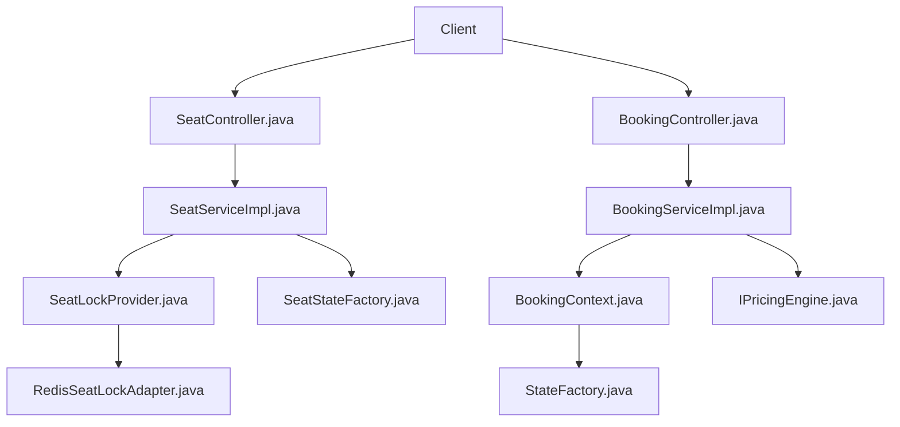

**Diagram sources**
- [SeatController.java](file://backend/src/main/java/com/cinema/booking/controllers/SeatController.java)
- [BookingController.java](file://backend/src/main/java/com/cinema/booking/controllers/BookingController.java)
- [SeatServiceImpl.java](file://backend/src/main/java/com/cinema/booking/services/impl/SeatServiceImpl.java)
- [BookingServiceImpl.java](file://backend/src/main/java/com/cinema/booking/services/impl/BookingServiceImpl.java)
- [SeatLockProvider.java:1-19](file://backend/src/main/java/com/cinema/booking/services/seatlock/SeatLockProvider.java#L1-L19)
- [RedisSeatLockAdapter.java:1-56](file://backend/src/main/java/com/cinema/booking/services/seatlock/RedisSeatLockAdapter.java#L1-L56)
- [SeatStateFactory.java:1-21](file://backend/src/main/java/com/cinema/booking/domain/seat/SeatStateFactory.java#L1-L21)
- [BookingContext.java:1-38](file://backend/src/main/java/com/cinema/booking/patterns/state/BookingContext.java#L1-L38)
- [StateFactory.java:1-17](file://backend/src/main/java/com/cinema/booking/patterns/state/StateFactory.java#L1-L17)
- [IPricingEngine.java:1-12](file://backend/src/main/java/com/cinema/booking/services/strategy_decorator/pricing/IPricingEngine.java#L1-L12)

## Detailed Component Analysis

### Seat Status Management
Seat status management determines whether a seat is vacant, pending (locked), or sold, and whether a lock attempt is permitted. The state is derived from two sources:
- Database: whether the seat is marked as sold.
- Redis: presence of a lock key indicating a pending reservation.

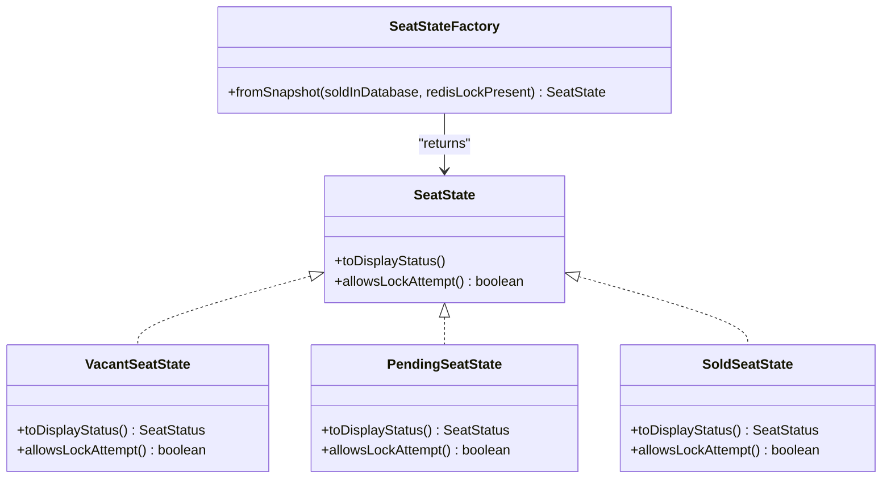

**Diagram sources**
- [SeatState.java:1-18](file://backend/src/main/java/com/cinema/booking/domain/seat/SeatState.java#L1-L18)
- [VacantSeatState.java:1-22](file://backend/src/main/java/com/cinema/booking/domain/seat/VacantSeatState.java#L1-L22)
- [PendingSeatState.java:1-22](file://backend/src/main/java/com/cinema/booking/domain/seat/PendingSeatState.java#L1-L22)
- [SoldSeatState.java:1-22](file://backend/src/main/java/com/cinema/booking/domain/seat/SoldSeatState.java#L1-L22)
- [SeatStateFactory.java:1-21](file://backend/src/main/java/com/cinema/booking/domain/seat/SeatStateFactory.java#L1-L21)

Seat availability checking and lock attempts:
- Availability: a seat is available if it is vacant and allows lock attempts.
- Locking: the system uses Redis SETNX semantics to acquire a lock with a TTL; if another process holds the lock, acquisition fails.
- Unlocking: releasing the lock deletes the Redis key.

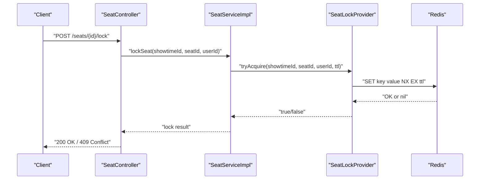

**Diagram sources**
- [SeatController.java](file://backend/src/main/java/com/cinema/booking/controllers/SeatController.java)
- [SeatServiceImpl.java](file://backend/src/main/java/com/cinema/booking/services/impl/SeatServiceImpl.java)
- [SeatLockProvider.java:1-19](file://backend/src/main/java/com/cinema/booking/services/seatlock/SeatLockProvider.java#L1-L19)
- [RedisSeatLockAdapter.java:1-56](file://backend/src/main/java/com/cinema/booking/services/seatlock/RedisSeatLockAdapter.java#L1-L56)

Seat state transitions:
- From snapshot: the factory selects the correct state based on database and Redis indicators.
- Example transitions:
  - Vacant -> Pending after successful lock.
  - Pending -> Sold after booking confirmation.
  - Pending -> Vacant after unlock or TTL expiry.
  - Sold -> Refunded via refund workflow.

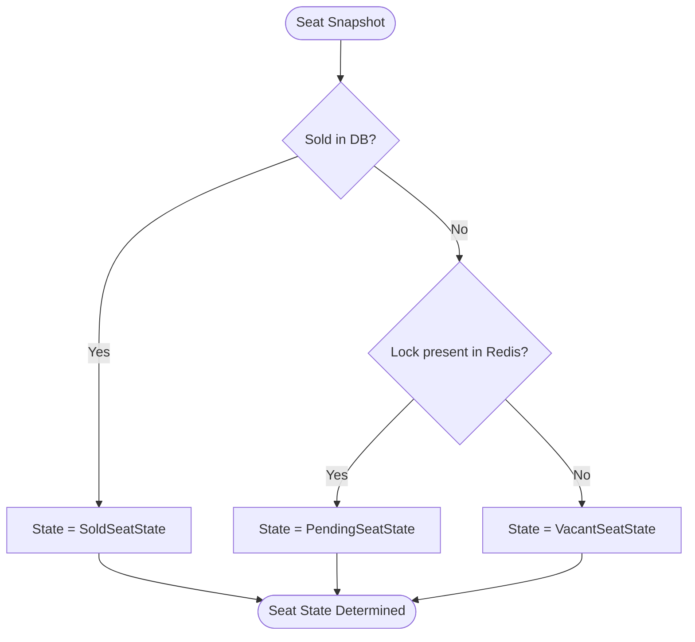

**Diagram sources**
- [SeatStateFactory.java:1-21](file://backend/src/main/java/com/cinema/booking/domain/seat/SeatStateFactory.java#L1-L21)
- [SeatState.java:1-18](file://backend/src/main/java/com/cinema/booking/domain/seat/SeatState.java#L1-L18)
- [VacantSeatState.java:1-22](file://backend/src/main/java/com/cinema/booking/domain/seat/VacantSeatState.java#L1-L22)
- [PendingSeatState.java:1-22](file://backend/src/main/java/com/cinema/booking/domain/seat/PendingSeatState.java#L1-L22)
- [SoldSeatState.java:1-22](file://backend/src/main/java/com/cinema/booking/domain/seat/SoldSeatState.java#L1-L22)

Concrete examples:
- Seat locking operation: [RedisSeatLockAdapter.java:27-32](file://backend/src/main/java/com/cinema/booking/services/seatlock/RedisSeatLockAdapter.java#L27-L32)
- Batch lock held check: [RedisSeatLockAdapter.java:39-54](file://backend/src/main/java/com/cinema/booking/services/seatlock/RedisSeatLockAdapter.java#L39-L54)
- Unlocking operation: [RedisSeatLockAdapter.java:34-37](file://backend/src/main/java/com/cinema/booking/services/seatlock/RedisSeatLockAdapter.java#L34-L37)

**Section sources**
- [SeatState.java:1-18](file://backend/src/main/java/com/cinema/booking/domain/seat/SeatState.java#L1-L18)
- [VacantSeatState.java:1-22](file://backend/src/main/java/com/cinema/booking/domain/seat/VacantSeatState.java#L1-L22)
- [PendingSeatState.java:1-22](file://backend/src/main/java/com/cinema/booking/domain/seat/PendingSeatState.java#L1-L22)
- [SoldSeatState.java:1-22](file://backend/src/main/java/com/cinema/booking/domain/seat/SoldSeatState.java#L1-L22)
- [SeatStateFactory.java:1-21](file://backend/src/main/java/com/cinema/booking/domain/seat/SeatStateFactory.java#L1-L21)
- [SeatLockProvider.java:1-19](file://backend/src/main/java/com/cinema/booking/services/seatlock/SeatLockProvider.java#L1-L19)
- [RedisSeatLockAdapter.java:1-56](file://backend/src/main/java/com/cinema/booking/services/seatlock/RedisSeatLockAdapter.java#L1-L56)

### Price Calculation Workflow (Dynamic Pricing Engine)
The pricing engine calculates the total price using strategies and decorators, with validation handled by a chain of responsibility. The workflow supports ticket pricing, food and beverage pricing, time-based adjustments, membership discounts, promotions, and caching.

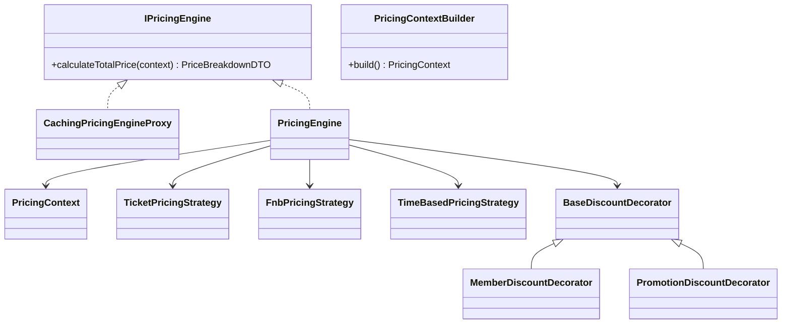

**Diagram sources**
- [IPricingEngine.java:1-12](file://backend/src/main/java/com/cinema/booking/services/strategy_decorator/pricing/IPricingEngine.java#L1-L12)
- [PricingContext.java](file://backend/src/main/java/com/cinema/booking/services/strategy_decorator/pricing/PricingContext.java)
- [PricingContextBuilder.java](file://backend/src/main/java/com/cinema/booking/services/strategy_decorator/pricing/PricingContextBuilder.java)
- [TicketPricingStrategy.java](file://backend/src/main/java/com/cinema/booking/services/strategy_decorator/pricing/TicketPricingStrategy.java)
- [FnbPricingStrategy.java](file://backend/src/main/java/com/cinema/booking/services/strategy_decorator/pricing/FnbPricingStrategy.java)
- [TimeBasedPricingStrategy.java](file://backend/src/main/java/com/cinema/booking/services/strategy_decorator/pricing/TimeBasedPricingStrategy.java)
- [BaseDiscountDecorator.java](file://backend/src/main/java/com/cinema/booking/services/strategy_decorator/pricing/BaseDiscountDecorator.java)
- [MemberDiscountDecorator.java](file://backend/src/main/java/com/cinema/booking/services/strategy_decorator/pricing/MemberDiscountDecorator.java)
- [PromotionDiscountDecorator.java](file://backend/src/main/java/com/cinema/booking/services/strategy_decorator/pricing/PromotionDiscountDecorator.java)
- [CachingPricingEngineProxy.java](file://backend/src/main/java/com/cinema/booking/services/strategy_decorator/pricing/CachingPricingEngineProxy.java)

Validation chain for pricing:
- Seats availability check.
- Showtime future date validation.
- Promotion validity check.
- Abstract handler base for shared validation logic.

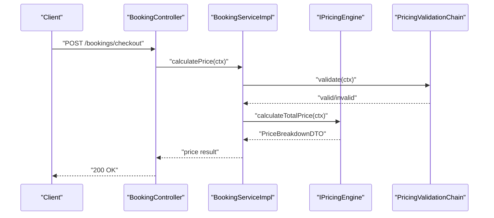

**Diagram sources**
- [BookingController.java](file://backend/src/main/java/com/cinema/booking/controllers/BookingController.java)
- [BookingServiceImpl.java](file://backend/src/main/java/com/cinema/booking/services/impl/BookingServiceImpl.java)
- [IPricingEngine.java:1-12](file://backend/src/main/java/com/cinema/booking/services/strategy_decorator/pricing/IPricingEngine.java#L1-L12)
- [PricingValidationHandler.java](file://backend/src/main/java/com/cinema/booking/services/strategy_decorator/pricing/validation/PricingValidationHandler.java)
- [SeatsAvailableHandler.java](file://backend/src/main/java/com/cinema/booking/services/strategy_decorator/pricing/validation/SeatsAvailableHandler.java)
- [ShowtimeFutureHandler.java](file://backend/src/main/java/com/cinema/booking/services/strategy_decorator/pricing/validation/ShowtimeFutureHandler.java)
- [PromoValidHandler.java](file://backend/src/main/java/com/cinema/booking/services/strategy_decorator/pricing/validation/PromoValidHandler.java)
- [AbstractPricingValidationHandler.java](file://backend/src/main/java/com/cinema/booking/services/strategy_decorator/pricing/validation/AbstractPricingValidationHandler.java)
- [PricingValidationContext.java](file://backend/src/main/java/com/cinema/booking/services/strategy_decorator/pricing/validation/PricingValidationContext.java)
- [PricingValidationConfig.java](file://backend/src/main/java/com/cinema/booking/services/strategy_decorator/pricing/validation/PricingValidationConfig.java)

Concrete examples:
- Price calculation entry point: [IPricingEngine.java:10-11](file://backend/src/main/java/com/cinema/booking/services/strategy_decorator/pricing/IPricingEngine.java#L10-L11)
- Context building: [PricingContextBuilder.java](file://backend/src/main/java/com/cinema/booking/services/strategy_decorator/pricing/PricingContextBuilder.java)
- Ticket pricing strategy: [TicketPricingStrategy.java](file://backend/src/main/java/com/cinema/booking/services/strategy_decorator/pricing/TicketPricingStrategy.java)
- Food and beverage pricing strategy: [FnbPricingStrategy.java](file://backend/src/main/java/com/cinema/booking/services/strategy_decorator/pricing/FnbPricingStrategy.java)
- Time-based pricing strategy: [TimeBasedPricingStrategy.java](file://backend/src/main/java/com/cinema/booking/services/strategy_decorator/pricing/TimeBasedPricingStrategy.java)
- Caching proxy: [CachingPricingEngineProxy.java](file://backend/src/main/java/com/cinema/booking/services/strategy_decorator/pricing/CachingPricingEngineProxy.java)

**Section sources**
- [IPricingEngine.java:1-12](file://backend/src/main/java/com/cinema/booking/services/strategy_decorator/pricing/IPricingEngine.java#L1-L12)
- [PricingContext.java](file://backend/src/main/java/com/cinema/booking/services/strategy_decorator/pricing/PricingContext.java)
- [PricingContextBuilder.java](file://backend/src/main/java/com/cinema/booking/services/strategy_decorator/pricing/PricingContextBuilder.java)
- [TicketPricingStrategy.java](file://backend/src/main/java/com/cinema/booking/services/strategy_decorator/pricing/TicketPricingStrategy.java)
- [FnbPricingStrategy.java](file://backend/src/main/java/com/cinema/booking/services/strategy_decorator/pricing/FnbPricingStrategy.java)
- [TimeBasedPricingStrategy.java](file://backend/src/main/java/com/cinema/booking/services/strategy_decorator/pricing/TimeBasedPricingStrategy.java)
- [BaseDiscountDecorator.java](file://backend/src/main/java/com/cinema/booking/services/strategy_decorator/pricing/BaseDiscountDecorator.java)
- [MemberDiscountDecorator.java](file://backend/src/main/java/com/cinema/booking/services/strategy_decorator/pricing/MemberDiscountDecorator.java)
- [PromotionDiscountDecorator.java](file://backend/src/main/java/com/cinema/booking/services/strategy_decorator/pricing/PromotionDiscountDecorator.java)
- [CachingPricingEngineProxy.java](file://backend/src/main/java/com/cinema/booking/services/strategy_decorator/pricing/CachingPricingEngineProxy.java)
- [PricingValidationHandler.java](file://backend/src/main/java/com/cinema/booking/services/strategy_decorator/pricing/validation/PricingValidationHandler.java)
- [SeatsAvailableHandler.java](file://backend/src/main/java/com/cinema/booking/services/strategy_decorator/pricing/validation/SeatsAvailableHandler.java)
- [ShowtimeFutureHandler.java](file://backend/src/main/java/com/cinema/booking/services/strategy_decorator/pricing/validation/ShowtimeFutureHandler.java)
- [PromoValidHandler.java](file://backend/src/main/java/com/cinema/booking/services/strategy_decorator/pricing/validation/PromoValidHandler.java)
- [AbstractPricingValidationHandler.java](file://backend/src/main/java/com/cinema/booking/services/strategy_decorator/pricing/validation/AbstractPricingValidationHandler.java)
- [PricingValidationContext.java](file://backend/src/main/java/com/cinema/booking/services/strategy_decorator/pricing/validation/PricingValidationContext.java)
- [PricingValidationConfig.java](file://backend/src/main/java/com/cinema/booking/services/strategy_decorator/pricing/validation/PricingValidationConfig.java)

### Booking State Management (State Pattern)
The booking state machine enforces lifecycle transitions and guards against invalid operations. The context delegates actions to the current state, ensuring that only valid transitions occur.

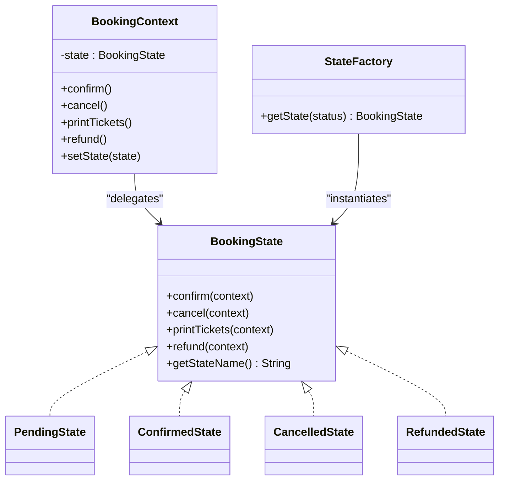

**Diagram sources**
- [BookingContext.java:1-38](file://backend/src/main/java/com/cinema/booking/patterns/state/BookingContext.java#L1-L38)
- [BookingState.java:1-12](file://backend/src/main/java/com/cinema/booking/patterns/state/BookingState.java#L1-L12)
- [PendingState.java:1-30](file://backend/src/main/java/com/cinema/booking/patterns/state/PendingState.java#L1-L30)
- [ConfirmedState.java:1-31](file://backend/src/main/java/com/cinema/booking/patterns/state/ConfirmedState.java#L1-L31)
- [CancelledState.java:1-30](file://backend/src/main/java/com/cinema/booking/patterns/state/CancelledState.java#L1-L30)
- [RefundedState.java:1-30](file://backend/src/main/java/com/cinema/booking/patterns/state/RefundedState.java#L1-L30)
- [StateFactory.java:1-17](file://backend/src/main/java/com/cinema/booking/patterns/state/StateFactory.java#L1-L17)

State transition examples:
- Pending -> Confirmed upon successful payment.
- Pending -> Cancelled upon user cancellation.
- Confirmed -> Refunded upon refund request.
- Cancelled/Refunded states prevent further lifecycle changes.

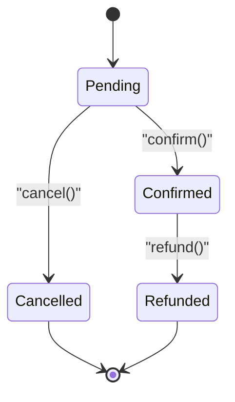

**Diagram sources**
- [PendingState.java:1-30](file://backend/src/main/java/com/cinema/booking/patterns/state/PendingState.java#L1-L30)
- [ConfirmedState.java:1-31](file://backend/src/main/java/com/cinema/booking/patterns/state/ConfirmedState.java#L1-L31)
- [CancelledState.java:1-30](file://backend/src/main/java/com/cinema/booking/patterns/state/CancelledState.java#L1-L30)
- [RefundedState.java:1-30](file://backend/src/main/java/com/cinema/booking/patterns/state/RefundedState.java#L1-L30)

Concrete examples:
- State transitions: [BookingContext.java:22-36](file://backend/src/main/java/com/cinema/booking/patterns/state/BookingContext.java#L22-L36)
- Guarded operations: [PendingState.java:16-23](file://backend/src/main/java/com/cinema/booking/patterns/state/PendingState.java#L16-L23), [ConfirmedState.java:10-13](file://backend/src/main/java/com/cinema/booking/patterns/state/ConfirmedState.java#L10-L13), [CancelledState.java:6-13](file://backend/src/main/java/com/cinema/booking/patterns/state/CancelledState.java#L6-L13), [RefundedState.java:6-13](file://backend/src/main/java/com/cinema/booking/patterns/state/RefundedState.java#L6-L13)

**Section sources**
- [BookingContext.java:1-38](file://backend/src/main/java/com/cinema/booking/patterns/state/BookingContext.java#L1-L38)
- [BookingState.java:1-12](file://backend/src/main/java/com/cinema/booking/patterns/state/BookingState.java#L1-L12)
- [PendingState.java:1-30](file://backend/src/main/java/com/cinema/booking/patterns/state/PendingState.java#L1-L30)
- [ConfirmedState.java:1-31](file://backend/src/main/java/com/cinema/booking/patterns/state/ConfirmedState.java#L1-L31)
- [CancelledState.java:1-30](file://backend/src/main/java/com/cinema/booking/patterns/state/CancelledState.java#L1-L30)
- [RefundedState.java:1-30](file://backend/src/main/java/com/cinema/booking/patterns/state/RefundedState.java#L1-L30)
- [StateFactory.java:1-17](file://backend/src/main/java/com/cinema/booking/patterns/state/StateFactory.java#L1-L17)

### Cancellation and Refund Processes
Cancellation and refund processes are governed by the state machine:
- Pending bookings can be cancelled to move to Cancelled state.
- Confirmed bookings can be refunded to Refunded state.
- Inventory release mechanisms:
  - Seat locks are released via Redis deletion.
  - Seat state transitions revert to vacant or remain sold depending on the outcome.

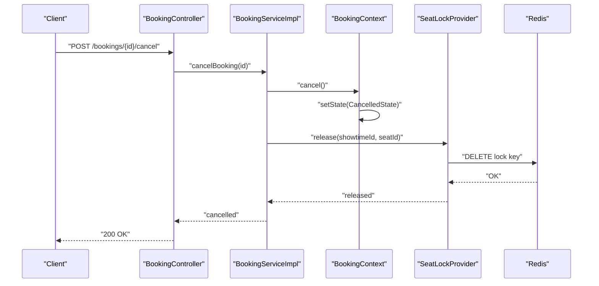

**Diagram sources**
- [BookingController.java](file://backend/src/main/java/com/cinema/booking/controllers/BookingController.java)
- [BookingServiceImpl.java](file://backend/src/main/java/com/cinema/booking/services/impl/BookingServiceImpl.java)
- [BookingContext.java:26-28](file://backend/src/main/java/com/cinema/booking/patterns/state/BookingContext.java#L26-L28)
- [SeatLockProvider.java:12-12](file://backend/src/main/java/com/cinema/booking/services/seatlock/SeatLockProvider.java#L12-L12)
- [RedisSeatLockAdapter.java:34-37](file://backend/src/main/java/com/cinema/booking/services/seatlock/RedisSeatLockAdapter.java#L34-L37)

**Section sources**
- [BookingContext.java:26-28](file://backend/src/main/java/com/cinema/booking/patterns/state/BookingContext.java#L26-L28)
- [CancelledState.java:1-30](file://backend/src/main/java/com/cinema/booking/patterns/state/CancelledState.java#L1-L30)
- [RefundedState.java:1-30](file://backend/src/main/java/com/cinema/booking/patterns/state/RefundedState.java#L1-L30)
- [SeatLockProvider.java:1-19](file://backend/src/main/java/com/cinema/booking/services/seatlock/SeatLockProvider.java#L1-L19)
- [RedisSeatLockAdapter.java:1-56](file://backend/src/main/java/com/cinema/booking/services/seatlock/RedisSeatLockAdapter.java#L1-L56)

### Transaction Boundaries and Concurrency Control
- Distributed locks: Redis SETNX with TTL prevents race conditions during seat locking.
- Batch operations: multiGet enables efficient lock checks across multiple seats.
- State synchronization: BookingContext updates the underlying booking entity’s status to keep persistence in sync.
- Validation chain: ensures preconditions (availability, future showtime, promotion validity) before pricing and booking.

Concrete examples:
- Distributed lock acquisition: [RedisSeatLockAdapter.java:27-32](file://backend/src/main/java/com/cinema/booking/services/seatlock/RedisSeatLockAdapter.java#L27-L32)
- Batch lock held checks: [RedisSeatLockAdapter.java:39-54](file://backend/src/main/java/com/cinema/booking/services/seatlock/RedisSeatLockAdapter.java#L39-L54)
- State synchronization: [BookingContext.java:16-20](file://backend/src/main/java/com/cinema/booking/patterns/state/BookingContext.java#L16-L20)
- Validation chain: [PricingValidationHandler.java](file://backend/src/main/java/com/cinema/booking/services/strategy_decorator/pricing/validation/PricingValidationHandler.java), [SeatsAvailableHandler.java](file://backend/src/main/java/com/cinema/booking/services/strategy_decorator/pricing/validation/SeatsAvailableHandler.java), [ShowtimeFutureHandler.java](file://backend/src/main/java/com/cinema/booking/services/strategy_decorator/pricing/validation/ShowtimeFutureHandler.java), [PromoValidHandler.java](file://backend/src/main/java/com/cinema/booking/services/strategy_decorator/pricing/validation/PromoValidHandler.java)

**Section sources**
- [RedisSeatLockAdapter.java:1-56](file://backend/src/main/java/com/cinema/booking/services/seatlock/RedisSeatLockAdapter.java#L1-L56)
- [BookingContext.java:1-38](file://backend/src/main/java/com/cinema/booking/patterns/state/BookingContext.java#L1-L38)
- [PricingValidationHandler.java](file://backend/src/main/java/com/cinema/booking/services/strategy_decorator/pricing/validation/PricingValidationHandler.java)
- [SeatsAvailableHandler.java](file://backend/src/main/java/com/cinema/booking/services/strategy_decorator/pricing/validation/SeatsAvailableHandler.java)
- [ShowtimeFutureHandler.java](file://backend/src/main/java/com/cinema/booking/services/strategy_decorator/pricing/validation/ShowtimeFutureHandler.java)
- [PromoValidHandler.java](file://backend/src/main/java/com/cinema/booking/services/strategy_decorator/pricing/validation/PromoValidHandler.java)

## Dependency Analysis
The system exhibits clear separation of concerns:
- Seat domain depends on DTOs for status representation.
- Seat locking is abstracted behind an interface, enabling pluggable Redis implementation.
- Booking state machine encapsulates lifecycle logic and enforces invariants.
- Pricing engine composes strategies and decorators, with caching support and validation chain.

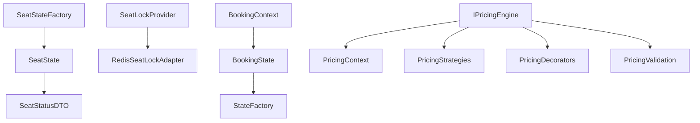

**Diagram sources**
- [SeatState.java:1-18](file://backend/src/main/java/com/cinema/booking/domain/seat/SeatState.java#L1-L18)
- [SeatStatusDTO.java](file://backend/src/main/java/com/cinema/booking/dtos/SeatStatusDTO.java)
- [SeatStateFactory.java:1-21](file://backend/src/main/java/com/cinema/booking/domain/seat/SeatStateFactory.java#L1-L21)
- [SeatLockProvider.java:1-19](file://backend/src/main/java/com/cinema/booking/services/seatlock/SeatLockProvider.java#L1-L19)
- [RedisSeatLockAdapter.java:1-56](file://backend/src/main/java/com/cinema/booking/services/seatlock/RedisSeatLockAdapter.java#L1-L56)
- [BookingContext.java:1-38](file://backend/src/main/java/com/cinema/booking/patterns/state/BookingContext.java#L1-L38)
- [BookingState.java:1-12](file://backend/src/main/java/com/cinema/booking/patterns/state/BookingState.java#L1-L12)
- [StateFactory.java:1-17](file://backend/src/main/java/com/cinema/booking/patterns/state/StateFactory.java#L1-L17)
- [IPricingEngine.java:1-12](file://backend/src/main/java/com/cinema/booking/services/strategy_decorator/pricing/IPricingEngine.java#L1-L12)
- [PricingContext.java](file://backend/src/main/java/com/cinema/booking/services/strategy_decorator/pricing/PricingContext.java)
- [PricingContextBuilder.java](file://backend/src/main/java/com/cinema/booking/services/strategy_decorator/pricing/PricingContextBuilder.java)
- [TicketPricingStrategy.java](file://backend/src/main/java/com/cinema/booking/services/strategy_decorator/pricing/TicketPricingStrategy.java)
- [FnbPricingStrategy.java](file://backend/src/main/java/com/cinema/booking/services/strategy_decorator/pricing/FnbPricingStrategy.java)
- [TimeBasedPricingStrategy.java](file://backend/src/main/java/com/cinema/booking/services/strategy_decorator/pricing/TimeBasedPricingStrategy.java)
- [BaseDiscountDecorator.java](file://backend/src/main/java/com/cinema/booking/services/strategy_decorator/pricing/BaseDiscountDecorator.java)
- [MemberDiscountDecorator.java](file://backend/src/main/java/com/cinema/booking/services/strategy_decorator/pricing/MemberDiscountDecorator.java)
- [PromotionDiscountDecorator.java](file://backend/src/main/java/com/cinema/booking/services/strategy_decorator/pricing/PromotionDiscountDecorator.java)
- [PricingValidationHandler.java](file://backend/src/main/java/com/cinema/booking/services/strategy_decorator/pricing/validation/PricingValidationHandler.java)
- [SeatsAvailableHandler.java](file://backend/src/main/java/com/cinema/booking/services/strategy_decorator/pricing/validation/SeatsAvailableHandler.java)
- [ShowtimeFutureHandler.java](file://backend/src/main/java/com/cinema/booking/services/strategy_decorator/pricing/validation/ShowtimeFutureHandler.java)
- [PromoValidHandler.java](file://backend/src/main/java/com/cinema/booking/services/strategy_decorator/pricing/validation/PromoValidHandler.java)

**Section sources**
- [SeatState.java:1-18](file://backend/src/main/java/com/cinema/booking/domain/seat/SeatState.java#L1-L18)
- [SeatStateFactory.java:1-21](file://backend/src/main/java/com/cinema/booking/domain/seat/SeatStateFactory.java#L1-L21)
- [SeatLockProvider.java:1-19](file://backend/src/main/java/com/cinema/booking/services/seatlock/SeatLockProvider.java#L1-L19)
- [RedisSeatLockAdapter.java:1-56](file://backend/src/main/java/com/cinema/booking/services/seatlock/RedisSeatLockAdapter.java#L1-L56)
- [BookingContext.java:1-38](file://backend/src/main/java/com/cinema/booking/patterns/state/BookingContext.java#L1-L38)
- [BookingState.java:1-12](file://backend/src/main/java/com/cinema/booking/patterns/state/BookingState.java#L1-L12)
- [StateFactory.java:1-17](file://backend/src/main/java/com/cinema/booking/patterns/state/StateFactory.java#L1-L17)
- [IPricingEngine.java:1-12](file://backend/src/main/java/com/cinema/booking/services/strategy_decorator/pricing/IPricingEngine.java#L1-L12)
- [PricingContext.java](file://backend/src/main/java/com/cinema/booking/services/strategy_decorator/pricing/PricingContext.java)
- [PricingContextBuilder.java](file://backend/src/main/java/com/cinema/booking/services/strategy_decorator/pricing/PricingContextBuilder.java)
- [TicketPricingStrategy.java](file://backend/src/main/java/com/cinema/booking/services/strategy_decorator/pricing/TicketPricingStrategy.java)
- [FnbPricingStrategy.java](file://backend/src/main/java/com/cinema/booking/services/strategy_decorator/pricing/FnbPricingStrategy.java)
- [TimeBasedPricingStrategy.java](file://backend/src/main/java/com/cinema/booking/services/strategy_decorator/pricing/TimeBasedPricingStrategy.java)
- [BaseDiscountDecorator.java](file://backend/src/main/java/com/cinema/booking/services/strategy_decorator/pricing/BaseDiscountDecorator.java)
- [MemberDiscountDecorator.java](file://backend/src/main/java/com/cinema/booking/services/strategy_decorator/pricing/MemberDiscountDecorator.java)
- [PromotionDiscountDecorator.java](file://backend/src/main/java/com/cinema/booking/services/strategy_decorator/pricing/PromotionDiscountDecorator.java)
- [PricingValidationHandler.java](file://backend/src/main/java/com/cinema/booking/services/strategy_decorator/pricing/validation/PricingValidationHandler.java)
- [SeatsAvailableHandler.java](file://backend/src/main/java/com/cinema/booking/services/strategy_decorator/pricing/validation/SeatsAvailableHandler.java)
- [ShowtimeFutureHandler.java](file://backend/src/main/java/com/cinema/booking/services/strategy_decorator/pricing/validation/ShowtimeFutureHandler.java)
- [PromoValidHandler.java](file://backend/src/main/java/com/cinema/booking/services/strategy_decorator/pricing/validation/PromoValidHandler.java)

## Performance Considerations
- Redis SETNX with TTL ensures atomicity and prevents stale locks; tune TTL to balance responsiveness and safety.
- Batch lock held checks reduce round trips via multiGet.
- Caching proxy for pricing engine reduces repeated computation for identical contexts.
- State transitions are O(1); keep entity updates minimal and synchronized via the context setter.

[No sources needed since this section provides general guidance]

## Troubleshooting Guide
Common issues and strategies:
- Concurrent seat reservations:
  - Use seat locking with Redis to avoid race conditions.
  - On lock failure, inform clients and suggest retry or select alternate seats.
- Invalid booking operations:
  - Pending state disallows printing tickets or refund until payment completes.
  - Confirmed state requires refund instead of standard cancellation.
  - Cancelled and refunded states prevent further lifecycle changes.
- Pricing validation failures:
  - Ensure seats are available, showtime is in the future, and promotions are valid before invoking pricing.

Concrete examples:
- Lock acquisition failure: [RedisSeatLockAdapter.java:27-32](file://backend/src/main/java/com/cinema/booking/services/seatlock/RedisSeatLockAdapter.java#L27-L32)
- State guard violations: [PendingState.java:16-23](file://backend/src/main/java/com/cinema/booking/patterns/state/PendingState.java#L16-L23), [ConfirmedState.java:10-13](file://backend/src/main/java/com/cinema/booking/patterns/state/ConfirmedState.java#L10-L13), [CancelledState.java:6-13](file://backend/src/main/java/com/cinema/booking/patterns/state/CancelledState.java#L6-L13), [RefundedState.java:6-13](file://backend/src/main/java/com/cinema/booking/patterns/state/RefundedState.java#L6-L13)
- Pricing validation errors: [PricingValidationHandler.java](file://backend/src/main/java/com/cinema/booking/services/strategy_decorator/pricing/validation/PricingValidationHandler.java), [SeatsAvailableHandler.java](file://backend/src/main/java/com/cinema/booking/services/strategy_decorator/pricing/validation/SeatsAvailableHandler.java), [ShowtimeFutureHandler.java](file://backend/src/main/java/com/cinema/booking/services/strategy_decorator/pricing/validation/ShowtimeFutureHandler.java), [PromoValidHandler.java](file://backend/src/main/java/com/cinema/booking/services/strategy_decorator/pricing/validation/PromoValidHandler.java)

**Section sources**
- [RedisSeatLockAdapter.java:27-32](file://backend/src/main/java/com/cinema/booking/services/seatlock/RedisSeatLockAdapter.java#L27-L32)
- [PendingState.java:16-23](file://backend/src/main/java/com/cinema/booking/patterns/state/PendingState.java#L16-L23)
- [ConfirmedState.java:10-13](file://backend/src/main/java/com/cinema/booking/patterns/state/ConfirmedState.java#L10-L13)
- [CancelledState.java:6-13](file://backend/src/main/java/com/cinema/booking/patterns/state/CancelledState.java#L6-L13)
- [RefundedState.java:6-13](file://backend/src/main/java/com/cinema/booking/patterns/state/RefundedState.java#L6-L13)
- [PricingValidationHandler.java](file://backend/src/main/java/com/cinema/booking/services/strategy_decorator/pricing/validation/PricingValidationHandler.java)
- [SeatsAvailableHandler.java](file://backend/src/main/java/com/cinema/booking/services/strategy_decorator/pricing/validation/SeatsAvailableHandler.java)
- [ShowtimeFutureHandler.java](file://backend/src/main/java/com/cinema/booking/services/strategy_decorator/pricing/validation/ShowtimeFutureHandler.java)
- [PromoValidHandler.java](file://backend/src/main/java/com/cinema/booking/services/strategy_decorator/pricing/validation/PromoValidHandler.java)

## Conclusion
The Booking Service implements robust seat status management with Redis-backed locking, a clear state machine for booking lifecycle control, and a flexible dynamic pricing engine with validation and caching. Together, these components provide concurrency-safe, transparent, and extensible booking operations.

[No sources needed since this section summarizes without analyzing specific files]

## Appendices
- Entity and DTO references:
  - Seat entity: [Seat.java](file://backend/src/main/java/com/cinema/booking/entities/Seat.java)
  - Booking entity: [Booking.java](file://backend/src/main/java/com/cinema/booking/entities/Booking.java)
  - Seat DTO: [SeatDTO.java](file://backend/src/main/java/com/cinema/booking/dtos/SeatDTO.java)
  - Seat status DTO: [SeatStatusDTO.java](file://backend/src/main/java/com/cinema/booking/dtos/SeatStatusDTO.java)
  - Price breakdown DTO: [PriceBreakdownDTO.java](file://backend/src/main/java/com/cinema/booking/dtos/PriceBreakdownDTO.java)
- Application configuration:
  - Redis configuration and properties: [application.properties](file://backend/src/main/resources/application.properties)

**Section sources**
- [Seat.java](file://backend/src/main/java/com/cinema/booking/entities/Seat.java)
- [Booking.java](file://backend/src/main/java/com/cinema/booking/entities/Booking.java)
- [SeatDTO.java](file://backend/src/main/java/com/cinema/booking/dtos/SeatDTO.java)
- [SeatStatusDTO.java](file://backend/src/main/java/com/cinema/booking/dtos/SeatStatusDTO.java)
- [PriceBreakdownDTO.java](file://backend/src/main/java/com/cinema/booking/dtos/PriceBreakdownDTO.java)
- [application.properties](file://backend/src/main/resources/application.properties)