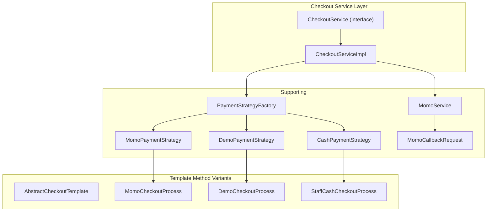
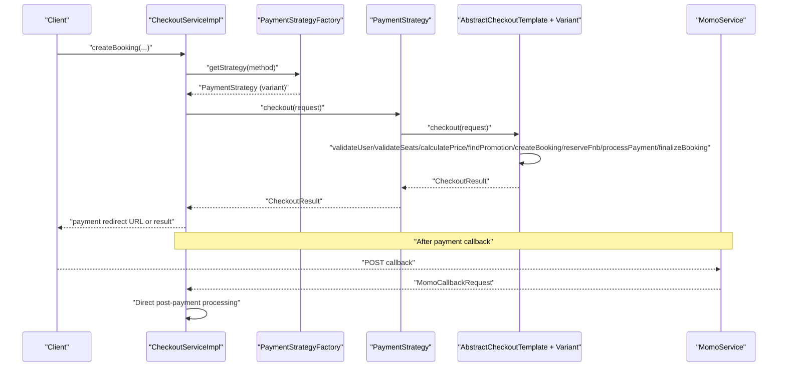
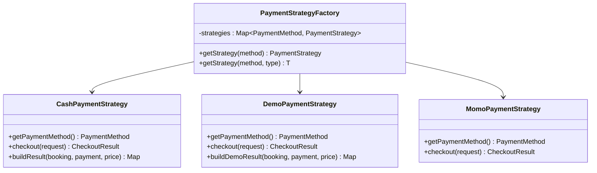
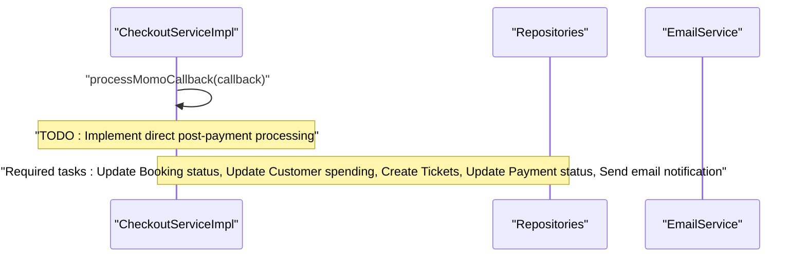
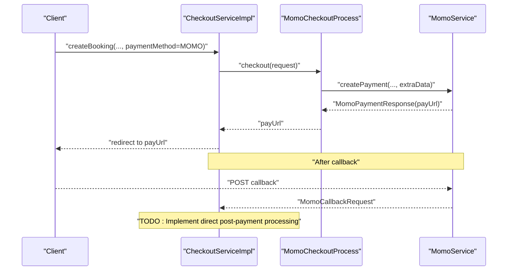
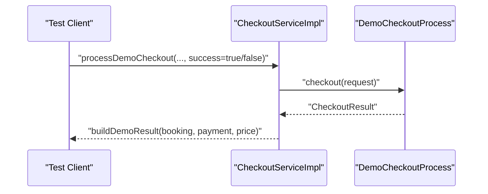
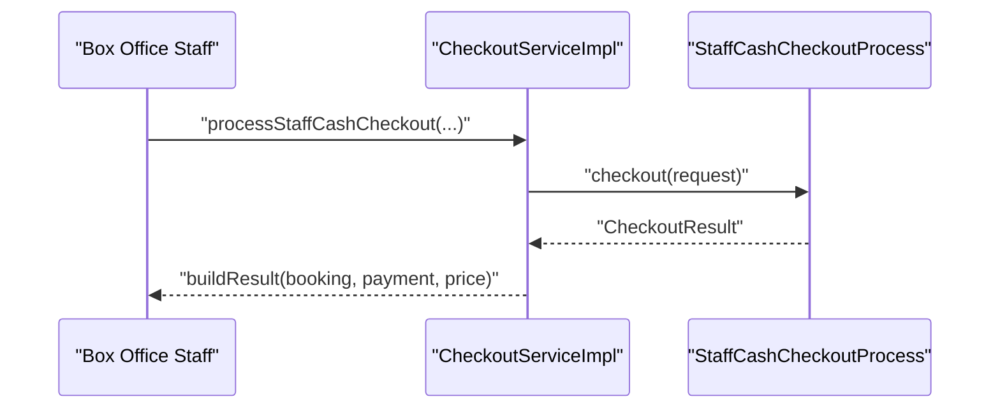
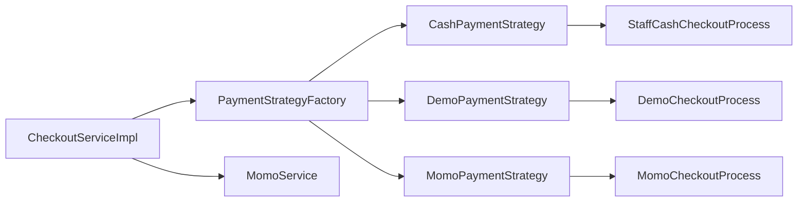

# Checkout Service

<cite>
**Referenced Files in This Document**
- [CheckoutService.java](file://backend/src/main/java/com/cinema/booking/services/CheckoutService.java)
- [CheckoutServiceImpl.java](file://backend/src/main/java/com/cinema/booking/services/impl/CheckoutServiceImpl.java)
- [AbstractCheckoutTemplate.java](file://backend/src/main/java/com/cinema/booking/services/template_method/checkout/AbstractCheckoutTemplate.java)
- [MomoCheckoutProcess.java](file://backend/src/main/java/com/cinema/booking/services/template_method/checkout/MomoCheckoutProcess.java)
- [DemoCheckoutProcess.java](file://backend/src/main/java/com/cinema/booking/services/template_method/checkout/DemoCheckoutProcess.java)
- [StaffCashCheckoutProcess.java](file://backend/src/main/java/com/cinema/booking/services/template_method/checkout/StaffCashCheckoutProcess.java)
- [PaymentStrategyFactory.java](file://backend/src/main/java/com/cinema/booking/services/payment/PaymentStrategyFactory.java)
- [CashPaymentStrategy.java](file://backend/src/main/java/com/cinema/booking/services/payment/CashPaymentStrategy.java)
- [DemoPaymentStrategy.java](file://backend/src/main/java/com/cinema/booking/services/payment/DemoPaymentStrategy.java)
- [MomoPaymentStrategy.java](file://backend/src/main/java/com/cinema/booking/services/payment/MomoPaymentStrategy.java)
- [MomoService.java](file://backend/src/main/java/com/cinema/booking/services/MomoService.java)
- [MomoCallbackRequest.java](file://backend/src/main/java/com/cinema/booking/dtos/MomoCallbackRequest.java)
</cite>

## Update Summary
**Changes Made**
- Removed PostPaymentMediator and related collaborator dependencies from CheckoutServiceImpl
- Updated processMomoCallback method to indicate required post-payment implementation
- Revised architecture diagrams to reflect direct implementation approach instead of mediator pattern
- Updated troubleshooting guide to reflect new direct post-payment processing requirements

## Table of Contents
1. [Introduction](#introduction)
2. [Project Structure](#project-structure)
3. [Core Components](#core-components)
4. [Architecture Overview](#architecture-overview)
5. [Detailed Component Analysis](#detailed-component-analysis)
6. [Dependency Analysis](#dependency-analysis)
7. [Performance Considerations](#performance-considerations)
8. [Troubleshooting Guide](#troubleshooting-guide)
9. [Security and PCI Compliance](#security-and-pci-compliance)
10. [Conclusion](#conclusion)

## Introduction
This document describes the Checkout Service that orchestrates payment processing workflows using the Template Method pattern. It covers three checkout variants:
- MoMo payment integration with gateway redirection and callback handling
- Demo checkout for internal testing with deterministic outcomes
- Staff cash checkout for box office operations

The system now implements a direct approach for post-payment processing, removing the previous Mediator pattern dependency. It documents the pre-payment validation pipeline using the Chain of Responsibility pattern, and outlines the direct post-payment coordination approach that updates inventory, sends notifications, and manages refunds. Finally, it covers integration with payment gateways, callback verification, error recovery mechanisms, and security considerations for PCI compliance.

**Updated** Removed PostPaymentMediator dependency and updated post-payment processing to direct implementation approach.

## Project Structure
The checkout system is organized around:
- Service interfaces and implementations
- Template Method implementations for each checkout variant
- Payment strategy factory for selecting the appropriate checkout flow
- Direct post-payment processing implementation

**Diagram sources**
- [CheckoutServiceImpl.java:24-199](file://backend/src/main/java/com/cinema/booking/services/impl/CheckoutServiceImpl.java#L24-L199)
- [AbstractCheckoutTemplate.java:17-182](file://backend/src/main/java/com/cinema/booking/services/template_method/checkout/AbstractCheckoutTemplate.java#L17-L182)
- [MomoCheckoutProcess.java:18-70](file://backend/src/main/java/com/cinema/booking/services/template_method/checkout/MomoCheckoutProcess.java#L18-L70)
- [DemoCheckoutProcess.java:19-131](file://backend/src/main/java/com/cinema/booking/services/template_method/checkout/DemoCheckoutProcess.java#L19-L131)
- [StaffCashCheckoutProcess.java:26-129](file://backend/src/main/java/com/cinema/booking/services/template_method/checkout/StaffCashCheckoutProcess.java#L26-L129)
- [PaymentStrategyFactory.java:14-49](file://backend/src/main/java/com/cinema/booking/services/payment/PaymentStrategyFactory.java#L14-L49)
- [CashPaymentStrategy.java:17-40](file://backend/src/main/java/com/cinema/booking/services/payment/CashPaymentStrategy.java#L17-L40)
- [DemoPaymentStrategy.java:13-36](file://backend/src/main/java/com/cinema/booking/services/payment/DemoPaymentStrategy.java#L13-L36)
- [MomoPaymentStrategy.java:8-27](file://backend/src/main/java/com/cinema/booking/services/payment/MomoPaymentStrategy.java#L8-L27)

**Section sources**
- [CheckoutService.java:3-11](file://backend/src/main/java/com/cinema/booking/services/CheckoutService.java#L3-L11)
- [CheckoutServiceImpl.java:24-199](file://backend/src/main/java/com/cinema/booking/services/impl/CheckoutServiceImpl.java#L24-L199)

## Core Components
- CheckoutService and CheckoutServiceImpl define the external contract and orchestrate checkout variants, callback verification, and direct post-payment processing.
- PaymentStrategyFactory selects the appropriate checkout template based on the requested payment method.
- Template Method variants encapsulate the shared steps and override payment-specific behavior.
- Payment strategies (CashPaymentStrategy, DemoPaymentStrategy, MomoPaymentStrategy) delegate to their respective template implementations.
- MomoService handles MoMo payment gateway integration and signature verification.

**Updated** Removed PostPaymentMediator dependency and updated to direct post-payment processing approach.

**Section sources**
- [CheckoutService.java:3-11](file://backend/src/main/java/com/cinema/booking/services/CheckoutService.java#L3-L11)
- [CheckoutServiceImpl.java:24-199](file://backend/src/main/java/com/cinema/booking/services/impl/CheckoutServiceImpl.java#L24-L199)
- [PaymentStrategyFactory.java:14-49](file://backend/src/main/java/com/cinema/booking/services/payment/PaymentStrategyFactory.java#L14-L49)
- [CashPaymentStrategy.java:17-40](file://backend/src/main/java/com/cinema/booking/services/payment/CashPaymentStrategy.java#L17-L40)
- [DemoPaymentStrategy.java:13-36](file://backend/src/main/java/com/cinema/booking/services/payment/DemoPaymentStrategy.java#L13-L36)
- [MomoPaymentStrategy.java:8-27](file://backend/src/main/java/com/cinema/booking/services/payment/MomoPaymentStrategy.java#L8-L27)

## Architecture Overview
The checkout flow is driven by a central service that delegates to a payment strategy determined by the requested method. The Template Method defines the canonical steps, while subclasses implement payment-specific logic. Pre-payment validation runs before the template executes, and post-payment actions are processed directly in the service layer after successful payment or upon failure.

**Updated** Removed mediator pattern dependency and updated to direct post-payment processing approach.

**Diagram sources**
- [CheckoutServiceImpl.java:43-63](file://backend/src/main/java/com/cinema/booking/services/impl/CheckoutServiceImpl.java#L43-L63)
- [AbstractCheckoutTemplate.java:53-95](file://backend/src/main/java/com/cinema/booking/services/template_method/checkout/AbstractCheckoutTemplate.java#L53-L95)
- [MomoPaymentStrategy.java:22-25](file://backend/src/main/java/com/cinema/booking/services/payment/MomoPaymentStrategy.java#L22-L25)

## Detailed Component Analysis

### Template Method: AbstractCheckoutTemplate and Variants
The Template Method defines the canonical checkout steps and leaves payment-specific steps to subclasses. Shared steps include user validation, seat availability checks, pricing calculation, promotion reservation, booking creation, F&B reservation/saving, payment processing, and finalization.

**Diagram sources**
- [AbstractCheckoutTemplate.java:17-182](file://backend/src/main/java/com/cinema/booking/services/template_method/checkout/AbstractCheckoutTemplate.java#L17-L182)
- [MomoCheckoutProcess.java:18-70](file://backend/src/main/java/com/cinema/booking/services/template_method/checkout/MomoCheckoutProcess.java#L18-L70)
- [DemoCheckoutProcess.java:19-131](file://backend/src/main/java/com/cinema/booking/services/template_method/checkout/DemoCheckoutProcess.java#L19-L131)
- [StaffCashCheckoutProcess.java:26-129](file://backend/src/main/java/com/cinema/booking/services/template_method/checkout/StaffCashCheckoutProcess.java#L26-L129)

Key behaviors:
- MoMo variant sets booking to pending and creates a payment record with pending status; payment URL is returned for redirection.
- Demo variant determines success or failure based on a flag; creates a payment record accordingly and, on success, issues tickets, updates customer spending, and sends emails.
- Staff cash variant confirms booking immediately, records a successful cash payment, and issues tickets.

**Section sources**
- [AbstractCheckoutTemplate.java:53-95](file://backend/src/main/java/com/cinema/booking/services/template_method/checkout/AbstractCheckoutTemplate.java#L53-L95)
- [MomoCheckoutProcess.java:40-69](file://backend/src/main/java/com/cinema/booking/services/template_method/checkout/MomoCheckoutProcess.java#L40-L69)
- [DemoCheckoutProcess.java:50-93](file://backend/src/main/java/com/cinema/booking/services/template_method/checkout/DemoCheckoutProcess.java#L50-L93)
- [StaffCashCheckoutProcess.java:54-95](file://backend/src/main/java/com/cinema/booking/services/template_method/checkout/StaffCashCheckoutProcess.java#L54-L95)

### Payment Strategy Factory and Strategies
The factory registers and retrieves payment strategies keyed by payment method, ensuring all supported methods are covered and preventing duplicates or missing strategies. Each strategy delegates to its corresponding template implementation.

**Diagram sources**
- [PaymentStrategyFactory.java:14-49](file://backend/src/main/java/com/cinema/booking/services/payment/PaymentStrategyFactory.java#L14-L49)
- [CashPaymentStrategy.java:17-40](file://backend/src/main/java/com/cinema/booking/services/payment/CashPaymentStrategy.java#L17-L40)
- [DemoPaymentStrategy.java:13-36](file://backend/src/main/java/com/cinema/booking/services/payment/DemoPaymentStrategy.java#L13-L36)
- [MomoPaymentStrategy.java:8-27](file://backend/src/main/java/com/cinema/booking/services/payment/MomoPaymentStrategy.java#L8-L27)

**Section sources**
- [PaymentStrategyFactory.java:14-49](file://backend/src/main/java/com/cinema/booking/services/payment/PaymentStrategyFactory.java#L14-L49)
- [CashPaymentStrategy.java:17-40](file://backend/src/main/java/com/cinema/booking/services/payment/CashPaymentStrategy.java#L17-L40)
- [DemoPaymentStrategy.java:13-36](file://backend/src/main/java/com/cinema/booking/services/payment/DemoPaymentStrategy.java#L13-L36)
- [MomoPaymentStrategy.java:8-27](file://backend/src/main/java/com/cinema/booking/services/payment/MomoPaymentStrategy.java#L8-L27)

### Direct Post-Payment Processing
After payment callbacks, the service directly handles post-payment actions in a fixed sequence to update booking status, manage inventory rollbacks, update user spending, issue tickets, update payment status, and send email notifications.

**Updated** Removed mediator pattern and implemented direct post-payment processing approach.

**Section sources**
- [CheckoutServiceImpl.java:65-144](file://backend/src/main/java/com/cinema/booking/services/impl/CheckoutServiceImpl.java#L65-L144)

### Checkout Scenarios and Workflows

#### MoMo Payment Integration
- The service validates the payment method and delegates to the MoMo checkout variant.
- The variant creates a payment record with pending status and returns a payment URL for redirection.
- On callback, the service verifies signature, decodes extra data, and processes post-payment actions directly.

**Updated** Post-payment processing now requires direct implementation instead of mediator pattern.

**Diagram sources**
- [CheckoutServiceImpl.java:43-63](file://backend/src/main/java/com/cinema/booking/services/impl/CheckoutServiceImpl.java#L43-L63)
- [MomoCheckoutProcess.java:46-58](file://backend/src/main/java/com/cinema/booking/services/template_method/checkout/MomoCheckoutProcess.java#L46-L58)

**Section sources**
- [CheckoutServiceImpl.java:43-63](file://backend/src/main/java/com/cinema/booking/services/impl/CheckoutServiceImpl.java#L43-L63)
- [MomoCheckoutProcess.java:40-69](file://backend/src/main/java/com/cinema/booking/services/template_method/checkout/MomoCheckoutProcess.java#L40-L69)

#### Demo Checkout for Testing
- The service constructs a demo checkout request and delegates to the demo variant.
- The variant creates a payment record reflecting the demo outcome and builds a structured result map.

**Diagram sources**
- [CheckoutServiceImpl.java:146-173](file://backend/src/main/java/com/cinema/booking/services/impl/CheckoutServiceImpl.java#L146-L173)
- [DemoCheckoutProcess.java:50-62](file://backend/src/main/java/com/cinema/booking/services/template_method/checkout/DemoCheckoutProcess.java#L50-L62)

**Section sources**
- [CheckoutServiceImpl.java:146-173](file://backend/src/main/java/com/cinema/booking/services/impl/CheckoutServiceImpl.java#L146-L173)
- [DemoCheckoutProcess.java:99-106](file://backend/src/main/java/com/cinema/booking/services/template_method/checkout/DemoCheckoutProcess.java#L99-L106)

#### Staff Cash Checkout for Box Office
- The service constructs a staff cash checkout request and delegates to the staff variant.
- The variant immediately confirms the booking, records a successful cash payment, and issues tickets.

**Diagram sources**
- [CheckoutServiceImpl.java:175-197](file://backend/src/main/java/com/cinema/booking/services/impl/CheckoutServiceImpl.java#L175-L197)
- [StaffCashCheckoutProcess.java:54-71](file://backend/src/main/java/com/cinema/booking/services/template_method/checkout/StaffCashCheckoutProcess.java#L54-L71)

**Section sources**
- [CheckoutServiceImpl.java:175-197](file://backend/src/main/java/com/cinema/booking/services/impl/CheckoutServiceImpl.java#L175-L197)
- [StaffCashCheckoutProcess.java:97-106](file://backend/src/main/java/com/cinema/booking/services/template_method/checkout/StaffCashCheckoutProcess.java#L97-L106)

## Dependency Analysis
The checkout system exhibits clear separation of concerns with direct dependencies:
- CheckoutServiceImpl depends on PaymentStrategyFactory, repositories, and MomoService.
- Payment strategies depend on their respective template implementations.
- Template variants depend on repositories and services to implement payment-specific logic.
- Direct post-payment processing requires explicit implementation in CheckoutServiceImpl.

**Updated** Removed PostPaymentMediator dependency and updated to direct implementation approach.

**Diagram sources**
- [CheckoutServiceImpl.java:24-41](file://backend/src/main/java/com/cinema/booking/services/impl/CheckoutServiceImpl.java#L24-L41)
- [PaymentStrategyFactory.java:16-31](file://backend/src/main/java/com/cinema/booking/services/payment/PaymentStrategyFactory.java#L16-L31)
- [CashPaymentStrategy.java:20-24](file://backend/src/main/java/com/cinema/booking/services/payment/CashPaymentStrategy.java#L20-L24)
- [DemoPaymentStrategy.java:16-20](file://backend/src/main/java/com/cinema/booking/services/payment/DemoPaymentStrategy.java#L16-L20)
- [MomoPaymentStrategy.java:11-15](file://backend/src/main/java/com/cinema/booking/services/payment/MomoPaymentStrategy.java#L11-L15)

**Section sources**
- [CheckoutServiceImpl.java:24-41](file://backend/src/main/java/com/cinema/booking/services/impl/CheckoutServiceImpl.java#L24-L41)
- [PaymentStrategyFactory.java:16-31](file://backend/src/main/java/com/cinema/booking/services/payment/PaymentStrategyFactory.java#L16-L31)
- [CashPaymentStrategy.java:20-24](file://backend/src/main/java/com/cinema/booking/services/payment/CashPaymentStrategy.java#L20-L24)
- [DemoPaymentStrategy.java:16-20](file://backend/src/main/java/com/cinema/booking/services/payment/DemoPaymentStrategy.java#L16-L20)
- [MomoPaymentStrategy.java:11-15](file://backend/src/main/java/com/cinema/booking/services/payment/MomoPaymentStrategy.java#L11-L15)

## Performance Considerations
- Template Method reduces duplication and transaction boundaries are clearly marked for each variant.
- Demo and staff variants avoid external gateway calls, minimizing latency.
- Direct post-payment processing eliminates mediator overhead but requires careful implementation.
- Deadlock resilience is implemented in customer spending updates using retries with exponential backoff-like delays.

**Updated** Added note about direct post-payment processing performance implications.

## Troubleshooting Guide
Common issues and recovery strategies:
- Invalid MoMo signature during callback: The service throws an error; verify signing key and payload integrity.
- Missing extraData in callback: The service throws an error; ensure the payment request includes properly encoded extraData.
- Seat already sold: Validation fails early; prompt the user to select another seat.
- Promotion not available: Promotion reservation fails; inform the user or apply alternative discounts.
- Payment record creation failures: The template logs errors but continues; check payment gateway responses and retry logic.
- Deadlocks on customer spending updates: The code retries with backoff; monitor database contention and adjust retry policy if needed.
- **New** Post-payment processing not implemented: The processMomoCallback method currently throws UnsupportedOperationException; implement the required 5 post-payment tasks directly in the service method.

**Updated** Added troubleshooting guidance for direct post-payment processing implementation.

**Section sources**
- [CheckoutServiceImpl.java:67-144](file://backend/src/main/java/com/cinema/booking/services/impl/CheckoutServiceImpl.java#L67-L144)
- [AbstractCheckoutTemplate.java:109-139](file://backend/src/main/java/com/cinema/booking/services/template_method/checkout/AbstractCheckoutTemplate.java#L109-L139)
- [DemoCheckoutProcess.java:108-129](file://backend/src/main/java/com/cinema/booking/services/template_method/checkout/DemoCheckoutProcess.java#L108-L129)
- [StaffCashCheckoutProcess.java:108-127](file://backend/src/main/java/com/cinema/booking/services/template_method/checkout/StaffCashCheckoutProcess.java#L108-L127)

## Security and PCI Compliance
Security considerations for payment processing:
- Signature verification: Always verify the payment gateway signature before processing callbacks.
- Input sanitization and validation: Enforce seat availability and user existence checks before proceeding.
- Secure storage: Do not log sensitive payment data; mask or avoid logging cardholder data, primary account numbers, and CVC.
- Least privilege: Restrict access to payment gateway credentials and callback endpoints.
- HTTPS and CORS: Enforce secure transport and restrict origins for callback endpoints.
- Tokenization and PCI DSS: Prefer tokenized payments and avoid storing sensitive cardholder data. Use PCI-compliant hosted fields or third-party payment processors.
- Audit trails: Log events without sensitive data; maintain non-repudiation through signed requests and immutable audit logs.
- Error handling: Do not expose internal errors containing sensitive data; return generic messages to clients.
- **New** Direct post-payment processing security: Ensure all direct database operations are properly transactional and handle errors securely.

**Updated** Added security considerations for direct post-payment processing approach.

## Conclusion
The Checkout Service leverages the Template Method pattern to unify payment workflows while allowing per-method customization. Pre-payment validation ensures data integrity, and the direct post-payment processing approach provides more control over payment completion workflows. Integration with MoMo includes robust callback handling, while Demo and Staff Cash variants support testing and box office operations. The removal of the mediator pattern simplifies the architecture but requires careful implementation of post-payment processing tasks directly in the service layer. Adhering to the security and PCI guidelines outlined above will help maintain a secure and compliant payment processing system.