# Checkout Service

<cite>
**Referenced Files in This Document**
- [CheckoutService.java](file://backend/src/main/java/com/cinema/booking/services/CheckoutService.java)
- [CheckoutServiceImpl.java](file://backend/src/main/java/com/cinema/booking/services/impl/CheckoutServiceImpl.java)
- [AbstractCheckoutTemplate.java](file://backend/src/main/java/com/cinema/booking/services/template_method/checkout/AbstractCheckoutTemplate.java)
- [MomoCheckoutProcess.java](file://backend/src/main/java/com/cinema/booking/services/template_method/checkout/MomoCheckoutProcess.java)
- [DemoCheckoutProcess.java](file://backend/src/main/java/com/cinema/booking/services/template_method/checkout/DemoCheckoutProcess.java)
- [StaffCashCheckoutProcess.java](file://backend/src/main/java/com/cinema/booking/services/template_method/checkout/StaffCashCheckoutProcess.java)
- [PaymentStrategyFactory.java](file://backend/src/main/java/com/cinema/booking/services/payment/PaymentStrategyFactory.java)
- [AbstractCheckoutValidationHandler.java](file://backend/src/main/java/com/cinema/booking/patterns/chainofresponsibility/AbstractCheckoutValidationHandler.java)
- [CheckoutValidationContext.java](file://backend/src/main/java/com/cinema/booking/patterns/chainofresponsibility/CheckoutValidationContext.java)
- [PostPaymentMediator.java](file://backend/src/main/java/com/cinema/booking/patterns/mediator/PostPaymentMediator.java)
- [MomoCallbackContext.java](file://backend/src/main/java/com/cinema/booking/patterns/mediator/MomoCallbackContext.java)
</cite>

## Table of Contents
1. [Introduction](#introduction)
2. [Project Structure](#project-structure)
3. [Core Components](#core-components)
4. [Architecture Overview](#architecture-overview)
5. [Detailed Component Analysis](#detailed-component-analysis)
6. [Dependency Analysis](#dependency-analysis)
7. [Performance Considerations](#performance-considerations)
8. [Troubleshooting Guide](#troubleshooting-guide)
9. [Security and PCI Compliance](#security-and-pci-compliance)
10. [Conclusion](#conclusion)

## Introduction
This document describes the Checkout Service that orchestrates payment processing workflows using the Template Method pattern. It covers three checkout variants:
- MoMo payment integration with gateway redirection and callback handling
- Demo checkout for internal testing with deterministic outcomes
- Staff cash checkout for box office operations

It also documents the pre-payment validation pipeline using the Chain of Responsibility pattern, and the post-payment coordination via the Mediator pattern that updates inventory, sends notifications, and manages refunds. Finally, it outlines integration with payment gateways, callback verification, error recovery mechanisms, and security considerations for PCI compliance.

## Project Structure
The checkout system is organized around:
- Service interfaces and implementations
- Template Method implementations for each checkout variant
- Validation handlers for pre-payment checks
- Mediator for post-payment coordination
- Payment strategy factory for selecting the appropriate checkout flow

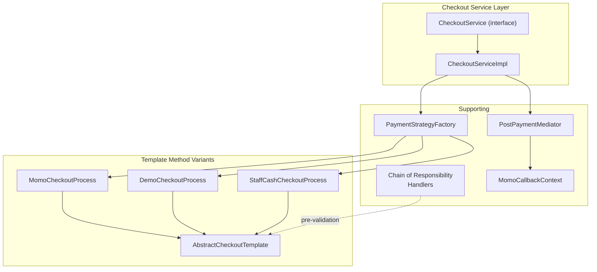

**Diagram sources**
- [CheckoutServiceImpl.java:26-184](file://backend/src/main/java/com/cinema/booking/services/impl/CheckoutServiceImpl.java#L26-L184)
- [AbstractCheckoutTemplate.java:17-181](file://backend/src/main/java/com/cinema/booking/services/template_method/checkout/AbstractCheckoutTemplate.java#L17-L181)
- [MomoCheckoutProcess.java:18-69](file://backend/src/main/java/com/cinema/booking/services/template_method/checkout/MomoCheckoutProcess.java#L18-L69)
- [DemoCheckoutProcess.java:19-130](file://backend/src/main/java/com/cinema/booking/services/template_method/checkout/DemoCheckoutProcess.java#L19-L130)
- [StaffCashCheckoutProcess.java:26-128](file://backend/src/main/java/com/cinema/booking/services/template_method/checkout/StaffCashCheckoutProcess.java#L26-L128)
- [PaymentStrategyFactory.java:14-48](file://backend/src/main/java/com/cinema/booking/services/payment/PaymentStrategyFactory.java#L14-L48)
- [PostPaymentMediator.java:10-46](file://backend/src/main/java/com/cinema/booking/patterns/mediator/PostPaymentMediator.java#L10-L46)
- [MomoCallbackContext.java:10-18](file://backend/src/main/java/com/cinema/booking/patterns/mediator/MomoCallbackContext.java#L10-L18)

**Section sources**
- [CheckoutService.java:3-11](file://backend/src/main/java/com/cinema/booking/services/CheckoutService.java#L3-L11)
- [CheckoutServiceImpl.java:26-184](file://backend/src/main/java/com/cinema/booking/services/impl/CheckoutServiceImpl.java#L26-L184)

## Core Components
- CheckoutService and CheckoutServiceImpl define the external contract and orchestrate checkout variants, callback verification, and post-payment mediator invocation.
- PaymentStrategyFactory selects the appropriate checkout template based on the requested payment method.
- Template Method variants encapsulate the shared steps and override payment-specific behavior.
- Chain of Responsibility handlers validate pre-payment conditions.
- PostPaymentMediator coordinates post-payment actions among specialized collaborators.

**Section sources**
- [CheckoutService.java:3-11](file://backend/src/main/java/com/cinema/booking/services/CheckoutService.java#L3-L11)
- [CheckoutServiceImpl.java:26-184](file://backend/src/main/java/com/cinema/booking/services/impl/CheckoutServiceImpl.java#L26-L184)
- [PaymentStrategyFactory.java:14-48](file://backend/src/main/java/com/cinema/booking/services/payment/PaymentStrategyFactory.java#L14-L48)

## Architecture Overview
The checkout flow is driven by a central service that delegates to a payment strategy determined by the requested method. The Template Method defines the canonical steps, while subclasses implement payment-specific logic. Pre-payment validation runs before the template executes, and post-payment actions are coordinated via a mediator after successful payment or upon failure.

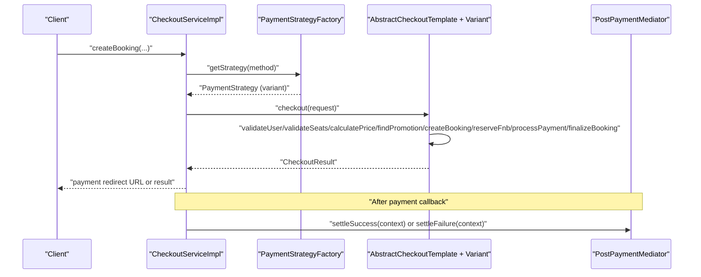

**Diagram sources**
- [CheckoutServiceImpl.java:43-64](file://backend/src/main/java/com/cinema/booking/services/impl/CheckoutServiceImpl.java#L43-L64)
- [AbstractCheckoutTemplate.java:53-95](file://backend/src/main/java/com/cinema/booking/services/template_method/checkout/AbstractCheckoutTemplate.java#L53-L95)
- [PostPaymentMediator.java:35-45](file://backend/src/main/java/com/cinema/booking/patterns/mediator/PostPaymentMediator.java#L35-L45)

## Detailed Component Analysis

### Template Method: AbstractCheckoutTemplate and Variants
The Template Method defines the canonical checkout steps and leaves payment-specific steps to subclasses. Shared steps include user validation, seat availability checks, pricing calculation, promotion reservation, booking creation, F&B reservation/saving, payment processing, and finalization.

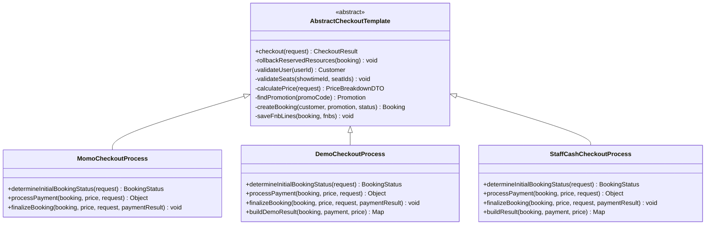

**Diagram sources**
- [AbstractCheckoutTemplate.java:17-181](file://backend/src/main/java/com/cinema/booking/services/template_method/checkout/AbstractCheckoutTemplate.java#L17-L181)
- [MomoCheckoutProcess.java:18-69](file://backend/src/main/java/com/cinema/booking/services/template_method/checkout/MomoCheckoutProcess.java#L18-L69)
- [DemoCheckoutProcess.java:19-130](file://backend/src/main/java/com/cinema/booking/services/template_method/checkout/DemoCheckoutProcess.java#L19-L130)
- [StaffCashCheckoutProcess.java:26-128](file://backend/src/main/java/com/cinema/booking/services/template_method/checkout/StaffCashCheckoutProcess.java#L26-L128)

Key behaviors:
- MoMo variant sets booking to pending and creates a payment record with pending status; payment URL is returned for redirection.
- Demo variant determines success or failure based on a flag; creates a payment record accordingly and, on success, issues tickets, updates customer spending, and sends emails.
- Staff cash variant confirms booking immediately, records a successful cash payment, and issues tickets.

**Section sources**
- [AbstractCheckoutTemplate.java:53-95](file://backend/src/main/java/com/cinema/booking/services/template_method/checkout/AbstractCheckoutTemplate.java#L53-L95)
- [MomoCheckoutProcess.java:40-68](file://backend/src/main/java/com/cinema/booking/services/template_method/checkout/MomoCheckoutProcess.java#L40-L68)
- [DemoCheckoutProcess.java:50-93](file://backend/src/main/java/com/cinema/booking/services/template_method/checkout/DemoCheckoutProcess.java#L50-L93)
- [StaffCashCheckoutProcess.java:54-95](file://backend/src/main/java/com/cinema/booking/services/template_method/checkout/StaffCashCheckoutProcess.java#L54-L95)

### Payment Strategy Factory
The factory registers and retrieves payment strategies keyed by payment method, ensuring all supported methods are covered and preventing duplicates or missing strategies.

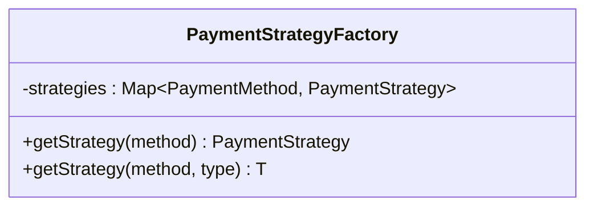

**Diagram sources**
- [PaymentStrategyFactory.java:14-48](file://backend/src/main/java/com/cinema/booking/services/payment/PaymentStrategyFactory.java#L14-L48)

**Section sources**
- [PaymentStrategyFactory.java:14-48](file://backend/src/main/java/com/cinema/booking/services/payment/PaymentStrategyFactory.java#L14-L48)

### Pre-Payment Validation Pipeline (Chain of Responsibility)
Pre-payment validation is implemented as a chain of responsibility. Each handler validates a specific aspect and forwards the context to the next handler if valid.

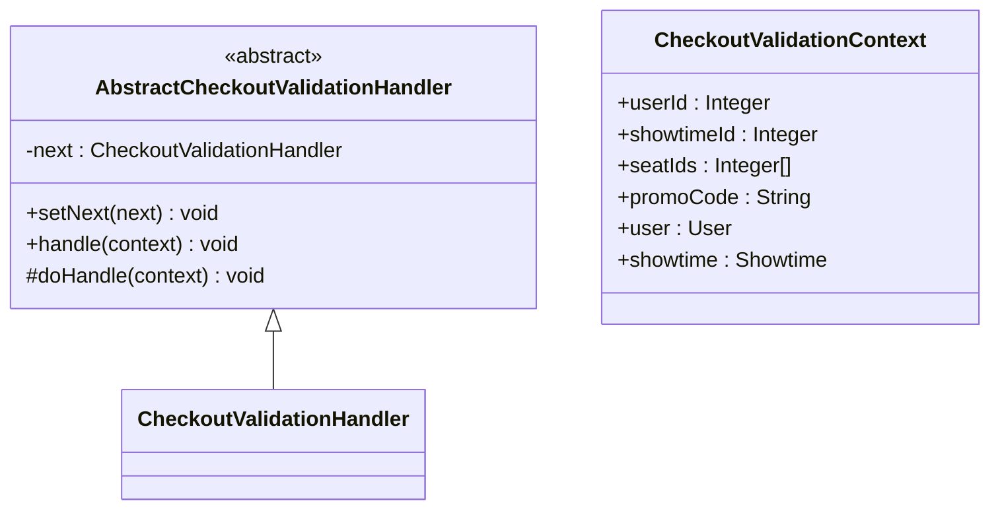

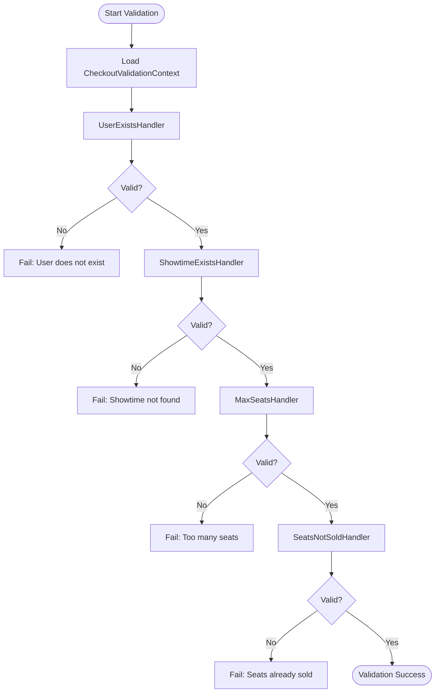

**Diagram sources**
- [AbstractCheckoutValidationHandler.java:3-20](file://backend/src/main/java/com/cinema/booking/patterns/chainofresponsibility/AbstractCheckoutValidationHandler.java#L3-L20)
- [CheckoutValidationContext.java:10-21](file://backend/src/main/java/com/cinema/booking/patterns/chainofresponsibility/CheckoutValidationContext.java#L10-L21)

**Section sources**
- [AbstractCheckoutValidationHandler.java:3-20](file://backend/src/main/java/com/cinema/booking/patterns/chainofresponsibility/AbstractCheckoutValidationHandler.java#L3-L20)
- [CheckoutValidationContext.java:10-21](file://backend/src/main/java/com/cinema/booking/patterns/chainofresponsibility/CheckoutValidationContext.java#L10-L21)

### Post-Payment Coordination (Mediator)
After payment callbacks, the mediator coordinates actions across multiple collaborators in a fixed order to update booking status, manage inventory rollbacks, update user spending, issue tickets, update payment status, and send email notifications.

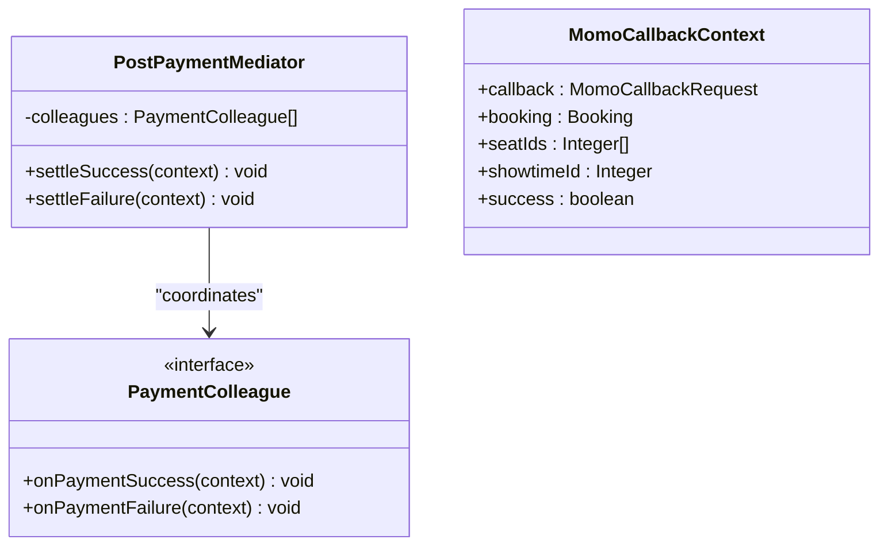

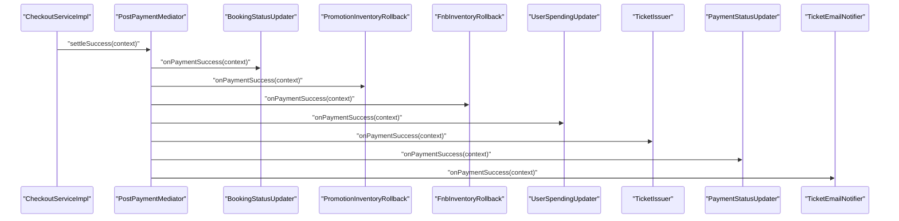

**Diagram sources**
- [PostPaymentMediator.java:10-46](file://backend/src/main/java/com/cinema/booking/patterns/mediator/PostPaymentMediator.java#L10-L46)
- [MomoCallbackContext.java:10-18](file://backend/src/main/java/com/cinema/booking/patterns/mediator/MomoCallbackContext.java#L10-L18)

**Section sources**
- [PostPaymentMediator.java:10-46](file://backend/src/main/java/com/cinema/booking/patterns/mediator/PostPaymentMediator.java#L10-L46)
- [MomoCallbackContext.java:10-18](file://backend/src/main/java/com/cinema/booking/patterns/mediator/MomoCallbackContext.java#L10-L18)

### Checkout Scenarios and Workflows

#### MoMo Payment Integration
- The service validates the payment method and delegates to the MoMo checkout variant.
- The variant creates a payment record with pending status and returns a payment URL for redirection.
- On callback, the service verifies signature, decodes extra data, and invokes the mediator to settle success or failure.

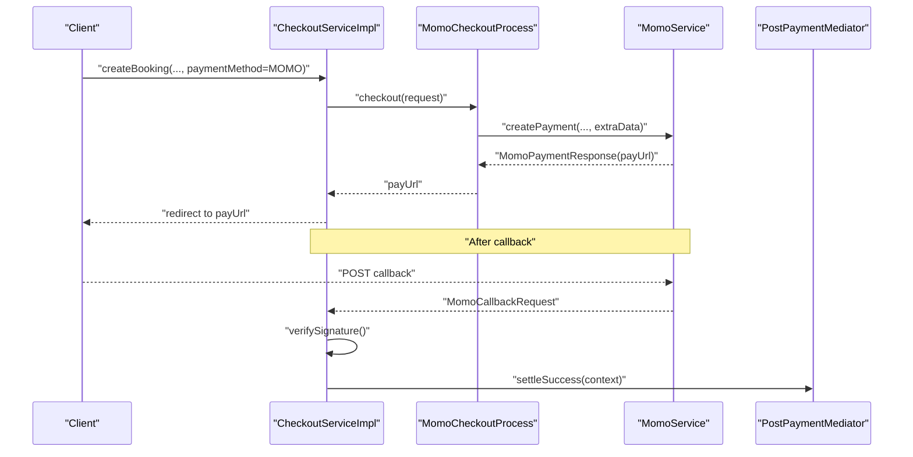

**Diagram sources**
- [CheckoutServiceImpl.java:43-64](file://backend/src/main/java/com/cinema/booking/services/impl/CheckoutServiceImpl.java#L43-L64)
- [MomoCheckoutProcess.java:46-57](file://backend/src/main/java/com/cinema/booking/services/template_method/checkout/MomoCheckoutProcess.java#L46-L57)
- [PostPaymentMediator.java:35-38](file://backend/src/main/java/com/cinema/booking/patterns/mediator/PostPaymentMediator.java#L35-L38)

**Section sources**
- [CheckoutServiceImpl.java:43-64](file://backend/src/main/java/com/cinema/booking/services/impl/CheckoutServiceImpl.java#L43-L64)
- [MomoCheckoutProcess.java:40-68](file://backend/src/main/java/com/cinema/booking/services/template_method/checkout/MomoCheckoutProcess.java#L40-L68)

#### Demo Checkout for Testing
- The service constructs a demo checkout request and delegates to the demo variant.
- The variant creates a payment record reflecting the demo outcome and builds a structured result map.

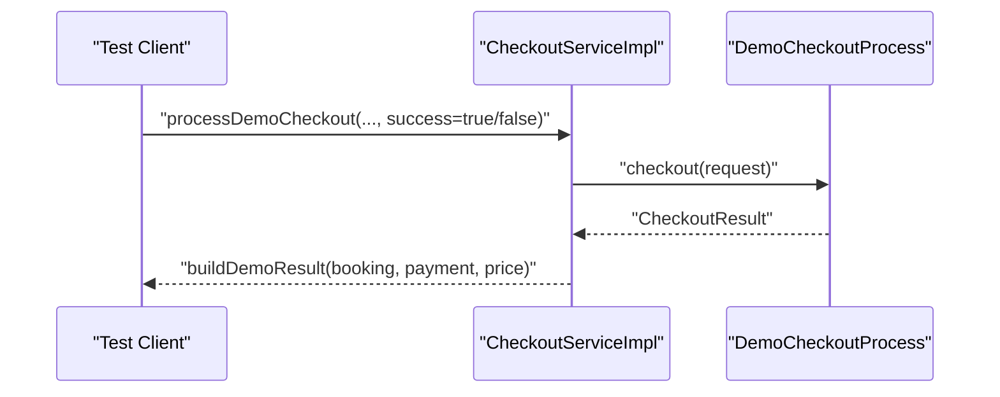

**Diagram sources**
- [CheckoutServiceImpl.java:132-159](file://backend/src/main/java/com/cinema/booking/services/impl/CheckoutServiceImpl.java#L132-L159)
- [DemoCheckoutProcess.java:50-62](file://backend/src/main/java/com/cinema/booking/services/template_method/checkout/DemoCheckoutProcess.java#L50-L62)

**Section sources**
- [CheckoutServiceImpl.java:132-159](file://backend/src/main/java/com/cinema/booking/services/impl/CheckoutServiceImpl.java#L132-L159)
- [DemoCheckoutProcess.java:99-106](file://backend/src/main/java/com/cinema/booking/services/template_method/checkout/DemoCheckoutProcess.java#L99-L106)

#### Staff Cash Checkout for Box Office
- The service constructs a staff cash checkout request and delegates to the staff variant.
- The variant immediately confirms the booking, records a successful cash payment, and issues tickets.

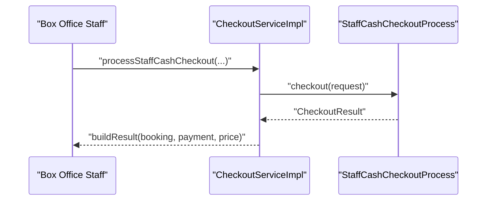

**Diagram sources**
- [CheckoutServiceImpl.java:161-183](file://backend/src/main/java/com/cinema/booking/services/impl/CheckoutServiceImpl.java#L161-L183)
- [StaffCashCheckoutProcess.java:54-71](file://backend/src/main/java/com/cinema/booking/services/template_method/checkout/StaffCashCheckoutProcess.java#L54-L71)

**Section sources**
- [CheckoutServiceImpl.java:161-183](file://backend/src/main/java/com/cinema/booking/services/impl/CheckoutServiceImpl.java#L161-L183)
- [StaffCashCheckoutProcess.java:97-106](file://backend/src/main/java/com/cinema/booking/services/template_method/checkout/StaffCashCheckoutProcess.java#L97-L106)

## Dependency Analysis
The checkout system exhibits clear separation of concerns:
- CheckoutServiceImpl depends on PaymentStrategyFactory, repositories, and the PostPaymentMediator.
- Template variants depend on repositories and services to implement payment-specific logic.
- PostPaymentMediator depends on multiple collaborators to coordinate post-payment actions.
- Validation handlers operate independently and are chained prior to template execution.

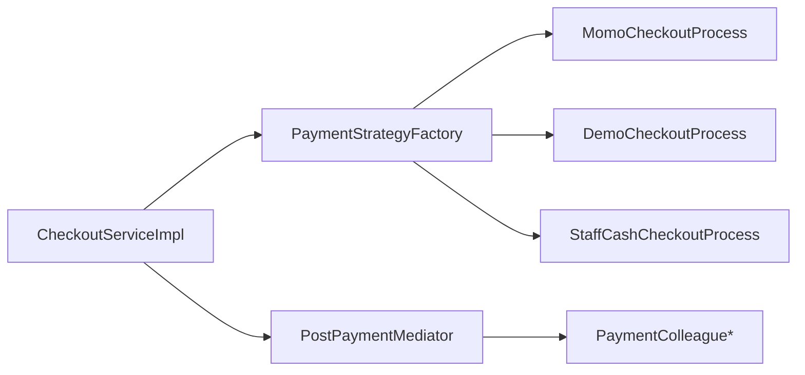

**Diagram sources**
- [CheckoutServiceImpl.java:31-41](file://backend/src/main/java/com/cinema/booking/services/impl/CheckoutServiceImpl.java#L31-L41)
- [PaymentStrategyFactory.java:16-31](file://backend/src/main/java/com/cinema/booking/services/payment/PaymentStrategyFactory.java#L16-L31)
- [PostPaymentMediator.java:14-32](file://backend/src/main/java/com/cinema/booking/patterns/mediator/PostPaymentMediator.java#L14-L32)

**Section sources**
- [CheckoutServiceImpl.java:31-41](file://backend/src/main/java/com/cinema/booking/services/impl/CheckoutServiceImpl.java#L31-L41)
- [PaymentStrategyFactory.java:16-31](file://backend/src/main/java/com/cinema/booking/services/payment/PaymentStrategyFactory.java#L16-L31)
- [PostPaymentMediator.java:14-32](file://backend/src/main/java/com/cinema/booking/patterns/mediator/PostPaymentMediator.java#L14-L32)

## Performance Considerations
- Template Method reduces duplication and transaction boundaries are clearly marked for each variant.
- Demo and staff variants avoid external gateway calls, minimizing latency.
- The mediator iterates through a fixed list of collaborators; ordering is explicit to ensure proper sequencing.
- Deadlock resilience is implemented in customer spending updates using retries with exponential backoff-like delays.

[No sources needed since this section provides general guidance]

## Troubleshooting Guide
Common issues and recovery strategies:
- Invalid MoMo signature during callback: The service throws an error; verify signing key and payload integrity.
- Missing extraData in callback: The service throws an error; ensure the payment request includes properly encoded extraData.
- Seat already sold: Validation fails early; prompt the user to select another seat.
- Promotion not available: Promotion reservation fails; inform the user or apply alternative discounts.
- Payment record creation failures: The template logs errors but continues; check payment gateway responses and retry logic.
- Deadlocks on customer spending updates: The code retries with backoff; monitor database contention and adjust retry policy if needed.

**Section sources**
- [CheckoutServiceImpl.java:68-130](file://backend/src/main/java/com/cinema/booking/services/impl/CheckoutServiceImpl.java#L68-L130)
- [AbstractCheckoutTemplate.java:109-139](file://backend/src/main/java/com/cinema/booking/services/template_method/checkout/AbstractCheckoutTemplate.java#L109-L139)
- [DemoCheckoutProcess.java:108-129](file://backend/src/main/java/com/cinema/booking/services/template_method/checkout/DemoCheckoutProcess.java#L108-L129)
- [StaffCashCheckoutProcess.java:108-127](file://backend/src/main/java/com/cinema/booking/services/template_method/checkout/StaffCashCheckoutProcess.java#L108-L127)

## Security and PCI Compliance
Security considerations for payment processing:
- Signature verification: Always verify the payment gateway signature before processing callbacks.
- Input sanitization and validation: Enforce seat availability and user existence checks before proceeding.
- Secure storage: Do not log sensitive payment data; mask or avoid logging cardholder data, primary account numbers, and CVC.
- Least privilege: Restrict access to payment gateway credentials and callback endpoints.
- HTTPS and CORS: Enforce secure transport and restrict origins for callback endpoints.
- Tokenization and PCI DSS: Prefer tokenized payments and avoid storing sensitive cardholder data. Use PCI-compliant hosted fields or third-party payment processors.
- Audit trails: Log events without sensitive data; maintain non-repudiation through signed requests and immutable audit logs.
- Error handling: Do not expose internal errors containing sensitive data; return generic messages to clients.

[No sources needed since this section provides general guidance]

## Conclusion
The Checkout Service leverages the Template Method pattern to unify payment workflows while allowing per-method customization. Pre-payment validation ensures data integrity, and the Mediator pattern coordinates post-payment actions reliably. Integration with MoMo includes robust callback handling, while Demo and Staff Cash variants support testing and box office operations. Adhering to the security and PCI guidelines outlined above will help maintain a secure and compliant payment processing system.