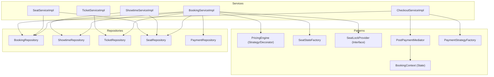
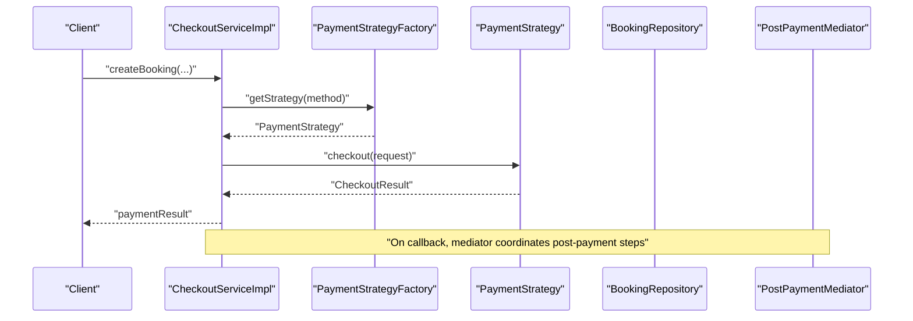
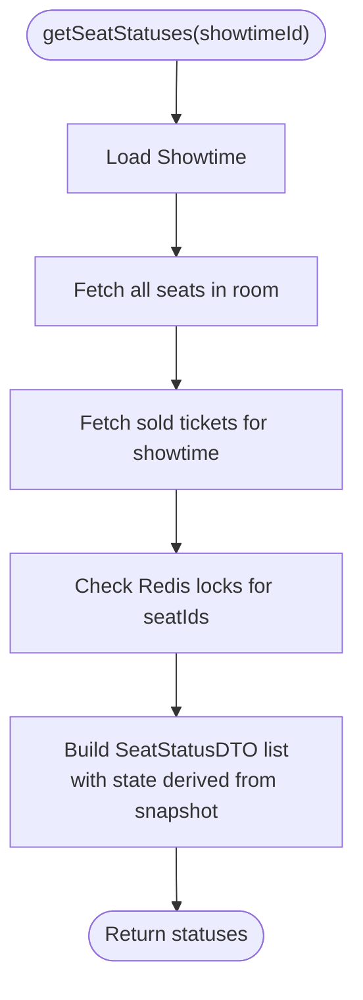
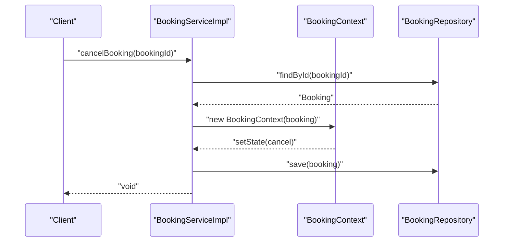
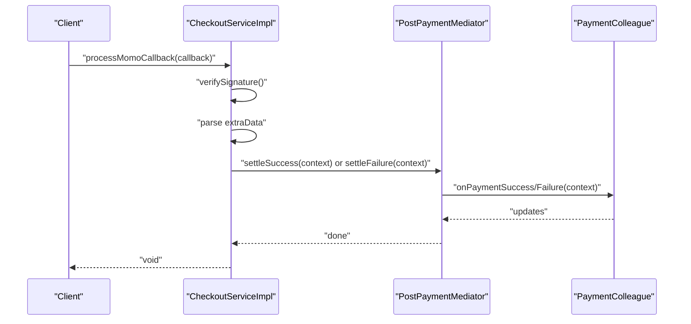
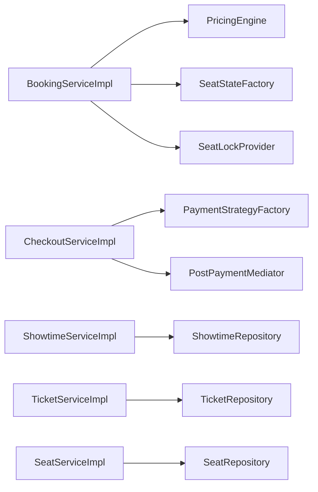

# Core Business Services

<cite>
**Referenced Files in This Document**
- [BookingServiceImpl.java](file://backend/src/main/java/com/cinema/booking/services/impl/BookingServiceImpl.java)
- [ShowtimeServiceImpl.java](file://backend/src/main/java/com/cinema/booking/services/impl/ShowtimeServiceImpl.java)
- [TicketServiceImpl.java](file://backend/src/main/java/com/cinema/booking/services/impl/TicketServiceImpl.java)
- [SeatServiceImpl.java](file://backend/src/main/java/com/cinema/booking/services/impl/SeatServiceImpl.java)
- [CheckoutServiceImpl.java](file://backend/src/main/java/com/cinema/booking/services/impl/CheckoutServiceImpl.java)
- [BookingContext.java](file://backend/src/main/java/com/cinema/booking/patterns/state/BookingContext.java)
- [PricingEngine.java](file://backend/src/main/java/com/cinema/booking/services/strategy_decorator/pricing/PricingEngine.java)
- [SeatStateFactory.java](file://backend/src/main/java/com/cinema/booking/domain/seat/SeatStateFactory.java)
- [SeatLockProvider.java](file://backend/src/main/java/com/cinema/booking/services/seatlock/SeatLockProvider.java)
- [PostPaymentMediator.java](file://backend/src/main/java/com/cinema/booking/patterns/mediator/PostPaymentMediator.java)
- [PaymentStrategyFactory.java](file://backend/src/main/java/com/cinema/booking/services/payment/PaymentStrategyFactory.java)
- [BookingFnbServiceImpl.java](file://backend/src/main/java/com/cinema/booking/services/impl/BookingFnbServiceImpl.java)
</cite>

## Table of Contents
1. [Introduction](#introduction)
2. [Project Structure](#project-structure)
3. [Core Components](#core-components)
4. [Architecture Overview](#architecture-overview)
5. [Detailed Component Analysis](#detailed-component-analysis)
6. [Dependency Analysis](#dependency-analysis)
7. [Performance Considerations](#performance-considerations)
8. [Troubleshooting Guide](#troubleshooting-guide)
9. [Conclusion](#conclusion)

## Introduction
This document focuses on the core business services that orchestrate primary application logic for cinema booking operations. It covers:
- Seat status management and locking
- Price calculation via a dynamic pricing engine
- Booking state transitions (confirm, cancel, refund, print tickets)
- Cancellation and refund workflows
- Movie scheduling and room management
- Ticket generation and validation
- Seat allocation and state management
- Payment processing workflows via a payment strategy factory and mediator pattern

The goal is to explain implementation patterns, transaction boundaries, business rule enforcement, error handling strategies, validation logic, and integration with repositories and external services.

## Project Structure
The core business services reside under the services package and integrate with repositories, DTOs, and specialized patterns such as state, mediator, strategy/decorator, and chain of responsibility.

**Diagram sources**
- [BookingServiceImpl.java:32-260](file://backend/src/main/java/com/cinema/booking/services/impl/BookingServiceImpl.java#L32-L260)
- [ShowtimeServiceImpl.java:22-126](file://backend/src/main/java/com/cinema/booking/services/impl/ShowtimeServiceImpl.java#L22-L126)
- [TicketServiceImpl.java:14-81](file://backend/src/main/java/com/cinema/booking/services/impl/TicketServiceImpl.java#L14-L81)
- [SeatServiceImpl.java:28-203](file://backend/src/main/java/com/cinema/booking/services/impl/SeatServiceImpl.java#L28-L203)
- [CheckoutServiceImpl.java:26-185](file://backend/src/main/java/com/cinema/booking/services/impl/CheckoutServiceImpl.java#L26-L185)
- [BookingContext.java:7-38](file://backend/src/main/java/com/cinema/booking/patterns/state/BookingContext.java#L7-L38)
- [PricingEngine.java:25-117](file://backend/src/main/java/com/cinema/booking/services/strategy_decorator/pricing/PricingEngine.java#L25-L117)
- [SeatStateFactory.java:6-21](file://backend/src/main/java/com/cinema/booking/domain/seat/SeatStateFactory.java#L6-L21)
- [SeatLockProvider.java:8-19](file://backend/src/main/java/com/cinema/booking/services/seatlock/SeatLockProvider.java#L8-L19)
- [PostPaymentMediator.java:10-47](file://backend/src/main/java/com/cinema/booking/patterns/mediator/PostPaymentMediator.java#L10-L47)
- [PaymentStrategyFactory.java:14-49](file://backend/src/main/java/com/cinema/booking/services/payment/PaymentStrategyFactory.java#L14-L49)

**Section sources**
- [BookingServiceImpl.java:32-260](file://backend/src/main/java/com/cinema/booking/services/impl/BookingServiceImpl.java#L32-L260)
- [ShowtimeServiceImpl.java:22-126](file://backend/src/main/java/com/cinema/booking/services/impl/ShowtimeServiceImpl.java#L22-L126)
- [TicketServiceImpl.java:14-81](file://backend/src/main/java/com/cinema/booking/services/impl/TicketServiceImpl.java#L14-L81)
- [SeatServiceImpl.java:28-203](file://backend/src/main/java/com/cinema/booking/services/impl/SeatServiceImpl.java#L28-L203)
- [CheckoutServiceImpl.java:26-185](file://backend/src/main/java/com/cinema/booking/services/impl/CheckoutServiceImpl.java#L26-L185)

## Core Components
This section documents the primary business services and their responsibilities.

- BookingServiceImpl
  - Seat status computation and display
  - Seat locking/unlocking with Redis-backed seat lock provider
  - Price calculation using a pricing engine and validation chain
  - Booking retrieval, search, and state transitions (cancel, refund, print tickets)
  - Integration with FnB inventory and promotion inventory for rollback/release

- ShowtimeServiceImpl
  - CRUD operations for showtimes
  - Automatic end-time calculation based on movie duration
  - Public search by cinema, movie, and date with JPA Specifications

- TicketServiceImpl
  - Retrieve tickets by booking or user
  - Validate existence before deletion
  - Convert entities to DTOs with seat row/number parsing

- SeatServiceImpl
  - Seat CRUD and room-scoped seat management
  - Batch replacement of seats in a room with conflict detection against existing bookings
  - Seat code normalization and resolution

- CheckoutServiceImpl
  - Orchestrates payment creation and callback handling
  - Validates MoMo signature and parses extraData
  - Uses PaymentStrategyFactory to select payment method and PostPaymentMediator to coordinate post-payment actions

**Section sources**
- [BookingServiceImpl.java:32-260](file://backend/src/main/java/com/cinema/booking/services/impl/BookingServiceImpl.java#L32-L260)
- [ShowtimeServiceImpl.java:22-126](file://backend/src/main/java/com/cinema/booking/services/impl/ShowtimeServiceImpl.java#L22-L126)
- [TicketServiceImpl.java:14-81](file://backend/src/main/java/com/cinema/booking/services/impl/TicketServiceImpl.java#L14-L81)
- [SeatServiceImpl.java:28-203](file://backend/src/main/java/com/cinema/booking/services/impl/SeatServiceImpl.java#L28-L203)
- [CheckoutServiceImpl.java:26-185](file://backend/src/main/java/com/cinema/booking/services/impl/CheckoutServiceImpl.java#L26-L185)

## Architecture Overview
The services collaborate with repositories and specialized patterns to enforce business rules and manage cross-cutting concerns.

**Diagram sources**
- [CheckoutServiceImpl.java:44-64](file://backend/src/main/java/com/cinema/booking/services/impl/CheckoutServiceImpl.java#L44-L64)
- [PaymentStrategyFactory.java:33-39](file://backend/src/main/java/com/cinema/booking/services/payment/PaymentStrategyFactory.java#L33-L39)
- [PostPaymentMediator.java:35-45](file://backend/src/main/java/com/cinema/booking/patterns/mediator/PostPaymentMediator.java#L35-L45)

## Detailed Component Analysis

### BookingServiceImpl
Responsibilities:
- Seat status management
  - Computes seat statuses per showtime combining database sales and Redis locks
  - Uses SeatStateFactory to derive display status
- Seat locking/unlocking
  - Attempts to acquire/release locks via SeatLockProvider
  - Respects state transitions via SeatStateFactory
- Price calculation
  - Validates inputs via a pricing validation chain
  - Resolves promotions via promotion inventory
  - Delegates to PricingEngine for total price computation
- Booking state transitions
  - Uses BookingContext to change booking status safely
  - Supports cancel, refund, and print tickets
- Cancellation/refund
  - Releases FnB and promotion inventory only if payment was not successful

Transaction boundaries:
- readOnly = true on service level; explicit @Transactional on mutating operations (cancel, refund, printTickets)

Error handling:
- Throws runtime exceptions for missing entities
- Uses ResponseStatusException for validation failures in seat replacement

Integration patterns:
- Repositories for persistence
- PricingEngine and PricingContextBuilder for pricing
- SeatLockProvider for seat reservation
- Promotion and FnB inventory services for resource management

**Diagram sources**
- [BookingServiceImpl.java:78-115](file://backend/src/main/java/com/cinema/booking/services/impl/BookingServiceImpl.java#L78-L115)
- [SeatStateFactory.java:11-19](file://backend/src/main/java/com/cinema/booking/domain/seat/SeatStateFactory.java#L11-L19)
- [SeatLockProvider.java:10-17](file://backend/src/main/java/com/cinema/booking/services/seatlock/SeatLockProvider.java#L10-L17)

**Diagram sources**
- [BookingServiceImpl.java:168-180](file://backend/src/main/java/com/cinema/booking/services/impl/BookingServiceImpl.java#L168-L180)
- [BookingContext.java:22-28](file://backend/src/main/java/com/cinema/booking/patterns/state/BookingContext.java#L22-L28)

**Section sources**
- [BookingServiceImpl.java:78-115](file://backend/src/main/java/com/cinema/booking/services/impl/BookingServiceImpl.java#L78-L115)
- [BookingServiceImpl.java:168-180](file://backend/src/main/java/com/cinema/booking/services/impl/BookingServiceImpl.java#L168-L180)
- [SeatStateFactory.java:11-19](file://backend/src/main/java/com/cinema/booking/domain/seat/SeatStateFactory.java#L11-L19)
- [SeatLockProvider.java:10-17](file://backend/src/main/java/com/cinema/booking/services/seatlock/SeatLockProvider.java#L10-L17)
- [BookingContext.java:22-28](file://backend/src/main/java/com/cinema/booking/patterns/state/BookingContext.java#L22-L28)

### ShowtimeServiceImpl
Responsibilities:
- CRUD for showtimes
- Calculates end time from start time and movie duration
- Public search using JPA Specifications

Validation and error handling:
- Throws runtime exceptions for missing entities

**Section sources**
- [ShowtimeServiceImpl.java:72-108](file://backend/src/main/java/com/cinema/booking/services/impl/ShowtimeServiceImpl.java#L72-L108)
- [ShowtimeServiceImpl.java:116-124](file://backend/src/main/java/com/cinema/booking/services/impl/ShowtimeServiceImpl.java#L116-L124)

### TicketServiceImpl
Responsibilities:
- Retrieve tickets by booking or user
- Validate existence before deletion
- Convert to DTO with seat row/number parsing

**Section sources**
- [TicketServiceImpl.java:20-46](file://backend/src/main/java/com/cinema/booking/services/impl/TicketServiceImpl.java#L20-L46)
- [TicketServiceImpl.java:48-80](file://backend/src/main/java/com/cinema/booking/services/impl/TicketServiceImpl.java#L48-L80)

### SeatServiceImpl
Responsibilities:
- Seat CRUD and room-scoped seat management
- Batch replacement with validation:
  - Detects duplicate seat codes
  - Prevents removal of seats that still have tickets
  - Updates seat type and activity status

Validation and error handling:
- Throws ResponseStatusException for invalid states (conflict, bad request, not found)

**Section sources**
- [SeatServiceImpl.java:127-187](file://backend/src/main/java/com/cinema/booking/services/impl/SeatServiceImpl.java#L127-L187)

### CheckoutServiceImpl
Responsibilities:
- Payment creation for supported methods
- MoMo callback verification and parsing
- Demo checkout and staff cash checkout
- Coordination of post-payment actions via PostPaymentMediator

Transaction boundaries:
- All major operations are @Transactional

Integration patterns:
- PaymentStrategyFactory selects strategy by method
- PostPaymentMediator coordinates multiple collaborators after payment settles

**Diagram sources**
- [CheckoutServiceImpl.java:68-130](file://backend/src/main/java/com/cinema/booking/services/impl/CheckoutServiceImpl.java#L68-L130)
- [PostPaymentMediator.java:35-45](file://backend/src/main/java/com/cinema/booking/patterns/mediator/PostPaymentMediator.java#L35-L45)

**Section sources**
- [CheckoutServiceImpl.java:44-64](file://backend/src/main/java/com/cinema/booking/services/impl/CheckoutServiceImpl.java#L44-L64)
- [CheckoutServiceImpl.java:68-130](file://backend/src/main/java/com/cinema/booking/services/impl/CheckoutServiceImpl.java#L68-L130)
- [CheckoutServiceImpl.java:134-183](file://backend/src/main/java/com/cinema/booking/services/impl/CheckoutServiceImpl.java#L134-L183)
- [PaymentStrategyFactory.java:33-47](file://backend/src/main/java/com/cinema/booking/services/payment/PaymentStrategyFactory.java#L33-L47)

## Dependency Analysis
Key dependencies and coupling:
- BookingServiceImpl depends on repositories, pricing engine, seat lock provider, and inventory services
- ShowtimeServiceImpl depends on movie and room repositories
- TicketServiceImpl depends on ticket repository
- SeatServiceImpl depends on room and seat type repositories
- CheckoutServiceImpl depends on payment strategy factory and mediator
- Patterns (state, mediator, strategy/decorator) decouple business logic from infrastructure

**Diagram sources**
- [BookingServiceImpl.java:66-76](file://backend/src/main/java/com/cinema/booking/services/impl/BookingServiceImpl.java#L66-L76)
- [SeatStateFactory.java:11-19](file://backend/src/main/java/com/cinema/booking/domain/seat/SeatStateFactory.java#L11-L19)
- [SeatLockProvider.java:10-17](file://backend/src/main/java/com/cinema/booking/services/seatlock/SeatLockProvider.java#L10-L17)
- [CheckoutServiceImpl.java:38-41](file://backend/src/main/java/com/cinema/booking/services/impl/CheckoutServiceImpl.java#L38-L41)
- [PaymentStrategyFactory.java:16-31](file://backend/src/main/java/com/cinema/booking/services/payment/PaymentStrategyFactory.java#L16-L31)
- [PostPaymentMediator.java:14-32](file://backend/src/main/java/com/cinema/booking/patterns/mediator/PostPaymentMediator.java#L14-L32)
- [ShowtimeServiceImpl.java:25-31](file://backend/src/main/java/com/cinema/booking/services/impl/ShowtimeServiceImpl.java#L25-L31)
- [TicketServiceImpl.java:17](file://backend/src/main/java/com/cinema/booking/services/impl/TicketServiceImpl.java#L17)
- [SeatServiceImpl.java:31-40](file://backend/src/main/java/com/cinema/booking/services/impl/SeatServiceImpl.java#L31-L40)

**Section sources**
- [BookingServiceImpl.java:66-76](file://backend/src/main/java/com/cinema/booking/services/impl/BookingServiceImpl.java#L66-L76)
- [CheckoutServiceImpl.java:38-41](file://backend/src/main/java/com/cinema/booking/services/impl/CheckoutServiceImpl.java#L38-L41)
- [ShowtimeServiceImpl.java:25-31](file://backend/src/main/java/com/cinema/booking/services/impl/ShowtimeServiceImpl.java#L25-L31)
- [TicketServiceImpl.java:17](file://backend/src/main/java/com/cinema/booking/services/impl/TicketServiceImpl.java#L17)
- [SeatServiceImpl.java:31-40](file://backend/src/main/java/com/cinema/booking/services/impl/SeatServiceImpl.java#L31-L40)

## Performance Considerations
- Seat status computation batches lock checks to minimize round trips
- Pricing engine aggregates line totals and applies decorators efficiently
- Transaction boundaries are scoped to mutating operations to reduce contention
- Seat replacement validates duplicates and conflicts upfront to avoid partial updates

[No sources needed since this section provides general guidance]

## Troubleshooting Guide
Common issues and resolutions:
- MoMo callback signature verification failure
  - Ensure signature verification passes before processing
  - Validate extraData presence and format
- Seat lock acquisition failures
  - Confirm seat is not sold and not already locked
  - Verify Redis TTL and connectivity
- Booking cancellation without payment success
  - Promotion and FnB inventory are released only when payment did not succeed
- Seat replacement conflicts
  - Seats with existing tickets cannot be removed; adjust or cancel bookings first
- Payment strategy selection errors
  - Ensure PaymentStrategyFactory has all required strategies registered

**Section sources**
- [CheckoutServiceImpl.java:69-75](file://backend/src/main/java/com/cinema/booking/services/impl/CheckoutServiceImpl.java#L69-L75)
- [BookingServiceImpl.java:176-179](file://backend/src/main/java/com/cinema/booking/services/impl/BookingServiceImpl.java#L176-L179)
- [SeatServiceImpl.java:155-158](file://backend/src/main/java/com/cinema/booking/services/impl/SeatServiceImpl.java#L155-L158)
- [PaymentStrategyFactory.java:26-30](file://backend/src/main/java/com/cinema/booking/services/payment/PaymentStrategyFactory.java#L26-L30)

## Conclusion
These core business services implement robust, transactional workflows for seat management, pricing, booking lifecycle, and payment processing. They leverage patterns such as state, mediator, strategy/decorator, and chain of responsibility to maintain clean separation of concerns, enforce business rules, and integrate with repositories and external systems. Proper validation, error handling, and transaction boundaries ensure reliability and consistency across operations.