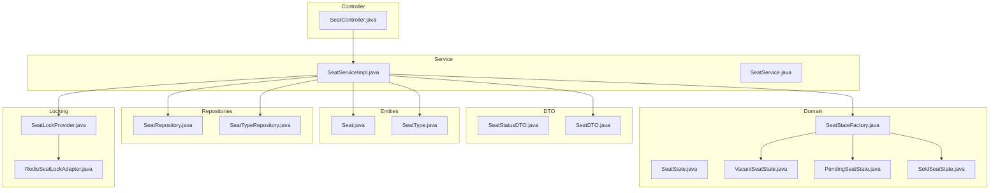
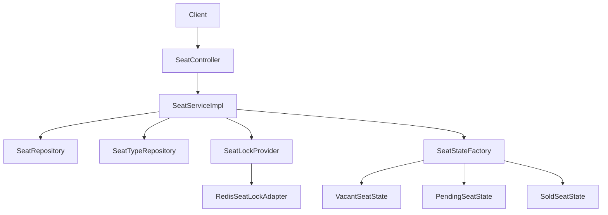
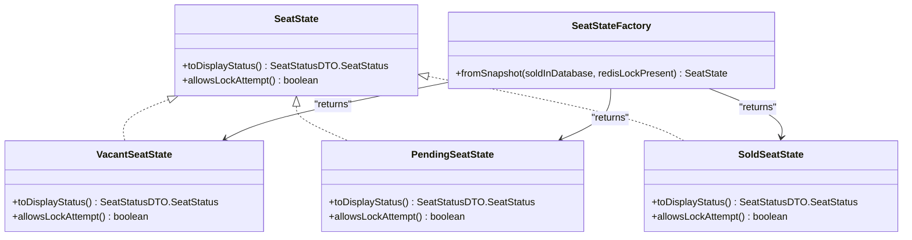
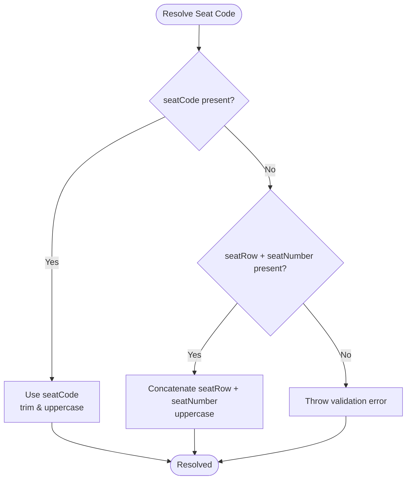
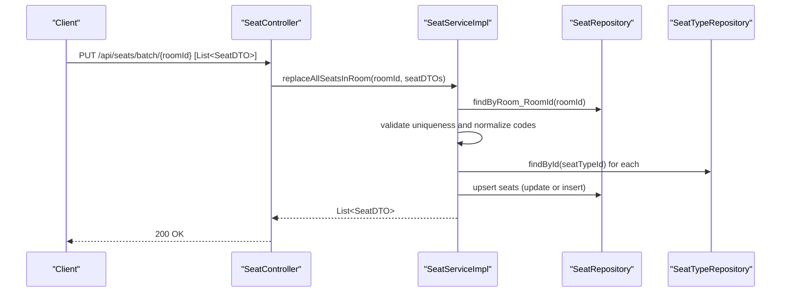
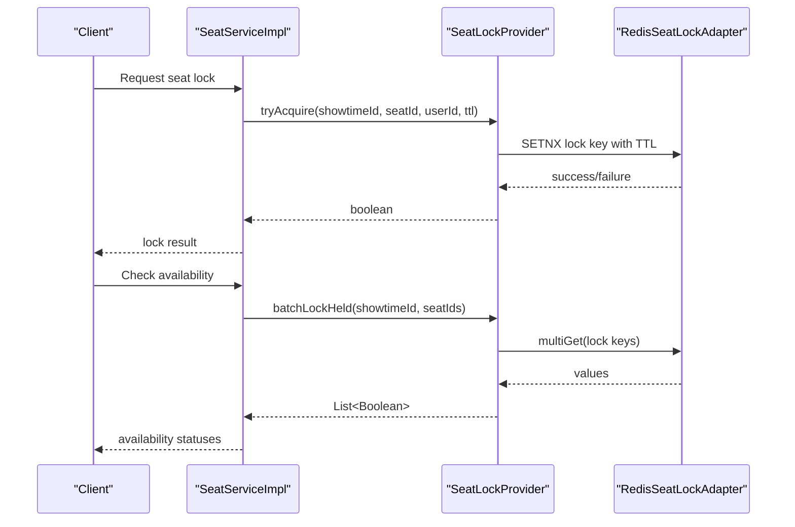
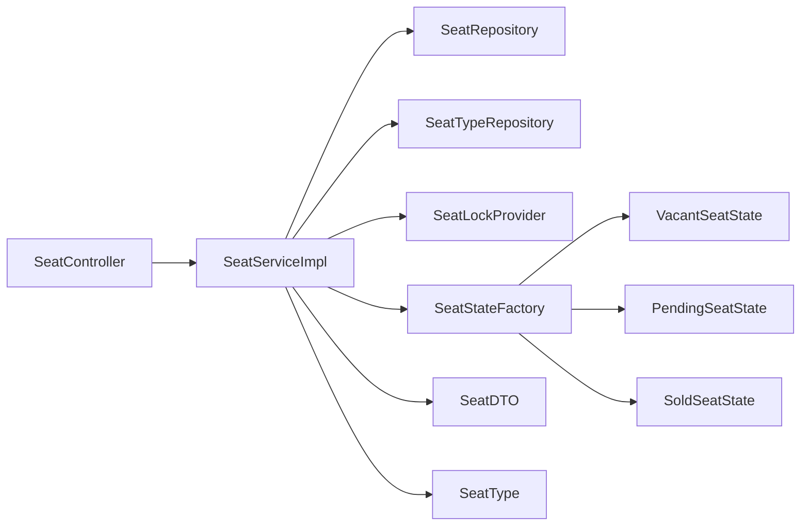

# Seat Service

<cite>
**Referenced Files in This Document**
- [SeatState.java](file://backend/src/main/java/com/cinema/booking/domain/seat/SeatState.java)
- [VacantSeatState.java](file://backend/src/main/java/com/cinema/booking/domain/seat/VacantSeatState.java)
- [PendingSeatState.java](file://backend/src/main/java/com/cinema/booking/domain/seat/PendingSeatState.java)
- [SoldSeatState.java](file://backend/src/main/java/com/cinema/booking/domain/seat/SoldSeatState.java)
- [SeatStateFactory.java](file://backend/src/main/java/com/cinema/booking/domain/seat/SeatStateFactory.java)
- [SeatService.java](file://backend/src/main/java/com/cinema/booking/services/SeatService.java)
- [SeatServiceImpl.java](file://backend/src/main/java/com/cinema/booking/services/impl/SeatServiceImpl.java)
- [SeatRepository.java](file://backend/src/main/java/com/cinema/booking/repositories/SeatRepository.java)
- [SeatType.java](file://backend/src/main/java/com/cinema/booking/entities/SeatType.java)
- [SeatTypeRepository.java](file://backend/src/main/java/com/cinema/booking/repositories/SeatTypeRepository.java)
- [SeatDTO.java](file://backend/src/main/java/com/cinema/booking/dtos/SeatDTO.java)
- [SeatStatusDTO.java](file://backend/src/main/java/com/cinema/booking/dtos/SeatStatusDTO.java)
- [SeatLockProvider.java](file://backend/src/main/java/com/cinema/booking/services/seatlock/SeatLockProvider.java)
- [RedisSeatLockAdapter.java](file://backend/src/main/java/com/cinema/booking/services/seatlock/RedisSeatLockAdapter.java)
- [SeatController.java](file://backend/src/main/java/com/cinema/booking/controllers/SeatController.java)
</cite>

## Table of Contents
1. [Introduction](#introduction)
2. [Project Structure](#project-structure)
3. [Core Components](#core-components)
4. [Architecture Overview](#architecture-overview)
5. [Detailed Component Analysis](#detailed-component-analysis)
6. [Dependency Analysis](#dependency-analysis)
7. [Performance Considerations](#performance-considerations)
8. [Troubleshooting Guide](#troubleshooting-guide)
9. [Conclusion](#conclusion)
10. [Appendices](#appendices)

## Introduction
This document describes the Seat Service with a focus on seat management and state handling. It covers seat allocation, seat type classification and price surcharge calculation, seat layout management, the Seat State pattern (Vacant, Sold, Pending), seat code parsing for row and number extraction, integration with seat locking mechanisms, and real-time availability updates. It also includes examples of seat state management, pricing based on seat types, and seat code formatting, along with repository operations and seat type management across different venue configurations.

## Project Structure
The Seat Service spans domain, DTO, repository, service, controller, and seat-lock adapter layers. The seat state machine resides under the domain layer, while seat persistence and seat-type metadata are handled via JPA repositories. The seat lock mechanism is abstracted behind an interface and implemented using Redis.

**Diagram sources**
- [SeatState.java:1-18](file://backend/src/main/java/com/cinema/booking/domain/seat/SeatState.java#L1-L18)
- [VacantSeatState.java:1-22](file://backend/src/main/java/com/cinema/booking/domain/seat/VacantSeatState.java#L1-L22)
- [PendingSeatState.java:1-22](file://backend/src/main/java/com/cinema/booking/domain/seat/PendingSeatState.java#L1-L22)
- [SoldSeatState.java:1-22](file://backend/src/main/java/com/cinema/booking/domain/seat/SoldSeatState.java#L1-L22)
- [SeatStateFactory.java:1-21](file://backend/src/main/java/com/cinema/booking/domain/seat/SeatStateFactory.java#L1-L21)
- [SeatService.java:1-15](file://backend/src/main/java/com/cinema/booking/services/SeatService.java#L1-L15)
- [SeatServiceImpl.java:1-203](file://backend/src/main/java/com/cinema/booking/services/impl/SeatServiceImpl.java#L1-L203)
- [SeatRepository.java:1-16](file://backend/src/main/java/com/cinema/booking/repositories/SeatRepository.java#L1-L16)
- [SeatTypeRepository.java:1-14](file://backend/src/main/java/com/cinema/booking/repositories/SeatTypeRepository.java#L1-L14)
- [SeatDTO.java:1-27](file://backend/src/main/java/com/cinema/booking/dtos/SeatDTO.java#L1-L27)
- [SeatStatusDTO.java:1-26](file://backend/src/main/java/com/cinema/booking/dtos/SeatStatusDTO.java#L1-L26)
- [SeatLockProvider.java:1-19](file://backend/src/main/java/com/cinema/booking/services/seatlock/SeatLockProvider.java#L1-L19)
- [RedisSeatLockAdapter.java:1-56](file://backend/src/main/java/com/cinema/booking/services/seatlock/RedisSeatLockAdapter.java#L1-L56)
- [SeatController.java:1-60](file://backend/src/main/java/com/cinema/booking/controllers/SeatController.java#L1-L60)

**Section sources**
- [SeatController.java:1-60](file://backend/src/main/java/com/cinema/booking/controllers/SeatController.java#L1-L60)
- [SeatService.java:1-15](file://backend/src/main/java/com/cinema/booking/services/SeatService.java#L1-L15)
- [SeatServiceImpl.java:1-203](file://backend/src/main/java/com/cinema/booking/services/impl/SeatServiceImpl.java#L1-L203)
- [SeatRepository.java:1-16](file://backend/src/main/java/com/cinema/booking/repositories/SeatRepository.java#L1-L16)
- [SeatTypeRepository.java:1-14](file://backend/src/main/java/com/cinema/booking/repositories/SeatTypeRepository.java#L1-L14)
- [SeatState.java:1-18](file://backend/src/main/java/com/cinema/booking/domain/seat/SeatState.java#L1-L18)
- [SeatStateFactory.java:1-21](file://backend/src/main/java/com/cinema/booking/domain/seat/SeatStateFactory.java#L1-L21)
- [VacantSeatState.java:1-22](file://backend/src/main/java/com/cinema/booking/domain/seat/VacantSeatState.java#L1-L22)
- [PendingSeatState.java:1-22](file://backend/src/main/java/com/cinema/booking/domain/seat/PendingSeatState.java#L1-L22)
- [SoldSeatState.java:1-22](file://backend/src/main/java/com/cinema/booking/domain/seat/SoldSeatState.java#L1-L22)
- [SeatDTO.java:1-27](file://backend/src/main/java/com/cinema/booking/dtos/SeatDTO.java#L1-L27)
- [SeatStatusDTO.java:1-26](file://backend/src/main/java/com/cinema/booking/dtos/SeatStatusDTO.java#L1-L26)
- [SeatLockProvider.java:1-19](file://backend/src/main/java/com/cinema/booking/services/seatlock/SeatLockProvider.java#L1-L19)
- [RedisSeatLockAdapter.java:1-56](file://backend/src/main/java/com/cinema/booking/services/seatlock/RedisSeatLockAdapter.java#L1-L56)

## Core Components
- Seat State Machine: Defines the state contract and concrete states for seat availability and lockability.
- Seat State Factory: Produces the correct state based on database and Redis lock snapshots.
- Seat Service: Manages seat CRUD, seat layout replacement, and seat code normalization/parsing.
- Seat Lock Provider: Abstracts seat locking with acquire/release/batch lock checks.
- Seat Entities and Repositories: Persist seat layout and seat type metadata.
- DTOs: Transport seat data and computed status and pricing.

Key responsibilities:
- Seat allocation: Uses seat type surcharge and seat code parsing to compute total price and display attributes.
- State transitions: Determined by database sales and Redis locks; Sold prevents further lock attempts.
- Real-time availability: Batch lock checks inform pending vs vacant states.

**Section sources**
- [SeatState.java:1-18](file://backend/src/main/java/com/cinema/booking/domain/seat/SeatState.java#L1-L18)
- [SeatStateFactory.java:1-21](file://backend/src/main/java/com/cinema/booking/domain/seat/SeatStateFactory.java#L1-L21)
- [VacantSeatState.java:1-22](file://backend/src/main/java/com/cinema/booking/domain/seat/VacantSeatState.java#L1-L22)
- [PendingSeatState.java:1-22](file://backend/src/main/java/com/cinema/booking/domain/seat/PendingSeatState.java#L1-L22)
- [SoldSeatState.java:1-22](file://backend/src/main/java/com/cinema/booking/domain/seat/SoldSeatState.java#L1-L22)
- [SeatServiceImpl.java:1-203](file://backend/src/main/java/com/cinema/booking/services/impl/SeatServiceImpl.java#L1-L203)
- [SeatDTO.java:1-27](file://backend/src/main/java/com/cinema/booking/dtos/SeatDTO.java#L1-L27)
- [SeatStatusDTO.java:1-26](file://backend/src/main/java/com/cinema/booking/dtos/SeatStatusDTO.java#L1-L26)
- [SeatLockProvider.java:1-19](file://backend/src/main/java/com/cinema/booking/services/seatlock/SeatLockProvider.java#L1-L19)
- [RedisSeatLockAdapter.java:1-56](file://backend/src/main/java/com/cinema/booking/services/seatlock/RedisSeatLockAdapter.java#L1-L56)

## Architecture Overview
The Seat Service follows layered architecture:
- Presentation: SeatController exposes endpoints for seat retrieval and batch replacement.
- Application: SeatServiceImpl orchestrates repository access, DTO mapping, seat code resolution, and state computation.
- Domain: SeatState defines state behavior; SeatStateFactory resolves state from DB and Redis signals.
- Persistence: SeatRepository and SeatTypeRepository manage seat layout and seat type metadata.
- Infrastructure: RedisSeatLockAdapter implements SeatLockProvider using Redis SETNX and multi-get.

**Diagram sources**
- [SeatController.java:1-60](file://backend/src/main/java/com/cinema/booking/controllers/SeatController.java#L1-L60)
- [SeatServiceImpl.java:1-203](file://backend/src/main/java/com/cinema/booking/services/impl/SeatServiceImpl.java#L1-L203)
- [SeatRepository.java:1-16](file://backend/src/main/java/com/cinema/booking/repositories/SeatRepository.java#L1-L16)
- [SeatTypeRepository.java:1-14](file://backend/src/main/java/com/cinema/booking/repositories/SeatTypeRepository.java#L1-L14)
- [SeatLockProvider.java:1-19](file://backend/src/main/java/com/cinema/booking/services/seatlock/SeatLockProvider.java#L1-L19)
- [RedisSeatLockAdapter.java:1-56](file://backend/src/main/java/com/cinema/booking/services/seatlock/RedisSeatLockAdapter.java#L1-L56)
- [SeatStateFactory.java:1-21](file://backend/src/main/java/com/cinema/booking/domain/seat/SeatStateFactory.java#L1-L21)
- [VacantSeatState.java:1-22](file://backend/src/main/java/com/cinema/booking/domain/seat/VacantSeatState.java#L1-L22)
- [PendingSeatState.java:1-22](file://backend/src/main/java/com/cinema/booking/domain/seat/PendingSeatState.java#L1-L22)
- [SoldSeatState.java:1-22](file://backend/src/main/java/com/cinema/booking/domain/seat/SoldSeatState.java#L1-L22)

## Detailed Component Analysis

### Seat State Pattern
The Seat State pattern encapsulates seat availability behavior and lockability:
- Contract: SeatState defines display status and whether a lock attempt is allowed.
- States:
  - Vacant: Available for locking.
  - Pending: Locked by a user via Redis; still not sold.
  - Sold: Final state; disallows lock attempts.
- Factory: SeatStateFactory selects the appropriate state given database-sold flag and Redis lock presence.

**Diagram sources**
- [SeatState.java:1-18](file://backend/src/main/java/com/cinema/booking/domain/seat/SeatState.java#L1-L18)
- [VacantSeatState.java:1-22](file://backend/src/main/java/com/cinema/booking/domain/seat/VacantSeatState.java#L1-L22)
- [PendingSeatState.java:1-22](file://backend/src/main/java/com/cinema/booking/domain/seat/PendingSeatState.java#L1-L22)
- [SoldSeatState.java:1-22](file://backend/src/main/java/com/cinema/booking/domain/seat/SoldSeatState.java#L1-L22)
- [SeatStateFactory.java:1-21](file://backend/src/main/java/com/cinema/booking/domain/seat/SeatStateFactory.java#L1-L21)

State transitions:
- From Vacant to Pending occurs when a lock attempt succeeds via Redis.
- From Pending to Sold occurs when a ticket sale is recorded in the database.
- Sold remains final; no further lock attempts are permitted.

**Section sources**
- [SeatState.java:1-18](file://backend/src/main/java/com/cinema/booking/domain/seat/SeatState.java#L1-L18)
- [VacantSeatState.java:1-22](file://backend/src/main/java/com/cinema/booking/domain/seat/VacantSeatState.java#L1-L22)
- [PendingSeatState.java:1-22](file://backend/src/main/java/com/cinema/booking/domain/seat/PendingSeatState.java#L1-L22)
- [SoldSeatState.java:1-22](file://backend/src/main/java/com/cinema/booking/domain/seat/SoldSeatState.java#L1-L22)
- [SeatStateFactory.java:1-21](file://backend/src/main/java/com/cinema/booking/domain/seat/SeatStateFactory.java#L1-L21)

### Seat Allocation and Pricing
Seat allocation integrates seat type surcharge with seat code parsing:
- Seat Type: Stores name and price surcharge per seat type.
- Seat DTO: Carries seat type name and surcharge for display and pricing.
- Seat Service: Maps entity to DTO, extracting seat row and number from seat code or explicit fields.

Seat pricing:
- Total price equals base price plus seat type surcharge.
- SeatStatusDTO carries totalPrice for display.

Seat code parsing:
- SeatServiceImpl resolves seat code from either seatCode or seatRow + seatNumber.
- Normalization ensures uppercase and trimmed codes.

**Diagram sources**
- [SeatServiceImpl.java:193-201](file://backend/src/main/java/com/cinema/booking/services/impl/SeatServiceImpl.java#L193-L201)
- [SeatDTO.java:1-27](file://backend/src/main/java/com/cinema/booking/dtos/SeatDTO.java#L1-L27)
- [SeatStatusDTO.java:1-26](file://backend/src/main/java/com/cinema/booking/dtos/SeatStatusDTO.java#L1-L26)

**Section sources**
- [SeatType.java:1-29](file://backend/src/main/java/com/cinema/booking/entities/SeatType.java#L1-L29)
- [SeatTypeRepository.java:1-14](file://backend/src/main/java/com/cinema/booking/repositories/SeatTypeRepository.java#L1-L14)
- [SeatServiceImpl.java:42-67](file://backend/src/main/java/com/cinema/booking/services/impl/SeatServiceImpl.java#L42-L67)
- [SeatServiceImpl.java:193-201](file://backend/src/main/java/com/cinema/booking/services/impl/SeatServiceImpl.java#L193-L201)
- [SeatDTO.java:1-27](file://backend/src/main/java/com/cinema/booking/dtos/SeatDTO.java#L1-L27)
- [SeatStatusDTO.java:1-26](file://backend/src/main/java/com/cinema/booking/dtos/SeatStatusDTO.java#L1-L26)

### Seat Layout Management
Seat layout management supports batch replacement of seats in a room:
- Validation: Ensures unique seat codes and prevents deletion of seats with existing tickets.
- Replacement: Updates existing seats or creates new ones while preserving order.
- Normalization: Codes are normalized to uppercase and trimmed for consistent comparison.

**Diagram sources**
- [SeatController.java:51-57](file://backend/src/main/java/com/cinema/booking/controllers/SeatController.java#L51-L57)
- [SeatServiceImpl.java:125-187](file://backend/src/main/java/com/cinema/booking/services/impl/SeatServiceImpl.java#L125-L187)
- [SeatRepository.java:10-15](file://backend/src/main/java/com/cinema/booking/repositories/SeatRepository.java#L10-L15)
- [SeatTypeRepository.java:10-12](file://backend/src/main/java/com/cinema/booking/repositories/SeatTypeRepository.java#L10-L12)

**Section sources**
- [SeatServiceImpl.java:125-187](file://backend/src/main/java/com/cinema/booking/services/impl/SeatServiceImpl.java#L125-L187)
- [SeatRepository.java:10-15](file://backend/src/main/java/com/cinema/booking/repositories/SeatRepository.java#L10-L15)
- [SeatTypeRepository.java:10-12](file://backend/src/main/java/com/cinema/booking/repositories/SeatTypeRepository.java#L10-L12)

### Seat Locking Mechanisms and Real-Time Availability
Seat locking is abstracted via SeatLockProvider and implemented with Redis:
- SeatLockProvider: Declares tryAcquire, release, and batchLockHeld.
- RedisSeatLockAdapter: Implements lock using SETNX with TTL and batch check via multiGet.
- Real-time availability: Batch lock held checks inform whether seats are Pending or Vacant.

Integration with state:
- SeatStateFactory uses database-sold and Redis-lock presence to select state.
- SeatState determines whether lock attempts are allowed.

**Diagram sources**
- [SeatLockProvider.java:1-19](file://backend/src/main/java/com/cinema/booking/services/seatlock/SeatLockProvider.java#L1-L19)
- [RedisSeatLockAdapter.java:1-56](file://backend/src/main/java/com/cinema/booking/services/seatlock/RedisSeatLockAdapter.java#L1-L56)
- [SeatStateFactory.java:1-21](file://backend/src/main/java/com/cinema/booking/domain/seat/SeatStateFactory.java#L1-L21)

**Section sources**
- [SeatLockProvider.java:1-19](file://backend/src/main/java/com/cinema/booking/services/seatlock/SeatLockProvider.java#L1-L19)
- [RedisSeatLockAdapter.java:1-56](file://backend/src/main/java/com/cinema/booking/services/seatlock/RedisSeatLockAdapter.java#L1-L56)
- [SeatStateFactory.java:1-21](file://backend/src/main/java/com/cinema/booking/domain/seat/SeatStateFactory.java#L1-L21)

### Seat Repository Operations and Seat Type Management
Seat repository operations:
- Find seats by room ID.
- Count seats in a room.
- Replace all seats in a room with batch semantics.

Seat type management:
- SeatType stores name and price surcharge.
- SeatTypeRepository supports lookup by name.

Seat service operations:
- CRUD for seats.
- Batch replacement with validation and normalization.
- Mapping to DTO with seat row/number extraction and seat type info.

**Section sources**
- [SeatRepository.java:1-16](file://backend/src/main/java/com/cinema/booking/repositories/SeatRepository.java#L1-L16)
- [SeatType.java:1-29](file://backend/src/main/java/com/cinema/booking/entities/SeatType.java#L1-L29)
- [SeatTypeRepository.java:1-14](file://backend/src/main/java/com/cinema/booking/repositories/SeatTypeRepository.java#L1-L14)
- [SeatServiceImpl.java:69-123](file://backend/src/main/java/com/cinema/booking/services/impl/SeatServiceImpl.java#L69-L123)
- [SeatServiceImpl.java:125-187](file://backend/src/main/java/com/cinema/booking/services/impl/SeatServiceImpl.java#L125-L187)

## Dependency Analysis
The Seat Service exhibits clean separation of concerns:
- Controllers depend on Services.
- Services depend on Repositories and the Seat Lock abstraction.
- Domain states are decoupled from implementation via factory selection.
- Seat types are managed independently and referenced by seats.

**Diagram sources**
- [SeatController.java:1-60](file://backend/src/main/java/com/cinema/booking/controllers/SeatController.java#L1-L60)
- [SeatServiceImpl.java:1-203](file://backend/src/main/java/com/cinema/booking/services/impl/SeatServiceImpl.java#L1-L203)
- [SeatRepository.java:1-16](file://backend/src/main/java/com/cinema/booking/repositories/SeatRepository.java#L1-L16)
- [SeatTypeRepository.java:1-14](file://backend/src/main/java/com/cinema/booking/repositories/SeatTypeRepository.java#L1-L14)
- [SeatStateFactory.java:1-21](file://backend/src/main/java/com/cinema/booking/domain/seat/SeatStateFactory.java#L1-L21)
- [VacantSeatState.java:1-22](file://backend/src/main/java/com/cinema/booking/domain/seat/VacantSeatState.java#L1-L22)
- [PendingSeatState.java:1-22](file://backend/src/main/java/com/cinema/booking/domain/seat/PendingSeatState.java#L1-L22)
- [SoldSeatState.java:1-22](file://backend/src/main/java/com/cinema/booking/domain/seat/SoldSeatState.java#L1-L22)
- [SeatDTO.java:1-27](file://backend/src/main/java/com/cinema/booking/dtos/SeatDTO.java#L1-L27)
- [SeatType.java:1-29](file://backend/src/main/java/com/cinema/booking/entities/SeatType.java#L1-L29)

**Section sources**
- [SeatController.java:1-60](file://backend/src/main/java/com/cinema/booking/controllers/SeatController.java#L1-L60)
- [SeatServiceImpl.java:1-203](file://backend/src/main/java/com/cinema/booking/services/impl/SeatServiceImpl.java#L1-L203)
- [SeatRepository.java:1-16](file://backend/src/main/java/com/cinema/booking/repositories/SeatRepository.java#L1-L16)
- [SeatTypeRepository.java:1-14](file://backend/src/main/java/com/cinema/booking/repositories/SeatTypeRepository.java#L1-L14)
- [SeatStateFactory.java:1-21](file://backend/src/main/java/com/cinema/booking/domain/seat/SeatStateFactory.java#L1-L21)

## Performance Considerations
- Batch operations: The batch endpoint for replacing seats reduces round trips and minimizes transaction overhead.
- Redis batching: batchLockHeld uses multiGet to reduce network calls for availability checks.
- Normalization: Consistent uppercase and trimmed codes improve lookup performance and reduce duplicates.
- DTO mapping: Efficient mapping avoids redundant queries by including seat type info during seat retrieval.

## Troubleshooting Guide
Common issues and resolutions:
- Seat code conflicts during batch replacement: Ensure unique seat codes; duplicates trigger a bad request.
  - Reference: [SeatServiceImpl.java:131-139](file://backend/src/main/java/com/cinema/booking/services/impl/SeatServiceImpl.java#L131-L139)
- Attempting to delete seats with existing tickets: Deletion is blocked to prevent referential integrity violations.
  - Reference: [SeatServiceImpl.java:155-158](file://backend/src/main/java/com/cinema/booking/services/impl/SeatServiceImpl.java#L155-L158)
- Invalid room or seat type identifiers: Validation errors are thrown when referenced entities are missing.
  - Reference: [SeatServiceImpl.java:89-93](file://backend/src/main/java/com/cinema/booking/services/impl/SeatServiceImpl.java#L89-L93)
  - Reference: [SeatServiceImpl.java:107-111](file://backend/src/main/java/com/cinema/booking/services/impl/SeatServiceImpl.java#L107-L111)
  - Reference: [SeatServiceImpl.java:166-168](file://backend/src/main/java/com/cinema/booking/services/impl/SeatServiceImpl.java#L166-L168)
- Seat code parsing failures: seatCode must be provided or seatRow + seatNumber must be valid integers.
  - Reference: [SeatServiceImpl.java:193-201](file://backend/src/main/java/com/cinema/booking/services/impl/SeatServiceImpl.java#L193-L201)
- Lock acquisition failures: Redis SETNX fails if another user holds the lock; retry or choose another seat.
  - Reference: [RedisSeatLockAdapter.java:28-32](file://backend/src/main/java/com/cinema/booking/services/seatlock/RedisSeatLockAdapter.java#L28-L32)

**Section sources**
- [SeatServiceImpl.java:131-139](file://backend/src/main/java/com/cinema/booking/services/impl/SeatServiceImpl.java#L131-L139)
- [SeatServiceImpl.java:155-158](file://backend/src/main/java/com/cinema/booking/services/impl/SeatServiceImpl.java#L155-L158)
- [SeatServiceImpl.java:89-93](file://backend/src/main/java/com/cinema/booking/services/impl/SeatServiceImpl.java#L89-L93)
- [SeatServiceImpl.java:107-111](file://backend/src/main/java/com/cinema/booking/services/impl/SeatServiceImpl.java#L107-L111)
- [SeatServiceImpl.java:166-168](file://backend/src/main/java/com/cinema/booking/services/impl/SeatServiceImpl.java#L166-L168)
- [SeatServiceImpl.java:193-201](file://backend/src/main/java/com/cinema/booking/services/impl/SeatServiceImpl.java#L193-L201)
- [RedisSeatLockAdapter.java:28-32](file://backend/src/main/java/com/cinema/booking/services/seatlock/RedisSeatLockAdapter.java#L28-L32)

## Conclusion
The Seat Service provides a robust foundation for seat management with clear separation between state logic, persistence, and locking. Seat allocation leverages seat types and codes to compute prices and display attributes, while the state machine and Redis-backed locks ensure accurate, real-time availability. Batch operations streamline layout management across diverse venue configurations.

## Appendices

### Seat State Management Examples
- Transition from Vacant to Pending: Successful lock attempt via Redis.
- Transition from Pending to Sold: Ticket sale recorded in the database.
- Preventing locks on Sold seats: SeatState disallows lock attempts.

**Section sources**
- [SeatState.java:12-16](file://backend/src/main/java/com/cinema/booking/domain/seat/SeatState.java#L12-L16)
- [VacantSeatState.java:18-20](file://backend/src/main/java/com/cinema/booking/domain/seat/VacantSeatState.java#L18-L20)
- [PendingSeatState.java:18-20](file://backend/src/main/java/com/cinema/booking/domain/seat/PendingSeatState.java#L18-L20)
- [SoldSeatState.java:18-19](file://backend/src/main/java/com/cinema/booking/domain/seat/SoldSeatState.java#L18-L19)
- [SeatStateFactory.java:11-19](file://backend/src/main/java/com/cinema/booking/domain/seat/SeatStateFactory.java#L11-L19)

### Price Calculation Based on Seat Types
- Base price plus seat type surcharge yields totalPrice for display.
- SeatStatusDTO carries totalPrice for UI consumption.

**Section sources**
- [SeatStatusDTO.java:19-20](file://backend/src/main/java/com/cinema/booking/dtos/SeatStatusDTO.java#L19-L20)
- [SeatType.java:25-26](file://backend/src/main/java/com/cinema/booking/entities/SeatType.java#L25-L26)

### Seat Code Formatting and Parsing
- Accepts seatCode or seatRow + seatNumber.
- Normalizes to uppercase and trims whitespace.
- Extracts row and number for display and sorting.

**Section sources**
- [SeatServiceImpl.java:51-59](file://backend/src/main/java/com/cinema/booking/services/impl/SeatServiceImpl.java#L51-L59)
- [SeatServiceImpl.java:193-201](file://backend/src/main/java/com/cinema/booking/services/impl/SeatServiceImpl.java#L193-L201)
- [SeatDTO.java:15-17](file://backend/src/main/java/com/cinema/booking/dtos/SeatDTO.java#L15-L17)