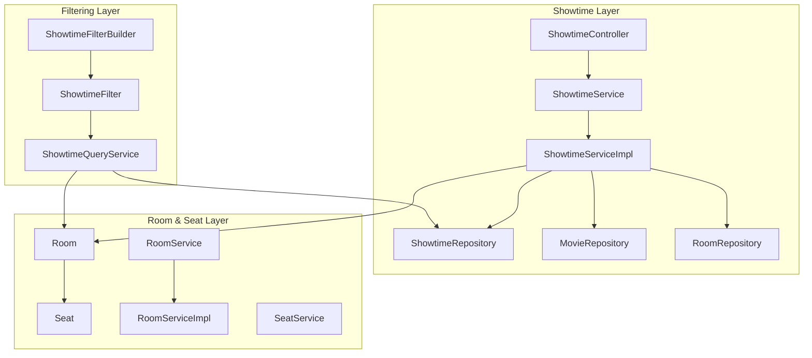
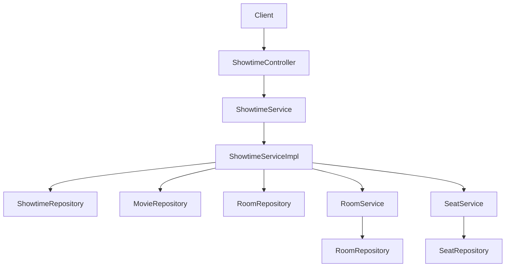
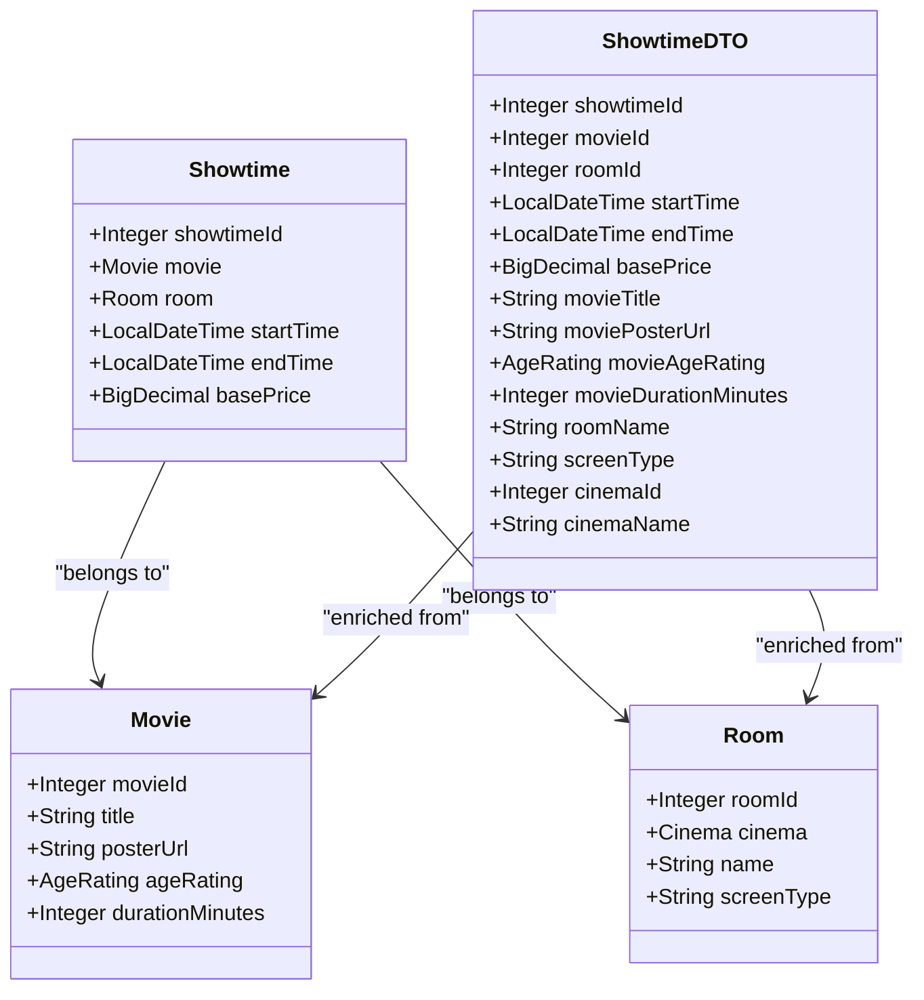
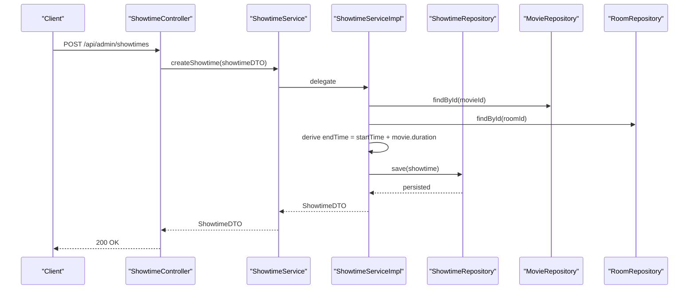
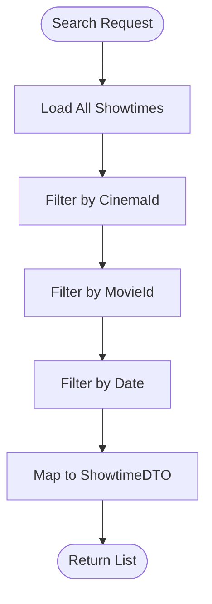
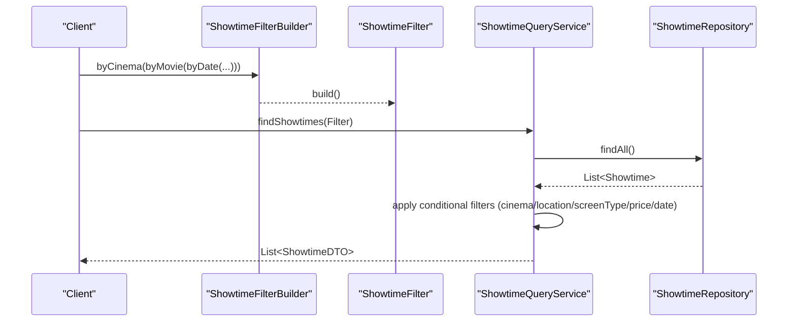
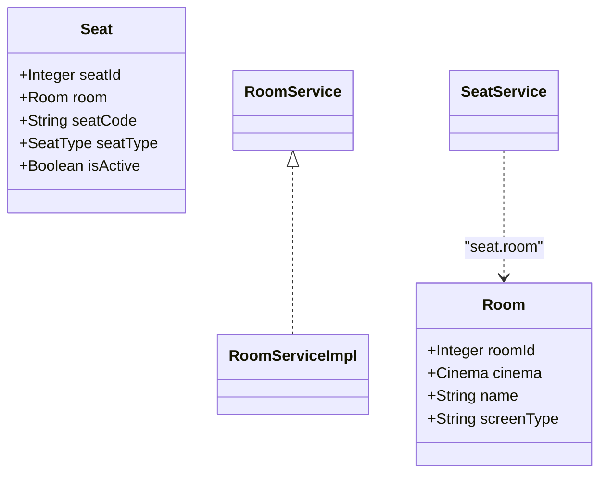
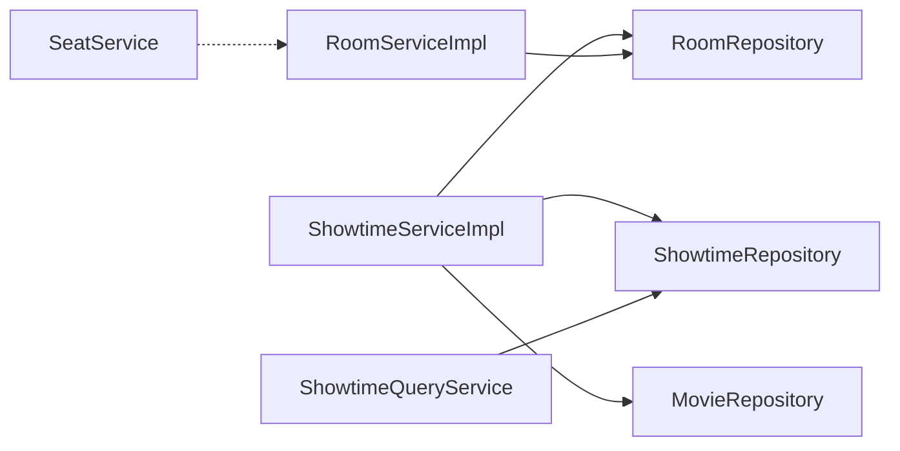

# Showtime Service

<cite>
**Referenced Files in This Document**
- [Showtime.java](file://backend/src/main/java/com/cinema/booking/entities/Showtime.java)
- [ShowtimeDTO.java](file://backend/src/main/java/com/cinema/booking/dtos/ShowtimeDTO.java)
- [ShowtimeController.java](file://backend/src/main/java/com/cinema/booking/controllers/ShowtimeController.java)
- [ShowtimeService.java](file://backend/src/main/java/com/cinema/booking/services/ShowtimeService.java)
- [ShowtimeServiceImpl.java](file://backend/src/main/java/com/cinema/booking/services/impl/ShowtimeServiceImpl.java)
- [ShowtimeRepository.java](file://backend/src/main/java/com/cinema/booking/repositories/ShowtimeRepository.java)
- [ShowtimeFilter.java](file://backend/src/main/java/com/cinema/booking/services/builder/filter/ShowtimeFilter.java)
- [ShowtimeFilterBuilder.java](file://backend/src/main/java/com/cinema/booking/services/builder/filter/ShowtimeFilterBuilder.java)
- [ShowtimeQueryService.java](file://backend/src/main/java/com/cinema/booking/services/builder/filter/ShowtimeQueryService.java)
- [Room.java](file://backend/src/main/java/com/cinema/booking/entities/Room.java)
- [Seat.java](file://backend/src/main/java/com/cinema/booking/entities/Seat.java)
- [RoomService.java](file://backend/src/main/java/com/cinema/booking/services/RoomService.java)
- [RoomServiceImpl.java](file://backend/src/main/java/com/cinema/booking/services/impl/RoomServiceImpl.java)
- [SeatService.java](file://backend/src/main/java/com/cinema/booking/services/SeatService.java)
</cite>

## Update Summary
**Changes Made**
- Updated filtering section to reflect removal of specification pattern
- Revised searchPublicShowtimes implementation to use direct stream filtering
- Updated architecture overview to reflect simplified conditional filtering approach
- Removed references to ShowtimeSpecifications class
- Updated performance considerations to reflect in-memory filtering approach

## Table of Contents
1. [Introduction](#introduction)
2. [Project Structure](#project-structure)
3. [Core Components](#core-components)
4. [Architecture Overview](#architecture-overview)
5. [Detailed Component Analysis](#detailed-component-analysis)
6. [Dependency Analysis](#dependency-analysis)
7. [Performance Considerations](#performance-considerations)
8. [Troubleshooting Guide](#troubleshooting-guide)
9. [Conclusion](#conclusion)
10. [Appendices](#appendices)

## Introduction
This document describes the Showtime Service responsible for managing movie showtimes, including creation, modification, deletion, and querying with flexible filters. It explains how showtimes are validated against room capacities, how schedule conflicts are detected, and how the service integrates with room and seat management for capacity tracking. It also covers date/time handling, timezone considerations, and error handling for overlapping schedules and invalid configurations.

**Updated** The service now uses a simplified conditional filtering approach instead of the previous specification pattern, with filtering logic implemented through direct stream operations for improved simplicity and maintainability.

## Project Structure
The Showtime Service spans entity, DTO, controller, service, and repository layers. Room and seat entities support room capacity and seat allocation. Filtering is implemented via a streamlined approach:
- Direct stream filtering operations for in-memory filtering across joined entities
- Simplified conditional filtering approach replacing the previous specification pattern

**Diagram sources**
- [ShowtimeController.java:1-54](file://backend/src/main/java/com/cinema/booking/controllers/ShowtimeController.java#L1-L54)
- [ShowtimeService.java:1-15](file://backend/src/main/java/com/cinema/booking/services/ShowtimeService.java#L1-L15)
- [ShowtimeServiceImpl.java:1-125](file://backend/src/main/java/com/cinema/booking/services/impl/ShowtimeServiceImpl.java#L1-L125)
- [ShowtimeRepository.java:1-15](file://backend/src/main/java/com/cinema/booking/repositories/ShowtimeRepository.java#L1-L15)
- [ShowtimeFilterBuilder.java:1-63](file://backend/src/main/java/com/cinema/booking/services/builder/filter/ShowtimeFilterBuilder.java#L1-L63)
- [ShowtimeFilter.java:1-42](file://backend/src/main/java/com/cinema/booking/services/builder/filter/ShowtimeFilter.java#L1-L42)
- [ShowtimeQueryService.java:1-109](file://backend/src/main/java/com/cinema/booking/services/builder/filter/ShowtimeQueryService.java#L1-L109)
- [Room.java:1-28](file://backend/src/main/java/com/cinema/booking/entities/Room.java#L1-L28)
- [Seat.java:1-34](file://backend/src/main/java/com/cinema/booking/entities/Seat.java#L1-L34)
- [RoomService.java:1-14](file://backend/src/main/java/com/cinema/booking/services/RoomService.java#L1-L14)
- [RoomServiceImpl.java:1-89](file://backend/src/main/java/com/cinema/booking/services/impl/RoomServiceImpl.java#L1-L89)
- [SeatService.java:1-15](file://backend/src/main/java/com/cinema/booking/services/SeatService.java#L1-L15)

**Section sources**
- [ShowtimeController.java:1-54](file://backend/src/main/java/com/cinema/booking/controllers/ShowtimeController.java#L1-L54)
- [ShowtimeServiceImpl.java:1-125](file://backend/src/main/java/com/cinema/booking/services/impl/ShowtimeServiceImpl.java#L1-L125)
- [ShowtimeFilterBuilder.java:1-63](file://backend/src/main/java/com/cinema/booking/services/builder/filter/ShowtimeFilterBuilder.java#L1-L63)
- [ShowtimeQueryService.java:1-109](file://backend/src/main/java/com/cinema/booking/services/builder/filter/ShowtimeQueryService.java#L1-L109)
- [RoomServiceImpl.java:1-89](file://backend/src/main/java/com/cinema/booking/services/impl/RoomServiceImpl.java#L1-L89)

## Core Components
- Showtime entity defines movie, room, start/end times, and base price.
- ShowtimeDTO enriches showtime data with movie and room metadata for display.
- ShowtimeController exposes admin endpoints for CRUD operations and public search.
- ShowtimeService and ShowtimeServiceImpl implement business logic, mapping, and filtering.
- ShowtimeRepository extends JPA repositories with specification execution and a room-time range query.
- ShowtimeFilter and ShowtimeFilterBuilder define an immutable filter product and fluent builder.
- ShowtimeQueryService applies the filter to in-memory streams after loading all showtimes.
- Room and Seat entities model rooms and seats; RoomService and SeatService manage room operations and seat inventory.

Key responsibilities:
- Create showtimes with derived end time from movie duration.
- Validate room existence during create/update.
- Search showtimes by cinema, movie, and date using direct stream filtering.
- Filter showtimes by multiple criteria (location, screen type, price range) using the Builder/Filter pattern.
- Integrate with room management for room selection and seat allocation.

**Section sources**
- [Showtime.java:1-38](file://backend/src/main/java/com/cinema/booking/entities/Showtime.java#L1-L38)
- [ShowtimeDTO.java:1-38](file://backend/src/main/java/com/cinema/booking/dtos/ShowtimeDTO.java#L1-L38)
- [ShowtimeController.java:1-54](file://backend/src/main/java/com/cinema/booking/controllers/ShowtimeController.java#L1-L54)
- [ShowtimeService.java:1-15](file://backend/src/main/java/com/cinema/booking/services/ShowtimeService.java#L1-L15)
- [ShowtimeServiceImpl.java:1-125](file://backend/src/main/java/com/cinema/booking/services/impl/ShowtimeServiceImpl.java#L1-L125)
- [ShowtimeRepository.java:1-15](file://backend/src/main/java/com/cinema/booking/repositories/ShowtimeRepository.java#L1-L15)
- [ShowtimeFilter.java:1-42](file://backend/src/main/java/com/cinema/booking/services/builder/filter/ShowtimeFilter.java#L1-L42)
- [ShowtimeFilterBuilder.java:1-63](file://backend/src/main/java/com/cinema/booking/services/builder/filter/ShowtimeFilterBuilder.java#L1-L63)
- [ShowtimeQueryService.java:1-109](file://backend/src/main/java/com/cinema/booking/services/builder/filter/ShowtimeQueryService.java#L1-L109)
- [Room.java:1-28](file://backend/src/main/java/com/cinema/booking/entities/Room.java#L1-L28)
- [Seat.java:1-34](file://backend/src/main/java/com/cinema/booking/entities/Seat.java#L1-L34)
- [RoomService.java:1-14](file://backend/src/main/java/com/cinema/booking/services/RoomService.java#L1-L14)
- [RoomServiceImpl.java:1-89](file://backend/src/main/java/com/cinema/booking/services/impl/RoomServiceImpl.java#L1-L89)
- [SeatService.java:1-15](file://backend/src/main/java/com/cinema/booking/services/SeatService.java#L1-L15)

## Architecture Overview
The Showtime Service follows layered architecture:
- Presentation: ShowtimeController handles HTTP requests.
- Application: ShowtimeService defines contracts; ShowtimeServiceImpl implements logic.
- Persistence: ShowtimeRepository executes JPA queries and specifications.
- Filtering: Simplified conditional filtering approach replacing the previous specification pattern.
- Domain: Entities and services for rooms/seats integrate capacity and seat allocation.

**Updated** The filtering architecture now uses direct stream operations with conditional checks instead of JPA Specifications, providing a more straightforward approach to filtering showtimes.

**Diagram sources**
- [ShowtimeController.java:1-54](file://backend/src/main/java/com/cinema/booking/controllers/ShowtimeController.java#L1-L54)
- [ShowtimeService.java:1-15](file://backend/src/main/java/com/cinema/booking/services/ShowtimeService.java#L1-L15)
- [ShowtimeServiceImpl.java:1-125](file://backend/src/main/java/com/cinema/booking/services/impl/ShowtimeServiceImpl.java#L1-L125)
- [ShowtimeRepository.java:1-15](file://backend/src/main/java/com/cinema/booking/repositories/ShowtimeRepository.java#L1-L15)
- [RoomServiceImpl.java:1-89](file://backend/src/main/java/com/cinema/booking/services/impl/RoomServiceImpl.java#L1-L89)
- [SeatService.java:1-15](file://backend/src/main/java/com/cinema/booking/services/SeatService.java#L1-L15)

## Detailed Component Analysis

### Showtime Entity and DTO
- Showtime links to Movie and Room and stores start/end times and base price.
- ShowtimeDTO enriches display data (movie title/poster/age rating/duration, room/screen type, cinema info).

**Diagram sources**
- [Showtime.java:1-38](file://backend/src/main/java/com/cinema/booking/entities/Showtime.java#L1-L38)
- [ShowtimeDTO.java:1-38](file://backend/src/main/java/com/cinema/booking/dtos/ShowtimeDTO.java#L1-L38)
- [Room.java:1-28](file://backend/src/main/java/com/cinema/booking/entities/Room.java#L1-L28)

**Section sources**
- [Showtime.java:1-38](file://backend/src/main/java/com/cinema/booking/entities/Showtime.java#L1-L38)
- [ShowtimeDTO.java:1-38](file://backend/src/main/java/com/cinema/booking/dtos/ShowtimeDTO.java#L1-L38)

### Showtime CRUD Operations
- Create: Validates movie and room existence, derives end time from movie duration, persists, and returns enriched DTO.
- Update: Same validations and end time derivation; updates existing record.
- Delete: Removes by ID.
- Retrieve: By ID and list all.

**Diagram sources**
- [ShowtimeController.java:1-54](file://backend/src/main/java/com/cinema/booking/controllers/ShowtimeController.java#L1-L54)
- [ShowtimeServiceImpl.java:71-89](file://backend/src/main/java/com/cinema/booking/services/impl/ShowtimeServiceImpl.java#L71-L89)
- [ShowtimeRepository.java:1-15](file://backend/src/main/java/com/cinema/booking/repositories/ShowtimeRepository.java#L1-L15)

**Section sources**
- [ShowtimeController.java:35-45](file://backend/src/main/java/com/cinema/booking/controllers/ShowtimeController.java#L35-L45)
- [ShowtimeServiceImpl.java:71-108](file://backend/src/main/java/com/cinema/booking/services/impl/ShowtimeServiceImpl.java#L71-L108)

### Schedule Conflict Detection and Room Capacity Validation
- Room capacity validation: Not enforced in the current implementation. Room capacity is not part of ShowtimeServiceImpl logic.
- Schedule conflict detection: The repository provides a method to query overlapping showtimes for a room within a time window. This method can be used to detect conflicts during create/update.

Recommendations:
- During create/update, call the repository's time-range query for the target room and check overlap with the proposed start/end times.
- If overlap exists, throw a validation error indicating a schedule conflict.

Current repository capability:
- Room-based time-range query is available for detecting potential conflicts.

**Section sources**
- [ShowtimeRepository.java:11-15](file://backend/src/main/java/com/cinema/booking/repositories/ShowtimeRepository.java#L11-L15)
- [ShowtimeServiceImpl.java:71-108](file://backend/src/main/java/com/cinema/booking/services/impl/ShowtimeServiceImpl.java#L71-L108)

### Filtering and Searching with Direct Stream Filtering
**Updated** The filtering logic has been refactored from JPA Specifications to direct stream filtering operations for improved simplicity and maintainability.

- Direct stream filtering supports cinema, movie, and date filters. Used by the public search endpoint.
- The implementation uses conditional filtering with stream operations and null checks.

**Diagram sources**
- [ShowtimeServiceImpl.java:113-123](file://backend/src/main/java/com/cinema/booking/services/impl/ShowtimeServiceImpl.java#L113-L123)

**Section sources**
- [ShowtimeServiceImpl.java:113-123](file://backend/src/main/java/com/cinema/booking/services/impl/ShowtimeServiceImpl.java#L113-L123)

### Filtering and Searching with Builder/Filter Pattern
- ShowtimeFilterBuilder constructs an immutable ShowtimeFilter with optional criteria (cinema, movie, location, date, screen type, price range).
- ShowtimeQueryService applies these filters to an in-memory stream of all showtimes using conditional filtering operations.

**Diagram sources**
- [ShowtimeFilterBuilder.java:1-63](file://backend/src/main/java/com/cinema/booking/services/builder/filter/ShowtimeFilterBuilder.java#L1-L63)
- [ShowtimeFilter.java:1-42](file://backend/src/main/java/com/cinema/booking/services/builder/filter/ShowtimeFilter.java#L1-L42)
- [ShowtimeQueryService.java:33-81](file://backend/src/main/java/com/cinema/booking/services/builder/filter/ShowtimeQueryService.java#L33-L81)

**Section sources**
- [ShowtimeFilterBuilder.java:1-63](file://backend/src/main/java/com/cinema/booking/services/builder/filter/ShowtimeFilterBuilder.java#L1-L63)
- [ShowtimeFilter.java:1-42](file://backend/src/main/java/com/cinema/booking/services/builder/filter/ShowtimeFilter.java#L1-L42)
- [ShowtimeQueryService.java:1-109](file://backend/src/main/java/com/cinema/booking/services/builder/filter/ShowtimeQueryService.java#L1-L109)

### Room Management and Seat Allocation Integration
- RoomService and RoomServiceImpl handle room CRUD and linking rooms to cinemas.
- SeatService manages seats per room; seats are linked to rooms and seat types.
- ShowtimeServiceImpl validates room existence during showtime creation/update but does not enforce capacity.

**Diagram sources**
- [Room.java:1-28](file://backend/src/main/java/com/cinema/booking/entities/Room.java#L1-L28)
- [Seat.java:1-34](file://backend/src/main/java/com/cinema/booking/entities/Seat.java#L1-L34)
- [RoomService.java:1-14](file://backend/src/main/java/com/cinema/booking/services/RoomService.java#L1-L14)
- [RoomServiceImpl.java:1-89](file://backend/src/main/java/com/cinema/booking/services/impl/RoomServiceImpl.java#L1-L89)
- [SeatService.java:1-15](file://backend/src/main/java/com/cinema/booking/services/SeatService.java#L1-L15)

**Section sources**
- [RoomServiceImpl.java:1-89](file://backend/src/main/java/com/cinema/booking/services/impl/RoomServiceImpl.java#L1-L89)
- [SeatService.java:1-15](file://backend/src/main/java/com/cinema/booking/services/SeatService.java#L1-L15)

### Showtime Availability Checking, Date/Time Validation, and Timezone Handling
- End time is derived from start time plus movie duration; no explicit timezone conversion is performed in the service.
- Date-only filtering uses local date boundaries; time zone handling depends on client-server time zone alignment.
- Recommendations:
  - Normalize start/end times to UTC at the boundary (controller/service) if cross-timezone support is required.
  - Validate that start time is not in the past and that end time is after start time.

### Examples

- Showtime CRUD operations
  - Create: POST to /api/admin/showtimes with ShowtimeDTO containing movieId, roomId, startTime, basePrice.
  - Update: PUT to /api/admin/showtimes/{id} with updated ShowtimeDTO.
  - Delete: DELETE to /api/admin/showtimes/{id}.
  - Retrieve: GET to /api/admin/showtimes and GET to /api/admin/showtimes/{id}.

- Search queries with filters
  - Direct stream filtering search: searchPublicShowtimes(cinemaId, movieId, date) uses conditional filtering on loaded showtimes.
  - In-memory filter search: use ShowtimeFilterBuilder to compose filters and call ShowtimeQueryService.findShowtimes.

- Room capacity management
  - Rooms are managed via RoomService; seats are managed via SeatService. Capacity checks are not currently integrated into showtime creation.

**Section sources**
- [ShowtimeController.java:23-52](file://backend/src/main/java/com/cinema/booking/controllers/ShowtimeController.java#L23-L52)
- [ShowtimeServiceImpl.java:113-123](file://backend/src/main/java/com/cinema/booking/services/impl/ShowtimeServiceImpl.java#L113-L123)
- [ShowtimeFilterBuilder.java:10-16](file://backend/src/main/java/com/cinema/booking/services/builder/filter/ShowtimeFilterBuilder.java#L10-L16)
- [ShowtimeQueryService.java:33-81](file://backend/src/main/java/com/cinema/booking/services/builder/filter/ShowtimeQueryService.java#L33-L81)
- [RoomServiceImpl.java:56-82](file://backend/src/main/java/com/cinema/booking/services/impl/RoomServiceImpl.java#L56-L82)
- [SeatService.java:1-15](file://backend/src/main/java/com/cinema/booking/services/SeatService.java#L1-L15)

## Dependency Analysis
- ShowtimeServiceImpl depends on ShowtimeRepository, MovieRepository, RoomRepository, and uses direct stream filtering for search operations.
- ShowtimeQueryService depends on ShowtimeRepository and applies in-memory filters using conditional operations.
- RoomService and SeatService operate independently but integrate conceptually with showtime room assignments.

**Updated** The dependency graph reflects the removal of specification pattern dependencies and the adoption of direct stream filtering.

**Diagram sources**
- [ShowtimeServiceImpl.java:1-125](file://backend/src/main/java/com/cinema/booking/services/impl/ShowtimeServiceImpl.java#L1-L125)
- [ShowtimeRepository.java:1-15](file://backend/src/main/java/com/cinema/booking/repositories/ShowtimeRepository.java#L1-L15)
- [RoomServiceImpl.java:1-89](file://backend/src/main/java/com/cinema/booking/services/impl/RoomServiceImpl.java#L1-L89)
- [SeatService.java:1-15](file://backend/src/main/java/com/cinema/booking/services/SeatService.java#L1-L15)

**Section sources**
- [ShowtimeServiceImpl.java:1-125](file://backend/src/main/java/com/cinema/booking/services/impl/ShowtimeServiceImpl.java#L1-L125)
- [ShowtimeQueryService.java:1-109](file://backend/src/main/java/com/cinema/booking/services/builder/filter/ShowtimeQueryService.java#L1-L109)

## Performance Considerations
**Updated** Performance characteristics have changed with the removal of specification pattern:

- Direct stream filtering via ShowtimeQueryService loads all showtimes; consider limiting scope or adding pagination for large datasets.
- The simplified conditional filtering approach reduces complexity but may have higher memory usage for large datasets.
- Room-time overlap checks should leverage the existing repository method to avoid redundant scans.
- Consider implementing database-level filtering for better performance with large datasets.

## Troubleshooting Guide
Common issues and resolutions:
- Showtime not found: Ensure the showtimeId exists; otherwise, a runtime exception is thrown.
- Movie not found: Validate movieId before creating/updating showtime.
- Room not found: Validate roomId before creating/updating showtime.
- Overlapping schedule: Detect overlaps using the room-time range query; resolve by adjusting times or room assignment.
- Invalid showtime configuration: Verify that start time is not in the past and end time is after start time.

**Section sources**
- [ShowtimeServiceImpl.java:65-68](file://backend/src/main/java/com/cinema/booking/services/impl/ShowtimeServiceImpl.java#L65-L68)
- [ShowtimeServiceImpl.java:73-76](file://backend/src/main/java/com/cinema/booking/services/impl/ShowtimeServiceImpl.java#L73-L76)
- [ShowtimeRepository.java:13](file://backend/src/main/java/com/cinema/booking/repositories/ShowtimeRepository.java#L13)

## Conclusion
The Showtime Service provides robust CRUD operations for showtimes, integrates with room management, and offers filtering capabilities through a simplified conditional filtering approach. The removal of the specification pattern has resulted in a more straightforward implementation using direct stream operations, while maintaining the flexibility of the Builder/Filter pattern for complex queries. Room capacity validation and schedule conflict detection are not yet implemented in the service and should be added to ensure operational correctness. Timezone handling and availability checks can be improved with explicit normalization and validation.

## Appendices

### API Endpoints Summary
- GET /api/admin/showtimes
- GET /api/admin/showtimes/{id}
- POST /api/admin/showtimes
- PUT /api/admin/showtimes/{id}
- DELETE /api/admin/showtimes/{id}

**Section sources**
- [ShowtimeController.java:23-52](file://backend/src/main/java/com/cinema/booking/controllers/ShowtimeController.java#L23-L52)