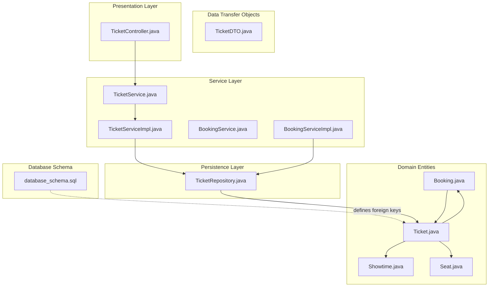
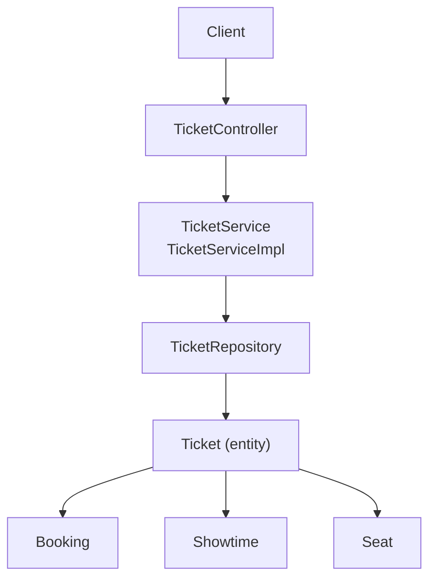
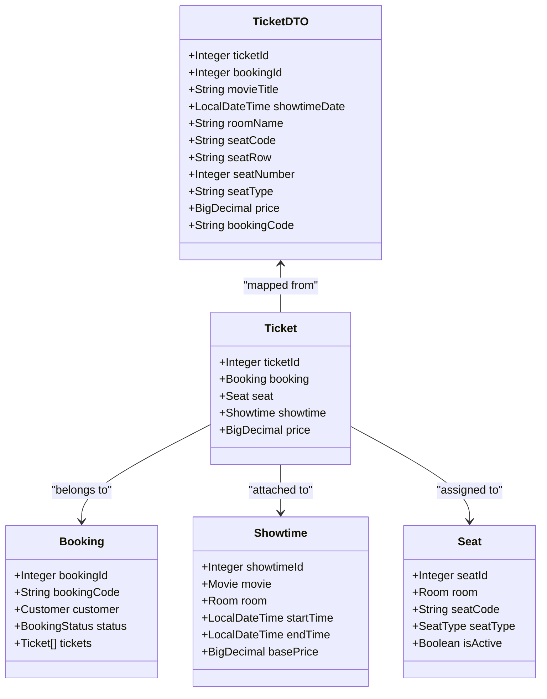
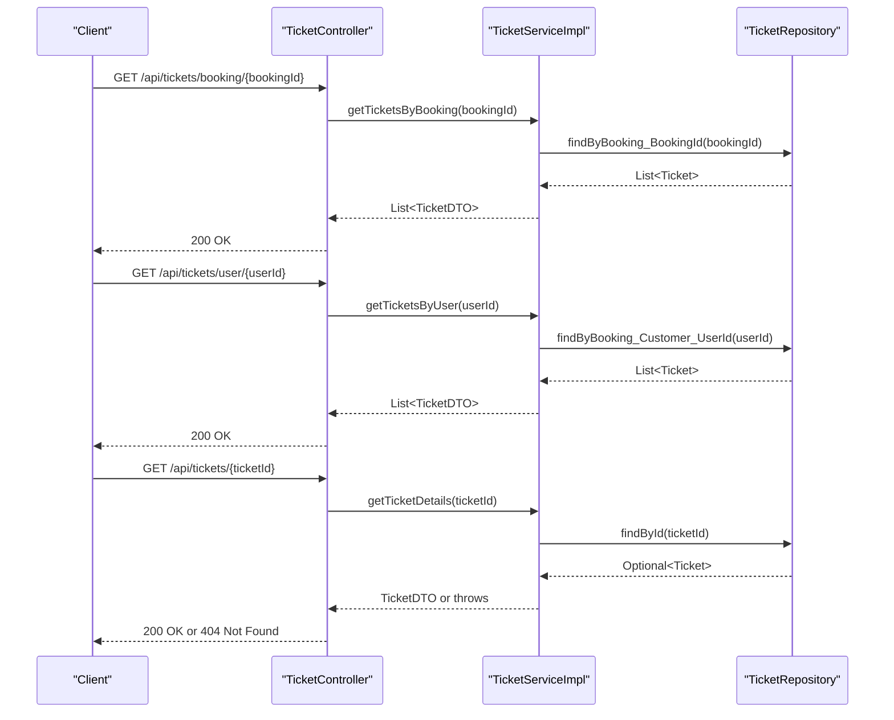
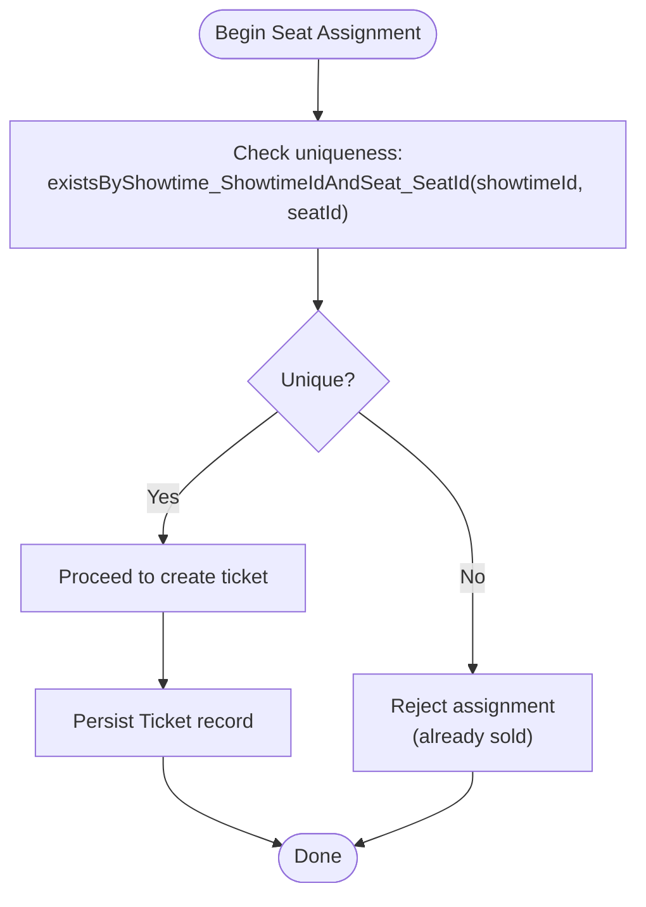
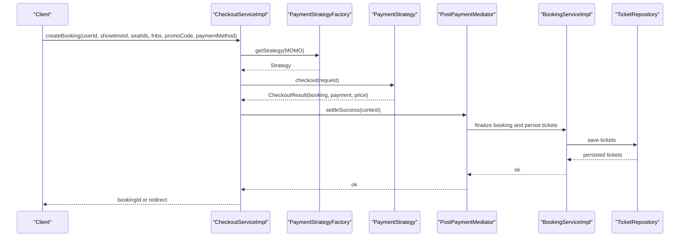
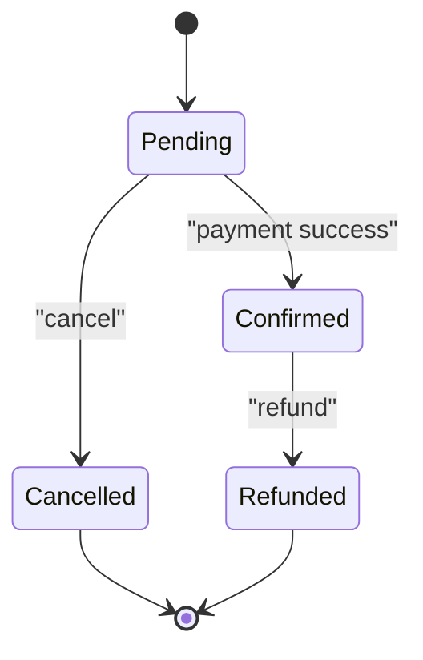
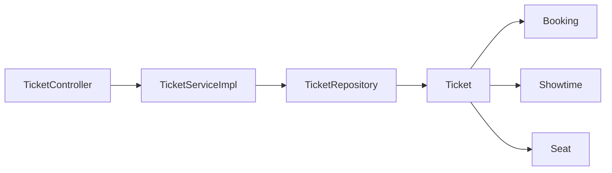

# Ticket Service

<cite>
**Referenced Files in This Document**
- [Ticket.java](file://backend/src/main/java/com/cinema/booking/entities/Ticket.java)
- [TicketDTO.java](file://backend/src/main/java/com/cinema/booking/dtos/TicketDTO.java)
- [TicketService.java](file://backend/src/main/java/com/cinema/booking/services/TicketService.java)
- [TicketServiceImpl.java](file://backend/src/main/java/com/cinema/booking/services/impl/TicketServiceImpl.java)
- [TicketController.java](file://backend/src/main/java/com/cinema/booking/controllers/TicketController.java)
- [TicketRepository.java](file://backend/src/main/java/com/cinema/booking/repositories/TicketRepository.java)
- [Booking.java](file://backend/src/main/java/com/cinema/booking/entities/Booking.java)
- [Seat.java](file://backend/src/main/java/com/cinema/booking/entities/Seat.java)
- [Showtime.java](file://backend/src/main/java/com/cinema/booking/entities/Showtime.java)
- [database_schema.sql](file://database_schema.sql)
- [BookingService.java](file://backend/src/main/java/com/cinema/booking/services/BookingService.java)
- [BookingServiceImpl.java](file://backend/src/main/java/com/cinema/booking/services/impl/BookingServiceImpl.java)
- [CheckoutService.java](file://backend/src/main/java/com/cinema/booking/services/CheckoutService.java)
- [CheckoutServiceImpl.java](file://backend/src/main/java/com/cinema/booking/services/impl/CheckoutServiceImpl.java)
</cite>

## Table of Contents
1. [Introduction](#introduction)
2. [Project Structure](#project-structure)
3. [Core Components](#core-components)
4. [Architecture Overview](#architecture-overview)
5. [Detailed Component Analysis](#detailed-component-analysis)
6. [Dependency Analysis](#dependency-analysis)
7. [Performance Considerations](#performance-considerations)
8. [Troubleshooting Guide](#troubleshooting-guide)
9. [Conclusion](#conclusion)
10. [Appendices](#appendices)

## Introduction
This document describes the Ticket Service implementation in the cinema booking system. It explains how tickets are created, validated, looked up, and managed in relation to bookings. It also documents seat assignment validation, uniqueness checks, and integration points with the booking system. The focus is on practical understanding for developers and operators who need to implement or troubleshoot ticket-related workflows.

## Project Structure
The Ticket Service spans entity, DTO, repository, service, controller, and supporting domain models. The database schema defines foreign keys and constraints that enforce referential integrity for tickets.

**Diagram sources**
- [Ticket.java:1-38](file://backend/src/main/java/com/cinema/booking/entities/Ticket.java#L1-L38)
- [TicketDTO.java:1-28](file://backend/src/main/java/com/cinema/booking/dtos/TicketDTO.java#L1-L28)
- [TicketRepository.java:1-19](file://backend/src/main/java/com/cinema/booking/repositories/TicketRepository.java#L1-L19)
- [TicketService.java:1-12](file://backend/src/main/java/com/cinema/booking/services/TicketService.java#L1-L12)
- [TicketServiceImpl.java:1-81](file://backend/src/main/java/com/cinema/booking/services/impl/TicketServiceImpl.java#L1-L81)
- [TicketController.java:1-55](file://backend/src/main/java/com/cinema/booking/controllers/TicketController.java#L1-L55)
- [Booking.java:1-65](file://backend/src/main/java/com/cinema/booking/entities/Booking.java#L1-L65)
- [Showtime.java:1-38](file://backend/src/main/java/com/cinema/booking/entities/Showtime.java#L1-L38)
- [Seat.java:1-34](file://backend/src/main/java/com/cinema/booking/entities/Seat.java#L1-L34)
- [database_schema.sql:197-206](file://database_schema.sql#L197-L206)

**Section sources**
- [Ticket.java:1-38](file://backend/src/main/java/com/cinema/booking/entities/Ticket.java#L1-L38)
- [TicketDTO.java:1-28](file://backend/src/main/java/com/cinema/booking/dtos/TicketDTO.java#L1-L28)
- [TicketRepository.java:1-19](file://backend/src/main/java/com/cinema/booking/repositories/TicketRepository.java#L1-L19)
- [TicketService.java:1-12](file://backend/src/main/java/com/cinema/booking/services/TicketService.java#L1-L12)
- [TicketServiceImpl.java:1-81](file://backend/src/main/java/com/cinema/booking/services/impl/TicketServiceImpl.java#L1-L81)
- [TicketController.java:1-55](file://backend/src/main/java/com/cinema/booking/controllers/TicketController.java#L1-L55)
- [Booking.java:1-65](file://backend/src/main/java/com/cinema/booking/entities/Booking.java#L1-L65)
- [Showtime.java:1-38](file://backend/src/main/java/com/cinema/booking/entities/Showtime.java#L1-L38)
- [Seat.java:1-34](file://backend/src/main/java/com/cinema/booking/entities/Seat.java#L1-L34)
- [database_schema.sql:197-206](file://database_schema.sql#L197-L206)

## Core Components
- Ticket entity: Represents a single ticket linked to a booking, seat, and showtime with a price.
- Ticket DTO: Projection of ticket data for API responses, including derived seat row/number and movie/showtime info.
- Ticket repository: JPA repository with custom queries for seat uniqueness and counts.
- Ticket service: Business interface and implementation for ticket retrieval and deletion.
- Ticket controller: REST endpoints for ticket lookup and deletion.
- Booking integration: Tickets are part of a booking and are created via checkout/payment flows.

Key responsibilities:
- Lookup tickets by booking ID, user ID, and ticket ID.
- Convert entities to DTOs with seat parsing and defaults.
- Enforce uniqueness via repository constraints and seat-showtime pairing.
- Support deletion for staff validation scenarios.

**Section sources**
- [Ticket.java:1-38](file://backend/src/main/java/com/cinema/booking/entities/Ticket.java#L1-L38)
- [TicketDTO.java:1-28](file://backend/src/main/java/com/cinema/booking/dtos/TicketDTO.java#L1-L28)
- [TicketRepository.java:1-19](file://backend/src/main/java/com/cinema/booking/repositories/TicketRepository.java#L1-L19)
- [TicketService.java:1-12](file://backend/src/main/java/com/cinema/booking/services/TicketService.java#L1-L12)
- [TicketServiceImpl.java:1-81](file://backend/src/main/java/com/cinema/booking/services/impl/TicketServiceImpl.java#L1-L81)
- [TicketController.java:1-55](file://backend/src/main/java/com/cinema/booking/controllers/TicketController.java#L1-L55)
- [Booking.java:40-41](file://backend/src/main/java/com/cinema/booking/entities/Booking.java#L40-L41)

## Architecture Overview
The Ticket Service follows a layered architecture:
- Presentation: REST controller exposes endpoints for ticket queries and deletion.
- Service: Implements business logic for ticket retrieval and DTO conversion.
- Persistence: JPA repository encapsulates data access and custom queries.
- Domain: Entities define relationships and constraints enforced by the database.

**Diagram sources**
- [TicketController.java:1-55](file://backend/src/main/java/com/cinema/booking/controllers/TicketController.java#L1-L55)
- [TicketService.java:1-12](file://backend/src/main/java/com/cinema/booking/services/TicketService.java#L1-L12)
- [TicketServiceImpl.java:1-81](file://backend/src/main/java/com/cinema/booking/services/impl/TicketServiceImpl.java#L1-L81)
- [TicketRepository.java:1-19](file://backend/src/main/java/com/cinema/booking/repositories/TicketRepository.java#L1-L19)
- [Ticket.java:1-38](file://backend/src/main/java/com/cinema/booking/entities/Ticket.java#L1-L38)
- [Booking.java:1-65](file://backend/src/main/java/com/cinema/booking/entities/Booking.java#L1-L65)
- [Showtime.java:1-38](file://backend/src/main/java/com/cinema/booking/entities/Showtime.java#L1-L38)
- [Seat.java:1-34](file://backend/src/main/java/com/cinema/booking/entities/Seat.java#L1-L34)

## Detailed Component Analysis

### Ticket Entity and DTO
- Ticket entity links to Booking, Seat, and Showtime and stores the price at purchase time.
- TicketDTO aggregates movie/showtime/room/seat details and derives seat row and number from seat code.

**Diagram sources**
- [Ticket.java:1-38](file://backend/src/main/java/com/cinema/booking/entities/Ticket.java#L1-L38)
- [Booking.java:1-65](file://backend/src/main/java/com/cinema/booking/entities/Booking.java#L1-L65)
- [Showtime.java:1-38](file://backend/src/main/java/com/cinema/booking/entities/Showtime.java#L1-L38)
- [Seat.java:1-34](file://backend/src/main/java/com/cinema/booking/entities/Seat.java#L1-L34)
- [TicketDTO.java:1-28](file://backend/src/main/java/com/cinema/booking/dtos/TicketDTO.java#L1-L28)

**Section sources**
- [Ticket.java:1-38](file://backend/src/main/java/com/cinema/booking/entities/Ticket.java#L1-L38)
- [TicketDTO.java:1-28](file://backend/src/main/java/com/cinema/booking/dtos/TicketDTO.java#L1-L28)

### Ticket Lookup and Deletion Endpoints
- GET /api/tickets/booking/{bookingId}: Returns all tickets associated with a booking.
- GET /api/tickets/user/{userId}: Returns all tickets for a user’s bookings.
- GET /api/tickets/{ticketId}: Returns details for a single ticket; returns 404 if not found.
- DELETE /api/tickets/{ticketId}: Deletes a ticket by ID; returns 404 if not found.

**Diagram sources**
- [TicketController.java:1-55](file://backend/src/main/java/com/cinema/booking/controllers/TicketController.java#L1-L55)
- [TicketServiceImpl.java:1-81](file://backend/src/main/java/com/cinema/booking/services/impl/TicketServiceImpl.java#L1-L81)
- [TicketRepository.java:1-19](file://backend/src/main/java/com/cinema/booking/repositories/TicketRepository.java#L1-L19)

**Section sources**
- [TicketController.java:1-55](file://backend/src/main/java/com/cinema/booking/controllers/TicketController.java#L1-L55)
- [TicketServiceImpl.java:19-46](file://backend/src/main/java/com/cinema/booking/services/impl/TicketServiceImpl.java#L19-L46)
- [TicketRepository.java:10-13](file://backend/src/main/java/com/cinema/booking/repositories/TicketRepository.java#L10-L13)

### Seat Assignment Validation and Uniqueness
Seat assignment validation and uniqueness are enforced at the persistence level:
- Unique constraint: A ticket exists for a given combination of showtime and seat.
- Count queries: Allow checking occupancy per seat and per showtime.

**Diagram sources**
- [TicketRepository.java:13-15](file://backend/src/main/java/com/cinema/booking/repositories/TicketRepository.java#L13-L15)
- [database_schema.sql:197-206](file://database_schema.sql#L197-L206)

**Section sources**
- [TicketRepository.java:10-18](file://backend/src/main/java/com/cinema/booking/repositories/TicketRepository.java#L10-L18)
- [database_schema.sql:197-206](file://database_schema.sql#L197-L206)

### Ticket Generation During Booking
Tickets are created as part of the checkout/payment flow. The checkout service orchestrates payment and delegates post-payment actions to a mediator that finalizes the booking and creates tickets. The booking service exposes a method to trigger ticket printing, which is part of the state machine for booking lifecycle.

**Diagram sources**
- [CheckoutService.java:1-12](file://backend/src/main/java/com/cinema/booking/services/CheckoutService.java#L1-L12)
- [CheckoutServiceImpl.java:44-64](file://backend/src/main/java/com/cinema/booking/services/impl/CheckoutServiceImpl.java#L44-L64)
- [BookingService.java:20-20](file://backend/src/main/java/com/cinema/booking/services/BookingService.java#L20-L20)
- [BookingServiceImpl.java:191-198](file://backend/src/main/java/com/cinema/booking/services/impl/BookingServiceImpl.java#L191-L198)
- [TicketRepository.java:1-19](file://backend/src/main/java/com/cinema/booking/repositories/TicketRepository.java#L1-L19)

**Section sources**
- [CheckoutService.java:1-12](file://backend/src/main/java/com/cinema/booking/services/CheckoutService.java#L1-L12)
- [CheckoutServiceImpl.java:44-64](file://backend/src/main/java/com/cinema/booking/services/impl/CheckoutServiceImpl.java#L44-L64)
- [BookingService.java:17-21](file://backend/src/main/java/com/cinema/booking/services/BookingService.java#L17-L21)
- [BookingServiceImpl.java:191-198](file://backend/src/main/java/com/cinema/booking/services/impl/BookingServiceImpl.java#L191-L198)

### Ticket Validation Mechanisms for Entry
While the Ticket Service does not expose a dedicated validation endpoint, the following mechanisms support entry validation:
- Seat uniqueness ensures a seat is not double-sold for the same showtime.
- Count queries enable quick checks for seat occupancy and showtime capacity.
- DTO projection provides structured data for scanning systems.

Operational guidance:
- Use GET /api/tickets/booking/{bookingId} to fetch tickets for a booking.
- Use GET /api/tickets/user/{userId} to fetch all tickets for a user.
- Use GET /api/tickets/{ticketId} to fetch a single ticket for verification.

**Section sources**
- [TicketRepository.java:15-17](file://backend/src/main/java/com/cinema/booking/repositories/TicketRepository.java#L15-L17)
- [TicketController.java:22-42](file://backend/src/main/java/com/cinema/booking/controllers/TicketController.java#L22-L42)
- [TicketServiceImpl.java:19-38](file://backend/src/main/java/com/cinema/booking/services/impl/TicketServiceImpl.java#L19-L38)

### Ticket Status Management and Booking Integration
- Tickets are owned by a Booking and reflect the seat and showtime at purchase time.
- The booking lifecycle (pending, confirmed, cancelled, refunded) is managed by a state machine; while ticket printing is part of the state transitions, the actual ticket records are created during payment settlement.
- The booking service aggregates tickets and related FnB items for reporting and display.

**Diagram sources**
- [Booking.java:46-56](file://backend/src/main/java/com/cinema/booking/entities/Booking.java#L46-L56)
- [BookingService.java:17-21](file://backend/src/main/java/com/cinema/booking/services/BookingService.java#L17-L21)
- [BookingServiceImpl.java:168-198](file://backend/src/main/java/com/cinema/booking/services/impl/BookingServiceImpl.java#L168-L198)

**Section sources**
- [Booking.java:33-56](file://backend/src/main/java/com/cinema/booking/entities/Booking.java#L33-L56)
- [BookingService.java:17-21](file://backend/src/main/java/com/cinema/booking/services/BookingService.java#L17-L21)
- [BookingServiceImpl.java:168-198](file://backend/src/main/java/com/cinema/booking/services/impl/BookingServiceImpl.java#L168-L198)

### Examples

#### Example 1: Ticket Creation Workflow (Checkout)
- Client initiates checkout with selected seats and payment method.
- Payment strategy processes the transaction.
- On success, the mediator finalizes the booking and persists tickets.
- The booking service aggregates tickets for downstream use.

**Section sources**
- [CheckoutServiceImpl.java:44-64](file://backend/src/main/java/com/cinema/booking/services/impl/CheckoutServiceImpl.java#L44-L64)
- [BookingServiceImpl.java:191-198](file://backend/src/main/java/com/cinema/booking/services/impl/BookingServiceImpl.java#L191-L198)

#### Example 2: Ticket Lookup by Booking ID
- Client calls GET /api/tickets/booking/{bookingId}.
- Controller delegates to service, which queries the repository by booking ID.
- Service maps entities to DTOs and returns the list.

**Section sources**
- [TicketController.java:22-26](file://backend/src/main/java/com/cinema/booking/controllers/TicketController.java#L22-L26)
- [TicketServiceImpl.java:20-24](file://backend/src/main/java/com/cinema/booking/services/impl/TicketServiceImpl.java#L20-L24)

#### Example 3: Ticket Lookup by User ID
- Client calls GET /api/tickets/user/{userId}.
- Controller delegates to service, which queries tickets via the booking’s customer ID.
- Service maps entities to DTOs and returns the list.

**Section sources**
- [TicketController.java:28-32](file://backend/src/main/java/com/cinema/booking/controllers/TicketController.java#L28-L32)
- [TicketServiceImpl.java:26-31](file://backend/src/main/java/com/cinema/booking/services/impl/TicketServiceImpl.java#L26-L31)

#### Example 4: Ticket Details Lookup
- Client calls GET /api/tickets/{ticketId}.
- Controller handles missing ticket by returning 404.
- Service throws if ticket not found; controller translates to 404.

**Section sources**
- [TicketController.java:34-42](file://backend/src/main/java/com/cinema/booking/controllers/TicketController.java#L34-L42)
- [TicketServiceImpl.java:33-38](file://backend/src/main/java/com/cinema/booking/services/impl/TicketServiceImpl.java#L33-L38)

#### Example 5: Ticket Deletion (Staff)
- Staff calls DELETE /api/tickets/{ticketId}.
- Controller delegates to service; service throws if not found.
- Controller returns 204 on success or 404 if not found.

**Section sources**
- [TicketController.java:44-53](file://backend/src/main/java/com/cinema/booking/controllers/TicketController.java#L44-L53)
- [TicketServiceImpl.java:40-46](file://backend/src/main/java/com/cinema/booking/services/impl/TicketServiceImpl.java#L40-L46)

## Dependency Analysis
The Ticket Service depends on:
- Entities for relationships and constraints.
- Repository for data access and custom queries.
- Service for business logic and DTO mapping.
- Controller for REST exposure.

**Diagram sources**
- [TicketController.java:1-55](file://backend/src/main/java/com/cinema/booking/controllers/TicketController.java#L1-L55)
- [TicketServiceImpl.java:1-81](file://backend/src/main/java/com/cinema/booking/services/impl/TicketServiceImpl.java#L1-L81)
- [TicketRepository.java:1-19](file://backend/src/main/java/com/cinema/booking/repositories/TicketRepository.java#L1-L19)
- [Ticket.java:1-38](file://backend/src/main/java/com/cinema/booking/entities/Ticket.java#L1-L38)
- [Booking.java:1-65](file://backend/src/main/java/com/cinema/booking/entities/Booking.java#L1-L65)
- [Showtime.java:1-38](file://backend/src/main/java/com/cinema/booking/entities/Showtime.java#L1-L38)
- [Seat.java:1-34](file://backend/src/main/java/com/cinema/booking/entities/Seat.java#L1-L34)

**Section sources**
- [TicketController.java:1-55](file://backend/src/main/java/com/cinema/booking/controllers/TicketController.java#L1-L55)
- [TicketServiceImpl.java:1-81](file://backend/src/main/java/com/cinema/booking/services/impl/TicketServiceImpl.java#L1-L81)
- [TicketRepository.java:1-19](file://backend/src/main/java/com/cinema/booking/repositories/TicketRepository.java#L1-L19)
- [Ticket.java:1-38](file://backend/src/main/java/com/cinema/booking/entities/Ticket.java#L1-L38)

## Performance Considerations
- DTO mapping extracts seat row and number from seat code; ensure seat codes follow the expected format to avoid parsing overhead.
- Repository queries use indexed foreign keys; keep filters selective to leverage database indexes.
- Batch operations for seat statuses rely on efficient collection mapping; avoid unnecessary conversions.

[No sources needed since this section provides general guidance]

## Troubleshooting Guide
Common issues and resolutions:
- Invalid ticket ID: Controller returns 404 Not Found when a ticket is not found; ensure the ID is correct and corresponds to an existing ticket.
- Duplicate ticket generation: The uniqueness constraint prevents duplicate tickets for the same seat and showtime; if a conflict occurs, verify seat selection and showtime pairing.
- Validation failures: Seat assignment validation rejects attempts when a seat is already sold for the given showtime; use seat status queries to prevent conflicts.

**Section sources**
- [TicketController.java:37-41](file://backend/src/main/java/com/cinema/booking/controllers/TicketController.java#L37-L41)
- [TicketServiceImpl.java:35-37](file://backend/src/main/java/com/cinema/booking/services/impl/TicketServiceImpl.java#L35-L37)
- [TicketRepository.java:13-13](file://backend/src/main/java/com/cinema/booking/repositories/TicketRepository.java#L13-L13)

## Conclusion
The Ticket Service provides robust ticket lookup, deletion, and integration with the booking system. Seat assignment validation and uniqueness constraints ensure reliable ticket issuance. While there is no explicit validation endpoint, the existing repository and DTO mechanisms support entry validation workflows. The checkout flow integrates ticket creation with payment settlement, aligning ticket ownership with booking lifecycle.

[No sources needed since this section summarizes without analyzing specific files]

## Appendices

### API Reference Summary
- GET /api/tickets/booking/{bookingId}: List tickets by booking ID.
- GET /api/tickets/user/{userId}: List tickets by user ID.
- GET /api/tickets/{ticketId}: Get ticket details; 404 if not found.
- DELETE /api/tickets/{ticketId}: Delete ticket; 404 if not found.

**Section sources**
- [TicketController.java:22-53](file://backend/src/main/java/com/cinema/booking/controllers/TicketController.java#L22-L53)