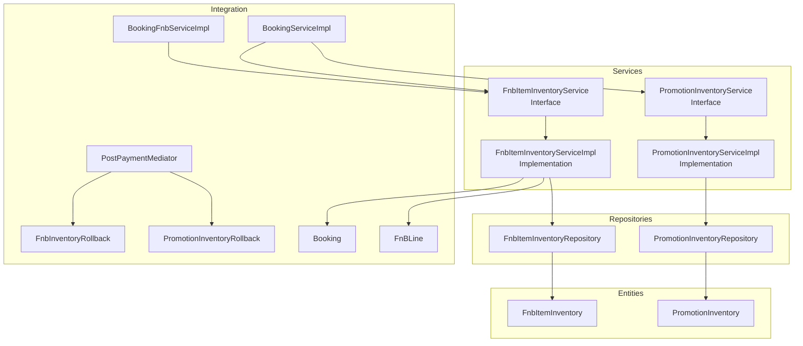
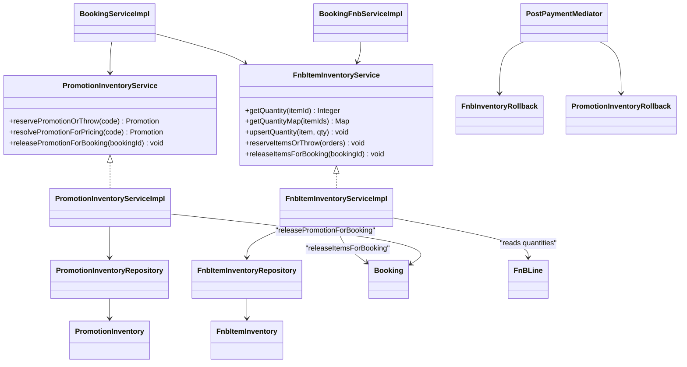
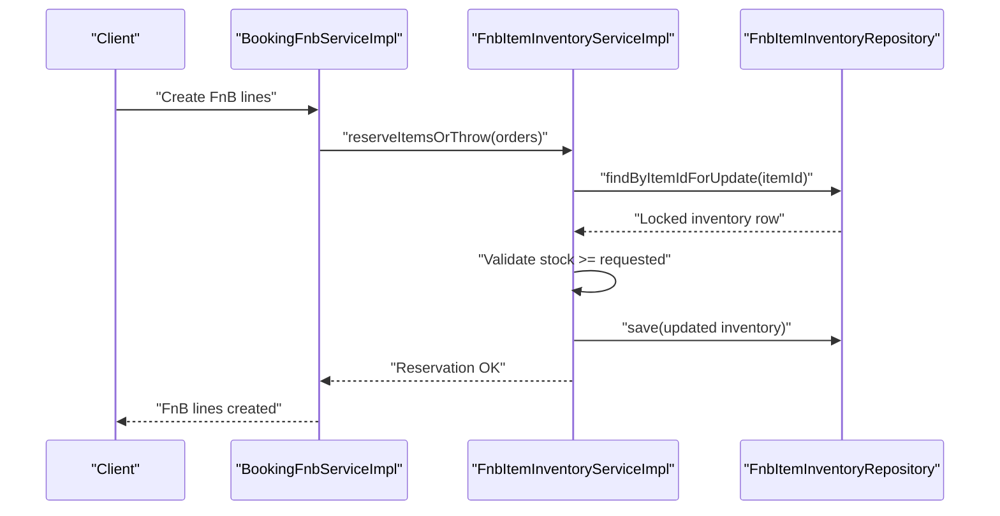
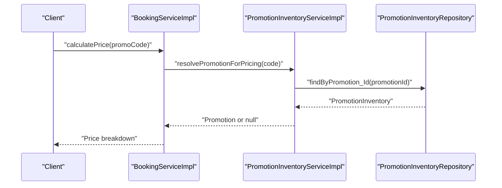
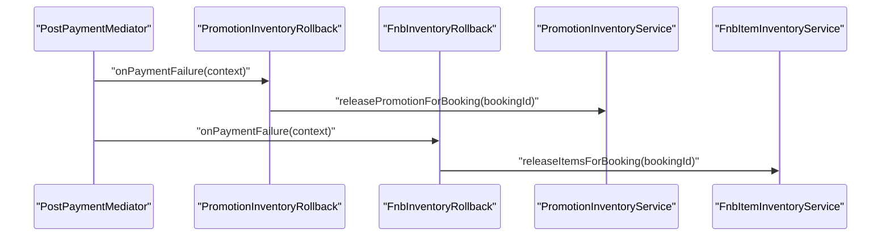
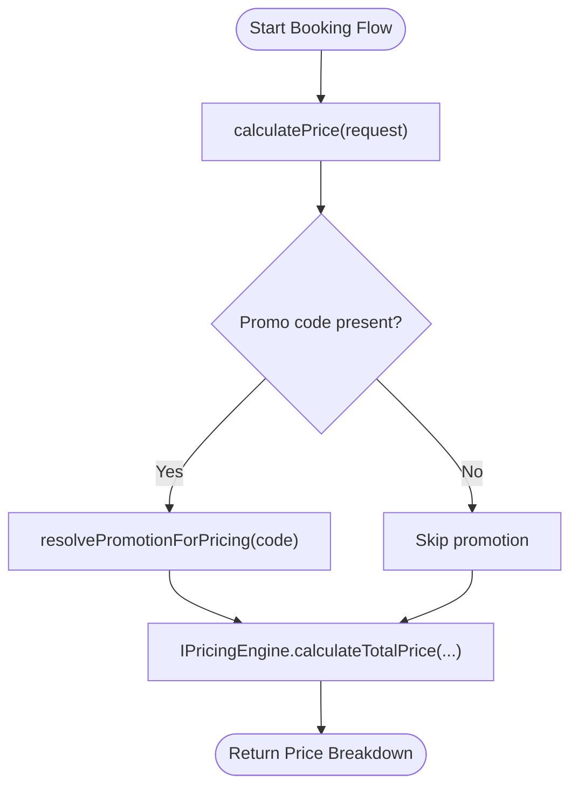
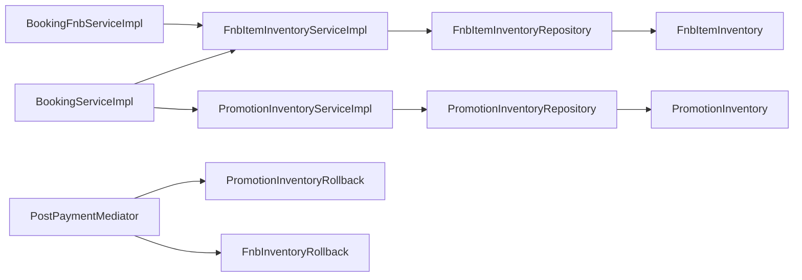

# Inventory Management Services

<cite>
**Referenced Files in This Document**
- [FnbItemInventoryServiceImpl.java](file://backend/src/main/java/com/cinema/booking/services/impl/FnbItemInventoryServiceImpl.java)
- [PromotionInventoryServiceImpl.java](file://backend/src/main/java/com/cinema/booking/services/impl/PromotionInventoryServiceImpl.java)
- [FnbItemInventoryService.java](file://backend/src/main/java/com/cinema/booking/services/FnbItemInventoryService.java)
- [PromotionInventoryService.java](file://backend/src/main/java/com/cinema/booking/services/PromotionInventoryService.java)
- [FnbItemInventory.java](file://backend/src/main/java/com/cinema/booking/entities/FnbItemInventory.java)
- [PromotionInventory.java](file://backend/src/main/java/com/cinema/booking/entities/PromotionInventory.java)
- [FnbItemInventoryRepository.java](file://backend/src/main/java/com/cinema/booking/repositories/FnbItemInventoryRepository.java)
- [PromotionInventoryRepository.java](file://backend/src/main/java/com/cinema/booking/repositories/PromotionInventoryRepository.java)
- [BookingServiceImpl.java](file://backend/src/main/java/com/cinema/booking/services/impl/BookingServiceImpl.java)
- [BookingFnbServiceImpl.java](file://backend/src/main/java/com/cinema/booking/services/impl/BookingFnbServiceImpl.java)
- [FnbInventoryRollback.java](file://backend/src/main/java/com/cinema/booking/patterns/mediator/FnbInventoryRollback.java)
- [PromotionInventoryRollback.java](file://backend/src/main/java/com/cinema/booking/patterns/mediator/PromotionInventoryRollback.java)
- [PostPaymentMediator.java](file://backend/src/main/java/com/cinema/booking/patterns/mediator/PostPaymentMediator.java)
- [Booking.java](file://backend/src/main/java/com/cinema/booking/entities/Booking.java)
- [FnBLine.java](file://backend/src/main/java/com/cinema/booking/entities/FnBLine.java)
- [BookingCalculationDTO.java](file://backend/src/main/java/com/cinema/booking/dtos/BookingCalculationDTO.java)
</cite>

## Table of Contents
1. [Introduction](#introduction)
2. [Project Structure](#project-structure)
3. [Core Components](#core-components)
4. [Architecture Overview](#architecture-overview)
5. [Detailed Component Analysis](#detailed-component-analysis)
6. [Dependency Analysis](#dependency-analysis)
7. [Performance Considerations](#performance-considerations)
8. [Troubleshooting Guide](#troubleshooting-guide)
9. [Conclusion](#conclusion)

## Introduction
This document explains the inventory management services for Food & Beverage (F&B) items and promotional campaigns within the booking system. It focuses on:
- Stock tracking and reservations for F&B items
- Availability management and rollback procedures
- Discount code management, usage tracking, and promotional campaign control
- Integration with booking services and seat locking mechanisms
- Examples of inventory validation, concurrent access handling, and stock level monitoring

## Project Structure
The inventory management functionality spans service interfaces, implementations, JPA entities, repositories, and integration points with the booking and payment flow.

**Diagram sources**
- [FnbItemInventoryService.java:1-21](file://backend/src/main/java/com/cinema/booking/services/FnbItemInventoryService.java#L1-L21)
- [PromotionInventoryService.java:1-12](file://backend/src/main/java/com/cinema/booking/services/PromotionInventoryService.java#L1-L12)
- [FnbItemInventoryServiceImpl.java:24-112](file://backend/src/main/java/com/cinema/booking/services/impl/FnbItemInventoryServiceImpl.java#L24-L112)
- [PromotionInventoryServiceImpl.java:18-88](file://backend/src/main/java/com/cinema/booking/services/impl/PromotionInventoryServiceImpl.java#L18-L88)
- [FnbItemInventory.java:12-28](file://backend/src/main/java/com/cinema/booking/entities/FnbItemInventory.java#L12-L28)
- [PromotionInventory.java:12-28](file://backend/src/main/java/com/cinema/booking/entities/PromotionInventory.java#L12-L28)
- [FnbItemInventoryRepository.java:14-19](file://backend/src/main/java/com/cinema/booking/repositories/FnbItemInventoryRepository.java#L14-L19)
- [PromotionInventoryRepository.java:14-19](file://backend/src/main/java/com/cinema/booking/repositories/PromotionInventoryRepository.java#L14-L19)
- [BookingServiceImpl.java:34-259](file://backend/src/main/java/com/cinema/booking/services/impl/BookingServiceImpl.java#L34-L259)
- [BookingFnbServiceImpl.java:19-80](file://backend/src/main/java/com/cinema/booking/services/impl/BookingFnbServiceImpl.java#L19-L80)
- [PostPaymentMediator.java:10-46](file://backend/src/main/java/com/cinema/booking/patterns/mediator/PostPaymentMediator.java#L10-L46)
- [FnbInventoryRollback.java:9-22](file://backend/src/main/java/com/cinema/booking/patterns/mediator/FnbInventoryRollback.java#L9-L22)
- [PromotionInventoryRollback.java:9-22](file://backend/src/main/java/com/cinema/booking/patterns/mediator/PromotionInventoryRollback.java#L9-L22)
- [Booking.java:16-48](file://backend/src/main/java/com/cinema/booking/entities/Booking.java#L16-L48)
- [FnBLine.java:17-38](file://backend/src/main/java/com/cinema/booking/entities/FnBLine.java#L17-L38)

**Section sources**
- [FnbItemInventoryService.java:1-21](file://backend/src/main/java/com/cinema/booking/services/FnbItemInventoryService.java#L1-L21)
- [PromotionInventoryService.java:1-12](file://backend/src/main/java/com/cinema/booking/services/PromotionInventoryService.java#L1-L12)
- [FnbItemInventoryServiceImpl.java:24-112](file://backend/src/main/java/com/cinema/booking/services/impl/FnbItemInventoryServiceImpl.java#L24-L112)
- [PromotionInventoryServiceImpl.java:18-88](file://backend/src/main/java/com/cinema/booking/services/impl/PromotionInventoryServiceImpl.java#L18-L88)
- [FnbItemInventory.java:12-28](file://backend/src/main/java/com/cinema/booking/entities/FnbItemInventory.java#L12-L28)
- [PromotionInventory.java:12-28](file://backend/src/main/java/com/cinema/booking/entities/PromotionInventory.java#L12-L28)
- [FnbItemInventoryRepository.java:14-19](file://backend/src/main/java/com/cinema/booking/repositories/FnbItemInventoryRepository.java#L14-L19)
- [PromotionInventoryRepository.java:14-19](file://backend/src/main/java/com/cinema/booking/repositories/PromotionInventoryRepository.java#L14-L19)
- [BookingServiceImpl.java:34-259](file://backend/src/main/java/com/cinema/booking/services/impl/BookingServiceImpl.java#L34-L259)
- [BookingFnbServiceImpl.java:19-80](file://backend/src/main/java/com/cinema/booking/services/impl/BookingFnbServiceImpl.java#L19-L80)
- [PostPaymentMediator.java:10-46](file://backend/src/main/java/com/cinema/booking/patterns/mediator/PostPaymentMediator.java#L10-L46)
- [FnbInventoryRollback.java:9-22](file://backend/src/main/java/com/cinema/booking/patterns/mediator/FnbInventoryRollback.java#L9-L22)
- [PromotionInventoryRollback.java:9-22](file://backend/src/main/java/com/cinema/booking/patterns/mediator/PromotionInventoryRollback.java#L9-L22)
- [Booking.java:16-48](file://backend/src/main/java/com/cinema/booking/entities/Booking.java#L16-L48)
- [FnBLine.java:17-38](file://backend/src/main/java/com/cinema/booking/entities/FnBLine.java#L17-L38)

## Core Components
- FnbItemInventoryService and FnbItemInventoryServiceImpl
  - Provides methods to read stock quantities, upsert quantities, reserve F&B items, and release reserved items upon cancellation/refund.
  - Uses pessimistic locking via repository queries to prevent race conditions during concurrent reservations.
- PromotionInventoryService and PromotionInventoryServiceImpl
  - Manages discount code reservations, resolves promotions for pricing, and releases reservations on failure or cancellation.
  - Enforces validity checks (expiry) and usage limits per promotion.
- Entities and Repositories
  - FnbItemInventory and PromotionInventory encapsulate stock/usage counts with optimistic locking via @Version.
  - Repositories expose findById and pessimistic-locking queries for safe concurrent updates.
- Integration with Booking Services
  - BookingServiceImpl integrates promotion resolution and delegates F&B reservations to FnbItemInventoryService.
  - BookingFnbServiceImpl reserves F&B items when adding FnB lines to a booking.
  - Post-payment mediator triggers rollbacks on payment failure to restore inventory.

**Section sources**
- [FnbItemInventoryService.java:10-20](file://backend/src/main/java/com/cinema/booking/services/FnbItemInventoryService.java#L10-L20)
- [FnbItemInventoryServiceImpl.java:30-111](file://backend/src/main/java/com/cinema/booking/services/impl/FnbItemInventoryServiceImpl.java#L30-L111)
- [PromotionInventoryService.java:5-11](file://backend/src/main/java/com/cinema/booking/services/PromotionInventoryService.java#L5-L11)
- [PromotionInventoryServiceImpl.java:24-87](file://backend/src/main/java/com/cinema/booking/services/impl/PromotionInventoryServiceImpl.java#L24-L87)
- [FnbItemInventory.java:12-28](file://backend/src/main/java/com/cinema/booking/entities/FnbItemInventory.java#L12-L28)
- [PromotionInventory.java:12-28](file://backend/src/main/java/com/cinema/booking/entities/PromotionInventory.java#L12-L28)
- [FnbItemInventoryRepository.java:14-19](file://backend/src/main/java/com/cinema/booking/repositories/FnbItemInventoryRepository.java#L14-L19)
- [PromotionInventoryRepository.java:14-19](file://backend/src/main/java/com/cinema/booking/repositories/PromotionInventoryRepository.java#L14-L19)
- [BookingServiceImpl.java:134-149](file://backend/src/main/java/com/cinema/booking/services/impl/BookingServiceImpl.java#L134-L149)
- [BookingFnbServiceImpl.java:45-71](file://backend/src/main/java/com/cinema/booking/services/impl/BookingFnbServiceImpl.java#L45-L71)
- [PostPaymentMediator.java:35-45](file://backend/src/main/java/com/cinema/booking/patterns/mediator/PostPaymentMediator.java#L35-L45)

## Architecture Overview
The inventory management architecture follows a layered design:
- Service layer validates requests and coordinates with repositories.
- Repository layer performs pessimistic locking for atomic updates.
- Entity layer stores quantities and supports optimistic locking.
- Integration layer ensures reservations are released on failures or cancellations.

**Diagram sources**
- [FnbItemInventoryService.java:10-20](file://backend/src/main/java/com/cinema/booking/services/FnbItemInventoryService.java#L10-L20)
- [PromotionInventoryService.java:5-11](file://backend/src/main/java/com/cinema/booking/services/PromotionInventoryService.java#L5-L11)
- [FnbItemInventoryServiceImpl.java:24-112](file://backend/src/main/java/com/cinema/booking/services/impl/FnbItemInventoryServiceImpl.java#L24-L112)
- [PromotionInventoryServiceImpl.java:18-88](file://backend/src/main/java/com/cinema/booking/services/impl/PromotionInventoryServiceImpl.java#L18-L88)
- [FnbItemInventory.java:12-28](file://backend/src/main/java/com/cinema/booking/entities/FnbItemInventory.java#L12-L28)
- [PromotionInventory.java:12-28](file://backend/src/main/java/com/cinema/booking/entities/PromotionInventory.java#L12-L28)
- [FnbItemInventoryRepository.java:14-19](file://backend/src/main/java/com/cinema/booking/repositories/FnbItemInventoryRepository.java#L14-L19)
- [PromotionInventoryRepository.java:14-19](file://backend/src/main/java/com/cinema/booking/repositories/PromotionInventoryRepository.java#L14-L19)
- [BookingServiceImpl.java:34-259](file://backend/src/main/java/com/cinema/booking/services/impl/BookingServiceImpl.java#L34-L259)
- [BookingFnbServiceImpl.java:19-80](file://backend/src/main/java/com/cinema/booking/services/impl/BookingFnbServiceImpl.java#L19-L80)
- [PostPaymentMediator.java:10-46](file://backend/src/main/java/com/cinema/booking/patterns/mediator/PostPaymentMediator.java#L10-L46)
- [FnbInventoryRollback.java:9-22](file://backend/src/main/java/com/cinema/booking/patterns/mediator/FnbInventoryRollback.java#L9-L22)
- [PromotionInventoryRollback.java:9-22](file://backend/src/main/java/com/cinema/booking/patterns/mediator/PromotionInventoryRollback.java#L9-L22)
- [Booking.java:16-48](file://backend/src/main/java/com/cinema/booking/entities/Booking.java#L16-L48)
- [FnBLine.java:17-38](file://backend/src/main/java/com/cinema/booking/entities/FnBLine.java#L17-L38)

## Detailed Component Analysis

### FnbItemInventoryServiceImpl
Responsibilities:
- Retrieve current stock for single or multiple items
- Upsert stock quantities
- Reserve F&B items for a booking with validation and atomic decrement
- Release reserved items when a booking is canceled/refunded or on payment failure

Concurrency and safety:
- Uses pessimistic write locks on inventory rows to avoid race conditions during reserve/release
- Validates requested quantities against current stock and throws descriptive errors when insufficient

Stock depletion and rollback:
- On successful payment settlement, reservations remain decremented
- On payment failure or cancellation, inventory is restored via release methods

**Diagram sources**
- [BookingFnbServiceImpl.java:45-71](file://backend/src/main/java/com/cinema/booking/services/impl/BookingFnbServiceImpl.java#L45-L71)
- [FnbItemInventoryServiceImpl.java:62-83](file://backend/src/main/java/com/cinema/booking/services/impl/FnbItemInventoryServiceImpl.java#L62-L83)
- [FnbItemInventoryRepository.java:17-19](file://backend/src/main/java/com/cinema/booking/repositories/FnbItemInventoryRepository.java#L17-L19)

**Section sources**
- [FnbItemInventoryServiceImpl.java:30-111](file://backend/src/main/java/com/cinema/booking/services/impl/FnbItemInventoryServiceImpl.java#L30-L111)
- [FnbItemInventoryRepository.java:14-19](file://backend/src/main/java/com/cinema/booking/repositories/FnbItemInventoryRepository.java#L14-L19)
- [BookingFnbServiceImpl.java:45-71](file://backend/src/main/java/com/cinema/booking/services/impl/BookingFnbServiceImpl.java#L45-L71)

### PromotionInventoryServiceImpl
Responsibilities:
- Reserve a promotion by validating code existence, expiry, and remaining usage
- Resolve promotions for pricing without reserving inventory
- Release promotion usage when a booking is canceled or on payment failure

Concurrency and safety:
- Uses pessimistic write locks on promotion inventory rows
- Enforces expiry checks and usage limit validation before decrement

**Diagram sources**
- [BookingServiceImpl.java:134-149](file://backend/src/main/java/com/cinema/booking/services/impl/BookingServiceImpl.java#L134-L149)
- [PromotionInventoryServiceImpl.java:52-68](file://backend/src/main/java/com/cinema/booking/services/impl/PromotionInventoryServiceImpl.java#L52-L68)
- [PromotionInventoryRepository.java:14-19](file://backend/src/main/java/com/cinema/booking/repositories/PromotionInventoryRepository.java#L14-L19)

**Section sources**
- [PromotionInventoryServiceImpl.java:24-87](file://backend/src/main/java/com/cinema/booking/services/impl/PromotionInventoryServiceImpl.java#L24-L87)
- [PromotionInventoryRepository.java:14-19](file://backend/src/main/java/com/cinema/booking/repositories/PromotionInventoryRepository.java#L14-L19)
- [BookingServiceImpl.java:134-149](file://backend/src/main/java/com/cinema/booking/services/impl/BookingServiceImpl.java#L134-L149)

### Inventory Rollback Mechanisms
- Payment failure handling
  - PostPaymentMediator invokes rollback colleagues after payment callbacks
  - FnbInventoryRollback and PromotionInventoryRollback restore inventory for failed payments
- Cancellation handling
  - BookingServiceImpl releases reservations if payment was never successful

**Diagram sources**
- [PostPaymentMediator.java:35-45](file://backend/src/main/java/com/cinema/booking/patterns/mediator/PostPaymentMediator.java#L35-L45)
- [PromotionInventoryRollback.java:18-21](file://backend/src/main/java/com/cinema/booking/patterns/mediator/PromotionInventoryRollback.java#L18-L21)
- [FnbInventoryRollback.java:18-21](file://backend/src/main/java/com/cinema/booking/patterns/mediator/FnbInventoryRollback.java#L18-L21)
- [PromotionInventoryServiceImpl.java:70-87](file://backend/src/main/java/com/cinema/booking/services/impl/PromotionInventoryServiceImpl.java#L70-L87)
- [FnbItemInventoryServiceImpl.java:85-111](file://backend/src/main/java/com/cinema/booking/services/impl/FnbItemInventoryServiceImpl.java#L85-L111)

**Section sources**
- [PostPaymentMediator.java:10-46](file://backend/src/main/java/com/cinema/booking/patterns/mediator/PostPaymentMediator.java#L10-L46)
- [PromotionInventoryRollback.java:9-22](file://backend/src/main/java/com/cinema/booking/patterns/mediator/PromotionInventoryRollback.java#L9-L22)
- [FnbInventoryRollback.java:9-22](file://backend/src/main/java/com/cinema/booking/patterns/mediator/FnbInventoryRollback.java#L9-L22)
- [BookingServiceImpl.java:168-180](file://backend/src/main/java/com/cinema/booking/services/impl/BookingServiceImpl.java#L168-L180)

### Integration with Booking Services and Seat Locking
- Seat locking
  - Seat availability and locks are managed separately from inventory but integrated in the UI and pricing calculation
- Booking price calculation
  - Promotion availability is resolved before pricing computation
- FnB reservation during booking
  - FnB lines are validated and reserved before persistence

**Diagram sources**
- [BookingServiceImpl.java:134-149](file://backend/src/main/java/com/cinema/booking/services/impl/BookingServiceImpl.java#L134-L149)

**Section sources**
- [BookingServiceImpl.java:77-115](file://backend/src/main/java/com/cinema/booking/services/impl/BookingServiceImpl.java#L77-L115)
- [BookingServiceImpl.java:134-149](file://backend/src/main/java/com/cinema/booking/services/impl/BookingServiceImpl.java#L134-L149)
- [BookingFnbServiceImpl.java:45-71](file://backend/src/main/java/com/cinema/booking/services/impl/BookingFnbServiceImpl.java#L45-L71)

## Dependency Analysis
- Service-to-Repository coupling
  - Both inventory services depend on dedicated repositories with pessimistic locking methods
- Repository-to-Entity coupling
  - Repositories operate on entities with @Version for optimistic locking
- Service-to-Service integration
  - BookingServiceImpl orchestrates promotions and F&B reservations
  - PostPaymentMediator coordinates rollback actions across services
- Entity relationships
  - FnbItemInventory and PromotionInventory maintain 1:1 relations with their respective master entities

**Diagram sources**
- [FnbItemInventoryServiceImpl.java:24-112](file://backend/src/main/java/com/cinema/booking/services/impl/FnbItemInventoryServiceImpl.java#L24-L112)
- [PromotionInventoryServiceImpl.java:18-88](file://backend/src/main/java/com/cinema/booking/services/impl/PromotionInventoryServiceImpl.java#L18-L88)
- [FnbItemInventoryRepository.java:14-19](file://backend/src/main/java/com/cinema/booking/repositories/FnbItemInventoryRepository.java#L14-L19)
- [PromotionInventoryRepository.java:14-19](file://backend/src/main/java/com/cinema/booking/repositories/PromotionInventoryRepository.java#L14-L19)
- [BookingServiceImpl.java:34-259](file://backend/src/main/java/com/cinema/booking/services/impl/BookingServiceImpl.java#L34-L259)
- [BookingFnbServiceImpl.java:19-80](file://backend/src/main/java/com/cinema/booking/services/impl/BookingFnbServiceImpl.java#L19-L80)
- [PostPaymentMediator.java:10-46](file://backend/src/main/java/com/cinema/booking/patterns/mediator/PostPaymentMediator.java#L10-L46)
- [PromotionInventoryRollback.java:9-22](file://backend/src/main/java/com/cinema/booking/patterns/mediator/PromotionInventoryRollback.java#L9-L22)
- [FnbInventoryRollback.java:9-22](file://backend/src/main/java/com/cinema/booking/patterns/mediator/FnbInventoryRollback.java#L9-L22)

**Section sources**
- [FnbItemInventoryServiceImpl.java:24-112](file://backend/src/main/java/com/cinema/booking/services/impl/FnbItemInventoryServiceImpl.java#L24-L112)
- [PromotionInventoryServiceImpl.java:18-88](file://backend/src/main/java/com/cinema/booking/services/impl/PromotionInventoryServiceImpl.java#L18-L88)
- [FnbItemInventoryRepository.java:14-19](file://backend/src/main/java/com/cinema/booking/repositories/FnbItemInventoryRepository.java#L14-L19)
- [PromotionInventoryRepository.java:14-19](file://backend/src/main/java/com/cinema/booking/repositories/PromotionInventoryRepository.java#L14-L19)
- [BookingServiceImpl.java:34-259](file://backend/src/main/java/com/cinema/booking/services/impl/BookingServiceImpl.java#L34-L259)
- [BookingFnbServiceImpl.java:19-80](file://backend/src/main/java/com/cinema/booking/services/impl/BookingFnbServiceImpl.java#L19-L80)
- [PostPaymentMediator.java:10-46](file://backend/src/main/java/com/cinema/booking/patterns/mediator/PostPaymentMediator.java#L10-L46)
- [PromotionInventoryRollback.java:9-22](file://backend/src/main/java/com/cinema/booking/patterns/mediator/PromotionInventoryRollback.java#L9-L22)
- [FnbInventoryRollback.java:9-22](file://backend/src/main/java/com/cinema/booking/patterns/mediator/FnbInventoryRollback.java#L9-L22)

## Performance Considerations
- Pessimistic locking
  - Repository-level @Lock(LockModeType.PESSIMISTIC_WRITE) ensures atomic updates but can increase contention under high concurrency
- Batch operations
  - getQuantityMap streams all inventory entries; for large catalogs, consider filtering by item IDs at the DB level
- Optimistic locking
  - Entities use @Version to detect concurrent modifications; handle StaleObjectStateExceptions gracefully
- Transaction boundaries
  - Reserve/release operations are transactional; keep them minimal to reduce lock duration

[No sources needed since this section provides general guidance]

## Troubleshooting Guide
Common issues and resolutions:
- Insufficient stock
  - Symptom: Reservation fails with stock-related error
  - Resolution: Verify FnbItemInventory.quantity and ensure upsertQuantity is called appropriately
- Expired or invalid promotion
  - Symptom: Promotion not applied or rejected
  - Resolution: Check Promotion.validTo and PromotionInventory.quantity
- Lost reservations on failure
  - Symptom: Inventory remains decremented after payment failure
  - Resolution: Confirm PostPaymentMediator invokes rollback colleagues on failure
- Cancellation without releasing inventory
  - Symptom: Inventory not restored after cancellation
  - Resolution: Ensure BookingServiceImpl.releasePromotionForBooking and releaseItemsForBooking are invoked when payment status is not SUCCESS

**Section sources**
- [FnbItemInventoryServiceImpl.java:74-82](file://backend/src/main/java/com/cinema/booking/services/impl/FnbItemInventoryServiceImpl.java#L74-L82)
- [PromotionInventoryServiceImpl.java:31-48](file://backend/src/main/java/com/cinema/booking/services/impl/PromotionInventoryServiceImpl.java#L31-L48)
- [PostPaymentMediator.java:35-45](file://backend/src/main/java/com/cinema/booking/patterns/mediator/PostPaymentMediator.java#L35-L45)
- [BookingServiceImpl.java:168-180](file://backend/src/main/java/com/cinema/booking/services/impl/BookingServiceImpl.java#L168-L180)

## Conclusion
The inventory management services provide robust mechanisms for F&B stock tracking and promotional usage control. Through pessimistic locking, explicit reservation/release workflows, and integration with the booking and payment mediators, the system maintains consistency under concurrent access while supporting flexible rollback procedures. Extending these patterns to monitor stock levels and enforce real-time alerts would further improve operational visibility.