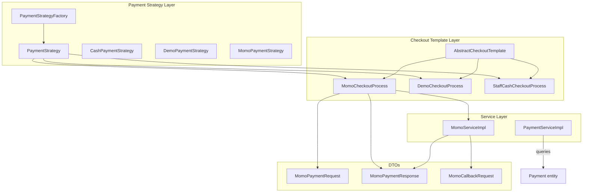
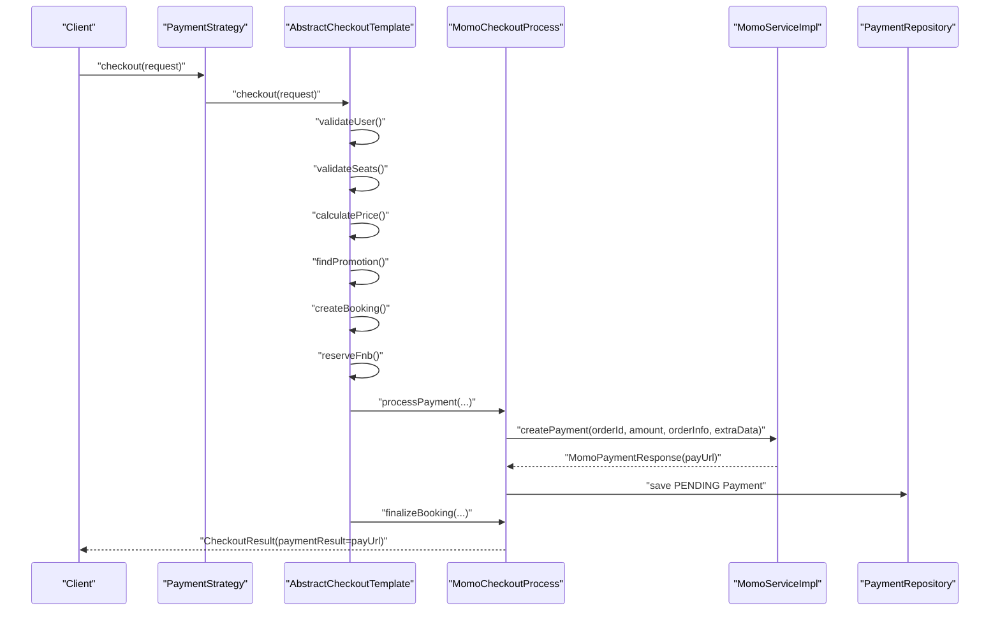
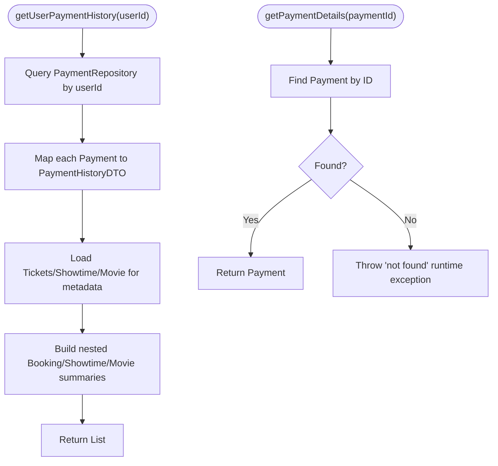
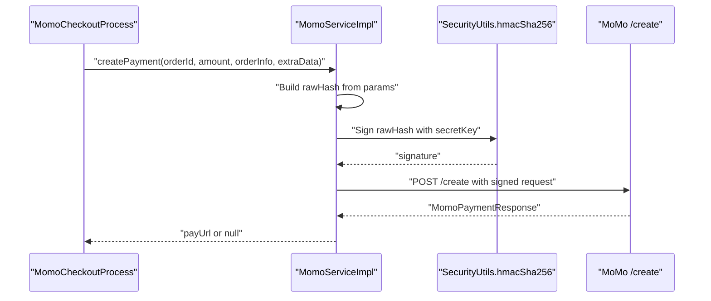
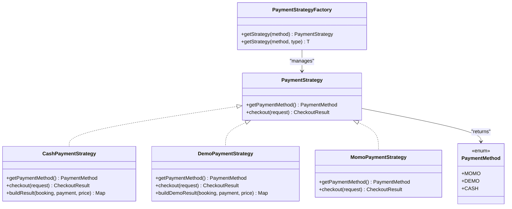
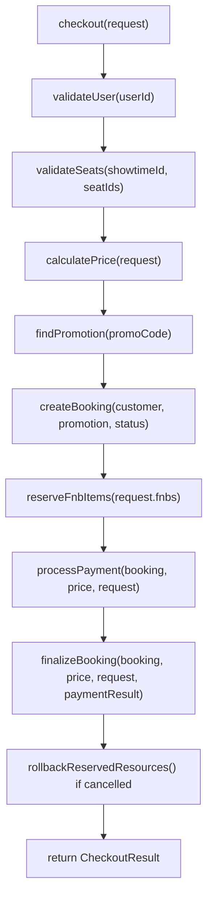
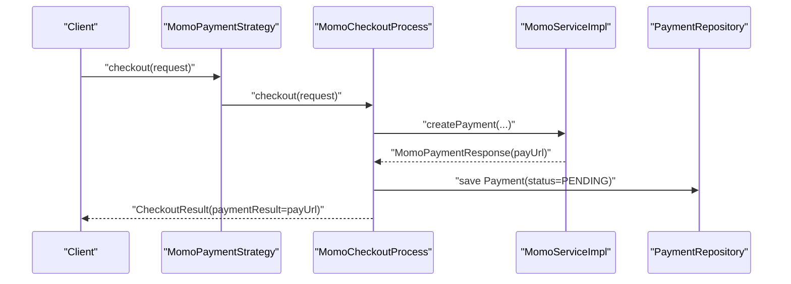
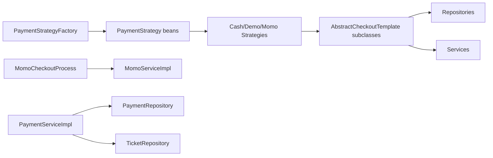

# Payment Services

<cite>
**Referenced Files in This Document**
- [PaymentServiceImpl.java](file://backend/src/main/java/com/cinema/booking/services/impl/PaymentServiceImpl.java)
- [MomoServiceImpl.java](file://backend/src/main/java/com/cinema/booking/services/impl/MomoServiceImpl.java)
- [PaymentStrategy.java](file://backend/src/main/java/com/cinema/booking/services/payment/PaymentStrategy.java)
- [PaymentStrategyFactory.java](file://backend/src/main/java/com/cinema/booking/services/payment/PaymentStrategyFactory.java)
- [CashPaymentStrategy.java](file://backend/src/main/java/com/cinema/booking/services/payment/CashPaymentStrategy.java)
- [DemoPaymentStrategy.java](file://backend/src/main/java/com/cinema/booking/services/payment/DemoPaymentStrategy.java)
- [MomoPaymentStrategy.java](file://backend/src/main/java/com/cinema/booking/services/payment/MomoPaymentStrategy.java)
- [PaymentMethod.java](file://backend/src/main/java/com/cinema/booking/services/payment/PaymentMethod.java)
- [AbstractCheckoutTemplate.java](file://backend/src/main/java/com/cinema/booking/services/template_method/checkout/AbstractCheckoutTemplate.java)
- [MomoCheckoutProcess.java](file://backend/src/main/java/com/cinema/booking/services/template_method/checkout/MomoCheckoutProcess.java)
- [DemoCheckoutProcess.java](file://backend/src/main/java/com/cinema/booking/services/template_method/checkout/DemoCheckoutProcess.java)
- [StaffCashCheckoutProcess.java](file://backend/src/main/java/com/cinema/booking/services/template_method/checkout/StaffCashCheckoutProcess.java)
- [MomoCallbackRequest.java](file://backend/src/main/java/com/cinema/booking/dtos/MomoCallbackRequest.java)
- [MomoPaymentRequest.java](file://backend/src/main/java/com/cinema/booking/dtos/MomoPaymentRequest.java)
- [MomoPaymentResponse.java](file://backend/src/main/java/com/cinema/booking/dtos/MomoPaymentResponse.java)
</cite>

## Table of Contents
1. [Introduction](#introduction)
2. [Project Structure](#project-structure)
3. [Core Components](#core-components)
4. [Architecture Overview](#architecture-overview)
5. [Detailed Component Analysis](#detailed-component-analysis)
6. [Dependency Analysis](#dependency-analysis)
7. [Performance Considerations](#performance-considerations)
8. [Security and Compliance](#security-and-compliance)
9. [Troubleshooting Guide](#troubleshooting-guide)
10. [Conclusion](#conclusion)

## Introduction
This document explains the payment processing services for the cinema booking system. It covers:
- Payment service implementation for retrieving payment history and details
- MoMo payment integration, including payment creation and callback handling
- Payment strategy pattern supporting multiple payment methods (Cash, Demo, Momo)
- End-to-end payment workflows, status tracking, error handling, and refund considerations
- Security and PCI compliance guidance

## Project Structure
The payment subsystem is organized around:
- Strategy pattern for payment methods
- Template method for checkout flows
- Service implementations for payment history and MoMo integration
- DTOs for MoMo requests and callbacks

**Diagram sources**
- [PaymentStrategy.java:1-15](file://backend/src/main/java/com/cinema/booking/services/payment/PaymentStrategy.java#L1-L15)
- [PaymentStrategyFactory.java:1-49](file://backend/src/main/java/com/cinema/booking/services/payment/PaymentStrategyFactory.java#L1-L49)
- [CashPaymentStrategy.java:1-40](file://backend/src/main/java/com/cinema/booking/services/payment/CashPaymentStrategy.java#L1-L40)
- [DemoPaymentStrategy.java:1-36](file://backend/src/main/java/com/cinema/booking/services/payment/DemoPaymentStrategy.java#L1-L36)
- [MomoPaymentStrategy.java:1-27](file://backend/src/main/java/com/cinema/booking/services/payment/MomoPaymentStrategy.java#L1-L27)
- [AbstractCheckoutTemplate.java:1-182](file://backend/src/main/java/com/cinema/booking/services/template_method/checkout/AbstractCheckoutTemplate.java#L1-L182)
- [MomoCheckoutProcess.java:1-70](file://backend/src/main/java/com/cinema/booking/services/template_method/checkout/MomoCheckoutProcess.java#L1-L70)
- [DemoCheckoutProcess.java:1-131](file://backend/src/main/java/com/cinema/booking/services/template_method/checkout/DemoCheckoutProcess.java#L1-L131)
- [StaffCashCheckoutProcess.java:1-129](file://backend/src/main/java/com/cinema/booking/services/template_method/checkout/StaffCashCheckoutProcess.java#L1-L129)
- [PaymentServiceImpl.java:1-69](file://backend/src/main/java/com/cinema/booking/services/impl/PaymentServiceImpl.java#L1-L69)
- [MomoServiceImpl.java:1-95](file://backend/src/main/java/com/cinema/booking/services/impl/MomoServiceImpl.java#L1-L95)
- [MomoPaymentRequest.java:1-23](file://backend/src/main/java/com/cinema/booking/dtos/MomoPaymentRequest.java#L1-L23)
- [MomoPaymentResponse.java:1-18](file://backend/src/main/java/com/cinema/booking/dtos/MomoPaymentResponse.java#L1-L18)
- [MomoCallbackRequest.java:1-21](file://backend/src/main/java/com/cinema/booking/dtos/MomoCallbackRequest.java#L1-L21)

**Section sources**
- [PaymentStrategy.java:1-15](file://backend/src/main/java/com/cinema/booking/services/payment/PaymentStrategy.java#L1-L15)
- [PaymentStrategyFactory.java:1-49](file://backend/src/main/java/com/cinema/booking/services/payment/PaymentStrategyFactory.java#L1-L49)
- [AbstractCheckoutTemplate.java:1-182](file://backend/src/main/java/com/cinema/booking/services/template_method/checkout/AbstractCheckoutTemplate.java#L1-L182)
- [PaymentServiceImpl.java:1-69](file://backend/src/main/java/com/cinema/booking/services/impl/PaymentServiceImpl.java#L1-L69)
- [MomoServiceImpl.java:1-95](file://backend/src/main/java/com/cinema/booking/services/impl/MomoServiceImpl.java#L1-L95)

## Core Components
- PaymentServiceImpl: Provides user payment history retrieval and payment detail lookup. It maps Payment entities to PaymentHistoryDTO and enriches it with movie and showtime metadata via Ticket and Showtime relations.
- MomoServiceImpl: Handles MoMo payment creation by building signed requests, sending them to the MoMo endpoint, and capturing the response. It also exposes a placeholder for signature verification from callbacks.
- PaymentStrategy and PaymentStrategyFactory: Define and register payment strategies per method (MOMO, DEMO, CASH). Factory ensures all methods are registered and supports type-safe retrieval.
- Template methods for checkout: AbstractCheckoutTemplate orchestrates shared steps (user validation, seat validation, pricing, promotion reservation, F&B reservation, payment processing, booking finalization). Subclasses implement payment-specific logic.

**Section sources**
- [PaymentServiceImpl.java:1-69](file://backend/src/main/java/com/cinema/booking/services/impl/PaymentServiceImpl.java#L1-L69)
- [MomoServiceImpl.java:1-95](file://backend/src/main/java/com/cinema/booking/services/impl/MomoServiceImpl.java#L1-L95)
- [PaymentStrategy.java:1-15](file://backend/src/main/java/com/cinema/booking/services/payment/PaymentStrategy.java#L1-L15)
- [PaymentStrategyFactory.java:1-49](file://backend/src/main/java/com/cinema/booking/services/payment/PaymentStrategyFactory.java#L1-L49)
- [AbstractCheckoutTemplate.java:1-182](file://backend/src/main/java/com/cinema/booking/services/template_method/checkout/AbstractCheckoutTemplate.java#L1-L182)

## Architecture Overview
The payment architecture separates concerns across layers:
- Strategy layer selects the appropriate payment method
- Template method layer defines the checkout flow and delegates payment-specific steps
- Service layer handles persistence and external integrations (e.g., MoMo)
- DTO layer models request/response contracts for MoMo

**Diagram sources**
- [PaymentStrategy.java:1-15](file://backend/src/main/java/com/cinema/booking/services/payment/PaymentStrategy.java#L1-L15)
- [AbstractCheckoutTemplate.java:53-95](file://backend/src/main/java/com/cinema/booking/services/template_method/checkout/AbstractCheckoutTemplate.java#L53-L95)
- [MomoCheckoutProcess.java:40-68](file://backend/src/main/java/com/cinema/booking/services/template_method/checkout/MomoCheckoutProcess.java#L40-L68)
- [MomoServiceImpl.java:42-86](file://backend/src/main/java/com/cinema/booking/services/impl/MomoServiceImpl.java#L42-L86)
- [PaymentStrategyFactory.java:33-39](file://backend/src/main/java/com/cinema/booking/services/payment/PaymentStrategyFactory.java#L33-L39)

## Detailed Component Analysis

### PaymentServiceImpl
Responsibilities:
- Retrieve user payment history and map to DTOs
- Fetch payment details by ID with error handling
- Enrich DTOs with movie/showtime metadata via Tickets and Showtimes

Processing logic:
- Queries payments for a user and transforms each Payment to PaymentHistoryDTO
- Builds nested summary objects for booking, showtime, and movie
- Defaults to PENDING status if entity status is null

**Diagram sources**
- [PaymentServiceImpl.java:24-67](file://backend/src/main/java/com/cinema/booking/services/impl/PaymentServiceImpl.java#L24-L67)

**Section sources**
- [PaymentServiceImpl.java:1-69](file://backend/src/main/java/com/cinema/booking/services/impl/PaymentServiceImpl.java#L1-L69)

### MomoServiceImpl
Responsibilities:
- Build MoMo payment requests with HMAC-SHA256 signature
- Send requests to MoMo endpoint and capture response
- Provide a placeholder for verifying MoMo callback signatures

Implementation highlights:
- Constructs a raw signature string from ordered parameters and signs with secret key
- Sends HTTP POST to create payment endpoint
- Logs warnings if payUrl is missing in response
- Exposes verifySignature for future callback verification

**Diagram sources**
- [MomoServiceImpl.java:42-86](file://backend/src/main/java/com/cinema/booking/services/impl/MomoServiceImpl.java#L42-L86)
- [MomoPaymentRequest.java:1-23](file://backend/src/main/java/com/cinema/booking/dtos/MomoPaymentRequest.java#L1-L23)
- [MomoPaymentResponse.java:1-18](file://backend/src/main/java/com/cinema/booking/dtos/MomoPaymentResponse.java#L1-L18)

**Section sources**
- [MomoServiceImpl.java:1-95](file://backend/src/main/java/com/cinema/booking/services/impl/MomoServiceImpl.java#L1-L95)
- [MomoPaymentRequest.java:1-23](file://backend/src/main/java/com/cinema/booking/dtos/MomoPaymentRequest.java#L1-L23)
- [MomoPaymentResponse.java:1-18](file://backend/src/main/java/com/cinema/booking/dtos/MomoPaymentResponse.java#L1-L18)

### Payment Strategy Pattern
The strategy pattern enables pluggable payment methods:
- PaymentStrategy defines the contract for checkout and method identification
- PaymentStrategyFactory registers strategies and validates completeness
- Concrete strategies delegate to template methods for checkout logic

**Diagram sources**
- [PaymentStrategy.java:1-15](file://backend/src/main/java/com/cinema/booking/services/payment/PaymentStrategy.java#L1-L15)
- [PaymentStrategyFactory.java:1-49](file://backend/src/main/java/com/cinema/booking/services/payment/PaymentStrategyFactory.java#L1-L49)
- [CashPaymentStrategy.java:1-40](file://backend/src/main/java/com/cinema/booking/services/payment/CashPaymentStrategy.java#L1-L40)
- [DemoPaymentStrategy.java:1-36](file://backend/src/main/java/com/cinema/booking/services/payment/DemoPaymentStrategy.java#L1-L36)
- [MomoPaymentStrategy.java:1-27](file://backend/src/main/java/com/cinema/booking/services/payment/MomoPaymentStrategy.java#L1-L27)
- [PaymentMethod.java:1-22](file://backend/src/main/java/com/cinema/booking/services/payment/PaymentMethod.java#L1-L22)

**Section sources**
- [PaymentStrategy.java:1-15](file://backend/src/main/java/com/cinema/booking/services/payment/PaymentStrategy.java#L1-L15)
- [PaymentStrategyFactory.java:1-49](file://backend/src/main/java/com/cinema/booking/services/payment/PaymentStrategyFactory.java#L1-L49)
- [CashPaymentStrategy.java:1-40](file://backend/src/main/java/com/cinema/booking/services/payment/CashPaymentStrategy.java#L1-L40)
- [DemoPaymentStrategy.java:1-36](file://backend/src/main/java/com/cinema/booking/services/payment/DemoPaymentStrategy.java#L1-L36)
- [MomoPaymentStrategy.java:1-27](file://backend/src/main/java/com/cinema/booking/services/payment/MomoPaymentStrategy.java#L1-L27)
- [PaymentMethod.java:1-22](file://backend/src/main/java/com/cinema/booking/services/payment/PaymentMethod.java#L1-L22)

### Checkout Template Methods
AbstractCheckoutTemplate defines the shared checkout flow:
- Validates user and seats
- Calculates price and reserves promotions/F&B
- Creates booking and delegates payment processing and finalization to subclasses

**Diagram sources**
- [AbstractCheckoutTemplate.java:53-95](file://backend/src/main/java/com/cinema/booking/services/template_method/checkout/AbstractCheckoutTemplate.java#L53-L95)

Subclasses implement payment-specific behavior:
- MomoCheckoutProcess: sets initial status to PENDING, creates MoMo payment, persists PENDING Payment
- DemoCheckoutProcess: creates Payment immediately (SUCCESS/FAILED based on demo flag), issues tickets, updates customer spending, sends email
- StaffCashCheckoutProcess: sets initial status to CONFIRMED, records SUCCESS Payment, issues tickets, updates customer spending

**Section sources**
- [AbstractCheckoutTemplate.java:1-182](file://backend/src/main/java/com/cinema/booking/services/template_method/checkout/AbstractCheckoutTemplate.java#L1-L182)
- [MomoCheckoutProcess.java:1-70](file://backend/src/main/java/com/cinema/booking/services/template_method/checkout/MomoCheckoutProcess.java#L1-L70)
- [DemoCheckoutProcess.java:1-131](file://backend/src/main/java/com/cinema/booking/services/template_method/checkout/DemoCheckoutProcess.java#L1-L131)
- [StaffCashCheckoutProcess.java:1-129](file://backend/src/main/java/com/cinema/booking/services/template_method/checkout/StaffCashCheckoutProcess.java#L1-L129)

### Payment Initiation, Status Updates, and Refunds
- Initiation: Strategies delegate to template methods; MoMo strategy builds extraData containing booking and seat info, requests payUrl from MoMo, and persists a PENDING Payment
- Status updates: The current implementation logs MoMo responses and stores PENDING Payment. Callback verification and status updates are indicated by placeholders in MoMo service and callback DTOs
- Refunds: Not implemented in the current codebase; recommended approach is to introduce a Refund entity and update Payment status accordingly

**Diagram sources**
- [MomoPaymentStrategy.java:22-25](file://backend/src/main/java/com/cinema/booking/services/payment/MomoPaymentStrategy.java#L22-L25)
- [MomoCheckoutProcess.java:46-68](file://backend/src/main/java/com/cinema/booking/services/template_method/checkout/MomoCheckoutProcess.java#L46-L68)
- [MomoServiceImpl.java:42-86](file://backend/src/main/java/com/cinema/booking/services/impl/MomoServiceImpl.java#L42-L86)

## Dependency Analysis
- PaymentStrategyFactory depends on all PaymentStrategy beans to populate an internal map and validate completeness
- Template methods depend on repositories and services for persistence and business logic
- MomoCheckoutProcess depends on MomoService for payment creation
- PaymentServiceImpl depends on PaymentRepository and TicketRepository for history enrichment

**Diagram sources**
- [PaymentStrategyFactory.java:18-31](file://backend/src/main/java/com/cinema/booking/services/payment/PaymentStrategyFactory.java#L18-L31)
- [MomoCheckoutProcess.java:23-37](file://backend/src/main/java/com/cinema/booking/services/template_method/checkout/MomoCheckoutProcess.java#L23-L37)
- [PaymentServiceImpl.java:17-21](file://backend/src/main/java/com/cinema/booking/services/impl/PaymentServiceImpl.java#L17-L21)

**Section sources**
- [PaymentStrategyFactory.java:1-49](file://backend/src/main/java/com/cinema/booking/services/payment/PaymentStrategyFactory.java#L1-L49)
- [MomoCheckoutProcess.java:1-70](file://backend/src/main/java/com/cinema/booking/services/template_method/checkout/MomoCheckoutProcess.java#L1-L70)
- [PaymentServiceImpl.java:1-69](file://backend/src/main/java/com/cinema/booking/services/impl/PaymentServiceImpl.java#L1-L69)

## Performance Considerations
- Template method reduces duplication and centralizes validations, minimizing repeated work across strategies
- Payment history enrichment queries Tickets and Showtimes; ensure proper indexing on booking_id and showtime/movie joins
- MoMo request signing and HTTP calls should be optimized with connection pooling and timeouts
- Retry/backoff strategies for customer spending updates mitigate transient deadlocks

## Security and Compliance
- PCI DSS: Do not log or persist cardholder data; rely on MoMo for sensitive data handling
- Signature verification: Implement MoMo callback signature verification using the documented raw hash format and secret key
- Input validation: Validate orderId, amount, and extraData before invoking MoMo; sanitize and limit payload sizes
- Secure storage: Store MoMo credentials via environment variables or secure vaults; avoid committing secrets
- HTTPS and TLS: Ensure all integrations use TLS 1.2+ and up-to-date certificates
- Audit logging: Log only non-sensitive fields (e.g., resultCode, responseTime) for diagnostics

## Troubleshooting Guide
Common issues and resolutions:
- Payment not found: PaymentServiceImpl throws a runtime exception when paymentId does not exist; verify the ID and associated booking
- Missing payUrl: MomoServiceImpl logs a warning when payUrl is null; check MoMo endpoint response and required parameters
- Signature mismatch: Implement verifySignature using the documented raw hash construction and compare with MoMo’s signature field
- Seat conflicts: AbstractCheckoutTemplate.validateSeats prevents purchases of already-sold seats; prompt users to select alternate seats
- Demo failures: DemoCheckoutProcess sets Payment status to FAILED and cancels booking; confirm demoSuccess flag correctness

**Section sources**
- [PaymentServiceImpl.java:30-34](file://backend/src/main/java/com/cinema/booking/services/impl/PaymentServiceImpl.java#L30-L34)
- [MomoServiceImpl.java:78-84](file://backend/src/main/java/com/cinema/booking/services/impl/MomoServiceImpl.java#L78-L84)
- [AbstractCheckoutTemplate.java:133-139](file://backend/src/main/java/com/cinema/booking/services/template_method/checkout/AbstractCheckoutTemplate.java#L133-L139)
- [DemoCheckoutProcess.java:56-62](file://backend/src/main/java/com/cinema/booking/services/template_method/checkout/DemoCheckoutProcess.java#L56-L62)

## Conclusion
The payment subsystem leverages the Strategy and Template Method patterns to support multiple payment methods while centralizing shared checkout logic. PaymentServiceImpl provides robust payment history and detail retrieval, while MomoServiceImpl integrates with MoMo for payment initiation. The architecture is extensible for additional payment methods and ready for callback verification and refund processing enhancements.