# Service Layer Implementation

<cite>
**Referenced Files in This Document**
- [FilmBookingBackendApplication.java](file://backend/src/main/java/com/cinema/booking/FilmBookingBackendApplication.java)
- [application.properties](file://backend/src/main/resources/application.properties)
- [BookingService.java](file://backend/src/main/java/com/cinema/booking/services/BookingService.java)
- [BookingServiceImpl.java](file://backend/src/main/java/com/cinema/booking/services/impl/BookingServiceImpl.java)
- [SeatService.java](file://backend/src/main/java/com/cinema/booking/services/SeatService.java)
- [SeatServiceImpl.java](file://backend/src/main/java/com/cinema/booking/services/impl/SeatServiceImpl.java)
- [CheckoutService.java](file://backend/src/main/java/com/cinema/booking/services/CheckoutService.java)
- [CheckoutServiceImpl.java](file://backend/src/main/java/com/cinema/booking/services/impl/CheckoutServiceImpl.java)
- [PaymentService.java](file://backend/src/main/java/com/cinema/booking/services/PaymentService.java)
- [PaymentServiceImpl.java](file://backend/src/main/java/com/cinema/booking/services/impl/PaymentServiceImpl.java)
- [SeatLockProvider.java](file://backend/src/main/java/com/cinema/booking/services/seatlock/SeatLockProvider.java)
- [RedisSeatLockAdapter.java](file://backend/src/main/java/com/cinema/booking/services/seatlock/RedisSeatLockAdapter.java)
- [FnbItemInventoryService.java](file://backend/src/main/java/com/cinema/booking/services/FnbItemInventoryService.java)
- [FnbItemInventoryServiceImpl.java](file://backend/src/main/java/com/cinema/booking/services/impl/FnbItemInventoryServiceImpl.java)
- [PromotionInventoryService.java](file://backend/src/main/java/com/cinema/booking/services/PromotionInventoryService.java)
- [IPricingEngine.java](file://backend/src/main/java/com/cinema/booking/services/strategy_decorator/pricing/IPricingEngine.java)
- [PricingEngine.java](file://backend/src/main/java/com/cinema/booking/services/strategy_decorator/pricing/PricingEngine.java)
- [PricingValidationHandler.java](file://backend/src/main/java/com/cinema/booking/services/strategy_decorator/pricing/validation/PricingValidationHandler.java)
- [PostPaymentMediator.java](file://backend/src/main/java/com/cinema/booking/patterns/mediator/PostPaymentMediator.java)
- [MomoCallbackContext.java](file://backend/src/main/java/com/cinema/booking/patterns/mediator/MomoCallbackContext.java)
- [BookingContext.java](file://backend/src/main/java/com/cinema/booking/patterns/state/BookingContext.java)
- [StateFactory.java](file://backend/src/main/java/com/cinema/booking/patterns/state/StateFactory.java)
- [CancelledState.java](file://backend/src/main/java/com/cinema/booking/patterns/state/CancelledState.java)
- [ConfirmedState.java](file://backend/src/main/java/com/cinema/booking/patterns/state/ConfirmedState.java)
- [PendingState.java](file://backend/src/main/java/com/cinema/booking/patterns/state/PendingState.java)
- [RefundedState.java](file://backend/src/main/java/com/cinema/booking/patterns/state/RefundedState.java)
- [SeatStateFactory.java](file://backend/src/main/java/com/cinema/booking/domain/seat/SeatStateFactory.java)
- [VacantSeatState.java](file://backend/src/main/java/com/cinema/booking/domain/seat/VacantSeatState.java)
- [SoldSeatState.java](file://backend/src/main/java/com/cinema/booking/domain/seat/SoldSeatState.java)
- [PendingSeatState.java](file://backend/src/main/java/com/cinema/booking/domain/seat/PendingSeatState.java)
- [MomoService.java](file://backend/src/main/java/com/cinema/booking/services/MomoService.java)
- [MomoPaymentStrategy.java](file://backend/src/main/java/com/cinema/booking/services/payment/MomoPaymentStrategy.java)
- [DemoPaymentStrategy.java](file://backend/src/main/java/com/cinema/booking/services/payment/DemoPaymentStrategy.java)
- [CashPaymentStrategy.java](file://backend/src/main/java/com/cinema/booking/services/payment/CashPaymentStrategy.java)
- [PaymentStrategyFactory.java](file://backend/src/main/java/com/cinema/booking/services/payment/PaymentStrategyFactory.java)
- [BookingFnbService.java](file://backend/src/main/java/com/cinema/booking/services/BookingFnbService.java)
- [BookingFnbServiceImpl.java](file://backend/src/main/java/com/cinema/booking/services/impl/BookingFnbServiceImpl.java)
- [TicketService.java](file://backend/src/main/java/com/cinema/booking/services/TicketService.java)
- [TicketServiceImpl.java](file://backend/src/main/java/com/cinema/booking/services/impl/TicketServiceImpl.java)
- [ShowtimeService.java](file://backend/src/main/java/com/cinema/booking/services/ShowtimeService.java)
- [ShowtimeServiceImpl.java](file://backend/src/main/java/com/cinema/booking/services/impl/ShowtimeServiceImpl.java)
- [UserService.java](file://backend/src/main/java/com/cinema/booking/services/UserService.java)
- [UserServiceImpl.java](file://backend/src/main/java/com/cinema/booking/services/impl/UserServiceImpl.java)
- [LocationService.java](file://backend/src/main/java/com/cinema/booking/services/LocationService.java)
- [LocationServiceImpl.java](file://backend/src/main/java/com/cinema/booking/services/impl/LocationServiceImpl.java)
- [CinemaService.java](file://backend/src/main/java/com/cinema/booking/services/CinemaService.java)
- [CinemaServiceImpl.java](file://backend/src/main/java/com/cinema/booking/services/impl/CinemaServiceImpl.java)
- [RoomService.java](file://backend/src/main/java/com/cinema/booking/services/RoomService.java)
- [RoomServiceImpl.java](file://backend/src/main/java/com/cinema/booking/services/impl/RoomServiceImpl.java)
- [MovieService.java](file://backend/src/main/java/com/cinema/booking/services/MovieService.java)
- [MovieServiceImpl.java](file://backend/src/main/java/com/cinema/booking/services/impl/MovieServiceImpl.java)
- [VoucherService.java](file://backend/src/main/java/com/cinema/booking/services/VoucherService.java)
- [VoucherServiceImpl.java](file://backend/src/main/java/com/cinema/booking/services/impl/VoucherServiceImpl.java)
- [EmailService.java](file://backend/src/main/java/com/cinema/booking/services/EmailService.java)
- [EmailServiceImpl.java](file://backend/src/main/java/com/cinema/booking/services/impl/EmailServiceImpl.java)
- [AuthService.java](file://backend/src/main/java/com/cinema/booking/services/AuthService.java)
- [AuthServiceImpl.java](file://backend/src/main/java/com/cinema/booking/services/impl/AuthServiceImpl.java)
- [FileUploadService.java](file://backend/src/main/java/com/cinema/booking/services/FileUploadService.java)
- [FileUploadServiceImpl.java](file://backend/src/main/java/com/cinema/booking/services/impl/FileUploadServiceImpl.java)
- [CloudinaryService.java](file://backend/src/main/java/com/cinema/booking/services/CloudinaryService.java)
- [CloudinaryServiceImpl.java](file://backend/src/main/java/com/cinema/booking/services/impl/CloudinaryServiceImpl.java)
</cite>

## Table of Contents
1. [Introduction](#introduction)
2. [Project Structure](#project-structure)
3. [Core Components](#core-components)
4. [Architecture Overview](#architecture-overview)
5. [Detailed Component Analysis](#detailed-component-analysis)
6. [Dependency Analysis](#dependency-analysis)
7. [Performance Considerations](#performance-considerations)
8. [Troubleshooting Guide](#troubleshooting-guide)
9. [Conclusion](#conclusion)
10. [Appendices](#appendices)

## Introduction
This document explains the service layer business logic of the cinema booking system. It covers service interface design, transaction management, business rule enforcement, the service-to-repository pattern, dependency injection via Spring annotations, and exception handling strategies. It also documents core business processes including booking workflows, payment processing, seat management, and inventory control, with practical examples, validation logic, error propagation, testing approaches, and performance considerations.

## Project Structure
The backend service layer is organized around clean separation of concerns:
- Interfaces define contracts for services (e.g., BookingService, SeatService, CheckoutService).
- Implementations under services/impl encapsulate business logic and orchestrate repositories.
- Supporting patterns include Strategy, Decorator, Chain of Responsibility, Mediator, State, and Proxy.
- Configuration and runtime behavior are controlled via Spring annotations and application properties.

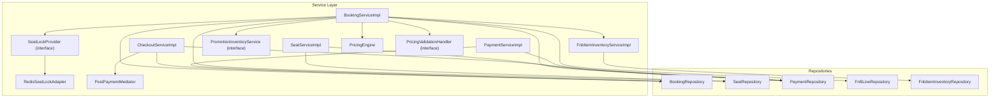

**Diagram sources**
- [BookingServiceImpl.java:32-260](file://backend/src/main/java/com/cinema/booking/services/impl/BookingServiceImpl.java#L32-L260)
- [SeatServiceImpl.java:27-203](file://backend/src/main/java/com/cinema/booking/services/impl/SeatServiceImpl.java#L27-L203)
- [CheckoutServiceImpl.java:25-185](file://backend/src/main/java/com/cinema/booking/services/impl/CheckoutServiceImpl.java#L25-L185)
- [PaymentServiceImpl.java:14-69](file://backend/src/main/java/com/cinema/booking/services/impl/PaymentServiceImpl.java#L14-L69)
- [FnbItemInventoryServiceImpl.java:22-113](file://backend/src/main/java/com/cinema/booking/services/impl/FnbItemInventoryServiceImpl.java#L22-L113)
- [SeatLockProvider.java:8-18](file://backend/src/main/java/com/cinema/booking/services/seatlock/SeatLockProvider.java#L8-L18)
- [RedisSeatLockAdapter.java:14-56](file://backend/src/main/java/com/cinema/booking/services/seatlock/RedisSeatLockAdapter.java#L14-L56)
- [PricingEngine.java:24-117](file://backend/src/main/java/com/cinema/booking/services/strategy_decorator/pricing/PricingEngine.java#L24-L117)
- [PricingValidationHandler.java:9-12](file://backend/src/main/java/com/cinema/booking/services/strategy_decorator/pricing/validation/PricingValidationHandler.java#L9-L12)
- [PostPaymentMediator.java](file://backend/src/main/java/com/cinema/booking/patterns/mediator/PostPaymentMediator.java)

**Section sources**
- [FilmBookingBackendApplication.java](file://backend/src/main/java/com/cinema/booking/FilmBookingBackendApplication.java)
- [application.properties](file://backend/src/main/resources/application.properties)

## Core Components
- Service interfaces define capabilities and contracts (e.g., BookingService, SeatService, CheckoutService).
- Implementations use @Service and @Transactional to manage business operations and transactions.
- Services depend on repositories for persistence and on other services for cross-cutting concerns (e.g., inventory, pricing).
- Validation and business rules are enforced at the service boundary before delegating to repositories or external systems.

Examples of service method responsibilities:
- BookingService: seat status retrieval, seat locking/unlocking, price calculation, booking queries, and state transitions (cancel/refund/print).
- SeatService: CRUD operations for seats, bulk replacement with conflict detection.
- CheckoutService: orchestrates payment strategies, handles MoMo callbacks, and demo/staff cash flows.
- PaymentService: payment history and details lookup.
- Inventory services: F&B inventory reservation/release and promotion inventory management.
- Pricing engine: dynamic pricing via Strategy/Decorator/Chain of Responsibility.

**Section sources**
- [BookingService.java:9-21](file://backend/src/main/java/com/cinema/booking/services/BookingService.java#L9-L21)
- [BookingServiceImpl.java:32-260](file://backend/src/main/java/com/cinema/booking/services/impl/BookingServiceImpl.java#L32-L260)
- [SeatService.java:6-14](file://backend/src/main/java/com/cinema/booking/services/SeatService.java#L6-L14)
- [SeatServiceImpl.java:27-203](file://backend/src/main/java/com/cinema/booking/services/impl/SeatServiceImpl.java#L27-L203)
- [CheckoutService.java:3-11](file://backend/src/main/java/com/cinema/booking/services/CheckoutService.java#L3-L11)
- [CheckoutServiceImpl.java:25-185](file://backend/src/main/java/com/cinema/booking/services/impl/CheckoutServiceImpl.java#L25-L185)
- [PaymentService.java:7-10](file://backend/src/main/java/com/cinema/booking/services/PaymentService.java#L7-L10)
- [PaymentServiceImpl.java:14-69](file://backend/src/main/java/com/cinema/booking/services/impl/PaymentServiceImpl.java#L14-L69)
- [FnbItemInventoryService.java:10-20](file://backend/src/main/java/com/cinema/booking/services/FnbItemInventoryService.java#L10-L20)
- [FnbItemInventoryServiceImpl.java:22-113](file://backend/src/main/java/com/cinema/booking/services/impl/FnbItemInventoryServiceImpl.java#L22-L113)
- [PromotionInventoryService.java:5-11](file://backend/src/main/java/com/cinema/booking/services/PromotionInventoryService.java#L5-L11)
- [IPricingEngine.java:9-11](file://backend/src/main/java/com/cinema/booking/services/strategy_decorator/pricing/IPricingEngine.java#L9-L11)
- [PricingEngine.java:24-117](file://backend/src/main/java/com/cinema/booking/services/strategy_decorator/pricing/PricingEngine.java#L24-L117)
- [PricingValidationHandler.java:9-12](file://backend/src/main/java/com/cinema/booking/services/strategy_decorator/pricing/validation/PricingValidationHandler.java#L9-L12)

## Architecture Overview
The service layer follows a layered architecture:
- Controllers delegate to services.
- Services encapsulate business logic and coordinate repositories and external integrations.
- Patterns are used to keep logic modular and testable:
  - Strategy for pricing and payment methods.
  - Decorator for discounts.
  - Chain of Responsibility for validation.
  - Mediator for post-payment coordination.
  - State for booking lifecycle.
  - Proxy for caching pricing engine.

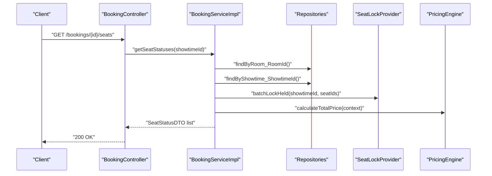

**Diagram sources**
- [BookingServiceImpl.java:77-115](file://backend/src/main/java/com/cinema/booking/services/impl/BookingServiceImpl.java#L77-L115)
- [SeatLockProvider.java:8-18](file://backend/src/main/java/com/cinema/booking/services/seatlock/SeatLockProvider.java#L8-L18)
- [PricingEngine.java:45-75](file://backend/src/main/java/com/cinema/booking/services/strategy_decorator/pricing/PricingEngine.java#L45-L75)

## Detailed Component Analysis

### Booking Service
Responsibilities:
- Seat status computation combining sold tickets, pending locks, and base pricing.
- Seat locking/unlocking via SeatLockProvider.
- Price calculation using PricingEngine and validation chain.
- Booking queries and state transitions via BookingContext (State pattern).

Key implementation highlights:
- Seat status aggregation uses repository queries and SeatStateFactory to derive display status.
- Pricing validation runs before invoking the pricing engine.
- State transitions are transactional and persist the updated booking entity.

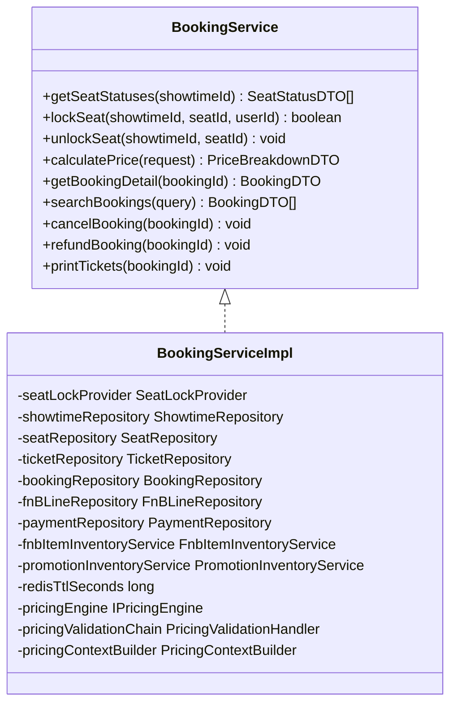

**Diagram sources**
- [BookingService.java:9-21](file://backend/src/main/java/com/cinema/booking/services/BookingService.java#L9-L21)
- [BookingServiceImpl.java:32-260](file://backend/src/main/java/com/cinema/booking/services/impl/BookingServiceImpl.java#L32-L260)

**Section sources**
- [BookingService.java:9-21](file://backend/src/main/java/com/cinema/booking/services/BookingService.java#L9-L21)
- [BookingServiceImpl.java:77-115](file://backend/src/main/java/com/cinema/booking/services/impl/BookingServiceImpl.java#L77-L115)
- [BookingServiceImpl.java:133-149](file://backend/src/main/java/com/cinema/booking/services/impl/BookingServiceImpl.java#L133-L149)
- [BookingServiceImpl.java:167-198](file://backend/src/main/java/com/cinema/booking/services/impl/BookingServiceImpl.java#L167-L198)

### Seat Service
Responsibilities:
- CRUD operations for seats.
- Bulk replacement of room seating plans with validation against existing tickets and duplicate seat codes.
- Seat code normalization and resolution.

Validation logic:
- Rejects duplicate seat codes during replacement.
- Prevents deletion of seats that still have associated tickets.
- Uses ResponseStatusException for constraint violations.

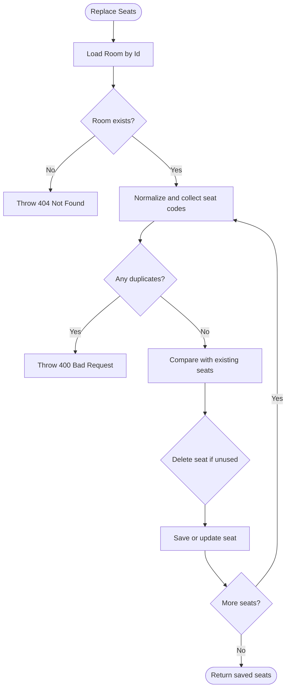

**Diagram sources**
- [SeatServiceImpl.java:125-187](file://backend/src/main/java/com/cinema/booking/services/impl/SeatServiceImpl.java#L125-L187)

**Section sources**
- [SeatService.java:6-14](file://backend/src/main/java/com/cinema/booking/services/SeatService.java#L6-L14)
- [SeatServiceImpl.java:125-187](file://backend/src/main/java/com/cinema/booking/services/impl/SeatServiceImpl.java#L125-L187)

### Checkout Service
Responsibilities:
- Orchestration of payment flows using PaymentStrategyFactory.
- Support for multiple payment methods (MoMo, Demo, Cash).
- MoMo callback verification and post-payment settlement via PostPaymentMediator.
- Demo and staff cash checkouts with explicit success/failure handling.

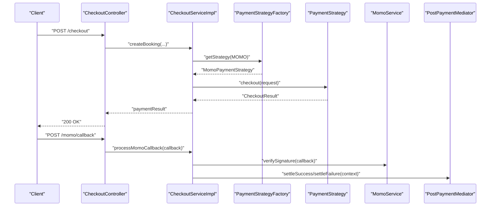

**Diagram sources**
- [CheckoutServiceImpl.java:43-64](file://backend/src/main/java/com/cinema/booking/services/impl/CheckoutServiceImpl.java#L43-L64)
- [CheckoutServiceImpl.java:66-130](file://backend/src/main/java/com/cinema/booking/services/impl/CheckoutServiceImpl.java#L66-L130)
- [MomoService.java](file://backend/src/main/java/com/cinema/booking/services/MomoService.java)
- [PostPaymentMediator.java](file://backend/src/main/java/com/cinema/booking/patterns/mediator/PostPaymentMediator.java)

**Section sources**
- [CheckoutService.java:3-11](file://backend/src/main/java/com/cinema/booking/services/CheckoutService.java#L3-L11)
- [CheckoutServiceImpl.java:43-64](file://backend/src/main/java/com/cinema/booking/services/impl/CheckoutServiceImpl.java#L43-L64)
- [CheckoutServiceImpl.java:66-130](file://backend/src/main/java/com/cinema/booking/services/impl/CheckoutServiceImpl.java#L66-L130)
- [CheckoutServiceImpl.java:132-183](file://backend/src/main/java/com/cinema/booking/services/impl/CheckoutServiceImpl.java#L132-L183)

### Payment Service
Responsibilities:
- Retrieve user payment history with enriched movie metadata.
- Fetch payment details by ID.

Implementation:
- Joins payment with booking and tickets to enrich DTOs with movie title/poster.

**Section sources**
- [PaymentService.java:7-10](file://backend/src/main/java/com/cinema/booking/services/PaymentService.java#L7-L10)
- [PaymentServiceImpl.java:23-67](file://backend/src/main/java/com/cinema/booking/services/impl/PaymentServiceImpl.java#L23-L67)

### Inventory Management Services
Responsibilities:
- F&B inventory: reserve items or throw on insufficient stock; release items upon cancellation/refund.
- Promotion inventory: reserve promotions for pricing; resolve promotions; release on failure.

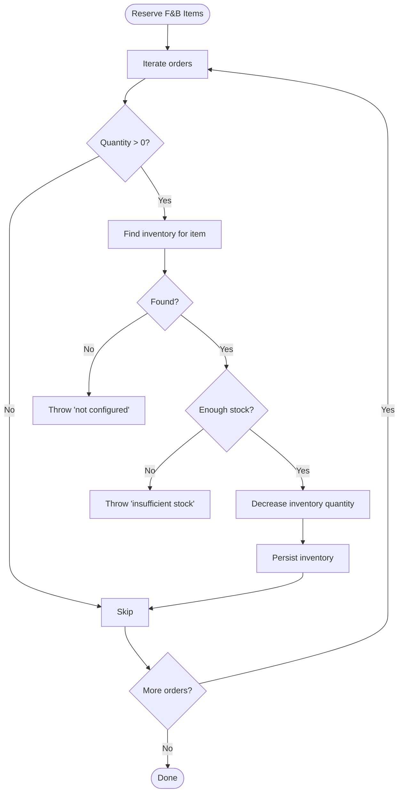

**Diagram sources**
- [FnbItemInventoryServiceImpl.java:60-83](file://backend/src/main/java/com/cinema/booking/services/impl/FnbItemInventoryServiceImpl.java#L60-L83)

**Section sources**
- [FnbItemInventoryService.java:10-20](file://backend/src/main/java/com/cinema/booking/services/FnbItemInventoryService.java#L10-L20)
- [FnbItemInventoryServiceImpl.java:60-83](file://backend/src/main/java/com/cinema/booking/services/impl/FnbItemInventoryServiceImpl.java#L60-L83)
- [FnbItemInventoryServiceImpl.java:85-111](file://backend/src/main/java/com/cinema/booking/services/impl/FnbItemInventoryServiceImpl.java#L85-L111)

### Pricing Engine and Validation
Responsibilities:
- Dynamic pricing via Strategy per line type (ticket, F&B, time-based surcharge).
- Discount decorators (promotion, member) applied in a chain.
- Validation chain ensures preconditions (e.g., seats available, showtime future) before pricing.

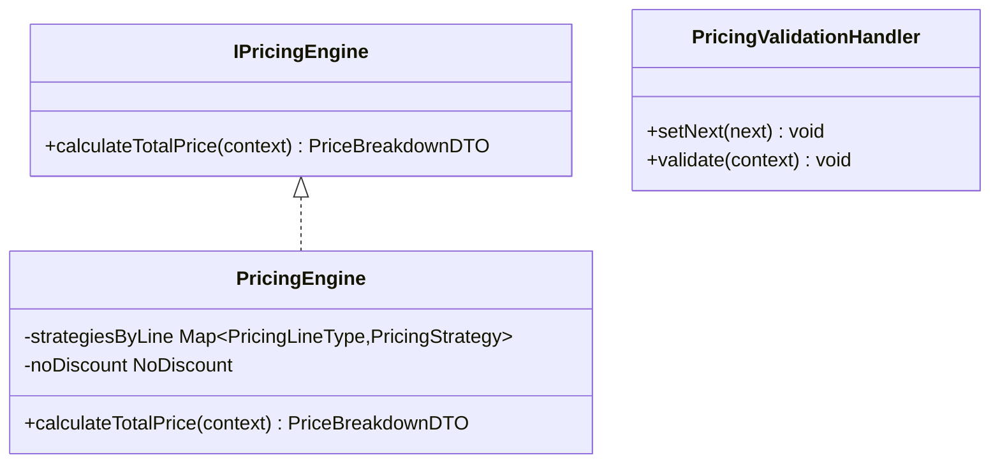

**Diagram sources**
- [IPricingEngine.java:9-11](file://backend/src/main/java/com/cinema/booking/services/strategy_decorator/pricing/IPricingEngine.java#L9-L11)
- [PricingEngine.java:24-117](file://backend/src/main/java/com/cinema/booking/services/strategy_decorator/pricing/PricingEngine.java#L24-L117)
- [PricingValidationHandler.java:9-12](file://backend/src/main/java/com/cinema/booking/services/strategy_decorator/pricing/validation/PricingValidationHandler.java#L9-L12)

**Section sources**
- [PricingEngine.java:45-75](file://backend/src/main/java/com/cinema/booking/services/strategy_decorator/pricing/PricingEngine.java#L45-L75)
- [PricingValidationHandler.java:9-12](file://backend/src/main/java/com/cinema/booking/services/strategy_decorator/pricing/validation/PricingValidationHandler.java#L9-L12)

### Seat Locking and Concurrency Control
Responsibilities:
- Seat locking via SeatLockProvider abstraction.
- Redis-backed adapter for atomic lock acquisition and batch lock checks.
- Seat state derived from sold/pending lock status.

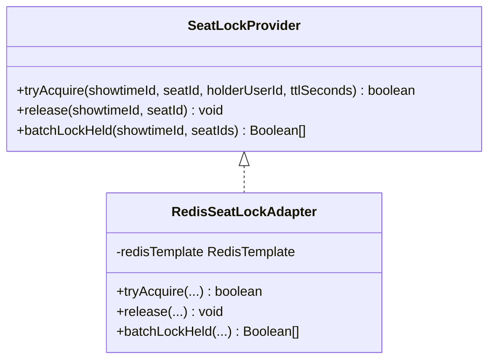

**Diagram sources**
- [SeatLockProvider.java:8-18](file://backend/src/main/java/com/cinema/booking/services/seatlock/SeatLockProvider.java#L8-L18)
- [RedisSeatLockAdapter.java:14-56](file://backend/src/main/java/com/cinema/booking/services/seatlock/RedisSeatLockAdapter.java#L14-L56)

**Section sources**
- [SeatLockProvider.java:8-18](file://backend/src/main/java/com/cinema/booking/services/seatlock/SeatLockProvider.java#L8-L18)
- [RedisSeatLockAdapter.java:23-54](file://backend/src/main/java/com/cinema/booking/services/seatlock/RedisSeatLockAdapter.java#L23-L54)

### Booking State Management
Responsibilities:
- Enforce lifecycle transitions (pending → confirmed/cancelled/refunded) via BookingContext and state implementations.
- Persist state changes after validation.

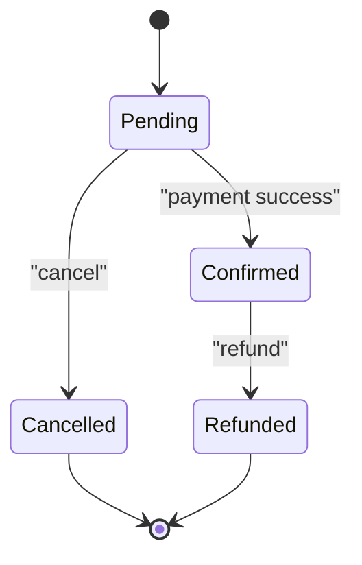

**Diagram sources**
- [BookingContext.java](file://backend/src/main/java/com/cinema/booking/patterns/state/BookingContext.java)
- [StateFactory.java](file://backend/src/main/java/com/cinema/booking/patterns/state/StateFactory.java)
- [PendingState.java](file://backend/src/main/java/com/cinema/booking/patterns/state/PendingState.java)
- [ConfirmedState.java](file://backend/src/main/java/com/cinema/booking/patterns/state/ConfirmedState.java)
- [CancelledState.java](file://backend/src/main/java/com/cinema/booking/patterns/state/CancelledState.java)
- [RefundedState.java](file://backend/src/main/java/com/cinema/booking/patterns/state/RefundedState.java)

**Section sources**
- [BookingServiceImpl.java:167-198](file://backend/src/main/java/com/cinema/booking/services/impl/BookingServiceImpl.java#L167-L198)

### Seat State Modeling
Responsibilities:
- SeatStateFactory derives display status from sold and locked flags.
- Seat state classes represent allowed transitions and actions.

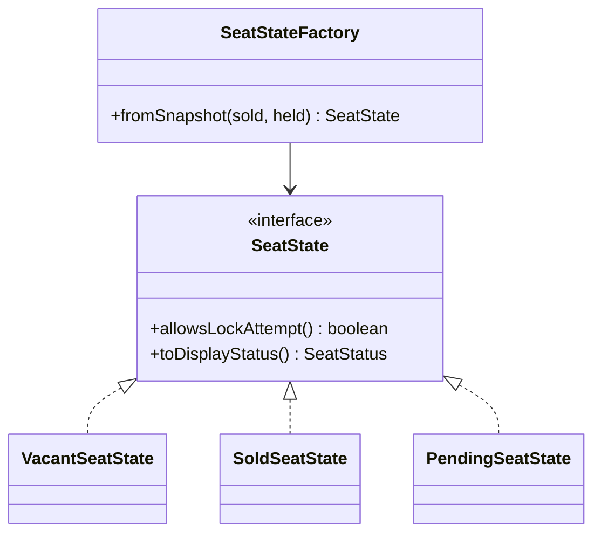

**Diagram sources**
- [SeatStateFactory.java](file://backend/src/main/java/com/cinema/booking/domain/seat/SeatStateFactory.java)
- [VacantSeatState.java](file://backend/src/main/java/com/cinema/booking/domain/seat/VacantSeatState.java)
- [SoldSeatState.java](file://backend/src/main/java/com/cinema/booking/domain/seat/SoldSeatState.java)
- [PendingSeatState.java](file://backend/src/main/java/com/cinema/booking/domain/seat/PendingSeatState.java)

**Section sources**
- [BookingServiceImpl.java:93-114](file://backend/src/main/java/com/cinema/booking/services/impl/BookingServiceImpl.java#L93-L114)

## Dependency Analysis
- Services are annotated with @Service and often @Transactional to demarcate business transactions.
- Services depend on repositories for persistence and on other services for cross-cutting concerns.
- External integrations (e.g., MoMo) are isolated behind service interfaces (MomoService) and strategies (PaymentStrategyFactory).
- Seat locking is abstracted via SeatLockProvider to support pluggable adapters (Redis).

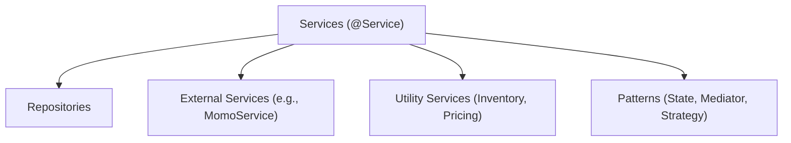

**Diagram sources**
- [BookingServiceImpl.java:32-260](file://backend/src/main/java/com/cinema/booking/services/impl/BookingServiceImpl.java#L32-L260)
- [CheckoutServiceImpl.java:25-185](file://backend/src/main/java/com/cinema/booking/services/impl/CheckoutServiceImpl.java#L25-L185)
- [SeatServiceImpl.java:27-203](file://backend/src/main/java/com/cinema/booking/services/impl/SeatServiceImpl.java#L27-L203)
- [FnbItemInventoryServiceImpl.java:22-113](file://backend/src/main/java/com/cinema/booking/services/impl/FnbItemInventoryServiceImpl.java#L22-L113)

**Section sources**
- [BookingServiceImpl.java:32-260](file://backend/src/main/java/com/cinema/booking/services/impl/BookingServiceImpl.java#L32-L260)
- [CheckoutServiceImpl.java:25-185](file://backend/src/main/java/com/cinema/booking/services/impl/CheckoutServiceImpl.java#L25-L185)
- [SeatServiceImpl.java:27-203](file://backend/src/main/java/com/cinema/booking/services/impl/SeatServiceImpl.java#L27-L203)
- [FnbItemInventoryServiceImpl.java:22-113](file://backend/src/main/java/com/cinema/booking/services/impl/FnbItemInventoryServiceImpl.java#L22-L113)

## Performance Considerations
- Caching:
  - Pricing engine is proxied with a caching layer to reduce repeated calculations for identical contexts.
  - Seat lock checks use batch operations to minimize round-trips to Redis.
- Concurrency:
  - Seat locking uses Redis SETNX semantics with TTL to prevent race conditions.
  - Inventory updates use pessimistic locking (e.g., findByItemIdForUpdate) to avoid overselling.
- Transactions:
  - Business operations are wrapped in @Transactional boundaries to ensure atomicity across related writes.
- Queries:
  - Seat status computation uses targeted repository queries to avoid unnecessary data loading.
- External calls:
  - MoMo callback verification and post-payment mediation are centralized to reduce duplication and improve reliability.

**Section sources**
- [BookingServiceImpl.java:63-68](file://backend/src/main/java/com/cinema/booking/services/impl/BookingServiceImpl.java#L63-L68)
- [RedisSeatLockAdapter.java:27-54](file://backend/src/main/java/com/cinema/booking/services/seatlock/RedisSeatLockAdapter.java#L27-L54)
- [FnbItemInventoryServiceImpl.java:74-82](file://backend/src/main/java/com/cinema/booking/services/impl/FnbItemInventoryServiceImpl.java#L74-L82)
- [CheckoutServiceImpl.java:66-130](file://backend/src/main/java/com/cinema/booking/services/impl/CheckoutServiceImpl.java#L66-L130)

## Troubleshooting Guide
Common issues and strategies:
- Seat conflicts during replacement:
  - Duplicate seat codes trigger a bad request error.
  - Seats with existing tickets cannot be deleted; a conflict error is raised.
- Payment failures:
  - MoMo callback signature verification failures lead to runtime errors.
  - Unrecognized booking IDs in callbacks cause errors; ensure extraData correctness.
- Pricing validation failures:
  - Validation handlers throw runtime exceptions when preconditions fail (e.g., seats not available, showtime in past).
- Inventory shortages:
  - Reservation requests exceeding available quantities raise exceptions; adjust order or restock.
- State transition errors:
  - Attempting invalid state transitions are prevented by BookingContext; ensure payment status aligns with intended state.

**Section sources**
- [SeatServiceImpl.java:131-161](file://backend/src/main/java/com/cinema/booking/services/impl/SeatServiceImpl.java#L131-L161)
- [CheckoutServiceImpl.java:69-75](file://backend/src/main/java/com/cinema/booking/services/impl/CheckoutServiceImpl.java#L69-L75)
- [CheckoutServiceImpl.java:83-84](file://backend/src/main/java/com/cinema/booking/services/impl/CheckoutServiceImpl.java#L83-L84)
- [FnbItemInventoryServiceImpl.java:74-82](file://backend/src/main/java/com/cinema/booking/services/impl/FnbItemInventoryServiceImpl.java#L74-L82)
- [BookingServiceImpl.java:118-126](file://backend/src/main/java/com/cinema/booking/services/impl/BookingServiceImpl.java#L118-L126)

## Conclusion
The service layer implements robust business logic with clear contracts, strong transactional boundaries, and modularized patterns. Seat management, payment processing, and inventory control are decoupled via interfaces and adapters, enabling scalability and maintainability. Validation and error handling are centralized to ensure predictable behavior and reliable user experiences.

## Appendices

### Testing Approaches and Mocking Strategies
- Unit tests:
  - Mock repositories and external services (e.g., MomoService, RedisSeatLockAdapter) using @MockBean.
  - Verify service method calls and transaction boundaries using @Transactional tests.
- Integration tests:
  - Use @DataJpaTest for repository layers and @WebMvcTest for controller-to-service boundaries.
  - Spin up embedded Redis for seat lock tests; use test containers for external integrations.
- Behavior-driven tests:
  - Scenario-style tests for checkout flows (success/failure) and state transitions.

[No sources needed since this section provides general guidance]