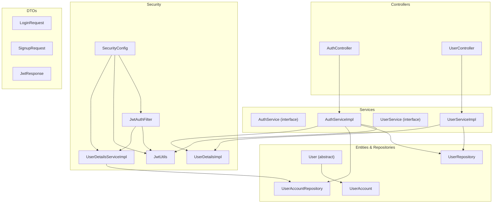
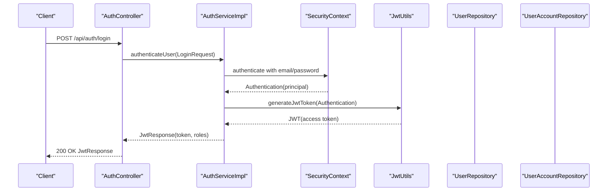
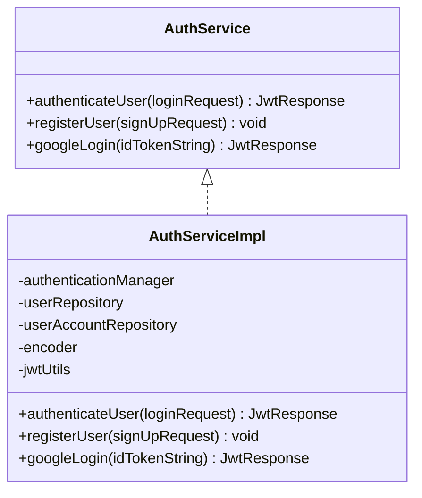
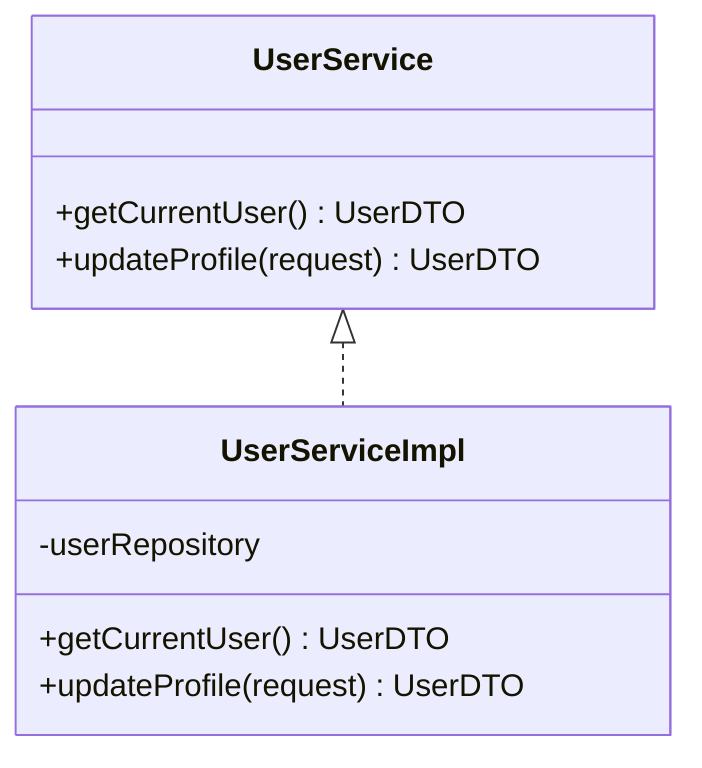
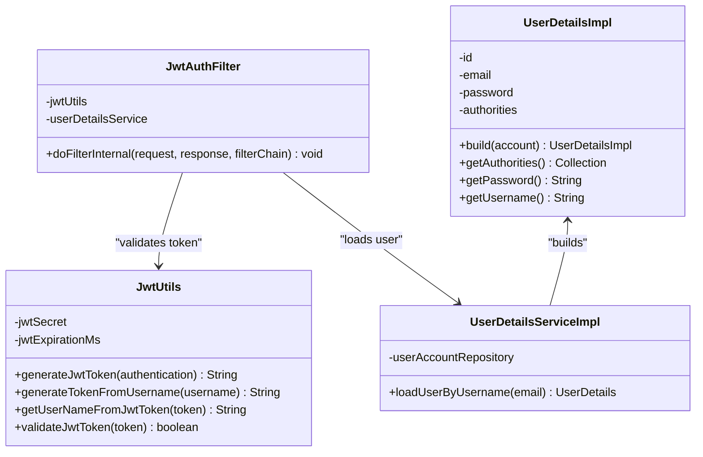
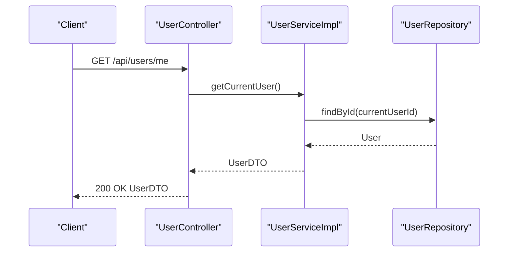
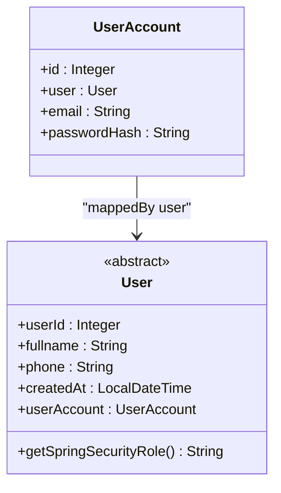
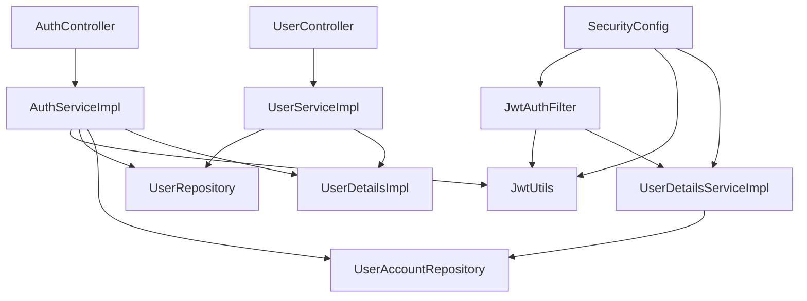

# User Management Services

<cite>
**Referenced Files in This Document**
- [AuthService.java](file://backend/src/main/java/com/cinema/booking/services/AuthService.java)
- [AuthServiceImpl.java](file://backend/src/main/java/com/cinema/booking/services/impl/AuthServiceImpl.java)
- [UserService.java](file://backend/src/main/java/com/cinema/booking/services/UserService.java)
- [UserServiceImpl.java](file://backend/src/main/java/com/cinema/booking/services/impl/UserServiceImpl.java)
- [AuthController.java](file://backend/src/main/java/com/cinema/booking/controllers/AuthController.java)
- [UserController.java](file://backend/src/main/java/com/cinema/booking/controllers/UserController.java)
- [JwtUtils.java](file://backend/src/main/java/com/cinema/booking/security/JwtUtils.java)
- [JwtAuthFilter.java](file://backend/src/main/java/com/cinema/booking/security/JwtAuthFilter.java)
- [UserDetailsImpl.java](file://backend/src/main/java/com/cinema/booking/security/UserDetailsImpl.java)
- [UserDetailsServiceImpl.java](file://backend/src/main/java/com/cinema/booking/security/UserDetailsServiceImpl.java)
- [SecurityConfig.java](file://backend/src/main/java/com/cinema/booking/config/SecurityConfig.java)
- [LoginRequest.java](file://backend/src/main/java/com/cinema/booking/dtos/LoginRequest.java)
- [SignupRequest.java](file://backend/src/main/java/com/cinema/booking/dtos/SignupRequest.java)
- [JwtResponse.java](file://backend/src/main/java/com/cinema/booking/dtos/JwtResponse.java)
- [User.java](file://backend/src/main/java/com/cinema/booking/entities/User.java)
- [UserAccount.java](file://backend/src/main/java/com/cinema/booking/entities/UserAccount.java)
- [UserRepository.java](file://backend/src/main/java/com/cinema/booking/repositories/UserRepository.java)
- [UserAccountRepository.java](file://backend/src/main/java/com/cinema/booking/repositories/UserAccountRepository.java)
- [application.properties](file://backend/src/main/resources/application.properties)
</cite>

## Table of Contents
1. [Introduction](#introduction)
2. [Project Structure](#project-structure)
3. [Core Components](#core-components)
4. [Architecture Overview](#architecture-overview)
5. [Detailed Component Analysis](#detailed-component-analysis)
6. [Dependency Analysis](#dependency-analysis)
7. [Performance Considerations](#performance-considerations)
8. [Troubleshooting Guide](#troubleshooting-guide)
9. [Conclusion](#conclusion)

## Introduction
This document provides comprehensive documentation for the user management services in the cinema booking system. It covers authentication, authorization, and user profile management, focusing on:
- AuthService implementation for JWT token generation, user registration, and login validation
- UserService for user data operations, profile updates, and role management
- Security implementations including password hashing, JWT configuration, and role-based access control
- Practical examples of user authentication flows, session management, and permission checking
- Service interfaces, exception handling, and integration with Spring Security components

## Project Structure
The user management subsystem is organized around Spring MVC controllers, service interfaces and implementations, Spring Security components, DTOs, entities, and repositories. Controllers expose REST endpoints, services encapsulate business logic, and security components enforce authentication and authorization.

**Diagram sources**
- [AuthController.java:1-54](file://backend/src/main/java/com/cinema/booking/controllers/AuthController.java#L1-L54)
- [UserController.java:1-36](file://backend/src/main/java/com/cinema/booking/controllers/UserController.java#L1-L36)
- [AuthService.java:1-12](file://backend/src/main/java/com/cinema/booking/services/AuthService.java#L1-L12)
- [AuthServiceImpl.java:1-139](file://backend/src/main/java/com/cinema/booking/services/impl/AuthServiceImpl.java#L1-L139)
- [UserService.java:1-10](file://backend/src/main/java/com/cinema/booking/services/UserService.java#L1-L10)
- [UserServiceImpl.java:1-52](file://backend/src/main/java/com/cinema/booking/services/impl/UserServiceImpl.java#L1-L52)
- [SecurityConfig.java:1-82](file://backend/src/main/java/com/cinema/booking/config/SecurityConfig.java#L1-L82)
- [JwtAuthFilter.java:1-64](file://backend/src/main/java/com/cinema/booking/security/JwtAuthFilter.java#L1-L64)
- [JwtUtils.java:1-71](file://backend/src/main/java/com/cinema/booking/security/JwtUtils.java#L1-L71)
- [UserDetailsImpl.java:1-76](file://backend/src/main/java/com/cinema/booking/security/UserDetailsImpl.java#L1-L76)
- [UserDetailsServiceImpl.java:1-27](file://backend/src/main/java/com/cinema/booking/security/UserDetailsServiceImpl.java#L1-L27)
- [LoginRequest.java:1-14](file://backend/src/main/java/com/cinema/booking/dtos/LoginRequest.java#L1-L14)
- [SignupRequest.java:1-25](file://backend/src/main/java/com/cinema/booking/dtos/SignupRequest.java#L1-L25)
- [JwtResponse.java:1-24](file://backend/src/main/java/com/cinema/booking/dtos/JwtResponse.java#L1-L24)
- [User.java:1-38](file://backend/src/main/java/com/cinema/booking/entities/User.java#L1-L38)
- [UserAccount.java:1-30](file://backend/src/main/java/com/cinema/booking/entities/UserAccount.java#L1-L30)
- [UserRepository.java:1-16](file://backend/src/main/java/com/cinema/booking/repositories/UserRepository.java#L1-L16)
- [UserAccountRepository.java:1-21](file://backend/src/main/java/com/cinema/booking/repositories/UserAccountRepository.java#L1-L21)

**Section sources**
- [AuthController.java:1-54](file://backend/src/main/java/com/cinema/booking/controllers/AuthController.java#L1-L54)
- [UserController.java:1-36](file://backend/src/main/java/com/cinema/booking/controllers/UserController.java#L1-L36)
- [AuthService.java:1-12](file://backend/src/main/java/com/cinema/booking/services/AuthService.java#L1-L12)
- [AuthServiceImpl.java:1-139](file://backend/src/main/java/com/cinema/booking/services/impl/AuthServiceImpl.java#L1-L139)
- [UserService.java:1-10](file://backend/src/main/java/com/cinema/booking/services/UserService.java#L1-L10)
- [UserServiceImpl.java:1-52](file://backend/src/main/java/com/cinema/booking/services/impl/UserServiceImpl.java#L1-L52)
- [SecurityConfig.java:1-82](file://backend/src/main/java/com/cinema/booking/config/SecurityConfig.java#L1-L82)
- [JwtAuthFilter.java:1-64](file://backend/src/main/java/com/cinema/booking/security/JwtAuthFilter.java#L1-L64)
- [JwtUtils.java:1-71](file://backend/src/main/java/com/cinema/booking/security/JwtUtils.java#L1-L71)
- [UserDetailsImpl.java:1-76](file://backend/src/main/java/com/cinema/booking/security/UserDetailsImpl.java#L1-L76)
- [UserDetailsServiceImpl.java:1-27](file://backend/src/main/java/com/cinema/booking/security/UserDetailsServiceImpl.java#L1-L27)
- [LoginRequest.java:1-14](file://backend/src/main/java/com/cinema/booking/dtos/LoginRequest.java#L1-L14)
- [SignupRequest.java:1-25](file://backend/src/main/java/com/cinema/booking/dtos/SignupRequest.java#L1-L25)
- [JwtResponse.java:1-24](file://backend/src/main/java/com/cinema/booking/dtos/JwtResponse.java#L1-L24)
- [User.java:1-38](file://backend/src/main/java/com/cinema/booking/entities/User.java#L1-L38)
- [UserAccount.java:1-30](file://backend/src/main/java/com/cinema/booking/entities/UserAccount.java#L1-L30)
- [UserRepository.java:1-16](file://backend/src/main/java/com/cinema/booking/repositories/UserRepository.java#L1-L16)
- [UserAccountRepository.java:1-21](file://backend/src/main/java/com/cinema/booking/repositories/UserAccountRepository.java#L1-L21)

## Core Components
- AuthService: Defines authentication operations including local login, registration, and Google login, returning JWT tokens and user roles.
- UserService: Provides current user retrieval and profile update capabilities with transactional guarantees.
- SecurityConfig: Configures Spring Security, method-level security, CORS, and role-based authorization rules.
- JwtUtils: Implements JWT token generation, parsing, and validation using HMAC-SHA signing.
- JwtAuthFilter: Extracts JWT from Authorization headers, validates tokens, loads user details, and establishes authentication context.
- UserDetailsImpl/UserDetailsServiceImpl: Bridges domain entities to Spring Security’s UserDetails contract and loads user details by email.
- DTOs: Encapsulate request/response payloads for login, registration, and JWT responses.
- Entities and Repositories: Model user hierarchy and account credentials, with repositories supporting lookup and existence checks.

**Section sources**
- [AuthService.java:1-12](file://backend/src/main/java/com/cinema/booking/services/AuthService.java#L1-L12)
- [AuthServiceImpl.java:1-139](file://backend/src/main/java/com/cinema/booking/services/impl/AuthServiceImpl.java#L1-L139)
- [UserService.java:1-10](file://backend/src/main/java/com/cinema/booking/services/UserService.java#L1-L10)
- [UserServiceImpl.java:1-52](file://backend/src/main/java/com/cinema/booking/services/impl/UserServiceImpl.java#L1-L52)
- [SecurityConfig.java:1-82](file://backend/src/main/java/com/cinema/booking/config/SecurityConfig.java#L1-L82)
- [JwtUtils.java:1-71](file://backend/src/main/java/com/cinema/booking/security/JwtUtils.java#L1-L71)
- [JwtAuthFilter.java:1-64](file://backend/src/main/java/com/cinema/booking/security/JwtAuthFilter.java#L1-L64)
- [UserDetailsImpl.java:1-76](file://backend/src/main/java/com/cinema/booking/security/UserDetailsImpl.java#L1-L76)
- [UserDetailsServiceImpl.java:1-27](file://backend/src/main/java/com/cinema/booking/security/UserDetailsServiceImpl.java#L1-L27)
- [LoginRequest.java:1-14](file://backend/src/main/java/com/cinema/booking/dtos/LoginRequest.java#L1-L14)
- [SignupRequest.java:1-25](file://backend/src/main/java/com/cinema/booking/dtos/SignupRequest.java#L1-L25)
- [JwtResponse.java:1-24](file://backend/src/main/java/com/cinema/booking/dtos/JwtResponse.java#L1-L24)
- [User.java:1-38](file://backend/src/main/java/com/cinema/booking/entities/User.java#L1-L38)
- [UserAccount.java:1-30](file://backend/src/main/java/com/cinema/booking/entities/UserAccount.java#L1-L30)
- [UserRepository.java:1-16](file://backend/src/main/java/com/cinema/booking/repositories/UserRepository.java#L1-L16)
- [UserAccountRepository.java:1-21](file://backend/src/main/java/com/cinema/booking/repositories/UserAccountRepository.java#L1-L21)

## Architecture Overview
The system enforces stateless authentication via JWT. Requests pass through a dedicated JWT filter that validates tokens and populates the security context. Controllers delegate to services for business logic, while repositories handle persistence. Role-based access control is enforced at both HTTP and method levels.

**Diagram sources**
- [AuthController.java:21-31](file://backend/src/main/java/com/cinema/booking/controllers/AuthController.java#L21-L31)
- [AuthServiceImpl.java:44-61](file://backend/src/main/java/com/cinema/booking/services/impl/AuthServiceImpl.java#L44-L61)
- [JwtUtils.java:30-39](file://backend/src/main/java/com/cinema/booking/security/JwtUtils.java#L30-L39)
- [UserRepository.java:1-16](file://backend/src/main/java/com/cinema/booking/repositories/UserRepository.java#L1-L16)
- [UserAccountRepository.java:1-21](file://backend/src/main/java/com/cinema/booking/repositories/UserAccountRepository.java#L1-L21)

**Section sources**
- [AuthController.java:1-54](file://backend/src/main/java/com/cinema/booking/controllers/AuthController.java#L1-L54)
- [AuthServiceImpl.java:1-139](file://backend/src/main/java/com/cinema/booking/services/impl/AuthServiceImpl.java#L1-L139)
- [JwtUtils.java:1-71](file://backend/src/main/java/com/cinema/booking/security/JwtUtils.java#L1-L71)
- [SecurityConfig.java:1-82](file://backend/src/main/java/com/cinema/booking/config/SecurityConfig.java#L1-L82)

## Detailed Component Analysis

### Authentication Service (AuthService and AuthServiceImpl)
- Responsibilities:
  - Local login: Validates credentials, sets authentication context, generates JWT, and returns user roles.
  - Registration: Checks email uniqueness, creates a Customer and associated UserAccount with hashed password, persists, and attempts to send a welcome email.
  - Google login: Verifies Google ID token against configured client ID, retrieves user info, lazily creates accounts if missing, and issues JWT.
- Security:
  - Uses BCrypt for password hashing.
  - Uses JWT for stateless session tokens.
  - Integrates with Spring Security’s AuthenticationManager and JwtUtils.
- Error handling:
  - Throws runtime exceptions for invalid credentials, duplicate emails, and Google verification failures.

**Diagram sources**
- [AuthService.java:1-12](file://backend/src/main/java/com/cinema/booking/services/AuthService.java#L1-L12)
- [AuthServiceImpl.java:1-139](file://backend/src/main/java/com/cinema/booking/services/impl/AuthServiceImpl.java#L1-L139)

**Section sources**
- [AuthService.java:1-12](file://backend/src/main/java/com/cinema/booking/services/AuthService.java#L1-L12)
- [AuthServiceImpl.java:1-139](file://backend/src/main/java/com/cinema/booking/services/impl/AuthServiceImpl.java#L1-L139)
- [LoginRequest.java:1-14](file://backend/src/main/java/com/cinema/booking/dtos/LoginRequest.java#L1-L14)
- [SignupRequest.java:1-25](file://backend/src/main/java/com/cinema/booking/dtos/SignupRequest.java#L1-L25)
- [JwtResponse.java:1-24](file://backend/src/main/java/com/cinema/booking/dtos/JwtResponse.java#L1-L24)

### User Profile Service (UserService and UserServiceImpl)
- Responsibilities:
  - getCurrentUser: Retrieves the authenticated user’s profile using the principal’s ID.
  - updateProfile: Updates fullname and/or phone for the authenticated user.
- Security:
  - Uses SecurityContextHolder to obtain the current principal and enforce identity-based operations.
- Error handling:
  - Throws runtime exceptions when the user is not found.

**Diagram sources**
- [UserService.java:1-10](file://backend/src/main/java/com/cinema/booking/services/UserService.java#L1-L10)
- [UserServiceImpl.java:1-52](file://backend/src/main/java/com/cinema/booking/services/impl/UserServiceImpl.java#L1-L52)

**Section sources**
- [UserService.java:1-10](file://backend/src/main/java/com/cinema/booking/services/UserService.java#L1-L10)
- [UserServiceImpl.java:1-52](file://backend/src/main/java/com/cinema/booking/services/impl/UserServiceImpl.java#L1-L52)
- [UserController.java:1-36](file://backend/src/main/java/com/cinema/booking/controllers/UserController.java#L1-L36)

### Security Components
- JwtUtils:
  - Generates JWT with subject, issued at, expiration, and HS256 signature.
  - Parses and validates tokens, logging specific error categories.
- JwtAuthFilter:
  - Extracts Bearer token from Authorization header.
  - Validates token and loads UserDetails to establish authentication in the security context.
- UserDetailsImpl/UserDetailsServiceImpl:
  - Builds UserDetails from UserAccount, mapping the domain role to a Spring Security authority prefixed with ROLE_.
  - Loads user details by email with joined fetch to avoid lazy loading issues.
- SecurityConfig:
  - Disables CSRF and configures stateless sessions.
  - Sets up method-level security with @PreAuthorize.
  - Defines permitAll and role-based rules for various endpoints.
  - Registers JwtAuthFilter before UsernamePasswordAuthenticationFilter.

**Diagram sources**
- [JwtUtils.java:1-71](file://backend/src/main/java/com/cinema/booking/security/JwtUtils.java#L1-L71)
- [JwtAuthFilter.java:1-64](file://backend/src/main/java/com/cinema/booking/security/JwtAuthFilter.java#L1-L64)
- [UserDetailsImpl.java:1-76](file://backend/src/main/java/com/cinema/booking/security/UserDetailsImpl.java#L1-L76)
- [UserDetailsServiceImpl.java:1-27](file://backend/src/main/java/com/cinema/booking/security/UserDetailsServiceImpl.java#L1-L27)

**Section sources**
- [JwtUtils.java:1-71](file://backend/src/main/java/com/cinema/booking/security/JwtUtils.java#L1-L71)
- [JwtAuthFilter.java:1-64](file://backend/src/main/java/com/cinema/booking/security/JwtAuthFilter.java#L1-L64)
- [UserDetailsImpl.java:1-76](file://backend/src/main/java/com/cinema/booking/security/UserDetailsImpl.java#L1-L76)
- [UserDetailsServiceImpl.java:1-27](file://backend/src/main/java/com/cinema/booking/security/UserDetailsServiceImpl.java#L1-L27)
- [SecurityConfig.java:1-82](file://backend/src/main/java/com/cinema/booking/config/SecurityConfig.java#L1-L82)

### Controllers and DTOs
- AuthController:
  - Exposes /api/auth/login, /api/auth/register, and /api/auth/google-login.
  - Wraps service responses in ResponseEntity and MessageResponse for errors.
- UserController:
  - Exposes /api/users/me for GET and PUT profile operations.
  - Enforces role-based access using @PreAuthorize.
- DTOs:
  - LoginRequest: email and password.
  - SignupRequest: fullname, email, password, phone.
  - JwtResponse: token, type, id, email, roles.

**Diagram sources**
- [UserController.java:22-27](file://backend/src/main/java/com/cinema/booking/controllers/UserController.java#L22-L27)
- [UserServiceImpl.java:25-32](file://backend/src/main/java/com/cinema/booking/services/impl/UserServiceImpl.java#L25-L32)
- [UserRepository.java:1-16](file://backend/src/main/java/com/cinema/booking/repositories/UserRepository.java#L1-L16)

**Section sources**
- [AuthController.java:1-54](file://backend/src/main/java/com/cinema/booking/controllers/AuthController.java#L1-L54)
- [UserController.java:1-36](file://backend/src/main/java/com/cinema/booking/controllers/UserController.java#L1-L36)
- [LoginRequest.java:1-14](file://backend/src/main/java/com/cinema/booking/dtos/LoginRequest.java#L1-L14)
- [SignupRequest.java:1-25](file://backend/src/main/java/com/cinema/booking/dtos/SignupRequest.java#L1-L25)
- [JwtResponse.java:1-24](file://backend/src/main/java/com/cinema/booking/dtos/JwtResponse.java#L1-L24)

### Entities and Repositories
- User (abstract):
  - Base entity with userId, fullname, phone, createdAt, and a OneToOne relationship to UserAccount.
  - Declares getSpringSecurityRole() to define the role name used by Spring Security.
- UserAccount:
  - Links to User, stores email and passwordHash.
- Repositories:
  - UserRepository: JPA repository for User with phone-based queries.
  - UserAccountRepository: JPA repository with a custom query to fetch UserAccount with User eagerly.

**Diagram sources**
- [User.java:1-38](file://backend/src/main/java/com/cinema/booking/entities/User.java#L1-L38)
- [UserAccount.java:1-30](file://backend/src/main/java/com/cinema/booking/entities/UserAccount.java#L1-L30)

**Section sources**
- [User.java:1-38](file://backend/src/main/java/com/cinema/booking/entities/User.java#L1-L38)
- [UserAccount.java:1-30](file://backend/src/main/java/com/cinema/booking/entities/UserAccount.java#L1-L30)
- [UserRepository.java:1-16](file://backend/src/main/java/com/cinema/booking/repositories/UserRepository.java#L1-L16)
- [UserAccountRepository.java:1-21](file://backend/src/main/java/com/cinema/booking/repositories/UserAccountRepository.java#L1-L21)

## Dependency Analysis
- Controllers depend on services for business logic.
- Services depend on repositories for persistence and on JwtUtils for token operations.
- SecurityConfig registers JwtAuthFilter and configures method security and HTTP security rules.
- JwtAuthFilter depends on JwtUtils and UserDetailsServiceImpl.
- UserDetailsImpl is built from UserAccount and maps to GrantedAuthority.

**Diagram sources**
- [AuthController.java:1-54](file://backend/src/main/java/com/cinema/booking/controllers/AuthController.java#L1-L54)
- [UserController.java:1-36](file://backend/src/main/java/com/cinema/booking/controllers/UserController.java#L1-L36)
- [AuthServiceImpl.java:1-139](file://backend/src/main/java/com/cinema/booking/services/impl/AuthServiceImpl.java#L1-L139)
- [UserServiceImpl.java:1-52](file://backend/src/main/java/com/cinema/booking/services/impl/UserServiceImpl.java#L1-L52)
- [SecurityConfig.java:1-82](file://backend/src/main/java/com/cinema/booking/config/SecurityConfig.java#L1-L82)
- [JwtAuthFilter.java:1-64](file://backend/src/main/java/com/cinema/booking/security/JwtAuthFilter.java#L1-L64)
- [JwtUtils.java:1-71](file://backend/src/main/java/com/cinema/booking/security/JwtUtils.java#L1-L71)
- [UserDetailsServiceImpl.java:1-27](file://backend/src/main/java/com/cinema/booking/security/UserDetailsServiceImpl.java#L1-L27)
- [UserRepository.java:1-16](file://backend/src/main/java/com/cinema/booking/repositories/UserRepository.java#L1-L16)
- [UserAccountRepository.java:1-21](file://backend/src/main/java/com/cinema/booking/repositories/UserAccountRepository.java#L1-L21)

**Section sources**
- [AuthController.java:1-54](file://backend/src/main/java/com/cinema/booking/controllers/AuthController.java#L1-L54)
- [UserController.java:1-36](file://backend/src/main/java/com/cinema/booking/controllers/UserController.java#L1-L36)
- [AuthServiceImpl.java:1-139](file://backend/src/main/java/com/cinema/booking/services/impl/AuthServiceImpl.java#L1-L139)
- [UserServiceImpl.java:1-52](file://backend/src/main/java/com/cinema/booking/services/impl/UserServiceImpl.java#L1-L52)
- [SecurityConfig.java:1-82](file://backend/src/main/java/com/cinema/booking/config/SecurityConfig.java#L1-L82)
- [JwtAuthFilter.java:1-64](file://backend/src/main/java/com/cinema/booking/security/JwtAuthFilter.java#L1-L64)
- [JwtUtils.java:1-71](file://backend/src/main/java/com/cinema/booking/security/JwtUtils.java#L1-L71)
- [UserDetailsServiceImpl.java:1-27](file://backend/src/main/java/com/cinema/booking/security/UserDetailsServiceImpl.java#L1-L27)
- [UserRepository.java:1-16](file://backend/src/main/java/com/cinema/booking/repositories/UserRepository.java#L1-L16)
- [UserAccountRepository.java:1-21](file://backend/src/main/java/com/cinema/booking/repositories/UserAccountRepository.java#L1-L21)

## Performance Considerations
- JWT Stateless Sessions: Eliminates server-side session storage overhead and improves scalability.
- Lazy Loading Prevention: UserDetailsServiceImpl uses a joined fetch to load User along with UserAccount, reducing N+1 select risks.
- Password Hashing: BCrypt is computationally intensive; ensure appropriate cost factors for your deployment environment.
- Token Expiration: Short to moderate expiration reduces token lifetime risk; consider refresh token strategies for long-lived sessions.
- Repository Queries: Custom queries with joins minimize round trips; ensure proper indexing on email and phone columns.

[No sources needed since this section provides general guidance]

## Troubleshooting Guide
- Authentication Failures:
  - Verify Authorization header format: "Bearer <token>".
  - Confirm JWT secret and expiration settings match configuration.
  - Check that the user exists and credentials are correct.
- Registration Errors:
  - Duplicate email triggers a runtime exception; ensure uniqueness validation.
  - Confirm email service availability if welcome email sending fails.
- Google Login Issues:
  - Validate client ID matches the configured audience.
  - Ensure Google ID token is present and unexpired.
- Role-Based Access Denied:
  - Confirm the user’s role aligns with the endpoint’s required roles.
  - Verify method-level security is enabled in SecurityConfig.
- Token Validation Errors:
  - Inspect logs for malformed, expired, or unsupported token messages.
  - Ensure clock synchronization and consistent JWT secret across instances.

**Section sources**
- [AuthController.java:21-31](file://backend/src/main/java/com/cinema/booking/controllers/AuthController.java#L21-L31)
- [AuthController.java:33-41](file://backend/src/main/java/com/cinema/booking/controllers/AuthController.java#L33-L41)
- [AuthController.java:43-52](file://backend/src/main/java/com/cinema/booking/controllers/AuthController.java#L43-L52)
- [JwtUtils.java:55-69](file://backend/src/main/java/com/cinema/booking/security/JwtUtils.java#L55-L69)
- [SecurityConfig.java:66-74](file://backend/src/main/java/com/cinema/booking/config/SecurityConfig.java#L66-L74)

## Conclusion
The user management services implement a robust, stateless authentication and authorization framework using Spring Security and JWT. AuthService handles secure login and registration flows, while UserService manages user profiles with role-aware access controls. SecurityConfig, JwtUtils, and JwtAuthFilter collectively enforce token validation and method-level permissions. The design leverages clear separation of concerns, strong typing via DTOs, and defensive error handling to deliver a maintainable and secure system.