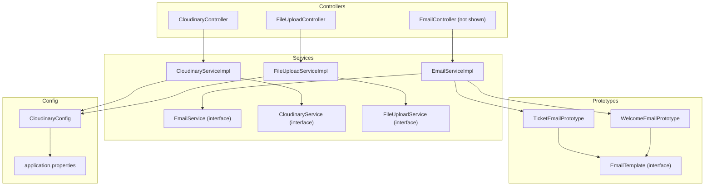
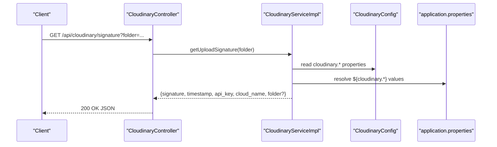
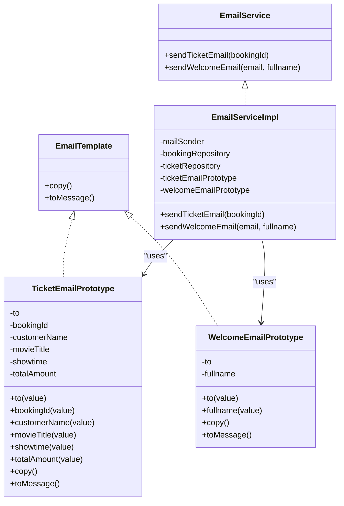
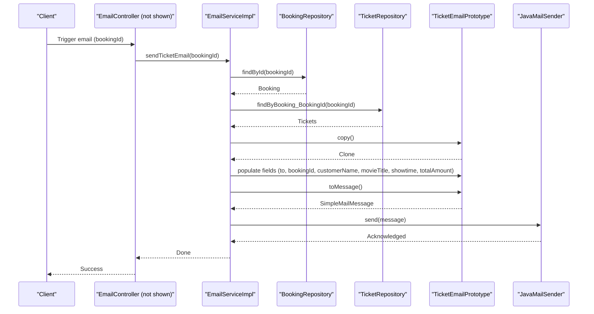
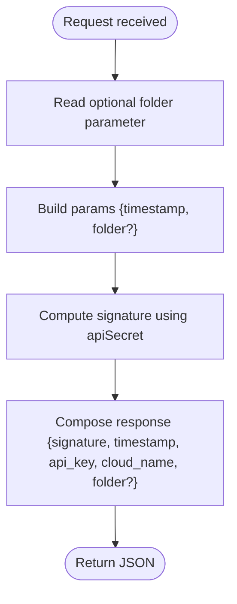
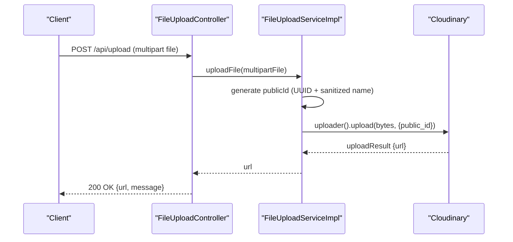
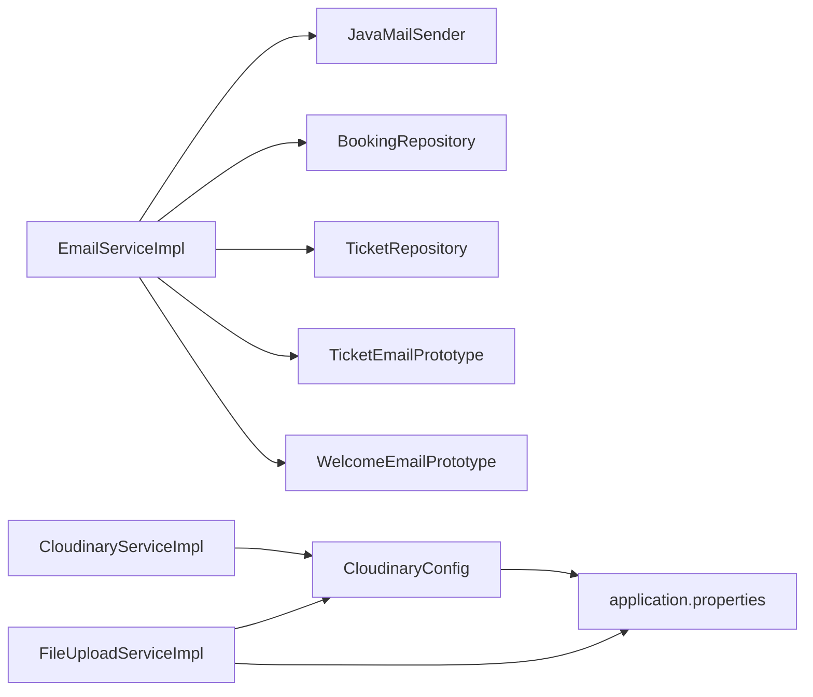

# Utility Services

<cite>
**Referenced Files in This Document**
- [EmailServiceImpl.java](file://backend/src/main/java/com/cinema/booking/services/impl/EmailServiceImpl.java)
- [EmailService.java](file://backend/src/main/java/com/cinema/booking/services/EmailService.java)
- [TicketEmailPrototype.java](file://backend/src/main/java/com/cinema/booking/patterns/prototype/TicketEmailPrototype.java)
- [WelcomeEmailPrototype.java](file://backend/src/main/java/com/cinema/booking/patterns/prototype/WelcomeEmailPrototype.java)
- [EmailTemplate.java](file://backend/src/main/java/com/cinema/booking/patterns/prototype/EmailTemplate.java)
- [CloudinaryServiceImpl.java](file://backend/src/main/java/com/cinema/booking/services/impl/CloudinaryServiceImpl.java)
- [CloudinaryService.java](file://backend/src/main/java/com/cinema/booking/services/CloudinaryService.java)
- [CloudinaryConfig.java](file://backend/src/main/java/com/cinema/booking/config/CloudinaryConfig.java)
- [CloudinaryController.java](file://backend/src/main/java/com/cinema/booking/controllers/CloudinaryController.java)
- [FileUploadServiceImpl.java](file://backend/src/main/java/com/cinema/booking/services/impl/FileUploadServiceImpl.java)
- [FileUploadService.java](file://backend/src/main/java/com/cinema/booking/services/FileUploadService.java)
- [FileUploadController.java](file://backend/src/main/java/com/cinema/booking/controllers/FileUploadController.java)
- [application.properties](file://backend/src/main/resources/application.properties)
</cite>

## Table of Contents
1. [Introduction](#introduction)
2. [Project Structure](#project-structure)
3. [Core Components](#core-components)
4. [Architecture Overview](#architecture-overview)
5. [Detailed Component Analysis](#detailed-component-analysis)
6. [Dependency Analysis](#dependency-analysis)
7. [Performance Considerations](#performance-considerations)
8. [Troubleshooting Guide](#troubleshooting-guide)
9. [Conclusion](#conclusion)

## Introduction
This document provides comprehensive documentation for three utility services that support the application’s operational needs:
- Email notification automation via EmailServiceImpl, including template management and email delivery.
- Media file upload and image management integration via CloudinaryServiceImpl and related configuration.
- File handling, validation, and storage management via FileUploadServiceImpl.

It explains service configuration, integration patterns, error handling strategies, and performance considerations for utility operations. Examples illustrate email template usage and file upload workflows.

## Project Structure
The utility services are implemented under the services package and supported by configuration and prototype pattern components:
- Email service and prototypes under services/impl and patterns/prototype.
- Cloudinary service and configuration under services/impl and config.
- Controllers exposing endpoints for client integration.
- Application configuration for mail, Cloudinary, and multipart limits.

**Diagram sources**
- [EmailServiceImpl.java:21-97](file://backend/src/main/java/com/cinema/booking/services/impl/EmailServiceImpl.java#L21-L97)
- [EmailService.java:3-6](file://backend/src/main/java/com/cinema/booking/services/EmailService.java#L3-L6)
- [TicketEmailPrototype.java:14-59](file://backend/src/main/java/com/cinema/booking/patterns/prototype/TicketEmailPrototype.java#L14-L59)
- [WelcomeEmailPrototype.java:10-40](file://backend/src/main/java/com/cinema/booking/patterns/prototype/WelcomeEmailPrototype.java#L10-L40)
- [EmailTemplate.java:9-15](file://backend/src/main/java/com/cinema/booking/patterns/prototype/EmailTemplate.java#L9-L15)
- [CloudinaryServiceImpl.java:14-48](file://backend/src/main/java/com/cinema/booking/services/impl/CloudinaryServiceImpl.java#L14-L48)
- [CloudinaryService.java:5-7](file://backend/src/main/java/com/cinema/booking/services/CloudinaryService.java#L5-L7)
- [CloudinaryConfig.java:12-31](file://backend/src/main/java/com/cinema/booking/config/CloudinaryConfig.java#L12-L31)
- [FileUploadServiceImpl.java:16-38](file://backend/src/main/java/com/cinema/booking/services/impl/FileUploadServiceImpl.java#L16-L38)
- [FileUploadService.java:6-8](file://backend/src/main/java/com/cinema/booking/services/FileUploadService.java#L6-L8)
- [CloudinaryController.java:16-32](file://backend/src/main/java/com/cinema/booking/controllers/CloudinaryController.java#L16-L32)
- [FileUploadController.java:16-39](file://backend/src/main/java/com/cinema/booking/controllers/FileUploadController.java#L16-L39)
- [application.properties:49-97](file://backend/src/main/resources/application.properties#L49-L97)

**Section sources**
- [EmailServiceImpl.java:21-97](file://backend/src/main/java/com/cinema/booking/services/impl/EmailServiceImpl.java#L21-L97)
- [CloudinaryServiceImpl.java:14-48](file://backend/src/main/java/com/cinema/booking/services/impl/CloudinaryServiceImpl.java#L14-L48)
- [FileUploadServiceImpl.java:16-38](file://backend/src/main/java/com/cinema/booking/services/impl/FileUploadServiceImpl.java#L16-L38)
- [application.properties:49-97](file://backend/src/main/resources/application.properties#L49-L97)

## Core Components
- EmailServiceImpl: Implements email delivery for tickets and welcome messages using prototype-based templates and Spring’s JavaMailSender.
- CloudinaryServiceImpl: Provides signed upload parameters and credentials for client-side uploads to Cloudinary.
- FileUploadServiceImpl: Handles server-side file uploads to Cloudinary with safe naming and returns the public URL.
- Prototypes: TicketEmailPrototype and WelcomeEmailPrototype encapsulate email content templates and support cloning for per-message customization.

Key responsibilities:
- EmailServiceImpl orchestrates template population, message creation, and delivery.
- CloudinaryServiceImpl generates signatures and credentials for secure client uploads.
- FileUploadServiceImpl validates and stores files via Cloudinary, returning accessible URLs.

**Section sources**
- [EmailServiceImpl.java:21-97](file://backend/src/main/java/com/cinema/booking/services/impl/EmailServiceImpl.java#L21-L97)
- [CloudinaryServiceImpl.java:14-48](file://backend/src/main/java/com/cinema/booking/services/impl/CloudinaryServiceImpl.java#L14-L48)
- [FileUploadServiceImpl.java:16-38](file://backend/src/main/java/com/cinema/booking/services/impl/FileUploadServiceImpl.java#L16-L38)
- [TicketEmailPrototype.java:14-59](file://backend/src/main/java/com/cinema/booking/patterns/prototype/TicketEmailPrototype.java#L14-L59)
- [WelcomeEmailPrototype.java:10-40](file://backend/src/main/java/com/cinema/booking/patterns/prototype/WelcomeEmailPrototype.java#L10-L40)

## Architecture Overview
The utility services integrate with Spring-managed components and external systems:
- EmailServiceImpl depends on JavaMailSender, BookingRepository, TicketRepository, and prototype templates.
- CloudinaryServiceImpl depends on Cloudinary SDK and configuration properties.
- FileUploadServiceImpl depends on Cloudinary SDK for upload operations.
- Controllers expose endpoints for clients to obtain Cloudinary credentials and upload files.

**Diagram sources**
- [CloudinaryController.java:21-25](file://backend/src/main/java/com/cinema/booking/controllers/CloudinaryController.java#L21-L25)
- [CloudinaryServiceImpl.java:26-48](file://backend/src/main/java/com/cinema/booking/services/impl/CloudinaryServiceImpl.java#L26-L48)
- [CloudinaryConfig.java:24-31](file://backend/src/main/java/com/cinema/booking/config/CloudinaryConfig.java#L24-L31)
- [application.properties:54-56](file://backend/src/main/resources/application.properties#L54-L56)

## Detailed Component Analysis

### Email Service: EmailServiceImpl
EmailServiceImpl automates email notifications using prototype-based templates:
- Template management: Two prototypes implement the EmailTemplate interface—TicketEmailPrototype for e-tickets and WelcomeEmailPrototype for new member welcome emails.
- Delivery pipeline: Retrieves booking/customer/ticket data, populates prototype fields, converts to SimpleMailMessage, and sends via JavaMailSender.
- Error handling: Logs errors during send attempts and continues without propagating exceptions.

**Diagram sources**
- [EmailService.java:3-6](file://backend/src/main/java/com/cinema/booking/services/EmailService.java#L3-L6)
- [EmailServiceImpl.java:21-97](file://backend/src/main/java/com/cinema/booking/services/impl/EmailServiceImpl.java#L21-L97)
- [EmailTemplate.java:9-15](file://backend/src/main/java/com/cinema/booking/patterns/prototype/EmailTemplate.java#L9-L15)
- [TicketEmailPrototype.java:14-59](file://backend/src/main/java/com/cinema/booking/patterns/prototype/TicketEmailPrototype.java#L14-L59)
- [WelcomeEmailPrototype.java:10-40](file://backend/src/main/java/com/cinema/booking/patterns/prototype/WelcomeEmailPrototype.java#L10-L40)

Email delivery workflow:

**Diagram sources**
- [EmailServiceImpl.java:41-80](file://backend/src/main/java/com/cinema/booking/services/impl/EmailServiceImpl.java#L41-L80)
- [TicketEmailPrototype.java:33-58](file://backend/src/main/java/com/cinema/booking/patterns/prototype/TicketEmailPrototype.java#L33-L58)

Example usage scenarios:
- Sending an e-ticket email after a successful booking by invoking sendTicketEmail with a valid booking identifier.
- Sending a welcome email upon user registration by invoking sendWelcomeEmail with recipient email and full name.

Error handling strategies:
- Graceful exit when booking is not found or customer email is missing.
- Try/catch around mail sending with console logging for failures.

**Section sources**
- [EmailServiceImpl.java:21-97](file://backend/src/main/java/com/cinema/booking/services/impl/EmailServiceImpl.java#L21-L97)
- [TicketEmailPrototype.java:14-59](file://backend/src/main/java/com/cinema/booking/patterns/prototype/TicketEmailPrototype.java#L14-L59)
- [WelcomeEmailPrototype.java:10-40](file://backend/src/main/java/com/cinema/booking/patterns/prototype/WelcomeEmailPrototype.java#L10-L40)

### Cloudinary Service: CloudinaryServiceImpl
CloudinaryServiceImpl enables secure client-side uploads by generating signed requests:
- Signature generation: Computes a signature using Cloudinary SDK with current timestamp and optional folder.
- Credentials exposure: Returns signature, timestamp, api_key, cloud_name, and optionally folder for client-side upload.

**Diagram sources**
- [CloudinaryServiceImpl.java:26-48](file://backend/src/main/java/com/cinema/booking/services/impl/CloudinaryServiceImpl.java#L26-L48)

Integration pattern:
- Controllers expose endpoints to fetch signature or credentials for client-side upload.
- Frontend uses returned credentials to upload directly to Cloudinary.

**Section sources**
- [CloudinaryServiceImpl.java:14-48](file://backend/src/main/java/com/cinema/booking/services/impl/CloudinaryServiceImpl.java#L14-L48)
- [CloudinaryController.java:21-32](file://backend/src/main/java/com/cinema/booking/controllers/CloudinaryController.java#L21-L32)
- [CloudinaryConfig.java:12-31](file://backend/src/main/java/com/cinema/booking/config/CloudinaryConfig.java#L12-L31)
- [application.properties:54-56](file://backend/src/main/resources/application.properties#L54-L56)

### File Upload Service: FileUploadServiceImpl
FileUploadServiceImpl handles server-side file uploads to Cloudinary:
- Naming strategy: Generates a unique public_id combining a UUID and sanitized original filename to prevent collisions.
- Upload process: Uses Cloudinary uploader with the generated public_id and returns the resulting URL.
- Validation: Relies on Spring’s multipart limits configured in application.properties.

**Diagram sources**
- [FileUploadController.java:24-34](file://backend/src/main/java/com/cinema/booking/controllers/FileUploadController.java#L24-L34)
- [FileUploadServiceImpl.java:22-38](file://backend/src/main/java/com/cinema/booking/services/impl/FileUploadServiceImpl.java#L22-L38)

Error handling strategies:
- Catches IO exceptions during upload and returns a client-friendly error response.

**Section sources**
- [FileUploadServiceImpl.java:16-38](file://backend/src/main/java/com/cinema/booking/services/impl/FileUploadServiceImpl.java#L16-L38)
- [FileUploadController.java:24-39](file://backend/src/main/java/com/cinema/booking/controllers/FileUploadController.java#L24-L39)
- [application.properties:51-52](file://backend/src/main/resources/application.properties#L51-L52)

## Dependency Analysis
- EmailServiceImpl depends on:
  - JavaMailSender for SMTP transport.
  - BookingRepository and TicketRepository for data retrieval.
  - TicketEmailPrototype and WelcomeEmailPrototype for templated messages.
- CloudinaryServiceImpl depends on:
  - Cloudinary SDK and CloudinaryConfig for initialization.
  - application.properties for cloud credentials.
- FileUploadServiceImpl depends on:
  - Cloudinary SDK for upload operations.
  - application.properties for multipart limits.

**Diagram sources**
- [EmailServiceImpl.java:23-37](file://backend/src/main/java/com/cinema/booking/services/impl/EmailServiceImpl.java#L23-L37)
- [CloudinaryServiceImpl.java:16-23](file://backend/src/main/java/com/cinema/booking/services/impl/CloudinaryServiceImpl.java#L16-L23)
- [CloudinaryConfig.java:24-31](file://backend/src/main/java/com/cinema/booking/config/CloudinaryConfig.java#L24-L31)
- [application.properties:54-56](file://backend/src/main/resources/application.properties#L54-L56)
- [FileUploadServiceImpl.java:18-19](file://backend/src/main/java/com/cinema/booking/services/impl/FileUploadServiceImpl.java#L18-L19)

**Section sources**
- [EmailServiceImpl.java:21-97](file://backend/src/main/java/com/cinema/booking/services/impl/EmailServiceImpl.java#L21-L97)
- [CloudinaryServiceImpl.java:14-48](file://backend/src/main/java/com/cinema/booking/services/impl/CloudinaryServiceImpl.java#L14-L48)
- [FileUploadServiceImpl.java:16-38](file://backend/src/main/java/com/cinema/booking/services/impl/FileUploadServiceImpl.java#L16-L38)
- [CloudinaryConfig.java:12-31](file://backend/src/main/java/com/cinema/booking/config/CloudinaryConfig.java#L12-L31)
- [application.properties:51-56](file://backend/src/main/resources/application.properties#L51-L56)

## Performance Considerations
- Asynchronous processing: Consider offloading email sending to async tasks or queues to avoid blocking transactional operations.
- Template reuse: Prototype-based templates minimize repeated string building and improve throughput.
- Upload sizing: Keep multipart limits aligned with expected payload sizes to reduce memory pressure.
- CDN caching: Serve uploaded images via Cloudinary’s CDN for global performance and reduced origin load.
- Retry/backoff: Implement retry policies for transient mail or upload failures.

[No sources needed since this section provides general guidance]

## Troubleshooting Guide
Common issues and resolutions:
- Email not sent:
  - Verify JavaMailSender configuration in application.properties.
  - Check logs for exceptions thrown during send and review error messages.
- Missing customer email:
  - Ensure booking includes a customer with a valid UserAccount email before attempting to send.
- Cloudinary signature errors:
  - Confirm cloud credentials are present in environment variables and application.properties.
  - Validate folder parameter and signature computation logic.
- Upload failures:
  - Inspect multipart limits and file size constraints.
  - Review IO exceptions and network connectivity to Cloudinary.

**Section sources**
- [EmailServiceImpl.java:48-51](file://backend/src/main/java/com/cinema/booking/services/impl/EmailServiceImpl.java#L48-L51)
- [EmailServiceImpl.java:74-79](file://backend/src/main/java/com/cinema/booking/services/impl/EmailServiceImpl.java#L74-L79)
- [CloudinaryServiceImpl.java:36-47](file://backend/src/main/java/com/cinema/booking/services/impl/CloudinaryServiceImpl.java#L36-L47)
- [FileUploadController.java:36-38](file://backend/src/main/java/com/cinema/booking/controllers/FileUploadController.java#L36-L38)
- [application.properties:91-97](file://backend/src/main/resources/application.properties#L91-L97)

## Conclusion
The utility services provide robust mechanisms for email automation, secure media uploads, and file storage:
- EmailServiceImpl leverages prototype templates for scalable, maintainable email generation and delivery.
- CloudinaryServiceImpl and CloudinaryConfig enable secure client-side uploads with minimal server overhead.
- FileUploadServiceImpl simplifies server-side uploads with safe naming and immediate URL retrieval.

Adopting asynchronous processing, CDN optimization, and retry strategies will further enhance reliability and performance.