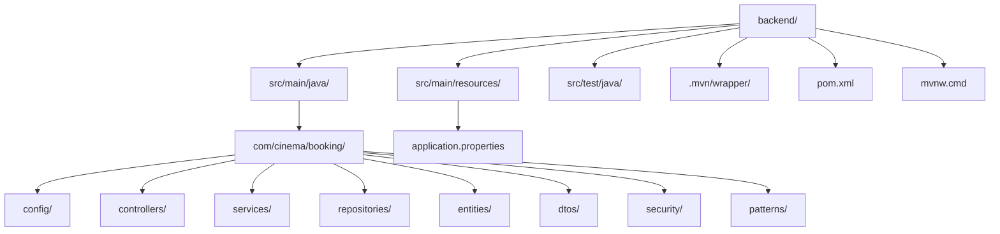
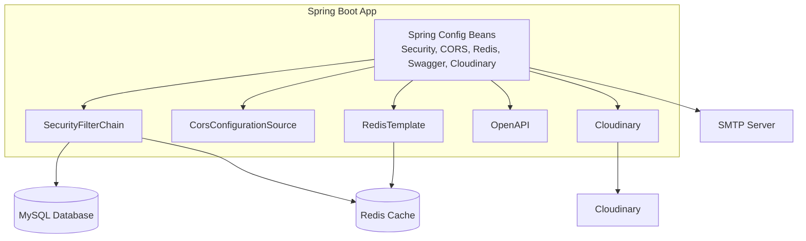
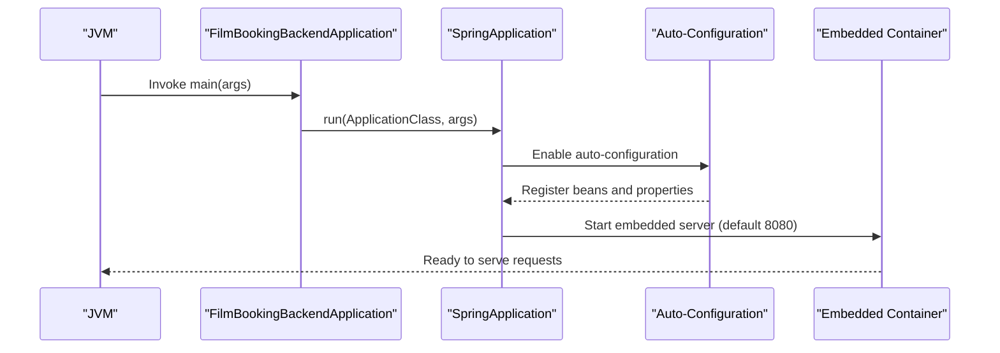
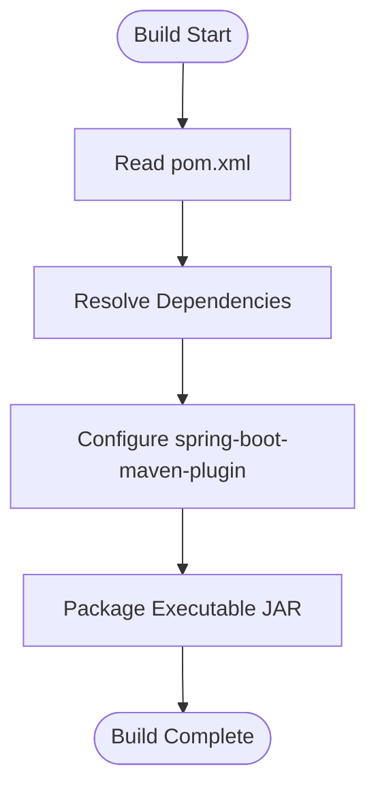
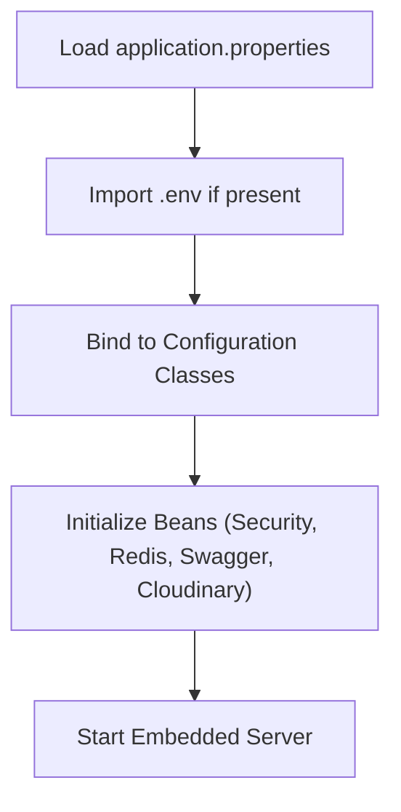
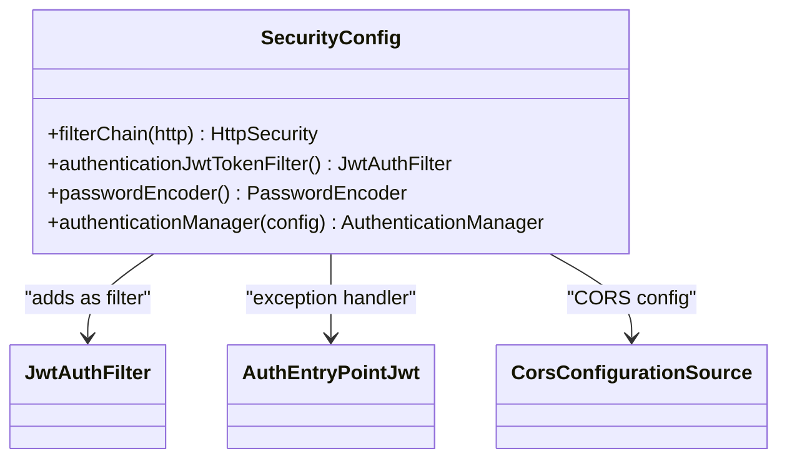
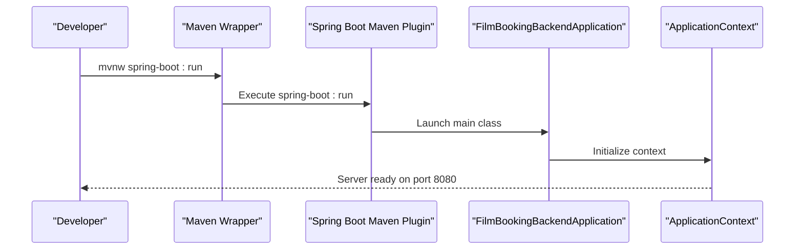
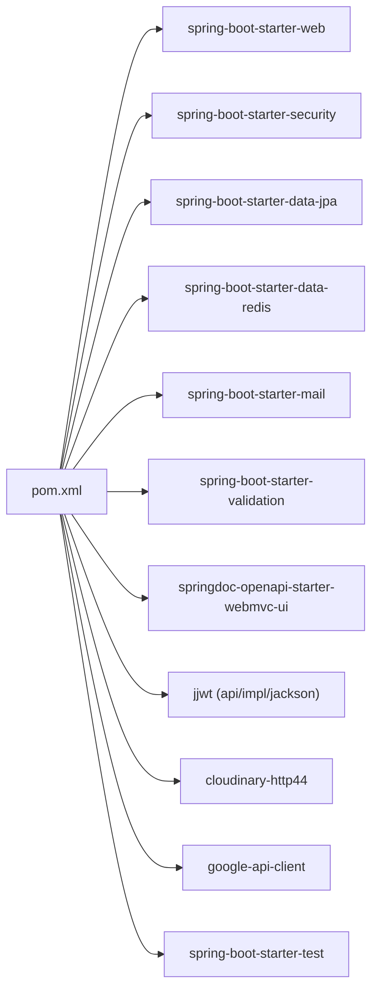

# Spring Boot Application Structure

<cite>
**Referenced Files in This Document**
- [FilmBookingBackendApplication.java](file://backend/src/main/java/com/cinema/booking/FilmBookingBackendApplication.java)
- [pom.xml](file://backend/pom.xml)
- [application.properties](file://backend/src/main/resources/application.properties)
- [mvnw.cmd](file://backend/mvnw.cmd)
- [.mvn/wrapper/maven-wrapper.properties](file://backend/.mvn/wrapper/maven-wrapper.properties)
- [CorsConfig.java](file://backend/src/main/java/com/cinema/booking/config/CorsConfig.java)
- [SecurityConfig.java](file://backend/src/main/java/com/cinema/booking/config/SecurityConfig.java)
- [RedisConfig.java](file://backend/src/main/java/com/cinema/booking/config/RedisConfig.java)
- [SwaggerConfig.java](file://backend/src/main/java/com/cinema/booking/config/SwaggerConfig.java)
- [CloudinaryConfig.java](file://backend/src/main/java/com/cinema/booking/config/CloudinaryConfig.java)
- [FilmBookingBackendApplicationTests.java](file://backend/src/test/java/com/cinema/booking/FilmBookingBackendApplicationTests.java)
- [HUONG_DAN_CHAY_DU_AN.md](file://HUONG_DAN_CHAY_DU_AN.md)
- [docker-compose.yml](file://docker-compose.yml)
- [database_schema.sql](file://database_schema.sql)
- [mock_data.sql](file://mock_data.sql)
</cite>

## Table of Contents
1. [Introduction](#introduction)
2. [Project Structure](#project-structure)
3. [Core Components](#core-components)
4. [Architecture Overview](#architecture-overview)
5. [Detailed Component Analysis](#detailed-component-analysis)
6. [Dependency Analysis](#dependency-analysis)
7. [Performance Considerations](#performance-considerations)
8. [Troubleshooting Guide](#troubleshooting-guide)
9. [Conclusion](#conclusion)
10. [Appendices](#appendices)

## Introduction
This document explains the Spring Boot application structure and initialization for the backend service. It covers the main application class configuration, Spring Boot auto-configuration principles, and the application startup process. It also documents the Maven build configuration, dependencies, plugins, and packaging. Application properties configuration, environment-specific settings, and profile management are explained alongside practical examples of startup, logging configuration, and health checks. Development versus production configurations, JVM arguments, and system requirements are addressed, along with project structure conventions and best practices for Spring Boot applications.

## Project Structure
The backend module follows a conventional Spring Boot layout with Java source under src/main/java and resources under src/main/resources. Configuration is centralized in application.properties, while Spring configuration classes reside under config. Controllers, services, repositories, entities, DTOs, and domain-specific packages organize the business logic. Tests live under src/test/java. The Maven wrapper scripts and properties support reproducible builds across environments.

**Diagram sources**
- [pom.xml:1-108](file://backend/pom.xml#L1-L108)
- [application.properties:1-97](file://backend/src/main/resources/application.properties#L1-L97)

**Section sources**
- [pom.xml:1-108](file://backend/pom.xml#L1-L108)
- [application.properties:1-97](file://backend/src/main/resources/application.properties#L1-L97)

## Core Components
- Main application class: Declares the Spring Boot entry point and enables auto-configuration via the @SpringBootApplication stereotype.
- Maven build: Uses spring-boot-starter-parent, defines Java 17, and configures the spring-boot-maven-plugin with Lombok exclusion.
- Properties: Centralized configuration for database, JPA/Hibernate, encoding, CORS, JWT, Cloudinary, Redis, MoMo payment, dynamic pricing, and SMTP mail.
- Auto-configuration: Spring Boot auto-configures Web MVC, Security, JPA, Redis, Mail, Validation, and OpenAPI based on dependencies and presence of configuration beans.

**Section sources**
- [FilmBookingBackendApplication.java:1-14](file://backend/src/main/java/com/cinema/booking/FilmBookingBackendApplication.java#L1-L14)
- [pom.xml:1-108](file://backend/pom.xml#L1-L108)
- [application.properties:1-97](file://backend/src/main/resources/application.properties#L1-L97)

## Architecture Overview
The backend exposes REST APIs secured by JWT, integrates with MySQL via JPA/Hibernate, caches with Redis, uploads images to Cloudinary, sends emails via SMTP, and supports MoMo payments. OpenAPI/Swagger is enabled for interactive API documentation. CORS is configured per environment variable for flexible development origins.

**Diagram sources**
- [SecurityConfig.java:24-82](file://backend/src/main/java/com/cinema/booking/config/SecurityConfig.java#L24-L82)
- [CorsConfig.java:12-39](file://backend/src/main/java/com/cinema/booking/config/CorsConfig.java#L12-L39)
- [RedisConfig.java:16-55](file://backend/src/main/java/com/cinema/booking/config/RedisConfig.java#L16-L55)
- [SwaggerConfig.java:14-37](file://backend/src/main/java/com/cinema/booking/config/SwaggerConfig.java#L14-L37)
- [CloudinaryConfig.java:11-33](file://backend/src/main/java/com/cinema/booking/config/CloudinaryConfig.java#L11-L33)

## Detailed Component Analysis

### Main Application Class
- Purpose: Provides the SpringApplication.run entry point annotated with @SpringBootApplication.
- Behavior: Enables component scanning, auto-configuration, and embedded container startup.

**Diagram sources**
- [FilmBookingBackendApplication.java:6-11](file://backend/src/main/java/com/cinema/booking/FilmBookingBackendApplication.java#L6-L11)

**Section sources**
- [FilmBookingBackendApplication.java:1-14](file://backend/src/main/java/com/cinema/booking/FilmBookingBackendApplication.java#L1-L14)

### Maven Build Configuration
- Parent POM: spring-boot-starter-parent 4.0.4.
- Java version: 17.
- Dependencies: Web, JPA, Redis, Mail, Security, Validation, OpenAPI, JWT, Cloudinary, Google API client, and test starter.
- Plugin: spring-boot-maven-plugin excludes Lombok from the final artifact.

**Diagram sources**
- [pom.xml:5-17](file://backend/pom.xml#L5-L17)
- [pom.xml:18-90](file://backend/pom.xml#L18-L90)
- [pom.xml:91-106](file://backend/pom.xml#L91-L106)

**Section sources**
- [pom.xml:1-108](file://backend/pom.xml#L1-L108)

### Application Properties and Environment Management
- Centralized properties: application.properties.
- Environment import: optional file import from .env[.properties].
- Database: MySQL URL, credentials, driver, Hikari init SQL.
- JPA/Hibernate: show-sql, format_sql, ddl-auto=update, dialect.
- Encoding: UTF-8 for server and messages.
- CORS: frontend URL from app.frontend-url with defaults for localhost.
- Server: port 8080.
- JWT: secret and expiration.
- Cloudinary: cloud_name, api_key, api_secret with upload limits.
- Redis: host, port, username, password, TTL seconds.
- MoMo: endpoint, access key, partner code, secret key, redirect and notify URLs, dev flag.
- Dynamic pricing: weekend/holiday surcharge, early bird discount and days, occupancy threshold and surcharge.
- SMTP: Gmail host, port, credentials, TLS.

**Diagram sources**
- [application.properties:1-97](file://backend/src/main/resources/application.properties#L1-L97)

**Section sources**
- [application.properties:1-97](file://backend/src/main/resources/application.properties#L1-L97)

### Security Configuration
- Stateless sessions, CSRF disabled, CORS from CorsConfigurationSource.
- Public endpoints: /api/auth/**, /api/public/**, selected GET routes, payment callbacks, and Swagger UI.
- Admin-only endpoints: /api/admin/** and related POST/PUT/DELETE.
- JWT filter registered before UsernamePasswordAuthenticationFilter.
- PasswordEncoder configured as BCrypt.

**Diagram sources**
- [SecurityConfig.java:24-82](file://backend/src/main/java/com/cinema/booking/config/SecurityConfig.java#L24-L82)

**Section sources**
- [SecurityConfig.java:1-82](file://backend/src/main/java/com/cinema/booking/config/SecurityConfig.java#L1-L82)

### CORS Configuration
- Origin patterns include app.frontend-url and localhost/127.0.0.1 wildcards.
- Credentials allowed, headers and methods configured, preflight cached for 1 hour.

**Section sources**
- [CorsConfig.java:1-39](file://backend/src/main/java/com/cinema/booking/config/CorsConfig.java#L1-L39)
- [application.properties:37-37](file://backend/src/main/resources/application.properties#L37-L37)

### Redis Configuration
- Standalone configuration with host/port/credentials.
- Jackson JSON serializer for keys/values with JavaTime module.
- TTL seconds configurable via property.

**Section sources**
- [RedisConfig.java:1-55](file://backend/src/main/java/com/cinema/booking/config/RedisConfig.java#L1-L55)
- [application.properties:61-65](file://backend/src/main/resources/application.properties#L61-L65)

### Swagger/OpenAPI Configuration
- Security scheme: bearer JWT.
- UI endpoints exposed for interactive documentation.

**Section sources**
- [SwaggerConfig.java:1-37](file://backend/src/main/java/com/cinema/booking/config/SwaggerConfig.java#L1-L37)

### Cloudinary Configuration
- Bean creation using cloud_name, api_key, api_secret from properties.

**Section sources**
- [CloudinaryConfig.java:1-33](file://backend/src/main/java/com/cinema/booking/config/CloudinaryConfig.java#L1-L33)
- [application.properties:54-56](file://backend/src/main/resources/application.properties#L54-L56)

### Application Startup and Testing
- Startup via Maven Wrapper: ./mvnw spring-boot:run (Linux/macOS) or mvnw.cmd spring-boot:run (Windows).
- IDE run: open backend and run the main class.
- Tests: contextLoads verifies application context initialization.

**Diagram sources**
- [HUONG_DAN_CHAY_DU_AN.md:19-38](file://HUONG_DAN_CHAY_DU_AN.md#L19-L38)
- [mvnw.cmd:21-32](file://backend/mvnw.cmd#L21-L32)
- [FilmBookingBackendApplication.java:9-11](file://backend/src/main/java/com/cinema/booking/FilmBookingBackendApplication.java#L9-L11)

**Section sources**
- [HUONG_DAN_CHAY_DU_AN.md:1-79](file://HUONG_DAN_CHAY_DU_AN.md#L1-L79)
- [mvnw.cmd:1-190](file://backend/mvnw.cmd#L1-L190)
- [FilmBookingBackendApplicationTests.java:1-14](file://backend/src/test/java/com/cinema/booking/FilmBookingBackendApplicationTests.java#L1-L14)

## Dependency Analysis
The backend depends on Spring Boot starters for web, security, JPA, Redis, mail, validation, and test. Additional libraries include JWT, Cloudinary, Google API client, and OpenAPI. The plugin configuration excludes Lombok from the final artifact.

**Diagram sources**
- [pom.xml:18-89](file://backend/pom.xml#L18-L89)

**Section sources**
- [pom.xml:1-108](file://backend/pom.xml#L1-L108)

## Performance Considerations
- Use production-grade JVM arguments for heap sizing, GC tuning, and container limits.
- Enable production profiles and externalize secrets via environment variables or a secrets manager.
- Monitor database connections via Hikari metrics and tune pool size according to workload.
- Use Redis for caching hot data and offload computation with async tasks.
- Keep JPA logging disabled in production; enable only for targeted debugging.
- Prefer pagination and indexing for large datasets.

## Troubleshooting Guide
- Database connectivity: Verify DB_URL, DB_USERNAME, DB_PASSWORD; check Docker Compose services if using local containers.
- CORS errors: Confirm app.frontend-url matches the origin and wildcard patterns.
- JWT issues: Ensure JWT_SECRET is set and consistent across deployments.
- Redis connectivity: Validate REDIS_HOST, REDIS_PORT, REDIS_USERNAME, REDIS_PASSWORD.
- MoMo callbacks: Use a tunnel (e.g., ngrok) to expose localhost and configure NGROK_HOST accordingly.
- Health checks: Use Spring Boot Actuator endpoints (if enabled) to inspect DB and Redis health.

**Section sources**
- [HUONG_DAN_CHAY_DU_AN.md:64-79](file://HUONG_DAN_CHAY_DU_AN.md#L64-L79)
- [docker-compose.yml:1-34](file://docker-compose.yml#L1-L34)
- [application.properties:8-12](file://backend/src/main/resources/application.properties#L8-L12)
- [application.properties:45-46](file://backend/src/main/resources/application.properties#L45-L46)
- [application.properties:61-65](file://backend/src/main/resources/application.properties#L61-L65)

## Conclusion
The backend follows Spring Boot conventions with clear separation of concerns, auto-configuration, and modular configuration classes. The Maven build is straightforward and reproducible via the wrapper. Properties centralize environment-specific settings, while security, CORS, Redis, OpenAPI, and Cloudinary are configured declaratively. Development and production setups can be managed via environment variables and profiles, with Docker Compose supporting local infrastructure.

## Appendices

### Development vs Production Configurations
- Development: Use application.properties with local DB and Redis; enable JPA logging and Swagger UI.
- Production: Externalize secrets via environment variables, disable JPA logging, secure JWT secret, and restrict CORS to trusted origins.

**Section sources**
- [application.properties:1-97](file://backend/src/main/resources/application.properties#L1-L97)
- [docker-compose.yml:1-34](file://docker-compose.yml#L1-L34)

### System Requirements and JVM Arguments
- JDK 17 recommended.
- Typical JVM flags for production: -Xms/-Xmx for heap, GC flags, container limits, and DNS cache TTL.

**Section sources**
- [HUONG_DAN_CHAY_DU_AN.md:9-13](file://HUONG_DAN_CHAY_DU_AN.md#L9-L13)

### Practical Examples
- Start the app: ./mvnw spring-boot:run (Linux/macOS) or mvnw.cmd spring-boot:run (Windows).
- Access Swagger UI: http://localhost:8080/swagger-ui/index.html.
- Health checks: Enable Actuator and hit /actuator/health (if configured).

**Section sources**
- [HUONG_DAN_CHAY_DU_AN.md:19-38](file://HUONG_DAN_CHAY_DU_AN.md#L19-L38)
- [SwaggerConfig.java:13-13](file://backend/src/main/java/com/cinema/booking/config/SwaggerConfig.java#L13-L13)

### Database Initialization
- Schema and mock data are provided for quick local setup. Docker Compose provisions MySQL and Redis with initial data.

**Section sources**
- [database_schema.sql:1-200](file://database_schema.sql#L1-L200)
- [mock_data.sql:1-200](file://mock_data.sql#L1-L200)
- [docker-compose.yml:1-34](file://docker-compose.yml#L1-L34)