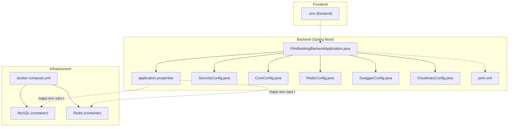
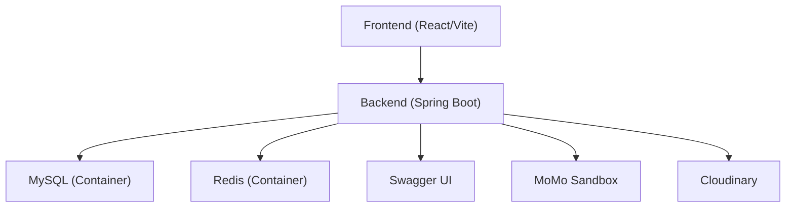
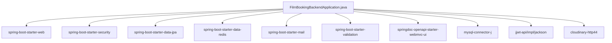

# Configuration and Deployment

<cite>
**Referenced Files in This Document**
- [application.properties](file://backend/src/main/resources/application.properties)
- [docker-compose.yml](file://docker-compose.yml)
- [RedisConfig.java](file://backend/src/main/java/com/cinema/booking/config/RedisConfig.java)
- [SecurityConfig.java](file://backend/src/main/java/com/cinema/booking/config/SecurityConfig.java)
- [CorsConfig.java](file://backend/src/main/java/com/cinema/booking/config/CorsConfig.java)
- [SwaggerConfig.java](file://backend/src/main/java/com/cinema/booking/config/SwaggerConfig.java)
- [CloudinaryConfig.java](file://backend/src/main/java/com/cinema/booking/config/CloudinaryConfig.java)
- [FilmBookingBackendApplication.java](file://backend/src/main/java/com/cinema/booking/FilmBookingBackendApplication.java)
- [pom.xml](file://backend/pom.xml)
- [HUONG_DAN_CHAY_DU_AN.md](file://HUONG_DAN_CHAY_DU_AN.md)
- [HUONG_DAN_CHAY_DU_AN_MOI.md](file://HUONG_DAN_CHAY_DUAN_MOI.md)
- [database_schema.sql](file://database_schema.sql)
</cite>

## Table of Contents
1. [Introduction](#introduction)
2. [Project Structure](#project-structure)
3. [Core Components](#core-components)
4. [Architecture Overview](#architecture-overview)
5. [Detailed Component Analysis](#detailed-component-analysis)
6. [Dependency Analysis](#dependency-analysis)
7. [Performance Considerations](#performance-considerations)
8. [Troubleshooting Guide](#troubleshooting-guide)
9. [Conclusion](#conclusion)
10. [Appendices](#appendices)

## Introduction
This document provides comprehensive guidance for configuring and deploying the StarCine system. It covers environment configuration for databases, Redis, JWT secrets, and external services; the Docker-based local deployment workflow; production deployment strategies; monitoring and logging; CI/CD considerations; security hardening; troubleshooting; backups and disaster recovery; and scaling guidance. The content is grounded in the repository’s configuration files and developer guides.

## Project Structure
The system comprises:
- Backend (Spring Boot) with configuration via environment variables mapped to application properties
- Docker Compose for local orchestration of MySQL and Redis
- Frontend (React/Vite) with its own environment configuration
- Database schema and mock data initialization scripts

**Diagram sources**
- [FilmBookingBackendApplication.java:1-14](file://backend/src/main/java/com/cinema/booking/FilmBookingBackendApplication.java#L1-L14)
- [application.properties:1-97](file://backend/src/main/resources/application.properties#L1-L97)
- [SecurityConfig.java:1-82](file://backend/src/main/java/com/cinema/booking/config/SecurityConfig.java#L1-L82)
- [CorsConfig.java:1-39](file://backend/src/main/java/com/cinema/booking/config/CorsConfig.java#L1-L39)
- [RedisConfig.java:1-55](file://backend/src/main/java/com/cinema/booking/config/RedisConfig.java#L1-L55)
- [SwaggerConfig.java:1-37](file://backend/src/main/java/com/cinema/booking/config/SwaggerConfig.java#L1-L37)
- [CloudinaryConfig.java:1-33](file://backend/src/main/java/com/cinema/booking/config/CloudinaryConfig.java#L1-L33)
- [pom.xml:1-108](file://backend/pom.xml#L1-L108)
- [docker-compose.yml:1-34](file://docker-compose.yml#L1-L34)

**Section sources**
- [HUONG_DAN_CHAY_DU_AN.md:1-79](file://HUONG_DAN_CHAY_DU_AN.md#L1-L79)
- [HUONG_DAN_CHAY_DU_AN_MOI.md:1-151](file://HUONG_DAN_CHAY_DUAN_MOI.md#L1-L151)

## Core Components
- Environment configuration and secrets
  - Database connection: JDBC URL, username, password
  - Redis: host, port, credentials, TTL
  - JWT: secret and expiration
  - Cloudinary: cloud name, API key, API secret
  - MoMo payment: endpoint, access key, partner code, secret key, redirect and notify URLs
  - Frontend URL for CORS
  - Mail SMTP settings for email notifications
- Local infrastructure
  - MySQL 8.0 with health checks and schema/data initialization
  - Redis 7 with persistence
- Security and CORS
  - Stateless JWT-based security with method-level roles
  - Flexible CORS allowing frontend origin plus localhost patterns
- API documentation
  - OpenAPI/Swagger with bearer JWT security scheme

**Section sources**
- [application.properties:1-97](file://backend/src/main/resources/application.properties#L1-L97)
- [docker-compose.yml:1-34](file://docker-compose.yml#L1-L34)
- [SecurityConfig.java:1-82](file://backend/src/main/java/com/cinema/booking/config/SecurityConfig.java#L1-L82)
- [CorsConfig.java:1-39](file://backend/src/main/java/com/cinema/booking/config/CorsConfig.java#L1-L39)
- [SwaggerConfig.java:1-37](file://backend/src/main/java/com/cinema/booking/config/SwaggerConfig.java#L1-L37)

## Architecture Overview
The runtime architecture ties together the backend, local infrastructure, and frontend. The backend reads environment variables to configure database, Redis, JWT, Cloudinary, MoMo, and mail services. Docker Compose provisions MySQL and Redis containers with health checks and initial data.

**Diagram sources**
- [application.properties:1-97](file://backend/src/main/resources/application.properties#L1-L97)
- [docker-compose.yml:1-34](file://docker-compose.yml#L1-L34)
- [SwaggerConfig.java:1-37](file://backend/src/main/java/com/cinema/booking/config/SwaggerConfig.java#L1-L37)

## Detailed Component Analysis

### Environment Configuration and Secrets Management
- Database
  - JDBC URL, username, password are loaded from environment variables and applied via Spring Boot configuration.
  - UTF-8 and SQL formatting are enabled for development diagnostics.
- Redis
  - Host, port, optional username/password are read from environment variables.
  - JSON serialization with Jackson for typed caching.
  - TTL seconds configurable via environment variable.
- JWT
  - Secret and expiration are set via environment variables.
- Cloudinary
  - Cloud name, API key, and API secret are read from environment variables.
- MoMo
  - Endpoint, access key, partner code, secret key, redirect URL, notify URL, and a development flag are configured via environment variables.
- Frontend URL
  - CORS allows the configured origin plus localhost patterns.
- Mail
  - SMTP host, port, credentials, TLS are configured for email notifications.

Best practices:
- Store secrets in environment variables or a secrets manager; do not commit .env files.
- Rotate secrets regularly and enforce least privilege for external service accounts.
- Use distinct secrets per environment (dev/staging/prod).

**Section sources**
- [application.properties:1-97](file://backend/src/main/resources/application.properties#L1-L97)
- [RedisConfig.java:1-55](file://backend/src/main/java/com/cinema/booking/config/RedisConfig.java#L1-L55)
- [CorsConfig.java:1-39](file://backend/src/main/java/com/cinema/booking/config/CorsConfig.java#L1-L39)
- [CloudinaryConfig.java:1-33](file://backend/src/main/java/com/cinema/booking/config/CloudinaryConfig.java#L1-L33)
- [HUONG_DAN_CHAY_DUAN_MOI.md:29-58](file://HUONG_DAN_CHAY_DUAN_MOI.md#L29-L58)

### Docker Deployment and Orchestration
- Services
  - MySQL: exposed on 3307:3306, initializes schema and mock data, health-checked.
  - Redis: exposed on 6379:6379, persistence enabled.
- Health checks
  - MySQL health probe ensures readiness.
- Data persistence
  - Named volumes for MySQL and Redis data.
- Running locally
  - Bring up services with Docker Compose, then start the backend and frontend as documented.

Operational tips:
- Use docker compose down -v to reset data during local development.
- Verify container statuses and logs if connectivity issues occur.

**Section sources**
- [docker-compose.yml:1-34](file://docker-compose.yml#L1-L34)
- [HUONG_DAN_CHAY_DUAN_MOI.md:72-101](file://HUONG_DAN_CHAY_DUAN_MOI.md#L72-L101)

### Production Deployment Strategies
- Containerization
  - Package the Spring Boot app into a container image and deploy alongside MySQL and Redis.
- Environment-specific configuration
  - Use separate .env files or environment variable injection per environment.
- Secrets management
  - Externalize secrets via a secrets manager or Kubernetes Secrets.
- Network configuration
  - Restrict inbound access to application and infrastructure ports; enable TLS termination at ingress/load balancer.
- External service integrations
  - Configure production endpoints for MoMo, Cloudinary, and SMTP; ensure outbound connectivity.

[No sources needed since this section provides general guidance]

### Monitoring and Logging Setup
- Logging
  - Enable structured logging in production; integrate with centralized logging (e.g., ELK or similar).
- Health checks
  - Expose a simple GET health endpoint returning 200 when dependencies are reachable.
- Metrics
  - Add Spring Boot Actuator and expose metrics endpoints; secure them appropriately.
- Observability
  - Instrument slow queries, cache hit rates, and external API latency.

[No sources needed since this section provides general guidance]

### CI/CD Pipeline Configuration
- Build
  - Build the backend artifact using Maven inside a CI job.
- Test
  - Run unit tests and integration tests against a transient MySQL/Redis instance.
- Package
  - Produce container images for backend, frontend, and infrastructure.
- Deploy
  - Deploy to staging with automated smoke tests; promote to production after approvals.
- Security scanning
  - Scan images and dependencies for vulnerabilities.

[No sources needed since this section provides general guidance]

### Security Considerations
- TLS
  - Terminate TLS at the load balancer or ingress; enforce HTTPS redirects.
- Firewall
  - Allow only necessary inbound ports (HTTP/HTTPS) to the app; restrict DB/Redis ports to internal networks.
- Access control
  - Enforce RBAC via Spring Security; validate JWT claims and scopes.
- Secrets
  - Never bake secrets into images; inject via environment variables or mounted secrets.
- CORS and CSRF
  - Keep CORS strict; CSRF is disabled because the app is stateless and uses tokens.

**Section sources**
- [SecurityConfig.java:1-82](file://backend/src/main/java/com/cinema/booking/config/SecurityConfig.java#L1-L82)
- [CorsConfig.java:1-39](file://backend/src/main/java/com/cinema/booking/config/CorsConfig.java#L1-L39)

### Backup and Disaster Recovery
- Backups
  - Schedule regular logical backups of MySQL and snapshot Redis AOF volume.
- Recovery
  - Test restoration procedures; maintain offsite copies of backups.
- DR
  - Define RPO/RTO targets; replicate critical infrastructure across availability zones.

[No sources needed since this section provides general guidance]

### Scaling Considerations
- Horizontal scaling
  - Stateless backend; scale replicas behind a load balancer.
- Database
  - Use read replicas for read-heavy endpoints; apply connection pooling and query optimization.
- Cache
  - Scale Redis with clustering or managed service; monitor memory and eviction policies.
- CDN and media
  - Offload image delivery to Cloudinary; leverage CDN for static assets.

[No sources needed since this section provides general guidance]

## Dependency Analysis
The backend depends on Spring Boot starters for web, security, JPA, Redis, mail, validation, and OpenAPI. External dependencies include MySQL driver, JWT libraries, Cloudinary SDK, and Swagger UI.

**Diagram sources**
- [pom.xml:1-108](file://backend/pom.xml#L1-L108)

**Section sources**
- [pom.xml:1-108](file://backend/pom.xml#L1-L108)

## Performance Considerations
- Database
  - Use UTF-8mb4 collation; enable connection initialization SQL for charset.
  - Optimize queries and indexes; avoid N+1 selects.
- Cache
  - Tune Redis TTL and memory limits; monitor hit ratio.
- Application
  - Enable SQL formatting in development; disable in production.
  - Use pagination and filtering for large lists.

[No sources needed since this section provides general guidance]

## Troubleshooting Guide
Common issues and resolutions:
- Port conflicts
  - Stop processes using ports 3306, 6379, 8080, 5173; change bindings if necessary.
- Database connectivity
  - Verify DB_URL, DB_USERNAME, DB_PASSWORD; confirm MySQL container is healthy.
- CORS errors
  - Ensure FRONTEND_URL matches the frontend origin.
- MoMo IPN/local testing
  - Use a public tunnel (e.g., ngrok) for notify URL; configure environment accordingly.
- Resetting local data
  - Use docker compose down -v followed by docker compose up -d.

**Section sources**
- [HUONG_DAN_CHAY_DUAN_MOI.md:134-151](file://HUONG_DAN_CHAY_DUAN_MOI.md#L134-L151)
- [HUONG_DAN_CHAY_DU_AN.md:75-79](file://HUONG_DAN_CHAY_DU_AN.md#L75-L79)

## Conclusion
This guide consolidates environment configuration, local Docker deployment, production readiness, security, observability, CI/CD, and operational practices for the StarCine system. Adhering to the outlined patterns ensures reliable, secure, and scalable deployments across environments.

## Appendices

### Environment Variables Reference
- Database
  - DB_URL, DB_USERNAME, DB_PASSWORD
- Redis
  - REDIS_HOST, REDIS_PORT, REDIS_USERNAME, REDIS_PASSWORD, REDIS_TTL_SECONDS
- JWT
  - JWT_SECRET, JWT expiration setting
- Cloudinary
  - CLOUDINARY_CLOUD_NAME, CLOUDINARY_API_KEY, CLOUDINARY_API_SECRET
- MoMo
  - DEV_MOMO_ENDPOINT, DEV_ACCESS_KEY, DEV_PARTNER_CODE, DEV_SECRET_KEY, MOMO_RETURN_URL, MOMO_NOTIFY_URL, MOMO_DEV_PAYMENT_OPTION_ALL_PAYMENT_SUCCESS
- Frontend
  - FRONTEND_URL
- Mail
  - SMTP host, port, username, password, TLS flags

**Section sources**
- [application.properties:1-97](file://backend/src/main/resources/application.properties#L1-L97)
- [HUONG_DAN_CHAY_DUAN_MOI.md:29-58](file://HUONG_DAN_CHAY_DUAN_MOI.md#L29-L58)

### Database Initialization
- Schema and seed data are initialized automatically when MySQL starts with the provided SQL files.

**Section sources**
- [docker-compose.yml:11-14](file://docker-compose.yml#L11-L14)
- [database_schema.sql:1-200](file://database_schema.sql#L1-L200)