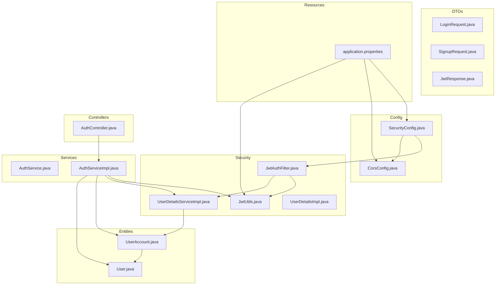
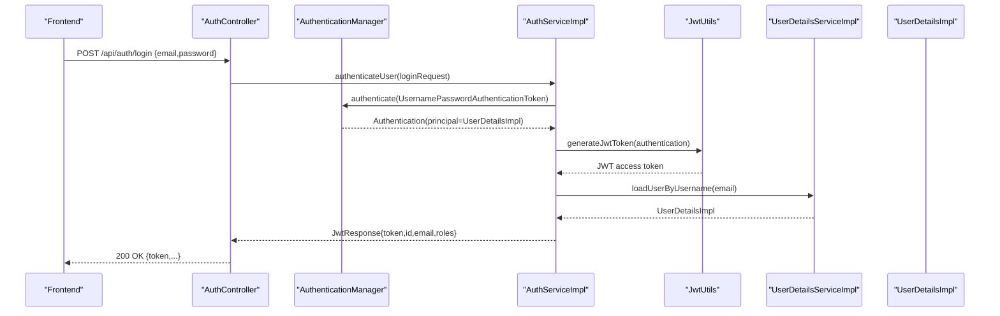
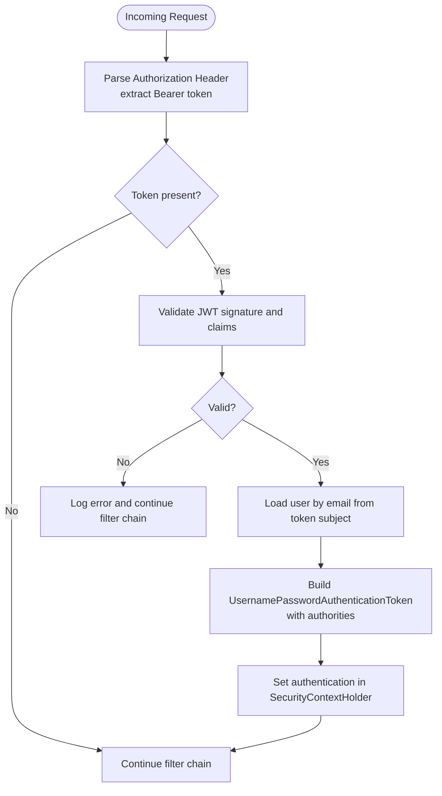
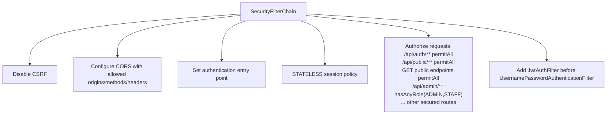
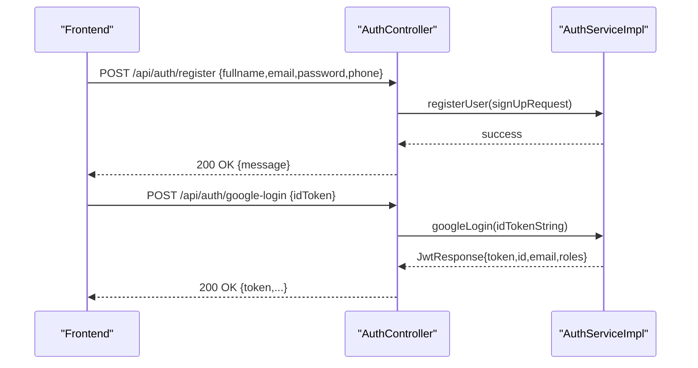
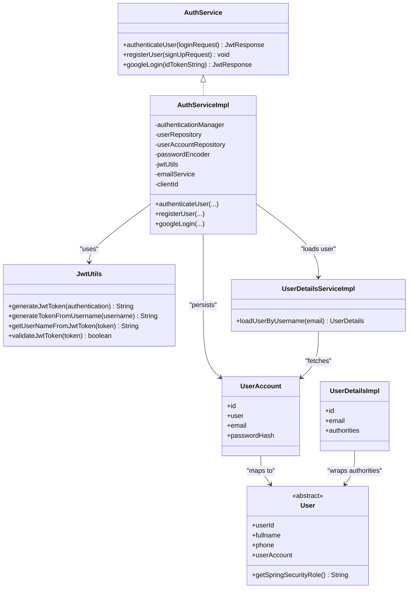
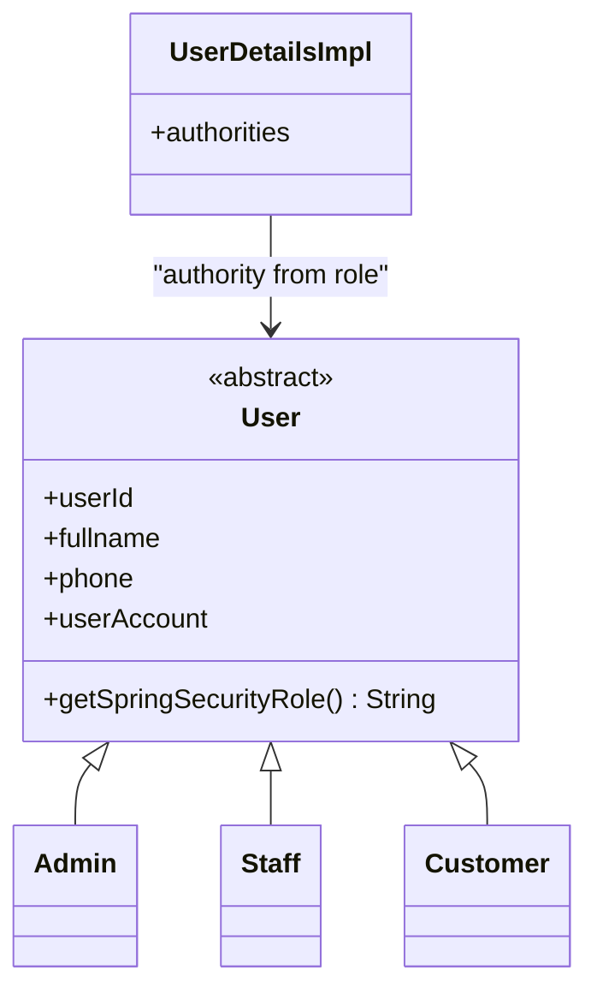
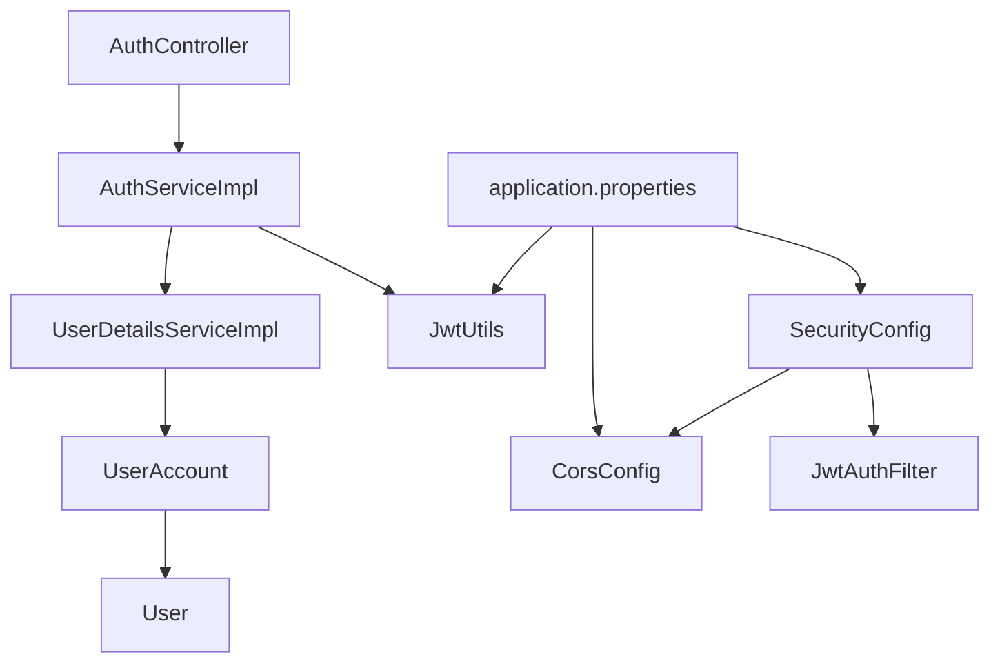

# Authentication and Authorization

<cite>
**Referenced Files in This Document**
- [SecurityConfig.java](file://backend/src/main/java/com/cinema/booking/config/SecurityConfig.java)
- [CorsConfig.java](file://backend/src/main/java/com/cinema/booking/config/CorsConfig.java)
- [JwtAuthFilter.java](file://backend/src/main/java/com/cinema/booking/security/JwtAuthFilter.java)
- [JwtUtils.java](file://backend/src/main/java/com/cinema/booking/security/JwtUtils.java)
- [AuthController.java](file://backend/src/main/java/com/cinema/booking/controllers/AuthController.java)
- [AuthService.java](file://backend/src/main/java/com/cinema/booking/services/AuthService.java)
- [AuthServiceImpl.java](file://backend/src/main/java/com/cinema/booking/services/impl/AuthServiceImpl.java)
- [UserDetailsServiceImpl.java](file://backend/src/main/java/com/cinema/booking/security/UserDetailsServiceImpl.java)
- [UserDetailsImpl.java](file://backend/src/main/java/com/cinema/booking/security/UserDetailsImpl.java)
- [User.java](file://backend/src/main/java/com/cinema/booking/entities/User.java)
- [UserAccount.java](file://backend/src/main/java/com/cinema/booking/entities/UserAccount.java)
- [LoginRequest.java](file://backend/src/main/java/com/cinema/booking/dtos/LoginRequest.java)
- [SignupRequest.java](file://backend/src/main/java/com/cinema/booking/dtos/SignupRequest.java)
- [JwtResponse.java](file://backend/src/main/java/com/cinema/booking/dtos/JwtResponse.java)
- [application.properties](file://backend/src/main/resources/application.properties)
</cite>

## Table of Contents
1. [Introduction](#introduction)
2. [Project Structure](#project-structure)
3. [Core Components](#core-components)
4. [Architecture Overview](#architecture-overview)
5. [Detailed Component Analysis](#detailed-component-analysis)
6. [Dependency Analysis](#dependency-analysis)
7. [Performance Considerations](#performance-considerations)
8. [Troubleshooting Guide](#troubleshooting-guide)
9. [Conclusion](#conclusion)
10. [Appendices](#appendices)

## Introduction
This document explains the authentication and authorization system for the cinema booking application. It covers JWT-based authentication, role-based access control (RBAC), Spring Security configuration, custom filters, CORS, login/logout semantics, password hashing with BCrypt, user registration, Google OAuth integration, and environment-specific security settings. Practical examples of API endpoints and role-based route protection are included, along with best practices and debugging tips.

## Project Structure
The authentication subsystem is primarily located under:
- config: SecurityConfig, CorsConfig
- security: JwtAuthFilter, JwtUtils, UserDetailsServiceImpl, UserDetailsImpl
- controllers: AuthController
- services: AuthService, AuthServiceImpl
- entities: User, UserAccount
- dtos: LoginRequest, SignupRequest, JwtResponse
- resources: application.properties

**Diagram sources**
- [SecurityConfig.java:51-79](file://backend/src/main/java/com/cinema/booking/config/SecurityConfig.java#L51-L79)
- [CorsConfig.java:18-36](file://backend/src/main/java/com/cinema/booking/config/CorsConfig.java#L18-L36)
- [JwtAuthFilter.java:18-63](file://backend/src/main/java/com/cinema/booking/security/JwtAuthFilter.java#L18-L63)
- [JwtUtils.java:15-71](file://backend/src/main/java/com/cinema/booking/security/JwtUtils.java#L15-L71)
- [UserDetailsServiceImpl.java:12-26](file://backend/src/main/java/com/cinema/booking/security/UserDetailsServiceImpl.java#L12-L26)
- [UserDetailsImpl.java:15-76](file://backend/src/main/java/com/cinema/booking/security/UserDetailsImpl.java#L15-L76)
- [AuthController.java:13-53](file://backend/src/main/java/com/cinema/booking/controllers/AuthController.java#L13-L53)
- [AuthService.java:7-12](file://backend/src/main/java/com/cinema/booking/services/AuthService.java#L7-L12)
- [AuthServiceImpl.java:26-139](file://backend/src/main/java/com/cinema/booking/services/impl/AuthServiceImpl.java#L26-L139)
- [User.java:6-38](file://backend/src/main/java/com/cinema/booking/entities/User.java#L6-L38)
- [UserAccount.java:6-30](file://backend/src/main/java/com/cinema/booking/entities/UserAccount.java#L6-L30)
- [LoginRequest.java:6-13](file://backend/src/main/java/com/cinema/booking/dtos/LoginRequest.java#L6-L13)
- [SignupRequest.java:8-24](file://backend/src/main/java/com/cinema/booking/dtos/SignupRequest.java#L8-L24)
- [JwtResponse.java:8-23](file://backend/src/main/java/com/cinema/booking/dtos/JwtResponse.java#L8-L23)
- [application.properties:35-47](file://backend/src/main/resources/application.properties#L35-L47)

**Section sources**
- [SecurityConfig.java:24-80](file://backend/src/main/java/com/cinema/booking/config/SecurityConfig.java#L24-L80)
- [CorsConfig.java:12-39](file://backend/src/main/java/com/cinema/booking/config/CorsConfig.java#L12-L39)
- [application.properties:35-47](file://backend/src/main/resources/application.properties#L35-L47)

## Core Components
- JWT utilities: token generation, parsing, validation, and expiration handling.
- Custom JWT filter: extracts Bearer tokens from Authorization headers, validates them, loads user details, and sets authentication in the security context.
- Spring Security configuration: disables CSRF, configures stateless sessions, defines permitted and secured endpoints, and registers the JWT filter.
- Authentication controller: exposes login, register, and Google login endpoints.
- Authentication service: orchestrates username/password login, BCrypt password encoding, user registration, and Google OAuth verification.
- User details service and model: loads user accounts and builds Spring Security UserDetails with role authorities.
- DTOs: request/response models for login, registration, and JWT responses.
- CORS configuration: allows configured frontend origin(s) with credentials and preflight caching.

**Section sources**
- [JwtUtils.java:15-71](file://backend/src/main/java/com/cinema/booking/security/JwtUtils.java#L15-L71)
- [JwtAuthFilter.java:18-63](file://backend/src/main/java/com/cinema/booking/security/JwtAuthFilter.java#L18-L63)
- [SecurityConfig.java:50-79](file://backend/src/main/java/com/cinema/booking/config/SecurityConfig.java#L50-L79)
- [AuthController.java:13-53](file://backend/src/main/java/com/cinema/booking/controllers/AuthController.java#L13-L53)
- [AuthServiceImpl.java:26-139](file://backend/src/main/java/com/cinema/booking/services/impl/AuthServiceImpl.java#L26-L139)
- [UserDetailsServiceImpl.java:12-26](file://backend/src/main/java/com/cinema/booking/security/UserDetailsServiceImpl.java#L12-L26)
- [UserDetailsImpl.java:15-76](file://backend/src/main/java/com/cinema/booking/security/UserDetailsImpl.java#L15-L76)
- [LoginRequest.java:6-13](file://backend/src/main/java/com/cinema/booking/dtos/LoginRequest.java#L6-L13)
- [SignupRequest.java:8-24](file://backend/src/main/java/com/cinema/booking/dtos/SignupRequest.java#L8-L24)
- [JwtResponse.java:8-23](file://backend/src/main/java/com/cinema/booking/dtos/JwtResponse.java#L8-L23)
- [CorsConfig.java:18-36](file://backend/src/main/java/com/cinema/booking/config/CorsConfig.java#L18-L36)

## Architecture Overview
The authentication pipeline integrates Spring Security with JWT. Requests pass through a custom filter that validates tokens and populates the security context. Controllers delegate to services for authentication and registration, which in turn use JWT utilities and user details loading.

**Diagram sources**
- [AuthController.java:21-31](file://backend/src/main/java/com/cinema/booking/controllers/AuthController.java#L21-L31)
- [AuthServiceImpl.java:44-61](file://backend/src/main/java/com/cinema/booking/services/impl/AuthServiceImpl.java#L44-L61)
- [JwtUtils.java:30-39](file://backend/src/main/java/com/cinema/booking/security/JwtUtils.java#L30-L39)
- [UserDetailsServiceImpl.java:18-25](file://backend/src/main/java/com/cinema/booking/security/UserDetailsServiceImpl.java#L18-L25)
- [UserDetailsImpl.java:29-39](file://backend/src/main/java/com/cinema/booking/security/UserDetailsImpl.java#L29-L39)

## Detailed Component Analysis

### JWT Utilities and Filter
- Token generation uses HS256 with a configurable secret and fixed expiration.
- Token validation handles malformed, expired, unsupported, and empty claims exceptions.
- The filter extracts Bearer tokens from Authorization headers, validates them, loads user details by email, and sets an authentication token in the security context.

**Diagram sources**
- [JwtAuthFilter.java:27-51](file://backend/src/main/java/com/cinema/booking/security/JwtAuthFilter.java#L27-L51)
- [JwtUtils.java:55-69](file://backend/src/main/java/com/cinema/booking/security/JwtUtils.java#L55-L69)

**Section sources**
- [JwtUtils.java:15-71](file://backend/src/main/java/com/cinema/booking/security/JwtUtils.java#L15-L71)
- [JwtAuthFilter.java:18-63](file://backend/src/main/java/com/cinema/booking/security/JwtAuthFilter.java#L18-L63)

### Spring Security Configuration
- CSRF is disabled for stateless JWT APIs.
- CORS is enabled via a configuration source that accepts the configured frontend URL and typical local origins, with credentials allowed and preflight cached.
- Session management is set to STATELESS.
- Public endpoints include auth/register and several GET endpoints.
- Admin-only endpoints require ADMIN or STAFF roles; other write operations require ADMIN or STAFF.
- The JWT filter is registered before the default username/password filter.

**Diagram sources**
- [SecurityConfig.java:50-79](file://backend/src/main/java/com/cinema/booking/config/SecurityConfig.java#L50-L79)
- [CorsConfig.java:18-36](file://backend/src/main/java/com/cinema/booking/config/CorsConfig.java#L18-L36)

**Section sources**
- [SecurityConfig.java:50-79](file://backend/src/main/java/com/cinema/booking/config/SecurityConfig.java#L50-L79)
- [CorsConfig.java:18-36](file://backend/src/main/java/com/cinema/booking/config/CorsConfig.java#L18-L36)

### Authentication Controller
- Exposes:
  - POST /api/auth/login: authenticates with email/password and returns a JWT response.
  - POST /api/auth/register: creates a new customer account with hashed password.
  - POST /api/auth/google-login: verifies Google ID token and returns a JWT response.

**Diagram sources**
- [AuthController.java:33-52](file://backend/src/main/java/com/cinema/booking/controllers/AuthController.java#L33-L52)
- [AuthServiceImpl.java:66-92](file://backend/src/main/java/com/cinema/booking/services/impl/AuthServiceImpl.java#L66-L92)
- [AuthServiceImpl.java:97-137](file://backend/src/main/java/com/cinema/booking/services/impl/AuthServiceImpl.java#L97-L137)

**Section sources**
- [AuthController.java:13-53](file://backend/src/main/java/com/cinema/booking/controllers/AuthController.java#L13-L53)

### Authentication Service Implementation
- Username/password login:
  - Authenticates via AuthenticationManager.
  - Generates JWT using JwtUtils.
  - Builds JwtResponse with user id, email, and roles.
- Registration:
  - Validates uniqueness of email.
  - Creates Customer and UserAccount.
  - Encodes password with BCrypt.
  - Sends welcome email asynchronously.
- Google login:
  - Verifies Google ID token against client ID.
  - Ensures a UserAccount exists (creating one if missing).
  - Generates JWT for the user.

**Diagram sources**
- [AuthService.java:7-12](file://backend/src/main/java/com/cinema/booking/services/AuthService.java#L7-L12)
- [AuthServiceImpl.java:26-139](file://backend/src/main/java/com/cinema/booking/services/impl/AuthServiceImpl.java#L26-L139)
- [JwtUtils.java:15-71](file://backend/src/main/java/com/cinema/booking/security/JwtUtils.java#L15-L71)
- [UserDetailsServiceImpl.java:12-26](file://backend/src/main/java/com/cinema/booking/security/UserDetailsServiceImpl.java#L12-L26)
- [UserDetailsImpl.java:15-76](file://backend/src/main/java/com/cinema/booking/security/UserDetailsImpl.java#L15-L76)
- [UserAccount.java:6-30](file://backend/src/main/java/com/cinema/booking/entities/UserAccount.java#L6-L30)
- [User.java:6-38](file://backend/src/main/java/com/cinema/booking/entities/User.java#L6-L38)

**Section sources**
- [AuthServiceImpl.java:26-139](file://backend/src/main/java/com/cinema/booking/services/impl/AuthServiceImpl.java#L26-L139)

### Role-Based Access Control (RBAC)
- Roles are derived from the User entity hierarchy via getSpringSecurityRole().
- UserDetailsImpl constructs authorities with the prefix ROLE_.
- SecurityConfig enforces:
  - ADMIN or STAFF for admin routes and write operations on movies and FnB.
  - Any authenticated user for most other endpoints.
- The application supports roles ADMIN, STAFF, and CUSTOMER via the User hierarchy.

**Diagram sources**
- [User.java:6-38](file://backend/src/main/java/com/cinema/booking/entities/User.java#L6-L38)
- [UserDetailsImpl.java:29-39](file://backend/src/main/java/com/cinema/booking/security/UserDetailsImpl.java#L29-L39)

**Section sources**
- [User.java:32-37](file://backend/src/main/java/com/cinema/booking/entities/User.java#L32-L37)
- [UserDetailsImpl.java:29-39](file://backend/src/main/java/com/cinema/booking/security/UserDetailsImpl.java#L29-L39)
- [SecurityConfig.java:65-74](file://backend/src/main/java/com/cinema/booking/config/SecurityConfig.java#L65-L74)

### DTOs and Endpoints
- LoginRequest: email and password.
- SignupRequest: fullname, email, password, phone.
- JwtResponse: token, type, id, email, roles.

Endpoints:
- POST /api/auth/login
- POST /api/auth/register
- POST /api/auth/google-login

**Section sources**
- [LoginRequest.java:6-13](file://backend/src/main/java/com/cinema/booking/dtos/LoginRequest.java#L6-L13)
- [SignupRequest.java:8-24](file://backend/src/main/java/com/cinema/booking/dtos/SignupRequest.java#L8-L24)
- [JwtResponse.java:8-23](file://backend/src/main/java/com/cinema/booking/dtos/JwtResponse.java#L8-L23)
- [AuthController.java:21-52](file://backend/src/main/java/com/cinema/booking/controllers/AuthController.java#L21-L52)

### Password Hashing with BCrypt
- PasswordEncoder bean is BCrypt.
- Used during registration to encode passwords before persisting UserAccount.
- Authentication compares encoded stored password with provided plaintext via AuthenticationManager.

**Section sources**
- [SecurityConfig.java:40-43](file://backend/src/main/java/com/cinema/booking/config/SecurityConfig.java#L40-L43)
- [AuthServiceImpl.java:78-80](file://backend/src/main/java/com/cinema/booking/services/impl/AuthServiceImpl.java#L78-L80)

### Google OAuth Integration
- Google ID token verification uses GoogleIdTokenVerifier with the configured client ID.
- If the user does not exist, a new Customer and UserAccount are created with a random password hash.
- A JWT is generated and returned.

**Section sources**
- [AuthServiceImpl.java:97-137](file://backend/src/main/java/com/cinema/booking/services/impl/AuthServiceImpl.java#L97-L137)
- [application.properties:35-37](file://backend/src/main/resources/application.properties#L35-L37)

### Environment-Specific Security Settings
- JWT secret and expiration are configured via environment variables.
- Frontend URL for CORS is configurable.
- CSRF is disabled; session policy is stateless.

**Section sources**
- [application.properties:35-47](file://backend/src/main/resources/application.properties#L35-L47)
- [SecurityConfig.java:50-59](file://backend/src/main/java/com/cinema/booking/config/SecurityConfig.java#L50-L59)

## Dependency Analysis
The authentication system exhibits clear separation of concerns:
- Controllers depend on Services.
- Services depend on Repositories, JWT utilities, and user details services.
- Security configuration depends on the JWT filter and CORS configuration.
- Entities encapsulate user-account relationships and role derivation.

**Diagram sources**
- [AuthController.java:13-53](file://backend/src/main/java/com/cinema/booking/controllers/AuthController.java#L13-L53)
- [AuthServiceImpl.java:26-139](file://backend/src/main/java/com/cinema/booking/services/impl/AuthServiceImpl.java#L26-L139)
- [JwtUtils.java:15-71](file://backend/src/main/java/com/cinema/booking/security/JwtUtils.java#L15-L71)
- [UserDetailsServiceImpl.java:12-26](file://backend/src/main/java/com/cinema/booking/security/UserDetailsServiceImpl.java#L12-L26)
- [UserAccount.java:6-30](file://backend/src/main/java/com/cinema/booking/entities/UserAccount.java#L6-L30)
- [User.java:6-38](file://backend/src/main/java/com/cinema/booking/entities/User.java#L6-L38)
- [SecurityConfig.java:50-79](file://backend/src/main/java/com/cinema/booking/config/SecurityConfig.java#L50-L79)
- [CorsConfig.java:18-36](file://backend/src/main/java/com/cinema/booking/config/CorsConfig.java#L18-L36)
- [application.properties:35-47](file://backend/src/main/resources/application.properties#L35-L47)

**Section sources**
- [AuthController.java:13-53](file://backend/src/main/java/com/cinema/booking/controllers/AuthController.java#L13-L53)
- [AuthServiceImpl.java:26-139](file://backend/src/main/java/com/cinema/booking/services/impl/AuthServiceImpl.java#L26-L139)
- [SecurityConfig.java:50-79](file://backend/src/main/java/com/cinema/booking/config/SecurityConfig.java#L50-L79)

## Performance Considerations
- Stateless JWT eliminates server-side session storage overhead.
- Token validation is lightweight; avoid excessive logging in production.
- Consider adding token blacklisting or short-lived access tokens with refresh tokens for higher security.
- Cache frequently accessed user roles if needed, but ensure cache invalidation aligns with role changes.

## Troubleshooting Guide
Common issues and resolutions:
- Invalid or expired JWT:
  - Validate the JWT secret and expiration settings.
  - Ensure clocks are synchronized on server and client.
- Authentication failures:
  - Confirm BCrypt-encoded passwords match stored hashes.
  - Verify user roles are correctly mapped and authorities prefixed with ROLE_.
- CORS errors:
  - Ensure app.frontend-url matches the origin sending requests.
  - Confirm credentials are allowed and preflight caching is sufficient.
- Google login failures:
  - Verify OAUTH_CLIENT_ID matches the Google project audience.
  - Check network connectivity to Google endpoints and token validity.

**Section sources**
- [JwtUtils.java:55-69](file://backend/src/main/java/com/cinema/booking/security/JwtUtils.java#L55-L69)
- [UserDetailsImpl.java:29-39](file://backend/src/main/java/com/cinema/booking/security/UserDetailsImpl.java#L29-L39)
- [CorsConfig.java:18-36](file://backend/src/main/java/com/cinema/booking/config/CorsConfig.java#L18-L36)
- [application.properties:35-37](file://backend/src/main/resources/application.properties#L35-L37)

## Conclusion
The system implements a robust, stateless JWT-based authentication and RBAC framework integrated with Spring Security. It supports standard login, registration, and Google OAuth while enforcing role-based protections for administrative endpoints. Proper configuration of secrets, CORS, and session policies ensures secure operation across environments.

## Appendices

### Practical Examples

- Authentication API Endpoints
  - POST /api/auth/login
  - POST /api/auth/register
  - POST /api/auth/google-login

- Token Handling in Frontend
  - Store the returned JWT in memory or secure HTTP-only cookies.
  - Attach Authorization: Bearer <token> to subsequent requests.
  - On logout, clear stored token and redirect to login.

- Role-Based Route Protection
  - Admin routes: /api/admin/**
  - Write operations on movies and FnB: require ADMIN or STAFF.

- Logout Semantics
  - Stateless JWT logout is effectively handled by discarding the token client-side.
  - Optional refresh token mechanism can be introduced for enhanced UX and security.

[No sources needed since this section provides general guidance]