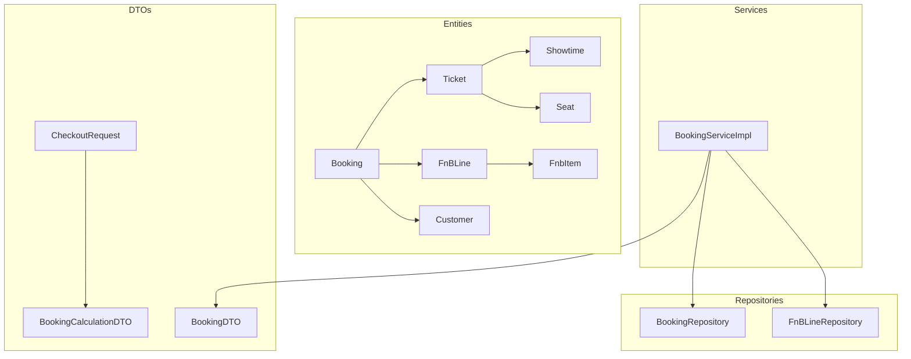
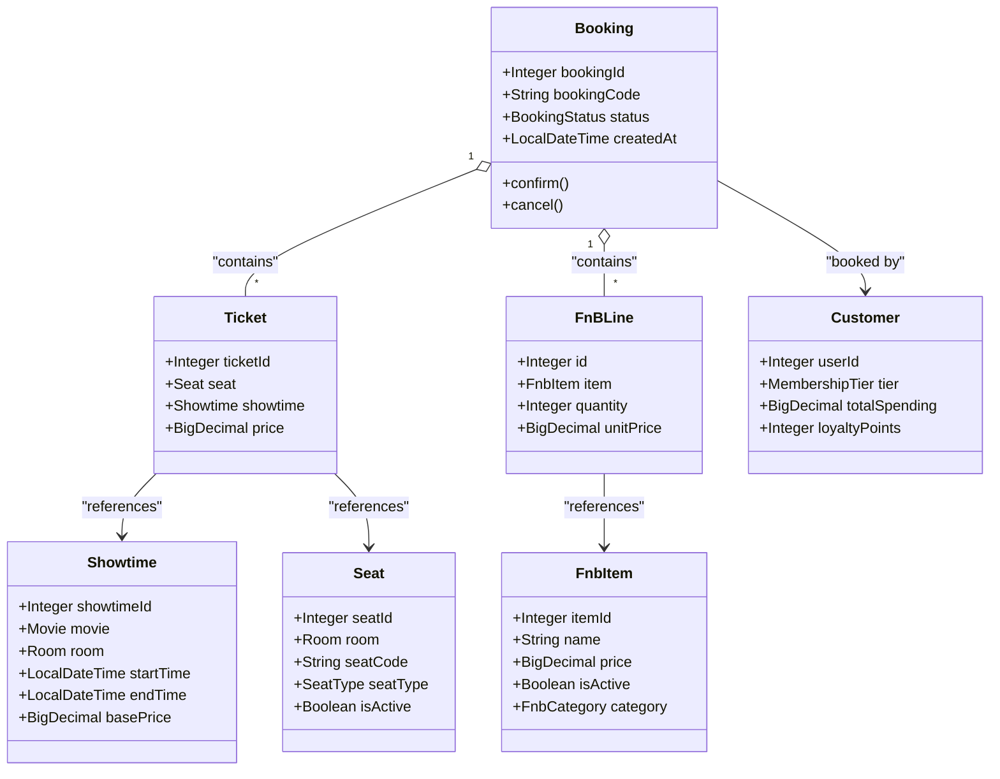
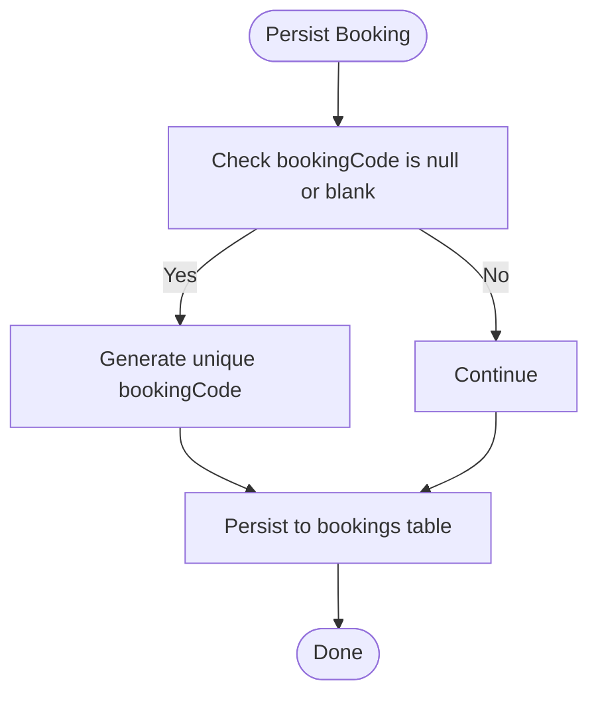
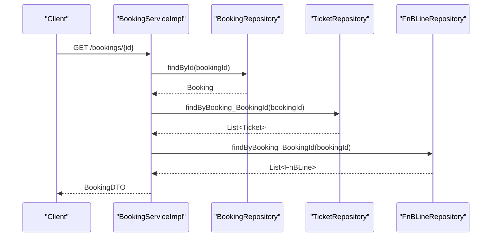
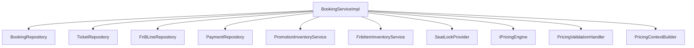
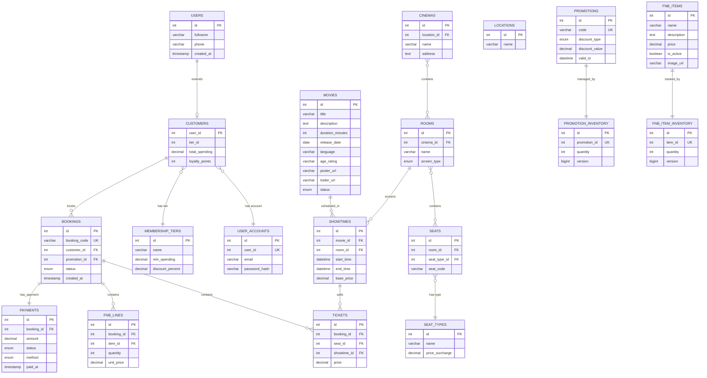

# Booking Data Models

<cite>
**Referenced Files in This Document**
- [Booking.java](file://backend/src/main/java/com/cinema/booking/entities/Booking.java)
- [Ticket.java](file://backend/src/main/java/com/cinema/booking/entities/Ticket.java)
- [FnBLine.java](file://backend/src/main/java/com/cinema/booking/entities/FnBLine.java)
- [Showtime.java](file://backend/src/main/java/com/cinema/booking/entities/Showtime.java)
- [Seat.java](file://backend/src/main/java/com/cinema/booking/entities/Seat.java)
- [Customer.java](file://backend/src/main/java/com/cinema/booking/entities/Customer.java)
- [FnbItem.java](file://backend/src/main/java/com/cinema/booking/entities/FnbItem.java)
- [BookingServiceImpl.java](file://backend/src/main/java/com/cinema/booking/services/impl/BookingServiceImpl.java)
- [BookingRepository.java](file://backend/src/main/java/com/cinema/booking/repositories/BookingRepository.java)
- [FnBLineRepository.java](file://backend/src/main/java/com/cinema/booking/repositories/FnBLineRepository.java)
- [BookingCalculationDTO.java](file://backend/src/main/java/com/cinema/booking/dtos/BookingCalculationDTO.java)
- [CheckoutRequest.java](file://backend/src/main/java/com/cinema/booking/dtos/CheckoutRequest.java)
- [BookingDTO.java](file://backend/src/main/java/com/cinema/booking/dtos/BookingDTO.java)
- [database_schema.sql](file://database_schema.sql)
</cite>

## Table of Contents
1. [Introduction](#introduction)
2. [Project Structure](#project-structure)
3. [Core Components](#core-components)
4. [Architecture Overview](#architecture-overview)
5. [Detailed Component Analysis](#detailed-component-analysis)
6. [Dependency Analysis](#dependency-analysis)
7. [Performance Considerations](#performance-considerations)
8. [Troubleshooting Guide](#troubleshooting-guide)
9. [Conclusion](#conclusion)
10. [Appendices](#appendices)

## Introduction
This document provides comprehensive data model documentation for booking-related entities in the cinema booking system. It focuses on the Booking aggregate root and its associated entities (Ticket and FnBLine), detailing bidirectional relationships with Users, Showtimes, Cinemas, Rooms, Seats, and Food & Beverage items. It also covers DTO transformations for API responses, database schema, indexing strategies, validation rules, and transaction boundaries for booking operations.

## Project Structure
The booking domain spans entities, repositories, services, and DTOs under the backend module, with the database schema defined in a dedicated SQL script.

**Diagram sources**
- [Booking.java:1-65](file://backend/src/main/java/com/cinema/booking/entities/Booking.java#L1-L65)
- [Ticket.java:1-38](file://backend/src/main/java/com/cinema/booking/entities/Ticket.java#L1-L38)
- [FnBLine.java:1-39](file://backend/src/main/java/com/cinema/booking/entities/FnBLine.java#L1-L39)
- [Showtime.java:1-38](file://backend/src/main/java/com/cinema/booking/entities/Showtime.java#L1-L38)
- [Seat.java:1-34](file://backend/src/main/java/com/cinema/booking/entities/Seat.java#L1-L34)
- [Customer.java:1-31](file://backend/src/main/java/com/cinema/booking/entities/Customer.java#L1-L31)
- [FnbItem.java:1-41](file://backend/src/main/java/com/cinema/booking/entities/FnbItem.java#L1-L41)
- [BookingRepository.java:1-11](file://backend/src/main/java/com/cinema/booking/repositories/BookingRepository.java#L1-L11)
- [FnBLineRepository.java:1-14](file://backend/src/main/java/com/cinema/booking/repositories/FnBLineRepository.java#L1-L14)
- [BookingServiceImpl.java:1-260](file://backend/src/main/java/com/cinema/booking/services/impl/BookingServiceImpl.java#L1-L260)
- [BookingCalculationDTO.java:1-19](file://backend/src/main/java/com/cinema/booking/dtos/BookingCalculationDTO.java#L1-L19)
- [CheckoutRequest.java:1-20](file://backend/src/main/java/com/cinema/booking/dtos/CheckoutRequest.java#L1-L20)
- [BookingDTO.java:1-55](file://backend/src/main/java/com/cinema/booking/dtos/BookingDTO.java#L1-L55)

**Section sources**
- [Booking.java:1-65](file://backend/src/main/java/com/cinema/booking/entities/Booking.java#L1-L65)
- [Ticket.java:1-38](file://backend/src/main/java/com/cinema/booking/entities/Ticket.java#L1-L38)
- [FnBLine.java:1-39](file://backend/src/main/java/com/cinema/booking/entities/FnBLine.java#L1-L39)
- [Showtime.java:1-38](file://backend/src/main/java/com/cinema/booking/entities/Showtime.java#L1-L38)
- [Seat.java:1-34](file://backend/src/main/java/com/cinema/booking/entities/Seat.java#L1-L34)
- [Customer.java:1-31](file://backend/src/main/java/com/cinema/booking/entities/Customer.java#L1-L31)
- [FnbItem.java:1-41](file://backend/src/main/java/com/cinema/booking/entities/FnbItem.java#L1-L41)
- [BookingRepository.java:1-11](file://backend/src/main/java/com/cinema/booking/repositories/BookingRepository.java#L1-L11)
- [FnBLineRepository.java:1-14](file://backend/src/main/java/com/cinema/booking/repositories/FnBLineRepository.java#L1-L14)
- [BookingServiceImpl.java:1-260](file://backend/src/main/java/com/cinema/booking/services/impl/BookingServiceImpl.java#L1-L260)
- [BookingCalculationDTO.java:1-19](file://backend/src/main/java/com/cinema/booking/dtos/BookingCalculationDTO.java#L1-L19)
- [CheckoutRequest.java:1-20](file://backend/src/main/java/com/cinema/booking/dtos/CheckoutRequest.java#L1-L20)
- [BookingDTO.java:1-55](file://backend/src/main/java/com/cinema/booking/dtos/BookingDTO.java#L1-L55)
- [database_schema.sql:1-267](file://database_schema.sql#L1-L267)

## Core Components
- Booking: Aggregate root for a booking session. Contains bidirectional relationships with Customer (via customer_id), Promotion (optional), and maintains lists of Tickets and FnBLines. Status is an enum with lifecycle transitions.
- Ticket: Line item representing a seat purchase linked to a specific Showtime and Seat. Stores the final price at time of booking.
- FnBLine: Line item representing ordered Food & Beverage items within a booking, capturing quantity and unit price at time of booking.
- Showtime: Defines screening details for a Movie in a Room with start/end times and base price.
- Seat: Represents a seat in a Room with seat code and seat type surcharge.
- Customer: Extends User; linked to User via primary key join; holds membership tier and spending metrics.
- FnbItem: Product catalog item for Food & Beverage with price and category.

**Section sources**
- [Booking.java:17-48](file://backend/src/main/java/com/cinema/booking/entities/Booking.java#L17-L48)
- [Ticket.java:17-36](file://backend/src/main/java/com/cinema/booking/entities/Ticket.java#L17-L36)
- [FnBLine.java:17-36](file://backend/src/main/java/com/cinema/booking/entities/FnBLine.java#L17-L36)
- [Showtime.java:14-35](file://backend/src/main/java/com/cinema/booking/entities/Showtime.java#L14-L35)
- [Seat.java:12-31](file://backend/src/main/java/com/cinema/booking/entities/Seat.java#L12-L31)
- [Customer.java:14-29](file://backend/src/main/java/com/cinema/booking/entities/Customer.java#L14-L29)
- [FnbItem.java:13-39](file://backend/src/main/java/com/cinema/booking/entities/FnbItem.java#L13-L39)

## Architecture Overview
The booking aggregate encapsulates creation, pricing, and state transitions. Services orchestrate pricing validation, inventory checks, and persistence while DTOs shape API responses.

**Diagram sources**
- [Booking.java:17-48](file://backend/src/main/java/com/cinema/booking/entities/Booking.java#L17-L48)
- [Ticket.java:17-36](file://backend/src/main/java/com/cinema/booking/entities/Ticket.java#L17-L36)
- [FnBLine.java:17-36](file://backend/src/main/java/com/cinema/booking/entities/FnBLine.java#L17-L36)
- [Showtime.java:14-35](file://backend/src/main/java/com/cinema/booking/entities/Showtime.java#L14-L35)
- [Seat.java:12-31](file://backend/src/main/java/com/cinema/booking/entities/Seat.java#L12-L31)
- [Customer.java:14-29](file://backend/src/main/java/com/cinema/booking/entities/Customer.java#L14-L29)
- [FnbItem.java:13-39](file://backend/src/main/java/com/cinema/booking/entities/FnbItem.java#L13-L39)

## Detailed Component Analysis

### Booking Entity
- Identity: Auto-generated integer id; unique bookingCode generated on persist if absent.
- Relationships:
  - Many-to-one with Customer via customer_id.
  - Optional many-to-one with Promotion via promotion_id.
  - One-to-many with Tickets and FnBLines.
- Lifecycle: Status enum supports PENDING, CONFIRMED, CANCELLED, REFUNDED; service-driven transitions via state context.
- Cascade behavior:
  - Tickets: cascade persist and remove orphan.
  - FnBLines: cascade persist.
- Validation: Ensures non-blank bookingCode before persist.

**Diagram sources**
- [Booking.java:58-63](file://backend/src/main/java/com/cinema/booking/entities/Booking.java#L58-L63)

**Section sources**
- [Booking.java:17-63](file://backend/src/main/java/com/cinema/booking/entities/Booking.java#L17-L63)

### Ticket Entity
- Identity: Auto-generated integer id.
- Bidirectional relationships:
  - Many-to-one with Booking via booking_id.
  - Many-to-one with Seat via seat_id.
  - Many-to-one with Showtime via showtime_id.
- Pricing: Final price stored at booking time.
- Implication: Seat and Showtime associations enable accurate revenue attribution and reporting.

**Section sources**
- [Ticket.java:17-36](file://backend/src/main/java/com/cinema/booking/entities/Ticket.java#L17-L36)

### FnBLine Entity
- Identity: Auto-generated integer id.
- Bidirectional relationships:
  - Many-to-one with Booking via booking_id.
  - Many-to-one with FnbItem via item_id.
- Pricing: Unit price captured at booking time; quantity tracked per line.
- Implication: Supports historical pricing and inventory rollback after cancellation/refund.

**Section sources**
- [FnBLine.java:17-36](file://backend/src/main/java/com/cinema/booking/entities/FnBLine.java#L17-L36)

### Showtime and Seat Entities
- Showtime defines screening window and base price; used to compute total booking price.
- Seat defines seat code and type surcharge; seat type influences final ticket price.

**Section sources**
- [Showtime.java:14-35](file://backend/src/main/java/com/cinema/booking/entities/Showtime.java#L14-L35)
- [Seat.java:12-31](file://backend/src/main/java/com/cinema/booking/entities/Seat.java#L12-L31)

### Customer and FnbItem Entities
- Customer extends User with membership and spending metrics; linked to User via primary key join.
- FnbItem represents menu items with price and category; used in FnBLine.

**Section sources**
- [Customer.java:14-29](file://backend/src/main/java/com/cinema/booking/entities/Customer.java#L14-L29)
- [FnbItem.java:13-39](file://backend/src/main/java/com/cinema/booking/entities/FnbItem.java#L13-L39)

### DTO Transformations
- BookingCalculationDTO: Request payload for price calculation including showtimeId, seatIds, fnbs (itemId, quantity), and promoCode.
- CheckoutRequest: Wrapper around BookingCalculationDTO plus userId and demoSuccess flag.
- BookingDTO: Response payload aggregating booking summary, tickets (with seat details), and FnB lines (with item names and computed totals).

**Diagram sources**
- [BookingServiceImpl.java:152-158](file://backend/src/main/java/com/cinema/booking/services/impl/BookingServiceImpl.java#L152-L158)
- [BookingServiceImpl.java:200-244](file://backend/src/main/java/com/cinema/booking/services/impl/BookingServiceImpl.java#L200-L244)
- [BookingRepository.java:1-11](file://backend/src/main/java/com/cinema/booking/repositories/BookingRepository.java#L1-L11)
- [FnBLineRepository.java:1-14](file://backend/src/main/java/com/cinema/booking/repositories/FnBLineRepository.java#L1-L14)

**Section sources**
- [BookingCalculationDTO.java:7-17](file://backend/src/main/java/com/cinema/booking/dtos/BookingCalculationDTO.java#L7-L17)
- [CheckoutRequest.java:10-18](file://backend/src/main/java/com/cinema/booking/dtos/CheckoutRequest.java#L10-L18)
- [BookingDTO.java:14-52](file://backend/src/main/java/com/cinema/booking/dtos/BookingDTO.java#L14-L52)
- [BookingServiceImpl.java:200-244](file://backend/src/main/java/com/cinema/booking/services/impl/BookingServiceImpl.java#L200-L244)

### Database Schema and Constraints
The schema defines foreign keys and cascading behavior consistent with the JPA entities:

- Bookings: customer_id references customers.user_id; promotion_id references promotions.id.
- Tickets: booking_id references bookings.id (CASCADE); seat_id references seats.id; showtime_id references showtimes.id.
- FnB Lines: booking_id references bookings.id (CASCADE); item_id references fnb_items.id.
- Payments: booking_id references bookings.id (CASCADE).
- Seat Types and Seats: seat_types.id references seats.seat_type_id.

Indexing strategies for performance optimization:
- Primary keys are auto-incremented integers (implicit index).
- Unique constraints: booking_code (bookings), phone (users), email (user_accounts), promo code (promotions).
- Foreign keys: ensure referential integrity and support efficient joins.
- Recommended secondary indexes:
  - bookings(customer_id, created_at)
  - tickets(showtime_id, seat_id)
  - fnb_lines(booking_id)
  - showtimes(movie_id, start_time)

Validation rules:
- Non-null constraints on required fields (e.g., booking_code, seat_id, showtime_id, item_id).
- Enum constraints for status and discount_type.
- Seat code uniqueness within a room enforced by application logic (not explicit SQL unique constraint in provided schema).

**Section sources**
- [database_schema.sql:186-244](file://database_schema.sql#L186-L244)

## Dependency Analysis
The service layer coordinates repositories and pricing/validation components to manage booking lifecycle and DTO mapping.

**Diagram sources**
- [BookingServiceImpl.java:36-76](file://backend/src/main/java/com/cinema/booking/services/impl/BookingServiceImpl.java#L36-L76)

**Section sources**
- [BookingServiceImpl.java:32-76](file://backend/src/main/java/com/cinema/booking/services/impl/BookingServiceImpl.java#L32-L76)

## Performance Considerations
- Use batch seat locks to avoid race conditions during selection.
- Cache pricing engine results where appropriate to reduce repeated computation.
- Indexes on frequently filtered/sorted columns (e.g., showtimes(movie_id, start_time), bookings(customer_id, created_at)).
- Minimize N+1 queries by fetching related collections in bulk (as done in mapping).
- Use pagination for listing operations.

## Troubleshooting Guide
Common issues and remedies:
- Booking not found: Ensure bookingId exists before invoking service methods.
- Seat conflicts: Verify seat availability via getSeatStatuses and lockSeat before persisting.
- Promotion invalid/expired: Validate promoCode via promotion inventory service prior to pricing.
- Inventory rollback: After cancellation/refund, release FnB and promotion inventory reservations.

**Section sources**
- [BookingServiceImpl.java:168-189](file://backend/src/main/java/com/cinema/booking/services/impl/BookingServiceImpl.java#L168-L189)
- [BookingServiceImpl.java:134-149](file://backend/src/main/java/com/cinema/booking/services/impl/BookingServiceImpl.java#L134-L149)

## Conclusion
The booking data model centers on the Booking aggregate with clear relationships to Tickets, FnBLines, Showtimes, Seats, and Customers. The schema enforces referential integrity and cascading behavior aligned with JPA annotations. DTOs provide structured API responses, and the service layer orchestrates pricing, validation, and state transitions with transaction boundaries to maintain data consistency.

## Appendices

### Entity Relationship Diagram (ERD)

**Diagram sources**
- [database_schema.sql:9-267](file://database_schema.sql#L9-L267)