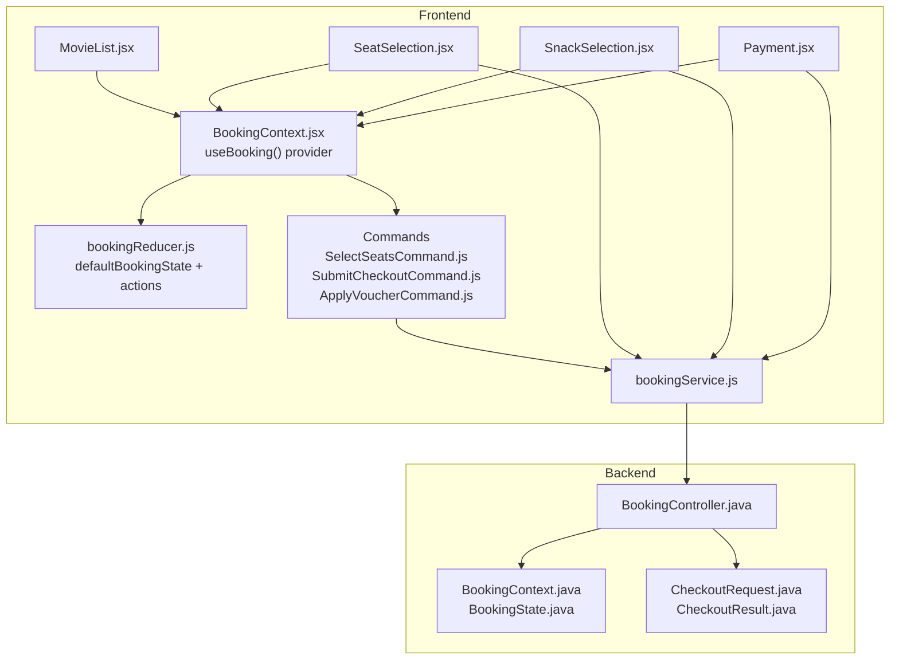
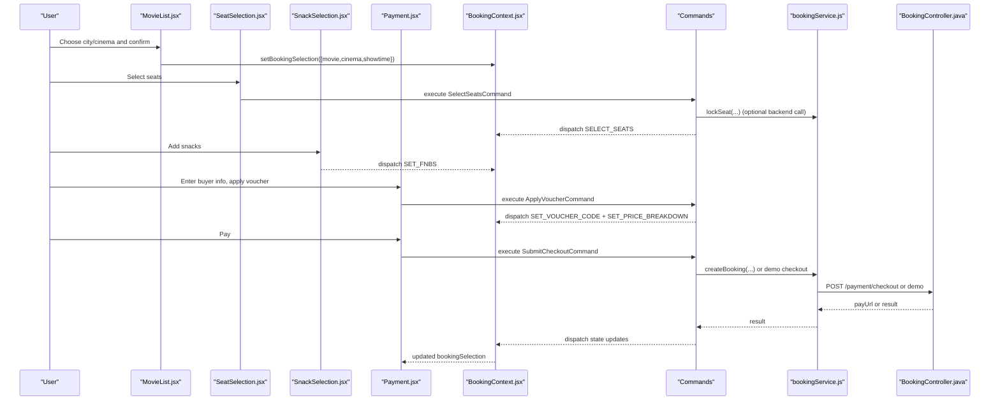
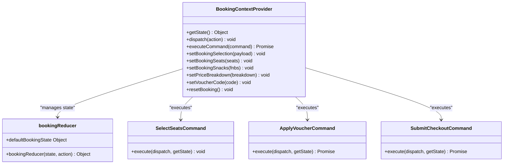
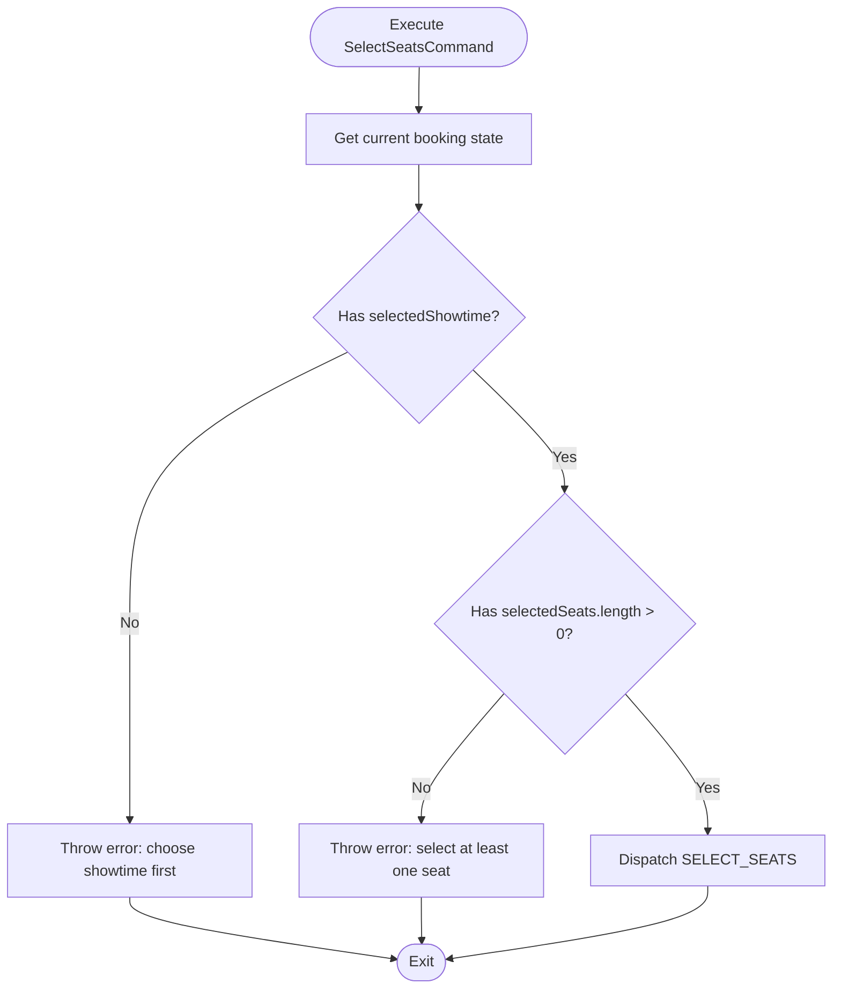
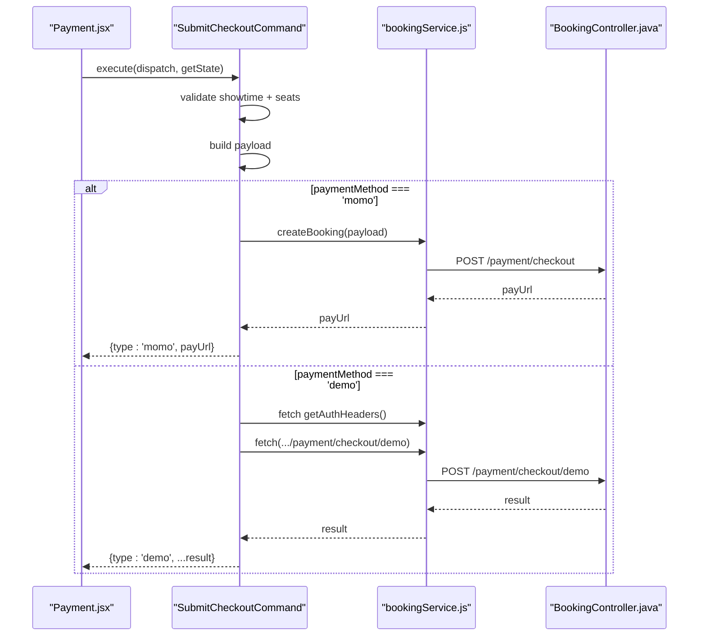
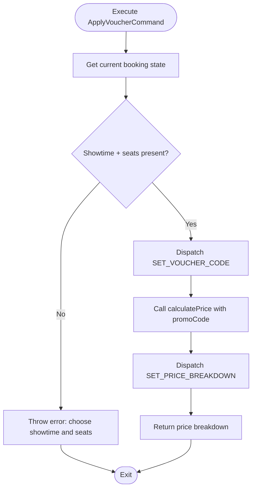
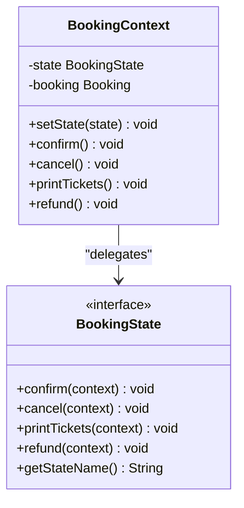
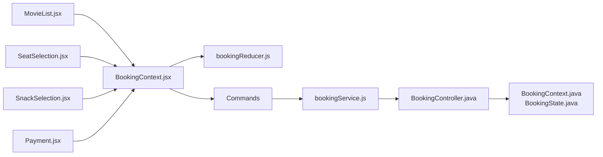

# Booking Flow

<cite>
**Referenced Files in This Document**
- [BookingContext.jsx](file://frontend/src/contexts/BookingContext.jsx)
- [bookingReducer.js](file://frontend/src/booking/bookingReducer.js)
- [bookingActionTypes.js](file://frontend/src/booking/bookingActionTypes.js)
- [SelectSeatsCommand.js](file://frontend/src/booking/commands/SelectSeatsCommand.js)
- [SubmitCheckoutCommand.js](file://frontend/src/booking/commands/SubmitCheckoutCommand.js)
- [ApplyVoucherCommand.js](file://frontend/src/booking/commands/ApplyVoucherCommand.js)
- [MovieList.jsx](file://frontend/src/pages/MovieList.jsx)
- [SeatSelection.jsx](file://frontend/src/pages/SeatSelection.jsx)
- [SnackSelection.jsx](file://frontend/src/pages/SnackSelection.jsx)
- [Payment.jsx](file://frontend/src/pages/Payment.jsx)
- [bookingService.js](file://frontend/src/services/bookingService.js)
- [BookingController.java](file://backend/src/main/java/com/cinema/booking/controllers/BookingController.java)
- [BookingContext.java](file://backend/src/main/java/com/cinema/booking/patterns/state/BookingContext.java)
- [BookingState.java](file://backend/src/main/java/com/cinema/booking/patterns/state/BookingState.java)
- [CheckoutRequest.java](file://backend/src/main/java/com/cinema/booking/dtos/CheckoutRequest.java)
- [CheckoutResult.java](file://backend/src/main/java/com/cinema/booking/dtos/CheckoutResult.java)
</cite>

## Table of Contents
1. [Introduction](#introduction)
2. [Project Structure](#project-structure)
3. [Core Components](#core-components)
4. [Architecture Overview](#architecture-overview)
5. [Detailed Component Analysis](#detailed-component-analysis)
6. [Dependency Analysis](#dependency-analysis)
7. [Performance Considerations](#performance-considerations)
8. [Troubleshooting Guide](#troubleshooting-guide)
9. [Conclusion](#conclusion)
10. [Appendices](#appendices)

## Introduction
This document explains the complete booking flow from movie selection to checkout completion. It covers the frontend implementation using React hooks, the reducer pattern for state management, and the command pattern for encapsulating operations. It also documents the booking state machine on the backend and the end-to-end flow across frontend pages and backend APIs. Practical guidance is included for state persistence using sessionStorage, backward compatibility with legacy setter methods, and common issues with their solutions.

## Project Structure
The booking flow spans three layers:
- Frontend React application with a centralized booking context, reducer, and command objects
- Frontend pages implementing each step: movie selection, seat selection, snack selection, and payment
- Backend REST APIs for seat rendering, locking/unlocking, pricing calculation, and checkout

**Diagram sources**
- [BookingContext.jsx:31-147](file://frontend/src/contexts/BookingContext.jsx#L31-L147)
- [bookingReducer.js:1-64](file://frontend/src/booking/bookingReducer.js#L1-L64)
- [SelectSeatsCommand.js:1-30](file://frontend/src/booking/commands/SelectSeatsCommand.js#L1-L30)
- [SubmitCheckoutCommand.js:1-71](file://frontend/src/booking/commands/SubmitCheckoutCommand.js#L1-L71)
- [ApplyVoucherCommand.js:1-40](file://frontend/src/booking/commands/ApplyVoucherCommand.js#L1-L40)
- [MovieList.jsx:1-475](file://frontend/src/pages/MovieList.jsx#L1-L475)
- [SeatSelection.jsx:1-365](file://frontend/src/pages/SeatSelection.jsx#L1-L365)
- [SnackSelection.jsx:1-310](file://frontend/src/pages/SnackSelection.jsx#L1-L310)
- [Payment.jsx:1-482](file://frontend/src/pages/Payment.jsx#L1-L482)
- [bookingService.js:1-85](file://frontend/src/services/bookingService.js#L1-L85)
- [BookingController.java:1-114](file://backend/src/main/java/com/cinema/booking/controllers/BookingController.java#L1-L114)
- [BookingContext.java:1-38](file://backend/src/main/java/com/cinema/booking/patterns/state/BookingContext.java#L1-L38)
- [BookingState.java:1-12](file://backend/src/main/java/com/cinema/booking/patterns/state/BookingState.java#L1-L12)
- [CheckoutRequest.java:1-20](file://backend/src/main/java/com/cinema/booking/dtos/CheckoutRequest.java#L1-L20)
- [CheckoutResult.java:1-16](file://backend/src/main/java/com/cinema/booking/dtos/CheckoutResult.java#L1-L16)

**Section sources**
- [BookingContext.jsx:1-150](file://frontend/src/contexts/BookingContext.jsx#L1-L150)
- [bookingReducer.js:1-64](file://frontend/src/booking/bookingReducer.js#L1-L64)
- [bookingActionTypes.js:1-16](file://frontend/src/booking/bookingActionTypes.js#L1-L16)
- [SelectSeatsCommand.js:1-30](file://frontend/src/booking/commands/SelectSeatsCommand.js#L1-L30)
- [SubmitCheckoutCommand.js:1-71](file://frontend/src/booking/commands/SubmitCheckoutCommand.js#L1-L71)
- [ApplyVoucherCommand.js:1-40](file://frontend/src/booking/commands/ApplyVoucherCommand.js#L1-L40)
- [MovieList.jsx:1-475](file://frontend/src/pages/MovieList.jsx#L1-L475)
- [SeatSelection.jsx:1-365](file://frontend/src/pages/SeatSelection.jsx#L1-L365)
- [SnackSelection.jsx:1-310](file://frontend/src/pages/SnackSelection.jsx#L1-L310)
- [Payment.jsx:1-482](file://frontend/src/pages/Payment.jsx#L1-L482)
- [bookingService.js:1-85](file://frontend/src/services/bookingService.js#L1-L85)
- [BookingController.java:1-114](file://backend/src/main/java/com/cinema/booking/controllers/BookingController.java#L1-L114)
- [BookingContext.java:1-38](file://backend/src/main/java/com/cinema/booking/patterns/state/BookingContext.java#L1-L38)
- [BookingState.java:1-12](file://backend/src/main/java/com/cinema/booking/patterns/state/BookingState.java#L1-L12)
- [CheckoutRequest.java:1-20](file://backend/src/main/java/com/cinema/booking/dtos/CheckoutRequest.java#L1-L20)
- [CheckoutResult.java:1-16](file://backend/src/main/java/com/cinema/booking/dtos/CheckoutResult.java#L1-L16)

## Core Components
- BookingContext provider manages global booking state, exposes a getState getter, and integrates the command pattern via executeCommand. It persists state to sessionStorage and supports legacy setter methods for backward compatibility.
- bookingReducer defines the default booking state and pure reducers for each action type, ensuring predictable state transitions.
- Commands encapsulate operations and validation:
  - SelectSeatsCommand validates presence of a showtime and at least one seat before dispatching.
  - SubmitCheckoutCommand builds the checkout payload and delegates to backend APIs for real or demo checkout.
  - ApplyVoucherCommand validates prerequisites and updates price breakdown after applying a voucher.
- Frontend pages orchestrate navigation and data collection:
  - MovieList: selects city/cinema, filters showtimes, and sets movie/cinema/showtime.
  - SeatSelection: renders seat map, enforces selection limits and statuses, and forwards seats to the next step.
  - SnackSelection: aggregates F&B selections and computes totals.
  - Payment: collects buyer info, applies vouchers, and triggers checkout.
- Backend APIs:
  - BookingController exposes seat rendering, locking/unlocking, price calculation, and booking retrieval.
  - Booking state machine (context/state) governs lifecycle transitions (confirm, cancel, print, refund).

**Section sources**
- [BookingContext.jsx:31-147](file://frontend/src/contexts/BookingContext.jsx#L31-L147)
- [bookingReducer.js:7-62](file://frontend/src/booking/bookingReducer.js#L7-L62)
- [bookingActionTypes.js:5-15](file://frontend/src/booking/bookingActionTypes.js#L5-L15)
- [SelectSeatsCommand.js:9-28](file://frontend/src/booking/commands/SelectSeatsCommand.js#L9-L28)
- [SubmitCheckoutCommand.js:13-69](file://frontend/src/booking/commands/SubmitCheckoutCommand.js#L13-L69)
- [ApplyVoucherCommand.js:10-38](file://frontend/src/booking/commands/ApplyVoucherCommand.js#L10-L38)
- [MovieList.jsx:169-196](file://frontend/src/pages/MovieList.jsx#L169-L196)
- [SeatSelection.jsx:164-179](file://frontend/src/pages/SeatSelection.jsx#L164-L179)
- [SnackSelection.jsx:100-115](file://frontend/src/pages/SnackSelection.jsx#L100-L115)
- [Payment.jsx:144-199](file://frontend/src/pages/Payment.jsx#L144-L199)
- [BookingController.java:25-62](file://backend/src/main/java/com/cinema/booking/controllers/BookingController.java#L25-L62)
- [BookingContext.java:6-37](file://backend/src/main/java/com/cinema/booking/patterns/state/BookingContext.java#L6-L37)
- [BookingState.java:3-11](file://backend/src/main/java/com/cinema/booking/patterns/state/BookingState.java#L3-L11)

## Architecture Overview
The booking flow follows a layered architecture:
- UI Layer: Pages implement each step and delegate operations to the BookingContext.
- Domain Layer: Commands encapsulate business logic and validation.
- Service Layer: bookingService.js abstracts HTTP calls to backend endpoints.
- Backend Layer: BookingController exposes endpoints; state machine manages lifecycle.

**Diagram sources**
- [MovieList.jsx:169-196](file://frontend/src/pages/MovieList.jsx#L169-L196)
- [SeatSelection.jsx:164-179](file://frontend/src/pages/SeatSelection.jsx#L164-L179)
- [SnackSelection.jsx:100-115](file://frontend/src/pages/SnackSelection.jsx#L100-L115)
- [Payment.jsx:118-199](file://frontend/src/pages/Payment.jsx#L118-L199)
- [BookingContext.jsx:62-64](file://frontend/src/contexts/BookingContext.jsx#L62-L64)
- [SelectSeatsCommand.js:14-28](file://frontend/src/booking/commands/SelectSeatsCommand.js#L14-L28)
- [ApplyVoucherCommand.js:15-38](file://frontend/src/booking/commands/ApplyVoucherCommand.js#L15-L38)
- [SubmitCheckoutCommand.js:19-69](file://frontend/src/booking/commands/SubmitCheckoutCommand.js#L19-L69)
- [bookingService.js:64-84](file://frontend/src/services/bookingService.js#L64-L84)
- [BookingController.java:25-62](file://backend/src/main/java/com/cinema/booking/controllers/BookingController.java#L25-L62)

## Detailed Component Analysis

### Frontend Booking Context and State Machine
- Centralized state via useReducer ensures deterministic updates and simplifies debugging.
- executeCommand enables command-driven operations while preserving legacy setters for gradual migration.
- sessionStorage persistence keeps users’ progress across browser sessions.

**Diagram sources**
- [BookingContext.jsx:31-147](file://frontend/src/contexts/BookingContext.jsx#L31-L147)
- [bookingReducer.js:7-62](file://frontend/src/booking/bookingReducer.js#L7-L62)
- [SelectSeatsCommand.js:9-28](file://frontend/src/booking/commands/SelectSeatsCommand.js#L9-L28)
- [ApplyVoucherCommand.js:10-38](file://frontend/src/booking/commands/ApplyVoucherCommand.js#L10-L38)
- [SubmitCheckoutCommand.js:13-69](file://frontend/src/booking/commands/SubmitCheckoutCommand.js#L13-L69)

**Section sources**
- [BookingContext.jsx:31-147](file://frontend/src/contexts/BookingContext.jsx#L31-L147)
- [bookingReducer.js:7-62](file://frontend/src/booking/bookingReducer.js#L7-L62)
- [bookingActionTypes.js:5-15](file://frontend/src/booking/bookingActionTypes.js#L5-L15)

### Seat Selection Command and Validation
- Validates prerequisite: a showtime must be selected before seats can be chosen.
- Enforces minimum selection: at least one seat is required.
- Dispatches SELECT_SEATS with normalized seat data.

**Diagram sources**
- [SelectSeatsCommand.js:14-28](file://frontend/src/booking/commands/SelectSeatsCommand.js#L14-L28)

**Section sources**
- [SelectSeatsCommand.js:9-28](file://frontend/src/booking/commands/SelectSeatsCommand.js#L9-L28)

### Checkout Submission Command and Payment Flow
- Validates prerequisites: showtime and seats must exist.
- Builds payload with seatIds, F&B lines, and optional promo code.
- Supports two modes:
  - MoMo: calls backend checkout endpoint and receives a payUrl.
  - Demo: posts to a demo checkout endpoint and handles success/failure states.
- Returns structured results for downstream UI updates.

**Diagram sources**
- [SubmitCheckoutCommand.js:19-69](file://frontend/src/booking/commands/SubmitCheckoutCommand.js#L19-L69)
- [bookingService.js:64-84](file://frontend/src/services/bookingService.js#L64-L84)
- [BookingController.java:25-62](file://backend/src/main/java/com/cinema/booking/controllers/BookingController.java#L25-L62)

**Section sources**
- [SubmitCheckoutCommand.js:13-69](file://frontend/src/booking/commands/SubmitCheckoutCommand.js#L13-L69)
- [bookingService.js:64-84](file://frontend/src/services/bookingService.js#L64-L84)
- [BookingController.java:25-62](file://backend/src/main/java/com/cinema/booking/controllers/BookingController.java#L25-L62)

### Voucher Application Command
- Validates prerequisites: showtime and seats must be present.
- Dispatches SET_VOUCHER_CODE immediately to capture the code.
- Calls calculatePrice with promoCode to compute updated price breakdown and dispatches SET_PRICE_BREAKDOWN.

**Diagram sources**
- [ApplyVoucherCommand.js:15-38](file://frontend/src/booking/commands/ApplyVoucherCommand.js#L15-L38)

**Section sources**
- [ApplyVoucherCommand.js:10-38](file://frontend/src/booking/commands/ApplyVoucherCommand.js#L10-L38)

### Backend Booking State Machine
- The state machine encapsulates lifecycle transitions for a booking entity.
- Methods confirm, cancel, printTickets, and refund delegate to the current state implementation.
- setState synchronizes the in-memory state with the underlying entity’s status.

**Diagram sources**
- [BookingState.java:3-11](file://backend/src/main/java/com/cinema/booking/patterns/state/BookingState.java#L3-L11)
- [BookingContext.java:6-37](file://backend/src/main/java/com/cinema/booking/patterns/state/BookingContext.java#L6-L37)

**Section sources**
- [BookingState.java:1-12](file://backend/src/main/java/com/cinema/booking/patterns/state/BookingState.java#L1-L12)
- [BookingContext.java:1-38](file://backend/src/main/java/com/cinema/booking/patterns/state/BookingContext.java#L1-L38)

### End-to-End Booking Steps

#### Step 1: Movie Selection
- Users select city and cinema, then confirm to view showtimes.
- The selected movie, cinema, and showtime are stored via setBookingSelection and navigated to seat selection.

**Section sources**
- [MovieList.jsx:128-196](file://frontend/src/pages/MovieList.jsx#L128-L196)

#### Step 2: Seat Selection
- Seat map is fetched per showtime and rendered with statuses (vacant/sold/pending).
- Users can select up to a maximum number of seats; backend locking can be invoked optionally.
- Selected seats are normalized and forwarded to the next step.

**Section sources**
- [SeatSelection.jsx:68-179](file://frontend/src/pages/SeatSelection.jsx#L68-L179)
- [bookingService.js:6-25](file://frontend/src/services/bookingService.js#L6-L25)

#### Step 3: Snack Selection
- Users choose combo or single items; quantities are tracked and persisted.
- Totals for seats and snacks are computed and shown in the sidebar.

**Section sources**
- [SnackSelection.jsx:55-115](file://frontend/src/pages/SnackSelection.jsx#L55-L115)

#### Step 4: Payment and Checkout
- Buyers enter personal info; voucher can be applied to recalculate totals.
- Payment methods include MoMo (real checkout) and demo mode.
- On success/failure, the UI navigates to transaction history with appropriate parameters.

**Section sources**
- [Payment.jsx:72-199](file://frontend/src/pages/Payment.jsx#L72-L199)
- [bookingService.js:42-84](file://frontend/src/services/bookingService.js#L42-L84)
- [BookingController.java:25-62](file://backend/src/main/java/com/cinema/booking/controllers/BookingController.java#L25-L62)

## Dependency Analysis
- Frontend-to-Frontend:
  - Pages depend on BookingContext for state and setters.
  - Commands depend on bookingActionTypes and dispatch/getState.
- Frontend-to-Backend:
  - bookingService.js depends on BookingController endpoints.
  - Payment.jsx depends on checkout endpoints and demo handlers.
- Backend-to-Domain:
  - BookingController delegates to services implementing state transitions and pricing logic.

**Diagram sources**
- [MovieList.jsx:1-475](file://frontend/src/pages/MovieList.jsx#L1-L475)
- [SeatSelection.jsx:1-365](file://frontend/src/pages/SeatSelection.jsx#L1-L365)
- [SnackSelection.jsx:1-310](file://frontend/src/pages/SnackSelection.jsx#L1-L310)
- [Payment.jsx:1-482](file://frontend/src/pages/Payment.jsx#L1-L482)
- [BookingContext.jsx:1-150](file://frontend/src/contexts/BookingContext.jsx#L1-L150)
- [bookingReducer.js:1-64](file://frontend/src/booking/bookingReducer.js#L1-L64)
- [SelectSeatsCommand.js:1-30](file://frontend/src/booking/commands/SelectSeatsCommand.js#L1-L30)
- [ApplyVoucherCommand.js:1-40](file://frontend/src/booking/commands/ApplyVoucherCommand.js#L1-L40)
- [SubmitCheckoutCommand.js:1-71](file://frontend/src/booking/commands/SubmitCheckoutCommand.js#L1-L71)
- [bookingService.js:1-85](file://frontend/src/services/bookingService.js#L1-L85)
- [BookingController.java:1-114](file://backend/src/main/java/com/cinema/booking/controllers/BookingController.java#L1-L114)
- [BookingContext.java:1-38](file://backend/src/main/java/com/cinema/booking/patterns/state/BookingContext.java#L1-L38)
- [BookingState.java:1-12](file://backend/src/main/java/com/cinema/booking/patterns/state/BookingState.java#L1-L12)

**Section sources**
- [BookingContext.jsx:1-150](file://frontend/src/contexts/BookingContext.jsx#L1-L150)
- [bookingReducer.js:1-64](file://frontend/src/booking/bookingReducer.js#L1-L64)
- [bookingActionTypes.js:1-16](file://frontend/src/booking/bookingActionTypes.js#L1-L16)
- [SelectSeatsCommand.js:1-30](file://frontend/src/booking/commands/SelectSeatsCommand.js#L1-L30)
- [ApplyVoucherCommand.js:1-40](file://frontend/src/booking/commands/ApplyVoucherCommand.js#L1-L40)
- [SubmitCheckoutCommand.js:1-71](file://frontend/src/booking/commands/SubmitCheckoutCommand.js#L1-L71)
- [MovieList.jsx:1-475](file://frontend/src/pages/MovieList.jsx#L1-L475)
- [SeatSelection.jsx:1-365](file://frontend/src/pages/SeatSelection.jsx#L1-L365)
- [SnackSelection.jsx:1-310](file://frontend/src/pages/SnackSelection.jsx#L1-L310)
- [Payment.jsx:1-482](file://frontend/src/pages/Payment.jsx#L1-L482)
- [bookingService.js:1-85](file://frontend/src/services/bookingService.js#L1-L85)
- [BookingController.java:1-114](file://backend/src/main/java/com/cinema/booking/controllers/BookingController.java#L1-L114)
- [BookingContext.java:1-38](file://backend/src/main/java/com/cinema/booking/patterns/state/BookingContext.java#L1-L38)
- [BookingState.java:1-12](file://backend/src/main/java/com/cinema/booking/patterns/state/BookingState.java#L1-L12)

## Performance Considerations
- Prefer memoization for derived totals (seatTotal, snackTotal, grandTotal) to avoid unnecessary recalculations.
- Debounce or throttle UI interactions (e.g., quantity adjustments) to reduce re-renders.
- Use optimistic updates for seat locking/unlocking where appropriate, with rollback on failure.
- Batch API calls for price breakdown updates to minimize network overhead.
- Keep sessionStorage writes minimal and deferred to reduce I/O contention.

## Troubleshooting Guide
Common issues and resolutions:
- Missing showtime before seat selection:
  - Symptom: Error thrown when selecting seats.
  - Resolution: Ensure setBookingSelection is called before navigating to seat selection.
  - Section sources
    - [SelectSeatsCommand.js:17-20](file://frontend/src/booking/commands/SelectSeatsCommand.js#L17-L20)
    - [SeatSelection.jsx:64-66](file://frontend/src/pages/SeatSelection.jsx#L64-L66)
- No seats selected:
  - Symptom: Navigation blocked or errors in seat selection.
  - Resolution: Validate selectedSeats length and enforce minimum selection.
  - Section sources
    - [SeatSelection.jsx:164-168](file://frontend/src/pages/SeatSelection.jsx#L164-L168)
- Voucher validation failures:
  - Symptom: Messages indicating invalid or expired voucher.
  - Resolution: Ensure prerequisites (showtime + seats) are met; display messages returned by calculatePrice.
  - Section sources
    - [ApplyVoucherCommand.js:18-20](file://frontend/src/booking/commands/ApplyVoucherCommand.js#L18-L20)
    - [Payment.jsx:118-142](file://frontend/src/pages/Payment.jsx#L118-L142)
- Payment method limitations:
  - Symptom: Demo checkout only supported.
  - Resolution: Use MoMo for real payments; demo mode for testing.
  - Section sources
    - [Payment.jsx:144-171](file://frontend/src/pages/Payment.jsx#L144-L171)
- Session persistence issues:
  - Symptom: Booking state lost after refresh.
  - Resolution: Verify sessionStorage availability and integrity; fallback to default state if corrupted.
  - Section sources
    - [BookingContext.jsx:10-21](file://frontend/src/contexts/BookingContext.jsx#L10-L21)

## Conclusion
The booking flow combines a robust frontend state machine with command-driven operations and a clear backend API surface. The design emphasizes modularity, testability, and maintainability through patterns like reducer, command, and state machine. By leveraging sessionStorage and backward-compatible setters, the system balances modern development practices with gradual migration from legacy components.

## Appendices

### Booking State Transitions (Backend)
- The state machine supports transitions such as confirm, cancel, printTickets, and refund, delegating behavior to the current state implementation.

**Section sources**
- [BookingContext.java:22-36](file://backend/src/main/java/com/cinema/booking/patterns/state/BookingContext.java#L22-L36)
- [BookingState.java:4-7](file://backend/src/main/java/com/cinema/booking/patterns/state/BookingState.java#L4-L7)

### Checkout Request and Result DTOs
- CheckoutRequest carries user, showtime, seatIds, F&B orders, and optional promo code.
- CheckoutResult includes booking, payment, price breakdown, and payment-specific result.

**Section sources**
- [CheckoutRequest.java:10-18](file://backend/src/main/java/com/cinema/booking/dtos/CheckoutRequest.java#L10-L18)
- [CheckoutResult.java:10-14](file://backend/src/main/java/com/cinema/booking/dtos/CheckoutResult.java#L10-L14)