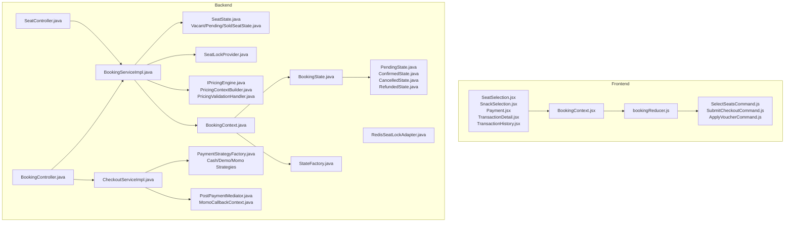
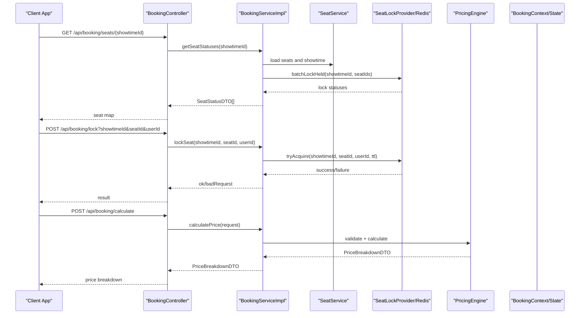
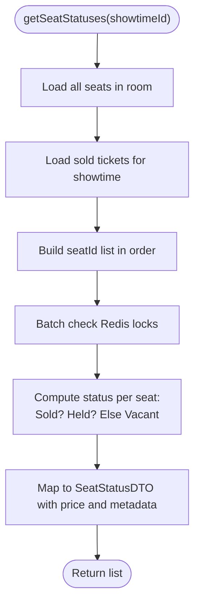
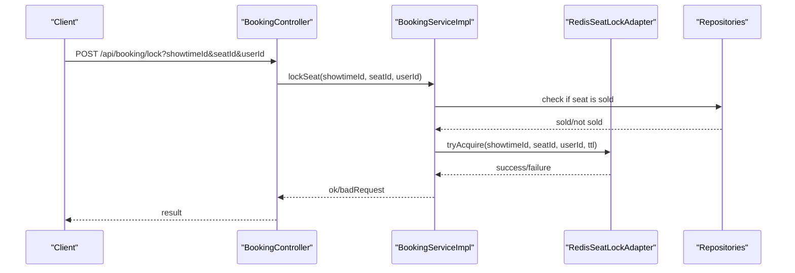
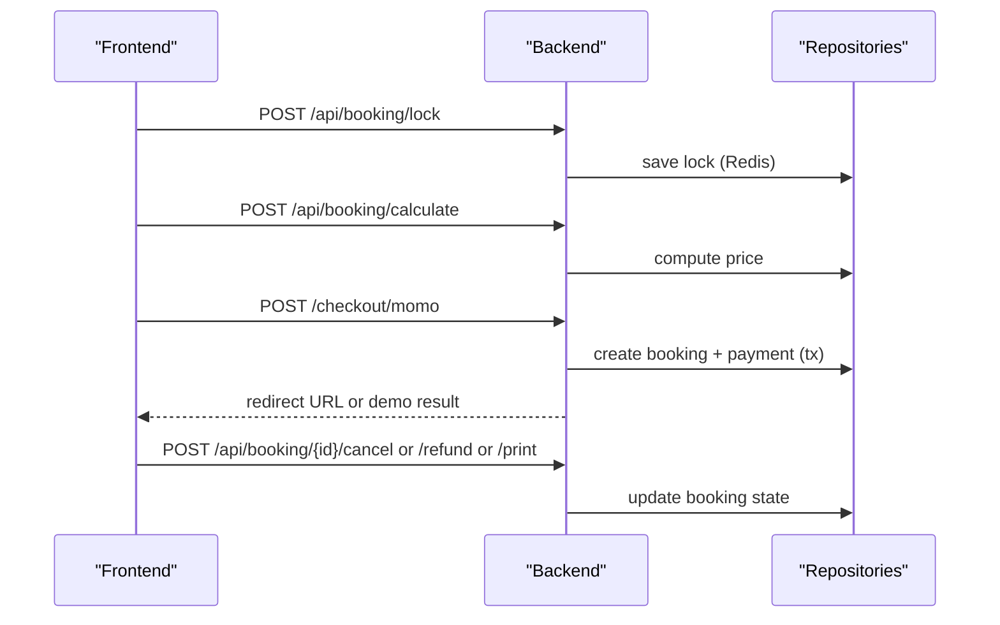
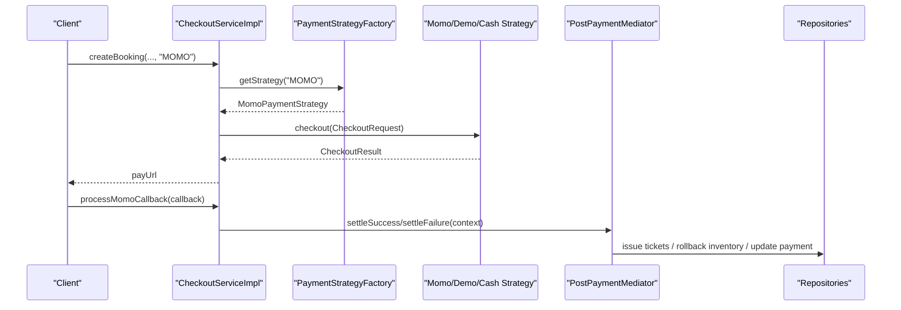
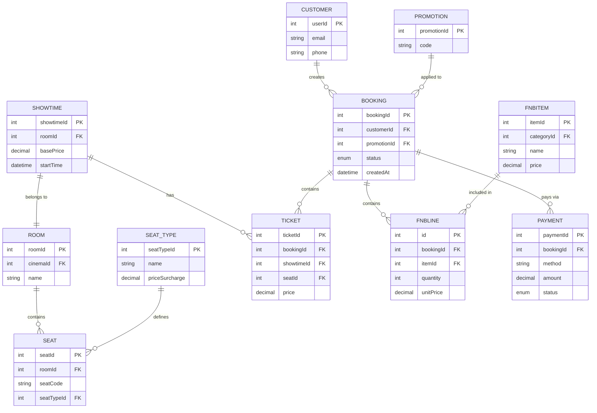
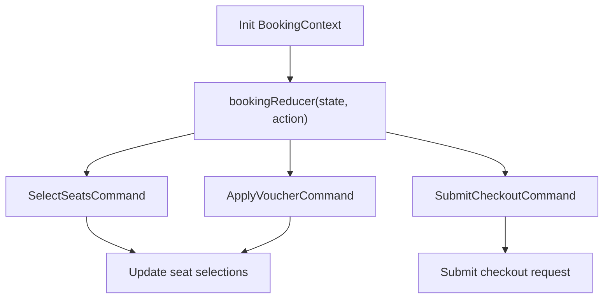
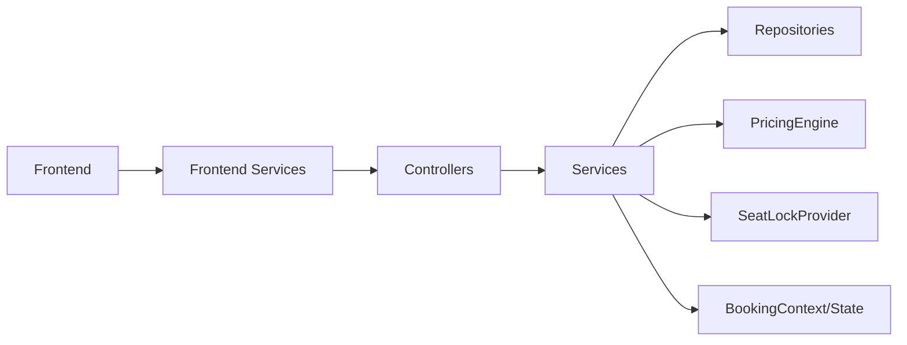

# Booking System

<cite>
**Referenced Files in This Document**
- [BookingController.java](file://backend/src/main/java/com/cinema/booking/controllers/BookingController.java)
- [SeatController.java](file://backend/src/main/java/com/cinema/booking/controllers/SeatController.java)
- [BookingServiceImpl.java](file://backend/src/main/java/com/cinema/booking/services/impl/BookingServiceImpl.java)
- [CheckoutServiceImpl.java](file://backend/src/main/java/com/cinema/booking/services/impl/CheckoutServiceImpl.java)
- [BookingContext.java](file://backend/src/main/java/com/cinema/booking/patterns/state/BookingContext.java)
- [BookingState.java](file://backend/src/main/java/com/cinema/booking/patterns/state/BookingState.java)
- [PendingState.java](file://backend/src/main/java/com/cinema/booking/patterns/state/PendingState.java)
- [ConfirmedState.java](file://backend/src/main/java/com/cinema/booking/patterns/state/ConfirmedState.java)
- [CancelledState.java](file://backend/src/main/java/com/cinema/booking/patterns/state/CancelledState.java)
- [RefundedState.java](file://backend/src/main/java/com/cinema/booking/patterns/state/RefundedState.java)
- [StateFactory.java](file://backend/src/main/java/com/cinema/booking/patterns/state/StateFactory.java)
- [SeatState.java](file://backend/src/main/java/com/cinema/booking/domain/seat/SeatState.java)
- [VacantSeatState.java](file://backend/src/main/java/com/cinema/booking/domain/seat/VacantSeatState.java)
- [PendingSeatState.java](file://backend/src/main/java/com/cinema/booking/domain/seat/PendingSeatState.java)
- [SoldSeatState.java](file://backend/src/main/java/com/cinema/booking/domain/seat/SoldSeatState.java)
- [SeatLockProvider.java](file://backend/src/main/java/com/cinema/booking/services/seatlock/SeatLockProvider.java)
- [RedisSeatLockAdapter.java](file://backend/src/main/java/com/cinema/booking/services/seatlock/RedisSeatLockAdapter.java)
- [BookingFactory.java](file://backend/src/main/java/com/cinema/booking/services/factory/BookingFactory.java)
- [CheckoutRequest.java](file://backend/src/main/java/com/cinema/booking/dtos/CheckoutRequest.java)
- [CheckoutResult.java](file://backend/src/main/java/com/cinema/booking/dtos/CheckoutResult.java)
- [SeatStatusDTO.java](file://backend/src/main/java/com/cinema/booking/dtos/SeatStatusDTO.java)
- [SeatStateFactory.java](file://backend/src/main/java/com/cinema/booking/domain/seat/SeatStateFactory.java)
- [SeatServiceImpl.java](file://backend/src/main/java/com/cinema/booking/services/impl/SeatServiceImpl.java)
- [SeatService.java](file://backend/src/main/java/com/cinema/booking/services/SeatService.java)
- [ShowtimeRepository.java](file://backend/src/main/java/com/cinema/booking/repositories/ShowtimeRepository.java)
- [SeatRepository.java](file://backend/src/main/java/com/cinema/booking/repositories/SeatRepository.java)
- [TicketRepository.java](file://backend/src/main/java/com/cinema/booking/repositories/TicketRepository.java)
- [BookingRepository.java](file://backend/src/main/java/com/cinema/booking/repositories/BookingRepository.java)
- [PaymentRepository.java](file://backend/src/main/java/com/cinema/booking/repositories/PaymentRepository.java)
- [FnBLineRepository.java](file://backend/src/main/java/com/cinema/booking/repositories/FnBLineRepository.java)
- [PromotionInventoryService.java](file://backend/src/main/java/com/cinema/booking/services/PromotionInventoryService.java)
- [FnbItemInventoryService.java](file://backend/src/main/java/com/cinema/booking/services/FnbItemInventoryService.java)
- [IPricingEngine.java](file://backend/src/main/java/com/cinema/booking/services/strategy_decorator/pricing/IPricingEngine.java)
- [PricingContextBuilder.java](file://backend/src/main/java/com/cinema/booking/services/strategy_decorator/pricing/PricingContextBuilder.java)
- [PricingValidationHandler.java](file://backend/src/main/java/com/cinema/booking/services/strategy_decorator/pricing/validation/PricingValidationHandler.java)
- [PostPaymentMediator.java](file://backend/src/main/java/com/cinema/booking/patterns/mediator/PostPaymentMediator.java)
- [MomoCallbackContext.java](file://backend/src/main/java/com/cinema/booking/patterns/mediator/MomoCallbackContext.java)
- [MomoService.java](file://backend/src/main/java/com/cinema/booking/services/MomoService.java)
- [PaymentStrategyFactory.java](file://backend/src/main/java/com/cinema/booking/services/payment/PaymentStrategyFactory.java)
- [CashPaymentStrategy.java](file://backend/src/main/java/com/cinema/booking/services/payment/CashPaymentStrategy.java)
- [DemoPaymentStrategy.java](file://backend/src/main/java/com/cinema/booking/services/payment/DemoPaymentStrategy.java)
- [MomoPaymentStrategy.java](file://backend/src/main/java/com/cinema/booking/services/payment/MomoPaymentStrategy.java)
- [BookingDTO.java](file://backend/src/main/java/com/cinema/booking/dtos/BookingDTO.java)
- [PriceBreakdownDTO.java](file://backend/src/main/java/com/cinema/booking/dtos/PriceBreakdownDTO.java)
- [BookingCalculationDTO.java](file://backend/src/main/java/com/cinema/booking/dtos/BookingCalculationDTO.java)
- [Showtime.java](file://backend/src/main/java/com/cinema/booking/entities/Showtime.java)
- [Seat.java](file://backend/src/main/java/com/cinema/booking/entities/Seat.java)
- [Ticket.java](file://backend/src/main/java/com/cinema/booking/entities/Ticket.java)
- [Booking.java](file://backend/src/main/java/com/cinema/booking/entities/Booking.java)
- [Payment.java](file://backend/src/main/java/com/cinema/booking/entities/Payment.java)
- [FnBLine.java](file://backend/src/main/java/com/cinema/booking/entities/FnBLine.java)
- [application.properties](file://backend/src/main/resources/application.properties)
- [public_api_test.http](file://backend/public_api_test.http)
- [BookingContext.jsx](file://frontend/src/contexts/BookingContext.jsx)
- [bookingReducer.js](file://frontend/src/booking/bookingReducer.js)
- [SelectSeatsCommand.js](file://frontend/src/booking/commands/SelectSeatsCommand.js)
- [SubmitCheckoutCommand.js](file://frontend/src/booking/commands/SubmitCheckoutCommand.js)
- [ApplyVoucherCommand.js](file://frontend/src/booking/commands/ApplyVoucherCommand.js)
- [bookingActionTypes.js](file://frontend/src/booking/bookingActionTypes.js)
- [bookingService.js](file://frontend/src/services/bookingService.js)
- [showtimeService.js](file://frontend/src/services/showtimeService.js)
- [movieService.js](file://frontend/src/services/movieService.js)
- [SeatSelection.jsx](file://frontend/src/pages/SeatSelection.jsx)
- [SnackSelection.jsx](file://frontend/src/pages/SnackSelection.jsx)
- [Payment.jsx](file://frontend/src/pages/Payment.jsx)
- [TransactionDetail.jsx](file://frontend/src/pages/TransactionDetail.jsx)
- [TransactionHistory.jsx](file://frontend/src/pages/TransactionHistory.jsx)
- [BoxOfficePOS.jsx](file://frontend/src/pages/staff/BoxOfficePOS.jsx)
- [OrderLookup.jsx](file://frontend/src/pages/staff/OrderLookup.jsx)
- [database_schema.sql](file://database_schema.sql)
</cite>

## Table of Contents
1. [Introduction](#introduction)
2. [Project Structure](#project-structure)
3. [Core Components](#core-components)
4. [Architecture Overview](#architecture-overview)
5. [Detailed Component Analysis](#detailed-component-analysis)
6. [Dependency Analysis](#dependency-analysis)
7. [Performance Considerations](#performance-considerations)
8. [Troubleshooting Guide](#troubleshooting-guide)
9. [Conclusion](#conclusion)
10. [Appendices](#appendices)

## Introduction
This document provides comprehensive documentation for the booking system implementation. It covers the end-to-end booking flow from movie and showtime selection to seat selection, checkout completion, and state management. It explains seat selection logic with real-time availability checking via Redis-backed seat locking, the multi-step booking process with state persistence, and the state pattern used to manage booking lifecycle. It also documents the frontend booking context built with React hooks and a reducer pattern, plus command pattern for booking operations. On the backend, it details the booking service implementation, factory pattern for creating booking-related entities, checkout validation pipeline, and booking state transitions. Additional topics include seat locking with Redis integration, concurrency control, seat availability validation, booking data models and relationships, and transaction handling. Practical examples of booking API endpoints, frontend integration patterns, and error handling strategies are included.

## Project Structure
The booking system spans both backend and frontend layers:
- Backend: Spring Boot application exposing REST APIs for booking, seat management, pricing, and checkout. It implements design patterns such as State, Factory, Mediator, Chain of Responsibility, Strategy/Decorator, and Proxy.
- Frontend: React application with booking context, reducer-driven state updates, and command-based operations for seat selection, snack ordering, and checkout submission.

**Diagram sources**
- [BookingController.java:1-114](file://backend/src/main/java/com/cinema/booking/controllers/BookingController.java#L1-L114)
- [SeatController.java:1-60](file://backend/src/main/java/com/cinema/booking/controllers/SeatController.java#L1-L60)
- [BookingServiceImpl.java:1-260](file://backend/src/main/java/com/cinema/booking/services/impl/BookingServiceImpl.java#L1-L260)
- [CheckoutServiceImpl.java:1-185](file://backend/src/main/java/com/cinema/booking/services/impl/CheckoutServiceImpl.java#L1-L185)
- [BookingContext.java:1-38](file://backend/src/main/java/com/cinema/booking/patterns/state/BookingContext.java#L1-L38)
- [BookingState.java:1-12](file://backend/src/main/java/com/cinema/booking/patterns/state/BookingState.java#L1-L12)
- [PendingState.java:1-30](file://backend/src/main/java/com/cinema/booking/patterns/state/PendingState.java#L1-L30)
- [ConfirmedState.java:1-31](file://backend/src/main/java/com/cinema/booking/patterns/state/ConfirmedState.java#L1-L31)
- [CancelledState.java:1-30](file://backend/src/main/java/com/cinema/booking/patterns/state/CancelledState.java#L1-L30)
- [RefundedState.java:1-30](file://backend/src/main/java/com/cinema/booking/patterns/state/RefundedState.java#L1-L30)
- [StateFactory.java:1-17](file://backend/src/main/java/com/cinema/booking/patterns/state/StateFactory.java#L1-L17)
- [SeatState.java:1-18](file://backend/src/main/java/com/cinema/booking/domain/seat/SeatState.java#L1-L18)
- [VacantSeatState.java:1-22](file://backend/src/main/java/com/cinema/booking/domain/seat/VacantSeatState.java#L1-L22)
- [PendingSeatState.java:1-22](file://backend/src/main/java/com/cinema/booking/domain/seat/PendingSeatState.java#L1-L22)
- [SoldSeatState.java:1-22](file://backend/src/main/java/com/cinema/booking/domain/seat/SoldSeatState.java#L1-L22)
- [SeatLockProvider.java:1-19](file://backend/src/main/java/com/cinema/booking/services/seatlock/SeatLockProvider.java#L1-L19)
- [RedisSeatLockAdapter.java:1-56](file://backend/src/main/java/com/cinema/booking/services/seatlock/RedisSeatLockAdapter.java#L1-L56)
- [IPricingEngine.java](file://backend/src/main/java/com/cinema/booking/services/strategy_decorator/pricing/IPricingEngine.java)
- [PricingContextBuilder.java](file://backend/src/main/java/com/cinema/booking/services/strategy_decorator/pricing/PricingContextBuilder.java)
- [PricingValidationHandler.java](file://backend/src/main/java/com/cinema/booking/services/strategy_decorator/pricing/validation/PricingValidationHandler.java)
- [PostPaymentMediator.java](file://backend/src/main/java/com/cinema/booking/patterns/mediator/PostPaymentMediator.java)
- [MomoCallbackContext.java](file://backend/src/main/java/com/cinema/booking/patterns/mediator/MomoCallbackContext.java)
- [PaymentStrategyFactory.java](file://backend/src/main/java/com/cinema/booking/services/payment/PaymentStrategyFactory.java)
- [CashPaymentStrategy.java](file://backend/src/main/java/com/cinema/booking/services/payment/CashPaymentStrategy.java)
- [DemoPaymentStrategy.java](file://backend/src/main/java/com/cinema/booking/services/payment/DemoPaymentStrategy.java)
- [MomoPaymentStrategy.java](file://backend/src/main/java/com/cinema/booking/services/payment/MomoPaymentStrategy.java)

**Section sources**
- [BookingController.java:1-114](file://backend/src/main/java/com/cinema/booking/controllers/BookingController.java#L1-L114)
- [SeatController.java:1-60](file://backend/src/main/java/com/cinema/booking/controllers/SeatController.java#L1-L60)

## Core Components
- Booking engine and seat availability:
  - Seat rendering and status calculation with real-time Redis locks.
  - Seat locking/unlocking with Redis SETNX and TTL.
  - Seat state machine for display and lock eligibility.
- Pricing and promotions:
  - Pricing engine with validation chain and caching proxy.
  - Promotion inventory integration for availability checks.
- Checkout pipeline:
  - Payment strategy factory supporting multiple methods.
  - Mediator pattern orchestrating post-payment actions.
  - MoMo callback verification and settlement.
- Booking state management:
  - State pattern enforcing legal transitions and guarding actions.
  - Persistence of state via entity synchronization.
- Frontend booking context:
  - React context and reducer managing multi-step booking state.
  - Command pattern encapsulating operations for seat selection, checkout, and voucher application.

**Section sources**
- [BookingServiceImpl.java:77-149](file://backend/src/main/java/com/cinema/booking/services/impl/BookingServiceImpl.java#L77-L149)
- [SeatLockProvider.java:1-19](file://backend/src/main/java/com/cinema/booking/services/seatlock/SeatLockProvider.java#L1-L19)
- [RedisSeatLockAdapter.java:23-54](file://backend/src/main/java/com/cinema/booking/services/seatlock/RedisSeatLockAdapter.java#L23-L54)
- [SeatState.java:1-18](file://backend/src/main/java/com/cinema/booking/domain/seat/SeatState.java#L1-L18)
- [VacantSeatState.java:1-22](file://backend/src/main/java/com/cinema/booking/domain/seat/VacantSeatState.java#L1-L22)
- [PendingSeatState.java:1-22](file://backend/src/main/java/com/cinema/booking/domain/seat/PendingSeatState.java#L1-L22)
- [SoldSeatState.java:1-22](file://backend/src/main/java/com/cinema/booking/domain/seat/SoldSeatState.java#L1-L22)
- [IPricingEngine.java](file://backend/src/main/java/com/cinema/booking/services/strategy_decorator/pricing/IPricingEngine.java)
- [PricingValidationHandler.java](file://backend/src/main/java/com/cinema/booking/services/strategy_decorator/pricing/validation/PricingValidationHandler.java)
- [CheckoutServiceImpl.java:43-183](file://backend/src/main/java/com/cinema/booking/services/impl/CheckoutServiceImpl.java#L43-L183)
- [PaymentStrategyFactory.java](file://backend/src/main/java/com/cinema/booking/services/payment/PaymentStrategyFactory.java)
- [PostPaymentMediator.java](file://backend/src/main/java/com/cinema/booking/patterns/mediator/PostPaymentMediator.java)
- [MomoCallbackContext.java](file://backend/src/main/java/com/cinema/booking/patterns/mediator/MomoCallbackContext.java)
- [BookingContext.java:1-38](file://backend/src/main/java/com/cinema/booking/patterns/state/BookingContext.java#L1-L38)
- [BookingState.java:1-12](file://backend/src/main/java/com/cinema/booking/patterns/state/BookingState.java#L1-L12)
- [PendingState.java:1-30](file://backend/src/main/java/com/cinema/booking/patterns/state/PendingState.java#L1-L30)
- [ConfirmedState.java:1-31](file://backend/src/main/java/com/cinema/booking/patterns/state/ConfirmedState.java#L1-L31)
- [CancelledState.java:1-30](file://backend/src/main/java/com/cinema/booking/patterns/state/CancelledState.java#L1-L30)
- [RefundedState.java:1-30](file://backend/src/main/java/com/cinema/booking/patterns/state/RefundedState.java#L1-L30)
- [StateFactory.java:1-17](file://backend/src/main/java/com/cinema/booking/patterns/state/StateFactory.java#L1-L17)
- [BookingContext.jsx](file://frontend/src/contexts/BookingContext.jsx)
- [bookingReducer.js](file://frontend/src/booking/bookingReducer.js)
- [SelectSeatsCommand.js](file://frontend/src/booking/commands/SelectSeatsCommand.js)
- [SubmitCheckoutCommand.js](file://frontend/src/booking/commands/SubmitCheckoutCommand.js)
- [ApplyVoucherCommand.js](file://frontend/src/booking/commands/ApplyVoucherCommand.js)

## Architecture Overview
The booking system integrates frontend and backend components with clear separation of concerns:
- Controllers expose REST endpoints for seat status, locking, pricing, booking retrieval/search, and state transitions.
- Services implement business logic including seat availability, pricing calculations, and checkout orchestration.
- Patterns are applied for robustness: State for booking lifecycle, Mediator for post-payment steps, Chain of Responsibility for validation, Strategy/Decorator for pricing, and Factory for entity creation.
- Redis is used for seat locking to prevent race conditions during concurrent booking attempts.
- Entities and DTOs define the data contracts and relationships.

**Diagram sources**
- [BookingController.java:25-62](file://backend/src/main/java/com/cinema/booking/controllers/BookingController.java#L25-L62)
- [BookingServiceImpl.java:77-149](file://backend/src/main/java/com/cinema/booking/services/impl/BookingServiceImpl.java#L77-L149)
- [SeatLockProvider.java:1-19](file://backend/src/main/java/com/cinema/booking/services/seatlock/SeatLockProvider.java#L1-L19)
- [RedisSeatLockAdapter.java:27-37](file://backend/src/main/java/com/cinema/booking/services/seatlock/RedisSeatLockAdapter.java#L27-L37)
- [IPricingEngine.java](file://backend/src/main/java/com/cinema/booking/services/strategy_decorator/pricing/IPricingEngine.java)

## Detailed Component Analysis

### Backend Booking Flow and State Management
The backend implements a robust booking flow with state transitions governed by the State pattern. The BookingContext holds the current state and synchronizes it with the underlying Booking entity. Legal transitions are enforced by state-specific implementations.

```mermaid
classDiagram
class BookingContext {
-BookingState state
-Booking booking
+setState(state)
+confirm()
+cancel()
+printTickets()
+refund()
}
class BookingState {
<<interface>>
+confirm(context)
+cancel(context)
+printTickets(context)
+refund(context)
+getStateName() String
}
class PendingState
class ConfirmedState
class CancelledState
class RefundedState
class StateFactory {
+getState(status) BookingState
}
BookingContext --> BookingState : "delegates"
PendingState ..|> BookingState
ConfirmedState ..|> BookingState
CancelledState ..|> BookingState
RefundedState ..|> BookingState
StateFactory --> PendingState : "returns"
StateFactory --> ConfirmedState : "returns"
StateFactory --> CancelledState : "returns"
StateFactory --> RefundedState : "returns"
```

**Diagram sources**
- [BookingContext.java:1-38](file://backend/src/main/java/com/cinema/booking/patterns/state/BookingContext.java#L1-L38)
- [BookingState.java:1-12](file://backend/src/main/java/com/cinema/booking/patterns/state/BookingState.java#L1-L12)
- [PendingState.java:1-30](file://backend/src/main/java/com/cinema/booking/patterns/state/PendingState.java#L1-L30)
- [ConfirmedState.java:1-31](file://backend/src/main/java/com/cinema/booking/patterns/state/ConfirmedState.java#L1-L31)
- [CancelledState.java:1-30](file://backend/src/main/java/com/cinema/booking/patterns/state/CancelledState.java#L1-L30)
- [RefundedState.java:1-30](file://backend/src/main/java/com/cinema/booking/patterns/state/RefundedState.java#L1-L30)
- [StateFactory.java:1-17](file://backend/src/main/java/com/cinema/booking/patterns/state/StateFactory.java#L1-L17)

Key behaviors:
- PendingState allows confirm/cancel; denies printTickets/refund.
- ConfirmedState allows printing tickets; denies confirm/cancel; allows refund.
- CancelledState denies confirm/cancel/printTickets/refund.
- RefundedState denies confirm/cancel/printTickets/refund.

State transitions are invoked via controller endpoints that delegate to the service layer, which constructs a BookingContext and calls the appropriate action.

**Section sources**
- [BookingContext.java:11-36](file://backend/src/main/java/com/cinema/booking/patterns/state/BookingContext.java#L11-L36)
- [PendingState.java:6-23](file://backend/src/main/java/com/cinema/booking/patterns/state/PendingState.java#L6-L23)
- [ConfirmedState.java:6-24](file://backend/src/main/java/com/cinema/booking/patterns/state/ConfirmedState.java#L6-L24)
- [CancelledState.java:6-23](file://backend/src/main/java/com/cinema/booking/patterns/state/CancelledState.java#L6-L23)
- [RefundedState.java:6-23](file://backend/src/main/java/com/cinema/booking/patterns/state/RefundedState.java#L6-L23)
- [StateFactory.java:6-15](file://backend/src/main/java/com/cinema/booking/patterns/state/StateFactory.java#L6-L15)
- [BookingController.java:81-112](file://backend/src/main/java/com/cinema/booking/controllers/BookingController.java#L81-L112)
- [BookingServiceImpl.java:168-198](file://backend/src/main/java/com/cinema/booking/services/impl/BookingServiceImpl.java#L168-L198)

### Seat Selection Logic and Real-Time Availability Checking
Seat availability is determined by combining:
- Seats in the room.
- Already sold tickets for the showtime.
- Current Redis locks for pending reservations.

SeatStateFactory maps snapshot flags (sold, held) to a display state and determines whether a lock attempt is allowed.

**Diagram sources**
- [BookingServiceImpl.java:77-115](file://backend/src/main/java/com/cinema/booking/services/impl/BookingServiceImpl.java#L77-L115)
- [SeatStateFactory.java](file://backend/src/main/java/com/cinema/booking/domain/seat/SeatStateFactory.java)
- [SeatState.java:10-16](file://backend/src/main/java/com/cinema/booking/domain/seat/SeatState.java#L10-L16)
- [VacantSeatState.java:13-20](file://backend/src/main/java/com/cinema/booking/domain/seat/VacantSeatState.java#L13-L20)
- [PendingSeatState.java:13-20](file://backend/src/main/java/com/cinema/booking/domain/seat/PendingSeatState.java#L13-L20)
- [SoldSeatState.java:13-20](file://backend/src/main/java/com/cinema/booking/domain/seat/SoldSeatState.java#L13-L20)

Seat locking uses Redis SETNX with a TTL to prevent race conditions. The adapter exposes a simple interface for acquisition, release, and batch lock checks.

**Diagram sources**
- [BookingController.java:32-46](file://backend/src/main/java/com/cinema/booking/controllers/BookingController.java#L32-L46)
- [BookingServiceImpl.java:117-126](file://backend/src/main/java/com/cinema/booking/services/impl/BookingServiceImpl.java#L117-L126)
- [RedisSeatLockAdapter.java:27-32](file://backend/src/main/java/com/cinema/booking/services/seatlock/RedisSeatLockAdapter.java#L27-L32)

Concurrency control:
- Seat locking uses Redis SETNX with TTL to ensure temporary exclusivity.
- Batch lock checks enable efficient seat map rendering.
- Unlock endpoint releases locks early.

Seat availability validation:
- SeatStateFactory.fromSnapshot(sold, held) selects the appropriate display state.
- SeatState.allowsLockAttempt() prevents attempting to lock sold seats.

**Section sources**
- [BookingServiceImpl.java:77-131](file://backend/src/main/java/com/cinema/booking/services/impl/BookingServiceImpl.java#L77-L131)
- [SeatState.java:10-16](file://backend/src/main/java/com/cinema/booking/domain/seat/SeatState.java#L10-L16)
- [VacantSeatState.java:18-20](file://backend/src/main/java/com/cinema/booking/domain/seat/VacantSeatState.java#L18-L20)
- [PendingSeatState.java:18-20](file://backend/src/main/java/com/cinema/booking/domain/seat/PendingSeatState.java#L18-L20)
- [SoldSeatState.java:18-20](file://backend/src/main/java/com/cinema/booking/domain/seat/SoldSeatState.java#L18-L20)
- [SeatLockProvider.java:10-17](file://backend/src/main/java/com/cinema/booking/services/seatlock/SeatLockProvider.java#L10-L17)
- [RedisSeatLockAdapter.java:23-54](file://backend/src/main/java/com/cinema/booking/services/seatlock/RedisSeatLockAdapter.java#L23-L54)

### Multi-Step Booking Process and State Persistence
The booking process is multi-step and persisted through the Booking entity. The frontend maintains booking state using a context and reducer, while the backend persists state transitions and related resources.

Frontend:
- BookingContext.jsx provides a React context for booking state.
- bookingReducer.js manages state updates with actions.
- Commands encapsulate operations: SelectSeatsCommand, SubmitCheckoutCommand, ApplyVoucherCommand.

Backend:
- Controllers expose endpoints for seat status, locking, pricing, booking retrieval/search, and state transitions.
- Services implement business logic and persist changes to repositories.
- BookingContext synchronizes state with the Booking entity.

**Diagram sources**
- [BookingController.java:25-112](file://backend/src/main/java/com/cinema/booking/controllers/BookingController.java#L25-L112)
- [BookingServiceImpl.java:168-198](file://backend/src/main/java/com/cinema/booking/services/impl/BookingServiceImpl.java#L168-L198)
- [CheckoutServiceImpl.java:43-183](file://backend/src/main/java/com/cinema/booking/services/impl/CheckoutServiceImpl.java#L43-L183)
- [BookingContext.jsx](file://frontend/src/contexts/BookingContext.jsx)
- [bookingReducer.js](file://frontend/src/booking/bookingReducer.js)
- [SelectSeatsCommand.js](file://frontend/src/booking/commands/SelectSeatsCommand.js)
- [SubmitCheckoutCommand.js](file://frontend/src/booking/commands/SubmitCheckoutCommand.js)
- [ApplyVoucherCommand.js](file://frontend/src/booking/commands/ApplyVoucherCommand.js)

**Section sources**
- [BookingController.java:25-112](file://backend/src/main/java/com/cinema/booking/controllers/BookingController.java#L25-L112)
- [BookingServiceImpl.java:168-198](file://backend/src/main/java/com/cinema/booking/services/impl/BookingServiceImpl.java#L168-L198)
- [CheckoutServiceImpl.java:43-183](file://backend/src/main/java/com/cinema/booking/services/impl/CheckoutServiceImpl.java#L43-L183)
- [BookingContext.jsx](file://frontend/src/contexts/BookingContext.jsx)
- [bookingReducer.js](file://frontend/src/booking/bookingReducer.js)
- [SelectSeatsCommand.js](file://frontend/src/booking/commands/SelectSeatsCommand.js)
- [SubmitCheckoutCommand.js](file://frontend/src/booking/commands/SubmitCheckoutCommand.js)
- [ApplyVoucherCommand.js](file://frontend/src/booking/commands/ApplyVoucherCommand.js)

### Checkout Validation Pipeline and Payment Strategies
The checkout pipeline validates requests and delegates payment processing via a strategy factory. The mediator pattern coordinates post-payment actions.

**Diagram sources**
- [CheckoutServiceImpl.java:43-130](file://backend/src/main/java/com/cinema/booking/services/impl/CheckoutServiceImpl.java#L43-L130)
- [PaymentStrategyFactory.java](file://backend/src/main/java/com/cinema/booking/services/payment/PaymentStrategyFactory.java)
- [MomoPaymentStrategy.java](file://backend/src/main/java/com/cinema/booking/services/payment/MomoPaymentStrategy.java)
- [DemoPaymentStrategy.java](file://backend/src/main/java/com/cinema/booking/services/payment/DemoPaymentStrategy.java)
- [CashPaymentStrategy.java](file://backend/src/main/java/com/cinema/booking/services/payment/CashPaymentStrategy.java)
- [PostPaymentMediator.java](file://backend/src/main/java/com/cinema/booking/patterns/mediator/PostPaymentMediator.java)
- [MomoCallbackContext.java](file://backend/src/main/java/com/cinema/booking/patterns/mediator/MomoCallbackContext.java)

Validation pipeline:
- PricingValidationHandler validates requests before pricing computation.
- Promotion availability is resolved via PromotionInventoryService.

**Section sources**
- [CheckoutServiceImpl.java:43-183](file://backend/src/main/java/com/cinema/booking/services/impl/CheckoutServiceImpl.java#L43-L183)
- [PricingValidationHandler.java](file://backend/src/main/java/com/cinema/booking/services/strategy_decorator/pricing/validation/PricingValidationHandler.java)
- [PromotionInventoryService.java](file://backend/src/main/java/com/cinema/booking/services/PromotionInventoryService.java)
- [PostPaymentMediator.java](file://backend/src/main/java/com/cinema/booking/patterns/mediator/PostPaymentMediator.java)

### Booking Data Models and Relationships
The booking domain centers around entities and their relationships. The following diagram outlines key entities and associations.

**Diagram sources**
- [Showtime.java](file://backend/src/main/java/com/cinema/booking/entities/Showtime.java)
- [Room.java](file://backend/src/main/java/com/cinema/booking/entities/Room.java)
- [Seat.java](file://backend/src/main/java/com/cinema/booking/entities/Seat.java)
- [SeatType.java](file://backend/src/main/java/com/cinema/booking/entities/SeatType.java)
- [Customer.java](file://backend/src/main/java/com/cinema/booking/entities/Customer.java)
- [Booking.java](file://backend/src/main/java/com/cinema/booking/entities/Booking.java)
- [Ticket.java](file://backend/src/main/java/com/cinema/booking/entities/Ticket.java)
- [FnBLine.java](file://backend/src/main/java/com/cinema/booking/entities/FnBLine.java)
- [FnbItem.java](file://backend/src/main/java/com/cinema/booking/entities/FnbItem.java)
- [Payment.java](file://backend/src/main/java/com/cinema/booking/entities/Payment.java)
- [Promotion.java](file://backend/src/main/java/com/cinema/booking/entities/Promotion.java)

**Section sources**
- [database_schema.sql](file://database_schema.sql)

### Frontend Booking Context, Reducer, and Commands
The frontend implements a booking context with React hooks and a reducer to manage multi-step booking state. Commands encapsulate operations to select seats, apply vouchers, and submit checkout.

**Diagram sources**
- [BookingContext.jsx](file://frontend/src/contexts/BookingContext.jsx)
- [bookingReducer.js](file://frontend/src/booking/bookingReducer.js)
- [SelectSeatsCommand.js](file://frontend/src/booking/commands/SelectSeatsCommand.js)
- [ApplyVoucherCommand.js](file://frontend/src/booking/commands/ApplyVoucherCommand.js)
- [SubmitCheckoutCommand.js](file://frontend/src/booking/commands/SubmitCheckoutCommand.js)

Integration patterns:
- Services for seat selection, snack selection, and payment integrate with the backend APIs.
- Pages coordinate user interactions and state updates.

**Section sources**
- [BookingContext.jsx](file://frontend/src/contexts/BookingContext.jsx)
- [bookingReducer.js](file://frontend/src/booking/bookingReducer.js)
- [SelectSeatsCommand.js](file://frontend/src/booking/commands/SelectSeatsCommand.js)
- [ApplyVoucherCommand.js](file://frontend/src/booking/commands/ApplyVoucherCommand.js)
- [SubmitCheckoutCommand.js](file://frontend/src/booking/commands/SubmitCheckoutCommand.js)
- [bookingService.js](file://frontend/src/services/bookingService.js)
- [showtimeService.js](file://frontend/src/services/showtimeService.js)
- [movieService.js](file://frontend/src/services/movieService.js)
- [SeatSelection.jsx](file://frontend/src/pages/SeatSelection.jsx)
- [SnackSelection.jsx](file://frontend/src/pages/SnackSelection.jsx)
- [Payment.jsx](file://frontend/src/pages/Payment.jsx)
- [TransactionDetail.jsx](file://frontend/src/pages/TransactionDetail.jsx)
- [TransactionHistory.jsx](file://frontend/src/pages/TransactionHistory.jsx)

## Dependency Analysis
The booking system exhibits layered dependencies:
- Controllers depend on services.
- Services depend on repositories, pricing engine, inventory services, and seat lock provider.
- State pattern components are isolated and reusable.
- Frontend depends on service modules and React context/reducer.

**Diagram sources**
- [BookingController.java:1-114](file://backend/src/main/java/com/cinema/booking/controllers/BookingController.java#L1-L114)
- [BookingServiceImpl.java:1-260](file://backend/src/main/java/com/cinema/booking/services/impl/BookingServiceImpl.java#L1-L260)
- [CheckoutServiceImpl.java:1-185](file://backend/src/main/java/com/cinema/booking/services/impl/CheckoutServiceImpl.java#L1-L185)
- [BookingContext.java:1-38](file://backend/src/main/java/com/cinema/booking/patterns/state/BookingContext.java#L1-L38)
- [SeatLockProvider.java:1-19](file://backend/src/main/java/com/cinema/booking/services/seatlock/SeatLockProvider.java#L1-L19)

**Section sources**
- [BookingController.java:1-114](file://backend/src/main/java/com/cinema/booking/controllers/BookingController.java#L1-L114)
- [BookingServiceImpl.java:1-260](file://backend/src/main/java/com/cinema/booking/services/impl/BookingServiceImpl.java#L1-L260)
- [CheckoutServiceImpl.java:1-185](file://backend/src/main/java/com/cinema/booking/services/impl/CheckoutServiceImpl.java#L1-L185)
- [BookingContext.java:1-38](file://backend/src/main/java/com/cinema/booking/patterns/state/BookingContext.java#L1-L38)
- [SeatLockProvider.java:1-19](file://backend/src/main/java/com/cinema/booking/services/seatlock/SeatLockProvider.java#L1-L19)

## Performance Considerations
- Redis seat locking:
  - Uses SETNX with TTL to avoid stale locks; batch lock checks reduce round trips.
  - Keys are scoped by showtimeId and seatId to minimize contention.
- Pricing engine:
  - Validation chain ensures only valid requests reach the pricing engine.
  - Caching proxy reduces repeated computations for identical requests.
- Transactions:
  - Checkout and state transitions are wrapped in transactions to maintain consistency.
- Seat rendering:
  - Batch lock checks and single seat queries minimize database load.

[No sources needed since this section provides general guidance]

## Troubleshooting Guide
Common issues and resolutions:
- Seat locking failures:
  - Verify Redis connectivity and key TTL configuration.
  - Ensure seat is not already sold before attempting to lock.
- Invalid MoMo callback signature:
  - Confirm signature verification logic and shared secret configuration.
  - Validate extraData parsing and URL decoding.
- State transition errors:
  - Ensure booking is in the correct state before invoking cancel/refund/printTickets.
- Pricing validation failures:
  - Check promotion availability and showtime future validation.
- Frontend state inconsistencies:
  - Ensure reducer actions are dispatched correctly and commands are executed in sequence.

**Section sources**
- [RedisSeatLockAdapter.java:27-32](file://backend/src/main/java/com/cinema/booking/services/seatlock/RedisSeatLockAdapter.java#L27-L32)
- [CheckoutServiceImpl.java:68-130](file://backend/src/main/java/com/cinema/booking/services/impl/CheckoutServiceImpl.java#L68-L130)
- [BookingContext.java:22-36](file://backend/src/main/java/com/cinema/booking/patterns/state/BookingContext.java#L22-L36)
- [PricingValidationHandler.java](file://backend/src/main/java/com/cinema/booking/services/strategy_decorator/pricing/validation/PricingValidationHandler.java)

## Conclusion
The booking system combines robust backend patterns (State, Mediator, Chain of Responsibility, Strategy/Decorator, Factory) with a responsive frontend context and reducer to deliver a seamless booking experience. Real-time seat availability is ensured via Redis-backed locking, while the state pattern enforces legal transitions and persistence. The checkout pipeline integrates payment strategies and post-payment mediation, and the pricing engine provides validated, cached calculations. Together, these components form a scalable and maintainable booking solution.

[No sources needed since this section summarizes without analyzing specific files]

## Appendices

### API Endpoints Overview
- Seat and booking:
  - GET /api/booking/seats/{showtimeId}
  - POST /api/booking/lock
  - POST /api/booking/unlock
  - POST /api/booking/calculate
  - GET /api/booking/{bookingId}
  - GET /api/booking/search
  - POST /api/booking/{bookingId}/cancel
  - POST /api/booking/{bookingId}/refund
  - POST /api/booking/{bookingId}/print
- Seat management:
  - GET /api/seats
  - GET /api/seats/{id}
  - POST /api/seats
  - PUT /api/seats/{id}
  - DELETE /api/seats/{id}
  - PUT /api/seats/batch/{roomId}

**Section sources**
- [BookingController.java:25-112](file://backend/src/main/java/com/cinema/booking/controllers/BookingController.java#L25-L112)
- [SeatController.java:20-57](file://backend/src/main/java/com/cinema/booking/controllers/SeatController.java#L20-L57)

### Frontend Integration Examples
- Seat selection page fetches seat statuses and applies seat locks.
- Snack selection page builds FnB orders.
- Payment page submits checkout via selected payment method.
- Transaction detail/history pages display booking details and state.

**Section sources**
- [SeatSelection.jsx](file://frontend/src/pages/SeatSelection.jsx)
- [SnackSelection.jsx](file://frontend/src/pages/SnackSelection.jsx)
- [Payment.jsx](file://frontend/src/pages/Payment.jsx)
- [TransactionDetail.jsx](file://frontend/src/pages/TransactionDetail.jsx)
- [TransactionHistory.jsx](file://frontend/src/pages/TransactionHistory.jsx)

### Backend Configuration References
- Redis TTL for seat locks is configurable.
- MoMo development mode toggles success outcomes for testing.

**Section sources**
- [application.properties](file://backend/src/main/resources/application.properties)
- [CheckoutServiceImpl.java:28-29](file://backend/src/main/java/com/cinema/booking/services/impl/CheckoutServiceImpl.java#L28-L29)