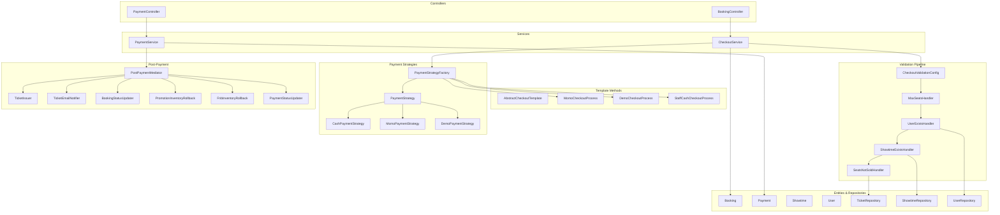
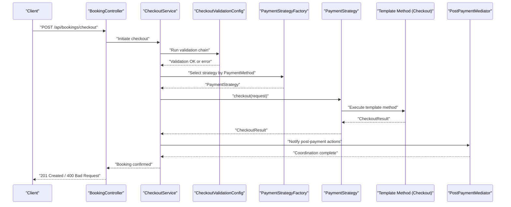
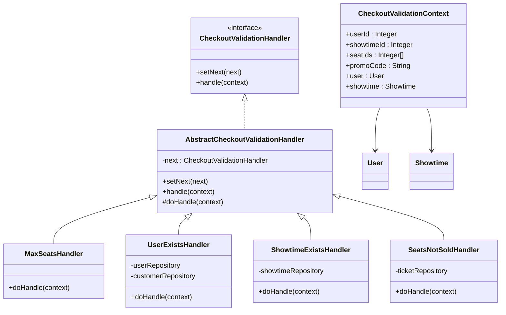
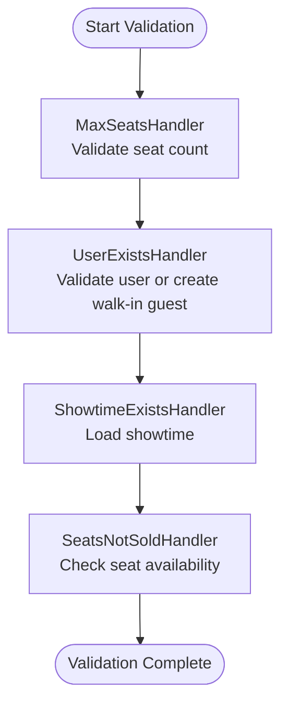
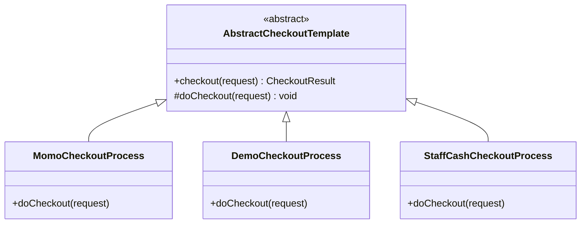
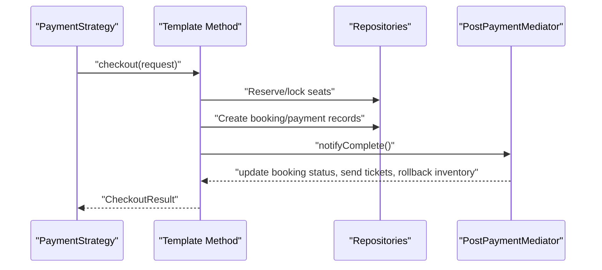
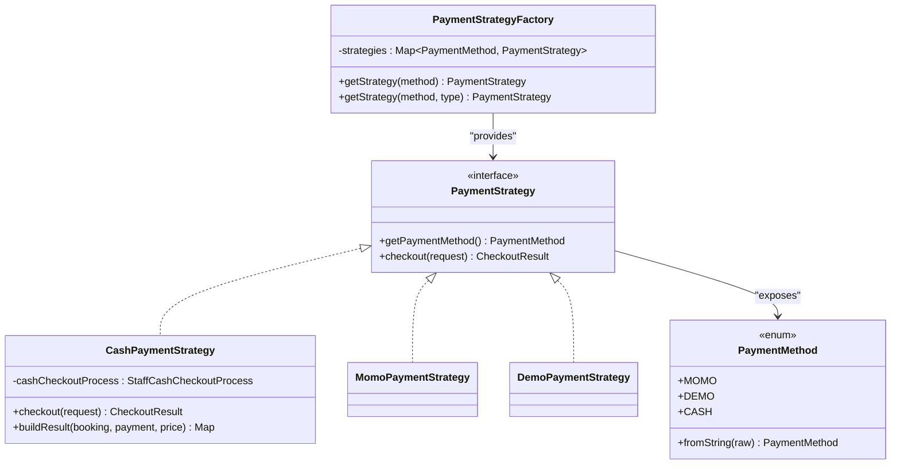
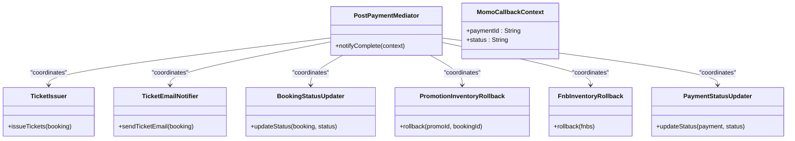
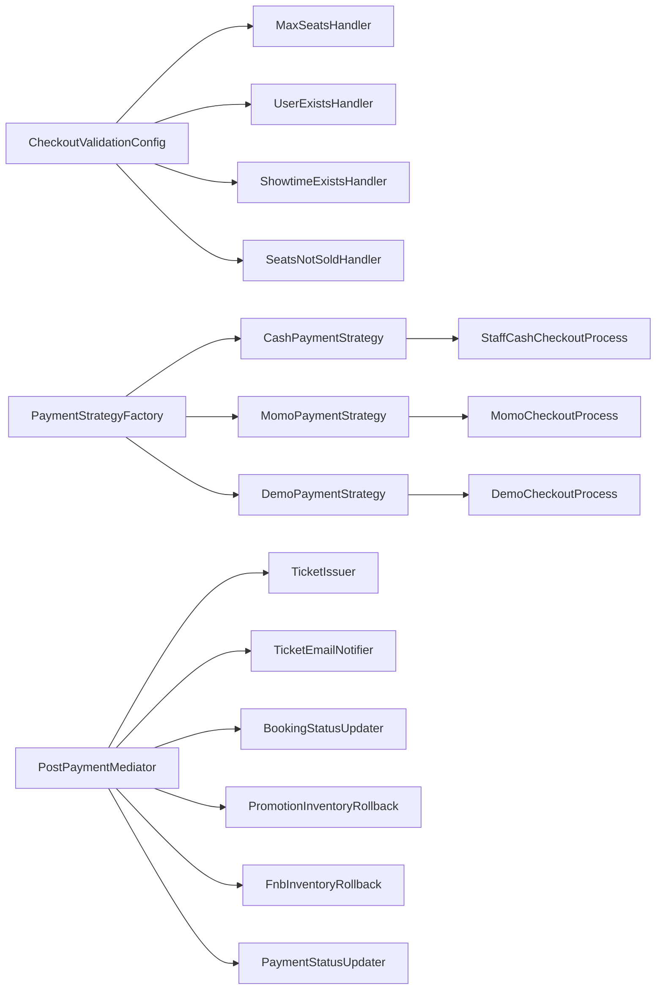

# Checkout Process

<cite>
**Referenced Files in This Document**
- [AbstractCheckoutValidationHandler.java](file://backend/src/main/java/com/cinema/booking/patterns/chainofresponsibility/AbstractCheckoutValidationHandler.java)
- [CheckoutValidationConfig.java](file://backend/src/main/java/com/cinema/booking/patterns/chainofresponsibility/CheckoutValidationConfig.java)
- [CheckoutValidationContext.java](file://backend/src/main/java/com/cinema/booking/patterns/chainofresponsibility/CheckoutValidationContext.java)
- [CheckoutValidationHandler.java](file://backend/src/main/java/com/cinema/booking/patterns/chainofresponsibility/CheckoutValidationHandler.java)
- [MaxSeatsHandler.java](file://backend/src/main/java/com/cinema/booking/patterns/chainofresponsibility/MaxSeatsHandler.java)
- [SeatsNotSoldHandler.java](file://backend/src/main/java/com/cinema/booking/patterns/chainofresponsibility/SeatsNotSoldHandler.java)
- [ShowtimeExistsHandler.java](file://backend/src/main/java/com/cinema/booking/patterns/chainofresponsibility/ShowtimeExistsHandler.java)
- [UserExistsHandler.java](file://backend/src/main/java/com/cinema/booking/patterns/chainofresponsibility/UserExistsHandler.java)
- [AbstractCheckoutTemplate.java](file://backend/src/main/java/com/cinema/booking/services/template_method/checkout/AbstractCheckoutTemplate.java)
- [DemoCheckoutProcess.java](file://backend/src/main/java/com/cinema/booking/services/template_method/checkout/DemoCheckoutProcess.java)
- [MomoCheckoutProcess.java](file://backend/src/main/java/com/cinema/booking/services/template_method/checkout/MomoCheckoutProcess.java)
- [StaffCashCheckoutProcess.java](file://backend/src/main/java/com/cinema/booking/services/template_method/checkout/StaffCashCheckoutProcess.java)
- [PaymentStrategy.java](file://backend/src/main/java/com/cinema/booking/services/payment/PaymentStrategy.java)
- [PaymentStrategyFactory.java](file://backend/src/main/java/com/cinema/booking/services/payment/PaymentStrategyFactory.java)
- [PaymentMethod.java](file://backend/src/main/java/com/cinema/booking/services/payment/PaymentMethod.java)
- [CashPaymentStrategy.java](file://backend/src/main/java/com/cinema/booking/services/payment/CashPaymentStrategy.java)
- [MomoPaymentStrategy.java](file://backend/src/main/java/com/cinema/booking/services/payment/MomoPaymentStrategy.java)
- [DemoPaymentStrategy.java](file://backend/src/main/java/com/cinema/booking/services/payment/DemoPaymentStrategy.java)
- [PostPaymentMediator.java](file://backend/src/main/java/com/cinema/booking/patterns/mediator/PostPaymentMediator.java)
- [TicketEmailNotifier.java](file://backend/src/main/java/com/cinema/booking/patterns/mediator/TicketEmailNotifier.java)
- [TicketIssuer.java](file://backend/src/main/java/com/cinema/booking/patterns/mediator/TicketIssuer.java)
- [BookingStatusUpdater.java](file://backend/src/main/java/com/cinema/booking/patterns/mediator/BookingStatusUpdater.java)
- [PromotionInventoryRollback.java](file://backend/src/main/java/com/cinema/booking/patterns/mediator/PromotionInventoryRollback.java)
- [FnbInventoryRollback.java](file://backend/src/main/java/com/cinema/booking/patterns/mediator/FnbInventoryRollback.java)
- [PaymentColleague.java](file://backend/src/main/java/com/cinema/booking/patterns/mediator/PaymentColleague.java)
- [MomoCallbackContext.java](file://backend/src/main/java/com/cinema/booking/patterns/mediator/MomoCallbackContext.java)
- [PaymentStatusUpdater.java](file://backend/src/main/java/com/cinema/booking/patterns/mediator/PaymentStatusUpdater.java)
- [CheckoutServiceImpl.java](file://backend/src/main/java/com/cinema/booking/services/impl/CheckoutServiceImpl.java)
- [CheckoutService.java](file://backend/src/main/java/com/cinema/booking/services/CheckoutService.java)
- [BookingController.java](file://backend/src/main/java/com/cinema/booking/controllers/BookingController.java)
- [PaymentController.java](file://backend/src/main/java/com/cinema/booking/controllers/PaymentController.java)
- [MomoCallbackRequest.java](file://backend/src/main/java/com/cinema/booking/dtos/MomoCallbackRequest.java)
- [MomoPaymentRequest.java](file://backend/src/main/java/com/cinema/booking/dtos/MomoPaymentRequest.java)
- [MomoPaymentResponse.java](file://backend/src/main/java/com/cinema/booking/dtos/MomoPaymentResponse.java)
- [CheckoutRequest.java](file://backend/src/main/java/com/cinema/booking/dtos/CheckoutRequest.java)
- [CheckoutResult.java](file://backend/src/main/java/com/cinema/booking/dtos/CheckoutResult.java)
- [PriceBreakdownDTO.java](file://backend/src/main/java/com/cinema/booking/dtos/PriceBreakdownDTO.java)
- [BookingDTO.java](file://backend/src/main/java/com/cinema/booking/dtos/BookingDTO.java)
- [Booking.java](file://backend/src/main/java/com/cinema/booking/entities/Booking.java)
- [Payment.java](file://backend/src/main/java/com/cinema/booking/entities/Payment.java)
- [Showtime.java](file://backend/src/main/java/com/cinema/booking/entities/Showtime.java)
- [User.java](file://backend/src/main/java/com/cinema/booking/entities/User.java)
- [TicketRepository.java](file://backend/src/main/java/com/cinema/booking/repositories/TicketRepository.java)
- [ShowtimeRepository.java](file://backend/src/main/java/com/cinema/booking/repositories/ShowtimeRepository.java)
- [UserRepository.java](file://backend/src/main/java/com/cinema/booking/repositories/UserRepository.java)
- [CustomerRepository.java](file://backend/src/main/java/com/cinema/booking/repositories/CustomerRepository.java)
- [BookingRepository.java](file://backend/src/main/java/com/cinema/booking/repositories/BookingRepository.java)
- [PaymentRepository.java](file://backend/src/main/java/com/cinema/booking/repositories/PaymentRepository.java)
- [TicketRepository.java](file://backend/src/main/java/com/cinema/booking/repositories/TicketRepository.java)
- [SecurityConfig.java](file://backend/src/main/java/com/cinema/booking/config/SecurityConfig.java)
- [JwtUtils.java](file://backend/src/main/java/com/cinema/booking/security/JwtUtils.java)
- [JwtAuthFilter.java](file://backend/src/main/java/com/cinema/booking/security/JwtAuthFilter.java)
</cite>

## Table of Contents
1. [Introduction](#introduction)
2. [Project Structure](#project-structure)
3. [Core Components](#core-components)
4. [Architecture Overview](#architecture-overview)
5. [Detailed Component Analysis](#detailed-component-analysis)
6. [Dependency Analysis](#dependency-analysis)
7. [Performance Considerations](#performance-considerations)
8. [Troubleshooting Guide](#troubleshooting-guide)
9. [Conclusion](#conclusion)
10. [Appendices](#appendices)

## Introduction
This document explains the checkout process implementation in the cinema booking system. It covers:
- The checkout validation pipeline using the Chain of Responsibility pattern
- The template method pattern for different checkout processes (MoMo, Demo, Staff Cash)
- Payment processing integration, status tracking, and callback handling
- Post-payment coordination using the Mediator pattern for booking updates, notifications, and inventory rollbacks
- Practical examples of checkout API endpoints, validation error handling, and payment failure recovery
- Security considerations for payment processing and PCI compliance

## Project Structure
The checkout system spans several packages:
- Validation pipeline: patterns/chainofresponsibility
- Template method checkout processes: services/template_method/checkout
- Payment strategies: services/payment
- Post-payment coordination: patterns/mediator
- Controllers and DTOs: controllers, dtos
- Entities and repositories: entities, repositories
- Security: config, security

**Diagram sources**
- [CheckoutValidationConfig.java:1-23](file://backend/src/main/java/com/cinema/booking/patterns/chainofresponsibility/CheckoutValidationConfig.java#L1-L23)
- [AbstractCheckoutTemplate.java](file://backend/src/main/java/com/cinema/booking/services/template_method/checkout/AbstractCheckoutTemplate.java)
- [MomoCheckoutProcess.java](file://backend/src/main/java/com/cinema/booking/services/template_method/checkout/MomoCheckoutProcess.java)
- [DemoCheckoutProcess.java](file://backend/src/main/java/com/cinema/booking/services/template_method/checkout/DemoCheckoutProcess.java)
- [StaffCashCheckoutProcess.java](file://backend/src/main/java/com/cinema/booking/services/template_method/checkout/StaffCashCheckoutProcess.java)
- [PaymentStrategyFactory.java:1-49](file://backend/src/main/java/com/cinema/booking/services/payment/PaymentStrategyFactory.java#L1-L49)
- [CashPaymentStrategy.java:1-40](file://backend/src/main/java/com/cinema/booking/services/payment/CashPaymentStrategy.java#L1-L40)
- [MomoPaymentStrategy.java](file://backend/src/main/java/com/cinema/booking/services/payment/MomoPaymentStrategy.java)
- [DemoPaymentStrategy.java](file://backend/src/main/java/com/cinema/booking/services/payment/DemoPaymentStrategy.java)
- [PostPaymentMediator.java](file://backend/src/main/java/com/cinema/booking/patterns/mediator/PostPaymentMediator.java)
- [TicketIssuer.java](file://backend/src/main/java/com/cinema/booking/patterns/mediator/TicketIssuer.java)
- [TicketEmailNotifier.java](file://backend/src/main/java/com/cinema/booking/patterns/mediator/TicketEmailNotifier.java)
- [BookingStatusUpdater.java](file://backend/src/main/java/com/cinema/booking/patterns/mediator/BookingStatusUpdater.java)
- [PromotionInventoryRollback.java](file://backend/src/main/java/com/cinema/booking/patterns/mediator/PromotionInventoryRollback.java)
- [FnbInventoryRollback.java](file://backend/src/main/java/com/cinema/booking/patterns/mediator/FnbInventoryRollback.java)
- [PaymentStatusUpdater.java](file://backend/src/main/java/com/cinema/booking/patterns/mediator/PaymentStatusUpdater.java)
- [CheckoutServiceImpl.java](file://backend/src/main/java/com/cinema/booking/services/impl/CheckoutServiceImpl.java)
- [BookingController.java](file://backend/src/main/java/com/cinema/booking/controllers/BookingController.java)
- [PaymentController.java](file://backend/src/main/java/com/cinema/booking/controllers/PaymentController.java)
- [TicketRepository.java](file://backend/src/main/java/com/cinema/booking/repositories/TicketRepository.java)
- [ShowtimeRepository.java](file://backend/src/main/java/com/cinema/booking/repositories/ShowtimeRepository.java)
- [UserRepository.java](file://backend/src/main/java/com/cinema/booking/repositories/UserRepository.java)
- [Booking.java](file://backend/src/main/java/com/cinema/booking/entities/Booking.java)
- [Payment.java](file://backend/src/main/java/com/cinema/booking/entities/Payment.java)
- [Showtime.java](file://backend/src/main/java/com/cinema/booking/entities/Showtime.java)
- [User.java](file://backend/src/main/java/com/cinema/booking/entities/User.java)

**Section sources**
- [CheckoutValidationConfig.java:1-23](file://backend/src/main/java/com/cinema/booking/patterns/chainofresponsibility/CheckoutValidationConfig.java#L1-L23)
- [PaymentStrategyFactory.java:1-49](file://backend/src/main/java/com/cinema/booking/services/payment/PaymentStrategyFactory.java#L1-L49)
- [PostPaymentMediator.java](file://backend/src/main/java/com/cinema/booking/patterns/mediator/PostPaymentMediator.java)

## Core Components
- Checkout validation pipeline: Validates seat selection, user existence, showtime existence, and seat availability using a chain of responsibility.
- Template method checkout processes: Encapsulates checkout steps per payment method (MoMo, Demo, Staff Cash).
- Payment strategies: Delegates checkout to appropriate template method process and encapsulates payment channel specifics.
- Post-payment mediator: Coordinates booking updates, ticket issuance, notifications, and inventory rollbacks after payment completion.

**Section sources**
- [AbstractCheckoutValidationHandler.java:1-21](file://backend/src/main/java/com/cinema/booking/patterns/chainofresponsibility/AbstractCheckoutValidationHandler.java#L1-L21)
- [AbstractCheckoutTemplate.java](file://backend/src/main/java/com/cinema/booking/services/template_method/checkout/AbstractCheckoutTemplate.java)
- [PaymentStrategy.java:1-15](file://backend/src/main/java/com/cinema/booking/services/payment/PaymentStrategy.java#L1-L15)
- [PostPaymentMediator.java](file://backend/src/main/java/com/cinema/booking/patterns/mediator/PostPaymentMediator.java)

## Architecture Overview
The checkout flow integrates validation, payment strategy selection, template method execution, and post-payment coordination.

**Diagram sources**
- [BookingController.java](file://backend/src/main/java/com/cinema/booking/controllers/BookingController.java)
- [CheckoutServiceImpl.java](file://backend/src/main/java/com/cinema/booking/services/impl/CheckoutServiceImpl.java)
- [CheckoutValidationConfig.java:1-23](file://backend/src/main/java/com/cinema/booking/patterns/chainofresponsibility/CheckoutValidationConfig.java#L1-L23)
- [PaymentStrategyFactory.java:1-49](file://backend/src/main/java/com/cinema/booking/services/payment/PaymentStrategyFactory.java#L1-L49)
- [CashPaymentStrategy.java:1-40](file://backend/src/main/java/com/cinema/booking/services/payment/CashPaymentStrategy.java#L1-L40)
- [MomoPaymentStrategy.java](file://backend/src/main/java/com/cinema/booking/services/payment/MomoPaymentStrategy.java)
- [DemoPaymentStrategy.java](file://backend/src/main/java/com/cinema/booking/services/payment/DemoPaymentStrategy.java)
- [PostPaymentMediator.java](file://backend/src/main/java/com/cinema/booking/patterns/mediator/PostPaymentMediator.java)

## Detailed Component Analysis

### Checkout Validation Pipeline (Chain of Responsibility)
The validation pipeline ensures:
- Seat count adheres to maximum limits
- User exists (or defaults to walk-in guest)
- Showtime exists
- Selected seats are not yet sold

**Diagram sources**
- [CheckoutValidationHandler.java:1-7](file://backend/src/main/java/com/cinema/booking/patterns/chainofresponsibility/CheckoutValidationHandler.java#L1-L7)
- [AbstractCheckoutValidationHandler.java:1-21](file://backend/src/main/java/com/cinema/booking/patterns/chainofresponsibility/AbstractCheckoutValidationHandler.java#L1-L21)
- [MaxSeatsHandler.java:1-20](file://backend/src/main/java/com/cinema/booking/patterns/chainofresponsibility/MaxSeatsHandler.java#L1-L20)
- [UserExistsHandler.java:1-43](file://backend/src/main/java/com/cinema/booking/patterns/chainofresponsibility/UserExistsHandler.java#L1-L43)
- [ShowtimeExistsHandler.java:1-21](file://backend/src/main/java/com/cinema/booking/patterns/chainofresponsibility/ShowtimeExistsHandler.java#L1-L21)
- [SeatsNotSoldHandler.java:1-24](file://backend/src/main/java/com/cinema/booking/patterns/chainofresponsibility/SeatsNotSoldHandler.java#L1-L24)
- [CheckoutValidationContext.java:1-22](file://backend/src/main/java/com/cinema/booking/patterns/chainofresponsibility/CheckoutValidationContext.java#L1-L22)

**Diagram sources**
- [MaxSeatsHandler.java:1-20](file://backend/src/main/java/com/cinema/booking/patterns/chainofresponsibility/MaxSeatsHandler.java#L1-L20)
- [UserExistsHandler.java:1-43](file://backend/src/main/java/com/cinema/booking/patterns/chainofresponsibility/UserExistsHandler.java#L1-L43)
- [ShowtimeExistsHandler.java:1-21](file://backend/src/main/java/com/cinema/booking/patterns/chainofresponsibility/ShowtimeExistsHandler.java#L1-L21)
- [SeatsNotSoldHandler.java:1-24](file://backend/src/main/java/com/cinema/booking/patterns/chainofresponsibility/SeatsNotSoldHandler.java#L1-L24)

Key implementation notes:
- Handlers throw runtime exceptions on validation failures, short-circuiting the chain.
- The chain is configured in a Spring configuration bean wiring handlers in order.
- Entities are cached in the validation context for downstream use.

**Section sources**
- [CheckoutValidationConfig.java:1-23](file://backend/src/main/java/com/cinema/booking/patterns/chainofresponsibility/CheckoutValidationConfig.java#L1-L23)
- [CheckoutValidationContext.java:1-22](file://backend/src/main/java/com/cinema/booking/patterns/chainofresponsibility/CheckoutValidationContext.java#L1-L22)
- [MaxSeatsHandler.java:1-20](file://backend/src/main/java/com/cinema/booking/patterns/chainofresponsibility/MaxSeatsHandler.java#L1-L20)
- [UserExistsHandler.java:1-43](file://backend/src/main/java/com/cinema/booking/patterns/chainofresponsibility/UserExistsHandler.java#L1-L43)
- [ShowtimeExistsHandler.java:1-21](file://backend/src/main/java/com/cinema/booking/patterns/chainofresponsibility/ShowtimeExistsHandler.java#L1-L21)
- [SeatsNotSoldHandler.java:1-24](file://backend/src/main/java/com/cinema/booking/patterns/chainofresponsibility/SeatsNotSoldHandler.java#L1-L24)

### Template Method Pattern for Checkout Processes
Different checkout processes share a common skeleton but implement specific steps:
- AbstractCheckoutTemplate defines the skeleton
- MomoCheckoutProcess handles MoMo-specific steps
- DemoCheckoutProcess handles demo steps
- StaffCashCheckoutProcess handles cash at box office

**Diagram sources**
- [AbstractCheckoutTemplate.java](file://backend/src/main/java/com/cinema/booking/services/template_method/checkout/AbstractCheckoutTemplate.java)
- [MomoCheckoutProcess.java](file://backend/src/main/java/com/cinema/booking/services/template_method/checkout/MomoCheckoutProcess.java)
- [DemoCheckoutProcess.java](file://backend/src/main/java/com/cinema/booking/services/template_method/checkout/DemoCheckoutProcess.java)
- [StaffCashCheckoutProcess.java](file://backend/src/main/java/com/cinema/booking/services/template_method/checkout/StaffCashCheckoutProcess.java)

Operational flow for a payment method:

**Diagram sources**
- [PaymentStrategy.java:1-15](file://backend/src/main/java/com/cinema/booking/services/payment/PaymentStrategy.java#L1-L15)
- [MomoCheckoutProcess.java](file://backend/src/main/java/com/cinema/booking/services/template_method/checkout/MomoCheckoutProcess.java)
- [DemoCheckoutProcess.java](file://backend/src/main/java/com/cinema/booking/services/template_method/checkout/DemoCheckoutProcess.java)
- [StaffCashCheckoutProcess.java](file://backend/src/main/java/com/cinema/booking/services/template_method/checkout/StaffCashCheckoutProcess.java)
- [PostPaymentMediator.java](file://backend/src/main/java/com/cinema/booking/patterns/mediator/PostPaymentMediator.java)

**Section sources**
- [AbstractCheckoutTemplate.java](file://backend/src/main/java/com/cinema/booking/services/template_method/checkout/AbstractCheckoutTemplate.java)
- [MomoCheckoutProcess.java](file://backend/src/main/java/com/cinema/booking/services/template_method/checkout/MomoCheckoutProcess.java)
- [DemoCheckoutProcess.java](file://backend/src/main/java/com/cinema/booking/services/template_method/checkout/DemoCheckoutProcess.java)
- [StaffCashCheckoutProcess.java](file://backend/src/main/java/com/cinema/booking/services/template_method/checkout/StaffCashCheckoutProcess.java)

### Payment Processing Integration
Payment strategies encapsulate channel-specific logic and delegate checkout to the appropriate template method.

**Diagram sources**
- [PaymentStrategy.java:1-15](file://backend/src/main/java/com/cinema/booking/services/payment/PaymentStrategy.java#L1-L15)
- [PaymentStrategyFactory.java:1-49](file://backend/src/main/java/com/cinema/booking/services/payment/PaymentStrategyFactory.java#L1-L49)
- [PaymentMethod.java:1-22](file://backend/src/main/java/com/cinema/booking/services/payment/PaymentMethod.java#L1-L22)
- [CashPaymentStrategy.java:1-40](file://backend/src/main/java/com/cinema/booking/services/payment/CashPaymentStrategy.java#L1-L40)
- [MomoPaymentStrategy.java](file://backend/src/main/java/com/cinema/booking/services/payment/MomoPaymentStrategy.java)
- [DemoPaymentStrategy.java](file://backend/src/main/java/com/cinema/booking/services/payment/DemoPaymentStrategy.java)

Payment method resolution and delegation:
- PaymentStrategyFactory validates and exposes strategies per PaymentMethod.
- PaymentStrategy.getPaymentMethod determines the channel.
- Strategies call their respective template method checkout.

**Section sources**
- [PaymentStrategyFactory.java:1-49](file://backend/src/main/java/com/cinema/booking/services/payment/PaymentStrategyFactory.java#L1-L49)
- [PaymentStrategy.java:1-15](file://backend/src/main/java/com/cinema/booking/services/payment/PaymentStrategy.java#L1-L15)
- [PaymentMethod.java:1-22](file://backend/src/main/java/com/cinema/booking/services/payment/PaymentMethod.java#L1-L22)
- [CashPaymentStrategy.java:1-40](file://backend/src/main/java/com/cinema/booking/services/payment/CashPaymentStrategy.java#L1-L40)

### Post-Payment Coordination (Mediator)
After payment completes, the mediator coordinates:
- Booking status update
- Ticket issuance and email notification
- Inventory rollbacks for promotions and food/beverages

**Diagram sources**
- [PostPaymentMediator.java](file://backend/src/main/java/com/cinema/booking/patterns/mediator/PostPaymentMediator.java)
- [TicketIssuer.java](file://backend/src/main/java/com/cinema/booking/patterns/mediator/TicketIssuer.java)
- [TicketEmailNotifier.java](file://backend/src/main/java/com/cinema/booking/patterns/mediator/TicketEmailNotifier.java)
- [BookingStatusUpdater.java](file://backend/src/main/java/com/cinema/booking/patterns/mediator/BookingStatusUpdater.java)
- [PromotionInventoryRollback.java](file://backend/src/main/java/com/cinema/booking/patterns/mediator/PromotionInventoryRollback.java)
- [FnbInventoryRollback.java](file://backend/src/main/java/com/cinema/booking/patterns/mediator/FnbInventoryRollback.java)
- [PaymentStatusUpdater.java](file://backend/src/main/java/com/cinema/booking/patterns/mediator/PaymentStatusUpdater.java)
- [MomoCallbackContext.java](file://backend/src/main/java/com/cinema/booking/patterns/mediator/MomoCallbackContext.java)

**Section sources**
- [PostPaymentMediator.java](file://backend/src/main/java/com/cinema/booking/patterns/mediator/PostPaymentMediator.java)
- [TicketIssuer.java](file://backend/src/main/java/com/cinema/booking/patterns/mediator/TicketIssuer.java)
- [TicketEmailNotifier.java](file://backend/src/main/java/com/cinema/booking/patterns/mediator/TicketEmailNotifier.java)
- [BookingStatusUpdater.java](file://backend/src/main/java/com/cinema/booking/patterns/mediator/BookingStatusUpdater.java)
- [PromotionInventoryRollback.java](file://backend/src/main/java/com/cinema/booking/patterns/mediator/PromotionInventoryRollback.java)
- [FnbInventoryRollback.java](file://backend/src/main/java/com/cinema/booking/patterns/mediator/FnbInventoryRollback.java)
- [PaymentStatusUpdater.java](file://backend/src/main/java/com/cinema/booking/patterns/mediator/PaymentStatusUpdater.java)
- [MomoCallbackContext.java](file://backend/src/main/java/com/cinema/booking/patterns/mediator/MomoCallbackContext.java)

### API Endpoints and Examples
- POST /api/bookings/checkout
  - Request body: CheckoutRequest
  - Response: CheckoutResult
  - Validation errors: thrown during chain execution
- POST /api/payments/momo/create
  - Request body: MomoPaymentRequest
  - Response: MomoPaymentResponse
- POST /api/payments/momo/callback
  - Request body: MomoCallbackRequest
  - Response: Payment status update

Example request/response references:
- [CheckoutRequest.java](file://backend/src/main/java/com/cinema/booking/dtos/CheckoutRequest.java)
- [CheckoutResult.java](file://backend/src/main/java/com/cinema/booking/dtos/CheckoutResult.java)
- [MomoPaymentRequest.java](file://backend/src/main/java/com/cinema/booking/dtos/MomoPaymentRequest.java)
- [MomoPaymentResponse.java](file://backend/src/main/java/com/cinema/booking/dtos/MomoPaymentResponse.java)
- [MomoCallbackRequest.java](file://backend/src/main/java/com/cinema/booking/dtos/MomoCallbackRequest.java)

**Section sources**
- [BookingController.java](file://backend/src/main/java/com/cinema/booking/controllers/BookingController.java)
- [PaymentController.java](file://backend/src/main/java/com/cinema/booking/controllers/PaymentController.java)
- [CheckoutRequest.java](file://backend/src/main/java/com/cinema/booking/dtos/CheckoutRequest.java)
- [CheckoutResult.java](file://backend/src/main/java/com/cinema/booking/dtos/CheckoutResult.java)
- [MomoPaymentRequest.java](file://backend/src/main/java/com/cinema/booking/dtos/MomoPaymentRequest.java)
- [MomoPaymentResponse.java](file://backend/src/main/java/com/cinema/booking/dtos/MomoPaymentResponse.java)
- [MomoCallbackRequest.java](file://backend/src/main/java/com/cinema/booking/dtos/MomoCallbackRequest.java)

### Payment Failure Recovery Mechanisms
- Validation failures halt early with descriptive messages.
- Payment status updater tracks payment outcomes and triggers rollbacks via mediator.
- Inventory rollbacks for promotions and FnB items revert stock on failure.
- Retry strategies can re-run template method checkout with corrected data.

References:
- [PaymentStatusUpdater.java](file://backend/src/main/java/com/cinema/booking/patterns/mediator/PaymentStatusUpdater.java)
- [PromotionInventoryRollback.java](file://backend/src/main/java/com/cinema/booking/patterns/mediator/PromotionInventoryRollback.java)
- [FnbInventoryRollback.java](file://backend/src/main/java/com/cinema/booking/patterns/mediator/FnbInventoryRollback.java)

**Section sources**
- [PaymentStatusUpdater.java](file://backend/src/main/java/com/cinema/booking/patterns/mediator/PaymentStatusUpdater.java)
- [PromotionInventoryRollback.java](file://backend/src/main/java/com/cinema/booking/patterns/mediator/PromotionInventoryRollback.java)
- [FnbInventoryRollback.java](file://backend/src/main/java/com/cinema/booking/patterns/mediator/FnbInventoryRollback.java)

## Dependency Analysis
The system exhibits low coupling and high cohesion:
- Validation handlers depend on repositories and are wired by CheckoutValidationConfig.
- PaymentStrategyFactory enforces presence of all supported strategies.
- Template methods depend on repositories and entities.
- Mediator decouples collaborators for post-payment actions.

**Diagram sources**
- [CheckoutValidationConfig.java:1-23](file://backend/src/main/java/com/cinema/booking/patterns/chainofresponsibility/CheckoutValidationConfig.java#L1-L23)
- [PaymentStrategyFactory.java:1-49](file://backend/src/main/java/com/cinema/booking/services/payment/PaymentStrategyFactory.java#L1-L49)
- [CashPaymentStrategy.java:1-40](file://backend/src/main/java/com/cinema/booking/services/payment/CashPaymentStrategy.java#L1-L40)
- [MomoPaymentStrategy.java](file://backend/src/main/java/com/cinema/booking/services/payment/MomoPaymentStrategy.java)
- [DemoPaymentStrategy.java](file://backend/src/main/java/com/cinema/booking/services/payment/DemoPaymentStrategy.java)
- [PostPaymentMediator.java](file://backend/src/main/java/com/cinema/booking/patterns/mediator/PostPaymentMediator.java)

**Section sources**
- [CheckoutValidationConfig.java:1-23](file://backend/src/main/java/com/cinema/booking/patterns/chainofresponsibility/CheckoutValidationConfig.java#L1-L23)
- [PaymentStrategyFactory.java:1-49](file://backend/src/main/java/com/cinema/booking/services/payment/PaymentStrategyFactory.java#L1-L49)

## Performance Considerations
- Validation chain short-circuits on first failure to reduce overhead.
- Template methods encapsulate IO-bound steps; keep repository calls minimal and batch where possible.
- Mediator coordinates actions asynchronously where feasible to avoid blocking the main thread.
- Use caching for frequently accessed showtimes and user profiles.

## Troubleshooting Guide
Common validation errors and recovery:
- Seat limit exceeded: adjust selection to within allowed number.
- User not found: ensure authenticated user or use walk-in guest flow.
- Showtime missing: verify showtime identifier.
- Seat already sold: select another seat.

Payment-related issues:
- Callback mismatch: verify signature and payment identifiers.
- Duplicate callback: deduplicate by payment identifier.
- Rollback on failure: confirm inventory rollbacks executed.

Security and PCI compliance:
- Never log or persist raw PAN, CVV, or full cardholder data.
- Use PCI SAQ A or SAQ SP depending on data handling; prefer hosted fields/tokenization.
- Enforce HTTPS/TLS, validate SSL certificates, and rotate keys regularly.
- Implement strong session management and CSRF protection.
- Restrict access to payment endpoints via role-based authorization and JWT filters.

References for security:
- [SecurityConfig.java](file://backend/src/main/java/com/cinema/booking/config/SecurityConfig.java)
- [JwtUtils.java](file://backend/src/main/java/com/cinema/booking/security/JwtUtils.java)
- [JwtAuthFilter.java](file://backend/src/main/java/com/cinema/booking/security/JwtAuthFilter.java)

**Section sources**
- [MaxSeatsHandler.java:1-20](file://backend/src/main/java/com/cinema/booking/patterns/chainofresponsibility/MaxSeatsHandler.java#L1-L20)
- [UserExistsHandler.java:1-43](file://backend/src/main/java/com/cinema/booking/patterns/chainofresponsibility/UserExistsHandler.java#L1-L43)
- [ShowtimeExistsHandler.java:1-21](file://backend/src/main/java/com/cinema/booking/patterns/chainofresponsibility/ShowtimeExistsHandler.java#L1-L21)
- [SeatsNotSoldHandler.java:1-24](file://backend/src/main/java/com/cinema/booking/patterns/chainofresponsibility/SeatsNotSoldHandler.java#L1-L24)
- [MomoCallbackRequest.java](file://backend/src/main/java/com/cinema/booking/dtos/MomoCallbackRequest.java)
- [SecurityConfig.java](file://backend/src/main/java/com/cinema/booking/config/SecurityConfig.java)
- [JwtUtils.java](file://backend/src/main/java/com/cinema/booking/security/JwtUtils.java)
- [JwtAuthFilter.java](file://backend/src/main/java/com/cinema/booking/security/JwtAuthFilter.java)

## Conclusion
The checkout process leverages well-defined patterns:
- Chain of Responsibility for robust, modular validation
- Template Method for consistent, extensible checkout flows
- Strategy for channel-specific payment handling
- Mediator for coordinated post-payment actions

This design supports scalability, maintainability, and clear separation of concerns while enabling secure payment processing aligned with PCI guidelines.

## Appendices
- Entities involved: Booking, Payment, Showtime, User
- DTOs involved: CheckoutRequest, CheckoutResult, PriceBreakdownDTO, BookingDTO
- Repositories involved: BookingRepository, PaymentRepository, TicketRepository, ShowtimeRepository, UserRepository

**Section sources**
- [Booking.java](file://backend/src/main/java/com/cinema/booking/entities/Booking.java)
- [Payment.java](file://backend/src/main/java/com/cinema/booking/entities/Payment.java)
- [Showtime.java](file://backend/src/main/java/com/cinema/booking/entities/Showtime.java)
- [User.java](file://backend/src/main/java/com/cinema/booking/entities/User.java)
- [CheckoutRequest.java](file://backend/src/main/java/com/cinema/booking/dtos/CheckoutRequest.java)
- [CheckoutResult.java](file://backend/src/main/java/com/cinema/booking/dtos/CheckoutResult.java)
- [PriceBreakdownDTO.java](file://backend/src/main/java/com/cinema/booking/dtos/PriceBreakdownDTO.java)
- [BookingDTO.java](file://backend/src/main/java/com/cinema/booking/dtos/BookingDTO.java)
- [BookingRepository.java](file://backend/src/main/java/com/cinema/booking/repositories/BookingRepository.java)
- [PaymentRepository.java](file://backend/src/main/java/com/cinema/booking/repositories/PaymentRepository.java)
- [TicketRepository.java](file://backend/src/main/java/com/cinema/booking/repositories/TicketRepository.java)
- [ShowtimeRepository.java](file://backend/src/main/java/com/cinema/booking/repositories/ShowtimeRepository.java)
- [UserRepository.java](file://backend/src/main/java/com/cinema/booking/repositories/UserRepository.java)
- [CustomerRepository.java](file://backend/src/main/java/com/cinema/booking/repositories/CustomerRepository.java)