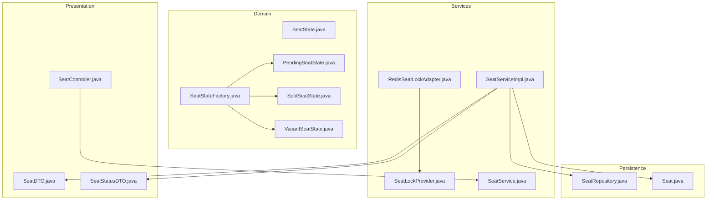
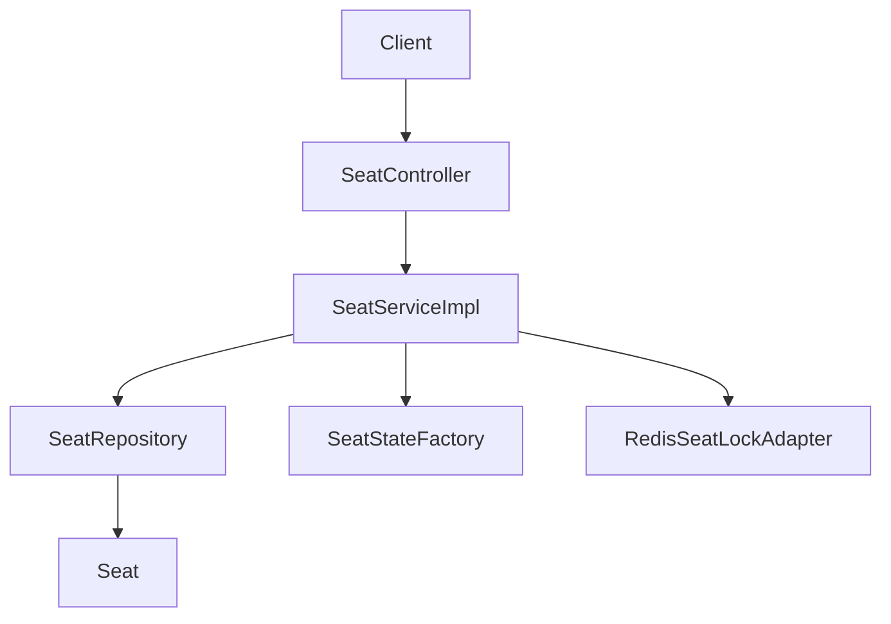
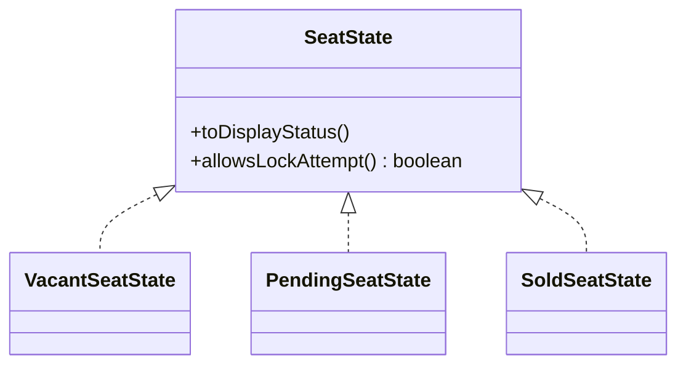
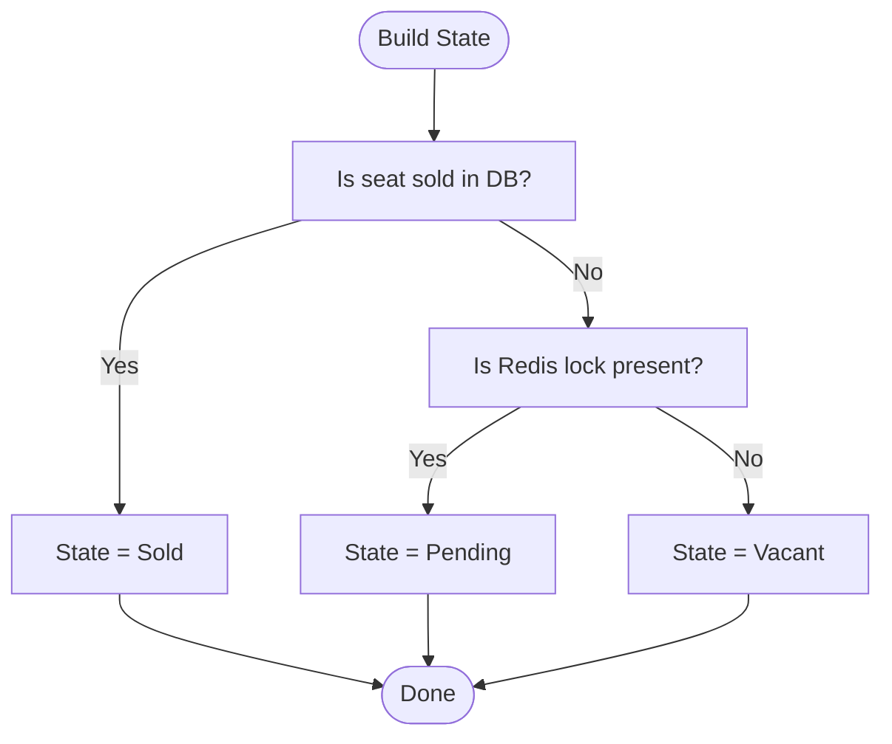
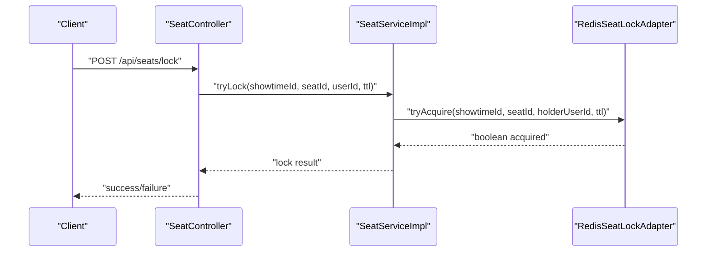
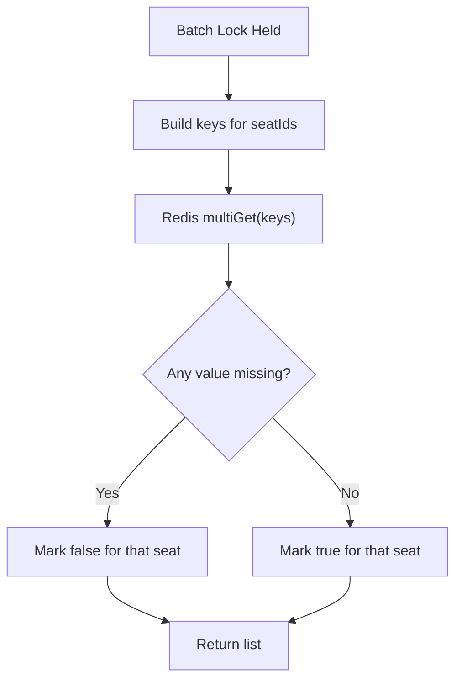
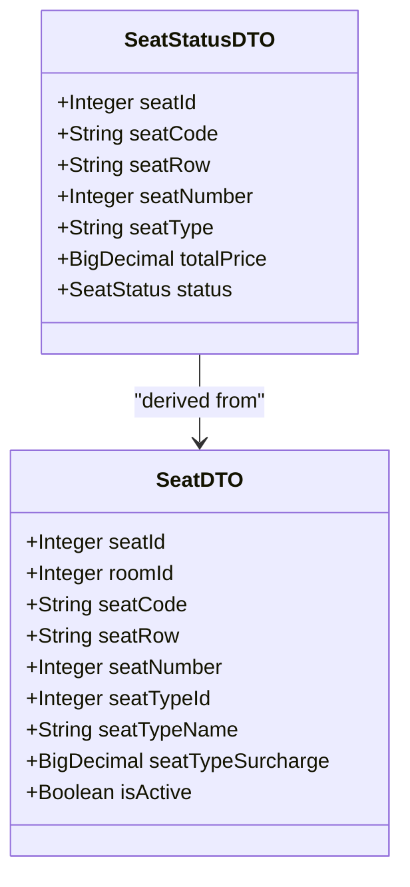
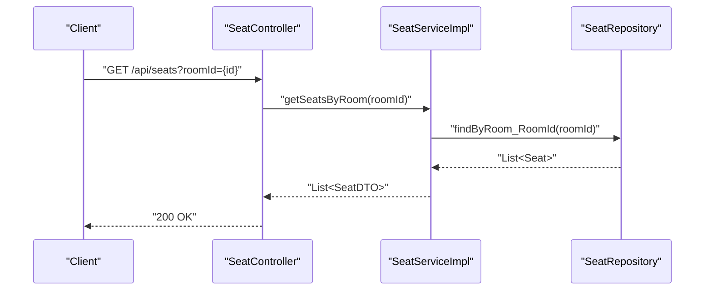
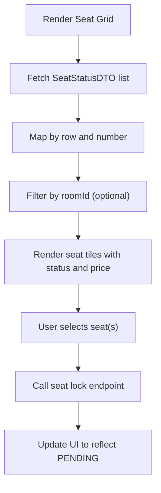
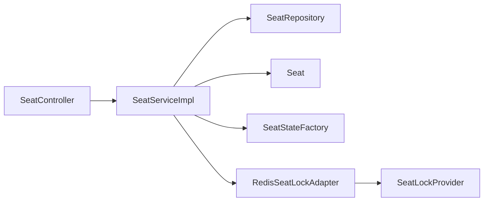

# Seat Management

<cite>
**Referenced Files in This Document**
- [SeatState.java](file://backend/src/main/java/com/cinema/booking/domain/seat/SeatState.java)
- [PendingSeatState.java](file://backend/src/main/java/com/cinema/booking/domain/seat/PendingSeatState.java)
- [SoldSeatState.java](file://backend/src/main/java/com/cinema/booking/domain/seat/SoldSeatState.java)
- [VacantSeatState.java](file://backend/src/main/java/com/cinema/booking/domain/seat/VacantSeatState.java)
- [SeatStateFactory.java](file://backend/src/main/java/com/cinema/booking/domain/seat/SeatStateFactory.java)
- [SeatLockProvider.java](file://backend/src/main/java/com/cinema/booking/services/seatlock/SeatLockProvider.java)
- [RedisSeatLockAdapter.java](file://backend/src/main/java/com/cinema/booking/services/seatlock/RedisSeatLockAdapter.java)
- [SeatController.java](file://backend/src/main/java/com/cinema/booking/controllers/SeatController.java)
- [SeatService.java](file://backend/src/main/java/com/cinema/booking/services/SeatService.java)
- [SeatServiceImpl.java](file://backend/src/main/java/com/cinema/booking/services/impl/SeatServiceImpl.java)
- [SeatRepository.java](file://backend/src/main/java/com/cinema/booking/repositories/SeatRepository.java)
- [Seat.java](file://backend/src/main/java/com/cinema/booking/entities/Seat.java)
- [SeatDTO.java](file://backend/src/main/java/com/cinema/booking/dtos/SeatDTO.java)
- [SeatStatusDTO.java](file://backend/src/main/java/com/cinema/booking/dtos/SeatStatusDTO.java)
</cite>

## Table of Contents
1. [Introduction](#introduction)
2. [Project Structure](#project-structure)
3. [Core Components](#core-components)
4. [Architecture Overview](#architecture-overview)
5. [Detailed Component Analysis](#detailed-component-analysis)
6. [Dependency Analysis](#dependency-analysis)
7. [Performance Considerations](#performance-considerations)
8. [Troubleshooting Guide](#troubleshooting-guide)
9. [Conclusion](#conclusion)
10. [Appendices](#appendices)

## Introduction
This document explains the seat management subsystem with a focus on:
- Seat state management using the State pattern (Vacant, Pending, Sold)
- Seat locking via Redis to prevent concurrent bookings and handle timeouts
- Seat availability validation and seat type pricing calculation
- Seat repository patterns and state transitions
- Practical seat selection API endpoints and real-time seat availability checks
- UI integration pointers for seat selection

The goal is to provide a clear understanding of how seats are modeled, validated, locked, priced, and exposed through APIs, while offering guidance for high-concurrency scenarios and robust error handling.

## Project Structure
The seat management system spans domain, service, repository, controller, DTO, and entity layers. The seat state machine resides under the domain layer, while Redis-backed locking is encapsulated behind an adapter interface. Controllers expose seat CRUD and batch operations, and services orchestrate business logic.

**Diagram sources**
- [SeatState.java:1-18](file://backend/src/main/java/com/cinema/booking/domain/seat/SeatState.java#L1-L18)
- [PendingSeatState.java:1-22](file://backend/src/main/java/com/cinema/booking/domain/seat/PendingSeatState.java#L1-L22)
- [SoldSeatState.java:1-22](file://backend/src/main/java/com/cinema/booking/domain/seat/SoldSeatState.java#L1-L22)
- [VacantSeatState.java:1-22](file://backend/src/main/java/com/cinema/booking/domain/seat/VacantSeatState.java#L1-L22)
- [SeatStateFactory.java:1-21](file://backend/src/main/java/com/cinema/booking/domain/seat/SeatStateFactory.java#L1-L21)
- [SeatLockProvider.java:1-19](file://backend/src/main/java/com/cinema/booking/services/seatlock/SeatLockProvider.java#L1-L19)
- [RedisSeatLockAdapter.java:1-56](file://backend/src/main/java/com/cinema/booking/services/seatlock/RedisSeatLockAdapter.java#L1-L56)
- [SeatService.java:1-15](file://backend/src/main/java/com/cinema/booking/services/SeatService.java#L1-L15)
- [SeatServiceImpl.java:1-203](file://backend/src/main/java/com/cinema/booking/services/impl/SeatServiceImpl.java#L1-L203)
- [SeatRepository.java:1-16](file://backend/src/main/java/com/cinema/booking/repositories/SeatRepository.java#L1-L16)
- [Seat.java:1-34](file://backend/src/main/java/com/cinema/booking/entities/Seat.java#L1-L34)
- [SeatController.java:1-60](file://backend/src/main/java/com/cinema/booking/controllers/SeatController.java#L1-L60)
- [SeatDTO.java:1-27](file://backend/src/main/java/com/cinema/booking/dtos/SeatDTO.java#L1-L27)
- [SeatStatusDTO.java:1-26](file://backend/src/main/java/com/cinema/booking/dtos/SeatStatusDTO.java#L1-L26)

**Section sources**
- [SeatController.java:1-60](file://backend/src/main/java/com/cinema/booking/controllers/SeatController.java#L1-L60)
- [SeatService.java:1-15](file://backend/src/main/java/com/cinema/booking/services/SeatService.java#L1-L15)
- [SeatServiceImpl.java:1-203](file://backend/src/main/java/com/cinema/booking/services/impl/SeatServiceImpl.java#L1-L203)
- [SeatRepository.java:1-16](file://backend/src/main/java/com/cinema/booking/repositories/SeatRepository.java#L1-L16)
- [Seat.java:1-34](file://backend/src/main/java/com/cinema/booking/entities/Seat.java#L1-L34)
- [SeatState.java:1-18](file://backend/src/main/java/com/cinema/booking/domain/seat/SeatState.java#L1-L18)
- [SeatStateFactory.java:1-21](file://backend/src/main/java/com/cinema/booking/domain/seat/SeatStateFactory.java#L1-L21)
- [PendingSeatState.java:1-22](file://backend/src/main/java/com/cinema/booking/domain/seat/PendingSeatState.java#L1-L22)
- [SoldSeatState.java:1-22](file://backend/src/main/java/com/cinema/booking/domain/seat/SoldSeatState.java#L1-L22)
- [VacantSeatState.java:1-22](file://backend/src/main/java/com/cinema/booking/domain/seat/VacantSeatState.java#L1-L22)
- [SeatLockProvider.java:1-19](file://backend/src/main/java/com/cinema/booking/services/seatlock/SeatLockProvider.java#L1-L19)
- [RedisSeatLockAdapter.java:1-56](file://backend/src/main/java/com/cinema/booking/services/seatlock/RedisSeatLockAdapter.java#L1-L56)
- [SeatDTO.java:1-27](file://backend/src/main/java/com/cinema/booking/dtos/SeatDTO.java#L1-L27)
- [SeatStatusDTO.java:1-26](file://backend/src/main/java/com/cinema/booking/dtos/SeatStatusDTO.java#L1-L26)

## Core Components
- Seat state machine: Defines three terminal states (Vacant, Pending, Sold) and whether a lock attempt is allowed per state.
- Seat state factory: Builds the current state from database and Redis lock indicators.
- Seat lock provider: Abstraction for acquiring/releases locks and batch lock checks.
- Redis seat lock adapter: Implements lock primitives using Redis SETNX with TTL and batch multi-get.
- Seat service and repository: Seat CRUD, batch replacement, and seat-to-DTO mapping.
- Seat controller: Exposes seat endpoints for retrieval and batch updates.

Key responsibilities:
- State transitions are derived from snapshots: Sold beats Pending beats Vacant.
- Locking prevents race conditions during booking; Redis TTL ensures automatic cleanup.
- Seat DTOs carry seat type surcharge and normalized seat row/number for UI rendering.

**Section sources**
- [SeatState.java:1-18](file://backend/src/main/java/com/cinema/booking/domain/seat/SeatState.java#L1-L18)
- [SeatStateFactory.java:1-21](file://backend/src/main/java/com/cinema/booking/domain/seat/SeatStateFactory.java#L1-L21)
- [SeatLockProvider.java:1-19](file://backend/src/main/java/com/cinema/booking/services/seatlock/SeatLockProvider.java#L1-L19)
- [RedisSeatLockAdapter.java:1-56](file://backend/src/main/java/com/cinema/booking/services/seatlock/RedisSeatLockAdapter.java#L1-L56)
- [SeatService.java:1-15](file://backend/src/main/java/com/cinema/booking/services/SeatService.java#L1-L15)
- [SeatServiceImpl.java:1-203](file://backend/src/main/java/com/cinema/booking/services/impl/SeatServiceImpl.java#L1-L203)
- [SeatRepository.java:1-16](file://backend/src/main/java/com/cinema/booking/repositories/SeatRepository.java#L1-L16)
- [SeatController.java:1-60](file://backend/src/main/java/com/cinema/booking/controllers/SeatController.java#L1-L60)

## Architecture Overview
The seat management subsystem follows layered architecture:
- Presentation: SeatController exposes endpoints for seat listing, single seat retrieval, creation, update, deletion, and batch replacement.
- Application: SeatServiceImpl orchestrates repository access, DTO mapping, and seat code normalization.
- Domain: SeatState defines state behavior; SeatStateFactory derives state from DB and Redis signals.
- Infrastructure: RedisSeatLockAdapter implements lock primitives using RedisTemplate.

**Diagram sources**
- [SeatController.java:1-60](file://backend/src/main/java/com/cinema/booking/controllers/SeatController.java#L1-L60)
- [SeatServiceImpl.java:1-203](file://backend/src/main/java/com/cinema/booking/services/impl/SeatServiceImpl.java#L1-L203)
- [SeatRepository.java:1-16](file://backend/src/main/java/com/cinema/booking/repositories/SeatRepository.java#L1-L16)
- [Seat.java:1-34](file://backend/src/main/java/com/cinema/booking/entities/Seat.java#L1-L34)
- [SeatStateFactory.java:1-21](file://backend/src/main/java/com/cinema/booking/domain/seat/SeatStateFactory.java#L1-L21)
- [RedisSeatLockAdapter.java:1-56](file://backend/src/main/java/com/cinema/booking/services/seatlock/RedisSeatLockAdapter.java#L1-L56)

## Detailed Component Analysis

### Seat State Machine
The state machine models seat business states and controls lock eligibility:
- VacantSeatState: Available for locking.
- PendingSeatState: Locked by a user; prevents further attempts.
- SoldSeatState: Final state; disallows any lock attempts.

**Diagram sources**
- [SeatState.java:1-18](file://backend/src/main/java/com/cinema/booking/domain/seat/SeatState.java#L1-L18)
- [VacantSeatState.java:1-22](file://backend/src/main/java/com/cinema/booking/domain/seat/VacantSeatState.java#L1-L22)
- [PendingSeatState.java:1-22](file://backend/src/main/java/com/cinema/booking/domain/seat/PendingSeatState.java#L1-L22)
- [SoldSeatState.java:1-22](file://backend/src/main/java/com/cinema/booking/domain/seat/SoldSeatState.java#L1-L22)

State derivation logic:
- If sold in DB, state is Sold.
- Else if Redis lock present, state is Pending.
- Else state is Vacant.

**Diagram sources**
- [SeatStateFactory.java:1-21](file://backend/src/main/java/com/cinema/booking/domain/seat/SeatStateFactory.java#L1-L21)

**Section sources**
- [SeatState.java:1-18](file://backend/src/main/java/com/cinema/booking/domain/seat/SeatState.java#L1-L18)
- [VacantSeatState.java:1-22](file://backend/src/main/java/com/cinema/booking/domain/seat/VacantSeatState.java#L1-L22)
- [PendingSeatState.java:1-22](file://backend/src/main/java/com/cinema/booking/domain/seat/PendingSeatState.java#L1-L22)
- [SoldSeatState.java:1-22](file://backend/src/main/java/com/cinema/booking/domain/seat/SoldSeatState.java#L1-L22)
- [SeatStateFactory.java:1-21](file://backend/src/main/java/com/cinema/booking/domain/seat/SeatStateFactory.java#L1-L21)

### Seat Locking with Redis
Seat locking prevents concurrent bookings using Redis SETNX with TTL and supports batch lock checks.

- Lock key naming: showtime:{showtimeId}:seat:{seatId}:lock
- TTL ensures automatic cleanup if the holder does not finalize the booking.
- Batch lock check uses multiGet to reduce round trips.

**Diagram sources**
- [RedisSeatLockAdapter.java:1-56](file://backend/src/main/java/com/cinema/booking/services/seatlock/RedisSeatLockAdapter.java#L1-L56)
- [SeatLockProvider.java:1-19](file://backend/src/main/java/com/cinema/booking/services/seatlock/SeatLockProvider.java#L1-L19)

**Section sources**
- [SeatLockProvider.java:1-19](file://backend/src/main/java/com/cinema/booking/services/seatlock/SeatLockProvider.java#L1-L19)
- [RedisSeatLockAdapter.java:1-56](file://backend/src/main/java/com/cinema/booking/services/seatlock/RedisSeatLockAdapter.java#L1-L56)

### Seat Availability Validation and Pricing
Seat availability is determined by combining database and Redis signals:
- DB sold flag overrides all other states.
- Redis lock indicates Pending.
- Otherwise Vacant.

Seat pricing:
- SeatDTO carries seatTypeSurcharge from SeatType.
- SeatStatusDTO includes totalPrice = base price + surcharge.

**Diagram sources**
- [SeatDTO.java:1-27](file://backend/src/main/java/com/cinema/booking/dtos/SeatDTO.java#L1-L27)
- [SeatStatusDTO.java:1-26](file://backend/src/main/java/com/cinema/booking/dtos/SeatStatusDTO.java#L1-L26)

**Section sources**
- [SeatServiceImpl.java:42-67](file://backend/src/main/java/com/cinema/booking/services/impl/SeatServiceImpl.java#L42-L67)
- [SeatDTO.java:1-27](file://backend/src/main/java/com/cinema/booking/dtos/SeatDTO.java#L1-L27)
- [SeatStatusDTO.java:1-26](file://backend/src/main/java/com/cinema/booking/dtos/SeatStatusDTO.java#L1-L26)

### Seat Repository Patterns
SeatRepository provides:
- Find seats by room ID
- Count seats in a room

SeatServiceImpl:
- Maps Seat entities to SeatDTO
- Normalizes seat codes and resolves seatCode from seatRow + seatNumber
- Validates uniqueness of seat codes during batch replacement
- Prevents removal of seats that still have associated tickets

**Diagram sources**
- [SeatController.java:1-60](file://backend/src/main/java/com/cinema/booking/controllers/SeatController.java#L1-L60)
- [SeatServiceImpl.java:74-77](file://backend/src/main/java/com/cinema/booking/services/impl/SeatServiceImpl.java#L74-L77)
- [SeatRepository.java:1-16](file://backend/src/main/java/com/cinema/booking/repositories/SeatRepository.java#L1-L16)

**Section sources**
- [SeatRepository.java:1-16](file://backend/src/main/java/com/cinema/booking/repositories/SeatRepository.java#L1-L16)
- [SeatServiceImpl.java:125-187](file://backend/src/main/java/com/cinema/booking/services/impl/SeatServiceImpl.java#L125-L187)
- [Seat.java:1-34](file://backend/src/main/java/com/cinema/booking/entities/Seat.java#L1-L34)

### Seat Selection UI Implementation
SeatStatusDTO provides the fields needed for seat selection UI:
- seatId, seatCode, seatRow, seatNumber
- seatType and totalPrice
- status (VACANT, SOLD, PENDING)

UI logic:
- Render seats grouped by row and number
- Disable SOLD seats
- Highlight PENDING seats (locked by current user or others)
- Show totalPrice for selection confirmation

[No sources needed since this diagram shows conceptual workflow, not actual code structure]

## Dependency Analysis
The following diagram shows key dependencies among seat-related components:

**Diagram sources**
- [SeatController.java:1-60](file://backend/src/main/java/com/cinema/booking/controllers/SeatController.java#L1-L60)
- [SeatServiceImpl.java:1-203](file://backend/src/main/java/com/cinema/booking/services/impl/SeatServiceImpl.java#L1-L203)
- [SeatRepository.java:1-16](file://backend/src/main/java/com/cinema/booking/repositories/SeatRepository.java#L1-L16)
- [Seat.java:1-34](file://backend/src/main/java/com/cinema/booking/entities/Seat.java#L1-L34)
- [SeatStateFactory.java:1-21](file://backend/src/main/java/com/cinema/booking/domain/seat/SeatStateFactory.java#L1-L21)
- [RedisSeatLockAdapter.java:1-56](file://backend/src/main/java/com/cinema/booking/services/seatlock/RedisSeatLockAdapter.java#L1-L56)
- [SeatLockProvider.java:1-19](file://backend/src/main/java/com/cinema/booking/services/seatlock/SeatLockProvider.java#L1-L19)

**Section sources**
- [SeatServiceImpl.java:1-203](file://backend/src/main/java/com/cinema/booking/services/impl/SeatServiceImpl.java#L1-L203)
- [SeatStateFactory.java:1-21](file://backend/src/main/java/com/cinema/booking/domain/seat/SeatStateFactory.java#L1-L21)
- [RedisSeatLockAdapter.java:1-56](file://backend/src/main/java/com/cinema/booking/services/seatlock/RedisSeatLockAdapter.java#L1-L56)

## Performance Considerations
High-concurrency scenarios:
- Use batch lock checks to minimize network round trips.
- Keep TTL short but sufficient to cover booking completion; ensure clients renew TTL if needed.
- Use Redis pipeline/multiGet for batch operations.
- Cache frequently accessed seat layouts at the application level with invalidation on changes.
- Limit seat selection requests per user/session to reduce contention.
- Use optimistic locking or idempotent operations for booking confirmations.

[No sources needed since this section provides general guidance]

## Troubleshooting Guide
Common issues and resolutions:
- Seat appears SOLDD but no ticket exists:
  - Verify DB sold flag and Redis lock presence; Sold takes precedence.
- Cannot acquire lock:
  - Confirm seat is not SOLD; check if another user holds the lock; verify TTL and renewal.
- Duplicate seat codes during batch replacement:
  - Ensure seatCode uniqueness within layout; the service enforces this.
- Removing seats with existing tickets:
  - The service prevents deletion if tickets reference the seat; resolve tickets first.

**Section sources**
- [SeatStateFactory.java:1-21](file://backend/src/main/java/com/cinema/booking/domain/seat/SeatStateFactory.java#L1-L21)
- [SeatServiceImpl.java:125-187](file://backend/src/main/java/com/cinema/booking/services/impl/SeatServiceImpl.java#L125-L187)
- [RedisSeatLockAdapter.java:1-56](file://backend/src/main/java/com/cinema/booking/services/seatlock/RedisSeatLockAdapter.java#L1-L56)

## Conclusion
The seat management system cleanly separates concerns across domain, service, repository, and infrastructure layers. The State pattern models business states accurately, while Redis-backed locking prevents race conditions and enables automatic cleanup via TTL. Seat DTOs and SeatStatusDTO provide the data needed for UI rendering and pricing. The provided APIs support seat CRUD and batch replacement, enabling efficient seat layout management.

[No sources needed since this section summarizes without analyzing specific files]

## Appendices

### API Endpoints for Seat Management
- GET /api/seats?roomId={id}
  - Returns seat list for a room.
- GET /api/seats/{id}
  - Returns a single seat by ID.
- POST /api/seats
  - Creates a new seat.
- PUT /api/seats/{id}
  - Updates an existing seat.
- DELETE /api/seats/{id}
  - Deletes a seat.
- PUT /api/seats/batch/{roomId}
  - Replaces all seats in a room with the provided list.

**Section sources**
- [SeatController.java:1-60](file://backend/src/main/java/com/cinema/booking/controllers/SeatController.java#L1-L60)

### Seat Locking Endpoints (Conceptual)
- POST /api/seats/{seatId}/lock?showtimeId={id}&userId={id}&ttl={seconds}
  - Attempts to lock a seat; returns success/failure.
- POST /api/seats/{seatId}/unlock?showtimeId={id}
  - Releases a seat lock.
- POST /api/seats/batch/lock-held?showtimeId={id}
  - Returns a list indicating which seats are currently locked.

Note: These endpoints are conceptual and should align with the SeatLockProvider interface.

[No sources needed since this section describes conceptual endpoints]