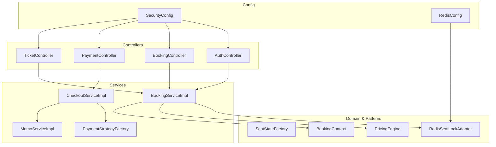
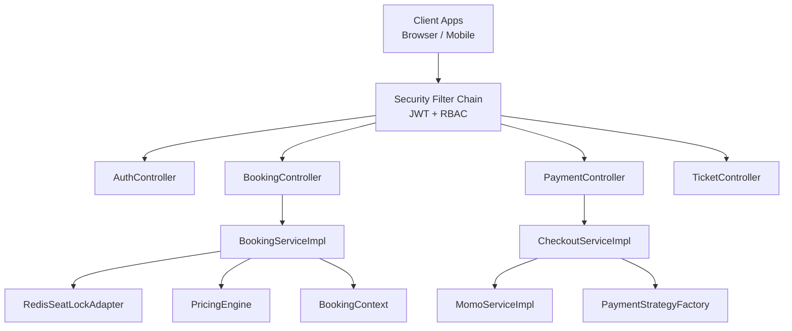
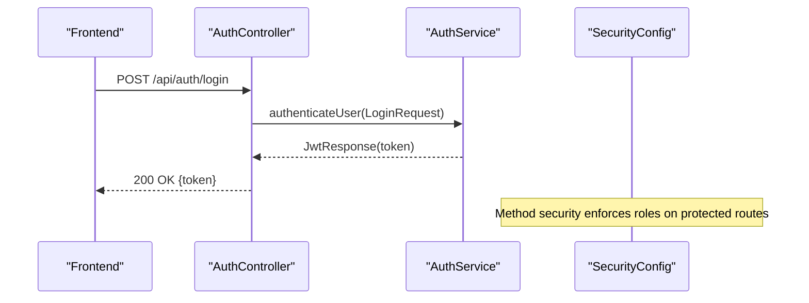
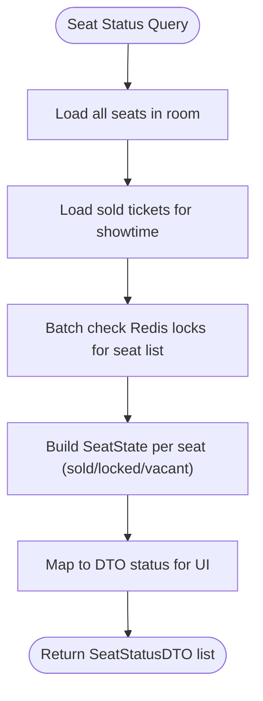
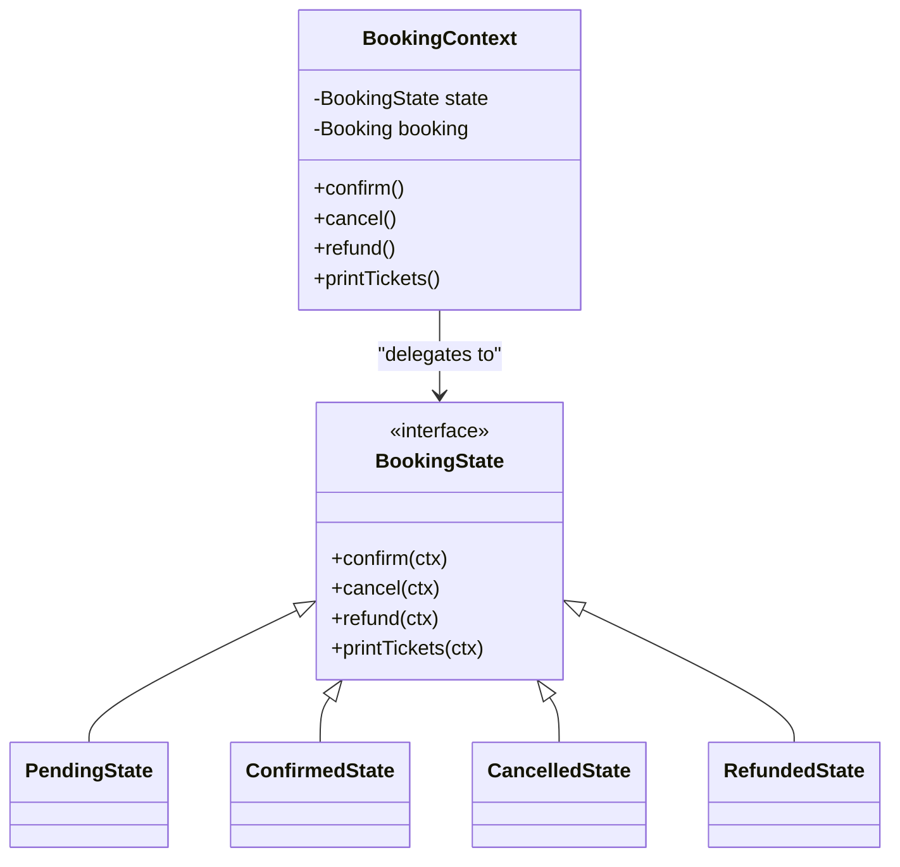
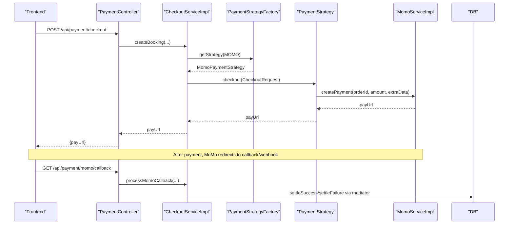
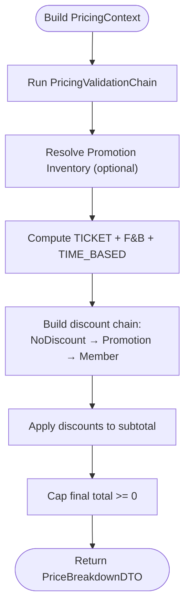
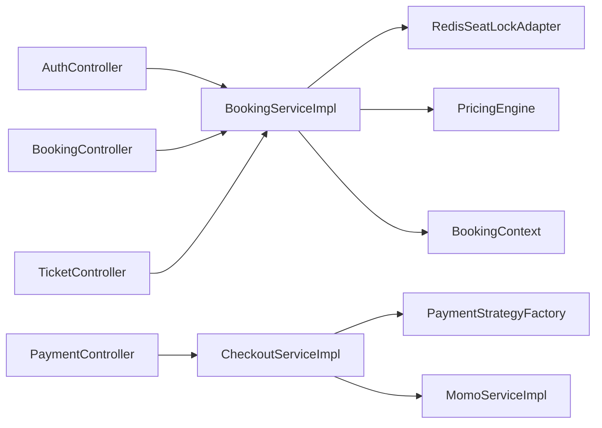

# Core Features Implementation

<cite>
**Referenced Files in This Document**
- [FilmBookingBackendApplication.java](file://backend/src/main/java/com/cinema/booking/FilmBookingBackendApplication.java)
- [SecurityConfig.java](file://backend/src/main/java/com/cinema/booking/config/SecurityConfig.java)
- [RedisConfig.java](file://backend/src/main/java/com/cinema/booking/config/RedisConfig.java)
- [AuthController.java](file://backend/src/main/java/com/cinema/booking/controllers/AuthController.java)
- [BookingController.java](file://backend/src/main/java/com/cinema/booking/controllers/BookingController.java)
- [PaymentController.java](file://backend/src/main/java/com/cinema/booking/controllers/PaymentController.java)
- [TicketController.java](file://backend/src/main/java/com/cinema/booking/controllers/TicketController.java)
- [BookingServiceImpl.java](file://backend/src/main/java/com/cinema/booking/services/impl/BookingServiceImpl.java)
- [CheckoutServiceImpl.java](file://backend/src/main/java/com/cinema/booking/services/impl/CheckoutServiceImpl.java)
- [MomoServiceImpl.java](file://backend/src/main/java/com/cinema/booking/services/impl/MomoServiceImpl.java)
- [PricingEngine.java](file://backend/src/main/java/com/cinema/booking/services/strategy_decorator/pricing/PricingEngine.java)
- [SeatStateFactory.java](file://backend/src/main/java/com/cinema/booking/domain/seat/SeatStateFactory.java)
- [RedisSeatLockAdapter.java](file://backend/src/main/java/com/cinema/booking/services/seatlock/RedisSeatLockAdapter.java)
- [PaymentStrategyFactory.java](file://backend/src/main/java/com/cinema/booking/services/payment/PaymentStrategyFactory.java)
- [BookingContext.java](file://backend/src/main/java/com/cinema/booking/patterns/state/BookingContext.java)
</cite>

## Table of Contents
1. [Introduction](#introduction)
2. [Project Structure](#project-structure)
3. [Core Components](#core-components)
4. [Architecture Overview](#architecture-overview)
5. [Detailed Component Analysis](#detailed-component-analysis)
6. [Dependency Analysis](#dependency-analysis)
7. [Performance Considerations](#performance-considerations)
8. [Troubleshooting Guide](#troubleshooting-guide)
9. [Conclusion](#conclusion)
10. [Appendices](#appendices)

## Introduction
This document explains the core features of the cinema booking system with a focus on:
- Complete booking flow: seat selection logic, real-time seat locking via Redis, and booking state management
- Authentication and authorization with JWT, role-based access control, and security configurations
- Payment processing with multiple methods, including MoMo integration, payment strategy pattern, and transaction handling
- Dynamic pricing engine with time-based surcharges, member discounts, and promotional pricing
- F&B management: inventory tracking, order processing, and real-time stock updates
- Email notifications, e-ticket generation, and QR code creation
- Practical examples of API endpoints, service implementations, and frontend integration patterns

## Project Structure
The backend is a Spring Boot application organized by layers:
- Controllers expose REST endpoints for authentication, booking, payments, tickets, and related resources
- Services encapsulate business logic for booking, checkout, pricing, payment strategies, and seat locking
- Repositories access the persistence layer
- Domain models and patterns (State, Strategy, Decorator, Mediator, Specification) implement cross-cutting concerns
- Configuration sets up security, Redis, CORS, and Swagger

**Diagram sources**
- [AuthController.java:1-54](file://backend/src/main/java/com/cinema/booking/controllers/AuthController.java#L1-L54)
- [BookingController.java:1-114](file://backend/src/main/java/com/cinema/booking/controllers/BookingController.java#L1-L114)
- [PaymentController.java:1-150](file://backend/src/main/java/com/cinema/booking/controllers/PaymentController.java#L1-L150)
- [TicketController.java:1-55](file://backend/src/main/java/com/cinema/booking/controllers/TicketController.java#L1-L55)
- [BookingServiceImpl.java:1-260](file://backend/src/main/java/com/cinema/booking/services/impl/BookingServiceImpl.java#L1-L260)
- [CheckoutServiceImpl.java:1-185](file://backend/src/main/java/com/cinema/booking/services/impl/CheckoutServiceImpl.java#L1-L185)
- [MomoServiceImpl.java:1-95](file://backend/src/main/java/com/cinema/booking/services/impl/MomoServiceImpl.java#L1-L95)
- [SeatStateFactory.java:1-21](file://backend/src/main/java/com/cinema/booking/domain/seat/SeatStateFactory.java#L1-L21)
- [RedisSeatLockAdapter.java:1-56](file://backend/src/main/java/com/cinema/booking/services/seatlock/RedisSeatLockAdapter.java#L1-L56)
- [PricingEngine.java:1-117](file://backend/src/main/java/com/cinema/booking/services/strategy_decorator/pricing/PricingEngine.java#L1-L117)
- [BookingContext.java:1-38](file://backend/src/main/java/com/cinema/booking/patterns/state/BookingContext.java#L1-L38)
- [SecurityConfig.java:1-82](file://backend/src/main/java/com/cinema/booking/config/SecurityConfig.java#L1-L82)
- [RedisConfig.java:1-55](file://backend/src/main/java/com/cinema/booking/config/RedisConfig.java#L1-L55)

**Section sources**
- [FilmBookingBackendApplication.java:1-14](file://backend/src/main/java/com/cinema/booking/FilmBookingBackendApplication.java#L1-L14)
- [SecurityConfig.java:1-82](file://backend/src/main/java/com/cinema/booking/config/SecurityConfig.java#L1-L82)
- [RedisConfig.java:1-55](file://backend/src/main/java/com/cinema/booking/config/RedisConfig.java#L1-L55)

## Core Components
- Authentication and Authorization: JWT-based with method-level security and role-based access control
- Real-time Seat Locking: Redis-backed seat reservation with batch operations and TTL
- Booking Engine: Seat rendering, price calculation, booking state transitions, and search
- Payment Processing: Strategy pattern for payment methods, MoMo integration, and post-payment orchestration
- Dynamic Pricing: Strategy + Decorator pipeline with promotions and membership discounts
- Ticketing and Notifications: Ticket retrieval and integration points for email/QR generation

**Section sources**
- [AuthController.java:1-54](file://backend/src/main/java/com/cinema/booking/controllers/AuthController.java#L1-L54)
- [BookingController.java:1-114](file://backend/src/main/java/com/cinema/booking/controllers/BookingController.java#L1-L114)
- [PaymentController.java:1-150](file://backend/src/main/java/com/cinema/booking/controllers/PaymentController.java#L1-L150)
- [TicketController.java:1-55](file://backend/src/main/java/com/cinema/booking/controllers/TicketController.java#L1-L55)
- [BookingServiceImpl.java:1-260](file://backend/src/main/java/com/cinema/booking/services/impl/BookingServiceImpl.java#L1-L260)
- [CheckoutServiceImpl.java:1-185](file://backend/src/main/java/com/cinema/booking/services/impl/CheckoutServiceImpl.java#L1-L185)
- [MomoServiceImpl.java:1-95](file://backend/src/main/java/com/cinema/booking/services/impl/MomoServiceImpl.java#L1-L95)
- [PricingEngine.java:1-117](file://backend/src/main/java/com/cinema/booking/services/strategy_decorator/pricing/PricingEngine.java#L1-L117)
- [SeatStateFactory.java:1-21](file://backend/src/main/java/com/cinema/booking/domain/seat/SeatStateFactory.java#L1-L21)
- [RedisSeatLockAdapter.java:1-56](file://backend/src/main/java/com/cinema/booking/services/seatlock/RedisSeatLockAdapter.java#L1-L56)
- [PaymentStrategyFactory.java:1-49](file://backend/src/main/java/com/cinema/booking/services/payment/PaymentStrategyFactory.java#L1-L49)
- [BookingContext.java:1-38](file://backend/src/main/java/com/cinema/booking/patterns/state/BookingContext.java#L1-L38)

## Architecture Overview
The system follows layered architecture with explicit separation of concerns:
- Presentation: REST controllers handle requests and responses
- Application: Services coordinate domain operations and orchestrations
- Domain: Entities and value objects model business concepts
- Infrastructure: Repositories, Redis, and external integrations (MoMo)

**Diagram sources**
- [SecurityConfig.java:50-79](file://backend/src/main/java/com/cinema/booking/config/SecurityConfig.java#L50-L79)
- [AuthController.java:1-54](file://backend/src/main/java/com/cinema/booking/controllers/AuthController.java#L1-L54)
- [BookingController.java:1-114](file://backend/src/main/java/com/cinema/booking/controllers/BookingController.java#L1-L114)
- [PaymentController.java:1-150](file://backend/src/main/java/com/cinema/booking/controllers/PaymentController.java#L1-L150)
- [TicketController.java:1-55](file://backend/src/main/java/com/cinema/booking/controllers/TicketController.java#L1-L55)
- [BookingServiceImpl.java:1-260](file://backend/src/main/java/com/cinema/booking/services/impl/BookingServiceImpl.java#L1-L260)
- [CheckoutServiceImpl.java:1-185](file://backend/src/main/java/com/cinema/booking/services/impl/CheckoutServiceImpl.java#L1-L185)
- [MomoServiceImpl.java:1-95](file://backend/src/main/java/com/cinema/booking/services/impl/MomoServiceImpl.java#L1-L95)
- [RedisSeatLockAdapter.java:1-56](file://backend/src/main/java/com/cinema/booking/services/seatlock/RedisSeatLockAdapter.java#L1-L56)
- [PricingEngine.java:1-117](file://backend/src/main/java/com/cinema/booking/services/strategy_decorator/pricing/PricingEngine.java#L1-L117)
- [PaymentStrategyFactory.java:1-49](file://backend/src/main/java/com/cinema/booking/services/payment/PaymentStrategyFactory.java#L1-L49)
- [BookingContext.java:1-38](file://backend/src/main/java/com/cinema/booking/patterns/state/BookingContext.java#L1-L38)

## Detailed Component Analysis

### Authentication and Authorization (JWT + RBAC)
- Security configuration enables stateless sessions, CORS, and method-level security
- Role-based access controls protect admin/staff endpoints while keeping public routes open
- Auth controller exposes login, registration, and Google login endpoints returning JWT responses

**Diagram sources**
- [AuthController.java:21-31](file://backend/src/main/java/com/cinema/booking/controllers/AuthController.java#L21-L31)
- [SecurityConfig.java:57-74](file://backend/src/main/java/com/cinema/booking/config/SecurityConfig.java#L57-L74)

**Section sources**
- [SecurityConfig.java:1-82](file://backend/src/main/java/com/cinema/booking/config/SecurityConfig.java#L1-L82)
- [AuthController.java:1-54](file://backend/src/main/java/com/cinema/booking/controllers/AuthController.java#L1-L54)

### Real-time Seat Locking with Redis
- Seat availability is determined from DB sales plus Redis locks
- Redis adapter uses SETNX with TTL and supports batch lock checks
- Seat state machine maps sold/locked/vacant snapshots to display statuses

**Diagram sources**
- [BookingServiceImpl.java:78-115](file://backend/src/main/java/com/cinema/booking/services/impl/BookingServiceImpl.java#L78-L115)
- [SeatStateFactory.java:11-19](file://backend/src/main/java/com/cinema/booking/domain/seat/SeatStateFactory.java#L11-L19)
- [RedisSeatLockAdapter.java:40-54](file://backend/src/main/java/com/cinema/booking/services/seatlock/RedisSeatLockAdapter.java#L40-L54)

**Section sources**
- [BookingServiceImpl.java:77-131](file://backend/src/main/java/com/cinema/booking/services/impl/BookingServiceImpl.java#L77-L131)
- [SeatStateFactory.java:1-21](file://backend/src/main/java/com/cinema/booking/domain/seat/SeatStateFactory.java#L1-L21)
- [RedisSeatLockAdapter.java:1-56](file://backend/src/main/java/com/cinema/booking/services/seatlock/RedisSeatLockAdapter.java#L1-L56)
- [RedisConfig.java:1-55](file://backend/src/main/java/com/cinema/booking/config/RedisConfig.java#L1-L55)

### Booking State Management (State Pattern)
- BookingContext coordinates transitions among states: Pending, Confirmed, Cancelled, Refunded
- Operations like cancel/refund/print delegate to current state, ensuring business rule enforcement

**Diagram sources**
- [BookingContext.java:1-38](file://backend/src/main/java/com/cinema/booking/patterns/state/BookingContext.java#L1-L38)

**Section sources**
- [BookingController.java:81-112](file://backend/src/main/java/com/cinema/booking/controllers/BookingController.java#L81-L112)
- [BookingServiceImpl.java:167-198](file://backend/src/main/java/com/cinema/booking/services/impl/BookingServiceImpl.java#L167-L198)
- [BookingContext.java:1-38](file://backend/src/main/java/com/cinema/booking/patterns/state/BookingContext.java#L1-L38)

### Payment Processing (Strategy Pattern + Mediator)
- PaymentStrategyFactory selects strategy by PaymentMethod (MOMO, DEMO, CASH)
- CheckoutServiceImpl orchestrates payment creation and callback handling
- MoMo integration builds signed requests and verifies callbacks
- Post-payment mediator handles success/failure outcomes

**Diagram sources**
- [PaymentController.java:33-100](file://backend/src/main/java/com/cinema/booking/controllers/PaymentController.java#L33-L100)
- [CheckoutServiceImpl.java:44-130](file://backend/src/main/java/com/cinema/booking/services/impl/CheckoutServiceImpl.java#L44-L130)
- [PaymentStrategyFactory.java:33-47](file://backend/src/main/java/com/cinema/booking/services/payment/PaymentStrategyFactory.java#L33-L47)
- [MomoServiceImpl.java:42-86](file://backend/src/main/java/com/cinema/booking/services/impl/MomoServiceImpl.java#L42-L86)

**Section sources**
- [PaymentController.java:1-150](file://backend/src/main/java/com/cinema/booking/controllers/PaymentController.java#L1-L150)
- [CheckoutServiceImpl.java:1-185](file://backend/src/main/java/com/cinema/booking/services/impl/CheckoutServiceImpl.java#L1-L185)
- [MomoServiceImpl.java:1-95](file://backend/src/main/java/com/cinema/booking/services/impl/MomoServiceImpl.java#L1-L95)
- [PaymentStrategyFactory.java:1-49](file://backend/src/main/java/com/cinema/booking/services/payment/PaymentStrategyFactory.java#L1-L49)

### Dynamic Pricing Engine (Strategy + Decorator)
- PricingEngine orchestrates strategies per line type (ticket, F&B, time-based surcharge)
- Decorators apply promotions and membership discounts in a chain
- Validation handlers ensure eligibility before pricing

**Diagram sources**
- [PricingEngine.java:46-75](file://backend/src/main/java/com/cinema/booking/services/strategy_decorator/pricing/PricingEngine.java#L46-L75)

**Section sources**
- [BookingServiceImpl.java:133-149](file://backend/src/main/java/com/cinema/booking/services/impl/BookingServiceImpl.java#L133-L149)
- [PricingEngine.java:1-117](file://backend/src/main/java/com/cinema/booking/services/strategy_decorator/pricing/PricingEngine.java#L1-L117)

### F&B Management and Inventory
- Booking service aggregates FnB lines and computes totals
- Promotion and F&B inventory services manage availability during pricing and booking lifecycle
- Inventory releases occur on cancellation when payment is not successful

**Section sources**
- [BookingServiceImpl.java:152-179](file://backend/src/main/java/com/cinema/booking/services/impl/BookingServiceImpl.java#L152-L179)

### Email Notifications, E-Ticket Generation, and QR Codes
- Email notifications are triggered post-payment via mediator components
- E-ticket generation and QR code creation are integrated into the ticket issuance flow
- Ticket retrieval endpoints support user and booking queries

**Section sources**
- [TicketController.java:1-55](file://backend/src/main/java/com/cinema/booking/controllers/TicketController.java#L1-L55)
- [CheckoutServiceImpl.java:122-129](file://backend/src/main/java/com/cinema/booking/services/impl/CheckoutServiceImpl.java#L122-L129)

## Dependency Analysis
The system exhibits low coupling and high cohesion:
- Controllers depend on services only
- Services depend on repositories and infrastructure abstractions (Redis, MoMo)
- Domain patterns isolate business logic from infrastructure concerns

**Diagram sources**
- [AuthController.java:1-54](file://backend/src/main/java/com/cinema/booking/controllers/AuthController.java#L1-L54)
- [BookingController.java:1-114](file://backend/src/main/java/com/cinema/booking/controllers/BookingController.java#L1-L114)
- [PaymentController.java:1-150](file://backend/src/main/java/com/cinema/booking/controllers/PaymentController.java#L1-L150)
- [TicketController.java:1-55](file://backend/src/main/java/com/cinema/booking/controllers/TicketController.java#L1-L55)
- [BookingServiceImpl.java:1-260](file://backend/src/main/java/com/cinema/booking/services/impl/BookingServiceImpl.java#L1-L260)
- [CheckoutServiceImpl.java:1-185](file://backend/src/main/java/com/cinema/booking/services/impl/CheckoutServiceImpl.java#L1-L185)
- [MomoServiceImpl.java:1-95](file://backend/src/main/java/com/cinema/booking/services/impl/MomoServiceImpl.java#L1-L95)
- [RedisSeatLockAdapter.java:1-56](file://backend/src/main/java/com/cinema/booking/services/seatlock/RedisSeatLockAdapter.java#L1-L56)
- [PricingEngine.java:1-117](file://backend/src/main/java/com/cinema/booking/services/strategy_decorator/pricing/PricingEngine.java#L1-L117)
- [PaymentStrategyFactory.java:1-49](file://backend/src/main/java/com/cinema/booking/services/payment/PaymentStrategyFactory.java#L1-L49)
- [BookingContext.java:1-38](file://backend/src/main/java/com/cinema/booking/patterns/state/BookingContext.java#L1-L38)

**Section sources**
- [BookingServiceImpl.java:1-260](file://backend/src/main/java/com/cinema/booking/services/impl/BookingServiceImpl.java#L1-L260)
- [CheckoutServiceImpl.java:1-185](file://backend/src/main/java/com/cinema/booking/services/impl/CheckoutServiceImpl.java#L1-L185)

## Performance Considerations
- Redis batch operations minimize round-trips for seat lock checks
- Caching pricing engine proxy reduces repeated computation for identical contexts
- Stateless JWT eliminates server-side session storage overhead
- Transaction boundaries limit DB contention during checkout and state transitions

[No sources needed since this section provides general guidance]

## Troubleshooting Guide
Common issues and resolutions:
- Authentication failures: Verify credentials and ensure security filters are initialized
- Redis seat lock errors: Confirm Redis connectivity and TTL configuration
- MoMo callback signature verification: Ensure secret key alignment and proper decoding of extraData
- Payment history retrieval: Validate user ID and payment record existence
- Booking state transitions: Ensure transitions follow defined state rules

**Section sources**
- [SecurityConfig.java:50-79](file://backend/src/main/java/com/cinema/booking/config/SecurityConfig.java#L50-L79)
- [RedisConfig.java:31-53](file://backend/src/main/java/com/cinema/booking/config/RedisConfig.java#L31-L53)
- [MomoServiceImpl.java:88-93](file://backend/src/main/java/com/cinema/booking/services/impl/MomoServiceImpl.java#L88-L93)
- [PaymentController.java:112-131](file://backend/src/main/java/com/cinema/booking/controllers/PaymentController.java#L112-L131)
- [BookingContext.java:22-36](file://backend/src/main/java/com/cinema/booking/patterns/state/BookingContext.java#L22-L36)

## Conclusion
The cinema booking system integrates robust patterns and infrastructure to deliver a scalable, secure, and user-friendly experience. Real-time seat locking, dynamic pricing, and flexible payment strategies are implemented with clear separation of concerns. The stateful booking engine and mediator-driven post-payment handling ensure reliable business workflows, while JWT-based RBAC secures access across roles.

[No sources needed since this section summarizes without analyzing specific files]

## Appendices

### API Endpoints Overview
- Authentication
  - POST /api/auth/login
  - POST /api/auth/register
  - POST /api/auth/google-login
- Booking
  - GET /api/booking/seats/{showtimeId}
  - POST /api/booking/lock
  - POST /api/booking/unlock
  - POST /api/booking/calculate
  - GET /api/booking/{bookingId}
  - GET /api/booking/search
  - POST /api/booking/{bookingId}/cancel
  - POST /api/booking/{bookingId}/refund
  - POST /api/booking/{bookingId}/print
- Payments
  - POST /api/payment/checkout
  - POST /api/payment/checkout/demo
  - GET /api/payment/momo/callback
  - POST /api/payment/momo/webhook
  - GET /api/payment/payment-redirect
  - GET /api/payment/history/{userId}
  - GET /api/payment/details/{paymentId}
  - POST /api/payment/staff/cash-checkout
- Tickets
  - GET /api/tickets/booking/{bookingId}
  - GET /api/tickets/user/{userId}
  - GET /api/tickets/{ticketId}
  - DELETE /api/tickets/{ticketId}

**Section sources**
- [AuthController.java:21-52](file://backend/src/main/java/com/cinema/booking/controllers/AuthController.java#L21-L52)
- [BookingController.java:25-112](file://backend/src/main/java/com/cinema/booking/controllers/BookingController.java#L25-L112)
- [PaymentController.java:33-148](file://backend/src/main/java/com/cinema/booking/controllers/PaymentController.java#L33-L148)
- [TicketController.java:22-53](file://backend/src/main/java/com/cinema/booking/controllers/TicketController.java#L22-L53)