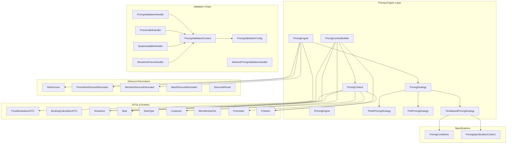
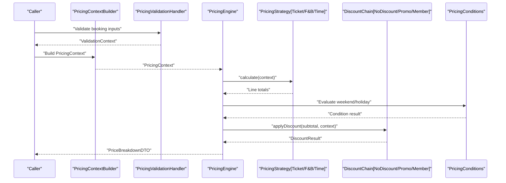
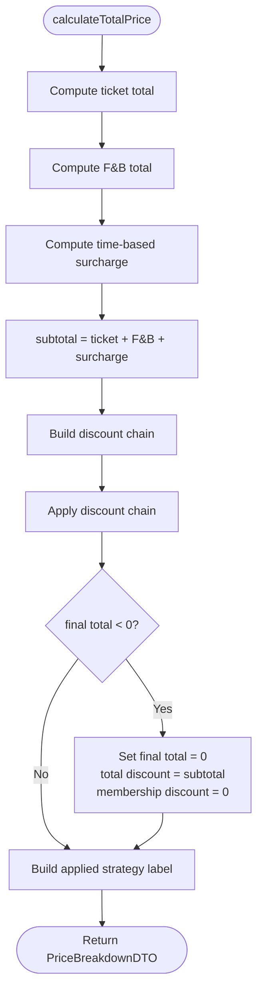
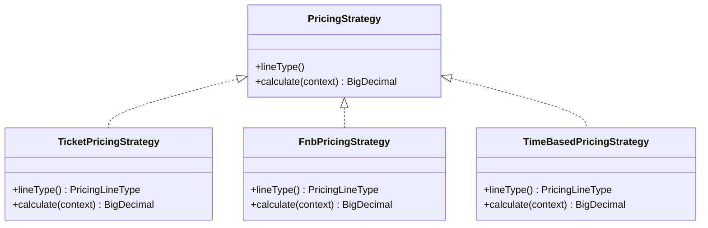
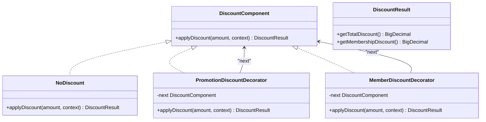
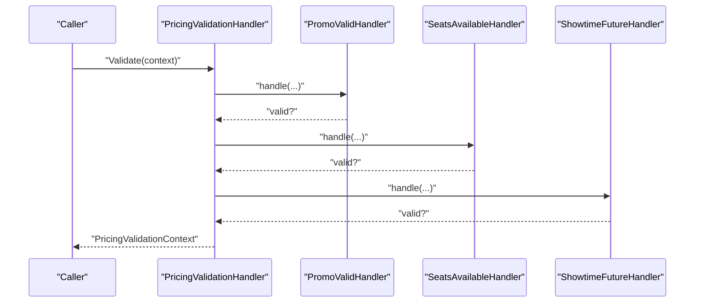
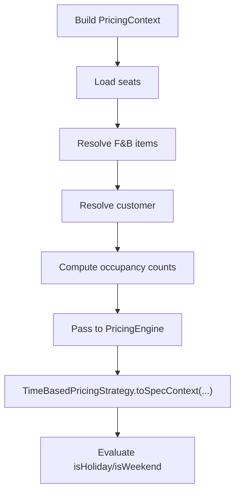
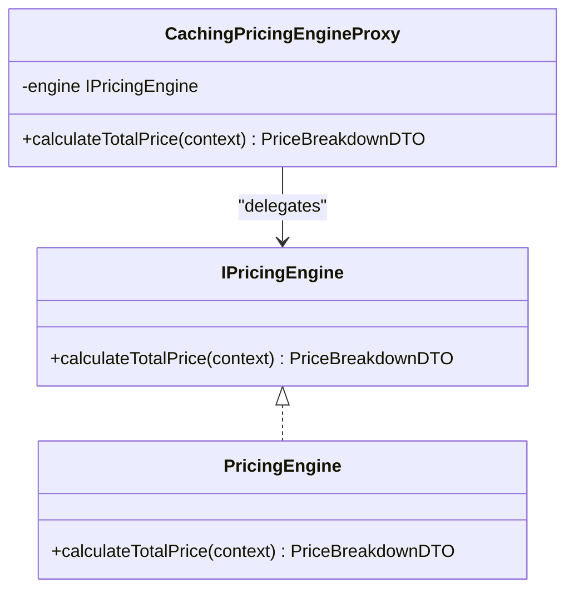
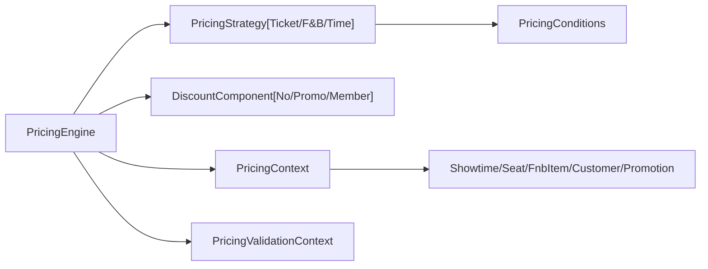

# Dynamic Pricing Engine

<cite>
**Referenced Files in This Document**
- [PricingEngine.java](file://backend/src/main/java/com/cinema/booking/services/strategy_decorator/pricing/PricingEngine.java)
- [IPricingEngine.java](file://backend/src/main/java/com/cinema/booking/services/strategy_decorator/pricing/IPricingEngine.java)
- [PricingContext.java](file://backend/src/main/java/com/cinema/booking/services/strategy_decorator/pricing/PricingContext.java)
- [PricingContextBuilder.java](file://backend/src/main/java/com/cinema/booking/services/strategy_decorator/pricing/PricingContextBuilder.java)
- [PricingStrategy.java](file://backend/src/main/java/com/cinema/booking/services/strategy_decorator/pricing/PricingStrategy.java)
- [TicketPricingStrategy.java](file://backend/src/main/java/com/cinema/booking/services/strategy_decorator/pricing/TicketPricingStrategy.java)
- [FnbPricingStrategy.java](file://backend/src/main/java/com/cinema/booking/services/strategy_decorator/pricing/FnbPricingStrategy.java)
- [TimeBasedPricingStrategy.java](file://backend/src/main/java/com/cinema/booking/services/strategy_decorator/pricing/TimeBasedPricingStrategy.java)
- [CachingPricingEngineProxy.java](file://backend/src/main/java/com/cinema/booking/services/strategy_decorator/pricing/CachingPricingEngineProxy.java)
- [BaseDiscountDecorator.java](file://backend/src/main/java/com/cinema/booking/services/strategy_decorator/pricing/BaseDiscountDecorator.java)
- [NoDiscount.java](file://backend/src/main/java/com/cinema/booking/services/strategy_decorator/pricing/NoDiscount.java)
- [PromotionDiscountDecorator.java](file://backend/src/main/java/com/cinema/booking/services/strategy_decorator/pricing/PromotionDiscountDecorator.java)
- [MemberDiscountDecorator.java](file://backend/src/main/java/com/cinema/booking/services/strategy_decorator/pricing/MemberDiscountDecorator.java)
- [DiscountResult.java](file://backend/src/main/java/com/cinema/booking/services/strategy_decorator/pricing/DiscountResult.java)
- [PricingValidationHandler.java](file://backend/src/main/java/com/cinema/booking/services/strategy_decorator/pricing/validation/PricingValidationHandler.java)
- [PricingValidationContext.java](file://backend/src/main/java/com/cinema/booking/services/strategy_decorator/pricing/validation/PricingValidationContext.java)
- [PricingValidationConfig.java](file://backend/src/main/java/com/cinema/booking/services/strategy_decorator/pricing/validation/PricingValidationConfig.java)
- [PromoValidHandler.java](file://backend/src/main/java/com/cinema/booking/services/strategy_decorator/pricing/validation/PromoValidHandler.java)
- [SeatsAvailableHandler.java](file://backend/src/main/java/com/cinema/booking/services/strategy_decorator/pricing/validation/SeatsAvailableHandler.java)
- [ShowtimeFutureHandler.java](file://backend/src/main/java/com/cinema/booking/services/strategy_decorator/pricing/validation/ShowtimeFutureHandler.java)
- [AbstractPricingValidationHandler.java](file://backend/src/main/java/com/cinema/booking/services/strategy_decorator/pricing/validation/AbstractPricingValidationHandler.java)
- [PriceBreakdownDTO.java](file://backend/src/main/java/com/cinema/booking/dtos/PriceBreakdownDTO.java)
- [BookingCalculationDTO.java](file://backend/src/main/java/com/cinema/booking/dtos/BookingCalculationDTO.java)
- [Showtime.java](file://backend/src/main/java/com/cinema/booking/entities/Showtime.java)
- [Seat.java](file://backend/src/main/java/com/cinema/booking/entities/Seat.java)
- [SeatType.java](file://backend/src/main/java/com/cinema/booking/entities/SeatType.java)
- [Customer.java](file://backend/src/main/java/com/cinema/booking/entities/Customer.java)
- [MembershipTier.java](file://backend/src/main/java/com/cinema/booking/entities/MembershipTier.java)
- [Promotion.java](file://backend/src/main/java/com/cinema/booking/entities/Promotion.java)
- [FnbItem.java](file://backend/src/main/java/com/cinema/booking/entities/FnbItem.java)
- [PricingConditions.java](file://backend/src/main/java/com/cinema/booking/patterns/specification/PricingConditions.java)
- [PricingSpecificationContext.java](file://backend/src/main/java/com/cinema/booking/patterns/specification/PricingSpecificationContext.java)
- [application.properties](file://backend/src/main/resources/application.properties)
</cite>

## Table of Contents
1. [Introduction](#introduction)
2. [Project Structure](#project-structure)
3. [Core Components](#core-components)
4. [Architecture Overview](#architecture-overview)
5. [Detailed Component Analysis](#detailed-component-analysis)
6. [Dependency Analysis](#dependency-analysis)
7. [Performance Considerations](#performance-considerations)
8. [Troubleshooting Guide](#troubleshooting-guide)
9. [Conclusion](#conclusion)
10. [Appendices](#appendices)

## Introduction
This document explains the dynamic pricing engine used in the cinema booking system. It covers the pricing strategy pattern for ticket and food & beverage (F&B) pricing, time-based surcharges, membership tier discounts, promotional discounts, and the decorator pattern for stacking multiple discounts. It also documents the pricing validation chain using the chain of responsibility pattern, caching via the proxy pattern, the pricing context builder, pricing specification patterns for flexible conditions, and pricing result aggregation. Practical examples of pricing calculation workflows and debugging techniques are included.

## Project Structure
The pricing engine resides under the strategy-decorator-pricing package and integrates with validation handlers, specification patterns, and DTOs/entities for a cohesive pricing pipeline.

**Diagram sources**
- [PricingEngine.java:14-117](file://backend/src/main/java/com/cinema/booking/services/strategy_decorator/pricing/PricingEngine.java#L14-L117)
- [PricingStrategy.java:1-11](file://backend/src/main/java/com/cinema/booking/services/strategy_decorator/pricing/PricingStrategy.java#L1-L11)
- [TicketPricingStrategy.java:1-34](file://backend/src/main/java/com/cinema/booking/services/strategy_decorator/pricing/TicketPricingStrategy.java#L1-L34)
- [FnbPricingStrategy.java:1-33](file://backend/src/main/java/com/cinema/booking/services/strategy_decorator/pricing/FnbPricingStrategy.java#L1-L33)
- [TimeBasedPricingStrategy.java:1-91](file://backend/src/main/java/com/cinema/booking/services/strategy_decorator/pricing/TimeBasedPricingStrategy.java#L1-L91)
- [PricingContext.java:1-35](file://backend/src/main/java/com/cinema/booking/services/strategy_decorator/pricing/PricingContext.java#L1-L35)
- [PricingContextBuilder.java:24-89](file://backend/src/main/java/com/cinema/booking/services/strategy_decorator/pricing/PricingContextBuilder.java#L24-L89)
- [PricingValidationHandler.java:1-200](file://backend/src/main/java/com/cinema/booking/services/strategy_decorator/pricing/validation/PricingValidationHandler.java#L1-L200)
- [AbstractPricingValidationHandler.java:1-200](file://backend/src/main/java/com/cinema/booking/services/strategy_decorator/pricing/validation/AbstractPricingValidationHandler.java#L1-L200)
- [PricingValidationContext.java:1-200](file://backend/src/main/java/com/cinema/booking/services/strategy_decorator/pricing/validation/PricingValidationContext.java#L1-L200)
- [PricingValidationConfig.java:1-200](file://backend/src/main/java/com/cinema/booking/services/strategy_decorator/pricing/validation/PricingValidationConfig.java#L1-L200)
- [PromoValidHandler.java:1-200](file://backend/src/main/java/com/cinema/booking/services/strategy_decorator/pricing/validation/PromoValidHandler.java#L1-L200)
- [SeatsAvailableHandler.java:1-200](file://backend/src/main/java/com/cinema/booking/services/strategy_decorator/pricing/validation/SeatsAvailableHandler.java#L1-L200)
- [ShowtimeFutureHandler.java:1-200](file://backend/src/main/java/com/cinema/booking/services/strategy_decorator/pricing/validation/ShowtimeFutureHandler.java#L1-L200)
- [PricingConditions.java:1-200](file://backend/src/main/java/com/cinema/booking/patterns/specification/PricingConditions.java#L1-L200)
- [PricingSpecificationContext.java:1-200](file://backend/src/main/java/com/cinema/booking/patterns/specification/PricingSpecificationContext.java#L1-L200)
- [PriceBreakdownDTO.java:1-200](file://backend/src/main/java/com/cinema/booking/dtos/PriceBreakdownDTO.java#L1-L200)
- [BookingCalculationDTO.java:1-200](file://backend/src/main/java/com/cinema/booking/dtos/BookingCalculationDTO.java#L1-L200)
- [Showtime.java:1-200](file://backend/src/main/java/com/cinema/booking/entities/Showtime.java#L1-L200)
- [Seat.java:1-200](file://backend/src/main/java/com/cinema/booking/entities/Seat.java#L1-L200)
- [SeatType.java:1-200](file://backend/src/main/java/com/cinema/booking/entities/SeatType.java#L1-L200)
- [Customer.java:1-200](file://backend/src/main/java/com/cinema/booking/entities/Customer.java#L1-L200)
- [MembershipTier.java:1-200](file://backend/src/main/java/com/cinema/booking/entities/MembershipTier.java#L1-L200)
- [Promotion.java:1-200](file://backend/src/main/java/com/cinema/booking/entities/Promotion.java#L1-L200)
- [FnbItem.java:1-200](file://backend/src/main/java/com/cinema/booking/entities/FnbItem.java#L1-L200)

**Section sources**
- [PricingEngine.java:14-117](file://backend/src/main/java/com/cinema/booking/services/strategy_decorator/pricing/PricingEngine.java#L14-L117)
- [PricingContext.java:14-35](file://backend/src/main/java/com/cinema/booking/services/strategy_decorator/pricing/PricingContext.java#L14-L35)
- [PricingContextBuilder.java:24-89](file://backend/src/main/java/com/cinema/booking/services/strategy_decorator/pricing/PricingContextBuilder.java#L24-L89)

## Core Components
- PricingEngine orchestrates pricing by invoking per-line strategies, building a discount chain, and aggregating results into a PriceBreakdownDTO.
- PricingStrategy defines the contract for calculating totals per line type (ticket, F&B, time-based surcharge).
- PricingContext carries all runtime inputs (showtime, seats, resolved F&B items, promotion, customer, booking time, occupancy).
- PricingContextBuilder resolves entities and constructs PricingContext after validation.
- Discount decorators implement a chain to apply promotions and membership discounts.
- Validation handlers enforce preconditions before pricing calculation.
- Specifications encapsulate time-based conditions (weekend/holiday) used by the time-based pricing strategy.

**Section sources**
- [PricingEngine.java:14-117](file://backend/src/main/java/com/cinema/booking/services/strategy_decorator/pricing/PricingEngine.java#L14-L117)
- [PricingStrategy.java:5-11](file://backend/src/main/java/com/cinema/booking/services/strategy_decorator/pricing/PricingStrategy.java#L5-L11)
- [PricingContext.java:14-35](file://backend/src/main/java/com/cinema/booking/services/strategy_decorator/pricing/PricingContext.java#L14-L35)
- [PricingContextBuilder.java:24-89](file://backend/src/main/java/com/cinema/booking/services/strategy_decorator/pricing/PricingContextBuilder.java#L24-L89)

## Architecture Overview
The pricing engine follows a layered architecture:
- Strategy layer computes per-line totals (ticket, F&B, time-based surcharge).
- Decorator layer applies discounts sequentially (promotion then membership).
- Validation chain ensures prerequisites are met before pricing.
- Specification patterns evaluate time-based conditions.
- Results are aggregated into a structured PriceBreakdownDTO.

**Diagram sources**
- [PricingContextBuilder.java:36-59](file://backend/src/main/java/com/cinema/booking/services/strategy_decorator/pricing/PricingContextBuilder.java#L36-L59)
- [PricingEngine.java:45-75](file://backend/src/main/java/com/cinema/booking/services/strategy_decorator/pricing/PricingEngine.java#L45-L75)
- [PricingStrategy.java:5-11](file://backend/src/main/java/com/cinema/booking/services/strategy_decorator/pricing/PricingStrategy.java#L5-L11)
- [PricingConditions.java:1-200](file://backend/src/main/java/com/cinema/booking/patterns/specification/PricingConditions.java#L1-L200)
- [PriceBreakdownDTO.java:1-200](file://backend/src/main/java/com/cinema/booking/dtos/PriceBreakdownDTO.java#L1-L200)

## Detailed Component Analysis

### Pricing Engine Orchestration
- Strategy layer: Computes ticket total, F&B total, and time-based surcharge using registered strategies keyed by PricingLineType.
- Decorator chain: Builds a chain starting from NoDiscount, optionally wrapping with PromotionDiscountDecorator and MemberDiscountDecorator depending on context.
- Aggregation: Subtotal is computed and reduced by total discount; final total is bounded to zero; applied strategy label is constructed from active components.

**Diagram sources**
- [PricingEngine.java:45-115](file://backend/src/main/java/com/cinema/booking/services/strategy_decorator/pricing/PricingEngine.java#L45-L115)

**Section sources**
- [PricingEngine.java:14-117](file://backend/src/main/java/com/cinema/booking/services/strategy_decorator/pricing/PricingEngine.java#L14-L117)

### Pricing Strategies
- TicketPricingStrategy: Sums base price plus seat-type surcharge across selected seats.
- FnbPricingStrategy: Multiplies resolved F&B item prices by quantities and sums.
- TimeBasedPricingStrategy: Evaluates weekend/holiday using PricingConditions and applies a configurable percentage surcharge on the ticket subtotal.

**Diagram sources**
- [PricingStrategy.java:5-11](file://backend/src/main/java/com/cinema/booking/services/strategy_decorator/pricing/PricingStrategy.java#L5-L11)
- [TicketPricingStrategy.java:9-34](file://backend/src/main/java/com/cinema/booking/services/strategy_decorator/pricing/TicketPricingStrategy.java#L9-L34)
- [FnbPricingStrategy.java:11-33](file://backend/src/main/java/com/cinema/booking/services/strategy_decorator/pricing/FnbPricingStrategy.java#L11-L33)
- [TimeBasedPricingStrategy.java:21-91](file://backend/src/main/java/com/cinema/booking/services/strategy_decorator/pricing/TimeBasedPricingStrategy.java#L21-L91)

**Section sources**
- [TicketPricingStrategy.java:16-32](file://backend/src/main/java/com/cinema/booking/services/strategy_decorator/pricing/TicketPricingStrategy.java#L16-L32)
- [FnbPricingStrategy.java:19-31](file://backend/src/main/java/com/cinema/booking/services/strategy_decorator/pricing/FnbPricingStrategy.java#L19-L31)
- [TimeBasedPricingStrategy.java:39-68](file://backend/src/main/java/com/cinema/booking/services/strategy_decorator/pricing/TimeBasedPricingStrategy.java#L39-L68)

### Discount Decorators and Chain of Responsibility
- NoDiscount: Terminal decorator returning no discount.
- PromotionDiscountDecorator: Applies promotional discount if a valid promotion exists.
- MemberDiscountDecorator: Applies membership tier discount if applicable.
- Chain construction: Conditional wrapping based on context (promotion present, customer with valid membership tier).
- Result aggregation: DiscountResult provides total discount and membership portion.

**Diagram sources**
- [NoDiscount.java:1-200](file://backend/src/main/java/com/cinema/booking/services/strategy_decorator/pricing/NoDiscount.java#L1-L200)
- [PromotionDiscountDecorator.java:1-200](file://backend/src/main/java/com/cinema/booking/services/strategy_decorator/pricing/PromotionDiscountDecorator.java#L1-L200)
- [MemberDiscountDecorator.java:1-200](file://backend/src/main/java/com/cinema/booking/services/strategy_decorator/pricing/MemberDiscountDecorator.java#L1-L200)
- [DiscountResult.java:1-200](file://backend/src/main/java/com/cinema/booking/services/strategy_decorator/pricing/DiscountResult.java#L1-L200)

**Section sources**
- [PricingEngine.java:77-89](file://backend/src/main/java/com/cinema/booking/services/strategy_decorator/pricing/PricingEngine.java#L77-L89)

### Pricing Validation Chain (Chain of Responsibility)
- Handlers enforce prerequisites: promotion validity, seat availability, and showtime future date.
- AbstractPricingValidationHandler provides common behavior; concrete handlers implement specific checks.
- PricingValidationContext holds validated entities; PricingValidationConfig controls handler ordering.

**Diagram sources**
- [PricingValidationHandler.java:1-200](file://backend/src/main/java/com/cinema/booking/services/strategy_decorator/pricing/validation/PricingValidationHandler.java#L1-L200)
- [PromoValidHandler.java:1-200](file://backend/src/main/java/com/cinema/booking/services/strategy_decorator/pricing/validation/PromoValidHandler.java#L1-L200)
- [SeatsAvailableHandler.java:1-200](file://backend/src/main/java/com/cinema/booking/services/strategy_decorator/pricing/validation/SeatsAvailableHandler.java#L1-L200)
- [ShowtimeFutureHandler.java:1-200](file://backend/src/main/java/com/cinema/booking/services/strategy_decorator/pricing/validation/ShowtimeFutureHandler.java#L1-L200)
- [AbstractPricingValidationHandler.java:1-200](file://backend/src/main/java/com/cinema/booking/services/strategy_decorator/pricing/validation/AbstractPricingValidationHandler.java#L1-L200)
- [PricingValidationContext.java:1-200](file://backend/src/main/java/com/cinema/booking/services/strategy_decorator/pricing/validation/PricingValidationContext.java#L1-L200)
- [PricingValidationConfig.java:1-200](file://backend/src/main/java/com/cinema/booking/services/strategy_decorator/pricing/validation/PricingValidationConfig.java#L1-L200)

**Section sources**
- [PricingValidationHandler.java:1-200](file://backend/src/main/java/com/cinema/booking/services/strategy_decorator/pricing/validation/PricingValidationHandler.java#L1-L200)
- [PricingValidationContext.java:1-200](file://backend/src/main/java/com/cinema/booking/services/strategy_decorator/pricing/validation/PricingValidationContext.java#L1-L200)

### Pricing Context Builder and Specification Patterns
- PricingContextBuilder loads seats, resolved F&B items, promotion, and current customer; computes occupancy counts; builds PricingContext.
- TimeBasedPricingStrategy converts PricingContext to PricingSpecificationContext and evaluates weekend/holiday predicates from PricingConditions.

**Diagram sources**
- [PricingContextBuilder.java:36-59](file://backend/src/main/java/com/cinema/booking/services/strategy_decorator/pricing/PricingContextBuilder.java#L36-L59)
- [TimeBasedPricingStrategy.java:70-89](file://backend/src/main/java/com/cinema/booking/services/strategy_decorator/pricing/TimeBasedPricingStrategy.java#L70-L89)
- [PricingConditions.java:1-200](file://backend/src/main/java/com/cinema/booking/patterns/specification/PricingConditions.java#L1-L200)

**Section sources**
- [PricingContextBuilder.java:36-89](file://backend/src/main/java/com/cinema/booking/services/strategy_decorator/pricing/PricingContextBuilder.java#L36-L89)
- [TimeBasedPricingStrategy.java:40-68](file://backend/src/main/java/com/cinema/booking/services/strategy_decorator/pricing/TimeBasedPricingStrategy.java#L40-L68)

### Caching Strategy (Proxy Pattern)
- CachingPricingEngineProxy wraps IPricingEngine to cache pricing results keyed by a normalized request signature.
- Transparent to callers via IPricingEngine interface.

**Diagram sources**
- [IPricingEngine.java:5-12](file://backend/src/main/java/com/cinema/booking/services/strategy_decorator/pricing/IPricingEngine.java#L5-L12)
- [PricingEngine.java:24-117](file://backend/src/main/java/com/cinema/booking/services/strategy_decorator/pricing/PricingEngine.java#L24-L117)
- [CachingPricingEngineProxy.java:1-200](file://backend/src/main/java/com/cinema/booking/services/strategy_decorator/pricing/CachingPricingEngineProxy.java#L1-L200)

**Section sources**
- [IPricingEngine.java:5-12](file://backend/src/main/java/com/cinema/booking/services/strategy_decorator/pricing/IPricingEngine.java#L5-L12)
- [CachingPricingEngineProxy.java:1-200](file://backend/src/main/java/com/cinema/booking/services/strategy_decorator/pricing/CachingPricingEngineProxy.java#L1-L200)

### Pricing Result Aggregation
- PriceBreakdownDTO captures ticket total, F&B total, time-based surcharge, membership discount, discount amount, applied strategy label, and final total.
- Applied strategy label is built dynamically from active components.

**Section sources**
- [PricingEngine.java:66-75](file://backend/src/main/java/com/cinema/booking/services/strategy_decorator/pricing/PricingEngine.java#L66-L75)
- [PriceBreakdownDTO.java:1-200](file://backend/src/main/java/com/cinema/booking/dtos/PriceBreakdownDTO.java#L1-L200)

### Membership Tier Pricing and Promotional Pricing
- Membership discount: Determined by customer’s MembershipTier discount percent when present.
- Promotion discount: Applied via PromotionDiscountDecorator when a valid promotion exists in context.
- Peak hour surcharges: Modeled by time-based surcharge strategy using weekend/holiday predicates.

**Section sources**
- [PricingEngine.java:91-97](file://backend/src/main/java/com/cinema/booking/services/strategy_decorator/pricing/PricingEngine.java#L91-L97)
- [MembershipTier.java:1-200](file://backend/src/main/java/com/cinema/booking/entities/MembershipTier.java#L1-L200)
- [Promotion.java:1-200](file://backend/src/main/java/com/cinema/booking/entities/Promotion.java#L1-L200)
- [TimeBasedPricingStrategy.java:14-21](file://backend/src/main/java/com/cinema/booking/services/strategy_decorator/pricing/TimeBasedPricingStrategy.java#L14-L21)

## Dependency Analysis
- PricingEngine depends on:
  - PricingStrategy implementations for per-line totals.
  - DiscountComponent decorators for discount composition.
  - PricingContext for runtime inputs.
  - PricingValidationContext for preconditions.
  - PricingConditions for time-based evaluations.
- PricingContextBuilder depends on repositories to resolve entities and compute occupancy.
- TimeBasedPricingStrategy depends on PricingSpecificationContext and PricingConditions.

**Diagram sources**
- [PricingEngine.java:27-43](file://backend/src/main/java/com/cinema/booking/services/strategy_decorator/pricing/PricingEngine.java#L27-L43)
- [PricingContext.java:16-34](file://backend/src/main/java/com/cinema/booking/services/strategy_decorator/pricing/PricingContext.java#L16-L34)
- [PricingContextBuilder.java:31-34](file://backend/src/main/java/com/cinema/booking/services/strategy_decorator/pricing/PricingContextBuilder.java#L31-L34)
- [TimeBasedPricingStrategy.java:47-48](file://backend/src/main/java/com/cinema/booking/services/strategy_decorator/pricing/TimeBasedPricingStrategy.java#L47-L48)

**Section sources**
- [PricingEngine.java:27-43](file://backend/src/main/java/com/cinema/booking/services/strategy_decorator/pricing/PricingEngine.java#L27-L43)
- [PricingContextBuilder.java:31-34](file://backend/src/main/java/com/cinema/booking/services/strategy_decorator/pricing/PricingContextBuilder.java#L31-L34)

## Performance Considerations
- Minimize repeated database queries by resolving entities in PricingContextBuilder and passing them via PricingContext.
- Use specification predicates judiciously; cache predicate results if reused frequently.
- Apply caching via CachingPricingEngineProxy to avoid recomputation for identical inputs.
- Keep discount chain short by conditionally adding decorators only when applicable.
- Round monetary values consistently during time-based surcharge computation.

[No sources needed since this section provides general guidance]

## Troubleshooting Guide
Common issues and remedies:
- Missing or duplicate PricingStrategy implementations: The engine validates presence of all PricingLineType entries during construction.
- Negative final total: The engine caps final total to zero and adjusts discount allocations accordingly.
- Promotion not applied: Verify promotion validity handler passes and promotion is present in PricingContext.
- Membership discount not applied: Ensure customer has a membership tier with a positive discount percent.
- Time-based surcharge not applied: Confirm showtime and seats are present and time-based predicates match weekend/holiday.

**Section sources**
- [PricingEngine.java:33-42](file://backend/src/main/java/com/cinema/booking/services/strategy_decorator/pricing/PricingEngine.java#L33-L42)
- [PricingEngine.java:58-62](file://backend/src/main/java/com/cinema/booking/services/strategy_decorator/pricing/PricingEngine.java#L58-L62)
- [PricingEngine.java:80-86](file://backend/src/main/java/com/cinema/booking/services/strategy_decorator/pricing/PricingEngine.java#L80-L86)
- [PricingEngine.java:91-97](file://backend/src/main/java/com/cinema/booking/services/strategy_decorator/pricing/PricingEngine.java#L91-L97)

## Conclusion
The dynamic pricing engine combines strategy, decorator, chain of responsibility, specification, and proxy patterns to deliver a flexible, extensible, and efficient pricing system. It supports ticket and F&B pricing, time-based surcharges, promotional discounts, and membership tier discounts, while ensuring robust validation and transparent caching.

[No sources needed since this section summarizes without analyzing specific files]

## Appendices

### Practical Examples

- Example: Time-based surcharge calculation
  - Input: Showtime with base price, seats with seat-type surcharges, weekend/holiday predicates.
  - Workflow: Compute ticket subtotal, select surcharge rate, multiply and round to two decimals.
  - Reference: [TimeBasedPricingStrategy.calculate:39-68](file://backend/src/main/java/com/cinema/booking/services/strategy_decorator/pricing/TimeBasedPricingStrategy.java#L39-L68)

- Example: Membership discount calculation
  - Input: Customer with membership tier discount percent.
  - Workflow: Check tier discount percent > 0; if true, include MemberDiscountDecorator in chain.
  - Reference: [PricingEngine.hasMemberDiscount:91-97](file://backend/src/main/java/com/cinema/booking/services/strategy_decorator/pricing/PricingEngine.java#L91-L97)

- Example: Promotional discount application
  - Input: Promotion in PricingContext.
  - Workflow: Wrap NoDiscount with PromotionDiscountDecorator when promotion is present.
  - Reference: [PricingEngine.buildDiscountChain:77-89](file://backend/src/main/java/com/cinema/booking/services/strategy_decorator/pricing/PricingEngine.java#L77-L89)

- Example: Pricing result aggregation
  - Input: Line totals, discount result, applied strategy components.
  - Workflow: Build PriceBreakdownDTO with ticket total, F&B total, surcharge, membership discount, discount amount, applied strategy label, final total.
  - Reference: [PricingEngine.calculateTotalPrice:45-75](file://backend/src/main/java/com/cinema/booking/services/strategy_decorator/pricing/PricingEngine.java#L45-L75)

### Pricing Rule Configuration
- Weekend surcharge percentage: cinema.pricing.weekend-surcharge-pct (default 15)
- Holiday surcharge percentage: cinema.pricing.holiday-surcharge-pct (default 20)
- Reference: [TimeBasedPricingStrategy constructor:27-32](file://backend/src/main/java/com/cinema/booking/services/strategy_decorator/pricing/TimeBasedPricingStrategy.java#L27-L32), [application.properties](file://backend/src/main/resources/application.properties)

### Pricing History Tracking
- Not implemented in the analyzed files. To track pricing history, persist PriceBreakdownDTO alongside booking records and include metadata such as applied strategy label and timestamps.

[No sources needed since this section provides general guidance]

### Pricing API Endpoints and Workflows
- Endpoints typically accept BookingCalculationDTO and return PriceBreakdownDTO after validation and pricing.
- Workflow:
  1. Validate inputs using PricingValidationHandler chain.
  2. Build PricingContext via PricingContextBuilder.
  3. Invoke PricingEngine.calculateTotalPrice.
  4. Return PriceBreakdownDTO to client.

[No sources needed since this section provides general guidance]