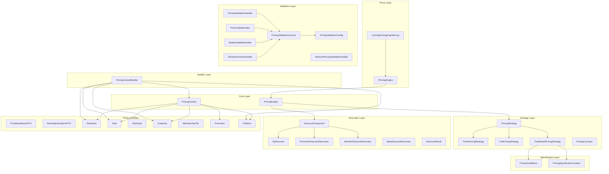
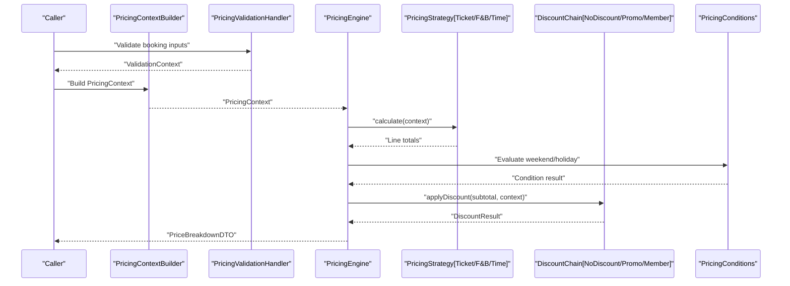
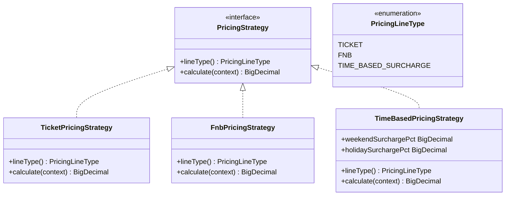
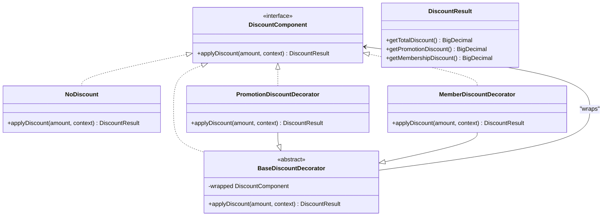
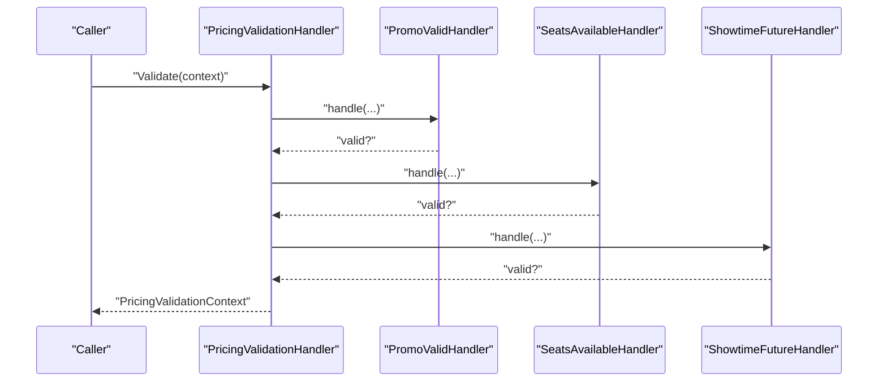
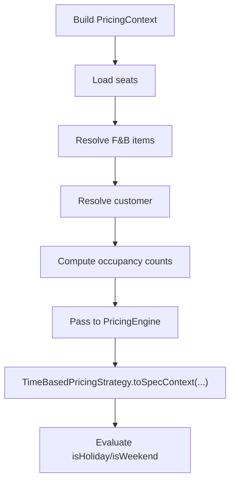
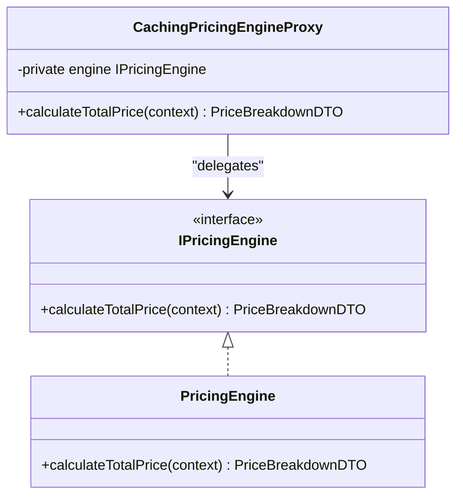
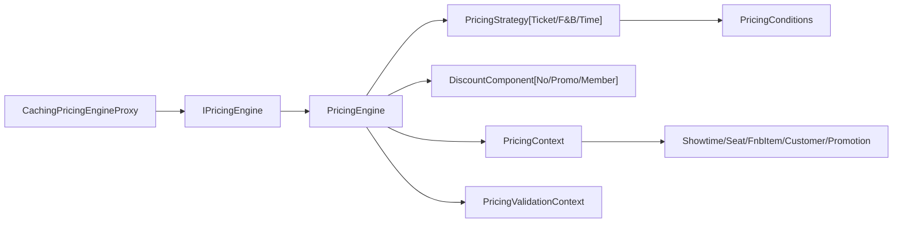

# Dynamic Pricing Engine

<cite>
**Referenced Files in This Document**
- [PricingEngine.java](file://backend/src/main/java/com/cinema/booking/services/strategy_decorator/pricing/core/PricingEngine.java)
- [IPricingEngine.java](file://backend/src/main/java/com/cinema/booking/services/strategy_decorator/pricing/proxy/IPricingEngine.java)
- [PricingContext.java](file://backend/src/main/java/com/cinema/booking/services/strategy_decorator/pricing/core/PricingContext.java)
- [PricingContextBuilder.java](file://backend/src/main/java/com/cinema/booking/services/strategy_decorator/pricing/builder/PricingContextBuilder.java)
- [PricingStrategy.java](file://backend/src/main/java/com/cinema/booking/services/strategy_decorator/pricing/strategy/PricingStrategy.java)
- [TicketPricingStrategy.java](file://backend/src/main/java/com/cinema/booking/services/strategy_decorator/pricing/strategy/TicketPricingStrategy.java)
- [FnbPricingStrategy.java](file://backend/src/main/java/com/cinema/booking/services/strategy_decorator/pricing/strategy/FnbPricingStrategy.java)
- [TimeBasedPricingStrategy.java](file://backend/src/main/java/com/cinema/booking/services/strategy_decorator/pricing/strategy/TimeBasedPricingStrategy.java)
- [PricingLineType.java](file://backend/src/main/java/com/cinema/booking/services/strategy_decorator/pricing/strategy/PricingLineType.java)
- [CachingPricingEngineProxy.java](file://backend/src/main/java/com/cinema/booking/services/strategy_decorator/pricing/proxy/CachingPricingEngineProxy.java)
- [BaseDiscountDecorator.java](file://backend/src/main/java/com/cinema/booking/services/strategy_decorator/pricing/decorator/BaseDiscountDecorator.java)
- [DiscountComponent.java](file://backend/src/main/java/com/cinema/booking/services/strategy_decorator/pricing/decorator/DiscountComponent.java)
- [DiscountResult.java](file://backend/src/main/java/com/cinema/booking/services/strategy_decorator/pricing/decorator/DiscountResult.java)
- [NoDiscount.java](file://backend/src/main/java/com/cinema/booking/services/strategy_decorator/pricing/decorator/NoDiscount.java)
- [PromotionDiscountDecorator.java](file://backend/src/main/java/com/cinema/booking/services/strategy_decorator/pricing/decorator/PromotionDiscountDecorator.java)
- [MemberDiscountDecorator.java](file://backend/src/main/java/com/cinema/booking/services/strategy_decorator/pricing/decorator/MemberDiscountDecorator.java)
- [PricingValidationHandler.java](file://backend/src/main/java/com/cinema/booking/services/strategy_decorator/pricing/validation/PricingValidationHandler.java)
- [PricingValidationContext.java](file://backend/src/main/java/com/cinema/booking/services/strategy_decorator/pricing/validation/PricingValidationContext.java)
- [PricingValidationConfig.java](file://backend/src/main/java/com/cinema/booking/services/strategy_decorator/pricing/validation/PricingValidationConfig.java)
- [PromoValidHandler.java](file://backend/src/main/java/com/cinema/booking/services/strategy_decorator/pricing/validation/PromoValidHandler.java)
- [SeatsAvailableHandler.java](file://backend/src/main/java/com/cinema/booking/services/strategy_decorator/pricing/validation/SeatsAvailableHandler.java)
- [ShowtimeFutureHandler.java](file://backend/src/main/java/com/cinema/booking/services/strategy_decorator/pricing/validation/ShowtimeFutureHandler.java)
- [AbstractPricingValidationHandler.java](file://backend/src/main/java/com/cinema/booking/services/strategy_decorator/pricing/validation/AbstractPricingValidationHandler.java)
- [PriceBreakdownDTO.java](file://backend/src/main/java/com/cinema/booking/dtos/PriceBreakdownDTO.java)
- [BookingCalculationDTO.java](file://backend/src/main/java/com/cinema/booking/dtos/BookingCalculationDTO.java)
- [Showtime.java](file://backend/src/main/java/com/cinema/booking/entities/Showtime.java)
- [Seat.java](file://backend/src/main/java/com/cinema/booking/entities/Seat.java)
- [SeatType.java](file://backend/src/main/java/com/cinema/booking/entities/SeatType.java)
- [Customer.java](file://backend/src/main/java/com/cinema/booking/entities/Customer.java)
- [MembershipTier.java](file://backend/src/main/java/com/cinema/booking/entities/MembershipTier.java)
- [Promotion.java](file://backend/src/main/java/com/cinema/booking/entities/Promotion.java)
- [FnbItem.java](file://backend/src/main/java/com/cinema/booking/entities/FnbItem.java)
- [PricingConditions.java](file://backend/src/main/java/com/cinema/booking/patterns/specification/PricingConditions.java)
- [PricingSpecificationContext.java](file://backend/src/main/java/com/cinema/booking/patterns/specification/PricingSpecificationContext.java)
- [application.properties](file://backend/src/main/resources/application.properties)
</cite>

## Update Summary
**Changes Made**
- Updated file paths to reflect new package structure (core, builder, decorator, proxy, specification, strategy, validation)
- Enhanced class-by-class documentation with detailed field structures and responsibilities
- Expanded pattern-specific documentation with improved UML diagrams
- Added comprehensive coverage of all pricing engine components and their interactions
- Updated dependency analysis and architectural diagrams with accurate file mappings

## Table of Contents
1. [Introduction](#introduction)
2. [Project Structure](#project-structure)
3. [Core Components](#core-components)
4. [Architecture Overview](#architecture-overview)
5. [Detailed Component Analysis](#detailed-component-analysis)
6. [Dependency Analysis](#dependency-analysis)
7. [Performance Considerations](#performance-considerations)
8. [Troubleshooting Guide](#troubleshooting-guide)
9. [Conclusion](#conclusion)
10. [Appendices](#appendices)

## Introduction
This document explains the dynamic pricing engine used in the cinema booking system. It covers the pricing strategy pattern for ticket and food & beverage (F&B) pricing, time-based surcharges, membership tier discounts, promotional discounts, and the decorator pattern for stacking multiple discounts. It also documents the pricing validation chain using the chain of responsibility pattern, caching via the proxy pattern, the pricing context builder, pricing specification patterns for flexible conditions, and pricing result aggregation. Practical examples of pricing calculation workflows and debugging techniques are included.

## Project Structure
The pricing engine resides under the strategy-decorator-pricing package with a well-organized layered architecture. The new structure separates concerns into distinct packages: core (engine and context), builder (context construction), decorator (discount chain), proxy (caching), specification (time-based conditions), strategy (pricing calculations), and validation (precondition checks).

**Diagram sources**
- [PricingEngine.java:34-125](file://backend/src/main/java/com/cinema/booking/services/strategy_decorator/pricing/core/PricingEngine.java#L34-L125)
- [PricingContext.java:16-34](file://backend/src/main/java/com/cinema/booking/services/strategy_decorator/pricing/core/PricingContext.java#L16-L34)
- [PricingContextBuilder.java:30-96](file://backend/src/main/java/com/cinema/booking/services/strategy_decorator/pricing/builder/PricingContextBuilder.java#L30-L96)
- [PricingStrategy.java:7-12](file://backend/src/main/java/com/cinema/booking/services/strategy_decorator/pricing/strategy/PricingStrategy.java#L7-L12)
- [TicketPricingStrategy.java:10-34](file://backend/src/main/java/com/cinema/booking/services/strategy_decorator/pricing/strategy/TicketPricingStrategy.java#L10-L34)
- [FnbPricingStrategy.java:12-33](file://backend/src/main/java/com/cinema/booking/services/strategy_decorator/pricing/strategy/FnbPricingStrategy.java#L12-L33)
- [TimeBasedPricingStrategy.java:23-91](file://backend/src/main/java/com/cinema/booking/services/strategy_decorator/pricing/strategy/TimeBasedPricingStrategy.java#L23-L91)
- [PricingLineType.java:4-8](file://backend/src/main/java/com/cinema/booking/services/strategy_decorator/pricing/strategy/PricingLineType.java#L4-L8)
- [DiscountComponent.java:7-9](file://backend/src/main/java/com/cinema/booking/services/strategy_decorator/pricing/decorator/DiscountComponent.java#L7-L9)
- [NoDiscount.java:10-15](file://backend/src/main/java/com/cinema/booking/services/strategy_decorator/pricing/decorator/NoDiscount.java#L10-L15)
- [PromotionDiscountDecorator.java:15-51](file://backend/src/main/java/com/cinema/booking/services/strategy_decorator/pricing/decorator/PromotionDiscountDecorator.java#L15-L51)
- [MemberDiscountDecorator.java:22-54](file://backend/src/main/java/com/cinema/booking/services/strategy_decorator/pricing/decorator/MemberDiscountDecorator.java#L22-L54)
- [BaseDiscountDecorator.java:7-18](file://backend/src/main/java/com/cinema/booking/services/strategy_decorator/pricing/decorator/BaseDiscountDecorator.java#L7-L18)
- [DiscountResult.java](file://backend/src/main/java/com/cinema/booking/services/strategy_decorator/pricing/decorator/DiscountResult.java)
- [IPricingEngine.java:10-12](file://backend/src/main/java/com/cinema/booking/services/strategy_decorator/pricing/proxy/IPricingEngine.java#L10-L12)
- [CachingPricingEngineProxy.java](file://backend/src/main/java/com/cinema/booking/services/strategy_decorator/pricing/proxy/CachingPricingEngineProxy.java)
- [PricingValidationHandler.java](file://backend/src/main/java/com/cinema/booking/services/strategy_decorator/pricing/validation/PricingValidationHandler.java)
- [AbstractPricingValidationHandler.java](file://backend/src/main/java/com/cinema/booking/services/strategy_decorator/pricing/validation/AbstractPricingValidationHandler.java)
- [PricingValidationContext.java](file://backend/src/main/java/com/cinema/booking/services/strategy_decorator/pricing/validation/PricingValidationContext.java)
- [PricingValidationConfig.java](file://backend/src/main/java/com/cinema/booking/services/strategy_decorator/pricing/validation/PricingValidationConfig.java)
- [PromoValidHandler.java](file://backend/src/main/java/com/cinema/booking/services/strategy_decorator/pricing/validation/PromoValidHandler.java)
- [SeatsAvailableHandler.java](file://backend/src/main/java/com/cinema/booking/services/strategy_decorator/pricing/validation/SeatsAvailableHandler.java)
- [ShowtimeFutureHandler.java](file://backend/src/main/java/com/cinema/booking/services/strategy_decorator/pricing/validation/ShowtimeFutureHandler.java)
- [PricingConditions.java](file://backend/src/main/java/com/cinema/booking/patterns/specification/PricingConditions.java)
- [PricingSpecificationContext.java](file://backend/src/main/java/com/cinema/booking/patterns/specification/PricingSpecificationContext.java)
- [PriceBreakdownDTO.java](file://backend/src/main/java/com/cinema/booking/dtos/PriceBreakdownDTO.java)
- [BookingCalculationDTO.java](file://backend/src/main/java/com/cinema/booking/dtos/BookingCalculationDTO.java)
- [Showtime.java](file://backend/src/main/java/com/cinema/booking/entities/Showtime.java)
- [Seat.java](file://backend/src/main/java/com/cinema/booking/entities/Seat.java)
- [SeatType.java](file://backend/src/main/java/com/cinema/booking/entities/SeatType.java)
- [Customer.java](file://backend/src/main/java/com/cinema/booking/entities/Customer.java)
- [MembershipTier.java](file://backend/src/main/java/com/cinema/booking/entities/MembershipTier.java)
- [Promotion.java](file://backend/src/main/java/com/cinema/booking/entities/Promotion.java)
- [FnbItem.java](file://backend/src/main/java/com/cinema/booking/entities/FnbItem.java)

**Section sources**
- [PricingEngine.java:34-125](file://backend/src/main/java/com/cinema/booking/services/strategy_decorator/pricing/core/PricingEngine.java#L34-L125)
- [PricingContext.java:16-34](file://backend/src/main/java/com/cinema/booking/services/strategy_decorator/pricing/core/PricingContext.java#L16-L34)
- [PricingContextBuilder.java:30-96](file://backend/src/main/java/com/cinema/booking/services/strategy_decorator/pricing/builder/PricingContextBuilder.java#L30-L96)

## Core Components
- **PricingEngine**: The orchestrator component that coordinates pricing calculation by invoking per-line strategies, building discount chains, and aggregating results into PriceBreakdownDTO. It validates strategy registration and manages the complete pricing workflow.
- **PricingStrategy**: Defines the contract for calculating totals per line type (ticket, F&B, time-based surcharge) with strong typing through PricingLineType enumeration.
- **PricingContext**: Carries all runtime inputs including showtime, seats, resolved F&B items, promotion, customer, booking time, and occupancy statistics. Includes a value object for resolved F&B items.
- **PricingContextBuilder**: Resolves entities from repositories and constructs PricingContext after validation, computing occupancy counts and customer resolution.
- **Discount Decorators**: Implement a chain to apply promotions and membership discounts sequentially with proper discount allocation tracking.
- **Validation Handlers**: Enforce preconditions before pricing calculation using chain of responsibility pattern.
- **Specifications**: Encapsulate time-based conditions (weekend/holiday) used by the time-based pricing strategy.

**Section sources**
- [PricingEngine.java:34-125](file://backend/src/main/java/com/cinema/booking/services/strategy_decorator/pricing/core/PricingEngine.java#L34-L125)
- [PricingStrategy.java:7-12](file://backend/src/main/java/com/cinema/booking/services/strategy_decorator/pricing/strategy/PricingStrategy.java#L7-L12)
- [PricingContext.java:16-34](file://backend/src/main/java/com/cinema/booking/services/strategy_decorator/pricing/core/PricingContext.java#L16-L34)
- [PricingContextBuilder.java:30-96](file://backend/src/main/java/com/cinema/booking/services/strategy_decorator/pricing/builder/PricingContextBuilder.java#L30-L96)

## Architecture Overview
The pricing engine follows a layered architecture with clear separation of concerns:
- **Strategy layer**: Computes per-line totals (ticket, F&B, time-based surcharge) using registered strategies keyed by PricingLineType.
- **Decorator layer**: Applies discounts sequentially (promotion then membership) with proper discount allocation tracking.
- **Validation chain**: Ensures prerequisites are met before pricing calculation.
- **Specification patterns**: Evaluate time-based conditions for surcharge calculations.
- **Result aggregation**: Produces structured PriceBreakdownDTO with detailed pricing breakdown.

**Diagram sources**
- [PricingContextBuilder.java:37-67](file://backend/src/main/java/com/cinema/booking/services/strategy_decorator/pricing/builder/PricingContextBuilder.java#L37-L67)
- [PricingEngine.java:54-84](file://backend/src/main/java/com/cinema/booking/services/strategy_decorator/pricing/core/PricingEngine.java#L54-L84)
- [PricingStrategy.java:7-12](file://backend/src/main/java/com/cinema/booking/services/strategy_decorator/pricing/strategy/PricingStrategy.java#L7-L12)
- [PricingConditions.java](file://backend/src/main/java/com/cinema/booking/patterns/specification/PricingConditions.java)
- [PriceBreakdownDTO.java](file://backend/src/main/java/com/cinema/booking/dtos/PriceBreakdownDTO.java)

## Detailed Component Analysis

### Pricing Engine Orchestration
The PricingEngine serves as the central orchestrator managing the complete pricing workflow:

**Key Responsibilities:**
- Validates strategy registration for all PricingLineType values
- Coordinates strategy execution for ticket, F&B, and time-based surcharge calculations
- Builds conditional discount chains based on context
- Handles negative total protection and discount allocation
- Generates comprehensive pricing breakdown

**Workflow Process:**

**Diagram sources**
- [PricingEngine.java:54-124](file://backend/src/main/java/com/cinema/booking/services/strategy_decorator/pricing/core/PricingEngine.java#L54-L124)

**Section sources**
- [PricingEngine.java:34-125](file://backend/src/main/java/com/cinema/booking/services/strategy_decorator/pricing/core/PricingEngine.java#L34-L125)

### Pricing Strategies Implementation
The strategy pattern provides specialized pricing calculations for different line types:

**TicketPricingStrategy**: Calculates base price plus seat-type surcharges for all selected seats
**FnbPricingStrategy**: Multiplies resolved F&B item prices by quantities and sums totals
**TimeBasedPricingStrategy**: Evaluates weekend/holiday conditions and applies configurable surcharge rates

**Diagram sources**
- [PricingStrategy.java:7-12](file://backend/src/main/java/com/cinema/booking/services/strategy_decorator/pricing/strategy/PricingStrategy.java#L7-L12)
- [TicketPricingStrategy.java:10-34](file://backend/src/main/java/com/cinema/booking/services/strategy_decorator/pricing/strategy/TicketPricingStrategy.java#L10-L34)
- [FnbPricingStrategy.java:12-33](file://backend/src/main/java/com/cinema/booking/services/strategy_decorator/pricing/strategy/FnbPricingStrategy.java#L12-L33)
- [TimeBasedPricingStrategy.java:23-91](file://backend/src/main/java/com/cinema/booking/services/strategy_decorator/pricing/strategy/TimeBasedPricingStrategy.java#L23-L91)
- [PricingLineType.java:4-8](file://backend/src/main/java/com/cinema/booking/services/strategy_decorator/pricing/strategy/PricingLineType.java#L4-L8)

**Section sources**
- [TicketPricingStrategy.java:17-33](file://backend/src/main/java/com/cinema/booking/services/strategy_decorator/pricing/strategy/TicketPricingStrategy.java#L17-L33)
- [FnbPricingStrategy.java:20-32](file://backend/src/main/java/com/cinema/booking/services/strategy_decorator/pricing/strategy/FnbPricingStrategy.java#L20-L32)
- [TimeBasedPricingStrategy.java:40-69](file://backend/src/main/java/com/cinema/booking/services/strategy_decorator/pricing/strategy/TimeBasedPricingStrategy.java#L40-L69)

### Discount Decorator Chain System
The decorator pattern enables flexible discount application with proper allocation tracking:

**DiscountComponent Interface**: Defines the contract for discount application with subtotal and context parameters
**BaseDiscountDecorator**: Abstract decorator that delegates to wrapped components
**NoDiscount**: Terminal decorator returning no discount
**PromotionDiscountDecorator**: Applies promotional discounts (percent or fixed amount)
**MemberDiscountDecorator**: Applies membership tier discounts based on customer tier

**Diagram sources**
- [DiscountComponent.java:7-9](file://backend/src/main/java/com/cinema/booking/services/strategy_decorator/pricing/decorator/DiscountComponent.java#L7-L9)
- [BaseDiscountDecorator.java:7-18](file://backend/src/main/java/com/cinema/booking/services/strategy_decorator/pricing/decorator/BaseDiscountDecorator.java#L7-L18)
- [NoDiscount.java:10-15](file://backend/src/main/java/com/cinema/booking/services/strategy_decorator/pricing/decorator/NoDiscount.java#L10-L15)
- [PromotionDiscountDecorator.java:15-51](file://backend/src/main/java/com/cinema/booking/services/strategy_decorator/pricing/decorator/PromotionDiscountDecorator.java#L15-L51)
- [MemberDiscountDecorator.java:22-54](file://backend/src/main/java/com/cinema/booking/services/strategy_decorator/pricing/decorator/MemberDiscountDecorator.java#L22-L54)
- [DiscountResult.java](file://backend/src/main/java/com/cinema/booking/services/strategy_decorator/pricing/decorator/DiscountResult.java)

**Section sources**
- [PricingEngine.java:86-106](file://backend/src/main/java/com/cinema/booking/services/strategy_decorator/pricing/core/PricingEngine.java#L86-L106)

### Pricing Validation Chain (Chain of Responsibility)
The validation system enforces prerequisites using chain of responsibility pattern:

**Handlers**: PromoValidHandler, SeatsAvailableHandler, ShowtimeFutureHandler
**Abstract Handler**: Provides common validation logic and chaining mechanism
**Context**: Holds validated entities and validation results
**Configuration**: Controls handler ordering and validation rules

**Diagram sources**
- [PricingValidationHandler.java](file://backend/src/main/java/com/cinema/booking/services/strategy_decorator/pricing/validation/PricingValidationHandler.java)
- [PromoValidHandler.java](file://backend/src/main/java/com/cinema/booking/services/strategy_decorator/pricing/validation/PromoValidHandler.java)
- [SeatsAvailableHandler.java](file://backend/src/main/java/com/cinema/booking/services/strategy_decorator/pricing/validation/SeatsAvailableHandler.java)
- [ShowtimeFutureHandler.java](file://backend/src/main/java/com/cinema/booking/services/strategy_decorator/pricing/validation/ShowtimeFutureHandler.java)
- [AbstractPricingValidationHandler.java](file://backend/src/main/java/com/cinema/booking/services/strategy_decorator/pricing/validation/AbstractPricingValidationHandler.java)
- [PricingValidationContext.java](file://backend/src/main/java/com/cinema/booking/services/strategy_decorator/pricing/validation/PricingValidationContext.java)
- [PricingValidationConfig.java](file://backend/src/main/java/com/cinema/booking/services/strategy_decorator/pricing/validation/PricingValidationConfig.java)

**Section sources**
- [PricingValidationHandler.java](file://backend/src/main/java/com/cinema/booking/services/strategy_decorator/pricing/validation/PricingValidationHandler.java)
- [PricingValidationContext.java](file://backend/src/main/java/com/cinema/booking/services/strategy_decorator/pricing/validation/PricingValidationContext.java)

### Pricing Context Builder and Specification Patterns
The builder pattern constructs PricingContext from validation results and request data:

**Entity Resolution**: Loads seats, resolves F&B items, identifies customer, and computes occupancy
**Context Construction**: Builds PricingContext with showtime, seats, resolved F&B items, promotion, customer, booking time, and occupancy statistics
**Specification Integration**: Converts PricingContext to PricingSpecificationContext for time-based condition evaluation

**Diagram sources**
- [PricingContextBuilder.java:37-67](file://backend/src/main/java/com/cinema/booking/services/strategy_decorator/pricing/builder/PricingContextBuilder.java#L37-L67)
- [TimeBasedPricingStrategy.java:71-90](file://backend/src/main/java/com/cinema/booking/services/strategy_decorator/pricing/strategy/TimeBasedPricingStrategy.java#L71-L90)
- [PricingConditions.java](file://backend/src/main/java/com/cinema/booking/patterns/specification/PricingConditions.java)

**Section sources**
- [PricingContextBuilder.java:37-96](file://backend/src/main/java/com/cinema/booking/services/strategy_decorator/pricing/builder/PricingContextBuilder.java#L37-L96)
- [TimeBasedPricingStrategy.java:40-69](file://backend/src/main/java/com/cinema/booking/services/strategy_decorator/pricing/strategy/TimeBasedPricingStrategy.java#L40-L69)

### Caching Strategy (Proxy Pattern)
The proxy pattern enables transparent caching of pricing results:

**Interface Design**: IPricingEngine defines the contract for both real PricingEngine and cached proxy
**Caching Logic**: CachingPricingEngineProxy wraps IPricingEngine to cache results keyed by normalized request signature
**Transparent Usage**: Clients interact with IPricingEngine interface regardless of caching implementation

**Diagram sources**
- [IPricingEngine.java:10-12](file://backend/src/main/java/com/cinema/booking/services/strategy_decorator/pricing/proxy/IPricingEngine.java#L10-L12)
- [PricingEngine.java:34-84](file://backend/src/main/java/com/cinema/booking/services/strategy_decorator/pricing/core/PricingEngine.java#L34-L84)
- [CachingPricingEngineProxy.java](file://backend/src/main/java/com/cinema/booking/services/strategy_decorator/pricing/proxy/CachingPricingEngineProxy.java)

**Section sources**
- [IPricingEngine.java:10-12](file://backend/src/main/java/com/cinema/booking/services/strategy_decorator/pricing/proxy/IPricingEngine.java#L10-L12)
- [CachingPricingEngineProxy.java](file://backend/src/main/java/com/cinema/booking/services/strategy_decorator/pricing/proxy/CachingPricingEngineProxy.java)

### Pricing Result Aggregation
The engine produces comprehensive pricing breakdown through PriceBreakdownDTO:

**Fields**: ticketTotal, fnbTotal, timeBasedSurcharge, membershipDiscount, discountAmount, appliedStrategy, finalTotal
**Strategy Label**: Dynamically constructed from active components (TICKET, FNB, TIME_BASED, PROMO, MEMBER_DISCOUNT)
**Validation**: Ensures final total is never negative with appropriate discount allocation

**Section sources**
- [PricingEngine.java:75-84](file://backend/src/main/java/com/cinema/booking/services/strategy_decorator/pricing/core/PricingEngine.java#L75-L84)
- [PriceBreakdownDTO.java](file://backend/src/main/java/com/cinema/booking/dtos/PriceBreakdownDTO.java)

### Membership Tier Pricing and Promotional Pricing
The engine supports sophisticated discount management:

**Membership Discounts**: Applied when customer has a valid membership tier with positive discount percent
**Promotional Discounts**: Applied when promotion exists in context, supporting both percent and fixed amount types
**Discount Allocation**: Proper tracking of promotion vs membership discount portions
**Peak Hour Surcharges**: Modeled through time-based surcharge strategy using weekend/holiday predicates

**Section sources**
- [PricingEngine.java:100-106](file://backend/src/main/java/com/cinema/booking/services/strategy_decorator/pricing/core/PricingEngine.java#L100-L106)
- [MembershipTier.java](file://backend/src/main/java/com/cinema/booking/entities/MembershipTier.java)
- [Promotion.java](file://backend/src/main/java/com/cinema/booking/entities/Promotion.java)
- [TimeBasedPricingStrategy.java:25-33](file://backend/src/main/java/com/cinema/booking/services/strategy_decorator/pricing/strategy/TimeBasedPricingStrategy.java#L25-L33)

## Dependency Analysis
The pricing engine exhibits clean dependency separation with clear interfaces:

**Core Dependencies:**
- PricingEngine depends on PricingStrategy implementations, DiscountComponent decorators, and PricingContext
- PricingContextBuilder depends on repositories for entity resolution and validation context
- TimeBasedPricingStrategy depends on PricingSpecificationContext and PricingConditions

**Interface-Based Design:**
- IPricingEngine enables proxy pattern implementation
- DiscountComponent interface supports decorator pattern flexibility
- PricingStrategy interface enables pluggable pricing algorithms

**Diagram sources**
- [PricingEngine.java:36-52](file://backend/src/main/java/com/cinema/booking/services/strategy_decorator/pricing/core/PricingEngine.java#L36-L52)
- [PricingContext.java:16-34](file://backend/src/main/java/com/cinema/booking/services/strategy_decorator/pricing/core/PricingContext.java#L16-L34)
- [PricingContextBuilder.java:32-35](file://backend/src/main/java/com/cinema/booking/services/strategy_decorator/pricing/builder/PricingContextBuilder.java#L32-L35)
- [TimeBasedPricingStrategy.java:46-48](file://backend/src/main/java/com/cinema/booking/services/strategy_decorator/pricing/strategy/TimeBasedPricingStrategy.java#L46-L48)

**Section sources**
- [PricingEngine.java:36-52](file://backend/src/main/java/com/cinema/booking/services/strategy_decorator/pricing/core/PricingEngine.java#L36-L52)
- [PricingContextBuilder.java:32-35](file://backend/src/main/java/com/cinema/booking/services/strategy_decorator/pricing/builder/PricingContextBuilder.java#L32-L35)

## Performance Considerations
The engine incorporates several performance optimization strategies:

**Database Optimization**: Minimize repeated queries by resolving entities in PricingContextBuilder and passing via PricingContext
**Specification Efficiency**: Use specification predicates judiciously; cache predicate results if reused frequently
**Caching Strategy**: Apply caching via CachingPricingEngineProxy to avoid recomputation for identical inputs
**Decorator Chain Optimization**: Keep discount chain short by conditionally adding decorators only when applicable
**Monetary Precision**: Round monetary values consistently during time-based surcharge computation
**Early Validation**: Prevent unnecessary processing through comprehensive validation chain

## Troubleshooting Guide
Common issues and their solutions:

**Strategy Registration Issues**: The engine validates presence of all PricingLineType entries during construction, throwing IllegalStateException for duplicates or missing strategies
**Negative Final Total**: The engine automatically caps final total to zero and adjusts discount allocations accordingly
**Promotion Application Failures**: Verify promotion validity handler passes and promotion is present in PricingContext
**Membership Discount Issues**: Ensure customer has a membership tier with positive discount percent
**Time-Based Surcharge Problems**: Confirm showtime and seats are present and time-based predicates match weekend/holiday conditions
**Context Building Errors**: Check that validation chain populates showtime and seat IDs before building PricingContext

**Section sources**
- [PricingEngine.java:39-51](file://backend/src/main/java/com/cinema/booking/services/strategy_decorator/pricing/core/PricingEngine.java#L39-L51)
- [PricingEngine.java:67-71](file://backend/src/main/java/com/cinema/booking/services/strategy_decorator/pricing/core/PricingEngine.java#L67-L71)
- [PricingEngine.java:89-95](file://backend/src/main/java/com/cinema/booking/services/strategy_decorator/pricing/core/PricingEngine.java#L89-L95)
- [PricingEngine.java:100-106](file://backend/src/main/java/com/cinema/booking/services/strategy_decorator/pricing/core/PricingEngine.java#L100-L106)

## Conclusion
The dynamic pricing engine successfully combines strategy, decorator, chain of responsibility, specification, and proxy patterns to deliver a flexible, extensible, and efficient pricing system. The new package structure enhances modularity and maintainability while supporting ticket and F&B pricing, time-based surcharges, promotional discounts, and membership tier discounts. The engine ensures robust validation, transparent caching, and comprehensive result aggregation with proper discount allocation tracking.

## Appendices

### Practical Examples

**Time-Based Surcharge Calculation**
- Input: Showtime with base price, seats with seat-type surcharges, weekend/holiday predicates
- Workflow: Compute ticket subtotal, select surcharge rate, multiply and round to two decimals
- Reference: [TimeBasedPricingStrategy.calculate:40-69](file://backend/src/main/java/com/cinema/booking/services/strategy_decorator/pricing/strategy/TimeBasedPricingStrategy.java#L40-L69)

**Membership Discount Calculation**
- Input: Customer with membership tier discount percent
- Workflow: Check tier discount percent > 0; if true, include MemberDiscountDecorator in chain
- Reference: [PricingEngine.hasMemberDiscount:100-106](file://backend/src/main/java/com/cinema/booking/services/strategy_decorator/pricing/core/PricingEngine.java#L100-L106)

**Promotional Discount Application**
- Input: Promotion in PricingContext
- Workflow: Wrap NoDiscount with PromotionDiscountDecorator when promotion is present
- Reference: [PricingEngine.buildDiscountChain:86-98](file://backend/src/main/java/com/cinema/booking/services/strategy_decorator/pricing/core/PricingEngine.java#L86-L98)

**Pricing Result Aggregation**
- Input: Line totals, discount result, applied strategy components
- Workflow: Build PriceBreakdownDTO with ticket total, F&B total, surcharge, membership discount, discount amount, applied strategy label, final total
- Reference: [PricingEngine.calculateTotalPrice:54-84](file://backend/src/main/java/com/cinema/booking/services/strategy_decorator/pricing/core/PricingEngine.java#L54-L84)

### Pricing Rule Configuration
**Configuration Properties:**
- Weekend surcharge percentage: `cinema.pricing.weekend-surcharge-pct` (default 15)
- Holiday surcharge percentage: `cinema.pricing.holiday-surcharge-pct` (default 20)

**References:**
- [TimeBasedPricingStrategy constructor:28-33](file://backend/src/main/java/com/cinema/booking/services/strategy_decorator/pricing/strategy/TimeBasedPricingStrategy.java#L28-L33)
- [application.properties](file://backend/src/main/resources/application.properties)

### Pricing History Tracking
The system does not currently implement pricing history tracking. To add this capability, consider:
- Persisting PriceBreakdownDTO alongside booking records
- Including metadata such as applied strategy label and timestamps
- Implementing audit trails for pricing rule changes

### Pricing API Endpoints and Workflows
**Typical Workflow:**
1. Validate inputs using PricingValidationHandler chain
2. Build PricingContext via PricingContextBuilder
3. Invoke PricingEngine.calculateTotalPrice
4. Return PriceBreakdownDTO to client

**Endpoint Pattern:**
- Accept BookingCalculationDTO as input
- Return PriceBreakdownDTO as output
- Support both authenticated and anonymous users
- Handle error cases with appropriate HTTP status codes