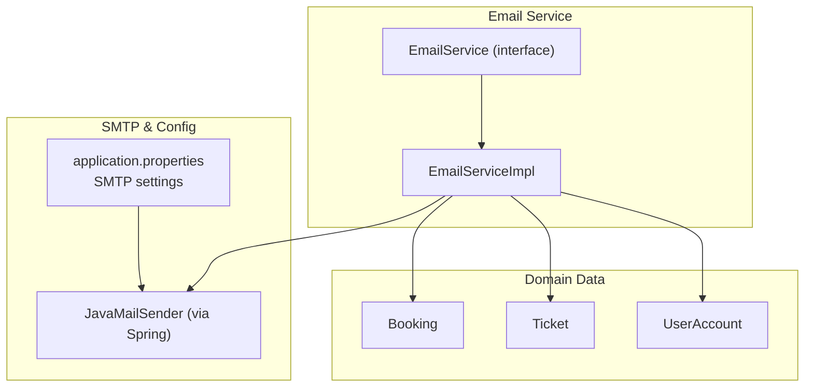
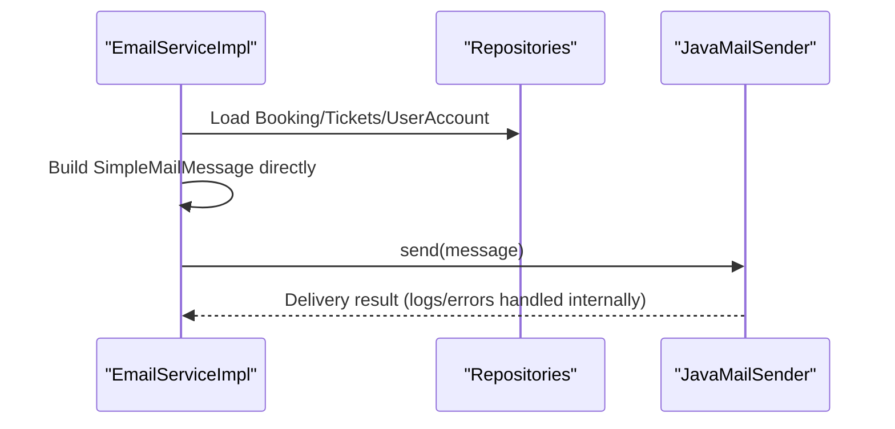
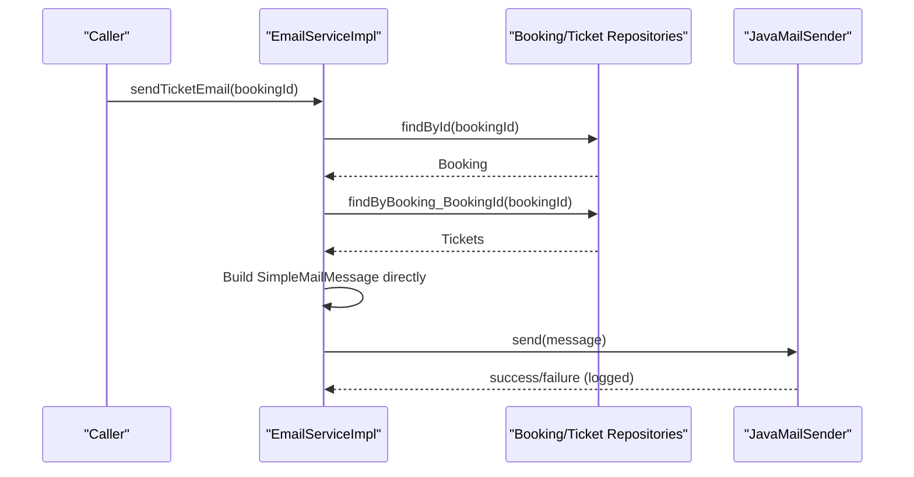
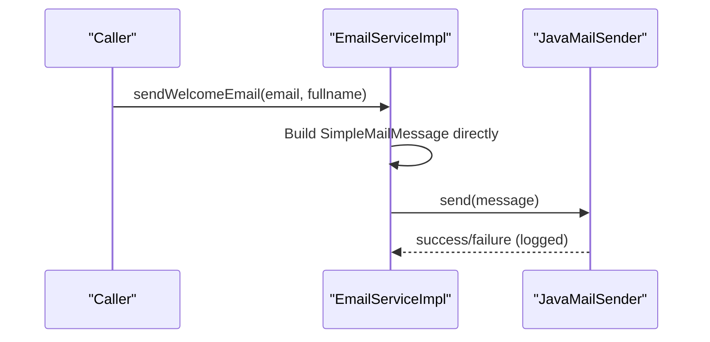
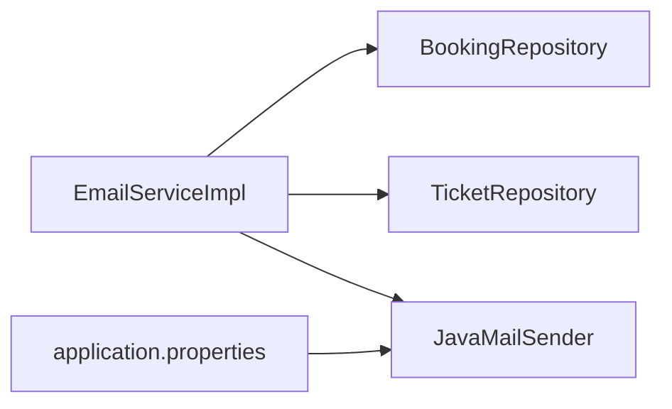

# Email Notification System

<cite>
**Referenced Files in This Document**
- [EmailService.java](file://backend/src/main/java/com/cinema/booking/services/EmailService.java)
- [EmailServiceImpl.java](file://backend/src/main/java/com/cinema/booking/services/impl/EmailServiceImpl.java)
- [application.properties](file://backend/src/main/resources/application.properties)
- [Notification.java](file://backend/src/main/java/com/cinema/booking/entities/Notification.java)
</cite>

## Update Summary
**Changes Made**
- Updated email template system section to reflect removal of prototype pattern
- Revised implementation details to show inline template construction approach
- Removed references to prototype classes (EmailTemplate, TicketEmailPrototype, etc.)
- Updated architecture diagrams to reflect new inline template approach
- Revised code examples and workflow explanations to match current implementation

## Table of Contents
1. [Introduction](#introduction)
2. [Project Structure](#project-structure)
3. [Core Components](#core-components)
4. [Architecture Overview](#architecture-overview)
5. [Detailed Component Analysis](#detailed-component-analysis)
6. [Dependency Analysis](#dependency-analysis)
7. [Performance Considerations](#performance-considerations)
8. [Troubleshooting Guide](#troubleshooting-guide)
9. [Conclusion](#conclusion)
10. [Appendices](#appendices)

## Introduction
This document describes the email notification system used by the cinema booking application. The system has been refactored to use inline template construction instead of the prototype pattern, focusing on:
- Direct email message construction using SimpleMailMessage
- The email service implementation using Spring JavaMailSender
- SMTP configuration and delivery behavior
- Email types currently supported: booking tickets and welcome emails
- Personalization with dynamic content insertion
- Delivery logging and basic error handling
- Security and deliverability considerations derived from current configuration
- Practical examples of email triggers and configuration steps

## Project Structure
The email system is organized around a streamlined service that constructs email content directly without template prototypes.

**Diagram sources**
- [EmailServiceImpl.java:1-101](file://backend/src/main/java/com/cinema/booking/services/impl/EmailServiceImpl.java#L1-L101)
- [EmailService.java:1-7](file://backend/src/main/java/com/cinema/booking/services/EmailService.java#L1-L7)
- [application.properties:89-97](file://backend/src/main/resources/application.properties#L89-L97)

**Section sources**
- [EmailServiceImpl.java:1-101](file://backend/src/main/java/com/cinema/booking/services/impl/EmailServiceImpl.java#L1-L101)
- [EmailService.java:1-7](file://backend/src/main/java/com/cinema/booking/services/EmailService.java#L1-L7)
- [application.properties:89-97](file://backend/src/main/resources/application.properties#L89-L97)

## Core Components
- EmailService (interface): Defines contracts for email operations including ticket email and welcome email sending.
- EmailServiceImpl: Orchestrates email generation and delivery using Spring's JavaMailSender with inline template construction.
- SimpleMailMessage: Directly constructed email messages with recipient, subject, and body content.

Key behaviors:
- Email content is built directly using SimpleMailMessage constructor and setters
- Dynamic content is injected via string concatenation and formatting
- Delivery uses JavaMailSender configured in application.properties

**Section sources**
- [EmailService.java:1-7](file://backend/src/main/java/com/cinema/booking/services/EmailService.java#L1-L7)
- [EmailServiceImpl.java:1-101](file://backend/src/main/java/com/cinema/booking/services/impl/EmailServiceImpl.java#L1-L101)

## Architecture Overview
The email system follows a simplified approach with direct message construction:
- The service layer resolves data from domain entities and builds email content directly
- Delivery is delegated to Spring's JavaMailSender configured with SMTP credentials

**Diagram sources**
- [EmailServiceImpl.java:34-78](file://backend/src/main/java/com/cinema/booking/services/impl/EmailServiceImpl.java#L34-L78)
- [application.properties:89-97](file://backend/src/main/resources/application.properties#L89-L97)

## Detailed Component Analysis

### Email Service Implementation (Inline Template Construction)
The EmailServiceImpl coordinates:
- Loading booking and ticket data to build personalized content
- Direct construction of SimpleMailMessage instances
- Sending via JavaMailSender and logging outcomes

**Diagram sources**
- [EmailServiceImpl.java:34-78](file://backend/src/main/java/com/cinema/booking/services/impl/EmailServiceImpl.java#L34-L78)

Additional welcome email flow:

**Diagram sources**
- [EmailServiceImpl.java:81-99](file://backend/src/main/java/com/cinema/booking/services/impl/EmailServiceImpl.java#L81-L99)

**Section sources**
- [EmailServiceImpl.java:1-101](file://backend/src/main/java/com/cinema/booking/services/impl/EmailServiceImpl.java#L1-L101)
- [EmailService.java:1-7](file://backend/src/main/java/com/cinema/booking/services/EmailService.java#L1-L7)

### Email Types and Personalization
- Booking confirmation emails:
  - Content built from Booking, Ticket, Showtime, and Movie entities
  - Fields include booking ID, customer name, movie title, showtime, and total amount
- Welcome emails:
  - Personalized with recipient's full name

Personalization pipeline:
- Resolve domain data (Booking/Ticket/UserAccount)
- Construct SimpleMailMessage directly with formatted content
- Send via JavaMailSender

**Section sources**
- [EmailServiceImpl.java:34-78](file://backend/src/main/java/com/cinema/booking/services/impl/EmailServiceImpl.java#L34-L78)
- [EmailServiceImpl.java:81-99](file://backend/src/main/java/com/cinema/booking/services/impl/EmailServiceImpl.java#L81-L99)

### Email Queue Management and Delivery Tracking
- Current implementation:
  - Emails are sent synchronously during method invocation
  - Delivery logs are printed to console (success and error)
  - No explicit queue or retry mechanism is present in the current code
- Recommended enhancements (future scope):
  - Introduce asynchronous processing (e.g., Spring TaskExecutor or messaging)
  - Add persistence for email events and delivery status
  - Implement retry/backoff and dead-letter handling

### Email Security, Spam Prevention, and Deliverability
- Current configuration:
  - SMTP host, port, credentials, and TLS enabled are configured in application.properties
- Security considerations:
  - Store SMTP credentials in environment variables (as shown by property placeholders)
  - Prefer app-specific passwords or OAuth where supported by the provider
- Deliverability tips (general best practices):
  - Use a reputable SMTP provider and maintain good sender reputation
  - Configure SPF/DKIM/DMARC records
  - Avoid spammy language and ensure clear sender identity
  - Monitor bounce and complaint rates

**Section sources**
- [application.properties:89-97](file://backend/src/main/resources/application.properties#L89-L97)

### Practical Examples and Workflows
- Triggering a ticket email:
  - Call sendTicketEmail with a valid booking ID
  - The service loads related data and sends a personalized ticket confirmation
- Triggering a welcome email:
  - Call sendWelcomeEmail with recipient email and full name
- Template creation workflow:
  - Create SimpleMailMessage instances directly
  - Set recipient, subject, and formatted text content
  - Send via JavaMailSender

Note: The current code does not expose email-specific API endpoints; email triggers are invoked from business logic or controllers.

**Section sources**
- [EmailService.java:1-7](file://backend/src/main/java/com/cinema/booking/services/EmailService.java#L1-L7)
- [EmailServiceImpl.java:34-99](file://backend/src/main/java/com/cinema/booking/services/impl/EmailServiceImpl.java#L34-L99)

## Dependency Analysis
The email system exhibits low coupling and high cohesion:
- EmailServiceImpl depends on repositories for data and JavaMailSender for delivery
- SimpleMailMessage instances are constructed directly without template dependencies
- SMTP configuration is externalized via application.properties

**Diagram sources**
- [EmailServiceImpl.java:1-101](file://backend/src/main/java/com/cinema/booking/services/impl/EmailServiceImpl.java#L1-L101)
- [application.properties:89-97](file://backend/src/main/resources/application.properties#L89-L97)

**Section sources**
- [EmailServiceImpl.java:1-101](file://backend/src/main/java/com/cinema/booking/services/impl/EmailServiceImpl.java#L1-L101)
- [application.properties:89-97](file://backend/src/main/resources/application.properties#L89-L97)

## Performance Considerations
- Inline template construction eliminates prototype cloning overhead
- Synchronous sending keeps latency predictable but blocks the calling thread
- Recommendations:
  - Offload email sending to async tasks or queues for scalability
  - Batch send where appropriate
  - Cache frequently reused templates and data (with caution)

## Troubleshooting Guide
Common issues and remedies:
- Recipient missing email address:
  - The ticket email flow checks for a valid email on the associated UserAccount; if absent, it logs and skips sending
- Delivery failures:
  - Exceptions are caught and logged; verify SMTP credentials and network connectivity
- Template personalization errors:
  - Ensure required fields (booking/ticket/movie/showtime) are present before invoking sendTicketEmail

Operational logging:
- Success and error messages are printed to console during send operations

**Section sources**
- [EmailServiceImpl.java:41-44](file://backend/src/main/java/com/cinema/booking/services/impl/EmailServiceImpl.java#L41-L44)
- [EmailServiceImpl.java:72-78](file://backend/src/main/java/com/cinema/booking/services/impl/EmailServiceImpl.java#L72-L78)
- [EmailServiceImpl.java:93-99](file://backend/src/main/java/com/cinema/booking/services/impl/EmailServiceImpl.java#L93-L99)

## Conclusion
The email notification system has been refactored to use inline template construction, simplifying the architecture while maintaining email functionality. It currently supports booking confirmations and welcomes with straightforward delivery via JavaMailSender and console logging. For production, consider asynchronous processing, persistent delivery tracking, and robust security and deliverability practices.

## Appendices

### Email Service Configuration
- SMTP settings are loaded from application.properties
- Ensure environment variables are set for sensitive values

**Section sources**
- [application.properties:89-97](file://backend/src/main/resources/application.properties#L89-L97)

### Related Domain Entities
- Notifications entity exists for in-app notifications; email notifications are handled separately via the inline template system

**Section sources**
- [Notification.java:1-35](file://backend/src/main/java/com/cinema/booking/entities/Notification.java#L1-L35)