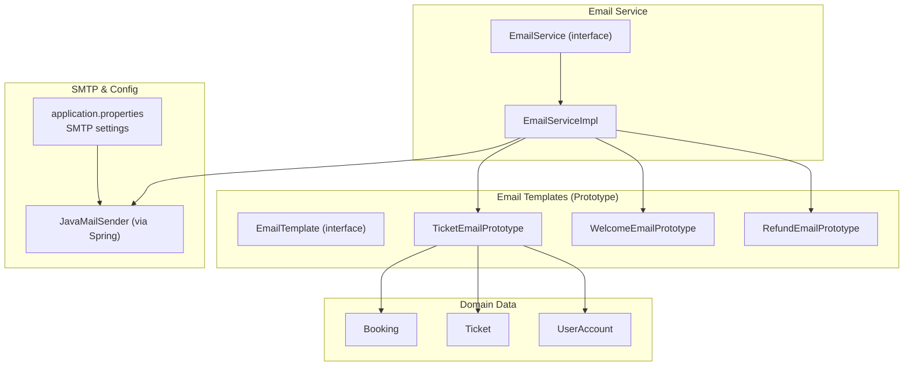
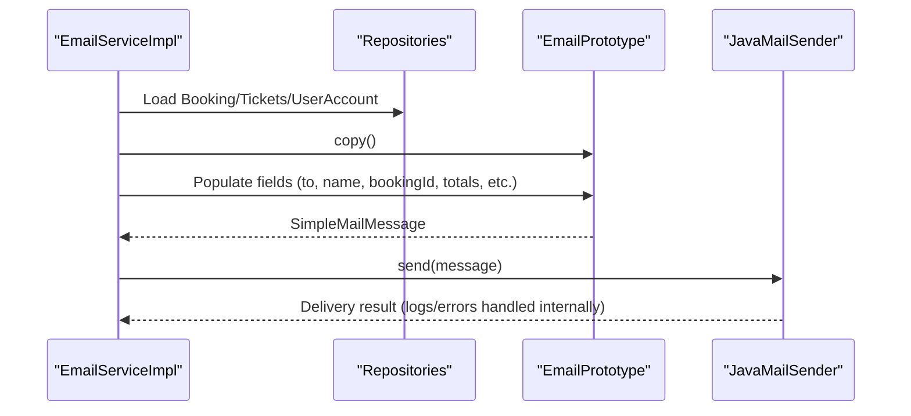
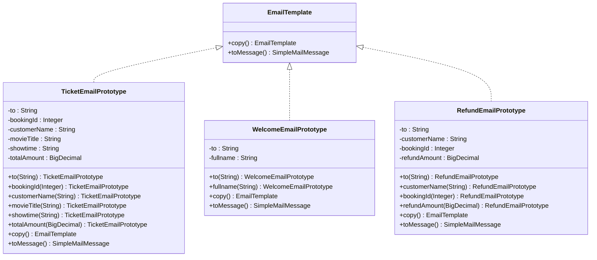
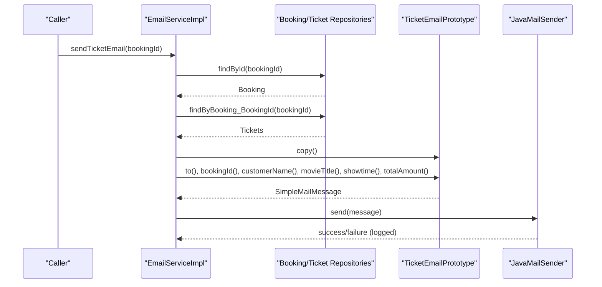
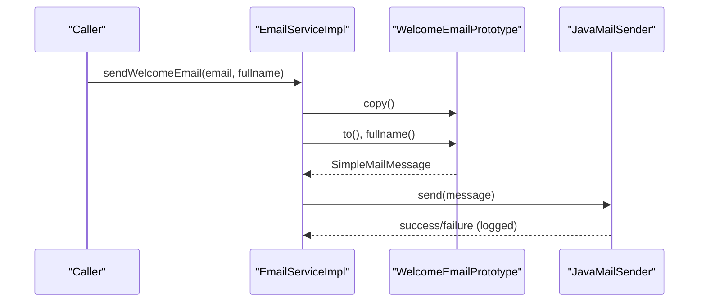
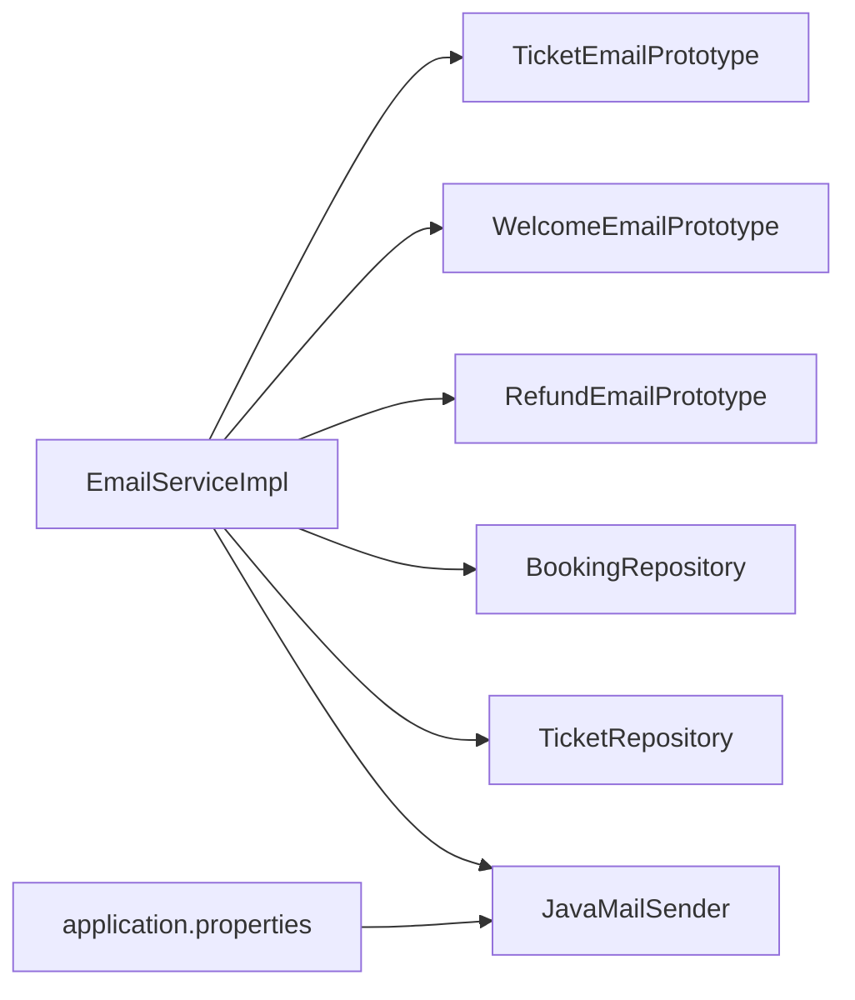

# Email Notification System

<cite>
**Referenced Files in This Document**
- [EmailService.java](file://backend/src/main/java/com/cinema/booking/services/EmailService.java)
- [EmailServiceImpl.java](file://backend/src/main/java/com/cinema/booking/services/impl/EmailServiceImpl.java)
- [EmailTemplate.java](file://backend/src/main/java/com/cinema/booking/patterns/prototype/EmailTemplate.java)
- [TicketEmailPrototype.java](file://backend/src/main/java/com/cinema/booking/patterns/prototype/TicketEmailPrototype.java)
- [WelcomeEmailPrototype.java](file://backend/src/main/java/com/cinema/booking/patterns/prototype/WelcomeEmailPrototype.java)
- [RefundEmailPrototype.java](file://backend/src/main/java/com/cinema/booking/patterns/prototype/RefundEmailPrototype.java)
- [application.properties](file://backend/src/main/resources/application.properties)
- [Notification.java](file://backend/src/main/java/com/cinema/booking/entities/Notification.java)
</cite>

## Table of Contents
1. [Introduction](#introduction)
2. [Project Structure](#project-structure)
3. [Core Components](#core-components)
4. [Architecture Overview](#architecture-overview)
5. [Detailed Component Analysis](#detailed-component-analysis)
6. [Dependency Analysis](#dependency-analysis)
7. [Performance Considerations](#performance-considerations)
8. [Troubleshooting Guide](#troubleshooting-guide)
9. [Conclusion](#conclusion)
10. [Appendices](#appendices)

## Introduction
This document describes the email notification system used by the cinema booking application. It focuses on:
- The prototype-based email template system for cloning and personalizing email content
- The email service implementation using Spring JavaMailSender
- SMTP configuration and delivery behavior
- Email types currently supported: booking tickets, welcome emails, and refund notifications (future-ready)
- Personalization with dynamic content insertion and recipient-specific templates
- Delivery logging and basic error handling
- Security and deliverability considerations derived from current configuration
- Practical examples of email triggers and configuration steps

## Project Structure
The email system is organized around a small set of prototype email templates and a dedicated service that orchestrates email generation and delivery.

**Diagram sources**
- [EmailTemplate.java:1-16](file://backend/src/main/java/com/cinema/booking/patterns/prototype/EmailTemplate.java#L1-L16)
- [TicketEmailPrototype.java:1-60](file://backend/src/main/java/com/cinema/booking/patterns/prototype/TicketEmailPrototype.java#L1-L60)
- [WelcomeEmailPrototype.java:1-41](file://backend/src/main/java/com/cinema/booking/patterns/prototype/WelcomeEmailPrototype.java#L1-L41)
- [RefundEmailPrototype.java:1-50](file://backend/src/main/java/com/cinema/booking/patterns/prototype/RefundEmailPrototype.java#L1-L50)
- [EmailServiceImpl.java:1-98](file://backend/src/main/java/com/cinema/booking/services/impl/EmailServiceImpl.java#L1-L98)
- [EmailService.java:1-7](file://backend/src/main/java/com/cinema/booking/services/EmailService.java#L1-L7)
- [application.properties:89-97](file://backend/src/main/resources/application.properties#L89-L97)

**Section sources**
- [EmailTemplate.java:1-16](file://backend/src/main/java/com/cinema/booking/patterns/prototype/EmailTemplate.java#L1-L16)
- [TicketEmailPrototype.java:1-60](file://backend/src/main/java/com/cinema/booking/patterns/prototype/TicketEmailPrototype.java#L1-L60)
- [WelcomeEmailPrototype.java:1-41](file://backend/src/main/java/com/cinema/booking/patterns/prototype/WelcomeEmailPrototype.java#L1-L41)
- [RefundEmailPrototype.java:1-50](file://backend/src/main/java/com/cinema/booking/patterns/prototype/RefundEmailPrototype.java#L1-L50)
- [EmailServiceImpl.java:1-98](file://backend/src/main/java/com/cinema/booking/services/impl/EmailServiceImpl.java#L1-L98)
- [EmailService.java:1-7](file://backend/src/main/java/com/cinema/booking/services/EmailService.java#L1-L7)
- [application.properties:89-97](file://backend/src/main/resources/application.properties#L89-L97)

## Core Components
- EmailTemplate (interface): Defines the contract for email prototypes, including cloning and message building.
- TicketEmailPrototype: Produces personalized ticket purchase confirmation emails using booking and ticket data.
- WelcomeEmailPrototype: Produces personalized welcome emails for new members.
- RefundEmailPrototype: Provides a future-ready template for refund notifications.
- EmailService (interface) and EmailServiceImpl: Orchestrate email generation and delivery using Spring’s JavaMailSender.

Key behaviors:
- Template cloning via copy() ensures thread-safe reuse of preconfigured templates.
- Dynamic content is injected via setter-style methods on the prototype copies.
- Delivery uses SimpleMailMessage and JavaMailSender configured in application.properties.

**Section sources**
- [EmailTemplate.java:1-16](file://backend/src/main/java/com/cinema/booking/patterns/prototype/EmailTemplate.java#L1-L16)
- [TicketEmailPrototype.java:1-60](file://backend/src/main/java/com/cinema/booking/patterns/prototype/TicketEmailPrototype.java#L1-L60)
- [WelcomeEmailPrototype.java:1-41](file://backend/src/main/java/com/cinema/booking/patterns/prototype/WelcomeEmailPrototype.java#L1-L41)
- [RefundEmailPrototype.java:1-50](file://backend/src/main/java/com/cinema/booking/patterns/prototype/RefundEmailPrototype.java#L1-L50)
- [EmailService.java:1-7](file://backend/src/main/java/com/cinema/booking/services/EmailService.java#L1-L7)
- [EmailServiceImpl.java:1-98](file://backend/src/main/java/com/cinema/booking/services/impl/EmailServiceImpl.java#L1-L98)

## Architecture Overview
The email system follows a clean separation of concerns:
- Prototypes encapsulate email subject and body templates.
- The service layer resolves data from domain entities and populates prototype copies.
- Delivery is delegated to Spring’s JavaMailSender configured with SMTP credentials.

**Diagram sources**
- [EmailServiceImpl.java:41-96](file://backend/src/main/java/com/cinema/booking/services/impl/EmailServiceImpl.java#L41-L96)
- [TicketEmailPrototype.java:32-58](file://backend/src/main/java/com/cinema/booking/patterns/prototype/TicketEmailPrototype.java#L32-L58)
- [WelcomeEmailPrototype.java:20-39](file://backend/src/main/java/com/cinema/booking/patterns/prototype/WelcomeEmailPrototype.java#L20-L39)
- [application.properties:89-97](file://backend/src/main/resources/application.properties#L89-L97)

## Detailed Component Analysis

### Email Template System (Prototype Pattern)
The prototype pattern enables efficient reuse of email templates while allowing per-email customization. Each prototype:
- Implements EmailTemplate with copy() and toMessage().
- Holds minimal mutable state (recipient, personalization fields).
- Produces a SimpleMailMessage with subject and body.

**Diagram sources**
- [EmailTemplate.java:1-16](file://backend/src/main/java/com/cinema/booking/patterns/prototype/EmailTemplate.java#L1-L16)
- [TicketEmailPrototype.java:1-60](file://backend/src/main/java/com/cinema/booking/patterns/prototype/TicketEmailPrototype.java#L1-L60)
- [WelcomeEmailPrototype.java:1-41](file://backend/src/main/java/com/cinema/booking/patterns/prototype/WelcomeEmailPrototype.java#L1-L41)
- [RefundEmailPrototype.java:1-50](file://backend/src/main/java/com/cinema/booking/patterns/prototype/RefundEmailPrototype.java#L1-L50)

**Section sources**
- [EmailTemplate.java:1-16](file://backend/src/main/java/com/cinema/booking/patterns/prototype/EmailTemplate.java#L1-L16)
- [TicketEmailPrototype.java:1-60](file://backend/src/main/java/com/cinema/booking/patterns/prototype/TicketEmailPrototype.java#L1-L60)
- [WelcomeEmailPrototype.java:1-41](file://backend/src/main/java/com/cinema/booking/patterns/prototype/WelcomeEmailPrototype.java#L1-L41)
- [RefundEmailPrototype.java:1-50](file://backend/src/main/java/com/cinema/booking/patterns/prototype/RefundEmailPrototype.java#L1-L50)

### Email Service Implementation
The EmailServiceImpl coordinates:
- Loading booking and ticket data to build personalized content
- Cloning and populating email prototypes
- Sending via JavaMailSender and logging outcomes

**Diagram sources**
- [EmailServiceImpl.java:41-80](file://backend/src/main/java/com/cinema/booking/services/impl/EmailServiceImpl.java#L41-L80)
- [TicketEmailPrototype.java:32-58](file://backend/src/main/java/com/cinema/booking/patterns/prototype/TicketEmailPrototype.java#L32-L58)

Additional welcome email flow:

**Diagram sources**
- [EmailServiceImpl.java:82-96](file://backend/src/main/java/com/cinema/booking/services/impl/EmailServiceImpl.java#L82-L96)
- [WelcomeEmailPrototype.java:20-39](file://backend/src/main/java/com/cinema/booking/patterns/prototype/WelcomeEmailPrototype.java#L20-L39)

**Section sources**
- [EmailServiceImpl.java:1-98](file://backend/src/main/java/com/cinema/booking/services/impl/EmailServiceImpl.java#L1-L98)
- [EmailService.java:1-7](file://backend/src/main/java/com/cinema/booking/services/EmailService.java#L1-L7)

### Email Types and Personalization
- Booking confirmation emails:
  - Content built from Booking, Ticket, Showtime, and Movie entities
  - Fields include booking ID, customer name, movie title, showtime, and total amount
- Welcome emails:
  - Personalized with recipient’s full name
- Refund emails:
  - Future-ready with placeholders for customer name, booking ID, and refund amount

Personalization pipeline:
- Resolve domain data (Booking/Ticket/UserAccount)
- Clone template, populate fields, convert to SimpleMailMessage
- Send via JavaMailSender

**Section sources**
- [TicketEmailPrototype.java:13-58](file://backend/src/main/java/com/cinema/booking/patterns/prototype/TicketEmailPrototype.java#L13-L58)
- [WelcomeEmailPrototype.java:9-39](file://backend/src/main/java/com/cinema/booking/patterns/prototype/WelcomeEmailPrototype.java#L9-L39)
- [RefundEmailPrototype.java:8-48](file://backend/src/main/java/com/cinema/booking/patterns/prototype/RefundEmailPrototype.java#L8-L48)
- [EmailServiceImpl.java:41-96](file://backend/src/main/java/com/cinema/booking/services/impl/EmailServiceImpl.java#L41-L96)

### Email Queue Management and Delivery Tracking
- Current implementation:
  - Emails are sent synchronously during method invocation
  - Delivery logs are printed to console (success and error)
  - No explicit queue or retry mechanism is present in the current code
- Recommended enhancements (future scope):
  - Introduce asynchronous processing (e.g., Spring TaskExecutor or messaging)
  - Add persistence for email events and delivery status
  - Implement retry/backoff and dead-letter handling

[No sources needed since this section provides general guidance]

### Email Security, Spam Prevention, and Deliverability
- Current configuration:
  - SMTP host, port, credentials, and TLS enabled are configured in application.properties
- Security considerations:
  - Store SMTP credentials in environment variables (as shown by property placeholders)
  - Prefer app-specific passwords or OAuth where supported by the provider
- Deliverability tips (general best practices):
  - Use a reputable SMTP provider and maintain good sender reputation
  - Configure SPF/DKIM/DMARC records
  - Avoid spammy language and ensure clear sender identity
  - Monitor bounce and complaint rates

**Section sources**
- [application.properties:89-97](file://backend/src/main/resources/application.properties#L89-L97)

### Practical Examples and Workflows
- Triggering a ticket email:
  - Call sendTicketEmail with a valid booking ID
  - The service loads related data and sends a personalized ticket confirmation
- Triggering a welcome email:
  - Call sendWelcomeEmail with recipient email and full name
- Template creation workflow:
  - Extend EmailTemplate and implement copy() and toMessage()
  - Inject the prototype into EmailServiceImpl and use in similar flows

Note: The current code does not expose email-specific API endpoints; email triggers are invoked from business logic or controllers.

**Section sources**
- [EmailService.java:1-7](file://backend/src/main/java/com/cinema/booking/services/EmailService.java#L1-L7)
- [EmailServiceImpl.java:41-96](file://backend/src/main/java/com/cinema/booking/services/impl/EmailServiceImpl.java#L41-L96)

## Dependency Analysis
The email system exhibits low coupling and high cohesion:
- EmailServiceImpl depends on repositories for data and prototypes for content
- Prototypes depend only on SimpleMailMessage and immutable fields
- SMTP configuration is externalized via application.properties

**Diagram sources**
- [EmailServiceImpl.java:1-98](file://backend/src/main/java/com/cinema/booking/services/impl/EmailServiceImpl.java#L1-L98)
- [TicketEmailPrototype.java:1-60](file://backend/src/main/java/com/cinema/booking/patterns/prototype/TicketEmailPrototype.java#L1-L60)
- [WelcomeEmailPrototype.java:1-41](file://backend/src/main/java/com/cinema/booking/patterns/prototype/WelcomeEmailPrototype.java#L1-L41)
- [RefundEmailPrototype.java:1-50](file://backend/src/main/java/com/cinema/booking/patterns/prototype/RefundEmailPrototype.java#L1-L50)
- [application.properties:89-97](file://backend/src/main/resources/application.properties#L89-L97)

**Section sources**
- [EmailServiceImpl.java:1-98](file://backend/src/main/java/com/cinema/booking/services/impl/EmailServiceImpl.java#L1-L98)
- [application.properties:89-97](file://backend/src/main/resources/application.properties#L89-L97)

## Performance Considerations
- Prototype cloning avoids repeated template construction overhead
- Synchronous sending keeps latency predictable but blocks the calling thread
- Recommendations:
  - Offload email sending to async tasks or queues for scalability
  - Batch send where appropriate
  - Cache frequently reused templates and data (with caution)

[No sources needed since this section provides general guidance]

## Troubleshooting Guide
Common issues and remedies:
- Recipient missing email address:
  - The ticket email flow checks for a valid email on the associated UserAccount; if absent, it logs and skips sending
- Delivery failures:
  - Exceptions are caught and logged; verify SMTP credentials and network connectivity
- Template personalization errors:
  - Ensure required fields (booking/ticket/movie/showtime) are present before invoking sendTicketEmail

Operational logging:
- Success and error messages are printed to console during send operations

**Section sources**
- [EmailServiceImpl.java:45-51](file://backend/src/main/java/com/cinema/booking/services/impl/EmailServiceImpl.java#L45-L51)
- [EmailServiceImpl.java:74-79](file://backend/src/main/java/com/cinema/booking/services/impl/EmailServiceImpl.java#L74-L79)
- [EmailServiceImpl.java:90-95](file://backend/src/main/java/com/cinema/booking/services/impl/EmailServiceImpl.java#L90-L95)

## Conclusion
The email notification system leverages the prototype pattern to cleanly separate content templates from delivery logic. It currently supports booking confirmations and welcomes, with a refund template ready for future use. Delivery is straightforward via JavaMailSender with console logging. For production, consider asynchronous processing, persistent delivery tracking, and robust security and deliverability practices.

[No sources needed since this section summarizes without analyzing specific files]

## Appendices

### Email Service Configuration
- SMTP settings are loaded from application.properties
- Ensure environment variables are set for sensitive values

**Section sources**
- [application.properties:89-97](file://backend/src/main/resources/application.properties#L89-L97)

### Related Domain Entities
- Notifications entity exists for in-app notifications; email notifications are handled separately via the prototype-based system

**Section sources**
- [Notification.java:1-35](file://backend/src/main/java/com/cinema/booking/entities/Notification.java#L1-L35)