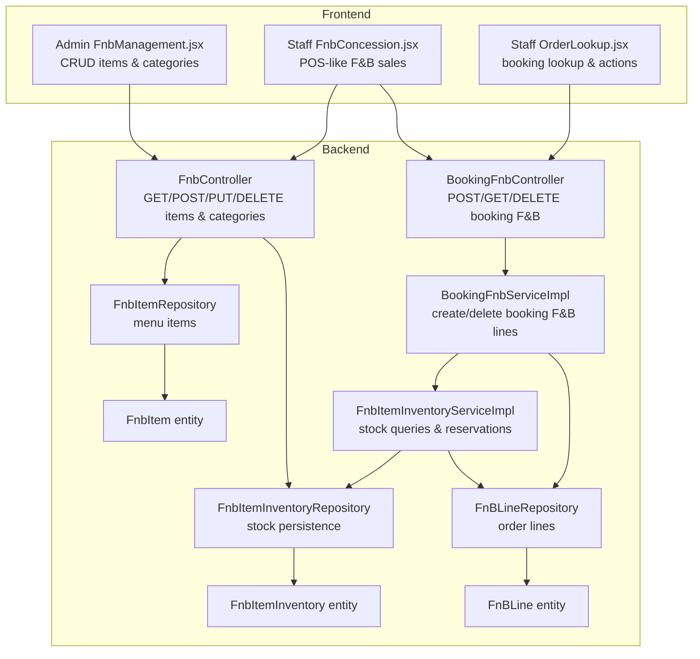
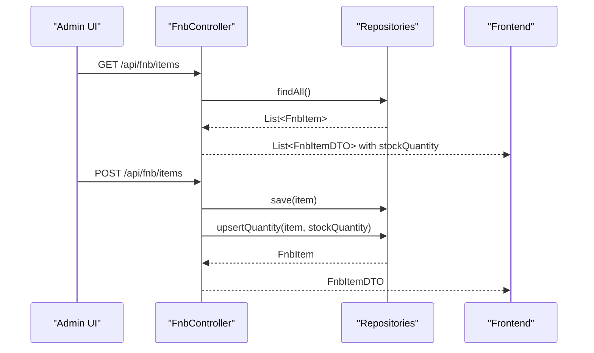
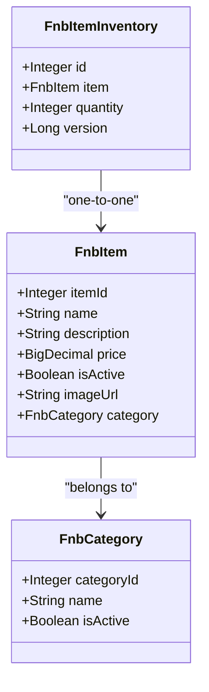
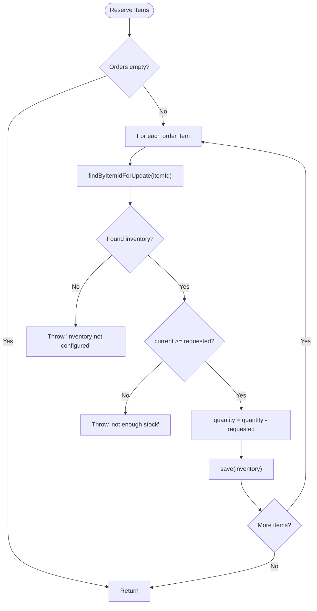
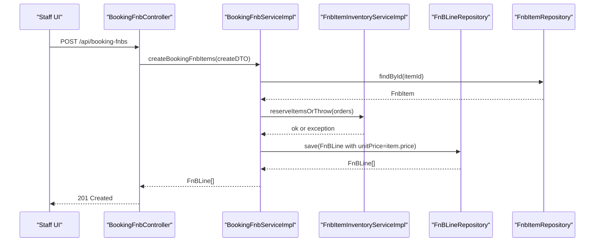
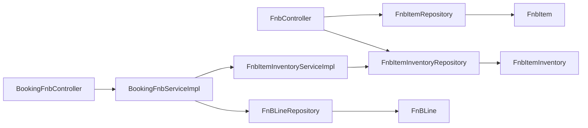

# Food and Beverage Management

<cite>
**Referenced Files in This Document**
- [FnbController.java](file://backend/src/main/java/com/cinema/booking/controllers/FnbController.java)
- [BookingFnbController.java](file://backend/src/main/java/com/cinema/booking/controllers/BookingFnbController.java)
- [FnbItemInventoryServiceImpl.java](file://backend/src/main/java/com/cinema/booking/services/impl/FnbItemInventoryServiceImpl.java)
- [BookingFnbServiceImpl.java](file://backend/src/main/java/com/cinema/booking/services/impl/BookingFnbServiceImpl.java)
- [FnbItem.java](file://backend/src/main/java/com/cinema/booking/entities/FnbItem.java)
- [FnbItemInventory.java](file://backend/src/main/java/com/cinema/booking/entities/FnbItemInventory.java)
- [FnBLine.java](file://backend/src/main/java/com/cinema/booking/entities/FnBLine.java)
- [FnbItemRepository.java](file://backend/src/main/java/com/cinema/booking/repositories/FnbItemRepository.java)
- [FnbItemInventoryRepository.java](file://backend/src/main/java/com/cinema/booking/repositories/FnbItemInventoryRepository.java)
- [FnBLineRepository.java](file://backend/src/main/java/com/cinema/booking/repositories/FnBLineRepository.java)
- [BookingFnbCreateDTO.java](file://backend/src/main/java/com/cinema/booking/dtos/BookingFnbCreateDTO.java)
- [BookingCalculationDTO.java](file://backend/src/main/java/com/cinema/booking/dtos/BookingCalculationDTO.java)
- [FnbManagement.jsx](file://frontend/src/pages/admin/FnbManagement.jsx)
- [FnbConcession.jsx](file://frontend/src/pages/staff/FnbConcession.jsx)
- [OrderLookup.jsx](file://frontend/src/pages/staff/OrderLookup.jsx)
</cite>

## Table of Contents
1. [Introduction](#introduction)
2. [Project Structure](#project-structure)
3. [Core Components](#core-components)
4. [Architecture Overview](#architecture-overview)
5. [Detailed Component Analysis](#detailed-component-analysis)
6. [Dependency Analysis](#dependency-analysis)
7. [Performance Considerations](#performance-considerations)
8. [Troubleshooting Guide](#troubleshooting-guide)
9. [Conclusion](#conclusion)
10. [Appendices](#appendices)

## Introduction
This document describes the Food and Beverage (F&B) management system within the cinema booking platform. It covers:
- F&B catalog management: menu categories, item metadata, pricing, and availability
- Inventory management: real-time stock updates, low stock handling, and replenishment workflows
- Ordering within the booking flow: order creation, line item management, and fulfillment
- Booking-F&B integration: order placement at checkout, modifications, and cancellations
- Staff operations: order preparation, pickup, and delivery
- Reporting and analytics: sales tracking, popular items, and revenue metrics
- Practical examples of APIs, workflows, and operational procedures

## Project Structure
The F&B subsystem spans backend REST controllers, service layer, JPA entities and repositories, and frontend pages for administration and staff operations.

**Diagram sources**
- [FnbController.java:23-156](file://backend/src/main/java/com/cinema/booking/controllers/FnbController.java#L23-L156)
- [BookingFnbController.java:18-48](file://backend/src/main/java/com/cinema/booking/controllers/BookingFnbController.java#L18-L48)
- [FnbItemInventoryServiceImpl.java:24-113](file://backend/src/main/java/com/cinema/booking/services/impl/FnbItemInventoryServiceImpl.java#L24-L113)
- [BookingFnbServiceImpl.java:20-81](file://backend/src/main/java/com/cinema/booking/services/impl/BookingFnbServiceImpl.java#L20-L81)
- [FnbItemRepository.java:8-9](file://backend/src/main/java/com/cinema/booking/repositories/FnbItemRepository.java#L8-L9)
- [FnbItemInventoryRepository.java:14-21](file://backend/src/main/java/com/cinema/booking/repositories/FnbItemInventoryRepository.java#L14-L21)
- [FnBLineRepository.java:10-13](file://backend/src/main/java/com/cinema/booking/repositories/FnBLineRepository.java#L10-L13)
- [FnbItem.java:13-41](file://backend/src/main/java/com/cinema/booking/entities/FnbItem.java#L13-L41)
- [FnbItemInventory.java:12-29](file://backend/src/main/java/com/cinema/booking/entities/FnbItemInventory.java#L12-L29)
- [FnBLine.java:17-39](file://backend/src/main/java/com/cinema/booking/entities/FnBLine.java#L17-L39)
- [FnbManagement.jsx:1-467](file://frontend/src/pages/admin/FnbManagement.jsx#L1-L467)
- [FnbConcession.jsx:1-358](file://frontend/src/pages/staff/FnbConcession.jsx#L1-L358)
- [OrderLookup.jsx:1-311](file://frontend/src/pages/staff/OrderLookup.jsx#L1-L311)

**Section sources**
- [FnbController.java:23-156](file://backend/src/main/java/com/cinema/booking/controllers/FnbController.java#L23-L156)
- [BookingFnbController.java:18-48](file://backend/src/main/java/com/cinema/booking/controllers/BookingFnbController.java#L18-L48)
- [FnbItemInventoryServiceImpl.java:24-113](file://backend/src/main/java/com/cinema/booking/services/impl/FnbItemInventoryServiceImpl.java#L24-L113)
- [BookingFnbServiceImpl.java:20-81](file://backend/src/main/java/com/cinema/booking/services/impl/BookingFnbServiceImpl.java#L20-L81)
- [FnbManagement.jsx:1-467](file://frontend/src/pages/admin/FnbManagement.jsx#L1-L467)
- [FnbConcession.jsx:1-358](file://frontend/src/pages/staff/FnbConcession.jsx#L1-L358)
- [OrderLookup.jsx:1-311](file://frontend/src/pages/staff/OrderLookup.jsx#L1-L311)

## Core Components
- F&B Catalog Management
  - Menu categories and items with name, description, price, image, and active status
  - Stock quantity per item tracked separately for availability
- Inventory Management
  - Real-time stock retrieval and upsert
  - Reservation/release of stock during booking lifecycle
- Booking-F&B Integration
  - Create order lines linked to a booking
  - Retrieve and delete booking-associated F&B lines
- Frontend Operations
  - Admin page for managing items and categories
  - Staff POS for quick F&B sales
  - Order lookup for staff to manage bookings

**Section sources**
- [FnbController.java:36-133](file://backend/src/main/java/com/cinema/booking/controllers/FnbController.java#L36-L133)
- [FnbItemInventoryServiceImpl.java:30-111](file://backend/src/main/java/com/cinema/booking/services/impl/FnbItemInventoryServiceImpl.java#L30-L111)
- [BookingFnbServiceImpl.java:34-80](file://backend/src/main/java/com/cinema/booking/services/impl/BookingFnbServiceImpl.java#L34-L80)
- [FnbManagement.jsx:129-310](file://frontend/src/pages/admin/FnbManagement.jsx#L129-L310)
- [FnbConcession.jsx:1-358](file://frontend/src/pages/staff/FnbConcession.jsx#L1-L358)
- [OrderLookup.jsx:15-311](file://frontend/src/pages/staff/OrderLookup.jsx#L15-L311)

## Architecture Overview
The system follows layered architecture:
- Controllers expose REST endpoints for F&B catalog and booking-F&B operations
- Services encapsulate business logic for inventory reservation and order line creation
- Repositories persist and query entities
- Entities model F&B items, inventory, and order lines
- Frontend pages integrate with backend APIs for admin and staff tasks

**Diagram sources**
- [FnbController.java:36-98](file://backend/src/main/java/com/cinema/booking/controllers/FnbController.java#L36-L98)
- [FnbItemRepository.java:8-9](file://backend/src/main/java/com/cinema/booking/repositories/FnbItemRepository.java#L8-L9)
- [FnbItemInventoryRepository.java:14-21](file://backend/src/main/java/com/cinema/booking/repositories/FnbItemInventoryRepository.java#L14-L21)
- [FnbManagement.jsx:137-197](file://frontend/src/pages/admin/FnbManagement.jsx#L137-L197)

**Section sources**
- [FnbController.java:36-98](file://backend/src/main/java/com/cinema/booking/controllers/FnbController.java#L36-L98)
- [FnbItemRepository.java:8-9](file://backend/src/main/java/com/cinema/booking/repositories/FnbItemRepository.java#L8-L9)
- [FnbItemInventoryRepository.java:14-21](file://backend/src/main/java/com/cinema/booking/repositories/FnbItemInventoryRepository.java#L14-L21)
- [FnbManagement.jsx:137-197](file://frontend/src/pages/admin/FnbManagement.jsx#L137-L197)

## Detailed Component Analysis

### F&B Catalog Management
- Responsibilities
  - CRUD for menu categories and items
  - Aggregate stock quantity into item DTOs for display
  - Link items to categories and manage active status
- Key endpoints
  - GET /api/fnb/items: returns items with stock quantities
  - POST /api/fnb/items: creates item and sets initial stock
  - PUT /api/fnb/items/{id}: updates item and stock
  - DELETE /api/fnb/items/{id}: removes item
  - GET/POST/PUT/DELETE /api/fnb/categories: manages categories
- Data model
  - FnbItem: identity, name, description, price, image, active flag, category
  - FnbItemInventory: one-to-one mapping to item with quantity and optimistic locking via version

**Diagram sources**
- [FnbItem.java:13-41](file://backend/src/main/java/com/cinema/booking/entities/FnbItem.java#L13-L41)
- [FnbItemInventory.java:12-29](file://backend/src/main/java/com/cinema/booking/entities/FnbItemInventory.java#L12-L29)

**Section sources**
- [FnbController.java:36-133](file://backend/src/main/java/com/cinema/booking/controllers/FnbController.java#L36-L133)
- [FnbItem.java:13-41](file://backend/src/main/java/com/cinema/booking/entities/FnbItem.java#L13-L41)
- [FnbItemInventory.java:12-29](file://backend/src/main/java/com/cinema/booking/entities/FnbItemInventory.java#L12-L29)

### Inventory Management
- Responsibilities
  - Retrieve single or batch stock quantities
  - Upsert stock quantity for an item
  - Reserve requested quantities during booking (with pessimistic locking)
  - Release reserved quantities when a booking is canceled
- Key flows
  - Stock retrieval: map of itemId to quantity
  - Reservation: select-for-update by itemId, check availability, decrement
  - Release: increment stock by quantities in booking lines

**Diagram sources**
- [FnbItemInventoryServiceImpl.java:62-83](file://backend/src/main/java/com/cinema/booking/services/impl/FnbItemInventoryServiceImpl.java#L62-L83)
- [FnbItemInventoryRepository.java:17-19](file://backend/src/main/java/com/cinema/booking/repositories/FnbItemInventoryRepository.java#L17-L19)

**Section sources**
- [FnbItemInventoryServiceImpl.java:30-111](file://backend/src/main/java/com/cinema/booking/services/impl/FnbItemInventoryServiceImpl.java#L30-L111)
- [FnbItemInventoryRepository.java:14-21](file://backend/src/main/java/com/cinema/booking/repositories/FnbItemInventoryRepository.java#L14-L21)

### Booking-F&B Integration
- Responsibilities
  - Create FnBLine entries for a booking with unit price copied from item
  - Validate stock availability before creating lines
  - Delete all booking-associated lines and release inventory on cancellation
- Endpoints
  - POST /api/booking-fnbs: create booking F&B items
  - GET /api/booking-fnbs: list all booking F&B items
  - GET /api/booking-fnbs/booking/{bookingId}: list by booking
  - DELETE /api/booking-fnbs/booking/{bookingId}: delete all for booking

**Diagram sources**
- [BookingFnbController.java:23-27](file://backend/src/main/java/com/cinema/booking/controllers/BookingFnbController.java#L23-L27)
- [BookingFnbServiceImpl.java:46-71](file://backend/src/main/java/com/cinema/booking/services/impl/BookingFnbServiceImpl.java#L46-L71)
- [FnbItemInventoryServiceImpl.java:62-83](file://backend/src/main/java/com/cinema/booking/services/impl/FnbItemInventoryServiceImpl.java#L62-L83)
- [FnBLineRepository.java:10-13](file://backend/src/main/java/com/cinema/booking/repositories/FnBLineRepository.java#L10-L13)
- [FnbItemRepository.java:8-9](file://backend/src/main/java/com/cinema/booking/repositories/FnbItemRepository.java#L8-L9)

**Section sources**
- [BookingFnbController.java:23-46](file://backend/src/main/java/com/cinema/booking/controllers/BookingFnbController.java#L23-L46)
- [BookingFnbServiceImpl.java:34-80](file://backend/src/main/java/com/cinema/booking/services/impl/BookingFnbServiceImpl.java#L34-L80)
- [BookingFnbCreateDTO.java:7-17](file://backend/src/main/java/com/cinema/booking/dtos/BookingFnbCreateDTO.java#L7-L17)
- [BookingCalculationDTO.java:7-18](file://backend/src/main/java/com/cinema/booking/dtos/BookingCalculationDTO.java#L7-L18)

### Frontend: Admin F&B Management
- Features
  - Browse and filter items by name/category
  - Create/edit items with image upload and category selection
  - Toggle active status and set stock quantity
  - Manage categories (create/edit)
- API usage
  - GET /api/fnb/items and /api/fnb/categories
  - POST/PUT/DELETE for items and categories

**Section sources**
- [FnbManagement.jsx:129-310](file://frontend/src/pages/admin/FnbManagement.jsx#L129-L310)
- [FnbManagement.jsx:312-412](file://frontend/src/pages/admin/FnbManagement.jsx#L312-L412)

### Frontend: Staff POS for F&B Sales
- Features
  - Browse items by category and search
  - Add/remove items to cart
  - Calculate totals and simulate payment
- API usage
  - GET /api/fnb/items and /api/fnb/categories
  - POST /api/booking-fnbs to place orders linked to a booking

**Section sources**
- [FnbConcession.jsx:1-358](file://frontend/src/pages/staff/FnbConcession.jsx#L1-L358)

### Frontend: Order Lookup and Actions
- Features
  - Search and list bookings
  - Expand to view tickets
  - Trigger print, cancel, and refund actions
- Integration
  - Works alongside booking-F&B endpoints to manage orders

**Section sources**
- [OrderLookup.jsx:15-311](file://frontend/src/pages/staff/OrderLookup.jsx#L15-L311)

## Dependency Analysis
- Controllers depend on repositories and services
- Services depend on repositories and coordinate transactions
- Entities define relationships and constraints
- Frontend pages call backend endpoints for data and actions

**Diagram sources**
- [FnbController.java:25-32](file://backend/src/main/java/com/cinema/booking/controllers/FnbController.java#L25-L32)
- [BookingFnbController.java:20-21](file://backend/src/main/java/com/cinema/booking/controllers/BookingFnbController.java#L20-L21)
- [FnbItemRepository.java:8-9](file://backend/src/main/java/com/cinema/booking/repositories/FnbItemRepository.java#L8-L9)
- [FnbItemInventoryRepository.java:14-21](file://backend/src/main/java/com/cinema/booking/repositories/FnbItemInventoryRepository.java#L14-L21)
- [FnBLineRepository.java:10-13](file://backend/src/main/java/com/cinema/booking/repositories/FnBLineRepository.java#L10-L13)
- [FnbItem.java:13-41](file://backend/src/main/java/com/cinema/booking/entities/FnbItem.java#L13-L41)
- [FnbItemInventory.java:12-29](file://backend/src/main/java/com/cinema/booking/entities/FnbItemInventory.java#L12-L29)
- [FnBLine.java:17-39](file://backend/src/main/java/com/cinema/booking/entities/FnBLine.java#L17-L39)

**Section sources**
- [FnbController.java:25-32](file://backend/src/main/java/com/cinema/booking/controllers/FnbController.java#L25-L32)
- [BookingFnbController.java:20-21](file://backend/src/main/java/com/cinema/booking/controllers/BookingFnbController.java#L20-L21)
- [FnbItemRepository.java:8-9](file://backend/src/main/java/com/cinema/booking/repositories/FnbItemRepository.java#L8-L9)
- [FnbItemInventoryRepository.java:14-21](file://backend/src/main/java/com/cinema/booking/repositories/FnbItemInventoryRepository.java#L14-L21)
- [FnBLineRepository.java:10-13](file://backend/src/main/java/com/cinema/booking/repositories/FnBLineRepository.java#L10-L13)

## Performance Considerations
- Inventory reservation uses pessimistic locking to prevent race conditions during concurrent bookings
- Batch stock retrieval returns a map keyed by itemId for efficient UI rendering
- Entity versioning on inventory supports optimistic concurrency checks
- Frontend caches items and categories locally to reduce network requests

[No sources needed since this section provides general guidance]

## Troubleshooting Guide
- “Inventory not configured” errors indicate missing stock record for an item; ensure stock is initialized via item creation/update
- “Not enough stock” indicates insufficient quantity; reconcile inventory or reduce order quantity
- Deleting an item does not cascade stock; verify stock records are cleaned up if needed
- When canceling a booking, ensure inventory release occurs to restore stock

**Section sources**
- [FnbItemInventoryServiceImpl.java:74-82](file://backend/src/main/java/com/cinema/booking/services/impl/FnbItemInventoryServiceImpl.java#L74-L82)
- [BookingFnbServiceImpl.java:75-79](file://backend/src/main/java/com/cinema/booking/services/impl/BookingFnbServiceImpl.java#L75-L79)

## Conclusion
The F&B management system integrates a robust catalog and inventory layer with a seamless booking-F&B workflow. Admins maintain menus and categories, staff operate a POS-like interface for sales, and the system enforces stock reservations and releases to ensure accurate availability. The architecture cleanly separates concerns across controllers, services, repositories, and entities, while the frontend pages provide intuitive tools for daily operations.

[No sources needed since this section summarizes without analyzing specific files]

## Appendices

### Practical Examples

- F&B Catalog API Endpoints
  - GET /api/fnb/items
  - POST /api/fnb/items
  - PUT /api/fnb/items/{id}
  - DELETE /api/fnb/items/{id}
  - GET /api/fnb/categories
  - POST /api/fnb/categories
  - PUT /api/fnb/categories/{id}
  - DELETE /api/fnb/categories/{id}

- Booking-F&B API Endpoints
  - POST /api/booking-fnbs
  - GET /api/booking-fnbs
  - GET /api/booking-fnbs/booking/{bookingId}
  - DELETE /api/booking-fnbs/booking/{bookingId}

- Inventory Workflows
  - Reserve items before confirming a booking
  - Release items when a booking is canceled
  - Upsert stock quantities during item creation or updates

- Order Processing Patterns
  - Create FnBLine entries with unit price copied from the item
  - Validate stock availability before saving order lines
  - Support deletion of all booking-associated lines to rollback inventory

[No sources needed since this section aggregates previously analyzed content]