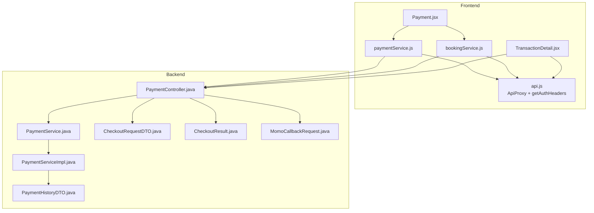
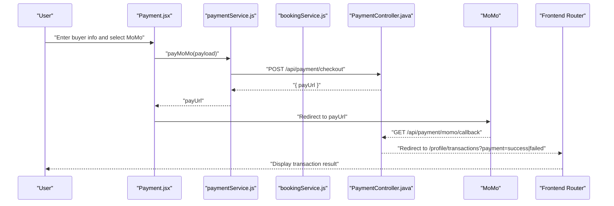
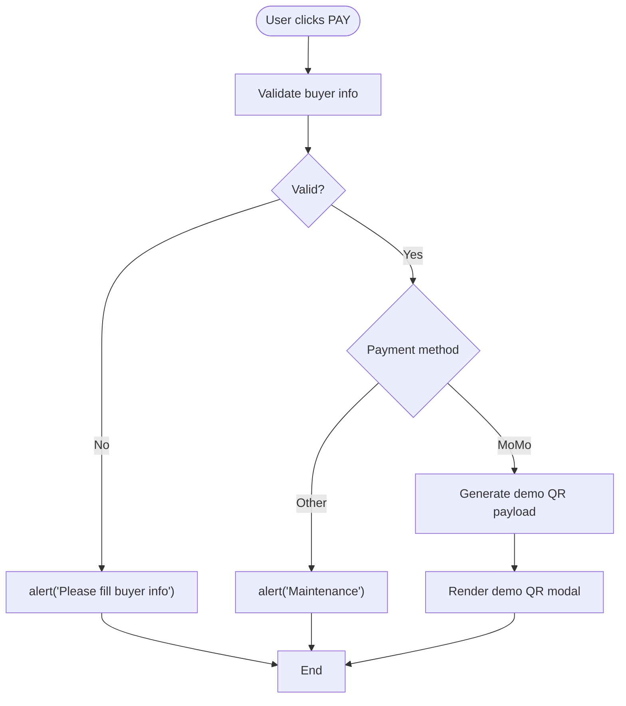
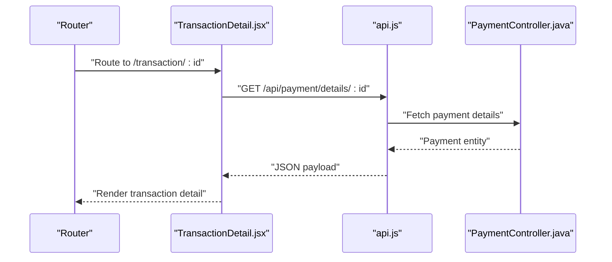
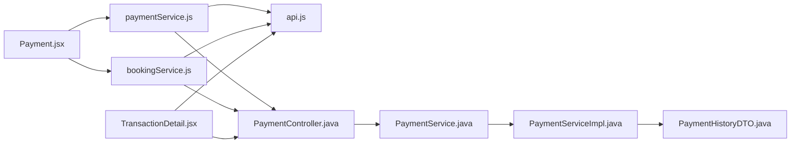

# Frontend Payment Integration

<cite>
**Referenced Files in This Document**
- [paymentService.js](file://frontend/src/services/paymentService.js)
- [Payment.jsx](file://frontend/src/pages/Payment.jsx)
- [TransactionDetail.jsx](file://frontend/src/pages/TransactionDetail.jsx)
- [api.js](file://frontend/src/utils/api.js)
- [bookingService.js](file://frontend/src/services/bookingService.js)
- [PaymentController.java](file://backend/src/main/java/com/cinema/booking/controllers/PaymentController.java)
- [PaymentService.java](file://backend/src/main/java/com/cinema/booking/services/PaymentService.java)
- [PaymentServiceImpl.java](file://backend/src/main/java/com/cinema/booking/services/impl/PaymentServiceImpl.java)
- [PaymentHistoryDTO.java](file://backend/src/main/java/com/cinema/booking/dtos/PaymentHistoryDTO.java)
- [MomoCallbackRequest.java](file://backend/src/main/java/com/cinema/booking/dtos/MomoCallbackRequest.java)
- [CheckoutRequestDTO.java](file://backend/src/main/java/com/cinema/booking/dtos/CheckoutRequestDTO.java)
- [CheckoutResult.java](file://backend/src/main/java/com/cinema/booking/dtos/CheckoutResult.java)
- [HUONG_DAN_CHAY_DU_AN.md](file://HUONG_DAN_CHAY_DU_AN.md)
</cite>

## Table of Contents
1. [Introduction](#introduction)
2. [Project Structure](#project-structure)
3. [Core Components](#core-components)
4. [Architecture Overview](#architecture-overview)
5. [Detailed Component Analysis](#detailed-component-analysis)
6. [Dependency Analysis](#dependency-analysis)
7. [Performance Considerations](#performance-considerations)
8. [Troubleshooting Guide](#troubleshooting-guide)
9. [Conclusion](#conclusion)
10. [Appendices](#appendices)

## Introduction
This document explains the frontend payment integration and user interface components for the StarCine booking system. It focuses on:
- The paymentService.js implementation for payment API calls, form validation, and payment status monitoring
- The Payment.jsx component for payment method selection, form handling, and real-time payment updates
- The TransactionDetail.jsx component for displaying payment transaction information and status
- The integration between frontend components and backend payment endpoints
- Examples of payment form validation, user input handling, and error display mechanisms
- Payment loading states, success/error callbacks, and navigation after payment completion
- Frontend security considerations including token handling, secure payment data transmission, and PCI compliance requirements
- Guidance on payment testing with sandbox environments and debugging payment issues

## Project Structure
The payment flow spans frontend React components and services, and backend Spring Boot controllers and services. The frontend communicates with backend APIs secured by JWT tokens, while the backend integrates with MoMo for payment processing and webhook notifications.

**Diagram sources**
- [paymentService.js:1-55](file://frontend/src/services/paymentService.js#L1-L55)
- [Payment.jsx:1-482](file://frontend/src/pages/Payment.jsx#L1-L482)
- [TransactionDetail.jsx:1-273](file://frontend/src/pages/TransactionDetail.jsx#L1-L273)
- [api.js:1-38](file://frontend/src/utils/api.js#L1-L38)
- [bookingService.js:1-85](file://frontend/src/services/bookingService.js#L1-L85)
- [PaymentController.java:1-150](file://backend/src/main/java/com/cinema/booking/controllers/PaymentController.java#L1-L150)
- [PaymentService.java:1-11](file://backend/src/main/java/com/cinema/booking/services/PaymentService.java#L1-L11)
- [PaymentServiceImpl.java:1-69](file://backend/src/main/java/com/cinema/booking/services/impl/PaymentServiceImpl.java#L1-L69)
- [CheckoutRequestDTO.java:1-16](file://backend/src/main/java/com/cinema/booking/dtos/CheckoutRequestDTO.java#L1-L16)
- [CheckoutResult.java:1-16](file://backend/src/main/java/com/cinema/booking/dtos/CheckoutResult.java#L1-L16)
- [MomoCallbackRequest.java:1-21](file://backend/src/main/java/com/cinema/booking/dtos/MomoCallbackRequest.java#L1-L21)
- [PaymentHistoryDTO.java:1-40](file://backend/src/main/java/com/cinema/booking/dtos/PaymentHistoryDTO.java#L1-L40)

**Section sources**
- [Payment.jsx:1-482](file://frontend/src/pages/Payment.jsx#L1-L482)
- [paymentService.js:1-55](file://frontend/src/services/paymentService.js#L1-L55)
- [TransactionDetail.jsx:1-273](file://frontend/src/pages/TransactionDetail.jsx#L1-L273)
- [PaymentController.java:1-150](file://backend/src/main/java/com/cinema/booking/controllers/PaymentController.java#L1-L150)

## Core Components
- paymentService.js: Exposes payment API helpers for MoMo checkout, demo checkout, fetching user payments, and retrieving payment details. It uses BASE_URL and getAuthHeaders for authenticated requests.
- Payment.jsx: Orchestrates the payment page UI, buyer info collection, payment method selection, voucher application, and demo payment flow. It handles loading states, validation, and navigation.
- TransactionDetail.jsx: Displays payment transaction details, status indicators, and booking information fetched from backend endpoints.
- api.js: Provides BASE_URL and getAuthHeaders, and wraps fetch with a Proxy to centrally handle unauthorized responses.
- bookingService.js: Handles price calculation and booking creation, including the createBooking flow that returns a MoMo payUrl.

Key responsibilities:
- Frontend validation and user input handling
- Loading states and error messaging
- Secure token usage and protected endpoints
- Navigation to transaction history and success/failure outcomes

**Section sources**
- [paymentService.js:1-55](file://frontend/src/services/paymentService.js#L1-L55)
- [Payment.jsx:1-482](file://frontend/src/pages/Payment.jsx#L1-L482)
- [TransactionDetail.jsx:1-273](file://frontend/src/pages/TransactionDetail.jsx#L1-L273)
- [api.js:1-38](file://frontend/src/utils/api.js#L1-L38)
- [bookingService.js:1-85](file://frontend/src/services/bookingService.js#L1-L85)

## Architecture Overview
The payment architecture follows a client-server model with MoMo integration:
- Frontend collects buyer info and payment method, validates inputs, and triggers checkout.
- For MoMo, the frontend posts to /api/payment/checkout and receives a payUrl.
- MoMo redirects to /api/payment/momo/callback or notifies via /api/payment/momo/webhook.
- Frontend navigates to /profile/transactions to display results.

**Diagram sources**
- [Payment.jsx:144-171](file://frontend/src/pages/Payment.jsx#L144-L171)
- [paymentService.js:10-25](file://frontend/src/services/paymentService.js#L10-L25)
- [PaymentController.java:33-51](file://backend/src/main/java/com/cinema/booking/controllers/PaymentController.java#L33-L51)
- [PaymentController.java:75-88](file://backend/src/main/java/com/cinema/booking/controllers/PaymentController.java#L75-L88)

## Detailed Component Analysis

### paymentService.js
Implements payment API calls:
- payMoMo: Posts to /api/payment/checkout with buyer and booking details, validates response, and returns payUrl
- getUserPayments: GET /api/payment/history/{userId}
- demoCheckout: POST /api/payment/checkout/demo?success={bool}
- getPaymentDetail: GET /api/payment/details/{paymentId}

Error handling:
- Throws descriptive errors when response is not ok or required fields are missing
- Uses localized messages for user-friendly feedback

Security:
- Uses getAuthHeaders to attach Authorization: Bearer token
- All endpoints require authentication

**Section sources**
- [paymentService.js:1-55](file://frontend/src/services/paymentService.js#L1-L55)
- [api.js:3-9](file://frontend/src/utils/api.js#L3-L9)

### Payment.jsx
Core responsibilities:
- Route protection: redirects unauthenticated users or empty selections
- Buyer info state initialized from Redux user profile
- Price breakdown: calculates totals from backend or falls back to frontend computation
- Voucher application: calls calculatePrice with promo code and updates UI messages
- Payment flow:
  - Validates buyer info
  - For MoMo: generates a demo QR payload and displays a modal overlay
  - For demo mode: calls demoCheckout and navigates to /profile/transactions with query params
- Payment methods: currently supports MoMo with placeholders for other methods

UI and UX:
- Stepper component indicates current step
- Real-time total updates based on seat/snack selections and applied discounts
- Loading states during checkout and voucher application
- Clear success/error messaging and navigation

**Diagram sources**
- [Payment.jsx:144-171](file://frontend/src/pages/Payment.jsx#L144-L171)

**Section sources**
- [Payment.jsx:41-200](file://frontend/src/pages/Payment.jsx#L41-L200)
- [Payment.jsx:201-205](file://frontend/src/pages/Payment.jsx#L201-L205)
- [Payment.jsx:424-477](file://frontend/src/pages/Payment.jsx#L424-L477)

### TransactionDetail.jsx
Displays transaction details:
- Fetches payment details via GET /api/payment/details/{id}
- Shows status icons and labels (SUCCESS, FAILED, PENDING)
- Renders movie, showtime, room, seats, and F&B items
- Provides actions: download/share and back to history
- Handles loading and not-found states

**Diagram sources**
- [TransactionDetail.jsx:29-47](file://frontend/src/pages/TransactionDetail.jsx#L29-L47)
- [PaymentController.java:123-131](file://backend/src/main/java/com/cinema/booking/controllers/PaymentController.java#L123-L131)

**Section sources**
- [TransactionDetail.jsx:23-97](file://frontend/src/pages/TransactionDetail.jsx#L23-L97)
- [TransactionDetail.jsx:99-273](file://frontend/src/pages/TransactionDetail.jsx#L99-L273)

### Backend Payment Endpoints
Key endpoints:
- POST /api/payment/checkout: Creates booking and returns payUrl
- POST /api/payment/checkout/demo: Demo checkout for testing
- GET /api/payment/momo/callback: Redirect callback from MoMo
- POST /api/payment/momo/webhook: IPN webhook from MoMo
- GET /api/payment/history/{userId}: User payment history
- GET /api/payment/details/{paymentId}: Payment detail
- POST /api/payment/staff/cash-checkout: Staff cash checkout

DTOs and services:
- PaymentService interface and PaymentServiceImpl implementation
- PaymentHistoryDTO for history responses
- MomoCallbackRequest for MoMo callbacks
- CheckoutRequestDTO for checkout payloads
- CheckoutResult for checkout responses

**Section sources**
- [PaymentController.java:33-148](file://backend/src/main/java/com/cinema/booking/controllers/PaymentController.java#L33-L148)
- [PaymentService.java:7-10](file://backend/src/main/java/com/cinema/booking/services/PaymentService.java#L7-L10)
- [PaymentServiceImpl.java:23-67](file://backend/src/main/java/com/cinema/booking/services/impl/PaymentServiceImpl.java#L23-L67)
- [PaymentHistoryDTO.java:9-39](file://backend/src/main/java/com/cinema/booking/dtos/PaymentHistoryDTO.java#L9-L39)
- [MomoCallbackRequest.java:6-20](file://backend/src/main/java/com/cinema/booking/dtos/MomoCallbackRequest.java#L6-L20)
- [CheckoutRequestDTO.java:7-15](file://backend/src/main/java/com/cinema/booking/dtos/CheckoutRequestDTO.java#L7-L15)
- [CheckoutResult.java:10-15](file://backend/src/main/java/com/cinema/booking/dtos/CheckoutResult.java#L10-L15)

## Dependency Analysis
Frontend dependencies:
- Payment.jsx depends on Redux for auth state, BookingContext for selections, and services for calculations and payments
- paymentService.js depends on api.js for BASE_URL and Authorization headers
- bookingService.js depends on api.js and reuses the same authentication mechanism

Backend dependencies:
- PaymentController orchestrates CheckoutService and PaymentService
- PaymentServiceImpl maps Payment entities to DTOs for history and detail endpoints

**Diagram sources**
- [Payment.jsx:1-10](file://frontend/src/pages/Payment.jsx#L1-L10)
- [paymentService.js](file://frontend/src/services/paymentService.js#L1)
- [bookingService.js](file://frontend/src/services/bookingService.js#L1)
- [api.js](file://frontend/src/utils/api.js#L1)
- [TransactionDetail.jsx:1-22](file://frontend/src/pages/TransactionDetail.jsx#L1-L22)
- [PaymentController.java:1-20](file://backend/src/main/java/com/cinema/booking/controllers/PaymentController.java#L1-L20)
- [PaymentService.java:1-11](file://backend/src/main/java/com/cinema/booking/services/PaymentService.java#L1-L11)
- [PaymentServiceImpl.java:1-15](file://backend/src/main/java/com/cinema/booking/services/impl/PaymentServiceImpl.java#L1-L15)
- [PaymentHistoryDTO.java:1-11](file://backend/src/main/java/com/cinema/booking/dtos/PaymentHistoryDTO.java#L1-L11)

**Section sources**
- [Payment.jsx:1-10](file://frontend/src/pages/Payment.jsx#L1-L10)
- [paymentService.js](file://frontend/src/services/paymentService.js#L1)
- [bookingService.js](file://frontend/src/services/bookingService.js#L1)
- [api.js](file://frontend/src/utils/api.js#L1)
- [TransactionDetail.jsx:1-22](file://frontend/src/pages/TransactionDetail.jsx#L1-L22)
- [PaymentController.java:1-20](file://backend/src/main/java/com/cinema/booking/controllers/PaymentController.java#L1-L20)

## Performance Considerations
- Minimize re-renders by using useMemo for derived totals and avoid unnecessary deep comparisons
- Debounce or throttle voucher application to prevent excessive API calls
- Cache price breakdown results locally when selections change minimally
- Use optimistic UI for immediate feedback during checkout, but reconcile with backend responses
- Lazy load heavy components like QR modals only when needed

## Troubleshooting Guide
Common issues and resolutions:
- Authentication failures: ApiProxy automatically clears tokens on 401 and redirects to login; ensure token exists and is fresh
- Missing payUrl: Verify backend checkout endpoint returns a valid URL and paymentMethod is set correctly
- Demo checkout not updating: Confirm demoCheckout is called with correct payload and success flag; check navigation query parameters
- Transaction not found: Ensure paymentId is valid and belongs to the authenticated user
- MoMo callback/webhook not processed: Verify backend URLs and signatures; confirm sandbox configuration and Ngrok setup for local testing

Debugging tips:
- Inspect network tab for failed requests and error payloads
- Log buyer info and payload before sending to backend
- Validate JWT token presence in Authorization header
- Test endpoints individually using HTTP clients

**Section sources**
- [api.js:17-36](file://frontend/src/utils/api.js#L17-L36)
- [Payment.jsx:144-199](file://frontend/src/pages/Payment.jsx#L144-L199)
- [TransactionDetail.jsx:29-47](file://frontend/src/pages/TransactionDetail.jsx#L29-L47)
- [PaymentController.java:75-108](file://backend/src/main/java/com/cinema/booking/controllers/PaymentController.java#L75-L108)
- [HUONG_DAN_CHAY_DU_AN.md:75-79](file://HUONG_DAN_CHAY_DU_AN.md#L75-L79)

## Conclusion
The frontend payment integration combines robust UI controls with secure, authenticated backend APIs. paymentService.js centralizes payment operations, Payment.jsx manages user interactions and validation, and TransactionDetail.jsx presents payment outcomes. The backend controllers and services implement MoMo integration, callbacks, and webhook handling. Following the outlined security and testing practices ensures reliable, compliant payment processing.

## Appendices

### Payment Form Validation and Error Display
- Buyer info validation occurs before initiating payment; alerts guide users to complete required fields
- Voucher application updates UI with success or failure messages based on backend responses
- Demo checkout simulates success/failure scenarios and navigates accordingly

**Section sources**
- [Payment.jsx:144-171](file://frontend/src/pages/Payment.jsx#L144-L171)
- [Payment.jsx:118-142](file://frontend/src/pages/Payment.jsx#L118-L142)

### Payment Loading States and Navigation
- Loading flags prevent duplicate submissions and provide visual feedback
- Successful demo checkout navigates to /profile/transactions with orderId and bookingId
- Failure scenarios pass errorCode and bookingId for user guidance

**Section sources**
- [Payment.jsx:144-199](file://frontend/src/pages/Payment.jsx#L144-L199)

### Frontend Security Considerations
- Tokens are stored in localStorage and attached via getAuthHeaders
- ApiProxy intercepts 401 responses to clear tokens and redirect to login
- PCI compliance: sensitive card data is not handled by frontend; MoMo processes payments securely

**Section sources**
- [api.js:3-9](file://frontend/src/utils/api.js#L3-L9)
- [api.js:17-36](file://frontend/src/utils/api.js#L17-L36)

### Testing with Sandbox Environments
- Use demo checkout endpoints to simulate success/failure without real payments
- Configure Ngrok for local MoMo IPN/webhook testing; update backend environment variables accordingly

**Section sources**
- [PaymentController.java:54-71](file://backend/src/main/java/com/cinema/booking/controllers/PaymentController.java#L54-L71)
- [HUONG_DAN_CHAY_DU_AN.md:75-79](file://HUONG_DAN_CHAY_DU_AN.md#L75-L79)