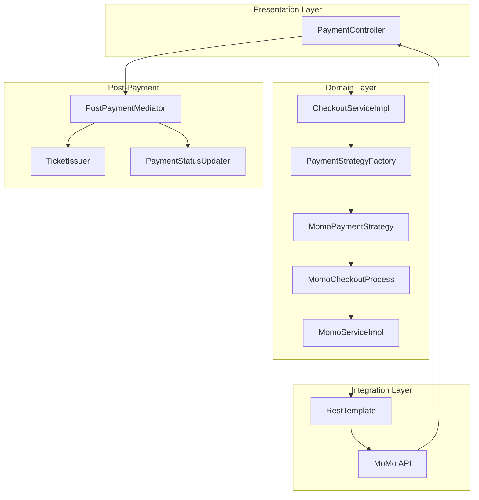
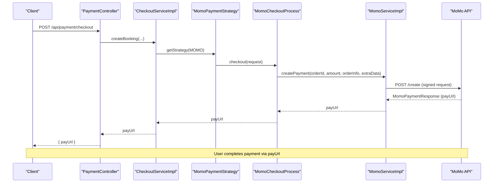
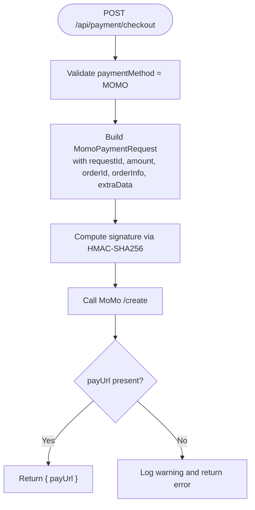
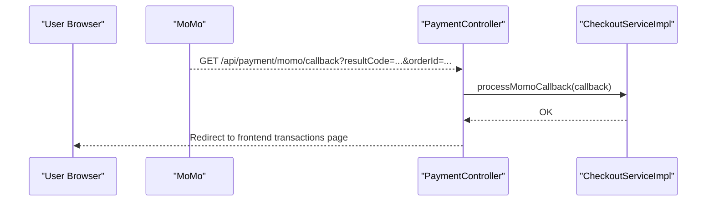
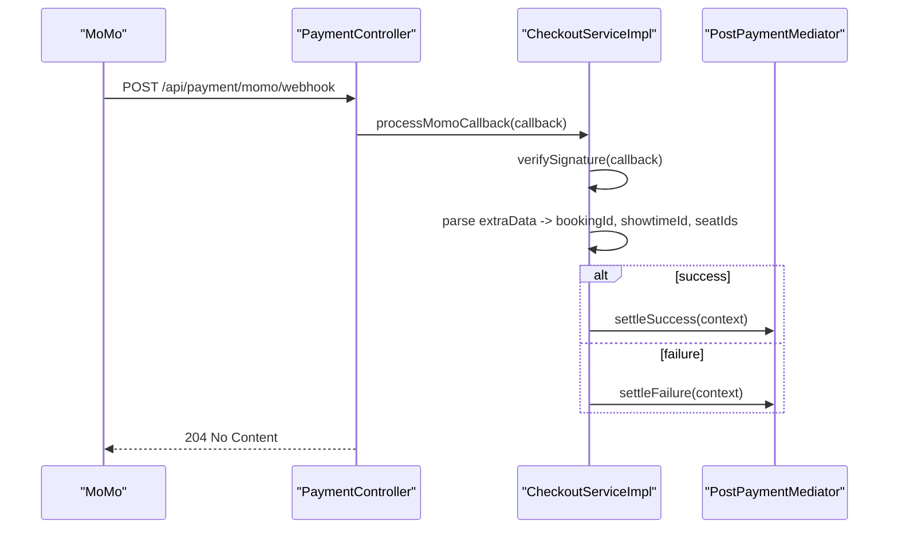
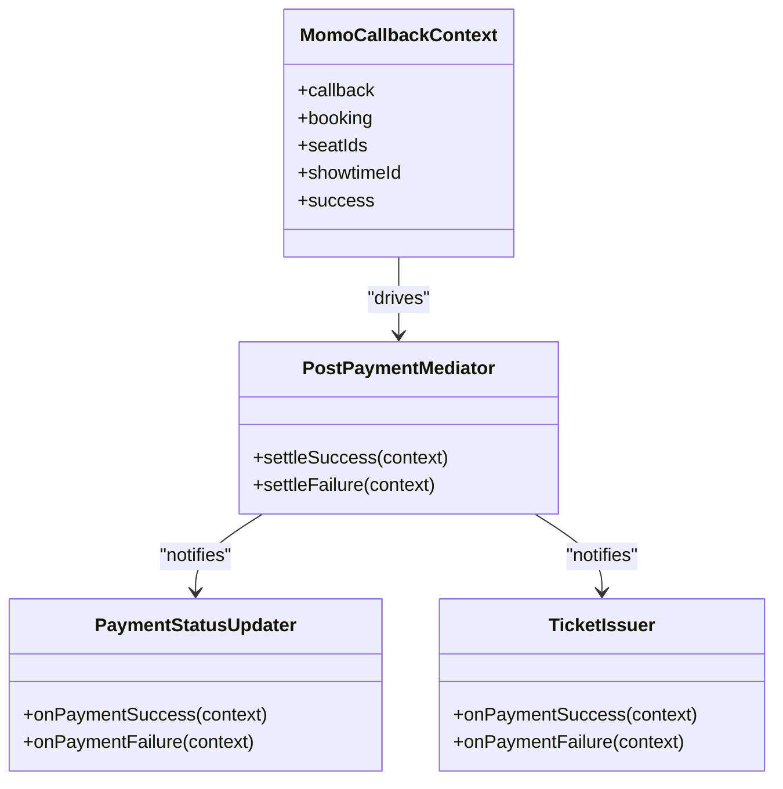
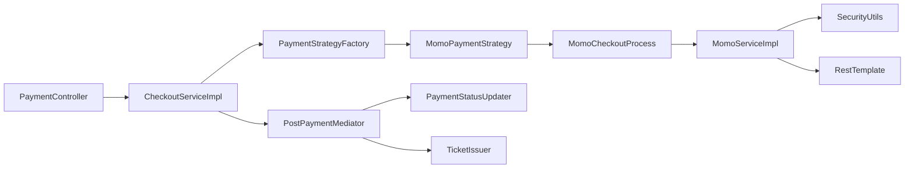

# MoMo Payment Integration

<cite>
**Referenced Files in This Document**
- [MomoPaymentRequest.java](file://backend/src/main/java/com/cinema/booking/dtos/MomoPaymentRequest.java)
- [MomoPaymentResponse.java](file://backend/src/main/java/com/cinema/booking/dtos/MomoPaymentResponse.java)
- [MomoCallbackRequest.java](file://backend/src/main/java/com/cinema/booking/dtos/MomoCallbackRequest.java)
- [MomoServiceImpl.java](file://backend/src/main/java/com/cinema/booking/services/impl/MomoServiceImpl.java)
- [MomoCheckoutProcess.java](file://backend/src/main/java/com/cinema/booking/services/template_method/checkout/MomoCheckoutProcess.java)
- [PaymentController.java](file://backend/src/main/java/com/cinema/booking/controllers/PaymentController.java)
- [CheckoutServiceImpl.java](file://backend/src/main/java/com/cinema/booking/services/impl/CheckoutServiceImpl.java)
- [SecurityUtils.java](file://backend/src/main/java/com/cinema/booking/security/SecurityUtils.java)
- [MomoCallbackContext.java](file://backend/src/main/java/com/cinema/booking/patterns/mediator/MomoCallbackContext.java)
- [PostPaymentMediator.java](file://backend/src/main/java/com/cinema/booking/patterns/mediator/PostPaymentMediator.java)
- [TicketIssuer.java](file://backend/src/main/java/com/cinema/booking/patterns/mediator/TicketIssuer.java)
- [PaymentStatusUpdater.java](file://backend/src/main/java/com/cinema/booking/patterns/mediator/PaymentStatusUpdater.java)
- [MomoPaymentStrategy.java](file://backend/src/main/java/com/cinema/booking/services/payment/MomoPaymentStrategy.java)
- [PaymentServiceImpl.java](file://backend/src/main/java/com/cinema/booking/services/impl/PaymentServiceImpl.java)
</cite>

## Table of Contents
1. [Introduction](#introduction)
2. [Project Structure](#project-structure)
3. [Core Components](#core-components)
4. [Architecture Overview](#architecture-overview)
5. [Detailed Component Analysis](#detailed-component-analysis)
6. [Dependency Analysis](#dependency-analysis)
7. [Performance Considerations](#performance-considerations)
8. [Troubleshooting Guide](#troubleshooting-guide)
9. [Conclusion](#conclusion)
10. [Appendices](#appendices)

## Introduction
This document explains the MoMo payment integration in the backend system. It covers how payment requests are created, how the MoMo API is called, how responses are handled, and how webhooks are processed. It also documents the DTOs used for MoMo requests and responses, the callback model, and the post-payment workflow using a Mediator pattern. Practical guidance is included for sandbox testing and production deployment, along with security considerations such as signature verification and data protection.

## Project Structure
The MoMo integration spans several layers:
- Controllers expose endpoints for initiating checkout, handling redirect callbacks, and processing IPN webhooks.
- Services orchestrate the checkout flow, call MoMo APIs, and manage post-payment actions.
- DTOs define the MoMo request/response payloads and callback data.
- Security utilities implement HMAC-SHA256 signing for request signatures.
- A Mediator pattern coordinates post-payment actions such as updating booking/payment statuses and issuing tickets.

**Diagram sources**
- [PaymentController.java:1-150](file://backend/src/main/java/com/cinema/booking/controllers/PaymentController.java#L1-L150)
- [CheckoutServiceImpl.java:1-185](file://backend/src/main/java/com/cinema/booking/services/impl/CheckoutServiceImpl.java#L1-L185)
- [MomoPaymentStrategy.java:1-27](file://backend/src/main/java/com/cinema/booking/services/payment/MomoPaymentStrategy.java#L1-L27)
- [MomoCheckoutProcess.java:1-70](file://backend/src/main/java/com/cinema/booking/services/template_method/checkout/MomoCheckoutProcess.java#L1-L70)
- [MomoServiceImpl.java:1-95](file://backend/src/main/java/com/cinema/booking/services/impl/MomoServiceImpl.java#L1-L95)
- [PostPaymentMediator.java:1-47](file://backend/src/main/java/com/cinema/booking/patterns/mediator/PostPaymentMediator.java#L1-L47)
- [TicketIssuer.java:1-61](file://backend/src/main/java/com/cinema/booking/patterns/mediator/TicketIssuer.java#L1-L61)
- [PaymentStatusUpdater.java:1-59](file://backend/src/main/java/com/cinema/booking/patterns/mediator/PaymentStatusUpdater.java#L1-L59)

**Section sources**
- [PaymentController.java:1-150](file://backend/src/main/java/com/cinema/booking/controllers/PaymentController.java#L1-L150)
- [CheckoutServiceImpl.java:1-185](file://backend/src/main/java/com/cinema/booking/services/impl/CheckoutServiceImpl.java#L1-L185)
- [MomoServiceImpl.java:1-95](file://backend/src/main/java/com/cinema/booking/services/impl/MomoServiceImpl.java#L1-L95)

## Core Components
- MoMoPaymentRequest: Encapsulates the payload sent to MoMo to initiate a payment. Fields include identifiers, amounts, URLs, language, extra metadata, and a cryptographic signature.
- MoMoPaymentResponse: Encapsulates the response from MoMo, including result code, message, and the payment URL or deep-link/QR code for redirection.
- MomoCallbackRequest: Encapsulates the callback payload received via redirect and IPN, including order identifiers, amount, result code, and signature for verification.
- MomoServiceImpl: Implements MoMo request signing and API invocation, returning a payment URL for redirect.
- MomoCheckoutProcess: Template method step that builds the MoMo request, calls the service, and returns the redirect URL.
- PaymentController: Exposes endpoints for checkout initiation, redirect callback, and IPN webhook handling.
- CheckoutServiceImpl: Validates callbacks, decodes extraData, and triggers the Mediator to finalize booking/payment states.
- SecurityUtils: Provides HMAC-SHA256 signing used to compute MoMo signatures.
- PostPaymentMediator and Colleagues: Orchestrates post-payment actions such as ticket issuance and payment status updates.

**Section sources**
- [MomoPaymentRequest.java:1-23](file://backend/src/main/java/com/cinema/booking/dtos/MomoPaymentRequest.java#L1-L23)
- [MomoPaymentResponse.java:1-18](file://backend/src/main/java/com/cinema/booking/dtos/MomoPaymentResponse.java#L1-L18)
- [MomoCallbackRequest.java:1-21](file://backend/src/main/java/com/cinema/booking/dtos/MomoCallbackRequest.java#L1-L21)
- [MomoServiceImpl.java:1-95](file://backend/src/main/java/com/cinema/booking/services/impl/MomoServiceImpl.java#L1-L95)
- [MomoCheckoutProcess.java:1-70](file://backend/src/main/java/com/cinema/booking/services/template_method/checkout/MomoCheckoutProcess.java#L1-L70)
- [PaymentController.java:1-150](file://backend/src/main/java/com/cinema/booking/controllers/PaymentController.java#L1-L150)
- [CheckoutServiceImpl.java:1-185](file://backend/src/main/java/com/cinema/booking/services/impl/CheckoutServiceImpl.java#L1-L185)
- [SecurityUtils.java:1-27](file://backend/src/main/java/com/cinema/booking/security/SecurityUtils.java#L1-L27)
- [PostPaymentMediator.java:1-47](file://backend/src/main/java/com/cinema/booking/patterns/mediator/PostPaymentMediator.java#L1-L47)
- [TicketIssuer.java:1-61](file://backend/src/main/java/com/cinema/booking/patterns/mediator/TicketIssuer.java#L1-L61)
- [PaymentStatusUpdater.java:1-59](file://backend/src/main/java/com/cinema/booking/patterns/mediator/PaymentStatusUpdater.java#L1-L59)

## Architecture Overview
The MoMo integration follows a layered architecture:
- Presentation: PaymentController exposes HTTP endpoints for checkout, redirect callback, and IPN.
- Domain: CheckoutServiceImpl orchestrates the checkout flow and callback processing.
- Integration: MomoServiceImpl signs requests and calls MoMo’s API via RestTemplate.
- Post-payment: Mediator pattern coordinates side effects after payment completion.

**Diagram sources**
- [PaymentController.java:31-51](file://backend/src/main/java/com/cinema/booking/controllers/PaymentController.java#L31-L51)
- [CheckoutServiceImpl.java:44-64](file://backend/src/main/java/com/cinema/booking/services/impl/CheckoutServiceImpl.java#L44-L64)
- [MomoPaymentStrategy.java:17-25](file://backend/src/main/java/com/cinema/booking/services/payment/MomoPaymentStrategy.java#L17-L25)
- [MomoCheckoutProcess.java:46-58](file://backend/src/main/java/com/cinema/booking/services/template_method/checkout/MomoCheckoutProcess.java#L46-L58)
- [MomoServiceImpl.java:42-86](file://backend/src/main/java/com/cinema/booking/services/impl/MomoServiceImpl.java#L42-L86)

## Detailed Component Analysis

### MoMoPaymentRequest DTO
Purpose: Defines the request body sent to MoMo to create a payment session.
Key fields:
- partnerCode, partnerName, storeId: Merchant identity.
- requestId: Unique request identifier generated per transaction.
- amount: Payment amount in the smallest currency unit.
- orderId: Application-generated order identifier.
- orderInfo: Human-readable description of the order.
- redirectUrl: URL to which MoMo redirects the user after payment.
- ipnUrl: Server-to-server notification endpoint.
- lang: Language for MoMo UI.
- extraData: Encoded metadata (e.g., bookingId|showtimeId|seatIds).
- requestType: MoMo request type (e.g., captureWallet).
- signature: HMAC-SHA256 signature over a canonical string.

Implementation highlights:
- Signature construction uses a fixed key ordering and secret key.
- The service sets partnerName/storeId consistently and uses a standardized lang value.

**Section sources**
- [MomoPaymentRequest.java:8-22](file://backend/src/main/java/com/cinema/booking/dtos/MomoPaymentRequest.java#L8-L22)
- [MomoServiceImpl.java:47-76](file://backend/src/main/java/com/cinema/booking/services/impl/MomoServiceImpl.java#L47-L76)
- [SecurityUtils.java:9-16](file://backend/src/main/java/com/cinema/booking/security/SecurityUtils.java#L9-L16)

### MoMoPaymentResponse DTO
Purpose: Captures MoMo’s response to a payment creation request.
Key fields:
- partnerCode, orderId, requestId, amount: Echoed identifiers.
- responseTime: Timestamp-like field.
- message: Status message.
- resultCode: 0 indicates success; non-zero indicates failure.
- payUrl: URL to redirect the user to complete payment.
- deeplink: Alternative deep-link for mobile.
- qrCodeUrl: QR code URL for QR-based payment.

Processing notes:
- The service logs result code and message.
- payUrl is extracted and returned to the client for redirect.

**Section sources**
- [MomoPaymentResponse.java:6-17](file://backend/src/main/java/com/cinema/booking/dtos/MomoPaymentResponse.java#L6-L17)
- [MomoServiceImpl.java:78-85](file://backend/src/main/java/com/cinema/booking/services/impl/MomoServiceImpl.java#L78-L85)

### MomoCallbackRequest DTO
Purpose: Represents the callback payload delivered by MoMo either via redirect or IPN.
Key fields:
- partnerCode, orderId, requestId, amount, orderInfo, orderType, transId, resultCode, message, payType, responseTime, extraData, signature.
- signature: Used to verify callback authenticity.

Processing notes:
- The service verifies the signature before trusting the callback.
- extraData is parsed to extract bookingId, showtimeId, and seatIds.

**Section sources**
- [MomoCallbackRequest.java:6-20](file://backend/src/main/java/com/cinema/booking/dtos/MomoCallbackRequest.java#L6-L20)
- [CheckoutServiceImpl.java:68-130](file://backend/src/main/java/com/cinema/booking/services/impl/CheckoutServiceImpl.java#L68-L130)

### MoMo Service Implementation
Responsibilities:
- Build signed MoMo requests with canonical key ordering.
- Call MoMo’s /create endpoint via RestTemplate.
- Return the payUrl for redirect.
- Provide signature verification hook for callbacks.

Signature generation:
- Uses HMAC-SHA256 over a deterministic string built from accessKey, amount, extraData, ipnUrl, orderId, orderInfo, partnerCode, redirectUrl, requestId, and requestType.
- Leverages SecurityUtils.hmacSha256.

Error handling:
- Logs warnings when payUrl is missing.
- Returns the response object for downstream processing.

**Section sources**
- [MomoServiceImpl.java:42-95](file://backend/src/main/java/com/cinema/booking/services/impl/MomoServiceImpl.java#L42-L95)
- [SecurityUtils.java:9-16](file://backend/src/main/java/com/cinema/booking/security/SecurityUtils.java#L9-L16)

### Payment Initiation Flow
Steps:
- Client posts checkout details to /api/payment/checkout.
- Backend validates payment method and delegates to MomoPaymentStrategy.
- MomoCheckoutProcess constructs extraData (bookingId|showtimeId|seatIds) and calls MomoServiceImpl.createPayment.
- MomoServiceImpl signs the request and posts to MoMo’s /create endpoint.
- On success, payUrl is returned to the client for redirect.

**Diagram sources**
- [PaymentController.java:31-51](file://backend/src/main/java/com/cinema/booking/controllers/PaymentController.java#L31-L51)
- [MomoCheckoutProcess.java:46-58](file://backend/src/main/java/com/cinema/booking/services/template_method/checkout/MomoCheckoutProcess.java#L46-L58)
- [MomoServiceImpl.java:42-86](file://backend/src/main/java/com/cinema/booking/services/impl/MomoServiceImpl.java#L42-L86)

**Section sources**
- [PaymentController.java:31-51](file://backend/src/main/java/com/cinema/booking/controllers/PaymentController.java#L31-L51)
- [MomoCheckoutProcess.java:46-58](file://backend/src/main/java/com/cinema/booking/services/template_method/checkout/MomoCheckoutProcess.java#L46-L58)
- [MomoServiceImpl.java:42-86](file://backend/src/main/java/com/cinema/booking/services/impl/MomoServiceImpl.java#L42-L86)

### Redirect URL Handling
Behavior:
- After payment completion, MoMo redirects the user to /api/payment/momo/callback with query parameters.
- The controller extracts the callback, forwards to CheckoutServiceImpl, and redirects the user to the frontend transactions page with success/failure indicators.

**Diagram sources**
- [PaymentController.java:74-88](file://backend/src/main/java/com/cinema/booking/controllers/PaymentController.java#L74-L88)
- [CheckoutServiceImpl.java:68-130](file://backend/src/main/java/com/cinema/booking/services/impl/CheckoutServiceImpl.java#L68-L130)

**Section sources**
- [PaymentController.java:74-88](file://backend/src/main/java/com/cinema/booking/controllers/PaymentController.java#L74-L88)
- [CheckoutServiceImpl.java:68-130](file://backend/src/main/java/com/cinema/booking/services/impl/CheckoutServiceImpl.java#L68-L130)

### IPN Webhook Handling
Behavior:
- MoMo calls /api/payment/momo/webhook with a JSON body containing the callback.
- The controller delegates to CheckoutServiceImpl, which verifies the signature and decodes extraData.
- The Mediator pattern executes post-payment actions depending on success or failure.

**Diagram sources**
- [PaymentController.java:90-100](file://backend/src/main/java/com/cinema/booking/controllers/PaymentController.java#L90-L100)
- [CheckoutServiceImpl.java:68-130](file://backend/src/main/java/com/cinema/booking/services/impl/CheckoutServiceImpl.java#L68-L130)
- [PostPaymentMediator.java:35-45](file://backend/src/main/java/com/cinema/booking/patterns/mediator/PostPaymentMediator.java#L35-L45)

**Section sources**
- [PaymentController.java:90-100](file://backend/src/main/java/com/cinema/booking/controllers/PaymentController.java#L90-L100)
- [CheckoutServiceImpl.java:68-130](file://backend/src/main/java/com/cinema/booking/services/impl/CheckoutServiceImpl.java#L68-L130)
- [PostPaymentMediator.java:1-47](file://backend/src/main/java/com/cinema/booking/patterns/mediator/PostPaymentMediator.java#L1-L47)

### Post-Payment Workflow (Mediator Pattern)
On successful payment:
- PaymentStatusUpdater marks the pending MoMo payment as SUCCESS and records paidAt.
- TicketIssuer creates tickets for the provided seatIds and showtimeId.
- Other colleagues (BookingStatusUpdater, PromotionInventoryRollback, FnbInventoryRollback, UserSpendingUpdater, TicketEmailNotifier) are invoked in order.

**Diagram sources**
- [PostPaymentMediator.java:1-47](file://backend/src/main/java/com/cinema/booking/patterns/mediator/PostPaymentMediator.java#L1-L47)
- [PaymentStatusUpdater.java:1-59](file://backend/src/main/java/com/cinema/booking/patterns/mediator/PaymentStatusUpdater.java#L1-L59)
- [TicketIssuer.java:1-61](file://backend/src/main/java/com/cinema/booking/patterns/mediator/TicketIssuer.java#L1-L61)
- [MomoCallbackContext.java:1-19](file://backend/src/main/java/com/cinema/booking/patterns/mediator/MomoCallbackContext.java#L1-L19)

**Section sources**
- [PostPaymentMediator.java:1-47](file://backend/src/main/java/com/cinema/booking/patterns/mediator/PostPaymentMediator.java#L1-L47)
- [PaymentStatusUpdater.java:1-59](file://backend/src/main/java/com/cinema/booking/patterns/mediator/PaymentStatusUpdater.java#L1-L59)
- [TicketIssuer.java:1-61](file://backend/src/main/java/com/cinema/booking/patterns/mediator/TicketIssuer.java#L1-L61)
- [MomoCallbackContext.java:1-19](file://backend/src/main/java/com/cinema/booking/patterns/mediator/MomoCallbackContext.java#L1-L19)

### Payment Confirmation and History
- Payment confirmation is reflected in PaymentStatusUpdater marking the payment as SUCCESS.
- Users can retrieve payment history and details via dedicated endpoints.

**Section sources**
- [PaymentStatusUpdater.java:18-41](file://backend/src/main/java/com/cinema/booking/patterns/mediator/PaymentStatusUpdater.java#L18-L41)
- [PaymentServiceImpl.java:23-68](file://backend/src/main/java/com/cinema/booking/services/impl/PaymentServiceImpl.java#L23-L68)
- [PaymentController.java:110-131](file://backend/src/main/java/com/cinema/booking/controllers/PaymentController.java#L110-L131)

## Dependency Analysis
- Controllers depend on services for checkout and payment history.
- CheckoutServiceImpl depends on PaymentStrategyFactory, MomoService, and the Mediator.
- MomoPaymentStrategy delegates to MomoCheckoutProcess.
- MomoCheckoutProcess depends on MomoService.
- MomoServiceImpl depends on SecurityUtils and RestTemplate.
- Post-payment colleagues depend on repositories to update state.

**Diagram sources**
- [PaymentController.java:1-150](file://backend/src/main/java/com/cinema/booking/controllers/PaymentController.java#L1-L150)
- [CheckoutServiceImpl.java:1-185](file://backend/src/main/java/com/cinema/booking/services/impl/CheckoutServiceImpl.java#L1-L185)
- [MomoPaymentStrategy.java:1-27](file://backend/src/main/java/com/cinema/booking/services/payment/MomoPaymentStrategy.java#L1-L27)
- [MomoCheckoutProcess.java:1-70](file://backend/src/main/java/com/cinema/booking/services/template_method/checkout/MomoCheckoutProcess.java#L1-L70)
- [MomoServiceImpl.java:1-95](file://backend/src/main/java/com/cinema/booking/services/impl/MomoServiceImpl.java#L1-L95)
- [SecurityUtils.java:1-27](file://backend/src/main/java/com/cinema/booking/security/SecurityUtils.java#L1-L27)
- [PostPaymentMediator.java:1-47](file://backend/src/main/java/com/cinema/booking/patterns/mediator/PostPaymentMediator.java#L1-L47)
- [PaymentStatusUpdater.java:1-59](file://backend/src/main/java/com/cinema/booking/patterns/mediator/PaymentStatusUpdater.java#L1-L59)
- [TicketIssuer.java:1-61](file://backend/src/main/java/com/cinema/booking/patterns/mediator/TicketIssuer.java#L1-L61)

**Section sources**
- [PaymentController.java:1-150](file://backend/src/main/java/com/cinema/booking/controllers/PaymentController.java#L1-L150)
- [CheckoutServiceImpl.java:1-185](file://backend/src/main/java/com/cinema/booking/services/impl/CheckoutServiceImpl.java#L1-L185)
- [MomoServiceImpl.java:1-95](file://backend/src/main/java/com/cinema/booking/services/impl/MomoServiceImpl.java#L1-L95)

## Performance Considerations
- Network latency: Calls to MoMo’s /create endpoint introduce external latency; consider timeouts and retries at the RestTemplate level.
- Signature computation: HMAC-SHA256 is lightweight but avoid repeated recomputation by caching where appropriate.
- Callback processing: Decode extraData once and validate early to fail fast.
- Batch operations: When issuing tickets, batch writes to reduce database round trips.

[No sources needed since this section provides general guidance]

## Troubleshooting Guide
Common issues and resolutions:
- Missing payUrl: The service logs a warning when payUrl is null; verify endpoint configuration and signature correctness.
- Invalid signature: Ensure the canonical key ordering matches MoMo’s expectations and the secretKey is correct.
- Missing extraData: Fail gracefully if extraData is absent; ensure the frontend passes encoded bookingId|showtimeId|seatIds.
- Redirect vs IPN timing: Prefer IPN for reliable server-side confirmation; redirect is user-facing and may be blocked or not reached.
- Sandbox testing: Use the development flag to simulate success during testing; ensure IPN and redirect endpoints are reachable.

**Section sources**
- [MomoServiceImpl.java:78-85](file://backend/src/main/java/com/cinema/booking/services/impl/MomoServiceImpl.java#L78-L85)
- [CheckoutServiceImpl.java:68-130](file://backend/src/main/java/com/cinema/booking/services/impl/CheckoutServiceImpl.java#L68-L130)

## Conclusion
The MoMo integration is structured around clean separation of concerns: request creation and signing, API communication, response handling, and robust post-payment orchestration. The Mediator pattern ensures that side effects are coordinated reliably. Security is addressed through HMAC-SHA256 signing and signature verification. With proper sandbox testing and production hardening, the system supports scalable and secure payment processing.

[No sources needed since this section summarizes without analyzing specific files]

## Appendices

### API Endpoints Summary
- POST /api/payment/checkout: Initiates checkout and returns payUrl.
- GET /api/payment/momo/callback: Handles redirect callback and redirects to frontend.
- POST /api/payment/momo/webhook: Processes IPN webhook.
- GET /api/payment/history/{userId}: Retrieves user payment history.
- GET /api/payment/details/{paymentId}: Retrieves payment details.

**Section sources**
- [PaymentController.java:31-131](file://backend/src/main/java/com/cinema/booking/controllers/PaymentController.java#L31-L131)

### Sandbox Testing Setup
- Enable development mode flag to simulate success for testing.
- Ensure redirectUrl and ipnUrl are publicly accessible.
- Verify signature verification logic and endpoint reachability.

**Section sources**
- [CheckoutServiceImpl.java:28-29](file://backend/src/main/java/com/cinema/booking/services/impl/CheckoutServiceImpl.java#L28-L29)

### Production Deployment Considerations
- Environment variables: endpoint, partnerCode, accessKey, secretKey, redirectUrl, ipnUrl.
- Timeout and retry policies for RestTemplate.
- HTTPS enforcement for all endpoints.
- Logging and monitoring for callback processing and payment status transitions.

**Section sources**
- [MomoServiceImpl.java:17-33](file://backend/src/main/java/com/cinema/booking/services/impl/MomoServiceImpl.java#L17-L33)

### Security Measures
- Signature verification: Use HMAC-SHA256 with the canonical key ordering and shared secretKey.
- Data protection: Avoid logging sensitive fields; sanitize logs.
- Transport security: Enforce TLS for all communications.

**Section sources**
- [SecurityUtils.java:9-16](file://backend/src/main/java/com/cinema/booking/security/SecurityUtils.java#L9-L16)
- [MomoServiceImpl.java:89-93](file://backend/src/main/java/com/cinema/booking/services/impl/MomoServiceImpl.java#L89-L93)